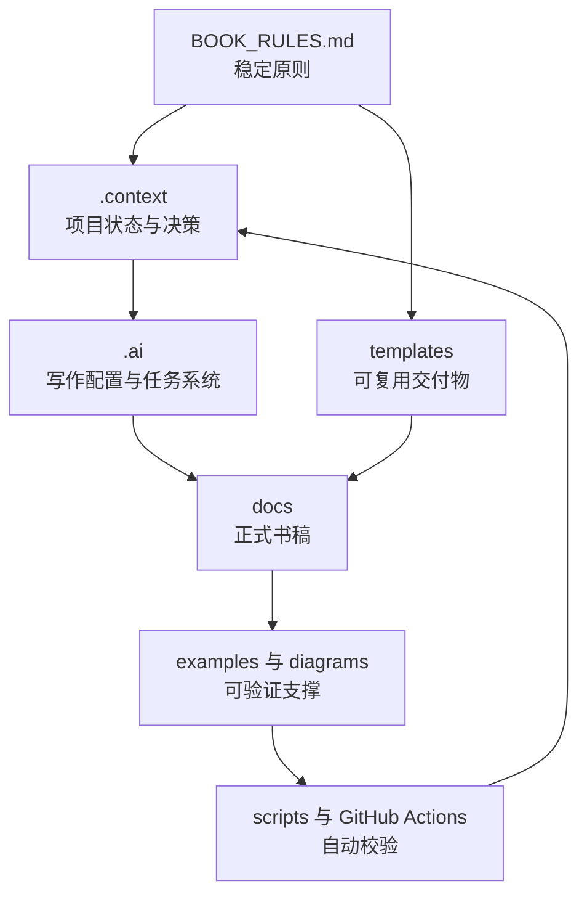

# Architecture

## 分层模型

## 目录职责

- 根目录入口文件负责定义如何开始，而不是重复全部规则。
- `.context/` 保存可变的项目事实；`.memory/` 保存较稳定的历史原因和经验。
- `.ai/` 保存 AI 可读取的任务状态、提示词、术语、引用和审查配置。
- `docs/` 是出版内容的唯一源；`templates/` 和 `examples/` 只提供生产能力，不替代书稿。
- `scripts/` 与 `.github/workflows/` 让本地与 GitHub 使用同一质量门槛。

## 生命周期

章节在 Research → Outline → Draft → Review → Example → Diagram → Fact Check → Language Edit → Validate → Completion 的状态机中推进。`.ai/progress.md` 记录阶段，`.context/CURRENT_STATE.md` 记录当前真实工作面。
