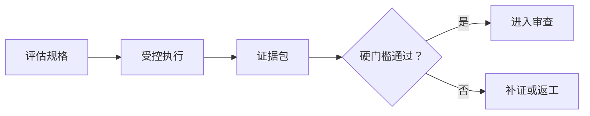
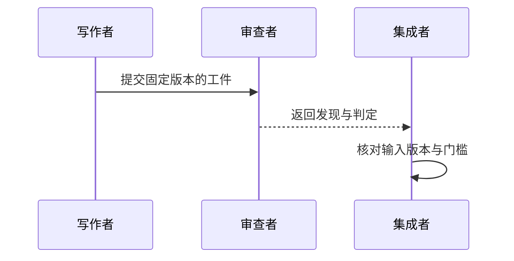

# 附录 G：Mermaid Guide

Mermaid 图是正文论证的一部分，不是装饰。可维护图示必须同时满足语义正确、源码可追踪、正文一致、可渲染和目标尺寸可读。本附录给出本书的语法、命名与审查约定；仓库级资产规则以 [`diagrams/README.md`](../../diagrams/README.md) 为准，本附录不另建第二套资产状态。

## G1：先写图示问题

创建源码前填写：

```markdown
# Diagram Contract

- 本图只回答：
- 读者看完应能判断：
- 图中必须包含：
- 明确不包含：
- 节点和状态的正文定义：
- 箭头分别表示：
- 正文放置位置：
- 替代文本：
```

如果一句话不能说明图要回答的问题，就先拆分问题，不要直接增加节点。

## G2：文件与命名

- Mermaid 权威源码保存在 `diagrams/mermaid/`。
- 文件名使用 `chapter-NN-topic.mmd`，其中 `topic` 是稳定、简短的英文主题。
- 导出图保存在 `diagrams/exported/`，与源码使用相同基名。
- 节点 ID 使用稳定的英文小写标识；可见标签使用正文术语。
- 状态、角色、工件和动作不要混用同一命名形式。
- 重命名正文术语时，同时搜索源码、正文代码块、读图说明和替代文本。

示例：



这里 `spec`、`run` 等是稳定 ID，方括号内是读者可见标签。箭头表示阶段推进，不应在正文中解释为数据复制或权限授予。

## G3：图类型选择

| 要回答的问题 | 优先图类型 | 不适合承载 |
| --- | --- | --- |
| 阶段如何推进、失败如何返回 | `flowchart` | 精确时间顺序 |
| 角色之间按什么顺序交互 | `sequenceDiagram` | 大量静态分类 |
| 一个对象允许哪些状态迁移 | `stateDiagram-v2` | 组织结构 |
| 类型或概念如何分组 | `classDiagram` 或小型 `flowchart` | 运行时先后 |

图类型只是语法选择，不会自动保证模型正确。复杂系统优先拆成多个各答一问的小图。

## G4：语法和标签规则

- 每个 `.mmd` 文件只保留 Mermaid 源码，不包裹 Markdown 围栏。
- 正文内使用 `mermaid` 代码围栏，并与源文件逐字符保持一致。
- 节点标签包含括号、冒号或特殊符号时使用引号，避免解析歧义。
- 连线标签使用简短条件，如“通过”“失败”“需要批准”；详细原因放正文。
- 同一图中的箭头方向保持稳定，避免一部分表达控制流、另一部分表达所有权。
- 颜色只作辅助，状态差异还要用文字、形状或连线标签表达。
- 不依赖未声明的主题样式表达语义。

顺序图示例：



## G5：源码与正文一致性

一致性审查至少覆盖：

- [ ] 正文 Mermaid 代码块与对应 `.mmd` 源文件完全一致。
- [ ] 文件名、章节号和正文引用指向同一主题。
- [ ] 正文提到的节点、状态和返回路径确实存在于图中。
- [ ] 图中每个缩写和专有术语都在正文或术语表中定义。
- [ ] 修改图后重新检查读图说明和替代文本。

可用仓库已有工具或临时脚本提取正文代码块后执行 `diff -u`。比较时必须指定唯一正文代码块；若一章有多张图，应按图名逐一比较，不能把整章所有 Mermaid 块拼接后声称一致。

```text
diff -u <从正文提取的单个 Mermaid 代码块> <对应的 .mmd 文件>
```

尖括号内容是说明性占位符，不是可直接执行的路径。

## G6：渲染验证

优先使用仓库已经锁定的渲染命令和依赖。使用 Mermaid CLI 时必须固定版本，不要在验证时静默升级渲染器；如果命令会下载包或访问网络，应先获得对应授权并记录该外部动作。

```text
npx --yes @mermaid-js/mermaid-cli@<项目固定版本> \
  -i diagrams/mermaid/<图名>.mmd \
  -o diagrams/exported/<图名>.svg

npx --yes @mermaid-js/mermaid-cli@<项目固定版本> \
  -i diagrams/mermaid/<图名>.mmd \
  -o diagrams/exported/<图名>.png
```

尖括号内容必须替换为仓库核验过的实际值；版本固定只限制升级，不表示包已安装、来源可信或允许联网。渲染记录至少包含源码路径、渲染器版本、命令、退出状态和发布契约要求的输出路径。命令退出为零只证明语法可处理，不证明图的含义或视觉质量正确。

若环境无法安装或运行渲染器：

1. 保存未渲染原因和实际错误。
2. 不把源码检查写成“图示已验证”。
3. 将状态保留为 `needs_render`，交给具备环境的责任者。

## G7：视觉审查

必须打开真实 PNG 或 SVG，在目标阅读尺寸下检查：

- [ ] 标题、节点和连线标签未被裁切或覆盖。
- [ ] 最小字号在页面和移动端仍可读。
- [ ] 分支方向、返回路径和箭头端点没有视觉歧义。
- [ ] 长标签没有把图拉成超宽画布；必要时缩短标签并由正文解释。
- [ ] 颜色对比足够，灰度或色觉差异下仍能区分关键状态。
- [ ] 图没有依靠装饰性节点、阴影或颜色制造不存在的层级。
- [ ] 图与上下文相邻，读者无需跨多页寻找说明。

视觉审查发现过密时，优先删除非问题节点或拆图，不要只缩小字体。

## G8：语义与可访问性审查

- [ ] 图的入口、终点、失败出口和人工决定点清晰。
- [ ] 箭头含义在图例或正文中唯一，不把“发送”“依赖”“批准”画成同一种未标注连线。
- [ ] 图示结论与正文限定一致，没有把候选状态画成最终批准。
- [ ] 替代文本描述图所表达的关系或流程，而不是“这是一张流程图”。
- [ ] 正文提供不依赖颜色和空间位置的等价解释。
- [ ] 外部图形、数据或改编来源的许可与归属已记录。

## G9：Diagram Review Record

```markdown
# Diagram Review：<图名>

- 回答的问题：
- 源码路径：
- 正文路径和代码块位置：
- 源码/正文一致性：pass / fail
- 渲染器及版本：
- 渲染命令和退出状态：
- 导出图路径（按发布契约列出 SVG、PNG 等）：
- 视觉审查：pass / fail / needs_rework
- 术语与箭头语义：
- 替代文本：
- 许可或归属：
- 未验证范围：
- 审查者和日期：
```

图示完成的最低条件是：问题明确、源码与正文一致、语法实际渲染、导出图人工可读、语义与正文一致。缺少任一项时，保留对应失败状态，不用“图已生成”替代完整审查。
