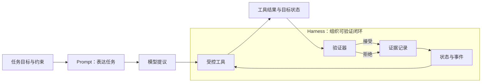

# 01. 从 Prompt Engineering 到 Harness Engineering

> 本章讨论一种工程视角的转变：Prompt 用于表达目标和约束；Harness 用于把任务执行、观察、验证和证据组织成可检查的闭环。这里的 Harness 是本书采用的工程定义，不是统一的行业标准或某个产品名称。

## 本章目标

完成本章后，读者能够：

- 区分“模型给出了建议”“工具被调用”和“目标状态已经验证”三种不同事实。
- 说明 Prompt Engineering 在任务系统中的职责，以及它单独不能保证的事情。
- 为一个有外部副作用的任务识别指令、状态、工具、验证和证据五个最小部件。
- 读懂本章最小示例的成功、工具失败和验证拒绝三条路径。

## 为什么要学

设想一个任务：让 Agent 修复失败的测试。一个 Prompt 可以要求它阅读报错、修改代码并运行测试，但这句话本身并没有回答几个工程问题：允许修改哪些文件？测试是否真的运行过？失败后是重试、回滚还是交给人？下一位维护者如何知道已经发生了什么？

如果这些问题只留在模型的一次回答里，系统很难检查，也很难从中断处恢复。本章不把 Prompt 视为被淘汰的技术；相反，Prompt 仍然负责表达任务。变化在于：当任务需要工具、外部状态和可审查结果时，必须把 Prompt 放进一个更完整的执行结构。

> 边界：本章不比较任何具体 Agent 产品，也不讨论模型训练、模型权重更新或生产环境自治。第 02 章再划分模型、Agent、Harness 和运行环境的职责。

## 前置知识

- 能阅读简单的 JavaScript 或伪代码。
- 了解“函数输入、输出和错误”的基本概念。
- 不要求使用过特定模型、CLI 或 Agent 产品。

## 场景引入：一条修复请求的三种含义

下面三句话很像，但它们提供的证据完全不同：

| 陈述 | 已知事实 | 仍然未知 |
| --- | --- | --- |
| “请修复失败测试。” | 任务意图被表达。 | 具体改动、工具权限、测试结果和是否达成目标。 |
| “我已经修改了文件。” | 模型或工具声称发生了操作。 | 修改是否在允许范围内、是否保存、是否解决问题。 |
| “测试通过，变更符合约束。” | 有机会成为完成证据。 | 仍须知道测试命令、范围、时间和失败处理是否可追溯。 |

本书将第一行归为任务表达，将后两行归为执行与验证。这个划分是工程设计选择，而非对任何来源的逐句转述。

## 核心概念

### Prompt Engineering：表达目标、约束和预期输出

Lilian Weng 在其 Prompt Engineering 文章中将这一领域描述为：在不更新模型权重的条件下，利用输入引导语言模型行为的方法。[REF-002](https://lilianweng.github.io/posts/2023-03-15-prompt-engineering/)

对工程任务而言，这一定义至少提醒我们三件事：

1. Prompt 是输入层，而不是文件系统、数据库或浏览器的替代品。
2. Prompt 可以要求模型遵守格式或顺序，但无法单独证明外部系统已经改变。
3. Prompt 仍然不可缺少，因为没有清楚的目标和约束，后续工具调用也没有可判断的方向。

例如，下面的任务表达已经比“修复它”更可操作，但它仍然不是完整任务闭环：

```text
只修改 tests/ 目录中的失败断言；先说明计划，再运行指定测试；
如果测试仍失败，报告失败证据，不要声称修复完成。
```

这段文本虽定义了部分约束，却没有保存状态、调用测试或判断测试输出；它仍需要运行时的其他部件配合。

### 从模型提议到受控行动

模型输出可以是一个提议：修改哪一行、执行什么命令、下一步应该观察什么。提议不是行动，行动也不是完成。本书把一个可验证任务拆成五个职责：

| 部件 | 最小职责 | 可观察输出 | 失败信号 |
| --- | --- | --- | --- |
| 指令（Instruction） | 说明目标、约束和停止条件。 | 结构化任务输入。 | 输入为空、范围冲突或约束缺失。 |
| 状态（State） | 保存当前阶段与已发生事件。 | 计划、调用、失败或成功事件。 | 无法说明任务处于哪个阶段。 |
| 工具（Tool） | 在授权范围执行一个明确操作。 | 结构化成功或失败结果。 | 超时、错误结果或副作用超出范围。 |
| 验证（Evaluation） | 用可观察条件判断目标是否满足。 | 接受或拒绝及原因。 | 工具成功但目标状态不满足。 |
| 证据（Evidence） | 让结果可以回读、审查和交接。 | 命令、输出摘要、状态和失败原因。 | 只能依赖自然语言的“已完成”宣称。 |

这五项是本书的工作模型。它并不意味着所有系统都应有五个独立模块；小脚本可以把其中几项放在同一函数中。关键在于每项职责都要有明确的实现位置：没有验证时，工具返回成功仍不足以说明用户目标已经达成。

### Harness：围绕模型组织闭环的系统

Weng 在 Harness Engineering 文章中把 harness 描述为围绕基础模型的系统，它负责协调执行，并决定模型如何思考和规划、调用工具和行动、感知与管理上下文、保存工件及评估结果。[REF-001](https://lilianweng.github.io/posts/2026-07-04-harness/)

本章据此采用更窄的工程定义：**Harness 是围绕模型组织指令、状态、工具、验证和证据的运行结构。** 这个定义有两个刻意限制：

- 它不把 Harness 等同于某个框架、CLI 或模型供应商。
- 它不承诺 Harness 自动带来可靠性；可靠性取决于权限、工具契约、验证器和恢复策略是否真的被实现。

早期 Agent 系统常按规划、记忆和工具使用来组织讨论；这是一种系统概览，而不是唯一架构。[REF-003](https://lilianweng.github.io/posts/2023-06-23-agent/) 第 02 章将继续拆分这些责任；本章只建立“模型输出之外仍有工程职责”的问题意识。

## 架构图：让验证决定是否接受结果

下图回答一个问题：模型提出行动后，谁来决定任务是否已经完成？图的关键不在箭头数量，而在于“工具结果”必须先经过验证，不能直接变成完成宣称。

Mermaid 源文件位于 `diagrams/mermaid/chapter-01-prompt-to-harness.mmd`；图示目录约定见 [diagrams/README.md](../../diagrams/README.md)。本次审查的导出产物为 [SVG](../../diagrams/exported/chapter-01-prompt-to-harness.svg) 与 [PNG](../../diagrams/exported/chapter-01-prompt-to-harness.png)，但 Mermaid 源码仍是唯一事实来源。



> 图示替代描述：任务目标与约束先经 Prompt 形成模型提议，再交给 Harness 内的受控工具；工具产生可观察结果，验证器对其作出接受或拒绝判断。两种判断都会写入证据记录，再回写状态与事件；状态随后约束下一次工具调用。

读图时可按以下顺序理解：

1. Prompt 把任务目标交给模型，模型输出的是提议，而不是最终事实。
2. Tool 在受控范围执行，产生工具结果和外部状态的观察。
3. Validator 用成功条件判断观察是否可接受；接受或拒绝都先交给 Evidence 记录。
4. Evidence 把带原因的结果回写到 State；拒绝后的状态可供恢复或人工升级使用。

> 注意：本图是本书的工程模型，不表示外部文章、论文或产品采用完全相同的节点和命名。

## 工作流程：把“做事”变成可检查路径

以测试修复任务为例，一个最小流程可以是：

1. **读取约束。** 确认允许修改的目录、可运行的测试和停止条件。
2. **形成提议。** 模型给出计划或候选变更；此时状态是“已计划”，而非“已完成”。
3. **受控执行。** 工具在授权范围内修改或运行命令，并返回结构化结果。
4. **重新观察。** 读取目标状态，例如测试退出码、文件内容或界面状态。
5. **验证并记录。** 无论验证器接受还是拒绝，都记录证据；拒绝时写明失败原因，再进入重试、恢复或人工升级。

这个流程也解释了为什么 ReAct 一类研究有启发性：ReAct 研究让语言模型以交错方式产生推理轨迹和任务动作，使行动能够从外部来源收集信息。[REF-004](https://arxiv.org/abs/2210.03629) 但本章不会把论文的研究设置或实验表现外推为生产系统保证；生产任务仍需要独立的权限、状态和验证设计。

## 最小示例：工具成功不等于任务成功

本仓库的 `examples/agent/minimal-harness.mjs` 不调用模型、网络、文件系统或真实密钥。它只把输入转换为大写，以隔离控制流：工具返回成功与验证器接受是两个不同条件。运行前提与命令见 [examples/agent/README.md](../../examples/agent/README.md)。

```js
import { createEchoTool, runHarness } from '../../examples/agent/minimal-harness.mjs';

const result = runHarness({
  instruction: 'Return the task in uppercase.',
  task: 'verify state',
  tool: createEchoTool(),
  validate: ({ output }) => output === 'VERIFY STATE',
});

console.log(result.state); // succeeded
```

该示例的接口和本章概念一一对应：

| 示例字段 | 本章含义 | 不能证明什么 |
| --- | --- | --- |
| `instruction` | 任务表达与约束。 | 模型理解或遵守了复杂意图。 |
| `tool(task)` | 受控工具调用。 | 工具一定安全或具有生产权限。 |
| `events` 与 `state` | 可检查的执行轨迹。 | 系统能够从任意故障自动恢复。 |
| `validate(result)` | 结果验收条件。 | 验收条件本身一定充分。 |
| `evidence` 与 `failure` | 接受或失败的可读理由。 | 已完成完整审计或合规记录。 |

运行命令如下：

```bash
npm run test:harness
npm run example:harness
```

本章仅记录这些命令的实际执行结果。测试覆盖四条路径：验证接受、工具失败、验证拒绝和空指令拒绝。示例计划中的逐步增强项（持久化状态、权限、重试与多维评估）分别留给后续章节处理。

## 完整工程案例：将修复任务从宣称变成证据

假设一个团队希望自动处理测试失败。下面不是某个真实仓库的执行记录，而是一份可审查的设计草案。

| 阶段 | 输入 | 可接受结果 | 失败处理 |
| --- | --- | --- | --- |
| 计划 | 失败测试名称、允许修改目录。 | 生成只包含允许文件的变更计划。 | 范围不清时请求人工澄清。 |
| 执行 | 已批准的补丁与测试命令。 | 工具返回修改结果和测试输出。 | 工具错误时停止，不把错误包装成完成。 |
| 验证 | 测试退出状态、受影响文件和约束。 | 指定测试通过且修改未越界。 | 验证失败时保留证据，决定重试、回滚或升级。 |
| 记录 | 计划、命令、输出摘要和决定。 | 下一位维护者能复现判断路径。 | 证据缺失时视为未完成。 |

这里最重要的选择是把“模型认为修好了”降级为一个候选信号。是否接受变更由可观察条件决定。真实团队还需要根据风险加入代码审查、权限隔离、测试环境和回滚机制；这些内容不是在本章靠一个 Prompt 就能解决的。

## 实现说明

最小示例的 `runHarness` 函数先检查 `instruction` 与 `task` 是否为非空字符串，再调用工具。工具失败时，函数记录 `tool_failed`；工具成功但验证器拒绝时，记录 `validation_failed`；只有验证器显式返回 `true`，才记录 `validated` 并将状态设为 `succeeded`。

这一顺序体现两个工程约束：

- **先验证输入，再产生副作用。** 空指令不会触发工具。
- **先验证结果，再宣称成功。** 工具返回 `ok: true` 仍可能被验证器拒绝。

这不是通用生产实现。它没有持久化、超时、并发控制、鉴权或重试，因此不能被复制后直接用于高风险环境。

## 测试与验证

| 层级 | 验证对象 | 命令或方法 | 成功标准 | 本章状态 |
| --- | --- | --- | --- | --- |
| 单元 | 四条最小控制流路径。 | `npm run test:harness` | 4 项测试通过。 | 2026-07-15：4 项通过。 |
| 可执行示例 | 接受路径的结构化结果。 | `npm run example:harness` | 输出 `succeeded`、`validator accepted tool output` 和三项成功事件。 | 2026-07-15：输出满足成功标准。 |
| Markdown | 正文、链接和状态表。 | `npm run validate` | lint、链接、示例测试和状态检查通过。 | 2026-07-15：Final Review 后检查 92 个 Markdown 文件，lint 为 0 错误；链接、8 项示例测试和状态检查通过。 |
| 图示 | Mermaid 语法和读图一致性。 | Mermaid CLI 渲染与人工审查。 | 源文件可渲染，导出 SVG/PNG 可见，术语和关键箭头与正文一致。 | 2026-07-15：Mermaid CLI 11.16.0 成功导出 SVG 和 PNG；图示审查通过。 |

本次 Final Review 后运行 `npm run validate`：92 个 Markdown 文件 lint 为 0 错误；链接检查、两套示例共 8 项 Node 内置测试和章节状态检查均通过。

## 工程实践

- 将“任务完成”写成可检查条件，而不是让模型自行总结。
- 为每一次外部调用保存最少但足够的输入、输出和失败原因。
- 将权限、重试和回滚视为工具与运行环境的职责；不要只把它们写进模糊的 Prompt。
- 当验证条件无法自动执行时，明确人工审批点，而不是伪造自动化通过。

## 最佳实践

| 推荐 | 原因 | 适用边界 |
| --- | --- | --- |
| 先实现一个确定性的验证器。 | 可以先验证控制流，再讨论模型质量。 | 不能覆盖需要主观判断的内容质量。 |
| 让失败成为结构化终态。 | 重试和交接需要知道失败发生在哪一步。 | 仍需在后续章节设计错误分类与恢复。 |
| 将示例限制在内存中。 | 教学时可避免密钥、网络和不可逆副作用干扰概念。 | 不能代表生产环境安全性。 |
| 将来源观点和工程推论分开。 | 防止把作者的工作描述误写成行业共识。 | 正文中的每项归因事实仍需逐句核验。 |

## 常见错误

| 错误 | 表现 | 根因 | 修复方向 |
| --- | --- | --- | --- |
| 把工具文本当作完成证明。 | 工具说“成功”，但目标状态没有变化。 | 没有独立验证器或重新观察。 | 在成功路径前加入可执行验收条件。 |
| 把 Prompt 当作权限系统。 | 模型被要求“不要删除文件”，但工具仍有删除权限。 | 自然语言约束没有替代执行环境限制。 | 在工具和 Sandbox 层实现最小权限。 |
| 将示例结果外推为模型能力。 | 一个确定性脚本通过，被描述为 Agent 已可靠。 | 把控制流测试与能力评估混为一谈。 | 明确示例证明的范围，并另行设计评估。 |
| 只记录最终结论。 | 任务中断后无法知道是否执行过或为何失败。 | 状态与证据没有持久化。 | 记录阶段、工具结果和拒绝理由。 |

## 安全与边界

- 本章示例不应接收真实密钥、生产路径或未经授权的命令。
- 有写入、删除、发布或对外发送副作用的工具，应在调用前检查权限，并在验证失败时有明确的停止或升级策略。
- 自动验证不能覆盖所有风险。涉及业务规则、隐私、资金或不可逆操作时，需要人类审批和审计记录。
- “Harness”是帮助分配责任的工作模型，不是安全或可靠性的认证标签。

## 章节总结

Prompt Engineering 负责把目标和约束带入模型输入；它仍是 Agent 系统的重要入口。但只要任务跨越工具、外部状态和多人交接，系统就需要额外承担状态、验证和证据责任。本书把承载这些责任的运行结构称为 Harness。

下一章将进一步区分模型、Agent、Harness 与运行环境，避免把所有问题都归因于模型或 Prompt。

## 练习

1. 为“读取配置并生成建议”设计一个最小 Harness：写出指令、状态、工具、验证和证据各自的输入与输出。
2. 一个工具返回超文本传输协议（HTTP）200 响应，但写入的数据字段缺失。请说明该任务处于哪个终态，并设计一个验证器。
3. 找出你当前使用的自动化脚本中一个“只记录成功文本、没有重新观察”的步骤，给出最小修复方案。

## 延伸阅读

- [REF-001：Harness Engineering for Self-Improvement](https://lilianweng.github.io/posts/2026-07-04-harness/)——用于理解来源作者对 Harness 的工作性描述；访问日期 2026-07-15。
- [REF-002：Prompt Engineering](https://lilianweng.github.io/posts/2023-03-15-prompt-engineering/)——用于本章 Prompt Engineering 背景定义；访问日期 2026-07-15。
- [REF-003：LLM Powered Autonomous Agents](https://lilianweng.github.io/posts/2023-06-23-agent/)——用于规划、记忆和工具使用的历史性系统概览；访问日期 2026-07-15。
- [REF-004：ReAct](https://arxiv.org/abs/2210.03629)——用于交错推理轨迹与任务动作的研究背景；访问日期 2026-07-15。

## 参考资料

- Weng, Lilian. [Harness Engineering for Self-Improvement](https://lilianweng.github.io/posts/2026-07-04-harness/). 2026-07-04. 支持本章对来源作者 Harness 工作描述的归因。
- Weng, Lilian. [Prompt Engineering](https://lilianweng.github.io/posts/2023-03-15-prompt-engineering/). 2023-03-15. 支持本章对 Prompt Engineering 背景定义的归因。
- Weng, Lilian. [LLM Powered Autonomous Agents](https://lilianweng.github.io/posts/2023-06-23-agent/). 2023-06-23. 支持规划、记忆和工具使用的历史性系统概览。
- Yao, Shunyu, et al. [ReAct: Synergizing Reasoning and Acting in Language Models](https://arxiv.org/abs/2210.03629). arXiv:2210.03629，v3（2023-03-10）。支持本章关于交错推理轨迹与任务动作的研究对象描述。

## 章节完成检查表

- [x] Front matter、目标、前置知识和章节依赖完整。
- [x] 内容以原创场景、图示和工程推导组织，未逐句翻译来源。
- [x] 来源观点、本书工程扩展和示例边界已区分。
- [x] 图示有 Mermaid 源码、读图说明、替代描述和一致术语。
- [x] 示例有路径、环境边界、运行命令和成功条件。
- [x] Technical Review、Example Implementation、Diagram Review 与 Fact Check 已完成。
- [x] Language Editing 已完成；仅做表达、术语和叙述一致性编辑，未扩大已核验事实范围。
- [x] Final Review 已完成；跨工件完成定义审查与最终校验记录位于 `.memory/reviews/2026-07-15-chapter-01-final-review.md`。
- [x] 本章 Draft 完成后的校验结果已回填。
- [x] `.ai/progress.md`、`CURRENT_STATE.md`、`NEXT_TASK.md` 与交接已更新。
