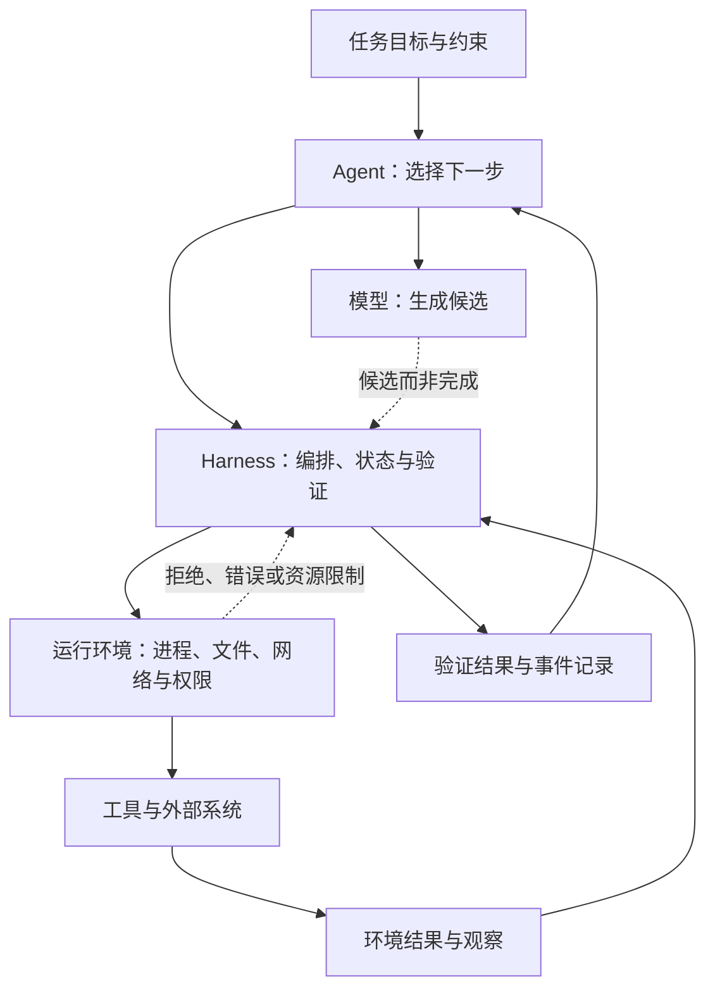

# 02. Agent、Harness 与运行环境

> 本章使用一个诊断性工作模型：模型生成候选；Agent 决定下一步；Harness 组织执行、状态和验证；运行环境提供实际资源与权限。它不是统一的行业标准，也不描述任何特定产品的内部架构。

## 本章目标

完成本章后，读者能够：

- 区分模型输出、Agent 决策、Harness 编排和运行环境结果四种不同信号。
- 为一次失败列出优先收集的证据，而不直接把问题归因于模型。
- 说明权限拒绝、工具错误与验证失败为什么不能被同一种“重试”处理。
- 用“问题—工件—判定”和“假设—证据—行动”两张表，把分层变成可执行的诊断框架。
- 将“未证实、候选拒绝、运行环境阻塞、验证拒绝、验证接受”区分为不同的结论状态，并为每种状态选择下一步。
- 用 Attempt Trace 将同一次尝试中的候选、请求、观察和判定关联起来，使交接者能够沿证据回溯，而非依赖事后叙述。
- 为后续的指令、状态、工具、沙箱（Sandbox）与评估章节建立共同坐标。

## 为什么要学

“Agent 没有完成任务”是一个结论，不是诊断结果。它可能表示模型给出了错误候选；也可能表示 Agent 选择了不合适的下一步；又可能是 Harness 没有传递必要上下文、没有保存状态或没有调用验证器。还有一种更直接的可能：运行环境拒绝了写入，或工具根本不可用。

若不划分这些责任，团队往往会用更长的 Prompt、更多的重试或更高的权限掩盖问题。这样既不能解释失败，也可能扩大副作用。本章的目标不是增加术语，而是将“先看哪里”变成一套可检查的顺序。

## 前置知识

- 已阅读第 1 章，知道模型提议、工具执行与验证接受是不同事实。
- 了解函数输入、输出、错误，以及文件或网络操作可能被拒绝的基本概念。
- 不要求使用过特定 Agent 框架、命令行界面（Command-Line Interface，CLI）或 Sandbox 产品。

## 场景引入：同一建议不等于同一结果

设想一个教学场景：任务是“只修改允许的文件，并运行指定测试”。模型在两个环境中都提出相同补丁；候选本身并不说明文件最终能否写入。

| 环境 | 观察到的结果 | 先不能下的结论 | 应先检查的责任 |
| --- | --- | --- | --- |
| 只读仓库 | 写入操作被拒绝。 | “补丁一定错误”或“模型没有理解任务”。 | 运行环境的文件权限、Harness 是否在执行前暴露了权限边界。 |
| 可写测试环境 | 写入成功，但指定测试失败。 | “环境已正常，所以任务已经完成”。 | Harness 的验证条件、工具结果、Agent 的下一步选择及补丁本身。 |
| 可写测试环境 | 测试通过，但修改越过允许目录。 | “测试通过即可接受”。 | Harness 的范围验证和证据记录；是否需要人工审批。 |

这不是某个真实项目的日志，也不表示这些原因穷尽所有可能。它只说明一个关键点：相同的模型候选可以在不同环境中进入不同终态。要诊断失败，必须观察执行发生的条件，而不能只读最后一段自然语言。

## 核心概念：四层责任不是四个必需进程

Lilian Weng 在其对 LLM Agent 的系统性概览中，以规划、记忆和工具使用组织相关能力。[REF-003](https://lilianweng.github.io/posts/2023-06-23-agent/) 她在随后关于 Harness 的文章中，将 Harness 描述为围绕基础模型协调执行，并涉及规划、工具、上下文、工件与评估的系统。[REF-001](https://lilianweng.github.io/posts/2026-07-04-harness/)

这些来源提供了问题背景，但并没有给出本章下面这张四层表。本书提出它，是为了把故障观察、责任归属和后续章节的接口放在同一个坐标系中。

| 层 | 本章工作定义 | 主要输入与输出 | 应保留的证据 | 不应由它单独证明 |
| --- | --- | --- | --- | --- |
| 模型（Model） | 根据可见输入生成候选文本、结构化参数或建议。 | 输入上下文 → 候选。 | 输入摘要、候选、模型调用错误。 | 文件已写入、命令已执行、用户目标已达成。 |
| Agent | 根据任务、状态和观察选择下一步；可调用模型来形成候选。 | 目标与观察 → 下一步决策。 | 当前阶段、决策理由、停止或升级条件。 | 工具具有权限或环境资源可用。 |
| Harness | 组织指令、状态、工具、验证和记录，约束任务闭环。 | 决策请求 → 受控执行与验证结果。 | 调用参数、工具结果、验证判定、事件记录。 | 外部系统本身永远正确或安全。 |
| 运行环境（Runtime） | 提供进程、文件、网络、凭证、隔离和资源限制等实际条件。 | 执行请求 → 外部状态或错误。 | 权限决策、退出状态、资源错误、可观察外部结果。 | 任务目标是否符合业务规则。 |

这四层可以在一个进程内实现，也可以跨多个服务。小型脚本未必需要四个独立模块，但它仍需要回答：候选来自哪里？谁决定要执行？谁检查执行条件？谁确认结果？即使把这些责任压缩到同一处实现，也不能省略。

### 模型：产生候选，不替代观察

模型可以基于已有上下文提出代码变更、调用参数、解释或行动建议。将它定位为“候选生成器”，不是降低它的作用，而是避免让一段流畅的文本伪装成外部事实。

如果模型说“已更新配置”，这最多表明它给出了一个叙述或计划。若要知道配置是否真的被更新，需要再看 Harness 发出的工具请求，以及运行环境返回的文件状态。模型输出错误时，可以检查输入是否缺少约束、候选是否违反目标，或是否需要换一种任务分解；但不能据此跳过环境检查。

### Agent：决定下一步，不等于所有执行细节

在本章中，Agent 是推进任务循环的决策角色：它根据目标、已有状态和最新观察，选择继续读取、请求工具、验证、停止、重试或升级。这个定义刻意与模型分开：Agent 可以使用模型，也可以在某些步骤采用确定性规则。

这种区分也避免了一个常见误解：一次工具失败不一定意味着“Agent 失败”。如果环境明确拒绝写入，合理的下一步可能是记录权限边界并请求授权，而不是再次发送相同写入命令。第 9 章会进一步讨论计划，第 10 章会讨论状态如何让这种选择可恢复。

### Harness：让决策变成受控、可验证的执行

在所引用来源的工作描述中，Harness 位于基础模型周围，负责执行编排和多种系统性责任。[REF-001](https://lilianweng.github.io/posts/2026-07-04-harness/) 本书在此基础上采用一个面向工程任务的窄定义：Harness 接收决策请求，装配允许的上下文与工具，保存事件，调用验证，并把结果返回给任务循环。

它不只是“工具列表”。工具可用不代表应该调用；工具返回成功也不代表任务满足约束。Harness 的价值在于把这些中间条件显式化，例如：调用前检查允许的路径，调用后回读状态，将测试失败和权限拒绝写成不同事件，再把验证结果交回 Agent。

### 运行环境：能力、限制与现实状态

运行环境不是背景噪声。它决定一个命令在哪个目录执行、进程能访问哪些文件、是否允许联网、凭证是否存在、资源是否足够，以及 Sandbox 是否拒绝操作。来源对 Harness 的讨论强调了模型与真实世界语境之间的部署层；ReAct 的研究也把任务动作与外部来源或环境的交互放在同一循环中。[REF-001](https://lilianweng.github.io/posts/2026-07-04-harness/) [REF-004](https://arxiv.org/abs/2210.03629)

本章不规定任何特定的 Sandbox 实现。它只要求把环境条件作为可观察输入：如果操作被拒绝，就记录拒绝原因；如果需要更高权限，就把它作为审批问题，而不是让模型猜测或静默绕过。

### 用“问题—工件—判定”界定责任

四层表容易被误用成组织架构图：团队开始争论“这一层归谁”，却没有留下可以复查的记录。更实用的做法是让每一层对一个可反驳的问题负责，并明确该问题必须由什么工件和什么判定回答。下面的表是本书的诊断框架，不是来源提出的标准接口。

| 要回答的问题 | 首要责任 | 最小工件 | 何时可以判定 | 不能替代什么 |
| --- | --- | --- | --- | --- |
| 系统准备采用什么行动？ | 模型或其他候选生成器。 | `candidate`：建议、参数或补丁。 | 候选已记录，且可与任务约束比较。 | 不能证明行动已经发出或外部状态已经改变。 |
| 现在是否应当采取该行动？ | Agent。 | `decision`：阶段、依据、停止或升级条件。 | 决策能指向当前目标、状态和观察。 | 不能授予工具权限或替代执行结果。 |
| 这个请求是否符合已声明的任务协议？ | Harness。 | `execution_request`：允许的工具、参数、范围和验证条件。 | 请求通过前置约束，或被明确拒绝。 | 不能证明外部系统必然接受请求。 |
| 外部世界实际发生了什么？ | 运行环境和工具。 | `observation`：返回值、退出状态、拒绝原因或回读结果。 | 可观察结果被保留，来源可定位。 | 不能独自判断是否满足用户目标。 |
| 观察是否满足目标与约束？ | Harness 中的验证步骤或独立验证器。 | `verification`：规则、证据和接受/拒绝理由。 | 验证规则已应用于观察。 | 不能反过来改写已经发生的观察。 |

最后一行不是“第五层”。本章把验证放在 Harness 的窄定义中，因为它把执行请求与任务闭环连接起来。将它列为单独的问题，是为了防止“工具返回成功”在记录中被误写成“任务完成”。

## 架构图：候选必须经过环境与验证

下图展示本书的最小责任边界。

Mermaid 源文件位于 `diagrams/mermaid/chapter-02-agent-harness-runtime.mmd`；图示约定见 [diagrams/README.md](../../diagrams/README.md)。本次审查的导出产物为 [SVG](../../diagrams/exported/chapter-02-agent-harness-runtime.svg) 与 [PNG](../../diagrams/exported/chapter-02-agent-harness-runtime.png)，但 Mermaid 源码仍是唯一事实来源。



> 图示替代描述：任务目标与约束进入 Agent。Agent 既可请求模型生成候选，也可将下一步交给 Harness；模型候选必须经 Harness，不能直接成为完成。Harness 请求运行环境和外部工具，工具观察与运行环境的拒绝、错误或资源限制都会回流 Harness。Harness 生成验证结果与事件记录，Agent 依据这些证据选择下一步。

读图时请注意三件事：

1. **模型候选不直达完成。** 虚线只表示 Harness 必须接收、约束并执行候选；它没有绕过运行环境。
2. **环境结果要回流。** 工具或外部系统的结果首先成为观察，Harness 再依据验收条件生成验证结果和事件记录。
3. **Agent 读取的是证据，而非愿望。** 因而它可以选择停止、恢复、请求审批或做下一次受控尝试。

本图不声称外部文章、论文或产品采用完全相同的节点与箭头。它是本书对“哪些信号必须可见”的接口说明。

## 工作流程：先判断失败发生在哪个边界

当任务没有达到预期时，先执行以下最小流程。它不是自动修复算法，而是避免过早归因的检查顺序。

1. **确认目标与约束。** 任务是否明确了允许动作、验收条件和停止条件？若没有，不能将任意后续输出判为正确。
2. **检查候选。** 模型是否收到必要上下文，候选是否已经违反明确约束？这只能回答候选质量，不能说明是否实际执行。
3. **检查决策与编排。** Agent 选择的下一步是否适合当前状态？Harness 是否把正确参数、正确工具和验证条件传递出去？
4. **检查运行环境观察。** 有无权限拒绝、命令错误、资源限制或外部系统返回的可读证据？这些是判断实际执行条件时首先要看的证据。
5. **检查验证与记录。** 即使操作成功，验收条件是否满足？事件记录是否足够让另一位维护者复查？

只有在前一层的证据已经排除后，才应把问题转移到下一层。比如，写入被权限系统拒绝时，反复改变补丁通常没有意义；测试通过但越过允许路径时，重试测试也不能解决范围验证缺失。

ReAct 的摘要把推理轨迹与任务动作描述为交错过程：推理可帮助模型跟踪、更新行动计划并处理例外，行动则从外部来源或环境取得信息。[REF-004](https://arxiv.org/abs/2210.03629) 这为“观察必须回到下一步决策”提供研究背景；它不证明下面的诊断卡、四层责任或任何生产系统实现。

### 诊断卡：把失败写成假设、证据与行动

在修改 Prompt、增加重试或申请权限前，先写一张很小的诊断卡。它的价值不在于一次找出唯一原因，而在于阻止不相干的动作混入同一次尝试。

| 假设 | 最小证据 | 下一步 | 此时不要做什么 |
| --- | --- | --- | --- |
| 候选已经违反任务约束。 | 任务约束与 `candidate` 的差异。 | 拒绝候选，补充约束或重做任务分解。 | 不要把候选当成已执行的补丁。 |
| 当前决策与任务状态冲突。 | `decision`、当前阶段与最近观察。 | 停止当前分支，恢复到有证据的检查点或请求澄清。 | 不要仅因模型又生成了一个文本就继续执行。 |
| Harness 漏传了范围、参数或验证条件。 | `execution_request` 与任务协议。 | 修复装配或前置检查，再发起新的受控请求。 | 不要通过扩大环境权限掩盖编排缺口。 |
| 运行环境拒绝或无法完成请求。 | 结构化错误、退出状态或权限决策。 | 记录阻塞；按风险停止、恢复或请求审批。 | 不要无条件重发相同副作用请求。 |
| 运行环境给出观察，但验证未接受。 | `observation`、验证规则与拒绝理由。 | 保留失败工件，诊断候选、请求或验收条件。 | 不要把“命令成功”写成“任务成功”。 |

这张卡可以作为 issue、日志事件或任务状态中的一小段结构化记录。它不要求每次失败都生成长篇复盘，也不替代第 10 章的状态机、第 17 章的评估设计和第 18 章的恢复策略。

### 终态不是故障标签：先标记证据是否完整

“失败”这个词太粗。候选没有通过范围检查、运行环境拒绝执行、执行后验证不接受，以及根本找不到执行记录，要求的下一步并不相同。下面的状态词是本书为诊断设计的最小词表，不是某个框架的枚举值，也不替代后续章节的状态机。

| 结论状态 | 当前最小证据 | 可以说什么 | 下一步 | 不应做什么 |
| --- | --- | --- | --- | --- |
| 未证实 | 找不到可定位的执行请求、观察或验证记录。 | 尚不能判断外部动作是否发生，也不能判断任务成败。 | 标记为未证实，定位工件或重新观察后再建立新尝试。 | 不能把记录缺失写成“已失败”，更不能写成“已完成”。 |
| 候选拒绝 | 候选与范围规则冲突，且没有发出执行请求。 | Harness 在副作用前拒绝了该候选。 | 修正约束、任务分解或候选，再建立新的尝试。 | 不要排查运行环境，也不要把候选拒绝当作外部执行失败。 |
| 运行环境阻塞 | 有执行请求和运行环境拒绝、错误或资源限制的观察。 | 当前条件下，环境没有接受该请求。 | 保留拒绝原因；按风险停止、恢复或请求审批。 | 不要在条件未变化时重复同一个副作用请求。 |
| 验证拒绝 | 有环境观察，但验证规则给出拒绝理由。 | 操作可能发生过，但尚未满足目标或约束。 | 保存观察与拒绝理由，诊断候选、请求或验收条件。 | 不要把工具返回成功写成任务完成，也不要只靠提高权限处理。 |
| 验证接受 | 有环境观察，且验证规则明确接受。 | 当前尝试满足了已声明的验收条件。 | 记录证据，交给下一阶段或结束任务。 | 不要推断所有后续动作、未来环境或未检查约束也同样成立。 |

这里的关键不是把每个任务硬塞进五个标签，而是让结论与已有证据相称。`未证实` 尤其重要：它将“没有证据”保留为一个需要处理的状态，而不是把沉默自动解释为成功、失败或模型能力不足。

本章的纯内存示例只实现候选拒绝、运行环境阻塞、验证拒绝和验证接受四条路径；它刻意不模拟跨进程记录丢失，因此不能用它证明真实系统能够识别“未证实”。第 10 章会在工作流与状态管理的语境中继续讨论如何保存、恢复和审计状态。

### Attempt Trace：让同一次尝试可以被回溯

前面的“问题—工件—判定”表回答了每一类记录应当证明什么，但仍有一个实际交接问题：几个候选、几次工具调用和几条测试结果同时存在时，后来的人怎样确认它们属于同一次尝试？如果记录只保留自然语言总结，甚至可能把上一次的成功观察误接到这一次的候选上。

本书用 **Attempt Trace** 表示一次受控尝试的最小关联结构。它不是某个产品的事件格式、分布式追踪标准或必须持久化的数据库模式；小型脚本可以只在内存里保存它。它要求的是关系可查，而不是字段名称一致。

| 记录 | 最小关联要求 | 它回答的问题 | 缺失时的处理 |
| --- | --- | --- | --- |
| `attempt_id` | 在接受任务后、产生或接收候选前分配；同一尝试内保持不变。 | 这些工件是否属于同一次任务推进？ | 不能靠相近时间或相似文本猜测归属；标记关联未证实。 |
| `candidate` | 关联 `attempt_id`；保留来源和候选版本。 | 系统当时准备采用什么行动？ | 不能将后续执行或观察归因给它。 |
| `decision` | 关联 `attempt_id`，并指向使用的目标、约束和已知观察。 | 为什么现在选择执行、停止或升级？ | 只能说决策理由不可复查，不能推断没有决策。 |
| `execution_request` | 关联 `attempt_id` 与具体候选；保留工具、范围和请求序号。 | Harness 实际请求了什么，而非模型说要做什么？ | 不得把候选写成已发出的副作用请求。 |
| `observation` | 关联产生它的请求；保留原始结果或可定位的证据位置。 | 运行环境实际返回了什么？ | 不得用自然语言结论替代观察，也不得复用无来源的旧结果。 |
| `verification` | 关联被检查的观察，并保留规则、接受或拒绝理由。 | 观察是否满足本次目标与约束？ | 不得仅凭工具成功或模型自述宣布完成。 |

一条 Trace 可以有多次候选和请求，但每个请求都应能定位到一个尝试；候选拒绝可以没有 `execution_request`，运行环境阻塞可以没有 `verification`，而验证接受或拒绝必须能回到对应的观察。记录中的顺序应使用本次尝试内的递增序号或明确的前后关系，而不要只依赖不同机器的墙上时钟。这个关系约束是本书的工程要求，不是对任何来源或工具格式的描述。

> 注意：Trace 的目标是避免错误关联，并不是收集一切。候选原文、错误输出和外部观察可能含有密钥、个人数据或不应长期保存的上下文；只保留复查所需的最小证据，并以受控引用替代无边界复制。

## 最小示例：把候选、环境拒绝和验证拒绝拆开

[`examples/agent/runtime-boundaries.mjs`](../../examples/agent/runtime-boundaries.mjs) 是一个可运行的纯内存教学模拟器。它不读取或写入真实文件、不访问网络、进程、环境变量、账户或密钥；注入的 `runtime.write` 只是返回结构化观察结果。因此它不是 Sandbox、权限系统或文件工具的实现，而是把边界信号写成可测试接口。

```js
import { runBoundaryHarness } from '../../examples/agent/runtime-boundaries.mjs';

const result = runBoundaryHarness({
  allowedPaths: ['docs/'],
  candidate: { path: 'docs/chapter.md', content: 'boundary verified' },
  runtime: {
    write: ({ content }) => ({ ok: true, observedContent: content }),
  },
  validate: ({ path, observedContent }) => path === 'docs/chapter.md' && observedContent === 'boundary verified',
});
```

这个函数没有实现模型、完整 Agent 或 Attempt Trace 的持久化。`candidate` 是上游已经作出的候选，借此让读者只观察 Harness 和运行环境的接口：Harness 先检查 `allowedPaths`，再请求 Runtime；Runtime 返回观察或拒绝；验证器根据观察决定是否接受。返回的 `events` 只提供单次纯内存路径的教学证据，不能当作跨进程追溯格式。可运行实现、四条路径与验收边界集中记录在 [示例实现说明](02-agent-harness-runtime.example-plan.md)。

在仓库根目录执行：

```bash
npm run test:runtime-boundaries
npm run example:runtime-boundaries
```

测试覆盖的路径如下：

| 路径 | Runtime 是否被调用 | 可观察终态 | 说明 |
| --- | --- | --- | --- |
| 候选路径不在允许范围 | 否 | `failed` / `candidate_rejected` | Harness 在副作用请求前拒绝候选。 |
| Runtime 返回权限拒绝 | 是 | `blocked` / `runtime_rejected` | 验证器不会被调用，拒绝原因被保留。 |
| Runtime 返回观察，但验证器拒绝 | 是 | `failed` / `validation_rejected` | “执行成功”不等于“接受结果”。 |
| Runtime 返回观察且验证器接受 | 是 | `succeeded` / `validated` | 成功记录包含观察、证据和事件序列。 |

这里的“权限拒绝”是模拟 Runtime 的结构化结果，“范围不允许”是 Harness 的约束判断；两者都不应被伪装成模型错误。示例中的字符串前缀检查只用于说明控制流，不能直接迁移为真实文件授权；真实环境的路径解析、隔离和权限判定必须由具体平台的受控适配器承担。真实环境中的授权、回读、审计和人工升级仍留给第 11、12 和 17 章建立具体契约。

## 逐步增强：从教学边界到可交接任务

本章的示例故意停在纯内存边界，以便只验证信号如何区分。若要将相同思路带入真实项目，应一次只增加一种复杂度，并在每一步保留上一层的可观察性。

1. **先保存可关联的尝试证据。** 为一次任务推进分配 `attempt_id`，保留 `candidate`、`decision`、`execution_request`、`observation`、`verification`、原因码和最小顺序关系；适用于一个函数内已存在副作用风险，但还不需要跨进程恢复的任务。
2. **再接入受控工具适配器。** 为真实文件、命令或 API 调用增加明确的输入、错误和回读接口；先使用 dry-run 或只读操作。工具协议和副作用语义留给第 11 章。
3. **随后持久化状态与工件。** 为会中断、需要交接或包含多步骤的任务保存检查点和证据位置；状态迁移与恢复条件留给第 10 章。
4. **最后增加权限与人工升级。** 当动作不可逆、范围扩大或证据不足时，要求授权并记录批准依据；Sandbox、最小权限与审批设计留给第 12、14 和 41 章。

这些步骤不是“成熟度等级”或强制路线。低风险的只读任务可能只需要第一步；有真实外部副作用的任务则不能跳过对请求、观察与验证的分离。

## 完整工程案例：两次失败，不要用同一种重试

继续使用开头的教学任务，下面是一份故障归因草案。表格中的“可能责任”不是结论；真正结论必须由对应证据支持。

| 症状 | 首要证据 | 可能责任 | 不能据此断定 | 合理的下一步 |
| --- | --- | --- | --- | --- |
| 模型给出的路径不在允许范围。 | 任务约束、模型候选、路径规则。 | 模型输入不足或候选不符合约束。 | 环境一定会拒绝，或补丁内容一定错误。 | 补充约束、调整任务分解或拒绝候选。 |
| Harness 发出了写入请求，但环境拒绝。 | 调用参数、权限决策、错误码或错误文本。 | 环境权限或 Sandbox 边界。 | 模型质量、测试结果或业务验收。 | 停止写入，记录原因，按风险请求授权。 |
| 写入返回成功，指定测试失败。 | 补丁、测试命令、退出状态、测试输出。 | 候选内容、工具调用参数或验证条件。 | 系统已经可靠，或必须提高权限。 | 保留失败证据，更新状态后进行受控诊断。 |
| 测试通过，但检查发现修改范围越界。 | 变更清单、范围规则、验证结果。 | Harness 的范围验证或 Agent 的决策。 | 用户意图已满足。 | 拒绝结果，回滚或请求人工确认。 |
| 无法找到任何执行或验证记录。 | 状态存储、事件日志、工件路径。 | Harness 的可观察性与记录缺口。 | 模型没有做过任何推理。 | 将任务标为未证实，补充记录机制后再运行。 |

这张表的工程价值在于限制行动：证据只支持“环境拒绝”时，不应把权限问题伪装成模型改进；证据只支持“测试失败”时，也不应扩大写权限。第 18 章会讨论哪些错误可重试、哪些错误应恢复或升级。

## 实现说明：把边界写进接口，而不是写进猜测

一个最小 Harness 不必先引入复杂框架，但至少应显式保存以下字段：

| 接口字段 | 由谁提供 | 为什么需要 | 失败时的最低要求 |
| --- | --- | --- | --- |
| `attempt_id` 与顺序关系 | Harness 或工作流状态。 | 将候选、请求、观察和判定限定在同一次尝试中。 | 关联无法定位时标记为未证实，不将相邻记录拼接成因果链。 |
| `goal` 与 `constraints` | 任务输入或人类。 | 判断候选与执行是否越界。 | 缺失时停止或请求澄清。 |
| `proposed_action` | Agent 或模型。 | 将建议与实际调用分开。 | 不能当作已经执行。 |
| `execution_request` | Harness。 | 固化要调用的工具、参数和权限上下文。 | 记录被拒绝或未发出的原因。 |
| `observation` | 运行环境或工具。 | 提供外部状态与错误证据。 | 保存可读结果，不只保存“失败”。 |
| `verification` | Harness 或独立验证器。 | 将目标条件应用到观察。 | 拒绝时保留原因和下一步状态。 |

这不是对某个 API 的规定，字段名也可以不同。真正不应丢失的是“建议、请求、观察、判定”之间的区别。第 10 章会把它们放进状态机，第 11 章会为工具输入输出增加错误语义，第 12 章会处理执行许可。

## 测试与验证

| 层级 | 验证对象 | 方法 | 成功标准 | 本章状态 |
| --- | --- | --- | --- | --- |
| 来源 | 三项来源的可追溯范围。 | 写作当天重新访问来源页面。 | FC-01 至 FC-05、FC-07 的陈述与原文范围或本书工程扩展边界一致。 | 2026-07-15：增补修订重新核验，见事实核验记录。 |
| 文本 | 原创性、链接和章节状态。 | `npm run validate`。 | Markdown lint、链接检查、四套 Node 示例测试与状态检查通过。 | 2026-07-15：增补修订后检查 116 个 Markdown 文件，lint 为 0 错误；链接、18 项示例测试和状态检查通过。 |
| 图示 | Mermaid 语法与术语一致性。 | Mermaid CLI 渲染与人工审查。 | 图可渲染，导出 SVG/PNG 可见，正文解释每条关键箭头。 | 2026-07-15：Mermaid CLI 11.16.0 成功导出 SVG 和 PNG；图示审查通过。 |
| 示例 | 候选约束、Runtime 拒绝、验证拒绝与接受的边界。 | `npm run test:runtime-boundaries` 与 `npm run example:runtime-boundaries`。 | 四条确定性路径均有事件、终态和证据；不声称实现真实 Sandbox。 | 2026-07-15：4 项 Node 内置测试及接受路径演示已运行；见示例整合记录。 |

## 工程实践

- 在运行前记录目标、约束和允许的副作用；否则执行后的“成功”无法解释。
- 在环境边界返回结构化拒绝原因；不要让上层只能得到一个模糊的自然语言失败。
- 将权限提升视为需要理由的状态变化，而不是自动重试的副作用。
- 把验证建立在重新观察的状态上，而非模型对自己操作的复述。
- 找不到执行或验证证据时，明确记录“未证实”，并避免从缺失记录反推外部动作已经发生或没有发生。
- 日志记录最小必要证据，避免将密钥、隐私数据或整段无关上下文写入长期存储。

## 最佳实践

| 推荐 | 原因 | 适用边界 |
| --- | --- | --- |
| 将“候选”和“执行请求”保存为不同字段。 | 可以区分模型建议与 Harness 实际发出的动作。 | 小脚本也可用一条结构化事件实现。 |
| 先检查权限再触发副作用。 | 降低因无效操作或越权带来的噪声与风险。 | 仍需为授权后的实际结果做独立验证。 |
| 将环境错误返回给任务循环。 | Agent 才能决定停止、恢复或升级。 | 不意味着环境错误一定可自动恢复。 |
| 为接受与拒绝都保存证据。 | 交接和审查需要知道为什么进入该终态。 | 证据留存需遵守隐私与合规约束。 |

## 常见错误

| 错误 | 表现 | 根因 | 修复方向 |
| --- | --- | --- | --- |
| 把模型和 Agent 当成同义词。 | 所有问题都写成“换模型”。 | 忽略了决策循环、工具与环境。 | 先标注候选、行动、观察和判定各自证据。 |
| 把工具可见性当成工具权限。 | Agent 能列出工具，就默认可以写入或联网。 | 工具发现与运行环境授权混淆。 | 在调用前检查权限并记录决策。 |
| 把环境错误当成可无限重试的模型错误。 | 权限拒绝后重复同一动作。 | 没有读取错误类别或停止条件。 | 按错误类型停止、升级或恢复。 |
| 只验证工具返回，不验证目标状态。 | 命令退出成功即报告完成。 | 缺少独立验收条件。 | 回读目标状态并运行与目标对应的检查。 |
| 把缺失记录归为成功或失败。 | 找不到请求、观察或验证，却仍报告终态。 | 将“没有证据”误当成一条环境信号。 | 标为未证实，先找工件或重新观察。 |
| 为了分层而过度拆服务。 | 很小的任务也引入难以维护的分布式组件。 | 把责任边界误解为部署拓扑。 | 先在同一进程显式建模，再按需要拆分。 |

## 安全与边界

- 不将真实密钥、生产文件路径、私人数据或未授权网络访问放入教学示例。
- 在环境不满足写入、删除、发布或外发条件时，默认停止并保留原因；不要让模型文本绕过这些控制。
- 权限、Sandbox、凭证和审计的具体实现会随技术栈变化。本章不替代第 12 与第 41 章的安全设计，也不提供特定产品的安全保证。
- “可观察”不等于“可以无限记录”。证据收集仍需遵守最小化、保密和保留期限约束。

## 章节总结

将模型、Agent、Harness 和运行环境分开，并不是为了给每个任务增加四个服务。它的作用是让我们把“失败”拆回可观察的事实：候选是否合适、下一步是否合理、编排是否保存了约束与验证、环境是否允许并实际完成操作。若这些事实根本不可定位，结论应是“未证实”，而不是一个看似确定的成功或失败标签。

当责任边界清晰时，重试、授权、回滚和人工升级才有依据。接下来的第 3 章将讨论怎样把这些状态、规则和证据写入仓库，让新的 Agent 不必依赖遗失的聊天记录继续工作。

## 练习

1. 选择一个你熟悉的自动化任务，写出模型候选、Agent 决策、Harness 执行请求和运行环境观察各一项。哪些字段目前没有保存？
2. 为“读取一份配置并生成修复建议”设计只读环境的停止条件。什么情况下应该请求更高权限？
3. 观察一次失败的自动化任务，尝试用本章的故障归因表列出两种竞争假设，并为每种假设提出一个最小证据来源；如果找不到执行记录，应如何写成“未证实”而非“失败”？

## 延伸阅读

- 第 3 章：仓库即 Agent 上下文（待起草）
- 第 10 章：Workflow 与状态管理（待起草）
- 第 11 章：Tool Use 与工具协议（待起草）
- 第 12 章：Environment、Sandbox 与权限（待起草）

## 参考资料

- Lilian Weng, [Harness Engineering for Self-Improvement](https://lilianweng.github.io/posts/2026-07-04-harness/), 2026-07-04。用于 Harness 的作者工作描述。
- Lilian Weng, [LLM Powered Autonomous Agents](https://lilianweng.github.io/posts/2023-06-23-agent/), 2023-06-23。用于规划、记忆和工具使用的系统概览。
- Shunyu Yao et al., [ReAct: Synergizing Reasoning and Acting in Language Models](https://arxiv.org/abs/2210.03629), 2022。用于交错推理、行动与外部环境的研究背景。
- 本章的 [Research Brief](02-agent-harness-runtime.research.md)、[Chapter Outline](02-agent-harness-runtime.outline.md)、[事实核验清单](02-agent-harness-runtime.fact-check.md)、[示例实现说明](02-agent-harness-runtime.example-plan.md) 与 [候选参考资料](02-agent-harness-runtime.references.md)。

## 章节完成检查表

- [x] 说明了本章四层划分是工作模型，而非通用标准。
- [x] 来源观点、论文研究范围、工程扩展和教学假设已分开。
- [x] 给出了场景、责任表、图示、流程、接口草图、案例、练习和边界。
- [x] 未添加未经核验的产品能力、性能数据或真实执行结果。
- [x] 技术审查完成。
- [x] 可运行的环境边界示例完成并验证。
- [x] Mermaid 渲染与图示审查完成。
- [x] 正文级 Fact Check 已完成。
- [x] Language Editing 已完成；仅做表达、术语和叙述一致性编辑，未扩大已核验事实范围。
- [x] Final Review 已完成；跨工件完成定义审查与最终校验记录位于 `.memory/reviews/2026-07-15-chapter-02-final-review.md`。
- [x] 2026-07-15 增补修订：新增责任框架、诊断卡和渐进增强边界；新增来源陈述已重新核验，未修改示例或图示接口。
- [x] 2026-07-15 终态语义增补：新增“未证实”与四类有证据终态的诊断边界；该词表属于本书工程模型，未新增来源事实或修改示例、图示接口。
