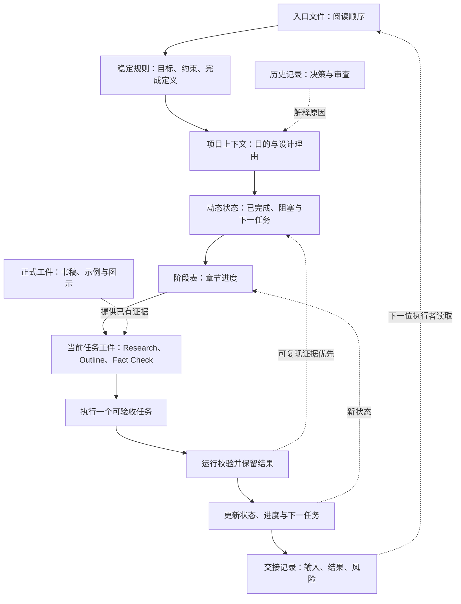

# 03. 仓库即 Agent 上下文

> 一次对话可以结束，一项工程任务却不能因此失去目标、证据和下一步。本章把仓库视为可审查的项目上下文：它保存规则、状态、历史、正式工件与校验反馈；它不是权限系统，也不自动证明结果正确。

## 本章目标

完成本章后，读者能够：

- 区分稳定规则、可变状态、历史记录、正式工件和校验反馈的责任。
- 为一个长期 Agent 项目设计最小阅读顺序和可恢复的交接输入。
- 在状态文件相互矛盾时，以可复现证据而非叙述性记录作为排查起点。
- 说明为什么 `AGENTS.md`、`CLAUDE.md` 等指令文件能提供上下文，却不能替代权限、Sandbox、测试或人类判断。

## 为什么要学

设想一位 Agent 接到一句“继续第 3 章”的任务。它不知道前一位执行者是否已经研究过来源，不知道正文是否开始，不知道哪些文件可信，也不知道完成后该更新什么。即使它写出一段看似合理的文字，团队仍无法回答：这是重复研究、未经核验的扩写，还是可交接的进展？

如果答案只留在聊天记录里，项目状态就会绑定在一次短期上下文中。版本控制仓库则可以保存可 diff 的规则、证据和状态，让人类和新的 Agent 回读同一组工件。本书将这种组织方式称为“仓库即 Agent 上下文”；这是工程模型，不是某个产品的默认目录或行业标准。

> 边界：本章不实现模型上下文窗口管理、检索、长期记忆算法、状态机、权限系统或 Git 协作流程。第 6、7、10、12、22、27 和 45 章分别处理这些问题。

## 前置知识

- 已阅读第 1 章，了解“任务完成”需要状态、工具、验证与证据。
- 已阅读第 2 章，了解模型、Agent、Harness 与运行环境承担不同责任。
- 能阅读 Markdown、目录路径与简单的命令输出。
- 不要求使用过 Codex、Claude Code 或任何特定 Agent 产品。

## 场景引入：交接到一半的章节任务

本章使用一个原创教学场景：前一位执行者已经完成第 3 章 Research Brief，下一项任务是创建 Chapter Outline，随后还要做事实核验、图示、示例和正文。新执行者不能只凭“继续写”开始，因为此时至少存在四种风险：

| 风险 | 如果没有仓库上下文 | 可检查的替代输入 |
| --- | --- | --- |
| 重复研究 | 再次搜索同一资料，或忽略已经限定的来源边界。 | Research Brief、候选参考资料与引用登记。 |
| 把计划当事实 | 将待核验产品行为直接写入正文。 | Fact Check、来源 URL 与写作当天的复核要求。 |
| 误判进度 | 以旧交接记录覆盖当前工作状态。 | `CURRENT_STATE.md`、`NEXT_TASK.md`、`.ai/progress.md` 和可复现校验。 |
| 无法继续 | 不知道文件在哪、先读什么、完成后改什么。 | 根入口、阅读顺序、章节模板和交接记录。 |

这个场景的成功标准不是“新 Agent 读完所有文件”，而是它能领取一个独立任务、定位前置工件、完成后留下可复查的结果。它也不证明任何产品会自动做到这些事；恢复过程仍由 Harness、工具和维护者执行。

## 核心概念

### 项目上下文不是一段长 Prompt

上下文工程（Context Engineering）将在第 6 章讨论“哪些信息应进入模型可见上下文”。本章先处理更基础的问题：**哪些项目事实应该存在于对话之外，并且能被再次定位？**

在这个意义上，项目上下文是一组职责明确的仓库工件，而不是把所有聊天记录拼成一个长 Prompt。它至少要让接手者回答四个问题：项目是什么、为什么采用当前设计、已经完成什么、下一步做什么。这四类答案的更新频率不同，因此应该分开存放。

| 类型 | 回答的问题 | 典型路径 | 更新时机 | 不能替代 |
| --- | --- | --- | --- | --- |
| 稳定规则 | 如何工作、什么算完成、哪些事禁止做？ | `AGENTS.md`、`BOOK_RULES.md`、模板。 | 规则改变或复盘发现重复问题时。 | 权限、Sandbox 或工具强制机制。 |
| 可变状态 | 当前完成了什么、下一步是什么、是否有阻塞？ | `.context/CURRENT_STATE.md`、`.context/NEXT_TASK.md`、`.ai/progress.md`。 | 每个可验收任务完成后。 | 测试输出、来源原文或历史事实。 |
| 历史记录 | 为什么曾作出某项决定、审查发现了什么？ | `.memory/decisions/`、`.memory/reviews/`。 | 决策或审查实际发生后。 | 当前状态的唯一来源。 |
| 正式工件 | 面向读者或运行环境的内容是什么？ | `docs/`、`examples/`、`diagrams/`。 | 正文、示例或图示变更后。 | 自动证明其质量。 |
| 校验反馈 | 哪些检查真实执行过、结果是什么？ | 测试输出、审查记录、状态中的验证条目。 | 校验完成后。 | 对未覆盖范围的结论。 |

这张表是本书的工程建议。它不要求每个项目都拥有相同目录，也不要求每类信息单独建一个服务。重要的是不要用一份不断膨胀的“项目说明”同时承担规则、事实、状态和日志：一旦它过期，接手者无法判断哪一部分仍可信。

### 指令文件提供上下文，不提供强制执行

对于 Codex，官方文档说明它会在工作前读取 `AGENTS.md`，并将全局与项目目录层级的指令组成一条指令链；从项目根目录到当前工作目录的文件依次组合，离当前目录更近的指导在组合文本中更靠后。[REF-005](https://learn.chatgpt.com/docs/agent-configuration/agents-md.md)

对于 Claude Code，官方文档将 `CLAUDE.md` 定位为项目、个人或组织的持久指令上下文，并说明该类内容在会话开始时读取；同一文档也明确指出，指令属于上下文而不是强制执行配置。[REF-006](https://docs.anthropic.com/en/docs/claude-code/memory)

这两项产品事实支持一个有限结论：把项目约定放入版本控制的指令文件，可以减少重复说明，并为不同会话提供共同入口。它们**不**支持更强的结论，例如“Markdown 规则一定阻止高风险操作”“所有 Agent 使用同一发现算法”或“文件被读取就代表结果正确”。

本书因此采用分层做法：根入口只给出阅读顺序，稳定原则存放在规则文件，当前状态存放在 `.context/`，决策与审查留在 `.memory/`，正式书稿与示例留在 `docs/` 和 `examples/`。这是本书的目录设计，不是对上述文档的改写。

### 文件系统作为持久工件层

Lilian Weng 在相关文章中将 Harness 描述为围绕基础模型、编排执行、管理上下文和工件、并评估结果的系统。[REF-001](https://lilianweng.github.io/posts/2026-07-04-harness/) 文章还讨论了用文件保存长期任务的状态和工件。本章借用的是这个问题意识，而不是复制其结构：当执行历史、错误、摘要和产物超过一次对话可承载的范围时，应该有可定位、可审查的外部工件。

文件的优势不是“天然正确”，而是它们能够被版本控制、链接检查、代码审查和后续工具重新读取。例如，一个 Research Brief 可以把来源与本书扩展分开；一个测试文件可以把“应该发生什么”写成可执行条件；一个交接记录可以让下一位维护者先看到风险，而不是猜测。

> 注意：文件保存并不会消除上下文污染。过期状态、重复说明、敏感数据和互相矛盾的规则同样会长期存在。第 6 章讨论筛选，第 7 章讨论记忆生命周期，第 10 章讨论状态更新。

## 架构图：从入口读取，到证据回写

下图回答一个问题：新执行者如何从项目入口定位当前任务，并把完成后的证据回写为下一次交接的输入？Mermaid 源文件位于 `diagrams/mermaid/chapter-03-repository-context-flow.mmd`，它表达的是本书的恢复工作流，而非产品权限架构。图示审查已实际导出并检查 [SVG](../../diagrams/exported/chapter-03-repository-context-flow.svg) 与 [PNG](../../diagrams/exported/chapter-03-repository-context-flow.png)；源码仍是唯一可编辑、可再渲染的事实来源。



> 图示替代描述：新执行者从入口和稳定规则开始，读取项目上下文、动态状态、阶段表和当前任务工件。历史记录解释设计理由，正式书稿、示例和图示提供已有证据。完成一个任务后，执行校验；可复现的校验结果用于更新状态、进度和交接记录，下一位执行者再从入口开始读取。

读图时应注意三点：

1. **规则与状态不是同一类文件。** 规则定义行为预期；状态记录当前事实。把状态复制进规则文件会制造第二份、很快过期的真相。
2. **历史只解释，不覆盖。** 旧审查记录可以解释为什么这样设计，却不能覆盖今天的测试结果或当前阶段表。
3. **校验反馈回写状态，但不等于所有事实。** `npm run validate` 能证明本仓库的特定检查通过，不能证明产品文档永远不变、模型一定遵守规则或外部系统安全。

## 工作流程：领取、验证与交接一个任务

将图中的路径落到一次章节编辑任务，可以得到如下最小工作流：

1. **从入口定位规则。** 阅读 `AGENTS.md` 或 `CLAUDE.md` 指向的启动文件，确认阅读顺序、验证命令和禁止事项。
2. **建立当前事实。** 读取 `.context/CURRENT_STATE.md`、`.context/NEXT_TASK.md` 和 `.ai/progress.md`；若描述互相矛盾，先查看最近的可复现校验或实际工件，再回写状态，不凭直觉在几段文字之间择一。
3. **读取任务前置。** 对“创建第 3 章 Outline”这样的任务，读取 Research Brief、来源候选、写作规则和章节模板；只领取一个可验收任务。
4. **产出可检查工件。** 新增或修改 Outline、示例计划、正文或审查记录时，保留明确路径、边界和未验证范围。
5. **运行相关校验。** 执行项目规定的 Markdown、链接、示例或状态检查；无法执行时记录命令、原因和未覆盖风险。
6. **同步并交接。** 更新状态、阶段表、下一任务和交接记录，使下一位执行者不用依赖本次聊天记录。

这个流程刻意把“阅读文件”与“完成任务”分开。阅读只是取得输入；只有工件、验证和状态同步同时发生，任务才具备可交接性。

## 最小示例：上下文恢复预检的边界

本章提供一个纯内存的上下文恢复预检示例，完整实现与边界见[示例实现说明](03-repository-as-agent-context.example-plan.md)。它接收测试构造的上下文快照：当前状态、阶段表、任务工件和历史摘要；然后返回“可领取”“缺少前置条件”或“状态冲突”的结构化结果。

该示例不读取真实仓库，也不发现真实指令文件。下面展示可运行模块的输入形状；快照由调用者注入：

```js
import { recoverTask } from '../../examples/agent/context-recovery.mjs';

const result = recoverTask({
  currentState: {
    chapter: '03',
    nextPhase: 'outline',
    research: 'complete',
    outline: 'not_started',
  },
  progress: { research: 'complete', outline: 'not_started' },
  artifacts: { research: { present: true } },
});

// result.state === 'ready'，并含有任务与前置证据。
```

五条已测试路径是：Research 已完成时可领取 Outline；缺少 Research 时阻塞；当前状态指向其他阶段时阻塞；状态摘要与阶段表冲突时阻塞；历史摘要不能覆盖当前状态。实现只使用测试注入的数据，不读取真实仓库、不访问网络或环境变量，也不模拟 Codex 或 Claude Code 的文件发现行为。

从仓库根目录运行：

```bash
npm run test:context-recovery
npm run example:context-recovery
```

2026-07-15 的实际执行中，5 项测试通过；演示输出 `ready` / `task_claimable`，并附有两项证据。它仍只证明确定性内存预检规则，不证明真实项目状态、文件读取、产品指令发现或权限控制。

## 逐步增强：从目录约定走向可恢复工作流

最小目录模式不需要一次建成庞大的知识库。可以按任务复杂度逐步增加能力：

1. **先建立单一入口和当前状态。** 适用于只有一个维护者、任务短且目录简单的项目。升级触发条件：维护者开始重复解释规则或无法判断上一项任务是否完成。
2. **再拆分规则、决策和审查。** 适用于规则稳定、状态频繁变化、设计理由需要追溯的项目。升级触发条件：一个文件同时包含长期原则、临时日志和正文草稿，修改冲突频繁出现。
3. **为状态建立一致性检查。** 适用于有多个章节、多个 Agent 或中断恢复需求的项目。升级触发条件：状态表与真实工件多次不一致，或交接者重复已完成工作。
4. **最后接入受控工具与审批。** 适用于需要修改文件、调用外部系统或执行不可逆操作的项目。此时目录规则仍只是上下文，必须另行实现权限、Sandbox、回读验证和人工升级。

逐步增强的原则是：先让错误可见，再增加自动化。一开始就试图自动“读懂所有仓库”，会隐藏选择规则、权限边界和验证责任，反而降低可审查性。

## 完整工程案例：从 Research Brief 接手到 Chapter Outline

以下案例来自本书自身的生产流程，但它描述的是设计路径，不是任何产品的内部日志。案例刻意保留了本章图示和示例进入实现前的交接状态，用来说明接手者不能预支后续阶段的完成结论。

**背景：** 第 3 章的 Research Brief 已经限定了三类内容：Codex 的 `AGENTS.md` 指令发现事实、Claude Code 的 `CLAUDE.md` 指令边界，以及本书自己的目录模型。下一位执行者需要创建 Outline。

**约束：** 不能把产品文档的具体加载行为泛化为所有 Agent；不能把目录结构写成权限系统；不能因为准备了图源或示例计划就声称图示审查或代码运行已经完成。

**设计选择：** 使用 Research Brief 定义可用陈述，使用 Fact Check 定义每项陈述的来源边界，使用 Outline 把读者问题、图示、示例和章节过渡写成蓝图。状态文件只记录阶段变化，验证记录才保存实际执行的命令和结果。

| 步骤 | 输入 | 输出 | 如何避免误判 |
| --- | --- | --- | --- |
| 定位 | 根入口、当前状态、下一任务。 | 确认当前只领取 Outline。 | 不把旧交接记录当成唯一状态。 |
| 读取 | Research Brief、参考资料、模板。 | 已知事实与本书扩展的边界。 | 产品事实只在来源直接支持的范围使用。 |
| 编写 | 读者问题和章节依赖。 | 可审查的 Outline。 | 计划图示和示例标为待实现，不提前写成运行结果。 |
| 校验 | Markdown 与链接检查。 | 可复现的项目内证据。 | 校验通过不外推为产品行为或权限证明。 |
| 交接 | 更新状态、进度、下一任务。 | 下一位可领取的独立任务。 | 保留风险、未验证范围和真实命令。 |

案例的关键不是目录名称，而是每一步都有相应证据。若某次校验没有运行，就必须留下未验证范围；若来源已经过期，就必须重新查询，而不是将旧记录美化为“已确认”。

## 实现说明：把职责写成输入和输出

仓库上下文的设计不依赖复杂框架，但需要明确每个工件的读写责任。

| 决策 | 本书选择 | 原因 | 替代方案与边界 |
| --- | --- | --- | --- |
| 根入口 | 保持 `AGENTS.md` 与 `CLAUDE.md` 简短，并指向共同规则。 | 防止入口复制状态和长篇正文。 | 小项目可用单一 README；规模增大后仍需拆分动态状态。 |
| 当前任务 | 用 `NEXT_TASK.md` 描述一个可验收任务。 | 降低并行任务互相覆盖和“继续做点什么”的歧义。 | 任务系统可替代 Markdown，但必须保留可链接的输入、验收与状态。 |
| 状态依据 | 阶段表与可复现校验相互校验。 | 叙述性状态可能过期；直接证据更适合发现漂移。 | 自动检查不能覆盖语义正确性，仍需人工审查。 |
| 历史沉淀 | 决策与审查记录独立保存。 | 让“为什么这样做”可追溯，又不污染当前任务。 | 历史应定期归档或标注失效，不能无限累积。 |

这里的核心数据流是“读取 → 形成一个受限任务 → 生成工件 → 验证 → 回写状态”。它与第 2 章的责任模型一致：指令与状态帮助 Agent 和 Harness 选择动作；实际权限和外部操作仍由运行环境与工具协议控制。

## 测试与验证

| 层级 | 验证对象 | 命令或方法 | 成功标准 | 实际状态 |
| --- | --- | --- | --- | --- |
| 来源 | Codex、Claude Code 与 Harness 的限定陈述。 | 2026-07-15 重新读取 REF-005、REF-006、REF-001。 | 只使用 Fact Check 列出的直接支持范围。 | 已完成，见[事实核验清单](03-repository-as-agent-context.fact-check.md)。 |
| 图源 | 恢复工作流 Mermaid 语法与图文边界。 | Mermaid CLI 导出 SVG/PNG，并实际检查 PNG。 | 图源可解析；节点、箭头、虚线反馈和文字均可辨认且无裁切。 | 2026-07-15：通过，见 `.memory/reviews/2026-07-15-chapter-03-diagram-review.md`。 |
| 示例 | 纯内存上下文恢复预检。 | `npm run test:context-recovery` 与 `npm run example:context-recovery`。 | 覆盖可领取、缺失前置、下一阶段冲突与状态冲突路径；演示输出结构化状态与证据。 | 2026-07-15：5 项测试通过；演示输出 `ready` / `task_claimable`。 |
| 文本 | 本章 Markdown、链接与项目状态。 | `npm run validate`。 | lint、链接、已有示例测试和状态检查通过。 | 初稿阶段记录：2026-07-15 检查 99 个 Markdown 文件，lint 为 0 错误；链接、8 项既有示例测试与状态检查通过。 |

## 工程实践

- 将稳定规则与可变状态分开；规则变更应少而可审查，状态更新应频繁而有时间点。
- 为每个“已完成”保留相应证据：工件路径、验证命令、结果摘要与未覆盖范围。
- 让交接记录回答“下一位先读什么、可以做什么、还不能声称什么”，而不是复制完整聊天记录。
- 定期检查过期与矛盾：来源页面、阶段表、链接和示例命令都可能漂移。

## 最佳实践

| 推荐 | 原因 | 适用边界 |
| --- | --- | --- |
| 根入口只维护阅读顺序和稳定约束。 | 入口短，接手者更容易找到权威文件。 | 复杂主题仍应放入被引用的规则或模板。 |
| 每次只领取一个有验收条件的任务。 | 可以把状态变化与校验结果对应起来。 | 需要并行时，先设计任务隔离与合并策略。 |
| 以可复现结果处理状态冲突。 | 可以减少“谁的文字描述更可信”的争论。 | 测试也可能覆盖不足，不能取代人工判断。 |
| 将敏感信息排除在长期上下文之外。 | 规则、日志和交接记录往往被更多人或工具读取。 | 需要机密操作时，使用专门的凭证与访问控制机制。 |

## 常见错误

| 错误 | 表现 | 根因 | 修复方向 |
| --- | --- | --- | --- |
| 把 `AGENTS.md` 当作权限系统。 | 文件写了“不要发布”，工具仍能发布。 | 指令与强制执行混淆。 | 在运行环境、工具协议和审批流程中实施权限。 |
| 把交接记录当作当前事实。 | 新执行者依据旧描述跳过已经失败的任务。 | 没有核对当前工件与最近校验。 | 以可复现证据为基线，再更新状态。 |
| 让一个文件承担全部记忆。 | 规则、日志、正文和 TODO 混在一起。 | 没有按稳定性和责任分层。 | 拆分规则、状态、历史与正式工件，并保留链接。 |
| 将计划图或伪代码称为已验证实现。 | 图源存在，但没有渲染、测试或演示记录。 | 缺少阶段语义。 | 用“计划”“预期”“未执行”明确标记，完成后再更新。 |
| 将校验通过外推为全面正确。 | Markdown 通过后声称产品行为或安全性已确认。 | 不理解检查范围。 | 记录每个命令覆盖什么、不覆盖什么。 |

## 安全与边界

- **权限边界：** 项目规则只约束期望行为；真实写入、发布、联网和删除必须由工具、Sandbox、审批或运行环境限制。
- **数据边界：** 不把密钥、私人聊天记录、生产数据、内部 URL 或不应共享的日志写入长期上下文、示例或交接文件。
- **人工审批点：** 当状态冲突无法由可复现证据解决，或任务涉及不可逆外部副作用时，停止自动推进并交由具有责任的人确认。
- **不适用范围：** 本章不提供特定 Agent 产品的安全保证、文件优先级兼容层或跨仓库权限方案。

## 章节总结

仓库可以成为长期项目上下文，不是因为它会自动理解任务，而是因为它能把规则、状态、历史、工件和校验结果放进可定位、可 diff、可审查的位置。接手者由此不必依赖上一段聊天，却仍需遵循同样的验证和权限边界。

第 4 章将把这种可恢复性放进更一般的可靠 Agent 工程原则：任务要有可观察目标、失败要可见、权限要最小化、完成要有证据。之后，第 6、7 和 10 章会分别深化上下文选择、记忆与状态管理。

## 练习

1. 为你熟悉的项目列出五类上下文：稳定规则、当前状态、历史记录、正式工件和校验反馈。哪些内容目前混在同一个文件中？
2. 设计一次交接任务的最小输入。若 `progress` 写“完成”而最新测试失败，你会先检查什么，随后更新哪些文件？
3. 选择一个高风险动作（删除数据、发布版本或发送消息）。写出哪一部分可以放在项目规则中，哪一部分必须由权限或人工审批强制执行。

## 延伸阅读

- 第 4 章：构建可靠 Agent 的工程原则（待起草）。
- 第 6 章：上下文工程（Context Engineering）（待起草）。
- 第 7 章：工作记忆（Working Memory）与长期记忆（Long-term Memory）（待起草）。
- 第 10 章：Workflow 与状态管理（待起草）。
- OpenAI, [Custom instructions with AGENTS.md](https://learn.chatgpt.com/docs/agent-configuration/agents-md.md)，2026-07-15 访问；用于 Codex 项目指令的限定行为。
- Anthropic, [How Claude remembers your project](https://docs.anthropic.com/en/docs/claude-code/memory)，2026-07-15 访问；用于 `CLAUDE.md` 的持久上下文与非强制配置边界。

## 参考资料

- REF-005 — OpenAI, [Custom instructions with AGENTS.md](https://learn.chatgpt.com/docs/agent-configuration/agents-md.md)。支持 Codex 对 `AGENTS.md` 的读取、发现和组合顺序的限定陈述。
- REF-006 — Anthropic, [How Claude remembers your project](https://docs.anthropic.com/en/docs/claude-code/memory)。支持 `CLAUDE.md` 的持久项目指令角色及其非强制配置边界。
- REF-001 — Lilian Weng, [Harness Engineering for Self-Improvement](https://lilianweng.github.io/posts/2026-07-04-harness/)。支持 Harness 与执行、上下文、工件和评估的思想背景。
- 本章的 [Research Brief](03-repository-as-agent-context.research.md)、[Chapter Outline](03-repository-as-agent-context.outline.md)、[事实核验清单](03-repository-as-agent-context.fact-check.md)、[示例计划](03-repository-as-agent-context.example-plan.md) 和[候选参考资料](03-repository-as-agent-context.references.md)。

## 章节完成检查表

- [x] Front matter、目标、前置知识、场景和章节依赖完整。
- [x] 正文使用原创结构；来源事实、来源观点、本书工程模型和教学场景已分开。
- [x] 每项可归因事实都链接到已登记来源；未完成的 Language Editing 与 Final Review 明确标为待办。
- [x] Mermaid 源码、读图说明和术语边界已给出；实际 SVG/PNG 导出与图示审查已通过。
- [x] 纯内存示例已实现并实际运行；它只验证计划中的五条确定性路径，未声明真实文件读取、产品指令发现或权限控制。
- [x] Technical Review 已完成；发现的状态漂移已修正，记录见 `.memory/reviews/2026-07-15-chapter-03-technical-review.md`。
- [x] Example Implementation 已完成；红灯与实际运行记录见 `.memory/reviews/2026-07-15-chapter-03-example-integration.md`。
- [x] Diagram Review 已完成；实际导出、视觉检查与图文一致性记录见 `.memory/reviews/2026-07-15-chapter-03-diagram-review.md`。
- [x] Language Editing 已完成；表达、术语、图文衔接和阶段表述的审查记录见 `.memory/reviews/2026-07-15-chapter-03-language-edit.md`。
- [x] Final Review 已完成；跨工件完成定义核对与最终验证记录见 `.memory/reviews/2026-07-15-chapter-03-final-review.md`。
- [x] Draft 写入后已运行 `npm run validate`；状态、任务与交接已同步，最终结果以项目状态文件为准。
