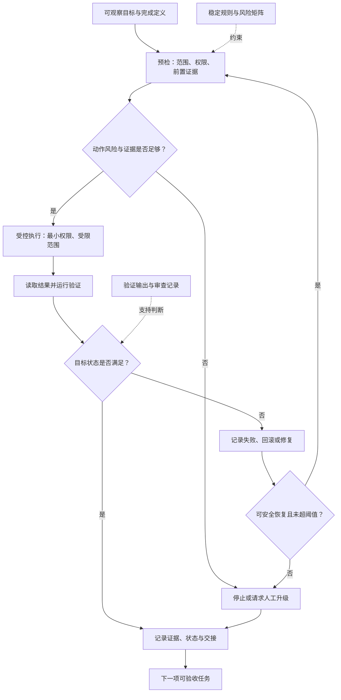

# 04. 构建可靠 Agent 的工程原则

> 可靠的 Agent 不是“很少说错话”的模型，而是一个能把目标、权限、执行、验证、失败和责任人连接成可检查闭环的工程系统。

## 本章目标

完成本章后，读者能够：

- 将自然语言任务改写为包含成功条件、禁止副作用和验证方式的任务契约。
- 区分模型宣称完成、工具返回成功、目标状态满足和业务接受四种不同结论。
- 为有副作用的动作设计预检、最小权限、受限范围、停止条件和恢复路径。
- 在证据不足、连续失败或高风险动作出现时，设计明确的人工升级而非无限重试。
- 用小范围验证和可恢复路径降低 Agent 变更的影响范围。

## 为什么要学

“已完成”是 Agent 系统中最容易被误用的词。模型可以生成一段合理说明，工具可以返回 HTTP 200，甚至测试也可以通过；但它们都不必然证明真正的目标状态已经达到。一个配置值可能写入了错误环境，写入后的格式可能无效，或操作虽成功却超出了授权范围。

因此，可靠性不是给 Prompt 加上一句“请仔细检查”的结果。它要求 Harness 把可观察目标、预检、受控动作、验证证据、失败记录和责任升级组织成闭环。本章给出跨产品的工程原则；它不承诺特定模型的准确率，也不提供某个云平台的权限或回滚实现。

## 前置知识

- 已阅读第 1 章，理解 Harness 需要将工具结果交给验证器，而不是直接宣布成功。
- 已阅读第 2 章，理解模型、Agent、Harness 与运行环境承担不同责任。
- 已阅读第 3 章，理解状态、工件和交接记录需要可定位、可审查。
- 能理解 JSON 形状、状态字段和简单的测试命令；不要求使用过特定 Agent SDK。

## 场景引入：一次看似简单的配置修改

教学系统中有一个配置对象：`feature.checkoutMode`。产品负责人要求“把试验模式切换为标准模式”。若 Agent 直接把任务变成写入动作，至少会遗漏四个问题：目标是不是当前环境？该键是否允许自动修改？变更后应观察什么？不匹配时谁能决定恢复或继续？

| 问题 | 仅凭“已完成”会怎样 | 本章要求的可观察输入 |
| --- | --- | --- |
| 目标 | 写入了错误键或错误范围仍报告成功。 | 键、期望值、目标范围与禁止范围。 |
| 权限 | 读写能力被误当作任务授权。 | 允许键、动作风险、审批要求。 |
| 验证 | 工具返回成功，但回读结果不匹配。 | 变更前快照、写入结果、回读或业务校验。 |
| 失败 | 重试掩盖冲突，或在高风险操作上继续执行。 | 失败证据、恢复条件、停止阈值和升级对象。 |

本章案例只使用教学配置和内存快照，不连接真实文件、服务、账户或凭证。它的成功标准是：每一个终点都有状态与证据；它不声称能够完成真实生产发布。

## 核心概念

### 可靠性是闭环性质，不是模型标签

本书将可靠 Agent 定义为：在明确目标与边界内，系统产生可观察结果，以独立验证给出当前任务的判定，暴露失败，并把超出授权或证据不足的情况交给恢复或人工处理。这个定义是本书的工程模型。

NIST 的 AI RMF 1.0 是帮助组织管理 AI 风险、促进可信和负责任开发、部署与使用的自愿性框架。[REF-007](https://www.nist.gov/publications/artificial-intelligence-risk-management-framework-ai-rmf-10) 它提供风险管理背景，却不替本章规定任务字段、验证命令或人工审批流程。

这一定义划出两条边界：可靠不等于模型永不出错；验证通过也不等于系统的所有属性都已证明。可靠性要求写清某个任务的可接受范围，并让错误能够被观察、停止和处理。

### 原则一：从可观察目标和完成定义开始

一项可领取任务不应只有动词。至少要说明对象、预期状态、允许范围、成功证据、禁止副作用、停止条件和负责升级的人。例如，“切换配置”不如“仅在教学范围内把 `feature.checkoutMode` 从 `trial` 变为 `standard`；回读值必须匹配；没有批准不得写入高风险范围”可检查。

| 字段 | 作用 | 省略后的风险 |
| --- | --- | --- |
| 目标状态 | 定义期望的对象和值。 | 验证者没有比较基线。 |
| 允许范围 | 限制键、环境或对象集合。 | 一个正确动作可能作用在错误目标。 |
| 成功证据 | 定义需要回读、测试或审查的结果。 | 工具文本被误当作完成。 |
| 停止条件 | 指定何时不再自动推进。 | 失败会变成无穷重试。 |
| 责任升级 | 指定谁处理冲突或高风险决定。 | 人工介入变成临时求助。 |

本书建议把这些字段作为任务契约，而不是藏在一段长 Prompt 中。第 5 章会讨论如何用 Instructions 与 Prompt 承载稳定规则；第 10 章会讨论如何把契约落实为状态机。

### 原则二：以独立验证闭环结束

模型的“已完成”说明、工具的成功返回和目标状态满足，是三个不同的信号。验证闭环（Verification Loop）要求系统在受控动作之后重新观察目标对象，将观察值与任务契约比较，并把判定理由保存为可复核证据。验证器可以是格式检查、测试、回读、业务规则或人工审查；关键不在于采用哪一种，而在于它不把模型的自我叙述当作唯一依据。

| 信号 | 直接说明 | 仍不能说明 | 应进入的下一步 |
| --- | --- | --- | --- |
| 模型说明 | 模型提出或描述了一项动作。 | 动作已经发出、外部状态已经改变。 | 由 Harness 将候选转为受控请求。 |
| 工具返回成功 | 该次工具调用按其接口返回成功。 | 调用目标正确、结果满足任务或业务接受。 | 读取实际状态或运行独立检查。 |
| 回读观察 | 系统观察到一个当前值或结果。 | 该值是否满足完整任务契约。 | 与预期状态、范围和禁止副作用逐项比较。 |
| 验证判定 | 已检查的条件满足或不满足。 | 未检查属性也已满足。 | 保存覆盖范围；若不充分则停止、补充验证或升级。 |

本章把“接受”限制为被当前验证条件支持的结论，而不是对整个系统安全、正确或生产就绪的保证。第 17 章会把验证器、证据矩阵和误判风险展开；这里先固定最小接口：目标、观察、判定和覆盖范围必须同时可见。

### 原则三：让状态、失败和恢复路径可见

状态不仅是“成功”或“失败”。至少要区分尚未预检、被阻塞、已受控执行、验证失败、已恢复、已升级和已记录。这样的状态让下一位执行者知道系统做过什么，也让审查者能判断哪一条证据缺失。

失败同样应是结构化输出。一个有用的失败记录包含：发生在哪一阶段、已观察到什么、哪些前置未满足、是否允许恢复，以及下一步是重试、回滚还是升级。第 3 章提出的“可复现证据优先于叙述性状态”在这里仍然适用：旧日志不能覆盖新的回读结果。

### 原则四：以最小权限和可逆性控制副作用

写着“不要做危险操作”的指令并不会强制工具遵守。真实限制应由运行环境、工具协议、访问控制和审批实现。OpenAI 的工程指南把 Guardrails 描述为分层防御，并明确它们需要与认证、授权、访问控制和标准软件安全措施结合。[REF-008](https://openai.com/business/guides-and-resources/a-practical-guide-to-building-ai-agents/)

同一指南建议按只读或写入、可逆性、账户权限和财务影响评估工具风险，并可在高风险函数之前暂停检查或升级人工。[REF-008](https://openai.com/business/guides-and-resources/a-practical-guide-to-building-ai-agents/) 本书据此提出教学风险矩阵：

| 动作类别 | 示例 | 自动化前提 | 失败后的默认动作 |
| --- | --- | --- | --- |
| 只读、低影响 | 读取配置快照。 | 范围明确且不含敏感数据。 | 记录读取失败，重新检查输入。 |
| 可逆写入 | 修改教学配置并保留原值。 | 允许键、受限范围、预检与验证齐全。 | 停止；根据证据恢复原值或升级。 |
| 不可逆或高影响 | 删除数据、发送外部消息、修改生产授权。 | 明确人工批准和专门的强制控制。 | 不自动执行；请求人工决定。 |

这张表是本书建议，不是任何产品的默认权限模型。第 11、12、41 章会分别处理工具协议、Sandbox 和审计实现。

### 原则五：把人工升级设计为正常路径

人工升级不意味着系统失败，而是承认决策已超出当前证据或授权。触发条件应预先可观察，例如：关键前置缺失、验证不匹配、连续尝试超过阈值、影响不可逆，或目标范围发生冲突。

OpenAI 指南将失败阈值以及敏感、不可逆或高风险动作列为应转交人工的典型条件。[REF-008](https://openai.com/business/guides-and-resources/a-practical-guide-to-building-ai-agents/) 但阈值本身必须由具体组织决定，本章不发明数字。一个合格的升级包至少包含候选动作、已执行步骤、当前证据、风险、未决问题和可选的继续/恢复方案。

### 原则六：先在小范围验证，再扩大影响

单元测试通过也不能消除所有运行时差异。Google SRE 将 Canary 描述为对子集、限时部署变更的评估，并要求具备子集投放、判断好坏的评价过程以及把评价接入发布流程的能力。[REF-009](https://sre.google/workbook/canarying-releases/) 它还用暂停、回滚或请求人工协助来处理异常评价。[REF-009](https://sre.google/workbook/canarying-releases/)

本章借用的是工程思路，不是流量分割实现：对 Agent 来说，受限范围可以是一条测试记录、一个临时目录或一次 dry-run。先定义信号和停止条件，再决定是否扩大影响。没有对照、没有评价、没有回退路径的“先试一下”，并不构成渐进验证。

## 架构图：可靠性闭环

下图回答：一个有副作用的 Agent 任务如何从目标走向验证、恢复或人工升级，而不让模型输出直接等同于完成？Mermaid 源文件位于 `diagrams/mermaid/chapter-04-reliability-loop.mmd`。它是本书工程模型，已实际导出并检查 [SVG](../../diagrams/exported/chapter-04-reliability-loop.svg) 与 [PNG](../../diagrams/exported/chapter-04-reliability-loop.png)；源码仍是唯一可编辑、可再渲染的事实来源。



> 图示替代描述：任务从可观察目标进入预检；证据或风险不足时停止并升级，足够时才在最小权限与受限范围内执行。验证成功后记录证据并交接；验证失败后记录失败、恢复或升级。稳定规则约束预检，验证与审查证据支撑成功判断。

读图时要注意：`Record` 并不证明所有风险消失，它只保存本任务的证据和状态；`Escalate` 也不等于成功，必须保留未决问题和责任人。

## 工作流程：从任务契约到可审计结果

1. **写出任务契约。** 输入为目标、范围、允许动作和成功条件；输出是可审查计划。若无法说明如何验证，任务仍不可执行。
2. **预检范围和前置。** 检查目标是否允许、输入是否完整、动作是否需要批准、是否存在可用的变更前快照。缺失时阻塞并记录原因。
3. **在受限范围执行。** 只调用与当前风险匹配的动作；高风险或不可逆操作先进入人工升级。
4. **回读并验证。** 比较预期状态与观察结果，必要时运行格式、业务或审查检查。工具返回成功不是充分条件。
5. **记录并选择下一步。** 验证通过时记录证据、状态和交接。验证失败时记录失败、恢复建议和是否允许重新预检；风险超过边界时升级。

## 最小示例：纯内存受控配置修改

完整的接口、五条测试路径和边界见[示例实现说明](04-reliable-agent-engineering-principles.example-plan.md)。[`evaluateConfigChange(snapshot)`](../../examples/agent/controlled-config-change.mjs) 只检查注入的教学配置快照；它不会读取真实文件、调用网络、读取环境变量或访问账户。

下面是实际示例使用的输入形状：

```js
const snapshot = {
  proposal: {
    key: 'feature.checkoutMode',
    expectedValue: 'standard',
    scope: 'teaching',
    risk: 'reversible-write',
  },
  policy: {
    allowedKeys: ['feature.checkoutMode'],
    allowedScopes: ['teaching'],
    requiresApproval: false,
  },
  before: { feature: { checkoutMode: 'trial' } },
  execution: { kind: 'applied', observedValue: 'standard' },
  approval: { granted: false },
};
```

实现覆盖受控成功、预检拒绝、验证失败、高风险升级和执行拒绝。它读取 `before` 快照中的原值、观察注入的执行结果，并只在观察值与目标匹配时返回 `succeeded` / `verified`；不进行真实写入或回滚。运行：

```bash
npm run test:controlled-config-change
npm run example:controlled-config-change
```

## 逐步增强：先增加证据，再增加自动化

1. **先返回结构化决定。** 只在内存中判断是否允许继续，并输出证据与阻塞原因。升级触发条件：读者需要区分预检、执行和验证失败。
2. **再加入可逆的临时写入。** 使用临时目录和变更前副本，执行后回读并验证。升级触发条件：纯内存逻辑无法暴露序列化、路径或原子写入问题。
3. **最后接入真实审批和运行环境控制。** 在工具协议、Sandbox、审计日志和责任分配都明确时才允许。升级触发条件：动作影响真实用户、数据或外部系统。

每一步只增加一种复杂度。没有先定义证据、范围和恢复路径时，直接接入真实写入只会把不确定性转移到更难恢复的地方。

## 完整工程案例：调整教学服务的结算模式

**背景：** 一项教学服务要将 `feature.checkoutMode` 从 `trial` 调整为 `standard`。这是一项可逆写入，但仍可能因为目标范围、预期值或验证缺失而失败。

**约束：** 只允许教学范围；只允许指定键；没有批准时不得执行被标为高风险的动作；写入后必须回读；任何异常都不得伪装为成功。

**设计选择：** 用任务契约固定目标和范围，用预检防止越权，用变更前快照支持恢复，用回读验证确认目标状态，用结构化升级包把不确定性交给人。案例不假设真实文件系统或云平台，因此“备份”“写入”和“回滚”均是教学接口，而非环境操作。

| 阶段 | 输入 | 正常输出 | 异常处理 |
| --- | --- | --- | --- |
| 预检 | 提案、策略、变更前快照。 | 可执行的受控计划。 | 键或范围不允许时阻塞。 |
| 执行 | 允许的低风险提案。 | 模拟写入观察。 | 被拒绝时记录原因，不重试越权动作。 |
| 验证 | 期望值与观察值。 | `verified` 证据。 | 不匹配时进入恢复建议。 |
| 升级 | 高风险、未批准或冲突证据。 | 交给人决定的包。 | 不宣布已写入或已恢复。 |
| 交接 | 状态、证据、风险。 | 下一项可领取任务。 | 保留未覆盖范围。 |

案例的关键不是“自动完成修改”，而是每一项变更都要给出与风险相称的证据和停止路径。

## 实现说明：把可靠性写成接口

| 决策 | 本书选择 | 原因 | 替代方案与边界 |
| --- | --- | --- | --- |
| 成功状态 | 只有验证匹配后才返回 `succeeded`。 | 防止工具文本直接替代目标状态。 | 更复杂系统可有部分成功，但必须有独立状态与证据。 |
| 写入范围 | 先在教学范围和允许键内判断。 | 缩小错误影响。 | 真正的授权由工具和运行环境实施。 |
| 失败处理 | 返回失败证据、恢复建议或升级包。 | 让失败可审查、可交接。 | 自动重试需另行定义幂等性和阈值。 |
| 人工升级 | 高风险或证据不足时停止。 | 防止自动化越过责任边界。 | 人工流程本身仍需组织层面的设计。 |
| 渐进扩大 | 用 dry-run 或受限对象先验证。 | 在扩大副作用前发现问题。 | 不等同于真实 Canary 流量系统。 |

## 测试与验证

| 层级 | 验证对象 | 命令或方法 | 成功标准 | 实际状态 |
| --- | --- | --- | --- | --- |
| 来源 | REF-007、REF-008、REF-009 与 REF-001 的限定陈述。 | 2026-07-15 重新读取官方或原始页面。 | 只使用 Fact Check 的直接支持范围。 | 已完成，见[事实核验清单](04-reliable-agent-engineering-principles.fact-check.md)。 |
| 图示 | 可靠性闭环 Mermaid 源码与导出图。 | Mermaid CLI 导出 SVG/PNG 并视觉检查。 | 节点、箭头、停止和升级路径可辨认。 | 2026-07-15：通过，见 `.memory/reviews/2026-07-15-chapter-04-diagram-review.md`。 |
| 示例 | 纯内存受控配置修改。 | `npm run test:controlled-config-change` 与 `npm run example:controlled-config-change`。 | 覆盖五条路径并返回结构化证据。 | 2026-07-15：5 项 Node 内置测试和接受路径演示已实际运行；见示例整合记录。 |
| 文本 | 本章 Markdown、链接与项目状态。 | `npm run validate`。 | lint、链接、现有示例测试和状态检查通过。 | 2026-07-15：Final Review 后实际执行；115 个 Markdown 文件 lint 为 0 错误，链接检查、18 项 Node 示例测试与状态检查通过。 |

## 工程实践

- 把每项“完成”关联到一个目标状态和直接证据；日志只能解释，不能替代回读或验证。
- 让失败输出包含阶段、已观察证据、建议恢复和是否需要升级，避免把错误压缩成一个布尔值。
- 将权限、授权和审批放在强制执行层；Prompt、文档和图示只能提供行为约束与审查上下文。
- 先限定对象集合和可逆路径，再扩大自动化范围；范围越大，评价和恢复要求越高。

## 最佳实践

| 推荐 | 原因 | 适用边界 |
| --- | --- | --- |
| 为任务写出停止条件。 | 系统能在证据不足时停止，而非继续猜测。 | 停止后仍需要责任人或工作流处理。 |
| 将工具结果与目标验证分开。 | 可发现“调用成功但状态错误”。 | 验证也必须覆盖真正关心的属性。 |
| 默认从低风险、可逆范围开始。 | 降低错误的影响与恢复成本。 | 不取代真实权限、隔离和审计。 |
| 将人工升级视为可测试分支。 | 高风险决策不会只依赖临时沟通。 | 阈值和责任人须由具体组织定义。 |

## 常见错误

| 错误 | 表现 | 根因 | 修复方向 |
| --- | --- | --- | --- |
| 把模型输出当完成。 | Agent 说“已修改”，却没有目标状态证据。 | 缺少回读验证。 | 定义成功状态并在执行后独立观察。 |
| 用 Prompt 代替权限。 | 文字禁止写入，但工具仍有写权限。 | 将行为期望与强制控制混淆。 | 在工具、Sandbox、访问控制和审批层实施限制。 |
| 无限重试。 | 同一冲突反复出现，状态被覆盖。 | 没有阈值、失败记录或升级分支。 | 记录失败并在阈值或风险边界升级。 |
| 把 dry-run 当生产验证。 | 预览通过后直接宣称真实发布安全。 | 忽略运行环境差异。 | 明确 dry-run 覆盖范围，并在受限真实范围重新验证。 |
| 只记录成功。 | 交接者不知道为何停止或如何恢复。 | 失败不是一等结果。 | 保存失败阶段、证据、恢复建议与未决责任。 |

## 安全与边界

- **权限边界：** 本章的风险矩阵与任务契约只表达策略；真实写入、删除、网络调用和审批必须由运行环境、工具协议和访问控制强制执行。
- **数据边界：** 不把真实配置、密钥、账户标识、生产 URL、内部日志或客户数据放入示例、图示或交接记录。
- **人工审批点：** 目标范围不明、动作不可逆、批准缺失、证据冲突或失败超过阈值时停止自动推进并升级。
- **不适用范围：** 本章不证明任何厂商 Guardrails、Canary、模型、权限 API 或自动回滚在读者系统中的实际效果。

## 章节总结

可靠 Agent 的关键不是让系统更像人，而是让每一项动作都更像可维护的软件变更：目标清楚，权限受限，结果可验证，失败可见，风险可停止，责任可升级。模型产生候选；Harness 与运行环境把候选放入可检查的闭环。

第 5 章将把这一基线带入 Instructions 与 Prompt：哪些规则应稳定、哪些输入属于当前任务，以及如何避免把策略、状态和自然语言说明混成不可维护的上下文。

## 练习

1. 选择一个你熟悉的 Agent 动作，写出目标状态、允许范围、成功证据、停止条件和升级对象。缺少哪一项时最容易出现“看似完成”？
2. 为一个“发送通知”的动作设计三类风险：只读预览、可撤销草稿和不可撤销发送。每类应有哪些验证或审批？
3. 某任务的工具返回成功，但回读值不匹配。写出应保留的失败证据，并说明何时可以安全重试、何时必须升级。

## 延伸阅读

- NIST, [Artificial Intelligence Risk Management Framework (AI RMF 1.0)](https://www.nist.gov/publications/artificial-intelligence-risk-management-framework-ai-rmf-10)，2026-07-15 访问；用于风险管理与可信开发背景。
- OpenAI, [A practical guide to building agents](https://openai.com/business/guides-and-resources/a-practical-guide-to-building-ai-agents/)，2026-07-15 访问；用于 Guardrails、工具风险和人工升级的限定建议。
- Google SRE, [Release Engineering and Canarying](https://sre.google/workbook/canarying-releases/)，2026-07-15 访问；用于渐进变更、评价与回滚的工程类比。

## 参考资料

- REF-007 — NIST AI RMF 1.0；支持 AI 风险管理与可信、负责任开发使用的背景。
- REF-008 — OpenAI《A practical guide to building agents》；支持分层 Guardrails、工具风险与人工升级的限定建议。
- REF-009 — Google SRE《Release Engineering and Canarying》；支持子集变更、评价、暂停与回滚的工程类比。
- REF-001 — Lilian Weng《Harness Engineering for Self-Improvement》；支持 Harness 与执行、上下文、工件和评估的思想背景。

## 章节完成检查表

- [x] Front matter、目标、前置知识、场景和章节依赖完整。
- [x] 正文使用原创结构；来源事实、本书工程模型和教学案例已分开。
- [x] 每项可归因事实都链接到已登记来源；动态内容的正文当天复核要求已说明。
- [x] Mermaid 源码、读图说明和术语边界已给出；实际 SVG/PNG 导出与图示审查已通过。
- [x] 示例有输入、实际运行的五条测试路径和安全边界；不声明真实权限、写入或回滚结果。
- [x] Technical Review、Example Implementation、Diagram Review、Language Editing 与 Final Review 已完成。
- [x] Final Review 后已重新运行本章示例、图示渲染、`npm run validate`；状态与交接已同步。
