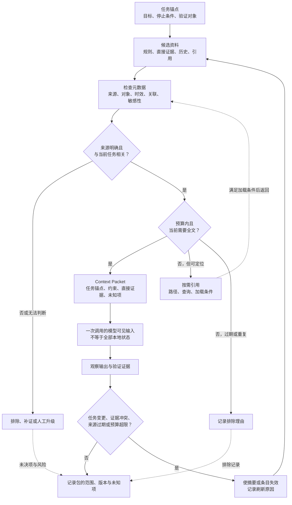

# 06. Context Engineering

> 上下文工程（Context Engineering）不是为模型塞进更多资料，而是为当前任务保留可追溯、可验证、需要时可刷新的最小证据集合。

## 本章目标

完成本章后，读者能够：

- 区分运行时代码可访问的信息、模型实际看到的输入和跨轮保存的状态。
- 为一次任务写出上下文说明（Context Brief），说明资料的来源、用途、时效、预算、敏感性、排除理由和未知项。
- 在直接证据、历史摘要和大对象之间做出可审查的保留、指针化、排除或升级决定。
- 在上下文重复、来源过期、摘要与新观察冲突时，触发刷新而不是继续复用旧结论。
- 为纯内存的上下文包（Context Packet）建立确定性测试，而不把它误认为真实检索、缓存、安全或模型评估。

## 为什么要学

一个测试失败后，Agent 通常可以得到很多信息：完整仓库、历史对话、CI 日志、产品说明、以前的排查摘要和最新 diff。困难不在“找不到内容”，而在“哪些内容对这一次判断有用，哪些内容只会让判断变得模糊”。

把资料全部放进一次调用看起来最省事，却会产生三个工程问题。第一，读者和维护者无法区分“这份资料存在”与“它已经进入模型输入”；第二，旧摘要、重复历史和无出处断言会与当前证据并列，看似完整却难以审查；第三，当结论出错时，团队无法回答是哪条资料、哪个版本或哪次选择造成了偏差。

Anthropic 将 Context Engineering 描述为在推理时持续选择和维护进入有限上下文的信息，并讨论高信号资料与按需加载。[REF-015](https://www.anthropic.com/engineering/effective-context-engineering-for-ai-agents) Gemini API 的长上下文文档也建议避免传递不需要的标记（token）。[REF-018](https://ai.google.dev/gemini-api/docs/long-context) 这些是特定来源的工程观点或产品建议，不是“上下文越少越正确”的定律，也不保证成本、安全或结果质量。

本章只讨论当前调用前后的资料选择与记录。长期记忆如何保存留给第 7 章；工作流状态如何恢复留给第 10 和第 19 章；工具协议、知识库、权限与审计分别留给第 11、13、41 章。Context Packet 不是访问控制，也不替代对不可信输入的安全处理。

## 前置知识

- 已阅读第 5 章，能够区分项目规则、任务 Brief、上下文数据和输出契约。
- 已阅读第 4 章，理解候选输出、工具返回和独立验证是不同结论。
- 能阅读数组、对象、简单排序和测试断言；不要求使用任何特定 Agent SDK。
- 不要求已部署向量数据库、会话服务或缓存系统。

## 场景引入：一条失败测试不需要整个项目

教学项目中有一条测试失败。维护者把失败断言、相关 diff、三个月的 CI 日志、所有历史聊天记录和一份上周的故障摘要交给 Agent，并要求“找出原因”。其中有些资料确实可能有用，但它们的角色并不相同：失败断言是当前直接证据，项目规则约束可处理范围，历史摘要只是待复核的派生信息，大日志可能应先保留路径和过滤条件。

本章把这份准备工作称为 **上下文说明（Context Brief）**。它不是外部 API，也不是把文字换一种格式；它要求每一项候选资料能回答：

| 问题 | 为什么需要回答 | 答不出时的动作 |
| --- | --- | --- |
| 它来自哪里，何时获得？ | 才能判断能否追溯与是否可能过期。 | 标为未知或阻塞，不把它当成直接证据。 |
| 它解决当前哪个问题？ | 才能区分直接证据与背景。 | 保留为候选或排除，不能因“也许有用”自动装入。 |
| 它为什么现在需要全文？ | 才能在预算内决定全文或引用。 | 记录按需加载条件。 |
| 它可能替代、重复或冲突谁？ | 才能避免旧摘要覆盖新观察。 | 触发刷新或请求人工裁决。 |
| 它包含什么敏感性或未知风险？ | 才能把边界交给后续安全、权限流程。 | 停止扩大输入，转交相关章节的控制。 |

这个场景是本书原创教学设计，不表示真实仓库、真实日志、模型调用或测试执行。成功标准只有一个：Harness 可以把资料选择和未决项变成可检查记录；它不证明模型已经找到根因。

## 核心概念

### Context Engineering 不是“上下文越多越好”

资料有三个不同状态：它可能存在于仓库或服务中；运行时代码可能有权访问它；它也可能被显式投影到某次模型输入。这三个状态不能混为一谈。一个巨大日志文件存在，不代表这次调用需要它；一个本地对象可被函数读取，也不代表它的全部内容已经发送给模型。

本书把“最小”理解为：在已声明的任务、验证对象和停止条件下，保留足以开始下一步判断的约束与直接证据，同时把不能立刻装入的资料保留为可解析引用和加载条件。它不是追求最短 Prompt，也不是删除不方便的反例。缺少关键证据时，正确动作是记录未知或停止，而不是用更短的上下文掩盖空白。

### 本地 context 与模型 context：能访问不等于已经看见

OpenAI Agents SDK 的文档区分本地代码可用的 context 和 LLM context，并说明前者不会自动发送给模型。[REF-016](https://openai.github.io/openai-agents-python/context/) 同一文档列出 instructions、input、函数工具、retrieval 和 web search 等向模型提供信息的方式。[REF-016](https://openai.github.io/openai-agents-python/context/) 这是该 SDK 的概念与接口语境，不是所有框架的统一行为。

为避免把这一产品例子误写成通用协议，本书使用一个更窄的三面检查：

| 面 | 要问的问题 | 第 6 章的工程动作 | 不能证明什么 |
| --- | --- | --- | --- |
| 可访问面 | Harness 或工具目前能读取什么？ | 记录候选资料与它的来源。 | 信息已经被模型看到。 |
| 模型输入面 | 这次调用实际投影了哪些资料？ | 生成 Context Packet 与按需引用。 | 模型理解、遵守或相信这些资料。 |
| 持久状态面 | 哪些资料会在下一轮继续存在？ | 标明权威来源、摘要范围与刷新条件。 | 已经实现长期记忆或安全恢复。 |

例如，数据库连接对象可以留在本地可访问面；当前失败断言可以进入模型输入面；上次排查的摘要可以位于持久状态面。这个划分帮助团队讨论责任，但不能自行完成数据最小化、秘密处理或权限隔离。

### 上下文说明（Context Brief）：把匿名文本改造成证据条目

本书建议在调用前用一份 Context Brief 描述候选资料，而不是直接把字符串拼接成输入。每条证据至少携带来源、对象、捕获时间、当前用途、相关性、敏感性、大小、是否可验证，以及为什么现在需要它。Context Brief 还应列出任务锚点、预算、排除理由、刷新触发器和未知项。

下表是本书的资料类别和优先级约定，并非厂商消息格式：

| 类别 | 当前作用 | 常见例子 | 预算不足时的默认动作 |
| --- | --- | --- | --- |
| 约束 | 限定当前任务允许范围与停止条件。 | 项目规则、任务 Brief、验证对象。 | 只有在来源不明或相互冲突时停止、澄清或升级。 |
| 直接证据 | 支持当前问题的可观察材料。 | 失败断言、相关 diff、最新验证输出。 | 优先保留；过期或缺少来源时请求刷新。 |
| 历史摘要 | 解释之前做过什么、覆盖到哪里。 | 上次排查结论、交接摘要。 | 保留来源和覆盖范围；不能覆盖新证据。 |
| 可按需引用 | 可以定位但暂不需要全文的资料。 | 大日志路径、查询名、文档段落标识。 | 指针化并记录加载条件。 |
| 背景材料 | 为理解提供上下文，但不直接决定当前动作。 | 架构介绍、无关模块说明。 | 排除并记录理由，或在任务扩展时重新评估。 |

“相关”必须被写成针对当前任务的理由，而不是一个模糊标签。若一条资料不能说明它要支撑的判断、何时失效、为什么不由另一条资料代替，它应继续停留在候选区。

### 上下文预算：为证据和未知项留出位置

预算不是“剩余 token 的百分比公式”。在本章中，它是一种显式取舍：稳定约束和任务锚点优先，当前直接证据其次，历史摘要必须附带范围和来源，大对象转为按需引用，重复或过期资料则被排除并记录原因。Gemini 的长上下文资料对不需要 token 的建议只能作为这个设计的背景，不能推导出通用数值或删减算法。[REF-018](https://ai.google.dev/gemini-api/docs/long-context)

当预算超限时，团队有五种不同动作：

1. **保留：** 当前约束或直接证据在这次判断中不可替代。
2. **摘要：** 只在能保留来源、覆盖范围和未知项时使用；摘要不是新的事实来源。
3. **指针化：** 保存路径、查询或段落标识及加载条件，等待真正需要时再读取。
4. **排除：** 记录它为何无关、重复、过期或无法定位。
5. **升级：** 缺少关键来源、资料相互冲突或敏感性超出当前工作范围时停止并请求裁决。

这种顺序确保“删掉什么”本身也是可审查结论。静默截断一个测试失败的关键片段，通常比保留一条明确的“未知项”更危险。

### 预先装入与按需加载：给出入口，而不是预装整个世界

预先装入适合稳定、短小、与当前任务直接相关的约束和证据。按需加载适合巨大日志、可解析文档引用或只有在某个假设成立时才需要的材料。Anthropic 的 Context Engineering 文章讨论了以标识符和工具按需载入资料的思路；OpenAI Agents SDK 文档列出工具、retrieval 和 web search 作为向模型提供信息的路径。[REF-015](https://www.anthropic.com/engineering/effective-context-engineering-for-ai-agents) [REF-016](https://openai.github.io/openai-agents-python/context/) 这些来源并不保证工具会选择正确资料，也不说明预先检索或按需加载在所有任务上更优。

本书要求按需引用至少记录三项：可解析标识、加载条件和预期返回范围。比如“仅当失败断言指向认证模块时，读取 `logs/auth-ci.txt` 中匹配测试名的 20 行”；它不等于“把整份 CI 日志交给模型”。工具失败、资料过期或返回范围不符时，应保留未决项，不应用旧摘要补成结论。

### 跨轮状态：先指定一个权威承载方式

OpenAI Agents SDK 的运行文档列出由应用、SDK session、Conversation API 或 Responses API 管理跨轮状态的不同策略，并警告未刻意协调地混用客户端和服务端延续可能造成重复上下文。[REF-017](https://openai.github.io/openai-agents-python/running_agents/) 这是该 SDK 的状态管理说明，不应被外推为其他系统的会话字段、恢复语义或通用记忆模型。

本书由此提出一个较小的工程建议：每段连续工作明确一个权威承载方式，并将“原始状态”“已投影给模型的 Context Packet”“派生摘要”分开记录。恢复时检查快照版本、已经投影的资料和重复风险；不知道当前权威来源时停止查证，而不是同时重传完整历史与另一条 continuation。

### 刷新、摘要与污染诊断：上下文也会过期

Context Packet 是一次任务的工作工件，不是永久真相。以下事件应触发重新选择：任务目标改变、来源到期、新观察与旧摘要冲突、验证失败、条目重复、预算超限或敏感性变化。刷新时，旧摘要不必被删除，但要标记覆盖范围、来源和失效原因，防止它以“历史结论”的身份悄悄覆盖新证据。

检索的切块（chunk）也需要保留语境。Anthropic 的 Contextual Retrieval 文章指出，chunk 可能脱离理解所需的原始背景。[REF-019](https://www.anthropic.com/engineering/contextual-retrieval) 本章只用这一点解释为何记录来源、对象和相邻语境；不采用其实现、指标或成本结论。

本书将下列情况登记为上下文污染风险，而不要求模型自行“忽略”：无出处断言、过期状态、重复摘要、与任务无关的历史、把数据伪装成规则、以及未标记的敏感材料。污染诊断只是可观察的风险登记，不是注入防护、隐私合规或权限控制。

## 架构图：Context Packet 的选择与刷新闭环

下图回答：候选资料怎样经过元数据检查、预算选择和刷新记录，才成为一次调用的模型可见输入？Mermaid 源文件位于 [chapter-06-context-packet-flow.mmd](../../diagrams/mermaid/chapter-06-context-packet-flow.mmd)。该源文件已于 2026-07-15 由 Mermaid CLI 11.16.0 导出并视觉检查 [SVG](../../diagrams/exported/chapter-06-context-packet-flow.svg) 与 [PNG](../../diagrams/exported/chapter-06-context-packet-flow.png)；它只表达本书工程模型。



> 图示替代描述：任务锚点与候选资料进入元数据检查。来源不明或无关资料被排除、补证或升级；其余资料根据预算成为 Context Packet、按需引用或带理由的排除项。Packet 形成一次调用的模型可见输入，观察与验证证据决定是否刷新。记录节点保留范围、版本、未知项和未决风险；图中没有从检索、缓存或模型输入直接通向事实、安全或完成的箭头。

## 工作流程：为一次调用准备可审查上下文

1. **写任务锚点。** 记录目标、停止条件和验证对象。输出是能判断“当前问题是什么”的最小任务定义；若目标或验证对象不明，先停止澄清。
2. **登记候选资料。** 为每项资料记录来源、对象、时间、用途、大小和风险。输出是候选清单，而不是立即拼接的 Prompt。
3. **检查来源与时效。** 缺少出处、来源过期或用途不明的条目进入未知项、刷新请求或排除记录。这里不能由“文本看起来合理”替代来源。
4. **选择并分配预算。** 先放入约束和直接证据；对可定位的大对象保留引用与加载条件；对重复或无关内容记录排除理由。
5. **形成 Context Packet。** 输出选中条目、指针、预算占用、未知项和刷新条件。此时它才是本次要投影到模型输入面的内容。
6. **观察并独立验证。** 将输出、工具结果或人工检查得到的新证据与 Packet 的范围一起记录。输出不是完成声明，而是下一轮选择的输入。
7. **刷新或交接。** 目标变化、证据冲突、来源到期或预算超限时，使相应摘要失效并重建 Packet；否则记录版本、覆盖范围和下一位可以继续处理的未知项。

## 最小示例：计划中的纯内存 Context Packet

本章的 [`buildContextPacket`](../../examples/agent/context-packet.mjs) 只处理测试注入的 JavaScript 对象，不读真实仓库、文件、网络、模型、检索服务或缓存。它的抽象预算单位只用于测试选择规则，不对应真实 token 或费用。

```js
const request = {
  taskAnchor: {
    goal: '定位单一测试失败',
    stopCondition: '缺少可追溯的直接证据时停止',
    verificationTarget: 'injected:test-name',
  },
  budgetUnits: 8,
  candidates: [
    {
      id: 'failure-output',
      kind: 'direct-evidence',
      source: 'injected:test-output',
      capturedAt: '2026-07-15',
      relevance: 'current',
      freshness: 'fresh',
      sizeUnits: 3,
      content: '断言失败摘要',
    },
  ],
};
```

输出会列出 `selected`、`pointers`、`excluded`、`unknowns`、`refresh` 和预算占用。它覆盖直接证据优先、过期条目排除、超预算指针化、缺少来源阻塞、冲突摘要刷新五条路径。2026-07-15 已实际运行 5 项 Node 内置测试与一条演示路径；演示输出 `ready` / `assembled`、一条直接证据和一条按需引用。完整接口、红灯/绿灯记录和无副作用边界见[示例实现说明](06-context-engineering.example-plan.md)。

## 逐步增强：从透明选择开始，而不是立刻接入检索

1. **先记录资料身份。** 用来源、用途、时效和任务关联把候选资料显式化。升级触发条件：团队无法解释某条结论用了哪些输入。
2. **再加入预算与指针。** 让超预算条目变成带加载条件的引用，并记录排除理由。升级触发条件：日志、文档或历史开始超过人工可复核范围。
3. **再加入刷新事件。** 当新证据推翻旧摘要时，保留冲突与失效理由。升级触发条件：任务跨轮、跨人交接，或旧结论多次误导当前工作。
4. **最后接入受控工具。** 只有检索协议、权限、数据边界、验证器和人工升级已单独定义后，才让指针触发真实读取。升级触发条件：需要访问真实文件、网页、账户或生产数据。

这不是成熟度等级，也不要求短暂、只读、低风险任务维护复杂 Packet。只要任务存在多来源证据、跨轮摘要或外部副作用，选择理由就应随着风险增加而变得更明确。

## 完整工程案例：为失败测试构造最小上下文包

**背景：** 某个测试 `auth.rejectsExpiredSession` 失败。团队希望 Agent 先提出可验证的下一步，而不是从全部历史中猜测根因。

**约束：** 当前任务只允许分析测试名称、注入的失败断言、相关 diff 与现有项目规则；不能读取真实账户、生产日志或其他目录；缺少来源或超出范围时停止。目标不是自动修复，而是形成能交给验证步骤或人工审查的最小 Packet。

**设计选择：**

| 候选资料 | 分类 | 选择 | 理由 | 下一步 |
| --- | --- | --- | --- | --- |
| 本次任务 Brief | 约束 | 保留全文。 | 固定目标、停止条件与验证对象。 | 若范围改变，重建 Packet。 |
| 失败断言 | 直接证据 | 保留全文。 | 它是当前失败最直接的可观察输入。 | 若时间或来源不明，改为刷新请求。 |
| 相关 diff | 直接证据 | 保留与测试相关的片段。 | 支持对当前变更提出假设。 | 片段范围不明时保留引用。 |
| 上周摘要 | 历史摘要 | 只保留来源、覆盖范围与未决项。 | 它解释过去尝试，不应盖过新断言。 | 与新证据冲突时标为失效。 |
| 全量 CI 日志 | 可按需引用 | 保存过滤条件与路径标识。 | 当前无法证明全文必要。 | 只有失败断言指向同一模块时加载。 |
| 无出处聊天摘录 | 未知项 | 阻塞或排除。 | 不能追溯其时间、对象或结论。 | 请求来源或删除。 |

**运行路径：** Harness 首先检查资料是否可追溯，再选择当前直接证据，随后将大日志变成引用。若历史摘要声称“会话已修复”，但新失败断言仍在，则 Packet 记录冲突并触发刷新，而不是把其中任意一句写成事实。下一步验证可以要求读取受限范围内的相关实现或运行指定测试；是否允许这些动作由工具协议和权限边界决定，不由本章自动授权。

**结果边界：** 这个案例没有执行测试、读取仓库或诊断真实认证逻辑。它只展示如何把“现在还不知道什么”保留在工程接口中。

## 实现说明：让选择结果可被复核

| 决策 | 本书选择 | 原因 | 替代方案与边界 |
| --- | --- | --- | --- |
| 资料必须带来源和捕获时间 | 缺少任一项时阻塞或标记未知。 | 防止无出处文本变成隐含证据。 | 有来源不代表内容正确或可公开使用。 |
| 直接证据优先于历史摘要 | 先保留当前失败断言和关联变更。 | 新观察更接近当前验证对象。 | 仍需验证，不能自动判定根因。 |
| 大对象使用指针 | 记录标识、条件和预期范围。 | 保留后续获取能力而不预装全文。 | 指针不是读取能力，也不是检索质量保证。 |
| 冲突要求刷新 | 保留双方来源和失效理由。 | 避免旧摘要悄悄覆盖新证据。 | 刷新不裁决事实，也不等于自动修复。 |
| 抽象预算可观察 | 返回已用单位与超限处理。 | 测试可以检查取舍而非字符串长度。 | 不能用于 token、价格或延迟估算。 |

## 测试与验证

| 层级 | 验证对象 | 命令或方法 | 成功标准 | 本章状态 |
| --- | --- | --- | --- | --- |
| 来源 | REF-015 至 REF-019 的限定陈述。 | 2026-07-15 重新读取官方页面，并记录到[事实核验清单](06-context-engineering.fact-check.md)。 | 只使用清单允许的产品事实和来源观点。 | 已完成。 |
| 图源 | Context Packet Mermaid 源码。 | 使用 Mermaid CLI 11.16.0 导出 SVG/PNG 并检查 PNG。 | 节点包含来源、时效、相关性、敏感性、预算、指针与刷新；没有事实、安全或完成捷径。 | 2026-07-15：已导出并完成视觉审查；见图示审查记录。 |
| 示例 | 纯内存 `buildContextPacket`。 | `npm run test:context-packet` 与 `npm run example:context-packet`。 | 五条路径均符合本书纯函数契约。 | 2026-07-15：5 项 Node 内置测试和演示已实际运行；见[示例实现说明](06-context-engineering.example-plan.md)。 |
| 文本 | 本章 Markdown、链接与状态工件。 | `npm run validate`。 | lint、链接、既有示例测试和状态检查通过。 | 2026-07-15：Final Review 实际执行；138 个 Markdown lint 为 0 错误，链接检查、6 套示例共 28 项 Node 测试与状态检查通过。 |

## 工程实践

- 让选择理由和资料正文一样可追溯。只记录最终 Prompt 会让排除、摘要和刷新原因消失。
- 为历史摘要标注覆盖范围、来源和失效条件。摘要是派生工件，不是对原始事实的永久替代。
- 把“不能立即使用”分成可定位引用、过期资料、无关资料和未知来源。不同原因对应不同下一步。
- 把新的观察和独立验证结果作为下一轮选择的输入，而不是只保存自然语言结论。
- 在跨轮任务中明确权威状态承载位置，避免无意重传已被另一方保存的历史。

## 最佳实践

| 推荐 | 原因 | 适用边界 |
| --- | --- | --- |
| 每次任务都有任务锚点。 | 后续选择能回答“为什么此刻需要它”。 | 极小任务可用简短字段，仍应有停止条件。 |
| 为每条资料保留来源和时间。 | 可以检查过期、重复和不可追溯内容。 | 仍须遵守数据最小化和隐私要求。 |
| 优先记录未知项。 | 让证据空白进入后续验证，而不是被模型语气掩盖。 | 未知项多到阻塞任务时，应缩小范围或升级。 |
| 指针化大对象并写清加载条件。 | 保留后续入口，避免预装无关全文。 | 读取指针指向的资料还需要工具、权限和验证。 |
| 摘要与新证据冲突时重建 Packet。 | 防止旧结论成为隐藏前提。 | 冲突裁决仍可能需要人工或独立验证。 |

## 常见错误

| 错误 | 表现 | 根因 | 修复方向 |
| --- | --- | --- | --- |
| 把整个仓库和全部历史放入一次调用。 | 当前失败被无关资料淹没，无法解释选择。 | 没有任务锚点与预算。 | 从直接证据开始，其他资料改为候选或引用。 |
| 把本地对象当作模型已知事实。 | 团队以为连接、缓存或工具状态自动进入 Prompt。 | 可访问面和模型输入面混淆。 | 显式记录实际投影到 Packet 的字段。 |
| 让旧摘要覆盖新失败输出。 | 过期结论被重复引用，观察矛盾却不刷新。 | 摘要没有来源、范围或失效条件。 | 保留冲突双方，标记刷新并重建 Packet。 |
| 预算超限时静默截断。 | 关键约束或失败片段消失，之后无法解释。 | 取舍没有可观察接口。 | 返回保留、指针、排除或升级理由。 |
| 把检索、缓存或长上下文当作正确性保证。 | 找到资料或命中缓存就宣布任务完成。 | 把资料可得性误当作验证。 | 将资料选择、观察和独立验证分开。 |

## 安全与边界

- **权限边界：** Context Packet 只能记录“希望读取什么”；它不授予文件、网络、账户或工具访问权。真实访问应由第 11、12、14、41 章的协议、Sandbox、审批和审计机制约束。
- **数据边界：** 不要因为资料可能相关就自动发送全文。敏感字段、凭证、个人数据和生产日志需要独立的数据最小化与访问政策。
- **不可信输入：** 把资料记录为数据、来源或引用，不等于能够抵御 Prompt injection。外部文本中的命令不能由本章模型提升为项目规则。
- **事实边界：** 来源、检索结果、摘要、缓存命中和模型输出都需要按其覆盖范围验证；没有来源的断言应留在未知项。
- **人工审批点：** 当资料范围、敏感性、冲突裁决或外部读取超出当前任务时，停止并请求责任人决定，不把升级省略成“继续尝试”。

## 章节总结

上下文工程的核心不是堆叠资料，而是让每一次资料选择都有任务锚点、来源、时效、预算、用途、排除理由和刷新条件。这样，Harness 才能区分本地可访问状态和模型可见输入，让直接证据不被旧摘要淹没，并在冲突出现时留下可验证的未知项。

第 7 章将继续讨论哪些信息值得跨任务保存为工作记忆（Working Memory）或长期记忆（Long-term Memory）。本章只负责当前调用前后的 Context Packet；没有这层边界，记忆很容易退化为无法解释的历史堆积。

## 练习

1. 为“修复一条 API 测试失败”写一份 Context Brief，列出任务锚点、两条直接证据、一条历史摘要、一条按需引用和两个未知项；说明每项的来源与刷新条件。
2. 给定一份过期日志、一份无出处聊天摘录和一个带路径的大型构建产物，分别选择排除、阻塞、指针化或升级，并写出理由。
3. 设计一个测试，证明历史摘要与当前失败断言冲突时，函数不会返回“已修复”。注意：测试只应断言纯函数状态和记录，不应假装执行真实测试。
4. 说明为什么“可访问面、模型输入面、持久状态面”三者中任意两者相同，都不能推出第三者相同。

## 延伸阅读

- [Anthropic：Effective context engineering for AI agents](https://www.anthropic.com/engineering/effective-context-engineering-for-ai-agents) —— Context Engineering、有限上下文与按需加载的工程观点；正文写作日为 2026-07-15，后续编辑需重查。
- [OpenAI Agents SDK：Context management](https://openai.github.io/openai-agents-python/context/) —— 本地 context 与 LLM context 的产品限定区分；仅适用于该 SDK。
- [OpenAI Agents SDK：Running agents](https://openai.github.io/openai-agents-python/running_agents/) —— 跨轮状态承载策略与重复上下文风险的产品限定说明。
- [Gemini API：Long context](https://ai.google.dev/gemini-api/docs/long-context) —— 无用 token、查询位置与 context caching 的产品限定建议；能力细节需重新核验。
- [Anthropic：Contextual Retrieval](https://www.anthropic.com/engineering/contextual-retrieval) —— 检索切块可能失去语境的工程背景，不代表默认 RAG 实现。

## 参考资料

- REF-015 —— 支持 Anthropic 关于有限上下文、资料选择、维护与按需加载的工程观点。
- REF-016 —— 支持 OpenAI Agents SDK 中 local context、LLM context 与信息入口的限定说明。
- REF-017 —— 支持 OpenAI Agents SDK 中跨轮状态承载选择和重复上下文风险的限定说明。
- REF-018 —— 支持 Gemini API 中避免不需要 token、查询位置与 context caching 的限定建议。
- REF-019 —— 支持检索 chunk 可能缺少必要语境的工程背景。

## 章节完成检查表

- [x] Front matter、目标、前置知识、章节依赖和原创叙述已写入。
- [x] 所有产品或来源观点都落在本章 Fact Check 的限定范围内；Context Packet 等扩展均标为本书模型。
- [x] Mermaid 源码与正文图块一致，且已完成 SVG/PNG 导出与视觉审查。
- [x] 示例计划、接口、测试路径和不适用边界已写明；纯内存实现、5 项测试和演示已实际运行。
- [x] Language Editing、Validation 与 Final Review 已完成；审查记录、示例、导出图与项目状态一致。
- [ ] 初稿写入后必须运行 `npm run validate`，并同步 `.ai/progress.md`、`CURRENT_STATE.md`、`NEXT_TASK.md` 与交接记录。
