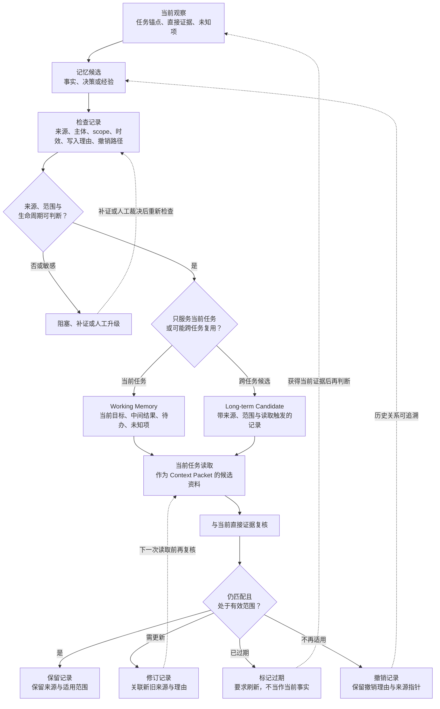

# 07. Working Memory 与 Long-term Memory

> 记忆（Memory）不是把更多历史塞回模型，而是让每一条可复用记录都能回答：它从哪里来、对谁有效、何时需要复核，以及何时必须失效。

## 本章目标

完成本章后，读者能够：

- 区分工作记忆（Working Memory）、长期记忆（Long-term Memory）、会话历史、当前 Context Packet、工作流状态和知识库候选资料。
- 用来源、主体、作用范围（scope）、时间、读取触发和撤销条件定义一个可维护的 Memory Record。
- 在写入或读取一条记录前检查证据、范围和时效；缺少条件时要求补证、刷新或人工升级。
- 解释修订、过期与撤销为何是正常生命周期，而不是把历史静默覆盖成“最新事实”。
- 使用纯内存教学示例验证分类规则，而不把它当成真实的持久化、检索或权限系统。

## 为什么要学

一个 Agent 完成任务后，通常会留下对话、终端输出、失败日志、工具结果、项目规则、人工更正和总结。若把这些材料统称为“记忆”，下一位维护者无法判断哪些只服务于当前任务，哪些可以跨任务复用，哪些已经过期，哪些根本没有来源。

产品能力也不能替代工程判断。Claude Code 文档说明，每次会话从新的上下文窗口开始；`CLAUDE.md` 和 auto memory 会在会话开始时作为 context 加载，而不是强制配置。[REF-006](https://docs.anthropic.com/en/docs/claude-code/memory) OpenAI Agents SDK 的 Sessions 则维护特定会话跨多次 run 的消息历史，并要求在同一 run 中不要与其列出的服务端延续机制叠加使用。[REF-020](https://openai.github.io/openai-agents-python/sessions/) 这些都是特定产品的当前行为，不能推出通用的长期记忆架构、存储格式或安全保证。

本章的目标更小也更实用：让一个团队能审查“为什么保存”“谁可以读取”“何时不能再用”。第 6 章决定当前调用该看哪些资料；本章决定哪些记录可以成为未来任务的候选资料。第 10 章处理状态机和恢复，第 13 章处理知识库与检索，第 41 章处理权限、隐私、保留和审计。

## 前置知识

- 已阅读第 6 章，能够区分本地可访问资料、模型可见输入和跨轮保存状态。
- 已阅读第 4 章，理解观察、候选结论和独立验证不能互相替代。
- 能阅读对象、数组与简单测试断言；不要求已经部署数据库、向量库、会话服务或任何 Agent SDK。

## 场景引入：接手者面对的不是一份“记忆”，而是一堆不同责任的记录

设想一个虚构项目的测试失败后交给新的维护者。它拿到五样东西：本轮失败断言、上一次会话摘要、已批准的项目决策、半年前的修复建议，以及一个可查询的大型日志索引。把它们全部放进下一次输入，既不保证正确，也不能解释冲突。

| 材料 | 首先应视为 | 不能直接推断 | 当前动作 |
| --- | --- | --- | --- |
| 最新失败断言 | 当前任务的直接观察 | 根因或修复方案。 | 放入工作记忆，等待验证。 |
| 会话摘要 | 某次连续对话的派生记录 | 跨任务事实或仍然有效。 | 保留来源和覆盖范围，必要时刷新。 |
| 已批准项目决策 | 可能跨任务复用的记录 | 自动适用于所有主体或版本。 | 检查作用范围、版本与读取触发。 |
| 半年前修复建议 | 过期经验候选 | 对当前失败仍然正确。 | 要求当前证据复核。 |
| 日志索引 | 可按需获取的候选资料 | 已经被模型阅读或需要永久保存。 | 记录查询条件，交给第 13 章的检索设计。 |

这个场景是本书的教学设计，不表示真实部署、账户、日志或模型执行。它要训练的不是“记住得更多”，而是先给每类信息一个可检查的责任。

## 核心概念

### 会话历史、工作记忆与长期记录不是同义词

OpenAI Agents SDK 将 Session 描述为特定会话跨多次 agent run 的消息历史：运行前读取历史并与本轮输入组合，运行后保存新增条目。[REF-020](https://openai.github.io/openai-agents-python/sessions/) 这能解释对话如何延续，却不自动说明哪些内容可跨任务复用。

同一 SDK 的 sandbox memory 文档明确把 run 间经验文件与 Session 消息历史分开，并将该能力标记为 beta；它还提醒 Agent 把记忆当作指导而非当前环境的替代品。[REF-021](https://openai.github.io/openai-agents-python/sandbox/memory/) 因此，“系统能保存什么”与“团队应当相信什么”是不同问题。

本书采用以下工作定义：

| 概念 | 最小职责 | 常见内容 | 不是 |
| --- | --- | --- | --- |
| 工作记忆 | 服务当前任务或当前阶段。 | 任务锚点、最新观察、中间结果、待办和未知项。 | 完整工作流状态机、永久档案或模型输入本身。 |
| 长期记忆 | 保存可能跨任务复用、且可追溯的记录。 | 项目决策、经过审查的经验、稳定约定。 | 所有历史、所有聊天记录或无条件的模型上下文。 |
| 会话历史 | 维持一段连续交互的消息记录。 | 用户输入、模型回复、工具交换。 | 自动提炼出的长期知识。 |
| Context Packet | 为一次调用选择的可见资料。 | 当前约束、直接证据、必要引用和未知项。 | 长期存储策略。 |
| 知识库候选 | 可定位、可检索但尚未决定如何使用的资料。 | 文档段落、日志索引、记录集合。 | 事实裁决或权限系统。 |

本章用“长期记忆”描述可跨任务维护的能力。当一条记录只通过了本章的分类检查、尚未进入实际存储和治理流程时，称它为长期候选（Long-term Candidate），避免把“可进一步审查”写成“已经持久化”。

LangChain 在其框架语境中也用 thread-scoped 状态描述短期记忆，用跨会话、跨 thread 的数据描述长期记忆，并允许按 namespace 组织记录。[REF-022](https://docs.langchain.com/oss/python/concepts/memory) 本书不把这套术语当作行业标准；它只强化一个工程问题：边界由任务、主体、读取范围和生命周期共同决定，保存时间只是其中一个信号。

### Memory Record：把可复用性写成字段，而不是猜测

本书把每条可能跨任务读取的记录看成一个 Memory Record。它不是任何 SDK 的对象定义，而是一份最小契约：

| 字段 | 要回答的问题 | 缺失时的动作 |
| --- | --- | --- |
| `kind` | 它是观察、决策、经验还是摘要？ | 不把不同性质的材料混放。 |
| `scope` | 对哪个任务、项目、团队或主体有效？ | 阻塞跨范围复用。 |
| `subject` | 这条记录属于谁或哪个对象？ | 主体不匹配时停止读取。 |
| `source` | 它来自哪个观察、决策或可追溯资料？ | 作为未知项，不晋升为记忆。 |
| `observed_at` | 它何时被观察或确认？ | 不能判断时效，要求补证。 |
| `write_reason` | 它会减少未来哪个不确定性？ | 不以“也许以后有用”保存。 |
| `read_trigger` | 哪个条件满足时才应读取？ | 不主动灌入每次模型输入。 |
| `validity` | 它何时需要刷新或不再可用？ | 不把旧记录当作当前事实。 |
| `revision_or_revocation` | 新证据到来时怎样修订或撤销？ | 不形成无法维护的长期断言。 |

概念表用 `snake_case` 说明字段含义；本章 JavaScript 示例使用 `camelCase`，例如 `observedAt` 和 `revisionOrRevocation`。两者只是在不同写作语境中遵循各自的命名习惯，不表示两套不同的记忆模型。

例如，“总是先重试”既没有来源，也没有适用范围，不能称为经验。相反，“在 `project:demo` 的认证测试中，若当前失败断言与 2026-07-15 的网络超时观察一致，可先检查重试策略；若出现新的权限拒绝，则撤销这条建议并重新观察”至少让读者知道了来源、主体、条件和失效方式。它仍然只是候选经验，不能替代当前验证。

### 写入门槛：保存不是任务结束的副产品

一个常见捷径是：任务结束后让模型自动总结，然后把总结永久保存。它的风险不在总结一定错误，而在它容易丢掉来源、适用范围和反例。LangChain 文档讨论了在主路径写入与后台写入之间的延迟、新鲜度和复杂度取舍。[REF-022](https://docs.langchain.com/oss/python/concepts/memory) 这说明“什么时候写”本身是设计选择，而不是一个可忽略的实现细节。

本书的写入闸门按以下顺序检查：

1. **证据是否可定位。** 没有 `source` 或 `observed_at` 的内容停留在候选区。
2. **主体与范围是否明确。** 一个用户的偏好、一个项目的约定和一次任务的临时结论不能共用同一默认 scope。
3. **未来用途是否具体。** 写清它会帮助哪个后续任务，或会避免哪种已知重复劳动。
4. **是否存在当前冲突。** 新直接观察与旧摘要冲突时，先记录冲突和刷新请求，不能选择“看起来更合理”的一方。
5. **是否可维护。** 对跨任务记录至少给出读取触发和修订或撤销路径；敏感数据和授权问题转交第 41 章的治理设计。

因此，写入的可能结果不是简单的“记住 / 忘记”，而是“保留为工作记忆”“成为长期候选”“阻塞补证”“升级人工判断”。这些状态只表示本书的记录决策，不表示数据已落盘、得到授权或被模型理解。

### 读取门槛：旧记录只能成为候选资料

可跨任务记录的正确位置在第 6 章 Context Packet 之前：它先作为候选资料，再与当前任务锚点、主体、作用范围、读取触发和当前证据比较。即使一条记录有明确来源，预算不足时也可能只保留指针。

即使记录满足读取条件，也不等于需要投影到本次模型输入。

读取时至少检查四件事：

- **匹配：** 当前任务和主体是否在该记录的 scope 内？
- **时效：** `validity` 是否仍允许直接使用？
- **冲突：** 最新观察是否否定、缩小或要求修订旧记录？
- **加载方式：** 当前需要全文、摘要还是一个可解析引用？

如果旧的验证命令与新的失败输出冲突，正确结果是 `refresh_required`，不是把旧命令改写成新的“事实”。OpenAI sandbox memory 文档提出的渐进读取和“以当前环境为准”可以作为这一原则的产品背景，但不能证明所有记忆系统都会自动刷新。[REF-021](https://openai.github.io/openai-agents-python/sandbox/memory/)

### 生命周期：修订、过期与撤销让历史保持可解释

记忆不是只增不减的列表。本书的生命周期是：观察 → 记忆候选 → 来源、主体、scope、时效与维护路径检查 → 工作记忆或长期候选 → 当前任务读取 → 与当前证据复核 → 保留、修订、过期或撤销。

MemGPT 论文把 virtual context management 与不同 memory tier 用作有限上下文下扩展可用信息的研究背景。[REF-023](https://arxiv.org/abs/2310.08560) 它不规定本章的状态名称、字段或存储实现。本书之所以保留“过期”和“撤销”，是为了让维护者区分：旧记录可能曾经合理，但今天不应再作为当前事实；撤销某条经验也不自动意味着发生了安全事故或有人做错了事。

## 架构图：Memory Record 的生命周期

下图回答：一条候选记录如何经过检查、进入工作记忆或长期候选，并在当前证据出现后被保留、修订、过期或撤销？Mermaid 源文件位于 [chapter-07-memory-record-lifecycle.mmd](../../diagrams/mermaid/chapter-07-memory-record-lifecycle.mmd)，导出资源为 [SVG](../../diagrams/exported/chapter-07-memory-record-lifecycle.svg) 和 [PNG](../../diagrams/exported/chapter-07-memory-record-lifecycle.png)。它已于 2026-07-15 使用 Mermaid CLI 11.16.0 导出并实际查看 PNG；审查将阻塞分支改为“补证或人工裁决后重新检查”，并把跨任务分支明确标为长期候选。图只表达本书工程模型。



> 图示替代描述：当前观察形成候选记录，记录先通过来源、主体、scope、时效、写入理由和撤销路径检查。符合条件的记录进入工作记忆或长期候选；两者在当前任务中都必须与直接证据复核。复核后可以保留、修订、标记过期或撤销。阻塞项必须补证或经人工裁决后重新检查；修订项、过期项和撤销项保留回到读取、观察或候选阶段的可追溯关系；没有任何箭头直接宣称事实、授权、安全或完成。

## 工作流程：先判断记录身份，再决定是否读取

1. **固定当前任务。** 写下任务锚点、停止条件和要验证的对象。没有任务锚点时，不创建可复用结论。
2. **登记候选。** 记录候选的类型、来源、主体、作用范围、观察时间和写入理由；不能定位来源的内容只作为未知项。
3. **通过写入闸门。** 判断它只服务当前任务、可作为长期候选，还是因冲突、敏感性或缺字段而阻塞或升级。
4. **声明读取触发。** 写明未来在什么任务、主体和条件下可以读取；不把所有长期记录预装到每次模型输入。
5. **与当前证据复核。** 当前观察优先于过期摘要；冲突时保留双方来源并请求刷新。
6. **记录生命周期动作。** 保留适用范围，或记录修订、过期、撤销的理由和来源指针。
7. **交给相邻能力。** 将实际状态恢复、检索、压缩和权限控制交给对应章节，不在记录字段里假装完成它们。

## 最小示例：纯内存 Memory Record 决策

本章已实现 [`decideMemoryRecord`](../../examples/agent/memory-record-decision.mjs)。它只接收测试注入的对象，返回 `working`、`long_term_candidate`、`blocked` 或 `refresh_required`；不会读写文件、调用模型、连接数据库、访问网络或保存真实记忆。示例是本书的分类契约，不是 SDK 的 API，也不执行真实时钟、TTL、留存或授权判断。

以下是演示命令实际传入的对象形状；其中日期和来源是注入的教学值，不是来自外部系统的读取结果，也不是产品 API：

```js
const request = {
  taskAnchor: '定位当前测试失败',
  subject: 'project:demo',
  candidate: {
    id: 'failure-observation',
    kind: 'observation',
    scope: 'task',
    subject: 'project:demo',
    source: 'injected:test-output',
    observedAt: '2026-07-15',
    writeReason: '记录当前验证对象',
    readTrigger: '当前任务仍在处理此失败',
    validity: 'current',
    revisionOrRevocation: 'replace-on-new-observation',
  },
};
```

已运行的六条确定性测试覆盖：当前观察进入工作记忆；带维护路径的跨任务经验成为长期候选；缺来源或观察时间被阻塞；过期记录要求刷新；主体不匹配不复用；跨任务候选缺少撤销路径时被阻塞。运行方式如下：

```bash
npm run test:memory-record-decision
npm run example:memory-record-decision
```

2026-07-15 的实际结果为 6 项测试通过、0 项失败；演示输出 `working` / `current_task`。通过这些测试只能证明纯函数遵守本书契约，不能证明任何产品已写入、读取、同步、授权或删除记忆。红灯基线、完整输出与边界见[示例实现记录](07-working-memory-and-long-term-memory.example-plan.md)和[整合审查](../../.memory/reviews/2026-07-15-chapter-07-example-integration.md)。

## 逐步增强：从分类函数到团队可维护的记忆系统

最小示例只负责判断一条候选。真实团队若要逐步增强，应在每一层明确扩大了什么责任：

| 阶段 | 新增能力 | 必须新增的证据 | 仍不能省略的边界 |
| --- | --- | --- | --- |
| 1. 纯内存分类 | 输出状态、原因和下一步。 | 确定性单元测试。 | 不读写外部系统。 |
| 2. 可审查记录 | 保存来源指针、修订关系和读取触发。 | 记录 Schema 与变更审查。 | 不把 Schema 当作访问控制。 |
| 3. 受控读取 | 由任务锚点与预算选择候选资料。 | Context Packet、刷新和排除记录。 | 不让旧记录覆盖当前观察。 |
| 4. 工作流集成 | 将记录与检查点、重试和人工升级连接。 | 状态机、幂等与恢复测试。 | 不把工作流状态等同于长期知识。 |
| 5. 治理与审计 | 为主体、权限、留存和删除建立控制。 | 授权决策、审计事件和保留策略。 | 不把“有 scope 字段”写成合规。 |

第 1 层足以教学；后续层必须分别由第 10、13、19 和 41 章的设计与验证支撑。

## 完整工程案例：把一次失败交接变成可审查的下一步

回到开头的虚构测试失败。Harness 先将最新断言、当前任务锚点和未知项放入工作记忆；它不把旧会话摘要直接作为事实。随后，已批准的项目决策若具备来源、主体、scope、读取触发和撤销路径，可以标为长期候选。半年前的建议由于时效不明，进入 `refresh_required`。无来源摘要进入 `blocked`，直到有人补充可追溯观察。大型日志索引只留下查询条件，等待第 13 章的检索流程。

这个闭环的交付物不是“Agent 已经学会修复 Bug”，而是一张可交接的决策表：当前任务能依赖什么、未来任务可以候选读取什么、哪些信息必须刷新、谁需要处理未决项。失败也有清晰表现：缺少来源时停下来、主体不匹配时不复用、旧经验冲突时不覆盖新观察。

## 工程实践与常见错误

### 让记录在写入时就可被审查

- 把 `source` 写成可定位的证据或决策，而不是“模型总结”。
- 将主体和 scope 写进记录，避免把一个人的偏好、一个项目的规则和一次任务的临时结论混在一起。
- 让每条跨任务记录都有读取触发和修订或撤销路径。
- 将“未知”“阻塞”“需要刷新”作为可观察输出，不用空字符串或乐观摘要掩盖。

### 不要把这些捷径当成记忆设计

| 常见错误 | 为什么失败 | 改进动作 |
| --- | --- | --- |
| 把完整聊天记录当作长期知识。 | 记录可能重复、过期、跨主体或没有稳定用途。 | 将它保留为会话历史，另行提炼带来源的候选。 |
| 每次任务结束都自动永久保存总结。 | 总结常丢失证据、范围和反例。 | 先进入写入闸门，明确未来用途与撤销路径。 |
| 把检索结果直接写回长期记录。 | 找到资料不证明资料正确、适用或已获许可。 | 保留来源、对象与验证状态，等待当前证据复核。 |
| 发生冲突就覆盖旧文本。 | 下一位维护者失去“为何变化”的线索。 | 建立修订或撤销关系，保留来源指针。 |
| 用 `scope` 字段代替权限设计。 | 字段描述意图，不执行授权、留存或审计。 | 转交第 41 章的控制与验证。 |

## 安全与边界

长期记录会扩大跨任务可见的信息集合，因此必须假定它可能包含过时、敏感、跨主体或未验证内容。本章的 Memory Record 只帮助团队把这些风险显式化；它不加密数据、不限制读取者、不计算保留期，也不生成审计证据。

当候选来自用户偏好、生产日志、凭证附近的文本或其他主体时，不要因为它“未来有用”就存入长期记录。应先停止扩大使用范围，并由第 41 章的权限、最小化、保留和审计机制决定是否、如何保存。若当前任务无法证明主体、来源或用途，`blocked` 比一条看似聪明的长期总结更可靠。

## 本章总结

工作记忆服务当前任务；长期记忆服务可能的未来任务；会话历史、Context Packet、工作流状态和知识库候选各有不同责任。把它们分开并不会减少信息，而是让信息在需要时可定位、可复核、可刷新。

Memory Record 的关键不是字段数量，而是它迫使团队回答来源、主体、作用范围、时间、写入理由、读取触发和维护路径。写入与读取都要经过闸门；冲突、过期与撤销不是异常，而是让历史保持可解释的正常动作。下一章将讨论如何把这些任务与记录组织成可恢复的 Workflow。

## 练习

1. 选择一个你维护过的故障摘要，分别写出它的 `source`、`scope`、`read_trigger` 与 `revision_or_revocation`。哪一项目前无法填写？
2. 为“团队代码风格偏好”“当前失败断言”“三个月前的修复建议”分别判定工作记忆、长期候选、知识库候选或阻塞，并解释理由。
3. 设计一条 `refresh_required` 的触发条件。它需要哪些当前证据，才能将旧记录修订为新的候选？
4. 将第 6 章的 Context Packet 与本章的长期记录画在同一张责任表中：哪个阶段决定保存，哪个阶段决定投影到模型输入？

## 延伸阅读与参考资料

- [Anthropic：How Claude remembers your project](https://docs.anthropic.com/en/docs/claude-code/memory)（Claude Code 的持久指令与 auto memory 当前文档边界）。
- [OpenAI Agents SDK：Sessions](https://openai.github.io/openai-agents-python/sessions/)（特定会话的跨 run 消息历史）。
- [OpenAI Agents SDK：Agent memory](https://openai.github.io/openai-agents-python/sandbox/memory/)（sandbox-agent beta 的 run 间经验文件与过时风险）。
- [LangChain：Memory overview](https://docs.langchain.com/oss/python/concepts/memory)（thread-scoped 与跨 thread 记忆的框架语境）。
- [MemGPT: Towards LLMs as Operating Systems](https://arxiv.org/abs/2310.08560)（分层记忆与有限上下文的研究背景）。

详细的来源范围、外推禁区与写作日复核要求见[第 7 章事实核验清单](07-working-memory-and-long-term-memory.fact-check.md)和[候选参考资料](07-working-memory-and-long-term-memory.references.md)。

## 章节完成检查表

- [x] 用原创教学场景区分当前观察、会话历史、长期候选和检索候选。
- [x] 将 Claude Code、OpenAI Agents SDK、LangChain/LangGraph 和 MemGPT 的事实限定在各自来源范围内。
- [x] 将 Working Memory、Long-term Memory、Memory Record、写入/读取闸门和生命周期明确标为本书工程模型。
- [x] 解释了来源、主体、scope、时效、冲突、修订、过期与撤销的工程意义。
- [x] 已导出并实际查看 Mermaid SVG/PNG，且将阻塞记录回到重新检查、跨任务记录保持为长期候选。
- [x] 已实际运行纯内存示例的 6 项测试与演示，并将结果限定为注入对象上的教学行为。
- [x] 将检索、压缩、状态恢复、权限、隐私和审计交回相邻章节。
