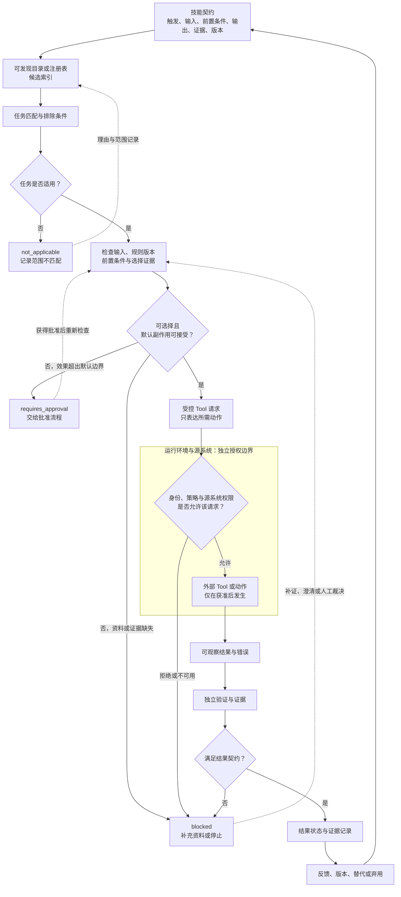

# 08. Skills 与可复用能力

> 技能（Skill）不是一段更长的提示词（Prompt），而是一份让人和 Agent 都能判断“何时可用、需要什么、做了什么、还没有证明什么”的任务契约。

## 本章目标

完成本章后，读者能够：

- 识别重复提示词（Prompt）带来的范围、版本、证据和副作用不清问题，并把它收束为一个窄的可复用任务。
- 为 Skill 写出包含触发条件、输入、前置条件、工具边界、输出、失败表示、证据、维护者和版本的技能契约（Skill Contract）。
- 区分提示词（Prompt）、技能（Skill）、工具（Tool）、工作流（Workflow）、钩子（Hook）、插件（Plugin）与运行环境权限，不把任何一项配置或安装状态误写成外部授权。
- 用固定输入检查一个 Skill 的选择、阻塞、升级和弃用条件，而不是只检查它是否生成了看起来合理的文字。
- 以 Markdown 审查为例设计默认只读、可交接、可复核的 Skill；并将真实写入和发布留给经批准的后续任务。

## 为什么要学

团队常把“我们已经有一套做法”误认为“我们已经有一个可复用能力”。例如，三位维护者都曾用聊天工具审查 Markdown 章节：有人要求检查引用，有人只看语言，有人让 Agent 直接修改文件。三段提示内容相似，却没有共同的任务名、输入范围、失败形式、版本和验收证据。

这种 Prompt 碎片在任务顺利时看不出问题。一旦输出缺少链接证据、审查范围被扩大，或有人问“这份报告按哪条规则产生”，团队就只能翻聊天记录。复制文本没有给出维护接口，也没有把风险交给正确的责任层。

一些产品和规范提供了可复用 Skill 的机制。Agent Skills Specification 将一个 Skill 定义为至少含 `SKILL.md` 的目录；该文件包含 YAML front matter 和 Markdown 正文，`name` 与 `description` 为必填字段，且可附带 `scripts/`、`references/`、`assets/` 等资源。[REF-024](https://agentskills.io/specification)

Claude Code 的当前文档也建议：当同一套说明、检查表或多步骤过程被反复粘贴时，可将它整理为 Skill；Skill 正文在使用时才加载。[REF-025](https://docs.anthropic.com/en/docs/claude-code/skills)

这些事实说明“可复用任务”可以有清晰的工件边界，却不能保证一个 Skill 会被正确发现、拥有真实权限或产生正确结果。本章只建立可维护 Skill 的工程接口。第 9、10 章处理计划和多步状态；第 11 章处理 Tool 接口；第 12 和 14 章分别处理运行环境、权限与人工批准。

## 前置知识

- 已阅读第 5 章，理解项目规则、任务输入、上下文资料与输出契约具有不同责任。
- 已阅读第 6 章，理解一次调用的 Context Packet 需要按来源、范围和预算选择资料。
- 能阅读 Markdown、目录结构、简单 YAML front matter、对象和断言；不要求安装任何特定 Skill 产品或 Agent SDK。

## 场景引入：三段“审查章节”的提示，为什么不能直接合并

设想一个虚构团队正在维护本书。它积累了三段常用文本：

| 提示片段 | 表面目标 | 缺少的工程信息 |
| --- | --- | --- |
| “检查这一章的语言和结构。” | 让输出更易读。 | 章节路径、适用规则、失败如何表示。 |
| “确认所有引用都可靠。” | 降低事实风险。 | 哪些引用登记在册、何时必须重新访问来源。 |
| “发现问题就直接修复。” | 缩短修改路径。 | 是否允许写入、谁批准、怎样验证修改后仍正确。 |

把它们堆成一大段 Prompt，只会掩盖冲突：前两段可以是只读审查，第三段却要求副作用；“所有引用”也没有说明登记表、访问日期和不可访问页面怎样处理。正确的第一步不是强化措辞，而是把“审查”收缩成一个可说明边界的 Skill。

本章用 `review-markdown-chapter` 作为教学名称。它不是已经安装的 Skill，也不读取真实仓库。它的默认作用是对给定输入产生结构化发现（findings）与未验证范围；修改正文、运行外部工具或发布内容必须由另一项经批准的任务承担。

## 核心概念

### Prompt 是一次输入；Skill 是可维护的任务单元

Prompt 可以是一次调用中的问题、指令、资料或示例。它适合表达这一次“审查哪一章”“重点看什么”。但 Prompt 本身通常无法回答：它是否适用于别的任务、需要哪些输入、失败时应停止还是继续、谁维护这一做法，以及版本变化会影响哪些使用者。

本书把 Skill 定义为围绕一个窄任务组织的说明与支持资源。它可以引用 Prompt、指导 Tool 调用或作为 Workflow 的一步，但不等于其中任何一个。为避免将内容和权限混在一起，本书使用下列判断表：

| 概念 | 主要回答的问题 | 可以包含什么 | 不能证明什么 |
| --- | --- | --- | --- |
| Prompt | 这一次请求希望怎样处理输入？ | 任务目标、资料、示例、约束。 | 已发现、可维护、被授权或已验证。 |
| Skill | 哪个重复任务可被选择和维护？ | 触发、步骤、支持资源、输出和验证要求。 | 外部工具一定可用或动作已经执行。 |
| Tool | 怎样以明确输入输出调用一个外部能力？ | 参数、结果、错误、副作用接口。 | 任务目标正确、调用被授权或结果被接受。 |
| Workflow | 多个步骤如何编排、恢复和交接？ | 状态、依赖、检查点、重试与停止条件。 | 每个步骤本身已经是一个通用 Skill。 |
| Hook | 哪个事件触发自动化？ | 事件条件、自动运行规则、监听范围。 | 触发后的动作安全、成功或已验证。 |
| Plugin | 某个产品怎样打包和分发能力？ | 该产品定义的 Skill、App、模板或资源。 | 源系统权限、跨产品兼容性或统一生命周期。 |
| 运行环境权限 | 谁可在何处读、写、发送或执行？ | 身份、策略、Sandbox、审批和源系统控制。 | 能由 Skill 文本、目录或描述自行授予。 |

这张表是本书的教学模型，不是行业术语标准。它的目的很朴素：当有人说“已经装了 Skill，所以可以改文件”时，团队能指出缺少的是运行环境和审批证据，而不是再补一条 Prompt。

### 最小工件与渐进加载

Agent Skills Specification 的目录结构提供了一个有用的最小形式：`SKILL.md` 是必需入口，`scripts/`、`references/` 和 `assets/` 可作为附加资源。[REF-024](https://agentskills.io/specification) 规范还描述了渐进加载：启动时读取元数据，激活 Skill 时读取正文，再按需要读取资源。该加载方式是规范的设计；不同 Agent 是否支持、如何缓存以及如何发现目录，仍要以各自实现为准。

可把一个可维护 Skill 看成三层信息：

| 层次 | 典型内容 | 要回答的问题 | 不应承担的责任 |
| --- | --- | --- | --- |
| 发现层 | 名称、描述、适用任务、简短排除条件。 | “它是否值得作为候选？” | 不能代替完整前置检查或权限判断。 |
| 执行层 | 步骤、输入输出、失败表示、验证与停止条件。 | “选中后应怎样完成？” | 不能因为写了步骤就直接执行副作用。 |
| 支持层 | 模板、参考资料、脚本、示例、测试数据。 | “需要时到哪里取得细节？” | 不能把未知资源自动视为可信或已加载。 |

这种分层并不意味着“描述越短越好”。它要求描述足够说明任务与使用时机，正文足够交代边界，细节资源则在确实需要时再读取。规范建议 `description` 同时描述 Skill 做什么、何时使用，并将 `SKILL.md` 的长内容拆到引用文件中。[REF-024](https://agentskills.io/specification) 对本书而言，渐进加载的价值是让上下文成本、审查范围和维护责任可见，而不是让系统自动猜对任务。

### Skill Contract：选择与执行前都要能回答的问题

产品的 front matter 字段、目录位置和加载顺序会变化。本书因此不把任何产品配置当作统一 schema，而是用 **Skill Contract** 记录一个可复用任务最少需要回答的问题：

| Contract 项 | 要写清的内容 | 缺失时的默认动作 | 不能推出的结论 |
| --- | --- | --- | --- |
| 问题与触发 | 解决哪一类窄任务；何时不适用。 | 标记 `not_applicable` 或请求澄清。 | 描述匹配就一定应执行。 |
| 输入 | 任务对象、路径或资料、规则版本、审查维度。 | `blocked`，不猜测输入。 | Skill 已拥有全部仓库上下文。 |
| 前置条件 | 可读取范围、所需资料、环境和依赖。 | `blocked`，列出缺项。 | 文件、工具或身份真实可用。 |
| 工具与副作用 | 需要的工具类别、默认副作用、升级条件。 | 高风险动作转 `requires_approval`。 | Contract 本身授予工具权限。 |
| 输出 | 成功、阻塞、拒绝和未知分别怎样表示。 | 不用“完成”掩盖缺字段。 | 输出格式正确即结论正确。 |
| 证据与验证 | 每种状态由什么可观察材料支持。 | 标记未验证范围。 | 模型陈述或工具文本自动成为证据。 |
| 维护与版本 | 维护者、兼容性、变更记录和弃用条件。 | 不发布无责任主体的长期能力。 | 有版本号就自然兼容。 |

这里的字段名和状态名是本书模型，不是 Agent Skills 的强制配置。它特别区分“需要某类工具”与“获得该工具权限”。Agent Skills Specification 中的 `allowed-tools` 是可选、实验性的字段，且客户端支持情况可能不同。[REF-024](https://agentskills.io/specification) 即使某个实现把它解释为预批准工具，团队仍需在运行环境、组织策略和源系统层面确认访问是否被允许。

下面是 `review-markdown-chapter` 的教学 Contract 摘要：

```yaml
name: review-markdown-chapter
purpose: 对指定章节产生只读的结构化审查发现
triggers:
  - 请求审查一个明确的 Markdown 章节
exclusions:
  - 发布、翻译、自动修复或范围不明的全仓重写
inputs:
  - chapter_path
  - rule_version
  - reference_registry
  - review_dimensions
preconditions:
  - 章节与规则可读取
  - 审查范围明确
default_effect: none
outputs:
  - findings
  - evidence
  - unverified_scope
```

这段 YAML 只是解释本书 Contract 的一种写法，不是可直接安装的 `SKILL.md`，也不代表当前目录中存在这项能力。真正的产品字段、调用方式与权限行为必须在实施当天依据官方资料和运行环境复核。

### 发现与选择：相关性不是许可

发现过程只能将 Skill 放进候选集，不能替代选择理由。Claude Code 当前文档说明，Skill 可在相关时由 Claude 使用，也可直接以 Skill 名称调用；其目录位置、覆盖规则、嵌套发现和专有 front matter 都是 Claude Code 的产品行为。[REF-025](https://docs.anthropic.com/en/docs/claude-code/skills)

ChatGPT 的当前帮助页也说明，安装后的 Skill 可在有帮助时自动使用。[REF-026](https://help.openai.com/en/articles/20001066-skills-in-chatgpt) 这些陈述不能外推为所有 Agent 的发现算法、安全策略或优先级。

本书将选择过程拆为五个可记录步骤：

1. **登记候选。** 根据名称、描述和任务线索列出可能的 Skill，而不是立即调用第一个关键词匹配项。
2. **检查排除条件。** 任务若是发布、自动修复或范围不明，就不能选只读审查 Skill。
3. **检查输入和前置条件。** 缺章节路径、规则版本或引用登记时，输出 `blocked`，不能由模型补全。
4. **裁决副作用。** 默认只读的 Contract 遇到写入请求时输出 `requires_approval`，并把编辑任务交给有明确权限和验证的后续流程。
5. **记录理由。** 记录选择、未选择、阻塞或升级的理由和输入证据，供下一位维护者复查。

| 任务摘要 | 应有结果 | 理由 |
| --- | --- | --- |
| “审查 `docs/ch-08.md` 的引用和术语，禁止修改。” | `selected` | 范围、输入与只读作用一致。 |
| “审查这一章。” | `blocked` | 未给出章节路径和审查维度。 |
| “把所有旧文章改写后发布。” | `not_applicable` | 任务超过审查 Contract，且带发布副作用。 |
| “发现问题后直接修改文件。” | `requires_approval` | 默认无副作用；写入必须换用获批的编辑流程。 |
| “使用上一版规则，但不知道适用于哪个项目。” | `blocked` | 规则的主体与版本范围不明确。 |

选择记录的作用不是让模型“解释得更完整”，而是让失败也成为可观察结果。一个明确的 `blocked` 比一份猜测性审查报告更容易被修复和接手。

### Tool、Hook、Plugin 与权限：边界必须在调用前存在

Skill 可以说明任务使用什么能力，却不能替代该能力的真实协议与授权。以 Markdown 审查为例，Skill 可能要求“读取给定章节”和“检查引用登记”；Tool 则需要定义实际的读操作、输入、错误与副作用；运行环境才决定当前身份是否真的可读取该路径。若需要改文件，工作流还要声明检查点、回读验证和人工批准。

OpenAI 的当前 Plugin 文档明确指出：Plugin 使用 App 时会继承 App 的角色访问、动作控制和相关设置；源系统的已有权限仍然适用，Plugin 不会让用户越过其在连接系统中的权限。[REF-027](https://help.openai.com/en/articles/20001256-plugins-in-codex) 因此，“Plugin 可见”“Skill 已安装”“App 已批准”与“当前用户能写入某个仓库”都不是同一个命题。

可以用下面的因果链检查常见误读：

```text
Skill 被发现
  ≠ Skill 被选择
  ≠ 前置条件满足
  ≠ 工具可调用
  ≠ 外部动作被授权
  ≠ 结果被验证
```

每个不等号都需要独立证据。例如，ChatGPT 帮助页提醒上传的 Skill 可能包含说明、支持文件和代码；平台扫描不应取代使用者自己的审查、政策或判断。[REF-026](https://help.openai.com/en/articles/20001066-skills-in-chatgpt) 这条提示支持“外部 Skill 包应被审查”，但不构成任何平台、供应商或组织的完整安全保证。

## 架构图：Skill 生命周期与权限边界

下图回答：一个 Skill 如何从可发现候选进入任务匹配、前置检查、受控请求、独立验证和版本反馈，同时把真实授权留在运行环境与源系统的独立边界中？Mermaid 源文件位于 [chapter-08-skill-lifecycle.mmd](../../diagrams/mermaid/chapter-08-skill-lifecycle.mmd)，已于 2026-07-15 使用 Mermaid CLI 11.16.0 导出并查看 [SVG](../../diagrams/exported/chapter-08-skill-lifecycle.svg) 与 [PNG](../../diagrams/exported/chapter-08-skill-lifecycle.png)。图只表达本书工程模型，不代表任何产品的发现算法、内部调用链、安装状态、自动授权、真实执行、结果正确性或安全保证。



> 图示替代描述：技能契约先进入可发现目录或注册表，再经过任务匹配与排除条件。范围不匹配时记录 `not_applicable`；适用任务必须检查输入、规则版本、前置条件和选择证据。资料或证据缺失时进入 `blocked`，请求效果越过默认边界时进入 `requires_approval`。只有通过这些检查的受控 Tool 请求才会进入独立的运行环境与源系统授权边界；该边界拒绝或不可用时仍进入 `blocked`。获准后的外部动作产生可观察结果，再经独立验证决定是否记录结果状态，并进入反馈、版本、替代或弃用。任何箭头都不将发现、Contract 声明、请求或授权直接等同于结果已验证。

## 工作流程：把一次可用的 Skill 变成可维护接口

1. **缩小任务。** 写出一个具体问题与停止条件，例如“只读审查一个指定章节”，而不是“提升内容质量”。
2. **定义 Contract。** 记录触发、排除条件、输入、前置条件、输出、失败表示、证据和副作用上限。
3. **设计发现线索。** 用名称和描述帮助人或系统列出候选；不要把描述当作选择或权限证明。
4. **在选择前检查。** 检查任务范围、资料和规则版本；若任务需要外部动作，还要检查身份与环境的授权证据。缺任何关键条件就阻塞或升级。
5. **执行最小动作。** 默认选择只读、可回退的动作；写入、外发或不可逆动作要求独立审批与后续章节的控制。
6. **验证与记录。** 输出 findings、证据、未知项和未验证范围；记录选择理由、版本与下一步，而不是一句“已完成”。
7. **维护生命周期。** 当输入、输出、规则或支持工具改变时，更新 Contract，重跑固定案例，并决定兼容、替代或弃用。

## 最小示例：纯内存 Skill 选择

本章已实现 [`evaluateSkillSelection`](../../examples/agent/skill-selection.mjs)。它只读取测试或演示注入的 Contract、任务摘要、前置条件和选择证据，返回 `selected`、`blocked`、`requires_approval` 或 `not_applicable`；不会读取真实章节、安装真实 Skill、调用模型、Tool、Plugin、Hook、网络、文件、环境变量、时钟、账户或凭证。

演示实际传入的教学数据形状如下：

```js
const task = {
  request: '审查指定章节的引用与术语，不修改文件',
  chapterPath: 'docs/part-02-components/08-skills-and-reusable-capabilities.md',
  ruleVersion: 'book-rules@2026-07-15',
  reviewDimensions: ['citations', 'terminology'],
  requestedEffect: 'read-only',
};

const expected = {
  status: 'selected',
  reason: 'scope-and-preconditions-satisfied',
  evidence: ['chapterPath', 'ruleVersion', 'reviewDimensions'],
  effects: [],
};
```

`chapterPath`、`ruleVersion` 与 `referenceRegistry` 都是注入字符串，不是文件系统或外部服务查询。实施前已先运行测试并因模块缺失得到 `ERR_MODULE_NOT_FOUND` 红灯；实现后于 2026-07-15 实际运行 6 项 Node 内置测试，全部通过，演示输出 `selected / ready_for_read_only_review`。这些结果只证明纯函数对注入对象遵守本书 Contract；不证明真实章节、规则、引用、权限或审查结果存在。完整接口、红绿记录与边界见 [示例实现记录](08-skills-and-reusable-capabilities.example-plan.md)。

## 逐步增强：每一层只扩大一种责任

| 阶段 | 新增责任 | 应增加的验证 | 仍不能省略的边界 |
| --- | --- | --- | --- |
| 1. 纯内存选择 | Contract 与任务是否匹配。 | 固定输入的选择、阻塞和升级测试。 | 不读取真实文件或调用工具。 |
| 2. 只读审查 | 读取获准范围并产生 findings。 | 路径范围、规则版本和证据引用检查。 | 不把 findings 变成自动修改。 |
| 3. 受控修复 | 对已批准的问题生成变更建议或补丁。 | dry-run、diff、回读验证和撤销路径。 | 不以 Skill 文本绕过写入权限。 |
| 4. 工作流编排 | 将多个 Skill 接入计划、状态和恢复。 | 检查点、幂等、重试与交接测试。 | 不把 Workflow 状态当作结果证据。 |
| 5. 团队治理 | 分发、版本、访问、审计和弃用。 | 维护者、变更记录、权限审查和迁移测试。 | 不把打包或扫描当作充分安全保证。 |

第 1 层足以验证本章的选择契约。后续层必须分别进入 Tool、运行环境、审批、工作流和治理的责任边界；将它们偷偷塞进“更聪明的 Skill”会让风险不可审查。

## 完整工程案例：只读 Markdown 审查 Skill

### 背景与约束

虚构团队希望让任何维护者以同一套最小要求审查一篇书稿，但不希望审查任务暗中改写正文、访问未提供的资料，或把无法访问的来源伪装为已核验。

因此，团队设计 `review-markdown-chapter`，并明确以下约束：

- 输入只包含指定章节、适用写作规则、引用登记和审查维度；范围以这些输入为准。
- 默认副作用为无。发现问题时只产生 findings；是否修改内容由另一个有审批、diff 和回读验证的任务决定。
- findings 分为 `must_fix`、`should_fix`、`suggestion` 与 `blocked`；每项必须带位置、理由或证据，以及无法验证的范围。
- 失效链接、未登记引用和术语不一致是教学输入；它们不代表本仓库或外部网站的真实状态。

### 选择与输出

| 输入状态 | 输出状态 | 输出必须包含 | 不应做的事 |
| --- | --- | --- | --- |
| 章节、规则、引用登记和维度齐全，且要求只读。 | `selected` | 选择理由、输入版本、无副作用边界。 | 宣称审查已经完成。 |
| 缺引用登记或规则版本。 | `blocked` | 缺少项、未验证范围、下一步。 | 猜测来源或使用默认规则。 |
| 请求自动修复。 | `requires_approval` | 需要的批准、建议交接任务。 | 直接写入章节。 |
| 请求发布或全仓重写。 | `not_applicable` | 范围不匹配理由、可选转交对象。 | 把宽任务硬塞进审查 Skill。 |

### 实现说明与取舍

| 决策 | 本章选择 | 原因 | 边界 |
| --- | --- | --- | --- |
| 默认作用 | 只读、无副作用。 | 先让报告和证据可复核。 | 真实读取仍需环境权限。 |
| 结果形状 | 结构化 findings 与 `unverified_scope`。 | 不让“没有发现问题”掩盖无法检查的部分。 | 结构化形状不等于语义正确。 |
| 选择时机 | Contract 与前置检查后。 | 描述匹配不能替代范围裁决。 | 自动发现逻辑因产品而异。 |
| 版本策略 | Contract 变化时重跑固定案例。 | 让规则演进留下回归证据。 | 不承诺跨版本无差异。 |
| 修改动作 | 交给独立的编辑流程。 | 写入需要批准、diff 与回读验证。 | Skill 不自行获得写权限。 |

这个案例仍只描述审查设计。已实现的示例只验证选择 Contract，不运行 Markdown 检查器、链接检查器、模型、文件权限、Hook、Plugin 或产品安装；它不产生 findings，更不修改文件。是否在另一个明确范围内集成真实检查工具，必须另行定义 Tool、环境、审批与验证边界。

## 测试与验证

本章的事实来源已于 2026-07-15 重新读取。Agent Skills Specification 只支持其自身的目录、front matter、资源与渐进加载说明；Claude Code、ChatGPT Skills 与 OpenAI Plugins 的产品行为只在各自官方页面范围内使用。[REF-024](https://agentskills.io/specification) [REF-025](https://docs.anthropic.com/en/docs/claude-code/skills) [REF-026](https://help.openai.com/en/articles/20001066-skills-in-chatgpt) [REF-027](https://help.openai.com/en/articles/20001256-plugins-in-codex)

选择示例已实现并运行；Mermaid 图源、SVG/PNG 导出图和视觉审查也已完成。下面的测试矩阵区分已运行的纯函数路径与尚未实施的实际审查：

| 验证对象 | 固定情形 | 预期 | 实际状态 |
| --- | --- | --- | --- |
| 选择 | 只读任务、输入齐全。 | `selected`，并保留选择证据。 | 已运行，6 项测试之一。 |
| 前置条件 | 缺章节路径、规则版本或 `rulesAvailable`。 | `blocked`，列出缺项。 | 已运行，6 项测试之二、三。 |
| 范围 | 请求全仓重写。 | `not_applicable`。 | 已运行，6 项测试之四。 |
| 副作用 | 请求直接修改文件。 | `requires_approval`，不执行写入。 | 已运行，6 项测试之五。 |
| 输出边界 | 选择证据缺失。 | `blocked`，不选择 Skill。 | 已运行，6 项测试之六。 |

本章已运行 `npm run test:skill-selection` 与 `npm run example:skill-selection`；前者报告 6 项通过、0 项失败，后者输出 `selected / ready_for_read_only_review`。Mermaid 图源已由 Mermaid CLI 11.16.0 导出 SVG/PNG 并完成视觉审查。项目级 Markdown lint、链接检查和完整工具链会在本阶段结束时再次运行；它们只能验证仓库文档与确定性教学示例，不验证真实 Skill、产品安装、工具调用或权限行为。

## 工程实践

- **先为失败设计输出。** `blocked`、`not_applicable`、`requires_approval` 与 `unverified_scope` 是接口的一部分。没有这些状态时，模型很容易用自然语言“完成”掩盖条件缺失。
- **把发现线索当作候选索引。** 名称、描述和关键词可降低发现成本，但选择理由必须回到 Contract、任务范围和前置条件。
- **让副作用默认显式。** 对读、写、发消息、发布和不可逆操作分别声明需要哪一层的验证；不要用“已安装”或“可自动调用”替代权限证据。
- **给支持资源单独边界。** 外部 Skill 包可含指令、脚本和代码。来源审查、依赖、可执行权限和数据处理要在加载或运行前分别审查。
- **把弃用视为交付。** 当规则语义或输出契约改变时，给出替代 Skill、适用范围、迁移条件与停止使用日期，而不是静默删除目录。

## 最佳实践

- 为每个 Skill 指定一个可拒绝的任务范围。例如“审查指定章节”比“改善文档质量”更容易验证。
- 将规则版本和资料来源放进输入或证据中，使同一个名称不会悄悄指向不同过程。
- 先实现无副作用的选择或分类函数，再把真实读取、写入和发布加入受控工作流。
- 用通过、阻塞、范围不匹配、要求批准和证据不足的样例共同测试，避免只为“成功路径”优化描述。
- 在产品动态行为出现时引用官方页面，并注明它只适用于该产品；跨产品的设计原则必须写成自己的工程论证。

## 常见错误

| 错误 | 表现 | 根因 | 修复方向 |
| --- | --- | --- | --- |
| 把长 Prompt 命名为 Skill | 文本变长，但没有输入、失败或版本契约。 | 只改名称，没有新增维护接口。 | 写出触发、排除、输出和验证字段。 |
| 依关键词自动选择 | “Markdown”一词让发布任务误选审查 Skill。 | 描述被当成许可。 | 增加排除条件、前置检查和选择记录。 |
| 把工具声明当授权 | 写入被描述为“Skill 已允许”。 | 混淆 Contract、Tool 与运行环境。 | 由 Sandbox、身份、源系统和审批独立裁决。 |
| 只报告发现，不给证据 | 看似详细，但无法定位或复查。 | 输出契约没有未验证状态。 | 每项附位置、证据或明确的未验证范围。 |
| 静默替换 Skill | 旧调用者得到不同动作或副作用。 | 没有版本、兼容性和弃用策略。 | 记录破坏性变化、替代项和迁移条件。 |
| 将平台扫描当完备审查 | 外部包通过扫描后直接用于高风险任务。 | 忽略说明、支持文件、代码与组织政策。 | 进行来源、资源和副作用的独立审查。 |

## 安全与边界

- **权限边界：** Skill Contract、`description`、`allowed-tools`、Plugin 安装或自动发现都不能越过运行环境、工作区和源系统权限。
- **数据边界：** 支持资源、用户上传内容和引用资料可能包含不可信指令或代码；它们是待审查数据，不会因被加载而成为项目规则。
- **副作用边界：** 本章案例默认只读。真实写入、外发、发布、凭证使用与不可逆操作需要第 11、12、14 章定义的 Tool 契约、环境控制、审批和验证。
- **产品边界：** Claude Code 的目录与调用细节、ChatGPT 的创建共享与管理、OpenAI Plugin 的可用性和 App 控制均会变化；写作或实施当天必须重新查询官方资料。
- **不适用范围：** 本章不提供企业权限模型、插件市场治理、MCP 配置、Hook 安全策略或真实文件修改实现。

## 章节总结

可复用能力不是“把好 Prompt 保存起来”。它需要一个能解释选择、输入、前置条件、副作用、输出、证据和维护责任的 Skill Contract。发现线索只负责把 Skill 放进候选集；运行环境决定动作是否被允许；验证决定结果能否被接受。

`review-markdown-chapter` 展示了一个有意受限的起点：它默认只读，只产生结构化发现和未验证范围，不自行修复或发布。这个限制让团队可以先验证选择与证据接口，再把多步编排交给 Workflow、把外部调用交给 Tool、把权限交给运行环境和人工审批。

下一章将讨论 Planning 与任务拆解：当一个目标需要多个有依赖的 Skill、检查点和停止条件时，怎样把它拆成可验收的子任务，而不是让一个“万能 Skill”承担整条链路。

## 练习

1. 为“检查 pull request 描述是否包含测试范围”写一份 Skill Contract，至少给出两个排除条件和一个 `blocked` 输出。
2. 把“每天自动发布变更日志”的需求拆成 Skill、Tool、Workflow、Hook 和运行环境权限分别要回答的问题。
3. 为 `review-markdown-chapter` 补充一个“引用登记缺失”的固定输入，并说明为什么预期应是 `blocked` 而不是“无问题”。
4. 设计一个破坏性版本变更：原本只读的 Skill 现在要修复文件。写出需要新增的批准、验证和弃用信息。

## 延伸阅读

- [Agent Skills Specification](https://agentskills.io/specification)：Skill 目录、`SKILL.md`、可选资源与渐进加载的规范范围；2026-07-15 复核。
- [Claude Code Skills](https://docs.anthropic.com/en/docs/claude-code/skills)：Claude Code 的 Skill 发现、调用、位置与扩展字段；2026-07-15 复核，仅限 Claude Code。
- [Skills in ChatGPT](https://help.openai.com/en/articles/20001066-skills-in-chatgpt)：ChatGPT 中可复用 Skill、共享、上传审查与工作区控制说明；2026-07-15 复核，仅限其产品范围。
- [Plugins in ChatGPT and Codex](https://help.openai.com/en/articles/20001256-plugins-in-codex)：Plugin、App 与源系统权限边界；2026-07-15 复核，仅限其产品范围。

## 参考资料

- REF-024：Agent Skills Specification。支持最小目录、`SKILL.md`、元数据、可选资源、渐进加载与实验性 `allowed-tools` 的规范陈述。
- REF-025：Anthropic，Claude Code Skills 文档。支持 Claude Code 的 Skill 发现、调用、目录和扩展字段陈述。
- REF-026：OpenAI，Skills in ChatGPT。支持 ChatGPT Skill 的可复用工作流、资源、上传审查与工作区控制陈述。
- REF-027：OpenAI，Plugins in ChatGPT and Codex。支持 Plugin、App、角色动作控制和源系统权限边界陈述。

## 章节完成检查表

- [x] Front matter、目标、前置知识、章节依赖和相邻章节边界完整。
- [x] 正文采用原创场景与结构；规范或产品事实、本书工程模型和教学案例已分开。
- [x] 复核并链接 REF-024 至 REF-027；动态产品行为标明写作日与适用范围。
- [x] Mermaid 图源、SVG/PNG 导出和视觉审查已完成；图只表达本书模型，并将运行环境与源系统授权保留为独立边界。
- [x] 纯内存选择示例、红绿测试和演示已完成；只验证注入对象，不涉及真实 I/O 或权限。
- [x] Technical Review、Fact Check、Language Editing 与 Final Review 已完成。
- [x] Language Editing 后已运行 `npm run validate`，并同步状态与交接文件。
