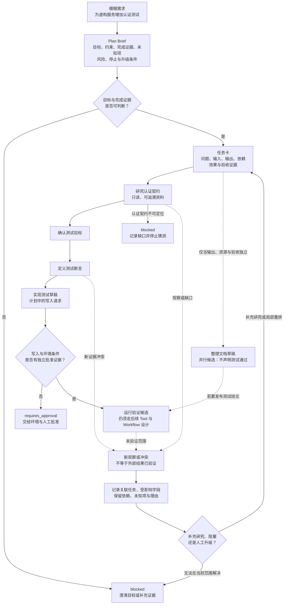

# 09. Planning 与任务拆解

> 计划（Planning）不是模型给出的步骤清单，而是一组让维护者能够判断“现在能否开始、应等待什么、何时停止”的可审查工件。

## 本章目标

完成本章后，读者能够：

- 将模糊目标改写为包含完成证据、未知项、风险、停止条件和人工升级条件的计划摘要（Plan Brief）。
- 为每个子任务写明输入、输出、依赖、副作用边界、验收证据和阻塞表示，而不是用“先做 A，再做 B”代替任务卡（Task Card）接口。
- 区分证据依赖、共享资源依赖和副作用依赖，并只把满足条件的任务标为并行候选。
- 根据新观察局部修订计划、补充研究、停止或升级，而不把新计划文本当成外部动作已经完成。
- 分开计划、Skill、工作流（Workflow）、工具（Tool）、运行环境与人工批准的责任，避免将任务图误读为授权或执行结果。

## 为什么要学

“帮我给应用程序接口（Application Programming Interface，API）加认证测试，完成后告诉我”听起来很明确，实际上遗漏了几乎所有影响工程结果的问题：认证契约在哪里、测试针对哪些接口、可否访问测试环境、能否使用凭证、成功由哪个断言证明、环境不可用时是否停止。

直接让智能体（Agent）列出“读代码、写测试、运行测试”三步，往往只把未知项排成一列。任务开始后，执行者仍会在缺契约、缺范围或缺权限时猜测；而最后的“已完成”也无法告诉接手者是否真正运行过测试，还是只生成了测试草稿。

Plan-and-Solve Prompting 把“先制定计划，将整体任务划分为较小子任务，再按计划完成子任务”用于多步推理研究。[REF-028](https://aclanthology.org/2023.acl-long.147/) 这提供了一个有用的背景：分解能让遗漏的步骤变得可见。它不提供生产计划字段、真实依赖图、授权模型或验收流程。

ReAct 研究则让推理轨迹与任务动作交错；论文将推理轨迹描述为可帮助模型引出、跟踪和更新行动计划，以及处理例外。[REF-004](https://arxiv.org/abs/2210.03629) 对工程实践而言，重要的不是模仿其轨迹格式，而是承认计划会被观察修正。一次新的观察只能改变下一步的候选决策，不能倒写“前一步已经成功”。

本章把计划视为 Harness 的控制面：它把目标、证据、约束和未知项组织成可审查的任务分解。第 10 章再把这些任务放进可恢复的状态机；第 11、12、14 和 26 章分别处理真实 Tool、运行环境权限、人工批准和多智能体隔离。

## 前置知识

- 已阅读第 5 章，理解规则、任务、资料和输出契约不能混写为一段指令。
- 已阅读第 6 章，理解 Context Packet 只携带当前任务所需、具有来源和范围的资料。
- 已阅读第 8 章，理解技能契约（Skill Contract）描述可复用能力，但不授予工具、环境或源系统的真实权限。
- 能阅读 Markdown 表格、简单对象和依赖箭头；不需要安装特定 Agent SDK、项目管理系统或任务调度器。

## 场景引入：一句需求如何变成一组可判断的任务

下面的场景是教学假设，不对应本仓库、某个真实 API 或任何已运行的测试：维护者希望为一个虚构服务增加认证测试，并要求“覆盖未认证访问与过期凭证”。目前只知道需求文字，尚不知道认证方案、目标端点、测试数据、环境状态或允许的外部操作。

如果马上写测试，执行者必须补造这些细节。更稳妥的开始是写出 Plan Brief：目标是形成可审查的认证测试方案；完成条件是认证契约、目标范围、断言和验证方式都可定位；停止条件是缺少认证契约或需要真实凭证；人工升级条件是计划需要访问受限环境或改变共享测试资源。

这个 Brief 不会让需求自动完整。它的作用是把“还不知道什么”变成显式输出。此时最正确的结果可能是 `blocked` 或 `requires_approval`，而不是一段看起来合理的测试代码。

## 核心概念

### Plan Brief：先定义能否开始，而不是先扩写步骤

本书将 Plan Brief 定义为任务分解前的最小约束面。它至少回答以下问题：

| 项目 | 要回答的问题 | 缺失时的动作 |
| --- | --- | --- |
| 目标 | 最终希望改变或确认什么？ | 要求澄清，不把愿望当验收。 |
| 约束 | 哪些范围、数据、环境或副作用不可越过？ | 缩小范围或升级。 |
| 完成证据 | 由什么可观察材料判断结果？ | 标为 `not_ready`。 |
| 已知未知项 | 当前尚不能定位什么？ | 建立研究任务或阻塞项。 |
| 风险 | 哪个决定可能影响共享资源、凭证或外部状态？ | 转给相应权限或批准流程。 |
| 停止条件 | 哪种情况出现后不再继续猜测？ | 记录 `stopped` 或 `blocked`。 |
| 人工升级条件 | 需要谁决定什么？ | 形成带证据的升级请求。 |

这些字段是本书的工程模型，不是论文或 SDK 的统一模式（schema）。它们的共同作用是避免计划从一开始就隐含“输入完整、环境可用、动作获准”。例如，目标“覆盖认证失败”若没有目标接口和契约，只能产生研究任务；不能直接产生“运行成功”的测试任务。

Anthropic 的工程文章把预定义代码路径编排的 workflow 与由模型动态决定过程和工具使用的 agent 区分开来，并建议先选择最简单的方案，只在需要时增加复杂度。[REF-029](https://www.anthropic.com/engineering/building-effective-agents) 这是一条特定工程团队给出的设计建议，而非计划格式标准。本书由此采取更小的规则：若一个 Plan Brief 已发现关键未知项，就不要立刻引入复杂的自主规划循环；先用研究、澄清或停止处理未知项。

### 任务卡：让子任务成为可交接的模块

一个计划只有总目标时，维护者无法判断其中的每一件事是否可以独立开始。本书因此使用任务卡（Task Card）描述子任务。任务卡不是待办事项的美化版本；它是后续任务可以检查的接口。

| 字段 | 用途 | 不能说明什么 |
| --- | --- | --- |
| 任务名与问题 | 限定该卡解决的窄问题。 | 不能表示任务已经被执行。 |
| 输入 | 指出要使用的契约、资料、范围或前序输出。 | 不能证明输入真实存在或可读取。 |
| 输出 | 说明要交付的研究结论、草稿、断言或证据。 | 不能把模型文本自动视为正确输出。 |
| 依赖 | 说明必须先取得的证据、资源或决策。 | 不能说明依赖一定会成功。 |
| 允许副作用 | 声明默认只读、可写或需要批准。 | 不能自行授予环境或源系统权限。 |
| 验收证据 | 说明谁或什么会检查输出。 | 不能把检查计划当检查结果。 |
| 失败或阻塞表示 | 说明缺什么、为什么停止、交给谁。 | 不能推断外部调用已经被拒绝。 |
| 交接对象 | 说明下一项由谁或哪类流程消费。 | 不能代替责任人确认。 |

例如，“研究认证契约”卡的输出可以是可追溯的认证方式、目标接口和未决范围；“设计断言”卡则以已确认的契约为输入，输出明确的成功和失败预期。若前一张卡只写“已研究”，没有契约证据，后一张卡仍应阻塞。

这与 ReAct 中“根据行动取得信息并更新计划”的背景并不冲突。[REF-004](https://arxiv.org/abs/2210.03629) 本书额外要求每次观察关联到哪张任务卡、改变了什么字段、哪些结论仍未验证。这样，接手者不必从一串自然语言说明中猜测计划为何变化。

### 依赖图与并行候选：箭头表示等待的理由

任务图（Task Graph）常被画成有向无环图（Directed Acyclic Graph，DAG），但“画了箭头”还不够。每条箭头应回答后续任务为什么必须等待前序任务。本书区分三种理由：

- **证据依赖：** 后续卡需要前序卡的可观察输出。例如，设计认证断言要先知道认证契约。
- **共享资源依赖：** 两张卡会修改同一文件、环境、账户或测试数据，顺序不明会让观察无法归因。
- **副作用依赖：** 后续动作会写入、发送或触发不可逆操作，必须先确认范围、权限和批准。

只有不共享上述依赖，且各自输出和验收可以独立观察的任务，才是并行候选。这个词故意保留“候选”：它不保证调度器会并行执行，也不承诺速度、成本或安全性。

OpenAI Agents SDK 的当前编排文档区分由大语言模型（Large Language Model，LLM）决策和由代码决定流程两种方式；在代码编排示例中，它将并行作为多个互不依赖任务的加速手段之一。[REF-030](https://openai.github.io/openai-agents-python/multi_agent/) 这只描述该 Python SDK 文档中的模式和限定条件。它不能证明两个表面不同的任务在任何系统中都能安全并行，更不能替代对共享资源、权限或验收的检查。

以教学案例为例，下面的顺序是可审查的：

```text
研究认证契约 ──> 定义测试断言 ──> 实现测试草稿 ──> 运行验证
       │                                      │
       └──> 整理文档草稿（并行候选） ──────────┘
```

“整理文档草稿”只有在它不声明测试已通过时才可能与研究并行。一旦文档要发布测试结果，它就要等待验证证据。图中的箭头描述教学任务的证据关系，不代表真实 API、文件、环境或测试已经存在。

### 计划、Skill、Workflow、Tool 与权限：五个问题，五层责任

同一项工作里，多个工件都可能包含“下一步”，但它们不应互相替代：

| 概念 | 主要回答的问题 | 不能替代的责任 |
| --- | --- | --- |
| Plan Brief | 为什么做、范围在哪里、何时停止？ | 不能保存状态或调用外部能力。 |
| 任务卡与任务图 | 要拆成什么、等待什么、怎样验收？ | 不能决定真实权限或调度。 |
| Skill | 哪个可复用能力适用、需要什么输入？ | 不能将能力说明变为授权。 |
| Workflow | 状态如何迁移、重试、恢复和交接？ | 不能证明每一张任务卡已验收。 |
| Tool 与运行环境 | 一次调用怎样发生、身份能否访问？ | 不能替代任务目标和结果验收。 |

Anthropic 对 workflow 和 agent 的区分，以及 OpenAI Agents SDK 对 LLM 编排和代码编排的区分，都有各自的产品或文章范围。[REF-029](https://www.anthropic.com/engineering/building-effective-agents) [REF-030](https://openai.github.io/openai-agents-python/multi_agent/)

本书不把它们拼成一套通用架构。这里的分层只帮助读者拒绝几种常见跳跃：任务在图上，不等于它已经运行；Skill 被选中，不等于获得凭证；Workflow 进入执行态，不等于外部状态改变；Tool 返回文本，也不等于业务验收完成。

### 计划修订与停止：新观察改变下一步，不覆盖历史

计划不是一次性不可修改的文档。认证契约缺失、测试环境不可访问、断言与新文档冲突，都可能让原有依赖失效或产生新研究任务。修订时，本书要求记录：触发观察、关联任务卡、受影响字段、保留或新增的依赖、下一步、停止或升级理由，以及尚未验证的范围。

这条记录把“计划变了”变成可审查信息。例如，观察到接口返回 `401` 并不能说明认证实现有缺陷；若认证契约尚未确认，它只支持“补充契约研究”。如果环境访问被拒绝，计划可以进入 `requires_approval`，却不能写成“系统验证失败”或“凭证无效”。

停止不是计划质量差的同义词。下列条件出现时，继续把任务拆得更细通常只会制造更多猜测：

1. 目标或完成证据无法判定。
2. 关键输入或依赖没有可追溯来源。
3. 下一步需要超出当前范围的真实凭证、环境或外部写入。
4. 共享资源冲突使结果无法归因。
5. 需要人类选择风险、范围或优先级，而不是技术细化。

在这些情况下，好的输出是带证据的升级请求：已知什么、未知什么、哪些任务受影响、有哪些可选方案、需要谁作出什么决定。第 12 和 14 章会分别讨论环境权限和人工批准；本章只负责把停止理由写清楚。

## 架构图：计划到任务图的边界

下图回答：如何从一个模糊需求开始，先检查 Plan Brief，再把有明确等待理由的任务连成教学任务图；在缺证、需要批准或新观察出现时，怎样阻塞、升级或局部修订，而不把这些步骤描述为外部任务已经运行？Mermaid 源文件位于 [chapter-09-plan-to-task-graph.mmd](../../diagrams/mermaid/chapter-09-plan-to-task-graph.mmd)，已于 2026-07-15 使用 Mermaid CLI 11.16.0 导出并查看 [SVG](../../diagrams/exported/chapter-09-plan-to-task-graph.svg) 与 [PNG](../../diagrams/exported/chapter-09-plan-to-task-graph.png)。

图只表达本书的计划模型；不会表示真实 Planner、API、认证协议、调度器、并行执行、权限授予、外部执行或测试结果。



> 图示替代描述：模糊需求先进入 Plan Brief，若目标或完成证据不可判断则 `blocked` 并澄清；可判断时拆为任务卡。研究认证契约依次支撑测试目标、断言和计划中的测试草稿；草稿若没有独立的写入与环境批准证据，则进入 `requires_approval`，有证据时也只成为“运行验证候选”。整理文档草稿只有在输出、资源和验收独立时才是并行候选；若要发布测试结论仍要等待验证候选。认证契约不可定位时显式 `blocked`，而研究、断言或验证候选出现观察、冲突和未验证范围时，必须记录受影响任务和理由，再决定补充研究、局部重排、阻塞或人工升级。任何节点和箭头都不表示真实执行、授权或结果验证。

## 工作流程：从需求到可交接任务图

1. **写 Plan Brief。** 记录目标、约束、完成证据、未知项、风险、停止和升级条件。目标或证据不明时停止澄清。
2. **拆分任务卡。** 每张卡只回答一个窄问题，并写清输入、输出、依赖、副作用和验收。
3. **检查依赖理由。** 为每条箭头标记证据、共享资源或副作用原因；没有理由的顺序关系应被删除或重新说明。
4. **识别并行候选。** 只有输入、资源、副作用与验收都独立时，才可标为候选；不将候选当作已调度或已获准。
5. **选择合适的执行层。** 可复用步骤可引用 Skill；真实外部动作交给 Tool 协议、运行环境和批准流程；状态恢复留给 Workflow。
6. **记录观察并修订。** 将新观察关联到任务卡，局部更新依赖或范围；保留旧计划和变更理由。
7. **停止或升级。** 遇到关键证据缺失、范围不明、权限不足或风险超界时，输出阻塞或升级请求，不以继续生成步骤代替决定。

## 最小示例：纯内存任务卡检查

本章已实现 [`assessTaskPlan`](../../examples/agent/task-plan-assessment.mjs)。它读取测试或演示注入的 Plan Brief、任务卡和依赖快照，返回 `ready`、`blocked`、`requires_approval` 或 `not_ready`，并附带缺失项、等待依赖、并行候选和效果标签。它不调用模型、网络、文件、环境变量、测试框架、Tool、调度器、账户或凭证。

下面是演示实际传入的教学输入形状，不是现实中的认证契约：

```js
const plan = {
  goal: '为虚构服务形成认证测试方案',
  completionEvidence: ['认证契约已定位', '断言已审查'],
  stopConditions: ['认证契约不可定位'],
  tasks: [
    {
      id: 'research-auth-contract',
      effect: 'read_only',
      output: 'contract-evidence',
      acceptanceEvidence: 'traceable-source',
    },
  ],
};
```

2026-07-15 已实际运行 [6 项 Node 内置测试](../../examples/agent/task-plan-assessment.test.mjs)与 `npm run example:task-plan-assessment`。它们覆盖可准备的只读任务、缺验收证据、未满足依赖、未获注入批准的写入、共享资源冲突与不完整 Brief。演示只显示一条 `ready / ready_for_planned_task` 接受路径。结果不能说明真实 API、认证协议、任务调度、权限、文件、凭证或业务验证已发生。

## 逐步增强：先让判断透明，再接入工作流

1. **只写 Brief 与任务卡。** 先让目标、未知项、输入、输出和停止条件可审查。升级触发条件：接手者无法判断下一步需要什么证据。
2. **加入依赖理由。** 区分证据、资源和副作用依赖，并标出并行候选。升级触发条件：多个任务的顺序或结果归因开始不清楚。
3. **加入修订记录。** 将观察与被影响任务关联起来，保留变更和未验证范围。升级触发条件：任务跨会话、跨维护者或多次重试。
4. **接入可恢复 Workflow。** 只有状态、重试、幂等性、Tool 协议、环境权限和人工批准已单独设计后，才把任务卡变成真实执行流程。升级触发条件：任务会中断、操作共享环境或具有外部副作用。

这不是所有项目都必须达到的成熟度等级。一个短暂、只读、低风险的研究任务可能只需要一张卡；涉及凭证、共享环境或长期交接的任务则需要更明确的边界。

## 完整工程案例：为 API 认证测试建立一个诚实的计划

**背景：** 团队提出“给虚构服务增加认证测试”。维护者希望先确认计划是否能开始，而不是让 Agent 猜测认证格式或端点。

**约束：** 不连接真实服务，不创建账户，不读取凭证，不运行测试，不修改代码或文档。案例只处理假设输入，并把所有真实环境问题留给后续章节的 Tool、权限和批准设计。

**任务分解：**

| 任务卡 | 输入 | 输出 | 依赖 | 默认作用 | 验收证据 |
| --- | --- | --- | --- | --- | --- |
| 研究认证契约 | 需求说明与可追溯资料。 | 认证方式、目标范围、未知项。 | 无。 | 只读。 | 来源与范围可定位。 |
| 确认测试目标 | 认证契约。 | 要覆盖的成功/失败情形。 | 研究认证契约。 | 只读。 | 每个情形能关联契约。 |
| 设计断言 | 测试目标与契约。 | 断言草稿与不覆盖范围。 | 确认测试目标。 | 只读。 | 断言不依赖猜测的状态码或 token 格式。 |
| 实现测试草稿 | 经审查的断言。 | 待审查测试变更。 | 设计断言、写入批准。 | 需要批准。 | 代码审查与测试计划。 |
| 运行验证 | 测试草稿与受控环境。 | 可观察运行记录。 | 实现测试、环境批准。 | 需要批准。 | 真实命令、退出状态和断言结果。 |
| 整理文档草稿 | 已确认范围与不确定项。 | 不宣称运行成功的说明。 | 研究认证契约。 | 只读。 | 术语与已知未知项一致。 |

研究认证契约与整理文档草稿可以被标为并行候选，前提是文档不提前宣布实现或验证成功。设计断言必须等待契约；运行验证还必须等待经过批准的实现和环境。若认证契约不可定位，案例的正确终态是 `blocked`，并附上需要维护者提供的资料，而不是构造 token、端点或 HTTP 返回值。

**结果边界：** 上表没有运行任何 API 测试，也不证明某种认证策略正确。它只展示计划怎样把未知项、依赖、默认副作用和验收证据暴露出来。

## 实现说明：让计划可以被拒绝

| 设计选择 | 本书建议 | 原因 | 不应推断的结论 |
| --- | --- | --- | --- |
| 将完成证据写入 Brief | 每个目标先说明如何观察完成。 | 防止“写了步骤”被误读为完成。 | 有证据字段不代表证据已经存在。 |
| 为每条依赖写理由 | 标为证据、资源或副作用依赖。 | 便于审查顺序和并行候选。 | 无箭头不代表运行时一定可并行。 |
| 让任务卡有失败表示 | 缺少输入、证据或批准时显式阻塞。 | 失败可交接，也不会被正向叙述掩盖。 | `blocked` 不说明外部系统已执行或拒绝。 |
| 保留修订原因 | 关联观察、受影响卡片与下一步。 | 防止新计划覆盖历史事实。 | 计划更新不等于问题已经修复。 |
| 区分默认作用与权限 | 卡片只说明期望副作用，真实访问另行判断。 | 把内容设计与安全边界分层。 | 任务、Skill 或图不能自行授权。 |

## 测试与验证

本章已完成 First Draft、Technical Review 与 Example Implementation。下表把已完成的示例验证与仍待完成的图示、事实核验及后续审查分开：

| 层级 | 验证对象 | 计划方法 | 成功标准 | 当前状态 |
| --- | --- | --- | --- | --- |
| 事实核验 | REF-004、REF-028 至 REF-030 的限定陈述。 | 重读一手来源并登记允许用途。 | 不将论文或产品范围外推为本书模型。 | 2026-07-15 已重读；见 `09-planning-and-task-decomposition.fact-check.md`。 |
| 单元 | 纯内存任务卡检查。 | 已运行 `npm run test:task-plan-assessment`。 | 完整只读研究任务可准备；缺依赖、缺验收、缺批准与资源冲突均不被误判为可执行。 | 2026-07-15 实际通过 6 项测试；只覆盖注入对象。 |
| 图示 | Plan Brief 到任务图的流程。 | 已渲染 Mermaid 源并查看 PNG。 | 每条箭头都有依赖理由；无箭头把计划写成授权或结果。 | 2026-07-15 已导出 SVG/PNG 并完成视觉检查；只表达本书模型。 |
| 人工审查 | API 认证测试教学案例。 | 核对约束、未知项、任务卡和相邻章节边界。 | 不出现真实 endpoint、凭证、测试结果或未授权动作。 | Technical Review、Fact Check、Language Editing 与 Final Review 已完成。 |

## 工程实践

- **把未知项当成输出。** 无法定位认证契约、环境或验收标准时，记录缺口与所需决定，比生成一份猜测性计划更有价值。
- **把依赖理由写在箭头旁。** “先后顺序”若没有证据、资源或副作用理由，就难以判断是否应重排或并行。
- **让每张卡交付可消费的工件。** 研究卡交付来源与范围，设计卡交付可检查的断言，验证卡交付实际证据；不要交付一句“已处理”。
- **把权限留给正确层。** 计划能提出需要写入或运行测试，但环境策略、凭证和批准必须由独立机制判断。
- **保留变更与停止理由。** 接手者需要知道计划为何改变、哪里仍未知、谁应作决定，而不只是看到最新版本的任务列表。

## 最佳实践

- 从可观察完成条件开始拆分。若无法描述成功证据，先研究或澄清，不先生成实现卡。
- 用最小数量的任务卡覆盖不确定性。拆分的目的不是增加层级，而是隔离不同输入、输出、风险和验收。
- 只把独立性证明充分的任务标为并行候选。资源、环境、输出或验收共享时，默认保留依赖。
- 将“需要批准”设计为正常出口。它不是失败隐藏层，也不应被新的 Prompt 或自动重试绕过。
- 让计划与观察双向关联。一个观察若不能指向被影响的任务卡，就不能支持可靠的局部修订。

## 常见错误

| 错误 | 表现 | 根因 | 修复方向 |
| --- | --- | --- | --- |
| 把任务清单当计划 | 只有动词和顺序，没有完成证据。 | 没有定义 Plan Brief 与验收。 | 补充目标、未知项、证据、停止和升级条件。 |
| 把 Task Card 写成聊天摘要 | 下游拿到“已研究”却没有可用输入。 | 输出和交接对象未定义。 | 写出可定位输出、依赖与验收材料。 |
| 见任务不同就并行 | 结果互相覆盖或无法归因。 | 忽略资源与副作用依赖。 | 逐条检查证据、资源、副作用和验收独立性。 |
| 计划更新后删除旧观察 | 新任务图看似顺畅，但无法解释改动。 | 把计划当最终叙述而非决策记录。 | 保留触发观察、受影响字段和未验证范围。 |
| `blocked` 后继续猜测 | 用虚构 token、端点或结果填满缺口。 | 将流畅输出误当作进度。 | 停止、补证或请求人工决定。 |
| 将计划写成授权 | 任务卡出现“运行测试”就直接访问环境。 | 混淆计划、Tool 和权限层。 | 交给第 11、12、14 章定义协议、环境与批准。 |

## 安全与边界

- **权限边界：** 任务卡中的副作用声明只表达需要的动作，不能授予读取文件、使用凭证、运行命令或修改外部系统的权限。
- **数据边界：** Plan Brief 和教学案例不得包含真实密钥、访问令牌（token）、账户、端点、生产日志或可识别数据；需要这些输入时必须先停止并由授权流程决定。
- **人工批准点：** 写入代码、运行共享环境测试、访问受限认证资料、创建或轮换凭证、发布测试结论都应由后续章节定义的批准和验证机制处理。
- **不适用范围：** 本章不提供项目管理规范、并发调度算法、有向无环图执行器、API 测试框架、权限系统或多智能体协调协议。

## 章节总结

可靠计划的价值不在于列出更多步骤，而在于让每个步骤都能被质疑：它解决什么、依赖什么、产出什么、凭什么验收、何时停止。Plan Brief 先暴露目标与未知项；任务卡把工作拆成可交接模块；任务图只表达有理由的等待关系；并行只能是经过独立性检查的候选；新观察触发局部修订，而不是重写历史。

这些工件仍不会执行任务。第 10 章将讨论任务进入运行后，如何保存状态、设置检查点、重试、恢复和交接。届时，计划中“准备执行”的任务才会与可恢复工作流（Workflow）连接起来。

## 练习

1. 为“为一个内部命令行工具（Command-Line Interface，CLI）增加导出功能”写一份 Plan Brief，至少列出两个未知项、一个停止条件和一个人工升级条件。
2. 将“研究文件格式”“设计输出结构”“实现命令”“运行验证”“更新文档”拆成任务卡，并分别标出证据、资源或副作用依赖。
3. 给出两个看似可以并行的任务，说明它们何时会因为共享资源而必须串行。
4. 某任务卡声称“测试已经通过”，但只附有模型生成的摘要。写出它缺少的验收证据，并决定应修订、阻塞还是升级。

## 延伸阅读

- Wang et al.，Plan-and-Solve Prompting：用于理解先计划、再完成子任务的多步推理研究背景。[REF-028](https://aclanthology.org/2023.acl-long.147/)
- Yao et al.，ReAct：用于理解推理、行动、计划更新与例外处理的研究背景。[REF-004](https://arxiv.org/abs/2210.03629)
- Anthropic，Building effective agents：用于理解其 workflow/agent 区分、复杂度取舍与常见模式的限定工程建议。[REF-029](https://www.anthropic.com/engineering/building-effective-agents)
- OpenAI Agents SDK，Agent orchestration：用于理解该 Python SDK 中 LLM 编排、代码编排与独立任务并行的限定说明。[REF-030](https://openai.github.io/openai-agents-python/multi_agent/)

## 参考资料

- REF-028 — 支持 Plan-and-Solve 在论文多步推理设置中先制定计划、拆分子任务再按计划完成子任务的背景陈述。
- REF-004 — 支持 ReAct 交错推理与行动、推理轨迹可帮助跟踪和更新行动计划及处理例外的背景陈述。
- REF-029 — 支持 Anthropic 对 workflow 与 agent 的限定区分，以及先选简单方案、只在需要时增加复杂度的工程建议。
- REF-030 — 支持 OpenAI Agents SDK 中 LLM 决策、代码编排、任务串联、评估循环与独立任务并行的限定说明。

## 章节完成检查表

- [x] Front matter、目标、前置知识、相关章节和引用范围已列出。
- [x] 正文为原创表达，论文、官方工程建议、特定 SDK 文档与本书工程模型已分开。
- [x] REF-004、REF-028 至 REF-030 已在 Fact Check 阶段重新读取；允许用途和外推禁区已登记。
- [x] Mermaid 图源、SVG/PNG 导出与 Diagram Review 已完成；图只表达本书模型。
- [x] 纯内存示例计划、实现、6 项测试和演示已创建并实际运行；仅处理注入对象。
- [x] Fact Check 已完成；论文、官方工程文章、SDK 文档、本书模型和教学工件已分开。
- [x] Language Editing 已完成；术语首现、主语、阶段时态与段落节奏已统一，未改变事实或接口。
- [x] Validation 与 Final Review 已完成；专用测试、演示、图示导出、图源一致性、完整工具链和 diff 检查均已实际运行。
- [x] `.ai/progress.md`、`CURRENT_STATE.md`、`NEXT_TASK.md` 与交接记录已同步；下一项为第 10 章 Research Brief。
