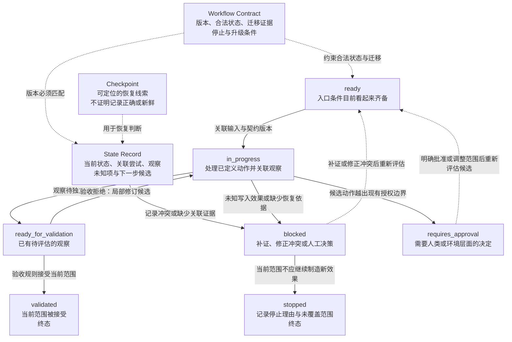

# 10. Workflow 与状态管理

> 工作流（Workflow）不是一串“接下来做什么”的句子，而是一份能让维护者判断“这一次执行在哪里、依据什么迁移、能否安全继续”的可审查协议。

## 本章目标

完成本章后，读者能够：

- 分开工作流定义、一次执行、一次尝试、状态迁移、观察和验证结论，不把计划或状态文字写成完成事实。
- 为一个已获准的任务写出工作流契约（Workflow Contract），说明合法状态、迁移证据、停止条件和升级条件。
- 区分状态记录（State Record）、检查点（Checkpoint）、工作记忆（Working Memory）和长期记忆（Long-term Memory）各自回答的问题。
- 在中断、错误或外部效果不明时，判断应重试（Retry）、恢复（Recovery）、阻塞（`blocked`）、请求批准（`requires_approval`）、停止（Stop，`stopped`）还是升级（Upgrade）。
- 为交接设计最小信息集，并识别“上次说已经做完”为什么不是恢复依据。

## 为什么要学

第 9 章的计划摘要（Plan Brief）和任务卡（Task Card）解决的是“为什么做、做什么、依赖什么、何时不做”。它们并不记录某次执行已经经过哪些步骤，也不回答某次中断前的外部效果是否已经发生。

例如，一位执行者收到“为第 10 章补正文”的任务后，完成了来源阅读、写下了几段草稿，并在保存前失去会话。接手者只看到一句“继续第 10 章”，就无法知道：使用的是哪版大纲、来源是否在当天复核、哪些段落已写入、哪些结论仍待核验，以及是否有一个先前动作已产生但未记录的效果。

这个缺口不是模型能力不足，而是执行信息没有被组织成可判断的状态。工作流的价值在于把可允许的路径、已观察到的事实、未知项和下一步责任拆开记录。它不保证任务会成功，也不会替代工具（Tool）、权限、人工审批或结果验证。

AWS Step Functions 将其工作流描述为状态机（State Machine）中的事件驱动步骤，并将一次运行称为执行实例（execution）；其文档还区分状态输入、输出和错误处理。[REF-031](https://docs.aws.amazon.com/step-functions/latest/dg/concepts-statemachines.html) 这是一个产品语境中的有用例子：步骤列表之外，还需要状态、实例和数据流。它不是本书工作流格式的来源，也不规定其他系统必须采用相同字段。

## 前置知识

- **前置章节：** 第 7 章解释工作记忆与长期记忆的范围；第 9 章解释如何把目标拆成 Plan Brief、任务卡和依赖关系。
- **技术前提：** 能读懂 Markdown 表格、键值对象和简单的状态迁移表；不要求已使用任何工作流引擎。
- **不要求：** 本章不要求部署队列、数据库、分布式锁、事件溯源系统或第三方智能体（Agent）框架。

> 注意：第 10 章定义的是可审查的状态与恢复模型。第 11 章才定义 Tool 请求和结果接口；第 12 章才处理环境、沙箱（Sandbox）与实际权限；第 14 章才讨论人类批准；第 17、18、19、26 和 27 章分别扩展验证、容错、长任务、任务隔离与版本控制。

## 场景引入：计划已经存在，执行信息仍然缺失

假设一个技术书仓库已有一份通过审查的任务卡：“为某章创建 Research Brief”。任务卡列出可用来源、输出路径、停止条件和验收标准。执行者随后完成了前两项来源阅读，记录了一项术语冲突，并准备写入研究摘要。此时网络中断，另一个执行者需要接手。

若只有任务卡，接手者只能知道原本的目标，无法知道这一次执行是否已开始、第二项来源是否真的读完、冲突是否影响后续写作，或摘要写入是否已经发生。若只保留一段聊天总结，接手者还无法区分总结中的判断、观察和猜测。

本章的教学场景因此采用两份不同工件：一份工作流契约描述可允许的路径；一份状态记录描述这一轮具体执行已走到哪里。它们的成功标准不是“自动续写”，而是让下一位执行者能够拒绝不安全的继续动作，并说明拒绝所依据的缺口。

**边界：** 这是本书的教学场景，不表示本仓库由工作流引擎调度，也不表示任何真实文件、命令、Git 操作、模型调用或发布动作已发生。

## 核心概念

### 计划、工作流、执行、尝试与验证结论

下面五个对象解决不同问题。把它们混成一个“状态”字段，是恢复判断最常见的起点错误。

| 对象 | 它记录什么 | 可以据此判断什么 | 不能据此断言什么 |
| --- | --- | --- | --- |
| Plan Brief / 任务卡 | 目标、范围、依赖、验收和停止条件 | 一项任务是否具备开始前的条件 | 任务已经被执行或验收 |
| 工作流契约 | 合法状态、迁移、证据、失败和升级规则 | 哪些下一步在模型中被允许 | 外部动作已经获准或已经成功 |
| 执行（run） | 某份工作流定义的一次具体实例 | 状态记录应关联到哪个工作对象 | 某个动作已被观察或验证 |
| 尝试（attempt） | 某个候选动作的一次发生 | 哪一份观察、错误或请求属于同一尝试 | 该尝试改变了外部状态 |
| 验证结论 | 按验收规则对观察作出的判断 | 结果是否被接受、拒绝或仍未证实 | 其他未检查范围也正确 |

本书建议为执行和尝试留下可关联的标识，但不规定字段名、存储后端或跨系统格式。标识的目的只是防止“收到一段文本”脱离其任务、输入和观察上下文后被解释为成功。

例如，“任务已计划”只能说明计划工件存在；“进入 `in_progress`”只能说明状态记录声称正在推进；“Tool 返回成功文本”只能说明收到某种输出。只有在该输出可关联、已重新观察目标状态，并被相应验收规则接受后，才可以形成“验证接受”的结论。第 17 章会讨论如何设计这条验收规则。

### 工作流契约（Workflow Contract）：先定义允许什么，再决定如何执行

工作流契约是本书提出的工程模型。它不是 JSON Schema、某个产品的状态机定义，也不是权限或批准系统。它的最低目标是让评审者在动作发生之前看见：哪些状态合法、谁可以触发迁移、迁移需要什么证据，以及何时不得自动继续。

一个最小契约可以包含以下字段：

| 字段 | 要回答的问题 | 示例性内容 | 不代表什么 |
| --- | --- | --- | --- |
| 目标与范围 | 这个流程要完成什么、不完成什么？ | “形成可审查的章节草稿” | 已经有草稿或可发布 |
| 版本与入口条件 | 哪版规则、哪些前提适用？ | 大纲已确认、来源可定位 | 版本自动兼容或来源仍然最新 |
| 合法状态与终态 | 能处于哪些状态，哪些状态不再继续？ | `ready`、`blocked`、`validated`、`stopped` | 任意系统都使用这些名称 |
| 迁移契约 | 从哪里到哪里、由什么触发、留下什么证据？ | `ready → in_progress` 需关联任务和输入 | 迁移本身就是外部副作用 |
| 失败与恢复 | 哪些错误可重试、何时补证、何时升级？ | 观察缺失时进入 `blocked` | 固定重试次数或默认退避值 |
| 交接要求 | 下一位执行者必须看到什么？ | 最近迁移、证据、未知项和下一步候选 | 交接自动授予权限 |

状态名称应服务于判断，而非装饰流程图。以下是一组用于教学的状态，不是行业标准：

| 状态 | 含义 | 下一步的最低条件 | 不能由状态名推出的结论 |
| --- | --- | --- | --- |
| `ready` | 入口条件目前看起来齐备 | 关联当前输入与契约版本 | 已经开始执行 |
| `in_progress` | 某次执行正在处理已定义的动作 | 留下尝试和观察关联 | 动作已经成功 |
| `blocked` | 缺少证据、前提或一致状态，不能安全继续 | 补证、修正冲突或人工决策 | 任务失败或没有价值 |
| `requires_approval` | 后续动作越过了现有授权边界 | 获得明确批准或调整范围 | 批准已经存在 |
| `ready_for_validation` | 已有待评估的观察 | 使用独立验收规则 | 结果已正确 |
| `validated` | 当前范围内的验收规则已接受结果 | 结束本次执行或建立新执行 | 所有相关系统都正确 |
| `stopped` | 当前流程明确不再产生新效果 | 记录停止理由与未覆盖范围 | 根因已经解决 |

在 AWS Step Functions 中，状态机、执行、状态输入输出和终态均有产品定义；文档还说明执行会从定义的起始状态开始，并沿定义的迁移推进。[REF-031](https://docs.aws.amazon.com/step-functions/latest/dg/concepts-statemachines.html) 本章借此提醒读者把“定义”和“执行实例”分开，但不会采用 AWS 的字段、终态语义或运行保证。

### 状态记录（State Record）与检查点（Checkpoint）：保存可判断的当前状态

状态记录描述一次具体执行当前可检查的情况。它不是第 7 章的长期经验，也不是把聊天摘要原样复制到文件。为了支持恢复判断，本书建议至少记录：

- 关联的工作流契约版本、执行标识与当前状态；
- 最近一次已确认的迁移、其输入摘要和关联尝试；
- 已观察到的证据、未解决风险和已知未知项；
- 下一个允许动作、停止条件和是否需要批准；
- 记录更新时间以及需要重新观察的范围。

下面的对象只是教学用接口草图，尚未实现、持久化或运行：

```json
{
  "workflowVersion": "chapter-production-v1",
  "runId": "<run-id>",
  "currentState": "blocked",
  "lastConfirmedTransition": "research-completed",
  "evidence": ["<source-review-record>"],
  "unknowns": ["<whether-a-draft-write-was-persisted>"],
  "nextAllowedAction": "observe-draft-artifact",
  "approval": "not-required-for-observation"
}
```

检查点是可供恢复判断的一份状态记录或其持久化快照。它只说明“此处有一份可定位的记录”，不说明记录一定新鲜、完整、已提交或正确。特别是当外部效果是否发生不明时，检查点不能替代重新观察。

LangGraph 的当前 Persistence 文档将检查点保存器（checkpointer）描述为按线程（thread）保存图状态快照的机制，并将其与跨线程的存储（store）区分开来。[REF-033](https://docs.langchain.com/oss/python/langgraph/persistence) 这个框架级例子有助于理解“当前执行状态”和“跨任务资料”为什么需要不同边界；它不为本书的状态记录字段、检查频率、存储方式或安全属性背书。

| 信息类型 | 首要问题 | 跨任务吗 | 能否直接作为恢复许可 |
| --- | --- | --- | --- |
| 工作记忆 | 当前任务暂时可见什么？ | 通常否 | 不能；先确认它是否关联当前执行 |
| 长期记忆 | 哪些经验或知识可复用？ | 可以 | 不能；经验不证明此次效果 |
| 状态记录 | 本次执行现在处于什么可检查状态？ | 只应在明确交接范围内共享 | 仍不能；要检查证据和前提 |
| 检查点 | 是否有可定位的恢复快照？ | 取决于具体系统 | 不能；快照可能过期或缺证 |
| 验证证据 | 目标状态是否满足验收条件？ | 可引用，但要保留范围 | 只能支持已检查的范围 |

### 重入（re-entry）与幂等性（Idempotency）：重复处理不应制造不可解释效果

恢复并不是“从上次文本最后一行接着做”。一些系统会重新处理某个状态或动作；另一些系统则只能根据已有记录推断下一步。无论实现如何，恢复都必须面对一个问题：先前的外部效果到底发生了吗？

本书把重入定义为再次处理某个状态或动作。它不等同于失败修复，也不自动意味着可以安全重复。幂等性则是一个工程目标：对同一已识别效果请求的重复处理，不应产生额外且无法解释的效果。它不是“系统保证只执行一次”的同义词。

为此，本书建议在会产生外部效果的动作前后记录效果身份（effect identity）、意图、观察范围和不确定性。以下审查卡只帮助做判断，并不实现去重键、事务、锁或真实应用程序接口（Application Programming Interface，API）：

| 检查项 | 需要回答的问题 | 缺失时的保守动作 |
| --- | --- | --- |
| 动作分类 | 这是只读分析，还是可能写入、通知或扣费？ | 不把它当作可安全重做 |
| 效果身份 | 如何识别“同一个效果请求”？ | 阻塞或请求人工决定 |
| 上次观察 | 是否有与该尝试关联的目标状态观察？ | 先补证，不重试 |
| 重复风险 | 重复后会出现什么额外结果？ | 转入停止或批准路径 |
| 恢复条件 | 什么证据足以允许重新进入？ | 维持 `blocked` |

LangGraph Functional API 的当前文档说明，恢复会回到检查点边界；已完成任务的结果可从检查点恢复，而已开始但未完成的任务可能在恢复时再次运行。该文档因而建议将副作用置于任务中，并为重执行设计幂等性。[REF-034](https://docs.langchain.com/oss/python/langgraph/functional-api) 这是该框架的限定建议，不证明其他运行时会同样重放，也不提供跨系统的恰好一次（exactly-once）保证。

Temporal 的架构文档同样把可重建的追加式事件历史、确定性的 Workflow 代码以及 Activity 的幂等或非重试边界列为其实现选择。[REF-035](https://github.com/temporalio/temporal/blob/main/docs/architecture/README.md) 本书从中吸取的不是某种强制架构，而是一条设计提醒：历史、重放和副作用边界必须一起评审。

### 重试、恢复、停止与升级：错误路径不能由一句“再试一次”代替

错误发生后，最危险的动作往往不是失败本身，而是在不知道先前效果是否发生的情况下重复请求。本书建议先把观察与某次尝试关联，再决定下一步：

| 观察或问题 | 可以考虑的动作 | 必须保留的证据 | 不能得出的结论 |
| --- | --- | --- | --- |
| 可定位的暂时性失败，且没有外部效果或已确认外部效果未发生 | 在预算内 Retry | 错误类别、尝试、预算和重试理由 | “重试一定会成功” |
| 状态记录与当前工件不一致 | Recovery 或 `blocked` | 冲突位置、较新的证据和待确认范围 | 旧记录一定错误 |
| 写入、通知或收费效果是否发生不明 | `blocked`、Stop 或 Upgrade | 效果身份、最后观察和不确定性 | 可以安全重放 |
| 批准已过期或范围变化 | `requires_approval` | 原批准、变化内容和请求范围 | 旧批准继续有效 |
| 观察已到达但验收拒绝 | 局部 Recovery 或重新计划 | 验收规则、拒绝证据和未覆盖范围 | 所有实现都失败 |

Retry 指再次尝试同一动作的候选；Recovery 指保留状态和证据后重新判断可允许动作；Stop 指主动不制造新效果；Upgrade 指请求人类或环境层面的决定。这些定义均是本书模型，第 18 章会进一步讨论错误分类、预算和容错策略。

AWS Step Functions 的错误处理文档说明：在该产品中，匹配的 retrier 会按配置被扫描，重试用尽后才恢复常规错误处理，并可由 Catch 分支处理错误。[REF-032](https://docs.aws.amazon.com/step-functions/latest/dg/concepts-error-handling.html) 这说明错误分支应当被显式设计；它不支持将“先重试三次再捕获”写成通用顺序，更不支持照搬其参数、错误名或超时值。

## 架构图：状态迁移与保守出口

下图回答：工作流契约、状态记录与检查点怎样共同约束从 `ready` 到 `validated` 的教学状态。当状态冲突、证据缺失、外部效果未知或动作越过授权边界时，为何只能进入 `blocked`、`requires_approval` 或 `stopped`，而不能乐观地继续？

Mermaid 源文件位于 [chapter-10-workflow-state-machine.mmd](../../diagrams/mermaid/chapter-10-workflow-state-machine.mmd)，已于 2026-07-16 使用 Mermaid CLI 11.16.0 导出并查看 [SVG](../../diagrams/exported/chapter-10-workflow-state-machine.svg) 与 [PNG](../../diagrams/exported/chapter-10-workflow-state-machine.png)。

图只表达本书的状态与恢复模型；不会表示真实工作流引擎、状态存储、重放、文件写入、Tool 调用、权限授予、批准结果、外部效果或内容正确性。



> 图示替代描述：Workflow Contract 以虚线约束 `ready` 和 State Record，Checkpoint 也只以虚线作为 State Record 的恢复判断线索。`ready` 经关联输入和契约版本进入 `in_progress`，随后观察待独立验收而进入 `ready_for_validation`，只有验收规则接受当前范围才进入终态 `validated`。状态记录冲突、缺少关联证据、未知写入效果或缺少恢复依据均转入 `blocked`；补证或修正冲突只能回到 `ready` 重新评估，当前范围不应继续产生新效果时进入终态 `stopped`。越出现有授权边界的候选转入 `requires_approval`，明确批准或调整范围后也只回到 `ready` 重新评估。验收拒绝只提供局部修订候选，不证明修订成功。所有节点和箭头均不表示真实执行、授权、批准、外部效果或结果验证。

## 工作流程：一次恢复判断如何进行

以下流程是本书建议的恢复判断顺序，不是任何产品的默认运行算法：

1. **定位契约。** 读取工作流版本、目标、入口条件、合法状态和停止条件；找不到匹配版本时不继续。
2. **定位执行。** 找到当前执行和最近尝试的状态记录；把无关联的聊天摘要、模型输出或长期记忆视为线索，而非事实。
3. **检查一致性。** 对照状态记录、当前工件和可用观察。三者冲突时记录冲突，进入 `blocked`，而不是选择看起来更乐观的一方。
4. **判断效果。** 对下一步是否会产生外部效果做分类。若先前效果未知，先观察、停止或请求批准，不能直接重放。
5. **选择迁移。** 只有入口、证据、预算和授权边界都满足时，才允许进入 Retry、Recovery 或下一状态；否则保留阻塞理由。
6. **重新观察。** 获得输出后，将其关联到尝试，并通过独立验收规则判断是否可进入 `ready_for_validation` 或 `validated`。
7. **写入交接信息。** 无论完成、阻塞还是停止，都写下最近迁移、证据、未知项、未验证范围和下一步候选。

这个流程刻意把“收到结果”和“接受结果”分成两步。它避免了 Tool、模型或人类描述的成功文本直接跳过验证，也避免把一个无法解释的空白记录误写成失败。

## 最小示例：状态迁移评估

本章已实现纯内存函数 [`assessWorkflowTransition`](../../examples/agent/workflow-transition-assessment.mjs)。它只接收教学对象：Workflow Contract、State Record、注入的观察与批准快照，并返回允许迁移、需要补证、阻塞或需要批准之一。接口、判断顺序与红绿记录见[示例实现记录](10-workflow-and-state-management.example-plan.md)。

该函数不会：

- 持久化状态、调度任务、重放检查点或模拟工作流引擎；
- 调用模型、网络、文件、Git、CI、Tool、数据库或权限系统；
- 声称重试成功、真实效果已提交、审批有效或审计完整。

其 Node 内置测试覆盖合法迁移、终态重入、缺少检查点、未知写入效果、过期批准、冲突交接、验证拒绝后的局部恢复和验证证据不足。测试通过只能证明函数对注入对象的判断，不证明真实工作流运行时、重放、持久化、审批或外部效果。

```bash
npm run test:workflow-transition-assessment
npm run example:workflow-transition-assessment
```

## 逐步增强：从可读状态表到可恢复执行

1. **先写迁移表。** 为每个状态写明输入、输出、证据和停止分支，先暴露缺口。升级触发条件：评审者无法解释下一步是否合法。
2. **再写状态记录。** 为每次执行关联契约版本、尝试、观察和未知项。升级触发条件：任务会中断或需要交接。
3. **再设计效果身份。** 对可能产生副作用的动作说明如何发现重复或不确定效果。升级触发条件：存在文件写入、通知、账务、共享环境或不可逆动作。
4. **最后接入运行时能力。** 只有 Tool 协议、环境权限、人工批准、验证、重试和存储边界被单独设计后，才考虑真实队列、状态存储、锁、事务或工作流引擎。升级触发条件：需要跨进程恢复、并发协调或可审计的外部执行。

## 完整工程案例：章节生产的可恢复交接

下面的案例是本书的教学设计。它把一章内容生产看作一份工作流契约，而不是把进度表误称为工作流引擎。

**背景：** 团队要为虚构章节完成 Research、Outline、Draft、Review 和 Validate。执行者可轮换，来源会变化，草稿中的示例可能需要后续独立实现。

**约束：** Research 与 Outline 必须有可追溯来源；Draft 不能把计划中的图示或示例写成已运行；任何真实文件写入、Git 操作、网络请求或发布都需要各自的环境与批准边界。本案例不执行这些操作。

**契约与状态记录：**

| 阶段 | 入口与输入 | 可观察输出 | 阻塞或升级条件 | 下一步 |
| --- | --- | --- | --- | --- |
| Research | 章节范围、候选来源 | 来源范围、外推禁区、未知项 | 来源无法定位或事实与范围冲突 | Outline |
| Outline | Research Brief、模板 | 小节依赖、计划图示和示例边界 | 关键章节责任不清 | Draft |
| Draft | 大纲、写作日复核来源 | 原创正文、未实施工件状态 | 事实缺来源或示例被误写成运行结果 | Technical Review |
| Review | 草稿、来源和相邻章节边界 | 审查意见与修订记录 | 需要真实 Tool、权限或运行证据 | 交给相应章节或人工 |
| Validate | 已修订工件和本地校验规则 | 校验结果与未覆盖范围 | 校验失败、链接失效或状态不一致 | 局部恢复或停止 |

假设交接包说“Draft 已完成”，而当前状态记录只显示“Outline 已完成，Draft 未开始”。正确动作不是选择更积极的一条，也不是直接进入 Review。接手者应保存冲突、定位草稿工件和最近证据；若找不到可关联的草稿，应把 Draft 视为尚未证实，并以当前可追溯状态为基线重新领取任务。

**结果与证据：** 本案例只给出可审查的字段和判断路径。它没有运行 Agent、保存检查点、写入文件、调用命令或发布书稿，因此没有真实运行结果可以报告。

## 实现说明：把判断与副作用分开

即使未来接入某个运行时，状态模型也应保持几个可审查的分离点：

| 决策 | 本书建议 | 原因 | 留给后续章节的部分 |
| --- | --- | --- | --- |
| 迁移依据 | 迁移要关联输入、观察和证据 | 让接手者能追溯状态变化 | 验收规则由第 17 章细化 |
| 重入处理 | 对效果未知的写入先阻塞或升级 | 避免把不确定性变成重复效果 | Tool、数据库、文件和 API 协议由第 11、12 章处理 |
| 检查点 | 把快照视为恢复线索，不视为正确性证明 | 保存状态不等于目标已满足 | 存储、保留期、版本兼容和安全策略另行设计 |
| 人工介入 | 超出授权、批准失效或状态冲突时保留升级点 | 责任边界不能由模型猜测补齐 | 第 14 章定义批准互动 |
| 交接 | 交付状态、证据、未知项和下一步候选 | 减少从聊天摘要猜测执行历史 | 第 19、26、27 章处理压缩、隔离和版本控制 |

## 测试与验证

本章的 Example Plan、纯函数实现、独立测试、Diagram Review、Fact Check、Language Editing 与 Final Review 已完成。下表只报告已实际运行的示例、图示与事实核验；它不把后续章节的 Tool、运行时或外部效果写成本章执行结果。

| 层级 | 验证对象 | 方法 | 成功标准 | 当前状态 |
| --- | --- | --- | --- | --- |
| 文稿 | 原创性、术语、来源边界和链接 | Technical Review、Fact Check、Language Editing、Final Review 与项目校验 | 事实和本书模型可区分 | 2026-07-16 已完成 Final Review；跨工件记录见最终审查 |
| 纯函数 | 迁移判断契约 | Node 内置测试与演示入口 | 只验证注入对象上的允许/阻塞判断 | 已实现并实际运行 8 项测试与演示 |
| 图示 | 状态与恢复关系 | Mermaid 源、SVG/PNG 导出、图源一致性比较和人工查看 | 图文术语、箭头和边界一致 | 2026-07-16 已导出 SVG/PNG 并完成视觉检查；只表达本书模型 |
| 运行时 | 真实恢复、权限、外部效果和审计 | 具体环境中的集成或端到端验证 | 重新观察可证明目标状态 | 本章不实现 |

> 风险：通过 Markdown 校验只能说明文稿格式和链接在该次检查中满足规则；它不能证明状态机、检查点、重放、幂等性、Tool、权限或外部系统已经实现。

## 工程实践

- **让迁移留下可消费证据。** “已处理”不是交付物；应记录哪个输入触发、出现了什么观察、哪些范围仍未知。
- **把未知效果作为一等状态。** 对写入是否已发生没有证据时，`unknown` 或 `blocked` 比乐观重试更诚实，也更容易审查。
- **让停止成为合法结果。** 停止不是放弃；它表示当前授权、证据或风险边界不允许继续制造新效果。
- **把交接包视为接口。** 接手者能否只靠状态、证据和未知项做出保守判断，是交接质量的可检查标准。

## 最佳实践

- 为每个终态写明为何不能继续，以及若要重新开始应新建哪类执行或尝试记录。
- 让状态迁移与外部效果的请求分开记录；“允许请求”不等于“请求已发生”，更不等于“结果被接受”。
- 为每项可能重入的副作用定义效果身份、观察方式和无法确认时的升级对象。
- 交接时优先给原始证据的位置和适用范围，摘要只作为导航，不能覆盖更新的状态记录。

## 常见错误

| 错误 | 表现 | 根因 | 修复方向 |
| --- | --- | --- | --- |
| 把任务卡当状态机 | 任务卡存在就被写成“正在执行” | 将计划与执行实例混为一谈 | 增加执行和尝试记录，并定义迁移证据 |
| 用状态名代替证据 | `done` 或 `success` 成为唯一记录 | 状态字段承担了事实、判断和审计三种职责 | 关联观察与独立验证结论 |
| 把检查点当成功证明 | 找到快照后直接继续写入或重试 | 忽略快照的新鲜度、完整性和效果不确定性 | 先比对当前工件和目标状态 |
| 固定次数重试未知写入 | 重复发送通知、写入或收费 | 没有区分暂时性失败与效果不明 | 阻塞、补证或升级，而非盲目 Retry |
| 交接只写聊天摘要 | 新执行者依据过期措辞覆盖当前状态 | 摘要没有关联版本、证据和未决项 | 使用包含状态、证据、未知项与下一步的交接包 |
| 用一次本地检查宣称运行时可靠 | Markdown 或单元测试通过后宣称可恢复 | 验证范围被夸大 | 记录命令实际覆盖的范围和未覆盖的外部行为 |

## 安全与边界

- **权限边界：** 工作流契约可以声明“需要批准”，但不授予文件、网络、凭证、Git、数据库或生产环境权限。
- **数据边界：** 状态记录应保留恢复所需的最小信息；敏感输入、密钥、个人数据和原始凭证不应因“便于交接”而进入普通摘要。
- **人工审批点：** 不可逆动作、共享环境写入、费用或通知可能发生、批准已过期、状态冲突和效果未知时，都应保留人类或环境层面的决策点。
- **不适用范围：** 本章不提供分布式事务、锁、租约、合规审计、恰好一次语义、真实恢复引擎或跨进程一致性承诺。

## 章节总结

计划告诉执行者该做什么；工作流契约告诉执行者哪些路径被允许；状态记录告诉接手者这一次执行已经观察到什么、仍不知道什么。三者缺一不可，但任何一个都不能替代验证。

恢复的关键不是恢复一段文本，而是恢复可审查的边界：匹配的契约版本、关联的执行与尝试、证据、未知效果、批准状态和下一步候选。遇到这些信息缺失或冲突时，阻塞、停止或升级通常比自动重试更可靠。

下一章将把一次 Tool 请求、返回、错误和验证要求设计成可检查的接口。只有 Tool 协议、环境权限和验证边界都明确后，工作流中的“下一步动作”才可以成为受控的实际执行。

## 练习

1. 为“读取一份配置并生成诊断报告”设计 Workflow Contract。标出哪些状态只涉及只读观察，哪些状态一旦加入写入就必须请求批准。
2. 有一份状态记录显示 `in_progress`，但没有尝试标识和观察证据。写出接手者应提出的三个问题，并说明为什么不能直接重试。
3. 比较“邮件通知是否已发送未知”和“只读文档索引已过期”两种恢复情形。分别给出保守的下一步和需要保留的证据。
4. 把一个章节生产任务写成交接包，至少包括契约版本、当前状态、最近证据、未知项、下一步候选和停止条件。然后故意加入一条与当前状态冲突的旧摘要，说明你的恢复规则如何处理它。

## 延伸阅读

- [REF-031：AWS Step Functions 的状态机、执行与数据流概念](https://docs.aws.amazon.com/step-functions/latest/dg/concepts-statemachines.html)，仅用于理解该产品的术语范围；访问于 2026-07-16。
- [REF-032：AWS Step Functions 的错误处理](https://docs.aws.amazon.com/step-functions/latest/dg/concepts-error-handling.html)，仅用于理解该产品的 Retry 与 Catch 行为；访问于 2026-07-16。
- [REF-033：LangGraph Persistence](https://docs.langchain.com/oss/python/langgraph/persistence)，用于区分 framework checkpoint 与跨 thread store；访问于 2026-07-16。
- [REF-034：LangGraph Functional API](https://docs.langchain.com/oss/python/langgraph/functional-api)，用于理解该框架恢复与副作用幂等性的限定建议；访问于 2026-07-16。
- [REF-035：Temporal Architecture](https://github.com/temporalio/temporal/blob/main/docs/architecture/README.md)，用于理解其事件历史和 Workflow/Activity 分界；访问于 2026-07-16。

## 参考资料

- [REF-031](https://docs.aws.amazon.com/step-functions/latest/dg/concepts-statemachines.html)：支持 AWS Step Functions 对状态机、工作流、执行、状态输入输出和迁移的产品特有说明。
- [REF-032](https://docs.aws.amazon.com/step-functions/latest/dg/concepts-error-handling.html)：支持 AWS Step Functions 对 Retry、Catch 和错误处理的产品特有说明。
- [REF-033](https://docs.langchain.com/oss/python/langgraph/persistence)：支持 LangGraph checkpointer、thread-scoped 状态与 store 的框架特有说明。
- [REF-034](https://docs.langchain.com/oss/python/langgraph/functional-api)：支持 LangGraph 恢复、重执行与副作用幂等性的框架特有说明。
- [REF-035](https://github.com/temporalio/temporal/blob/main/docs/architecture/README.md)：支持 Temporal 的追加式历史、确定性 Workflow 和 Activity 边界的实现特有说明。

## 章节完成检查表

- [x] Front Matter、学习目标、前置知识、章节依赖和相关章节已写明。
- [x] 正文使用原创场景、表格、案例和工程模型；来源事实与本书扩展已分开。
- [x] 所有产品或框架行为均以 REF-031 至 REF-035 的限定语境说明。
- [x] 已明确 Mermaid 图示只表达本书状态模型，不表示真实运行时、外部效果、权限或批准；纯内存示例已单独限定其验证范围。
- [x] Mermaid 图源、SVG/PNG 导出、图源一致性比较和 Diagram Review 已完成；实际渲染与视觉检查记录位于 `.memory/reviews/2026-07-16-chapter-10-diagram-review.md`。
- [x] 纯内存示例计划、实现与独立测试已完成；模块缺失红灯、8 项 Node 内置测试与演示的实际结果已记录在示例整合审查中。
- [x] Technical Review 已完成；REF-031 至 REF-035 的限定范围、术语、相邻章节边界与未实施工件状态已复核。
- [x] Fact Check 已完成；REF-031 至 REF-035 已在 2026-07-16 重新读取，允许用途、外推禁区和纯内存示例边界见 [事实核验清单](10-workflow-and-state-management.fact-check.md)。
- [x] Language Editing 已完成：统一术语首现、来源段落主语与段落节奏；未改变来源范围、示例接口或 Mermaid 语义。记录位于 `.memory/reviews/2026-07-16-chapter-10-language-edit.md`。
- [x] Final Review 已完成：正文、来源、示例、图示、审查记录和状态工件已交叉核对；记录位于 `.memory/reviews/2026-07-16-chapter-10-final-review.md`。
- [x] Final Review 的状态同步后实际运行 `npm run validate` 与 `git diff --check`；结果验证 Markdown、链接、十套纯内存示例、章节状态与新增图示工件的格式/链接，不代表真实工作流、状态存储、重放、Tool、权限、批准、审计或外部系统行为。
