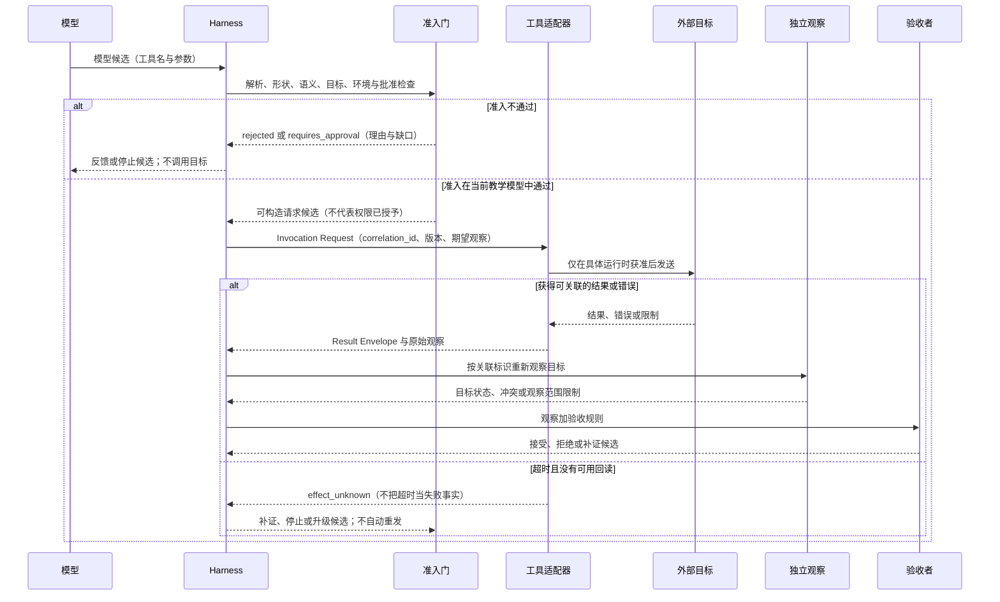

# 11. Tool Use 与工具协议

> 工具调用（Tool Invocation）不是“模型输出了一段 JSON”，而是一段需要被解析、允许、关联、观察和验证的受控交互。

## 本章目标

完成本章后，读者能够：

- 区分模型候选、调用请求、应用执行、工具结果、外部效果观察和任务验收，而不把其中任意一步写成全部完成。
- 为一个工具写出可审查的工具描述（Tool Descriptor）和调用请求（Invocation Request），并说明 Schema、权限、批准和验证各自的职责。
- 用调用关联标识（Call Correlation ID）把一次请求、路由决定、结果、错误和后续观察连接起来。
- 区分执行前拒绝、可观察失败、取消、超时和效果不确定性（Effect Uncertainty），避免把“没有收到结果”误写成“没有产生效果”。
- 为可能读写外部系统的工具保留环境、人工批准、观察、验收和恢复的交接点。

## 为什么要学

“模型可以调用工具”很容易被压缩成一句口号，工程上的问题却刚好藏在被省略的部分。模型可能产生了一个看似合法的名称和参数；应用可能尚未解析它；策略可能拒绝它；目标可能不存在；调用可能超时；外部系统可能已经执行但回包丢失；即使已能回读，也仍要由任务的验收规则判断结果是否合格。

例如，一个写作 Agent 提议把某篇书稿的 `status` 改成 `complete`。若系统只记录“模型选择了 `document_update_metadata`”，读者无法知道它是否有写入权限、是否经过批准、是否真的修改了正确对象，也无法判断这次修改是否应该被发布。若系统只记录“工具返回 success”，它仍无法证明状态已经回读、图示和示例阶段已经完成，或整章可发布。

本章的目标不是提供一种“万能 Tool API”。不同协议和产品对工具发现、调用、字段和错误的定义并不相同。我们讨论的是更基础的工程问题：怎样让一次工具交互留下足够的边界和证据，使后续的权限、批准、观察、验收和恢复可以正确接手。

OpenAI 的 Function Calling 指南把工具调用描述为应用与模型之间的多步过程：应用提供可调用工具，模型返回调用，应用侧执行代码并把结果回传给模型。[REF-037](https://developers.openai.com/api/docs/guides/function-calling) 这只说明该产品文档中的交互分工；本章由此延伸出的调用记录、效果分类和交接规则是本书的工程模型，不是该产品的字段或安全保证。

## 前置知识

- **前置章节：** 第 8 章解释 Skill 如何提供可复用说明；第 10 章解释工作流契约（Workflow Contract）、状态记录（State Record）和尝试（attempt）如何描述一次执行。Skill 不是单次 Tool 调用协议，状态记录也不能替代具体请求与结果的关联。
- **技术前提：** 能阅读 JSON 对象、简单 Schema、表格和顺序流程；不要求使用过任何 SDK 或 MCP 服务器。
- **不要求：** 本章不要求配置凭证、部署服务、编写浏览器自动化、调用模型、运行 MCP、读写文件、执行 Git 命令或接入数据库。

> 注意：本章只设计单次工具交互的接口边界。第 12 章处理环境、Sandbox、凭证与实际权限；第 14 章处理人工批准；第 15 章处理观察质量；第 17 章处理验收；第 18 章处理重试、恢复和补偿；第 24、25 章分别把这些原则落到 MCP 与浏览器自动化等具体集成中。

## 场景引入：一条“更新完成状态”的请求缺了什么

设想一个虚构的书稿维护系统。模型根据任务描述产生以下候选：

```json
{
  "name": "document_update_metadata",
  "arguments": {
    "document_id": "chapter-11",
    "status": "complete"
  }
}
```

这段对象最多表达“模型建议应用考虑某项动作”。它没有包含实际权限、批准、目标当前版本、写入环境、调用关联、回读观察或验收规则。它也没有证明模型输出已被应用接收，更没有证明系统已经修改任何书稿。

为了让这个场景可审查，本书把它拆成六个不同的时刻：

| 时刻 | 谁产生它 | 最多能说明什么 | 仍不能说明什么 |
| --- | --- | --- | --- |
| 模型候选 | 模型 | 某个工具与参数被提议 | 应用会执行、权限存在或效果发生 |
| 已解析参数 | 应用解析器 | 数据可以被按选定格式读取 | 参数适合目标、符合业务规则或获准执行 |
| 调用请求 | Harness | 某项动作带着关联和准入信息进入判定 | 工具已经被发送或外部状态已改变 |
| 调用记录 | 路由器或适配器 | 尝试与其时间、环境和观察可以追溯 | 结果满足任务 |
| 结果与观察 | 工具或独立观察者 | 某次交互返回了内容、错误或目标状态 | 结果已被任务验收 |
| 验收结论 | 验证器或负责者 | 当前范围满足明确的成功条件 | 所有未观察范围也正确 |

这种拆分不是要求每个系统都创建六张表，而是一条审查规则。若要声称“已经完成”，就必须指出：哪一层作出了判断、依据了什么证据，以及还有什么尚未被证明。

**场景边界：** 这是一组教学对象。它不会读取本仓库、不创建真实文件、不调用模型、MCP、SDK、浏览器、网络、Git、数据库、凭证或权限系统。

## 核心概念

### 工具协议（Tool Protocol）与工具契约（Tool Contract）

工具协议是 Agent 与外部能力交换参数、结果、错误及相关元数据的接口约定。协议可能规定发现方式、消息形状、编码、错误层次或会话行为；它的细节必须跟随具体协议阅读，不能凭某个 SDK 示例外推。

模型上下文协议（Model Context Protocol，MCP）的当前 Tools 草案提供了一个协议实例：客户端通过 `tools/list` 发现工具，通过 `tools/call` 按名称与参数调用；工具定义包含名称、描述、输入 Schema，并可以包含输出 Schema。[REF-036](https://modelcontextprotocol.io/specification/draft/server/tools) 该页面是草案而非跨系统的默认规范。它还明确指出协议本身不强制某一种用户交互模型，因此不能从“可调用”推出“已批准”。

本书在协议之外提出**工具契约（Tool Contract）**。它是审查模型，不是 MCP、OpenAI、Anthropic 或 JSON Schema 的对象定义。它让团队在实现前把“这个工具如何被解释、如何被请求、如何被追溯、怎样停止”写清楚。一个最小的 Tool Contract 可以包含四类工件：

| 工件 | 本书建议包含的信息 | 解决的问题 | 不替代什么 |
| --- | --- | --- | --- |
| Tool Descriptor | 名称、版本、用途、非用途、输入/输出形状、效果类别、已知限制 | 模型和评审者看到的能力面是否清楚 | 实际授权或执行环境 |
| Invocation Request | 关联标识、工具/版本、已解析参数、来源摘要、风险、环境和批准引用 | 该候选是否已变成可判定的请求 | 调用已经发生 |
| Invocation Record | 路由决定、开始/结束、适配器、原始观察、未知项 | 请求、结果和观察是否可追溯 | 完整状态机或审计系统 |
| Result Envelope | 关联标识、分类、结果或错误、效果状态、下一步候选、未验证范围 | 后续模块怎样解释此次交互 | 业务验收结论 |

这四类工件可以存为对象、日志事件、数据库记录或临时内存；本章不指定存储方式。关键是它们不能被折叠成一句“工具成功”。

### Tool Descriptor：描述能力，不授予能力

Tool Descriptor 的作用是让调用方知道该工具的意图边界。它应帮助模型、评审者和实现者回答：它做什么、何时适用、何时不应使用、接受哪些输入、返回哪些信息、有什么已知限制，以及可能属于哪类效果。

Anthropic 的客户端工具定义把 `name`、描述和 `input_schema` 列为工具定义的组成部分，并允许提供必须符合 `input_schema` 的输入样例。[REF-038](https://platform.claude.com/docs/en/agents-and-tools/tool-use/define-tools) OpenAI 的指南也建议把函数用途、参数格式和输出含义描述清楚。[REF-037](https://developers.openai.com/api/docs/guides/function-calling) 这些建议只适用于各自产品文档；它们支持“描述应帮助选择与构造输入”，不支持“描述等于权限”。

下面是一份本书教学用的 Descriptor 草图，不是任何 SDK 或 MCP 的配置：

| 字段 | 教学示例 | 它约束什么 | 它不能证明什么 |
| --- | --- | --- | --- |
| `tool_name` / `version` | `document_update_metadata` / `v1` | 调用者选择哪项已知能力 | 实现者已部署该版本 |
| `purpose` | 修改已定位文档的一项元数据 | 适用任务 | 目标文档可写 |
| `non_goals` | 不改变正文、图示、示例或发布状态 | 防止能力被误解 | 调用不会产生副作用 |
| `input_shape` | 文档标识、字段名、新值、预期版本 | 数据形状 | 值在业务上正确 |
| `effect_class` | 可逆写入 | 风险需要怎样路由 | 环境允许写入 |
| `limitations` | 不能跨项目、不能绕过版本冲突 | 已知边界 | 所有限制都已发现 |

对比 `update` 与 `document_update_metadata`，后者更容易审查，因为它暴露了目标类型和范围；但更明确的名称仍不能授予写入权限。MCP 当前草案中的工具注解也只应被视为提示，客户端必须把来自不受信任服务器的注解当作不可信信息。[REF-036](https://modelcontextprotocol.io/specification/draft/server/tools) 因此，“标记为只读”是一个需要独立核验的主张，不是允许访问的凭证。

### Schema：验证形状，不验证世界

JSON Schema 是描述 JSON 数据结构与验证词汇的一套规范。其官方规范将 Core 与 Validation 分为不同部分，并提供用于纯验证的 Core/Validation dialect。[REF-039](https://json-schema.org/specification) 这使它适合回答“对象是否有预期字段、类型、枚举或结构”，却不适合单独回答“资源是否存在、调用者是否有权、现在是否适合执行”。

以下请求即使通过一个“字符串字段”的 Schema，仍可能不应执行：

```json
{
  "document_id": "chapter-11",
  "status": "complete"
}
```

可能缺失的判断包括：

- `chapter-11` 是否属于当前项目，且是否仍是调用者预期的版本；
- `complete` 是否允许在图示、示例、审查和校验尚未完成时被写入；
- 当前环境是否允许写入，所用凭证是否只具有最小权限；
- 该变更是否需要人类批准，已有批准是否覆盖目标、字段和版本；
- 请求是否重复，或某次先前写入的效果仍然未知。

因此，本书把准入判断拆成六道门：解析、形状校验、语义校验、目标确认、环境/权限检查和批准检查。它们是教学顺序，并不是任何协议的强制处理管线。

| 门 | 问题 | 通过后的结论 | 失败后的保守动作 |
| --- | --- | --- | --- |
| 解析 | 参数是否能被读取？ | 取得候选数据 | 拒绝并保留解析错误 |
| 形状 | 是否符合选定 Schema？ | 数据形状暂时可用 | 拒绝并说明不合格字段 |
| 语义 | 值组合是否符合本任务规则？ | 可继续核对目标 | 拒绝或要求更明确输入 |
| 目标 | 标识、版本与作用范围是否匹配？ | 知道准备操作哪个对象 | 停止并重新观察目标 |
| 环境/权限 | 当前受控环境是否允许此动作？ | 可在第 12 章的边界内评估 | 移交环境或权限机制 |
| 批准 | 风险是否获得覆盖范围明确的同意？ | 可进入执行候选 | 请求第 14 章定义的批准 |

OpenAI 的 Function Calling 文档展示了调用结果与调用标识的关联，并明确把应用侧代码执行放在模型输出之后。[REF-037](https://developers.openai.com/api/docs/guides/function-calling) **本书要求**应用在执行前自行校验模型生成的参数。即便某产品提供严格 Schema 模式，它也不能消除本表后四道门。

### Invocation Request：让候选成为可判定请求

模型候选经过解析后，尚不能直接送往工具。它缺少“依据哪版工具、针对什么范围、由谁允许、需要观察什么”的上下文。本书建议把这些信息附着到 Invocation Request，而不强迫模型猜测或伪造它们。

下列对象是**未执行的教学草图**。字段名称可在真实系统中不同；它不对应任一厂商 API，也不意味着请求会被发送：

```json
{
  "correlation_id": "<locally-generated-request-reference>",
  "tool": {
    "name": "document_update_metadata",
    "version": "v1"
  },
  "arguments": {
    "document_id": "chapter-11",
    "field": "status",
    "value": "complete",
    "expected_version": "<observed-version>"
  },
  "input_summary": "<which-task-and-which-observation-produced-this-request>",
  "effect_class": "reversible_write",
  "environment_reference": "<environment-check-reference>",
  "approval_reference": "<approval-or-not-required-reference>",
  "expected_observation": "<a-later-read-back-of-the-target-field>"
}
```

`correlation_id` 是本书模型中的调用关联标识；它不是要求使用 UUID，也不是断言任何产品都提供同名字段。它的目的在于让后续的路由决定、适配器观察、工具结果和回读结果能回到同一项请求。没有关联时，“已经更新”只能是一段无法定位的文本。

Invocation Request 的另一个作用是把**模型可见信息**与**运行环境可见信息**分开。模型可以提出名字和参数；Harness 才能把当前任务、目标观察、受控环境、策略快照和批准引用组合成可审查请求。这样做既减少模型伪造权限状态的机会，也方便评审者指出究竟缺的是参数、目标、权限还是批准。

### Invocation Record 与 Result Envelope：让结果能被追溯

一次请求获得结果后，最容易犯的错误是把原始文本直接塞回模型上下文。例如，两个 `document_update_metadata` 请求同时存在，后来收到“修改成功”，没有关联标识的系统无法知道它属于哪一个对象、使用了什么参数、发生在何时、有没有同名但不同版本的工具，或是否需要回读。

OpenAI 的当前指南在其 Response 示例中用 `call_id` 把函数调用与后续结果关联，并展示一轮中可以出现多个函数调用。[REF-037](https://developers.openai.com/api/docs/guides/function-calling) MCP 当前草案也区分正常工具结果、工具执行错误和协议级错误，并允许工具结果携带结构化内容。[REF-036](https://modelcontextprotocol.io/specification/draft/server/tools) 这些都是各自语境中的设计，不规定本书应该沿用 `call_id`、`isError`、JSON-RPC 或任何字段名。

本书建议分别保留 Invocation Record 和 Result Envelope：

| 对象 | 需要关联什么 | 主要读者 | 不能替代什么 |
| --- | --- | --- | --- |
| Invocation Record | 请求、路由、开始/结束、适配器和原始观察 | 排障者、接手者、审查者 | 第 10 章的完整状态记录或审计后端 |
| Result Envelope | 关联标识、分类、规范化结果/错误、效果状态、限制与下一步 | 工作流、模型、验证器 | 任务验收或真实外部状态 |

一个 Result Envelope 可以把 `succeeded` 表示为“这次可关联交互收到了成功类返回”，但不把它解释成“任务完成”。同样，若工具返回的数据满足输出 Schema，也只说明该数据的形状可被按规则检查；它仍可能过时、范围不足、来自错误目标，或与任务成功条件无关。第 17 章会定义如何用独立观察和验收规则把“收到结果”变成“当前范围接受”。

### 错误、取消、超时与 Effect Uncertainty

错误不是一类东西。若忽略错误在哪一层出现，系统常会用错误的方式重试，或把未知效果写成已失败。MCP 当前草案区分协议错误和工具执行错误：未知工具、请求格式不合格等可作为协议层问题出现；API 失败、输入校验或业务规则问题可作为工具结果中的执行错误出现。[REF-036](https://modelcontextprotocol.io/specification/draft/server/tools) 这是该草案的错误结构，而不是所有 Tool 运行时的固定分类。

为了讨论恢复，本书使用以下结果分类：

| 分类 | 含义 | 应保留的最低证据 | 不可推出的结论 |
| --- | --- | --- | --- |
| `rejected` | 在执行前被解析、策略、环境或批准门拒绝 | 拒绝位置、规则版本、关联请求 | 工具已经收到请求 |
| `failed` | 获得了可关联的失败观察 | 错误层次、原始观察、发生时间 | 外部效果绝未发生 |
| `cancelled` | 交互被明确取消 | 取消者、时点、已知已发送范围 | 取消一定撤回先前效果 |
| `timed_out` | 在限定等待内没有获得足够响应 | 等待边界、最后观察、请求关联 | 目标未改变或一定失败 |
| `effect_unknown` | 现有证据无法判断外部效果是否发生 | 最后可关联观察、目标、未知范围 | 可以安全重试 |
| `succeeded` | 收到成功类工具返回 | 关联的结果、结果限制 | 业务目标已满足 |

`effect_unknown` 比 `failed` 更保守。假如写请求已经离开了适配器，网络随后中断，系统没有回包也没有回读记录，那么“失败”只是在描述通信缺口，不能描述目标状态。此时重发同一请求可能造成重复修改、重复通知、重复扣费或不可解释的共享环境变更。正确的下一步通常是重新观察、阻塞、停止或请求人类决定；第 18 章再讨论何种证据可以支持恢复或补偿。

> 风险：超时不是“什么也没发生”的同义词。工具返回成功也不是“业务已完成”的同义词。二者之间的未知范围必须显式保留。

### 副作用与证据边界：提示不是权限

不同动作需要不同证据。纯计算通常只处理已给定数据；受限读取可能仍会暴露敏感范围；可逆写入需要版本与回读；不可逆写入需要更严格的批准、记录和停止条件；开放世界操作还会面对网络、第三方状态和不可完全观察的后果。

本书使用以下效果类别来帮助路由风险，它们不是协议字段或自动执行策略：

| 效果类别 | 调用前应问什么 | 调用后至少要什么观察 | 仍应移交给谁 |
| --- | --- | --- | --- |
| 纯计算 | 输入是否足够且可处理？ | 输出是否符合预期结构与任务范围？ | 第 17 章的结果验收 |
| 受限读取 | 数据范围、凭证和目的是否合适？ | 返回内容的来源、时间与覆盖范围 | 第 12、15、17 章 |
| 可逆写入 | 目标版本、权限、批准与回滚边界是否明确？ | 与请求关联的回读或版本观察 | 第 12、14、15、17、18 章 |
| 不可逆写入 | 为什么必须做、谁承担责任、能否停止？ | 目标观察、审计线索和未覆盖范围 | 第 12、14、17、18 章 |
| 开放世界操作 | 外部系统、成本、第三方影响和未知后果是否可接受？ | 受限的可观察证据，不确定性保留 | 环境、人工批准和恢复机制 |

MCP 2025-11-25 Schema Reference 中的 `readOnlyHint`、`destructiveHint`、`idempotentHint` 和 `openWorldHint` 是帮助客户端理解工具行为的注解，并要求客户端不要根据不受信任服务器提供的 Tool Annotations 作出工具使用决定。[REF-036](https://modelcontextprotocol.io/specification/2025-11-25/schema) 因而，一个声称“只读”的远程工具仍可能因数据范围、凭证、服务端可信度或网络边界而不能自动执行。

效果类别的价值不是给每项工具贴一个安全标签，而是把问题送到正确模块：环境和最小权限交给第 12 章，责任与批准交给第 14 章，观察质量交给第 15 章，任务成功交给第 17 章，不确定效果后的恢复交给第 18 章。

## 架构图：调用序列的准入与证据边界

这张图回答“模型候选怎样在准入门、工具适配器、目标、结果信封、观察与验收之间移动，以及哪些出口不能被跳过”。它是本书的教学模型，不表示真实 Tool、MCP、SDK、权限、批准、外部目标、回读或验收已经发生。



图源位于 [`chapter-11-tool-invocation-sequence.mmd`](../../diagrams/mermaid/chapter-11-tool-invocation-sequence.mmd)，已导出 [SVG](../../diagrams/exported/chapter-11-tool-invocation-sequence.svg) 与 [PNG](../../diagrams/exported/chapter-11-tool-invocation-sequence.png)。

**替代描述：** 顺序图从模型到 Harness 开始。Harness 将候选交给准入门；若拒绝或缺批准，请求回到反馈或停止路径，且不调用目标。若在教学模型中可构造请求，Harness 以关联标识把请求交给适配器。适配器只在具体运行时获准后才可发送。收到结果后仍需独立观察和验收；超时且没有回读则标记为 `effect_unknown`，转向补证、停止或升级，而非自动重发。

**读图结论：** 每条实线都只表示本书模型中的信息或候选流转。图中唯一指向外部目标的箭头带有“仅在具体运行时获准后发送”的条件；工具结果、目标观察和验收结论分别存在，任何一项都不能替代另两项。

## 工作流程：从候选到可验证结果的最小路径

以下步骤是本书建议的审查顺序，不是 MCP、OpenAI、Anthropic、JSON Schema 或任何 SDK 的默认算法：

1. **识别候选。** 保存模型提议的工具名、参数与产生它的任务上下文；候选尚不能执行。
2. **解析并检查形状。** 按明确版本解析参数并做 Schema 或等价的形状检查；失败时记录 `rejected`，不把错误参数送往目标。
3. **检查语义与目标。** 确认目标、版本、作用范围和任务规则仍匹配；目标不明时先观察，而非猜测。
4. **检查环境、权限和批准。** 按第 12、14 章的机制决定是否可以进入执行候选；本章的字段只能引用这些判断，不能创造它们。
5. **构造并关联请求。** 为获准请求生成或绑定关联标识，记录工具版本、参数、风险、期望观察与适配器路由。
6. **执行并保存观察。** 若具体系统实际执行，保留与请求关联的结果、错误、时间和限制；工具返回不是验收结论。
7. **重新观察并验收。** 用独立观察确认目标状态，再由第 17 章的规则判断当前范围是否接受；效果未知时进入阻塞、停止或升级路径。

这个流程特意把“执行”与“观察”拆开。写工具的响应可能来自缓存、代理或错误目标；读工具的响应可能覆盖不足或已经过时。只有明确的观察范围和验收规则，才能说明结果对当前任务意味着什么。

## 最小示例：纯内存准入判断

[示例计划](11-tool-use-and-tool-protocols.example-plan.md)已实现为纯内存函数 [`assessToolInvocation`](../../examples/agent/tool-invocation-assessment.mjs)。它接收 Tool Contract、Invocation Request、注入的环境/批准摘要和可选 Invocation Record。返回值是“允许、拒绝、需要批准、补证、阻塞或效果未知”等**教学判断**。

函数只检查测试注入的字段：`requiredArguments` 是最小字段清单，不是 JSON Schema 实现；`environment`、`approval` 与 `invocationRecord` 都是快照，不是实时系统查询。它不调用 MCP、SDK、网络、文件、Git、浏览器、数据库、凭证或真实权限系统。

| 输入情况 | 教学输出 | 不能据此证明什么 |
| --- | --- | --- |
| 工具名不存在 | 拒绝并保留原因 | 真实工具注册表已检查 |
| 参数形状不合格 | 拒绝并定位字段 | 某个 Schema 实现已运行 |
| 已知只读请求且注入前提齐备 | 允许进入教学执行候选 | 真实权限或网络访问已允许 |
| 写入请求缺批准引用 | 需要批准 | 任何批准 UI、责任人或政策已实现 |
| 请求和结果关联冲突 | 阻塞或拒绝 | 外部目标没有被修改 |
| 超时且没有目标回读 | 效果未知 | 可安全重试或目标一定未变 |
| 工具返回成功但未验证 | 请求补证 | 任务已经完成 |

已实际运行 `npm run test:tool-invocation-assessment`：7 项 Node 内置测试通过、0 项失败。已实际运行 `npm run example:tool-invocation-assessment`，其演示只输出一个已知只读候选的 `allowed` / `admission_allowed` 判断。完整红绿证据和边界见[示例整合记录](../../.memory/reviews/2026-07-16-chapter-11-example-integration.md)。这些结果只说明对注入教学对象的确定性判断正确。

## 逐步增强：从描述到受控执行

1. **先写 Descriptor。** 明确用途、非用途、输入/输出形状、版本和效果类别。升级触发条件：评审者无法说出该工具不该做什么。
2. **再写请求准入。** 把形状、语义、目标、环境和批准检查分开。升级触发条件：系统开始处理真实文件、网络、共享资源或费用。
3. **再关联记录与结果。** 为每次请求保存可关联的路由、时间、结果和未知项。升级触发条件：出现并发调用、异步结果、接手或排障需求。
4. **最后接入真实适配器。** 只有权限、批准、观察、验收和恢复各有责任方时，才考虑 SDK、MCP、浏览器、队列或数据库集成。升级触发条件：需要可审计的外部执行。

这条顺序的意义在于先暴露接口缺口，再接入副作用。反过来先让模型获得广泛工具权限，往往会迫使团队在错误发生后才补充关联、批准和恢复规则。

## 完整工程案例：书稿元数据变更的预览与回读

以下案例完全是本书的教学设计。它模拟“把一篇书稿的阶段元数据从 `draft` 调整为 `reviewed`”，但不操作本仓库或任何真实文件。

**背景：** 编辑 Agent 收到“更新第 11 章元数据”的任务。模型提出 `document_update_metadata`，并携带文档标识、字段和建议值。

**约束：** 工具只能处理已定位的虚构文档；写入前必须有与当前文档版本相符的环境和批准引用；写入后必须由独立读操作观察目标字段。即使回读得到预期值，是否可以把章节发布仍由更高层的验收条件决定。

**Tool Contract 的教学分工：**

| 阶段 | 输入 | 本书模型中的动作 | 可保留证据 | 不可宣布的结论 |
| --- | --- | --- | --- | --- |
| 预览 | 候选参数与当前版本 | 计算将要修改的字段和值 | 预览对象、目标版本、关联标识 | 已经写入 |
| 准入 | 预览、环境和批准摘要 | 判断是否可构造 Invocation Request | 策略/批准引用、风险类别 | 环境已经执行 |
| 执行候选 | 获准请求 | 交给未来适配器处理 | 路由、开始时间、请求关联 | 外部效果一定发生 |
| 工具返回 | 结果或错误 | 写入 Result Envelope | 原始结果、错误层次、限制 | 章节可发布 |
| 回读 | 目标观察 | 比较目标字段与预期版本 | 观察时间、观察范围、关联请求 | 所有质量要求已满足 |
| 验收 | 回读与任务规则 | 交给第 17 章的验证器 | 验收依据和范围 | 未观察范围也正确 |

考虑四条路径：

1. **参数形状不合格。** 请求缺少 `expected_version`。系统可以拒绝构造 Invocation Request；没有工具调用，也没有写入效果。
2. **写入缺批准。** 参数与目标都有效，但风险类别为可逆写入且没有覆盖当前目标的批准引用。系统应转到 `requires_approval`；不要用“模型很确定”替代批准。
3. **工具返回后回读冲突。** 适配器返回成功类结果，独立回读却发现版本变化或字段不符合预期。系统只能记录冲突并进入验证或恢复路径，不能报告已完成。
4. **超时且效果未知。** 发送请求后没有结果，也没有回读。应标记 `effect_unknown`，先补证、停止或升级；直接重发可能造成双重效果。

这个案例的成功标准不是“自动更新元数据”，而是无论哪条路径出现，读者都能指出系统当前知道什么、还不知道什么，以及下一个责任模块是谁。

## 实现说明：把选择、执行和验收放在不同边界

未来接入真实工具时，以下分离应保持可检查：

| 决策 | 本书建议 | 原因 | 不由本章解决的部分 |
| --- | --- | --- | --- |
| 工具选择 | 使用用途、非用途和输入要求辅助选择 | 降低名称相似造成的误用 | 模型选择策略、Skill 发现由相邻章节处理 |
| 参数检查 | 区分形状、语义和目标确认 | Schema 通过不等于目标正确 | 领域规则与数据治理 |
| 执行授权 | 由环境、最小权限与批准判断 | 描述字段不能授予能力 | Sandbox、凭证、批准 UI |
| 结果处理 | 关联请求、保留错误层次和限制 | 避免文本脱离上下文后被误读 | 日志保留期与完整审计系统 |
| 效果判断 | 回读或其他独立观察后再判断 | 回包不是世界状态 | 观察质量、评估与恢复策略 |

这种分离还可以降低提示注入或不可信工具描述造成的影响。模型和工具输出都应被当作需要解释的输入。即使输出宣称“已完成”“无需确认”或“安全重试”，Harness 仍需要回到当前的 Tool Contract、环境、批准和观察证据，而不是接受文本里的自我说明。

## 测试与验证

本章目前已完成 Research Brief、Chapter Outline、原创 First Draft、Technical Review、Example Implementation、Diagram Review 与 Fact Check。下表如实列出已完成的文稿级、纯函数与图示核验，以及尚未进行的工程核验：

| 层级 | 验证对象 | 方法 | 成功标准 | 当前状态 |
| --- | --- | --- | --- | --- |
| 来源 | MCP、OpenAI、Anthropic 与 JSON Schema 的限定陈述 | 写作日、Technical Review 与 Fact Check 重新读取官方页面 | 每项事实不超出来源语境 | 2026-07-16 已完成 Fact Check；后续阶段仍需重查动态资料 |
| 文稿 | 原创性、术语、链接与状态同步 | First Draft、Technical Review 与项目 Markdown 校验 | 本书模型和来源事实可区分 | 已完成；本阶段状态同步后会重跑 `npm run validate` |
| 纯函数 | 准入判断 | `npm run test:tool-invocation-assessment` 与演示入口 | 对注入对象的教学契约可重复验证 | 已完成：7 项测试通过；演示输出 `allowed` / `admission_allowed` |
| 图示 | 调用序列与边界 | Mermaid 图源、SVG/PNG 导出、图源一致性比较和视觉检查 | 图文术语、箭头与边界一致 | 2026-07-16 已完成；只表达本书模型 |
| 运行时 | 真实 Tool、权限、批准、外部效果与审计 | 未实施 | 可在具体环境中重新观察 | 本章不实现 |

> 风险：Markdown lint 与链接检查只能核对书稿文件和已登记链接；它们不能证明工具适配器、权限检查、批准流程、Schema 校验、外部写入、回读或验收系统已经存在。

## 工程实践

- **把请求和结果做成可关联对象。** 若系统支持多个并发或延迟结果，关联标识应在请求构造时确定，并贯穿路由、结果和观察。
- **保留“未能确定”的结论。** 对外部效果缺证时，`effect_unknown` 比假装失败或成功更有利于安全恢复。
- **把 Tool 输出当作待验证输入。** 输出可以不完整、过时、恶意或范围不足；它必须经过目标观察和任务验收才能支持完成结论。
- **让权限语义不依赖描述文本。** “只读”“幂等”或“安全”提示应触发额外检查，而不是替代第 12、14 章的实际机制。

## 最佳实践

- 为每个工具同时写用途和非用途，避免模型或维护者把通用名称误用于更高风险的动作。
- 在可产生副作用的请求中保留目标版本、效果类别、期望观察和关联标识；这些字段能暴露哪些信息仍缺失。
- 对未知效果优先设计回读、停止与升级路径，再讨论 Retry 的预算和条件。
- 让 Result Envelope 明确写出未验证范围，避免下游把“工具返回”升级成“任务完成”。

## 常见错误

| 错误 | 表现 | 根因 | 修复方向 |
| --- | --- | --- | --- |
| 把模型候选当已执行 | 输出 JSON 后直接报告写入成功 | 缺少请求、路由和观察层 | 构造 Invocation Request，并记录执行与回读证据 |
| 把 Schema 通过当权限通过 | 参数合法就访问文件或网络 | 将数据形状和授权混为一谈 | 单独检查目标、环境、最小权限与批准 |
| 只保存自然语言结果 | 并发调用后无法判断结果属于谁 | 缺少关联标识和请求快照 | 在请求、结果、观察中保留同一关联线索 |
| 把 timeout 当失败事实 | 未收到回包就自动重发写请求 | 没有区分通信终止与外部效果 | 标记效果未知，先观察、停止或升级 |
| 把工具注解当可信安全证据 | 看到“只读”提示就跳过权限判断 | 混淆描述性提示与实际策略 | 把提示交给环境、权限与批准机制验证 |
| 把工具成功当任务验收 | 返回 `success` 就发布或关闭任务 | 工具输出没有进入独立验证 | 重新观察目标并按验收规则判断 |

## 安全与边界

- **权限边界：** Tool Contract 与 Invocation Request 可以引用权限或批准判断，但不能授予文件、网络、进程、数据库、Git、浏览器或生产环境访问。
- **数据边界：** Descriptor、调用记录和 Result Envelope 应保存完成判断所需的最小信息；不应把密钥、原始凭证、敏感全文或无关工具输出复制到普通上下文。
- **人工审批点：** 共享环境、不可逆动作、费用、通知、数据外发、批准过期、目标版本冲突和效果未知时，应保留人类或环境层面的决策点。
- **不适用范围：** 本章不提供协议协商、沙箱隔离、凭证管理、审计保留、事务、锁、去重、重试策略、补偿、浏览器端到端验证或业务验收实现。

## 章节总结

工具能力不是一个按钮，而是一条证据链：模型提出候选，Harness 将其变成可判定请求，适配器留下可关联的观察，独立观察再判断外部状态，验收规则最后决定当前任务是否被接受。

Tool Descriptor 帮助理解能力面，Schema 帮助约束数据形状，Invocation Request 帮助把候选带入受控判断，Invocation Record 与 Result Envelope 帮助追溯结果和未知项。它们都很重要，但都不能单独证明授权、效果或任务完成。

下一章将把本章的“环境/权限检查”落实为 Sandbox、凭证、最小权限与执行边界。只有这些机制与人类批准、独立观察和结果验证共同存在时，Agent 的 Tool Use 才能成为可控的软件行为。

## 练习

1. 为“读取构建日志并列出失败测试”写一份 Tool Descriptor，说明它的用途、非用途、输入/输出形状和效果类别。解释为什么它即使是只读仍需要数据范围检查。
2. 给一个“更新部署配置”的请求补全 Invocation Request。至少列出目标版本、关联标识、效果类别、环境引用、批准引用和预期观察，并标出哪些字段不能由模型自行断言。
3. 比较“工具返回了权限错误”“请求超时且未回读”“工具返回成功但回读版本冲突”三种情况。为每种情况选择本章的结果分类，并说明为什么不能直接报告任务失败或完成。
4. 设计一个 Result Envelope，使两个同名工具的异步结果可以被正确关联。再说明该 Envelope 还缺少什么，才可能支持业务验收。

## 延伸阅读

- [REF-036：Model Context Protocol Tools 草案](https://modelcontextprotocol.io/specification/draft/server/tools)，用于理解当前草案中的发现、调用、结果、错误和注解语境；访问于 2026-07-16。
- [REF-037：OpenAI Function Calling](https://developers.openai.com/api/docs/guides/function-calling)，用于理解该产品中的多步调用、应用侧执行、结果回传和调用关联；访问于 2026-07-16。
- [REF-038：Anthropic Define tools](https://platform.claude.com/docs/en/agents-and-tools/tool-use/define-tools)，用于理解该产品客户端工具的定义、输入 Schema、样例与选择控制；访问于 2026-07-16。
- [REF-039：JSON Schema Specification](https://json-schema.org/specification)，用于理解 Core、Validation 与纯验证 dialect 的规范定位；访问于 2026-07-16。

## 参考资料

- [REF-036：MCP Tools（当前草案）](https://modelcontextprotocol.io/specification/draft/server/tools) 与 [Schema Reference（2025-11-25）](https://modelcontextprotocol.io/specification/2025-11-25/schema)：支持工具发现、调用、描述、输入/输出 Schema、结果/协议错误和行为提示的各自限定陈述。
- [REF-037](https://developers.openai.com/api/docs/guides/function-calling)：支持 OpenAI Function Calling 中的多步流程、应用侧执行、结果回传和调用关联的限定陈述。
- [REF-038](https://platform.claude.com/docs/en/agents-and-tools/tool-use/define-tools)：支持 Anthropic 客户端工具的名称、说明、`input_schema`、有效样例和 `tool_choice` 的限定陈述。
- [REF-039](https://json-schema.org/specification)：支持 JSON Schema Core、Validation 和纯验证 dialect 的规范定位。

## 章节完成检查表

- [x] Front Matter、学习目标、前置知识、章节依赖和相关章节已写明。
- [x] 正文使用原创场景、表格、案例和工程模型；来源事实与本书扩展已分开。
- [x] MCP、OpenAI、Anthropic 与 JSON Schema 的事实均限定到各自协议、产品或规范语境。
- [x] Mermaid 图源、SVG/PNG 导出、图源一致性比较和 Diagram Review 已完成；记录见 [chapter-11-diagram-review.md](../../.memory/reviews/2026-07-16-chapter-11-diagram-review.md)。
- [x] 纯内存示例计划、实现、测试和演示已完成；记录见 [chapter-11-example-integration.md](../../.memory/reviews/2026-07-16-chapter-11-example-integration.md)。
- [x] Technical Review 已完成；记录见 [chapter-11-technical-review.md](../../.memory/reviews/2026-07-16-chapter-11-technical-review.md)。
- [x] Fact Check 已完成；REF-036 至 REF-039 的允许陈述、外推禁区、动态复核条件和教学工件边界见 [事实核验清单](11-tool-use-and-tool-protocols.fact-check.md)。
- [x] Language Editing 已完成：统一判断链的中文表达、术语衔接、段落节奏与图示替代描述；记录见 [chapter-11-language-edit.md](../../.memory/reviews/2026-07-16-chapter-11-language-edit.md)。
- [ ] Final Review 尚未开始。
- [x] 状态同步后已实际运行 `npm run validate`；该命令只验证 Markdown、链接、既有纯内存示例与章节状态，不证明真实 Tool、权限、批准、外部效果或验收已经实现。
