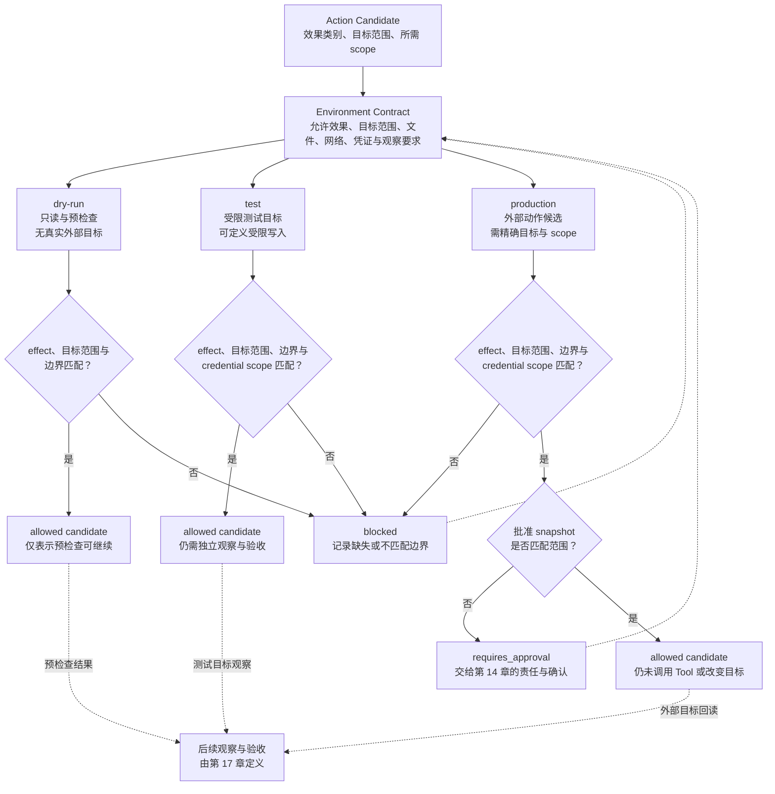

# 12. Environment、Sandbox 与权限

> 环境（Environment）不是“能跑命令的地方”。它是把一个候选动作限制在可审查的文件、网络、凭证、目标和效果范围内的执行边界。

本章把环境契约（Environment Contract）定义为进入该边界前的审查工件；沙箱（Sandbox）是其中可能采用的一种技术限制，凭证（Credential）则是源系统识别请求主体的身份材料。三者不能相互替代。

## 本章目标

完成本章后，读者能够：

- 将任务意图、Tool Contract、环境契约（Environment Contract）、源系统权限、人工批准和结果验收拆成不同判断，不用其中一个冒充全部结论。
- 为只读、受限写入和外部动作分别列出文件系统、网络、凭证、目标范围与观察要求。
- 比较 dry-run、测试环境和生产环境，并说明某一层的允许候选为什么不能自动迁移到下一层。
- 设计一份环境准入记录，使拒绝、缺凭证、边界不满足和需要批准的原因可被接手者定位。
- 识别“工具可用即默认可写”“有 token 即获得全部权限”“测试通过即可以生产发布”等越界推理。

## 为什么要学

第 11 章可以让模型产生结构化的工具调用候选，但它不会决定此刻的命令可以访问哪个目录、是否能联网、凭证覆盖什么对象，或是否可以影响生产系统。把这些问题留给自然语言提示，会得到两种危险的结果：低风险任务反复请求不必要的确认，高风险任务则在没有足够证据时继续执行。

假设一个 Agent 提出“部署服务”。这句话至少还缺少五个问题：要部署到哪个环境？可以读写哪些工件？可连接哪些服务？使用的身份仅可操作什么目标？若动作产生外部效果，谁在何种范围内确认？即使这些条件都回答了，还需要第 17 章的独立观察与验收来判断部署目标是否真的达到预期。

OpenAI 的 GPT-5.2-Codex 安全说明描述云端隔离容器、默认网络限制、工作区文件编辑限制，以及需要时由用户批准非沙箱命令。[REF-040](https://deploymentsafety.openai.com/gpt-5-2-codex/cybersecurity) 这是该产品的限定描述，不是本章 Environment Contract 的实现，也不保证其他 Agent、主机或部署方式具有相同行为。

## 前置知识

- **前置章节：** 第 10 章的状态与恢复模型；第 11 章的 Tool Contract、调用记录与效果不确定性。
- **技术前提：** 能读懂键值对象、访问范围、Markdown 表格和简单流程图；不需要已经使用容器、Kubernetes、CI 或云 IAM。
- **不要求：** 本章不要求真实 secret、生产账号、网络代理、Docker、Kubernetes 集群或 GitHub Actions 配置。

> 注意：本章的“允许”只表示某个注入的任务候选满足本书的环境准入条件。它不表示工具已调用、源系统已授权、外部状态已改变、批准已经发生或业务结果已验收。

## 场景引入：同一个部署意图，三个不同结论

团队为一个虚构服务写下“部署新版本”的任务。Agent 已经形成了第 11 章所说的结构化调用候选，且第 10 章的工作流状态显示可以评估下一步。此时若只知道工具名称，仍无法执行：它可能要写文件、上传构件、调用外部接口，或者让一个带宽泛 token 的进程碰到生产资源。

本章使用三个教学环境：`dry-run` 只允许读取与预检查；`test` 允许受限写入测试目标；`production` 只有在环境、凭证（Credential）的作用域（scope）与批准快照（snapshot）都匹配时才可成为外部动作候选。三者只是本书的教学配置（profile），不对应真实账户、网络、CI、容器或服务。

成功标准不是“部署成功”，而是维护者能解释为什么某个候选在当前 profile 被允许、阻塞或要求批准。真实部署、回读和验收都在本章范围之外。

## 核心概念

### 任务意图、环境边界与源系统权限

把下列对象写成同一份“权限”配置，会掩盖真正的责任边界：

| 对象 | 它回答的问题 | 不能据此推出的结论 |
| --- | --- | --- |
| 任务意图 | 想完成什么、可能产生何种效果？ | 当前环境已经允许该动作。 |
| Tool Contract | 调用名称、参数、结果与失败如何表示？ | 进程可以连接目标或取得身份。 |
| Environment Contract | 当前环境允许的效果、路径、网络、凭证 scope、目标与观察要求是什么？ | 源系统已经接受该请求。 |
| 源系统权限 | 某一身份在目标系统中能做什么？ | 任务目标合理、批准存在或结果正确。 |
| 批准 snapshot | 谁为特定风险和范围作过决定？ | 技术边界已扩大或动作已执行。 |
| 验收证据 | 观察能否支持当前任务的成功标准？ | 没有检查的范围也正确。 |

本书将 Environment Contract 定义为动作进入某个环境前的审查工件。它至少包含环境身份和用途、允许效果类别、文件与资源范围、网络策略、凭证引用与 scope、目标范围、批准引用、执行后的观察要求和停止条件。它不是操作系统 policy、容器 profile、云 IAM 文档或 audit log。

### 最小权限不是一个开关

最小权限（Least Privilege）需要至少从五个维度看，而不是把“非 root”或“只读 token”当成终点：

| 维度 | 要问的问题 | 缺失时的保守动作 |
| --- | --- | --- |
| 文件系统 | 允许读写哪些工作区、构件或配置？ | 不写入，或缩小到明确路径。 |
| 网络 | 是否完全禁止、仅允许指定目的地，还是需要外部访问？ | 不发起连接。 |
| 凭证 | 身份材料的 scope 是否只覆盖这项任务与目标？ | 不借用宽泛或未知 scope 的凭证。 |
| 目标范围 | 该动作针对 preview、测试对象还是生产对象？ | 不从环境名称猜测目标。 |
| 效果类别 | 这是读取、受限写入，还是会影响外部系统的动作？ | 先分类，再决定准入和升级。 |

Docker 的安全文档把 Linux capability 作为细粒度权限机制的一部分，并建议移除进程未明确需要的 capability。[REF-041](https://docs.docker.com/engine/security/) 这只是在 Docker 容器安全语境中说明“能力可以被收紧”；它不表示容器天然隔离，也不规定本书的五维矩阵必须映射到 capability。

Kubernetes 的 RBAC API 参考中，RoleBinding 在其所在 namespace 内生效，且可以引用 Role 或 ClusterRole。[REF-042](https://kubernetes.io/docs/reference/kubernetes-api/rbac/) 这个例子强调权限需要带着作用域解释，不能把“绑定过角色”简写成“系统已授权”。它不描述其他 RBAC 系统的行为。

### Sandbox、凭证、批准与验证：四种控制不相互替代

Sandbox 是技术执行边界：它试图限制进程可以触及的路径、网络或系统能力。凭证是身份材料：它让源系统判断某个请求以谁的名义提出。批准是责任与风险的决定记录。验证是对目标状态的独立观察与验收。四者彼此缺一不可，但没有一个可以替代另一个。

例如，一个批准 snapshot 即使存在，也不能让无网络 Sandbox 连接生产服务；一个带生产 scope 的 token 即使存在，也不等于任务被批准；命令即使退出为 0，也不等于目标状态已经被观察并按验收规则接受。环境设计的第一原则因此是：每一种“允许”都必须写清它允许的是哪一层，下一层仍需要什么证据。

GitHub Actions 的 workflow syntax 文档允许在 workflow 或 job 层修改 `GITHUB_TOKEN` 权限；若指定任一权限，未指定权限会被设置为 `none`。[REF-043](https://docs.github.com/en/actions/reference/workflows-and-actions/workflow-syntax?apiVersion=2022-11-28) GitHub 还建议默认收紧 token，再为各 job 增加最小必要访问。[REF-044](https://docs.github.com/en/actions/reference/security/secure-use) 这两个陈述只适用于 GitHub Actions 的产品语境；它们不为第三方 action、仓库默认值、真实 secret 或其他 CI 提供保证。

### 三种安全架构对照：批准、内置沙箱与外置隔离

Agent 的安全边界常被简写为“每次执行前询问用户”，但批准界面只是其中一种
架构选择。pi 刻意不提供内置权限系统；其作者认为，当 Agent 已经能够写代码
并运行代码时，逐条命令的应用层权限提示容易制造并不存在的安全感。这里
必须保留主语：这是 Mario Zechner 对其产品取舍的解释，不是已经证明的
行业结论。[REF-149](https://mariozechner.at/posts/2025-11-30-pi-coding-agent/)

pi 的 README 同时把隔离责任放在应用之外：需要边界时，可在操作系统层通过
容器或微型虚拟机（micro-VM）运行。该项目默认给 Agent 完整执行能力的选择，
只描述 pi 自身的设计；它不证明容器或 micro-VM 配置天然安全，也不表示
其他项目应取消权限控制。项目特性均以访问日（2026-07-26）的 README 为准。
[REF-148](https://github.com/earendil-works/pi)

把这种取舍与常见方案放在一起，可以得到三种不同的责任分配：

| 架构 | 主要控制点 | 擅长解决的问题 | 单独使用时留下的缺口 |
| --- | --- | --- | --- |
| 应用层批准 | Agent 或 Tool 在动作前请求用户确认 | 把高风险动作、请求范围、批准者和时间写入决策记录 | 用户可能无法判断底层命令效果；批准本身不限制进程实际能触达什么 |
| 内置操作系统沙箱 | Agent 产品直接限制文件、网络或进程能力 | 让默认运行路径在技术上越界失败，并可把提权作为显式分支 | 产品必须正确实现和维护策略；沙箱不会判断业务目标是否合理 |
| 外置容器或虚拟机 | 由启动器、CI 或基础设施包住整个 Agent 进程 | 将应用与宿主机、凭证和网络边界分离，且不依赖 Agent 自觉遵守 | 镜像、挂载、网络、凭证和宿主配置仍可能扩大边界；外层隔离不留下业务批准 |

这三种架构不能只按“严格程度”排成一条直线。应用层批准回答的是谁愿意为
什么风险作决定；内置沙箱回答的是产品运行时实际拒绝哪些系统调用或资源；
外置隔离回答的是即使 Agent 与应用自身失守，进程还能接触多大范围。它们
处理的责任层不同，因此可以组合，而不是互斥。

本书并不直接接受“应用层批准没有价值”的结论。批准记录至少可以保留
风险升级、请求范围与责任主体，特别适合处理付款、发布、通知或生产变更等
不能只靠路径和网络规则判断的业务动作。但批准不能把越界能力变安全：
如果进程已经拥有宿主文件、宽泛凭证和开放网络，用户点击一次确认并不会
自动缩小这些能力。

反过来，强隔离也不能替代批准。一个容器可能准确阻止宿主文件访问，却仍可
使用容器内注入的生产凭证完成错误发布；一个 micro-VM 可能隔离内核，却无法
判断“删除测试数据”是否符合任务目标。业务责任与技术能力需要分别建模。

| 任务情形 | 最小组合建议 | 仍需独立验证 |
| --- | --- | --- |
| 只读本地分析 | 受限文件边界；无不必要网络和凭证 | 读取范围是否与任务一致，输出是否泄露敏感信息 |
| 测试环境写入 | 技术隔离 + 测试 scope 凭证 | 目标确为测试对象，写后状态符合验收 |
| 生产外部动作 | 技术隔离 + 精确凭证 + 应用层批准 | 批准 snapshot 匹配当前请求，执行后独立回读 |
| 执行未知第三方代码 | 优先外置强隔离，并缩小挂载与网络 | 依赖来源、逃逸风险、残留副作用与销毁结果 |

因此，架构选择应从威胁模型（Threat Model）和效果类别出发，而不是从
“是否弹窗”出发。若项目选择 pi 式的极简核心，就必须把启动器、容器、
micro-VM、凭证注入与销毁证据纳入可审查工件；若项目选择内置批准和沙箱，
则必须分别记录批准语义与技术拒绝边界。任何一种方案都不能仅凭界面文案、
作者立场或 README 中的运行模式宣称安全。

### 环境阶梯：dry-run、测试与生产不是同一个边界

下表把环境阶梯写成可审查的教学 profile。它不是任何平台的推荐默认配置。

| 教学环境 | 允许效果候选 | 文件与网络边界 | 凭证与目标 | 仍需什么 | 不代表什么 |
| --- | --- | --- | --- | --- | --- |
| `dry-run` | 只读与预检查 | 只读、网络关闭 | 无凭证或虚构 scope；无真实目标 | 输出计划、缺口或风险 | 已写入、已部署、目标可达。 |
| `test` | 只读与受限写入 | 指定工作区；按契约关闭或限制网络 | 仅测试 scope 与测试目标 | 后续观察、测试验收 | 可以访问生产或生产结果正确。 |
| `production` | 已分类的外部动作候选 | 明确路径、目的地和拒绝条件 | 精确生产 scope 与目标 | 匹配批准、回读、验收和审计 | 动作已被源系统接受或完成。 |

dry-run 的价值是让计划、参数和准入条件在没有真实副作用时被检查。它不应伪装成“部署验证”：没有真实写入，就没有可回读的写后状态。测试环境也不能成为生产的别名；它需要自己的目标、scope、数据和观察边界。

## 架构图：环境阶梯中的准入与保守出口

下图回答：同一个外部动作候选为什么要经过 Environment Contract、边界、凭证 scope 和批准检查，才能在不同教学环境中形成不同的准入结论？Mermaid 源文件位于 [chapter-12-environment-permission-ladder.mmd](../../diagrams/mermaid/chapter-12-environment-permission-ladder.mmd)，并已导出为 [SVG](../../diagrams/exported/chapter-12-environment-permission-ladder.svg) 与 [PNG](../../diagrams/exported/chapter-12-environment-permission-ladder.png)。

图只表达本书的准入模型；它不描述真实 Sandbox、网络防火墙、文件系统、容器、Kubernetes、CI、凭证、部署、审批、审计、Tool 调用或目标状态。



> 图示替代描述：动作候选先被环境契约约束，再分别进入 dry-run、测试或生产教学环境。每一层都会检查效果类别、目标范围与技术边界；测试和生产还检查凭证 scope。缺任何匹配项就进入 `blocked` 并回到契约。生产路径即使其他条件匹配，也要检查批准 snapshot；缺失或范围不符时进入 `requires_approval`，取得明确决定后重新评估。三个“allowed candidate”都只流向后续观察与验收，且不表示 Tool 已调用、目标已改变或任务已完成。

## 工作流程：用环境契约审查一个候选

1. **分类候选动作。** 写明它是只读、受限写入还是外部动作，以及目标范围；不从命令文本猜测风险。
2. **选择环境 profile。** 指明 dry-run、测试或生产的用途，禁止用相同名称掩盖不同的路径、网络或目标。
3. **比对技术边界。** 检查文件/资源、网络、允许效果和停止条件；缺一项就返回 `blocked`。
4. **比对凭证与目标 scope。** 确认注入身份仅覆盖所需目标；没有精确 scope 时不升级为宽泛权限。
5. **检查批准引用。** 若动作跨越定义的风险阈值，确认 snapshot 仍覆盖当前环境、效果和范围；否则进入 `requires_approval`。
6. **形成准入记录。** 保存候选、profile、匹配项、拒绝理由、批准引用和后续观察要求。
7. **执行后重新观察。** 准入允许不等于成功；真实动作后的回读与验收由第 11、17、18 章相应机制完成。

## 最小示例：纯内存环境准入判断

本章提供 [`assessEnvironmentAccess`](../../examples/agent/environment-sandbox-assessment.mjs)。函数只比较调用者注入的任务、环境 profile、policy 和批准 snapshot，返回 `allowed`、`blocked` 或 `requires_approval`。它不会读取 `process.env`、当前目录、文件、网络、时钟、身份、secret、Sandbox、容器、CI、云账户或外部系统。

下面是演示中使用的教学输入，而不是可部署配置：

```js
const input = {
  task: {
    id: 'deploy-preview',
    effect: 'read_only',
    targetScope: 'preview',
    credentialScope: 'none',
  },
  environment: {
    id: 'dry-run',
    allowedEffects: ['read_only'],
    targetScopes: ['preview'],
    filesystem: 'read_only',
    network: 'disabled',
    credentialScopes: ['none'],
  },
};
```

测试文件先于实现模块创建。2026-07-16 实际运行 `node --test examples/agent/environment-sandbox-assessment.test.mjs` 时，命令以退出码 `1` 结束并报告 `ERR_MODULE_NOT_FOUND`；缺失的是 `environment-sandbox-assessment.mjs`。这条红灯只证明测试先于实现存在。

实现后，同一命令实际以退出码 `0` 结束，8 项 Node 内置测试全部通过、0 项失败；`node examples/agent/environment-sandbox-assessment.mjs` 也以退出码 `0` 输出 `allowed / environment_admission_allowed / inspect-preview`。测试和演示只证明纯函数对注入对象的判断，不验证真实 environment、权限、部署、秘密管理、网络、文件系统、CI、容器、源系统授权或外部效果。

## 逐步增强：先保守判断，再连接真实控制面

1. **记录环境 profile。** 先让效果类别、目标、边界与停止条件可检查。升级触发：接手者无法说明当前候选为什么可以或不可以继续。
2. **关联凭证与批准引用。** 把 scope 和批准作为可比对输入，而不是写在 Prompt 中。升级触发：任务开始碰到共享、付费或不可逆目标。
3. **关联状态与 Tool 记录。** 将准入判断连接到第 10、11 章的运行与调用关联。升级触发：任务可中断、重试或产生效果不确定性。
4. **接入真实平台适配器。** 只有选定平台、获得组织授权、隔离实现和验收路径均可定位后，才读取真实策略或发起外部动作。

## 完整工程案例：同一部署意图的三条诚实路径

**背景：** 团队希望将虚构服务的构建产物部署到某个目标。Agent 只得到一个结构化的“部署”候选，没有权利凭空决定真实环境。

**约束：** 不连接真实服务、不读取 token、不写文件、不运行 CI、不调用容器或云命令。所有环境、scope、批准和观察都使用教学对象。

| 环境 | 任务效果 | 准入判断 | 必须留下的记录 | 不能写成 |
| --- | --- | --- | --- | --- |
| `dry-run` | 只读预检查 | 可成为 `allowed candidate` | profile、输入缺口与预检查范围 | “已部署”。 |
| `test` | 受限写入测试目标 | 仅在边界与 `test-deploy` scope 匹配时可成为候选 | 目标、scope、后续观察要求 | “生产也会成功”。 |
| `production` | 外部动作 | 需要边界、生产 scope 和匹配批准 | 具体范围、批准引用、回读与验收要求 | “批准即表示已改变目标”。 |

**设计选择：** 本书模型把三个环境的准入写成不同路径，而不提供一个“全权限 deploy”能力。即使生产路径被允许，也只代表下一步可以进入受控调用和观察，不能提前报告结果。

**结果与证据：** 示例只提供注入对象上的判断；没有真实部署、生产观察或业务验收结果。

## 实现说明

| 决策 | 选择 | 原因 | 替代方案与边界 |
| --- | --- | --- | --- |
| 准入输入 | 显式传入 environment 与 policy。 | 不让函数读取机器状态或 secret。 | 真实 policy adapter 必须独立实现与验证。 |
| 效果分类 | `read_only`、`write`、`external` 教学分类。 | 使风险讨论可检查。 | 不等价于 OS、云或业务系统权限。 |
| 批准 | 只比较注入 snapshot 的环境与效果。 | 不把函数伪装成人类决策系统。 | 真正审批还要处理身份、时间、范围与责任。 |
| 成功结论 | 只返回准入候选。 | 避免把允许混成执行或验收。 | 外部效果需独立观察和验证。 |

## 测试与验证

| 层级 | 验证对象 | 命令或方法 | 成功标准 | 实际状态 |
| --- | --- | --- | --- | --- |
| 单元 | 纯内存准入函数 | `node --test examples/agent/environment-sandbox-assessment.test.mjs` | 8 项教学路径返回确定结果 | 2026-07-16 实际通过：8 项通过、0 项失败。 |
| 演示 | 一条 dry-run 只读路径 | `node examples/agent/environment-sandbox-assessment.mjs` | 输出 `allowed / environment_admission_allowed` | 2026-07-16 实际通过。 |
| Mermaid | 图源语法与导出图 | Mermaid CLI 导出 SVG、PNG 并人工查看 PNG | 节点、箭头与保守出口可读 | 2026-07-16 实际完成。 |
| 真实环境 | Sandbox、凭证、部署与回读 | 不在本章实现 | 不得以教学对象替代真实证据 | 未执行，刻意排除。 |

## 工程实践

- **默认收紧，按候选扩大。** 先从只读、无网络、无敏感凭证的 profile 开始；每一次扩大都写明动作、目标、期限和观察要求。
- **把 scope 与目标一起审查。** “有 token”没有意义；需要知道该 token 在当前任务中会触及哪个对象、能做什么以及何时应停止。
- **把拒绝当作结果。** `blocked` 应记录缺哪个边界、scope 或证据，而不是被重写成模糊的“执行失败”。
- **不把 dry-run 当回读。** dry-run 可帮助暴露参数和策略问题，但不会提供写后状态，因此不能替代真实观察。

## 最佳实践

- 为环境 profile 写用途和禁止项，例如“此 profile 只允许测试目标的受限写入”。原因是路径或环境名本身不能传达风险边界。
- 在准入记录中保留批准和凭证的引用，而不复制 secret。原因是复制 secret 会扩大泄漏面，且无法说明 source scope。
- 将“允许调用”“调用完成”“目标被观察”“验收接受”分为四条记录。原因是每一步可能失败、超时或需要不同责任主体。

## 常见错误

| 错误 | 表现 | 根因 | 修复方向 |
| --- | --- | --- | --- |
| 工具可见即默认可写 | Agent 直接尝试修改共享或生产目标。 | Tool 定义被误当作环境授权。 | 在调用前匹配 Environment Contract。 |
| 环境名等于权限 | 名为 `test` 的环境被假定安全。 | 没有记录路径、网络、scope 和目标。 | 为环境建立可审查 profile。 |
| 复制或转述 secret | 凭证进入 Prompt、日志或报告。 | 将身份材料与 scope 判断混在一起。 | 只保留凭证引用与 scope，实际 secret 留在受控系统。 |
| dry-run 等于部署成功 | 预检查通过后直接报告完成。 | 没有区分计划检查、外部效果和回读。 | 真实动作后重新观察并由验收规则判断。 |
| 旧批准无限复用 | 一次决定被用于不同目标或环境。 | 批准没有关联范围和效果类别。 | 比对环境、目标、效果与当前版本。 |

## 安全与边界

- **权限边界：** 示例不提供、授予、验证或保存任何真实权限；真实控制还应由 Sandbox、源系统和组织政策共同执行。
- **数据边界：** 不把 secret、账户标识、生产路径、网络地址或真实环境配置写入书稿或示例。
- **人工审批点：** `external` 只是教学中的风险标签；何时必须人类确认、谁负责和如何升级由第 14 章的审批模型与实际组织政策决定。
- **不适用范围：** 本章不能代替威胁建模、合规、审计、密钥轮换、供应链安全、灾难恢复或企业级访问治理；第 41 章会进一步讨论安全、权限与审计。

## 章节总结

环境边界把“可以提出的动作”收束为“当前环境可以安全评估的候选”。它要求把文件、网络、凭证、目标和效果类别逐项写明，并把 Sandbox、源系统权限、批准和验收保留为不同控制层。dry-run、测试和生产不是同义词；每一层都要重新检查边界，允许候选后仍需真实观察和验收。

下一章将讨论 Human-in-the-loop：当技术边界不应自动扩大、风险与责任需要人类决定时，如何设计明确的审批、升级和反馈路径。

## 练习

1. 为一个“读取生产日志”的候选写出 Environment Contract。它需要哪些文件、网络、凭证和目标范围？哪些信息缺失时必须 `blocked`？
2. 一份测试环境 token 同时能访问生产对象。请设计一种不复制 token、但能让准入记录拒绝该候选的 scope 表示。
3. 说明一次 dry-run 通过后，仍需哪些观察和验收才可以报告“部署目标达到预期”。

## 延伸阅读

- [OpenAI：GPT-5.2-Codex cybersecurity](https://deploymentsafety.openai.com/gpt-5-2-codex/cybersecurity)：隔离容器、网络、文件边界与非沙箱批准的产品限定例子。
- [Docker Engine security](https://docs.docker.com/engine/security/)：容器环境中 namespace、cgroup 与 capability 的背景。
- [Kubernetes RBAC API reference](https://kubernetes.io/docs/reference/kubernetes-api/rbac/)：RoleBinding 作用域的 API 参考。
- [GitHub Actions secure use reference](https://docs.github.com/en/actions/reference/security/secure-use)：job 级最小 token 权限建议。

## 参考资料

- [REF-040 至 REF-044 的用途与外推边界](12-environment-sandbox-and-permissions.references.md)。本地研究键仅用于历史追溯，正式引用以全局 `.ai/references.md` 为准；每次涉及动态产品资料的修订都必须重新核验。

## 章节完成检查表

- [x] Front matter、目标、前置知识和章节依赖完整。
- [x] 正文使用原创结构，来源限定陈述与本书工程模型已分开。
- [x] 图示具有 Mermaid 源、读图说明、SVG/PNG 导出和替代描述。
- [x] 示例具有环境、红绿验证、命令、实际结果和安全边界。
- [x] Technical、Fact、Diagram、Language 与 Final Review 已留下独立记录。
- [ ] 共享 `.ai/references.md`、`.ai/progress.md`、`.context/*`、`package.json` 与总校验由主线程统一整合；本子任务未修改它们。
