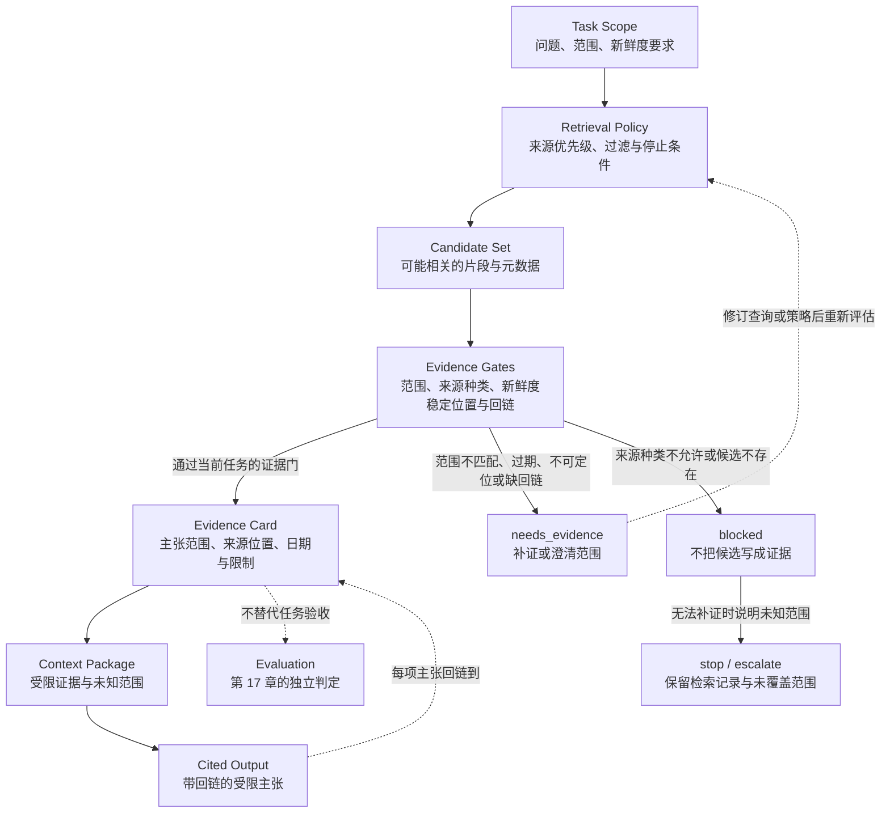

# 13. Knowledge Base 与检索

> 检索（Retrieval）的交付物不是一串相似度分数，而是一份能让读者回到来源、判断范围和发现新鲜度缺口的证据包。

## 本章目标

完成本章后，读者能够：

- 区分知识库（Knowledge Base）、索引（Index）、候选片段、证据单元（Evidence Unit）和答案，避免把“搜到”写成“已证实”。
- 为一个检索任务写出资料范围、来源优先级、新鲜度要求、过滤条件和停止条件，而不是只写一个查询字符串。
- 用证据卡（Evidence Card）把输出中的主张回链到稳定来源位置、范围、时间和限制。
- 判断相似度、关键词命中、摘要、URL 可访问性和来源种类各自能说明什么，不能说明什么。
- 在候选缺失、范围冲突、资料过期、无法定位或引用缺失时，保守地补证、停止或升级。

## 为什么要学

把文档、网页或笔记塞进 Prompt 的确可能让模型得到更多材料，但这不解决一个关键问题：这段材料能否回答当前问题，是否仍然适用，以及读者能否找到它。检索层若只返回“排名第一的文本”，错误会在后续回答里被放大：旧博客可能覆盖了新文档，缺日期的片段可能被当成当前策略，段落中的“它”可能在切分后不再知道指谁。

例如，虚构任务“当前 API 鉴权方式是什么？”需要的是当前、范围明确、可定位的官方资料。一个高分博客段落即使语言流畅，也可能只描述旧版本、不同区域或不同产品；一段来自官方页面的片段即使来源可信，也可能没有覆盖问题中的“当前”或“鉴权方式”。此时，生成一段听起来确定的答案，比返回“证据不足，需重查官方页”更危险。

Lewis 等人的检索增强生成（Retrieval-Augmented Generation，RAG）论文将预训练的参数化模型与经神经检索器访问的、基于 Wikipedia 的非参数稠密向量索引结合，并把知识溯源和知识更新列为开放问题。[REF-045](https://arxiv.org/abs/2005.11401) 这个研究背景说明外置可检索资料与模型可以分层；它不保证任何检索结果可归因、可更新或适合当前任务。

## 前置知识

- **前置章节：** 第 6 章说明模型可见上下文怎样被选择；第 7 章说明长期记忆不是无条件可信的资料；第 10 章说明候选、观察、证据和验证结论必须分开。
- **技术前提：** 能读懂 Markdown 表格、普通对象与相对链接；不要求使用过向量数据库、嵌入模型或搜索引擎。
- **不要求：** 本章不要求配置网页爬虫、上传文件、调用模型、建立索引、部署数据库、存储密钥或访问企业知识库。

> 注意：第 13 章准备的是证据层。它不授予读取权限（第 12 章），不替人作责任判断（第 14 章），不把观察判为任务成功（第 17 章），也不设计真实生产检索基础设施。

## 场景引入：一段高分材料还缺什么

设想一个文档助手收到任务：“说明当前 API 的鉴权方式，并给出读者可继续核对的位置。”它从混合资料库中拿到三项候选：

| 候选 | 表面优势 | 缺口 | 当前能否直接用于答案 |
| --- | --- | --- | --- |
| 无日期博客节选 | 关键词与问题高度相似 | 版本、产品范围和作者维护状态不明 | 不能；先补来源和新鲜度。 |
| 官方页面节选 | 来源种类优先，含稳定页面位置 | 还未确认页面是否覆盖问题的具体范围 | 不能；先核对范围。 |
| 当前官方页面的定位段落 | 来源、范围、访问时间与主题都可记录 | 仍须把它和输出中的主张逐项回链 | 可以进入证据卡候选。 |

这个场景没有真的访问任何 API、页面或资料库。它只说明一个审查顺序：候选先通过范围、来源、新鲜度、稳定位置和引用回链检查，才可进入模型上下文。即使通过，也只表示材料适合支持某个受限主张；答案是否满足任务目标仍需要第 17 章的验收。

## 核心概念

### 知识库、索引、候选与证据：四层对象回答不同问题

“知识库”常被用来同时指文件夹、向量数据库、搜索结果和模型回答。工程上这会隐藏责任边界。本书建议把它们分开：

| 对象 | 它回答的问题 | 最低可见信息 | 它不能证明什么 |
| --- | --- | --- | --- |
| Knowledge Base | 哪些资料允许被检索？ | 范围、来源种类、所有者、更新责任、敏感性和排除项 | 内容正确、资料当前或调用者有权访问。 |
| Index | 如何从资料中找候选？ | 索引版本、材料来源与可用过滤字段 | 召回完整、候选相关或来源可引用。 |
| Candidate | 本次查询找到了什么可能材料？ | 来源标识、片段范围、排序信号与元数据 | 该片段支持回答、内容当前或可公开使用。 |
| Evidence Unit | 哪段材料可支持哪项受限主张？ | 稳定位置、主题、时间、来源种类、限制与引用关系 | 任务已经完成或整个页面都适用。 |
| Answer | 面向读者的受限结论 | 主张、Evidence Card、未覆盖范围 | 资料库完整或现实世界已改变。 |

索引是为了定位候选，不是事实裁判。OpenAI 当前的 Vector stores API 参考把 vector store 用于语义搜索和 `file_search`，并列出切块策略、查询和文件属性筛选等接口概念。[REF-047](https://developers.openai.com/api/reference/resources/vector_stores) 这是一个产品范围内的例子：切块和过滤属于明确设计选择；它不规定本书的资料结构，也不代表任何命中都已核验。

### Knowledge Base Profile：先写清楚资料边界

本书建议在建立索引之前，为资料集合保留一张 Knowledge Base Profile。它不需要是复杂的数据库 schema；它的目标是让维护者知道“这里面有什么、谁负责、什么不应该被拿来回答”。

| 字段 | 需要回答的问题 | 教学示例 | 不能替代什么 |
| --- | --- | --- | --- |
| `scope` | 资料服务哪个主题和读者？ | 当前版本的开发者文档 | 模型的全部知识。 |
| `source_priority` | 相冲突时优先谁？ | 当前官方文档优先于未核验博客 | 事实自动正确。 |
| `owner` | 谁负责更新或下线？ | 文档维护团队 | 访问或执行权限。 |
| `freshness_rule` | 哪些任务必须重新核验？ | “当前、最新、价格、安全策略” | 页面永不过期。 |
| `sensitivity` | 哪些资料不得进入模型上下文？ | 含客户数据的内部附件 | 安全控制已经实现。 |
| `exclusions` | 什么材料只可导航、不可引用？ | 无日期转载与未验证摘要 | 它们完全没有价值。 |

这张 Profile 既不是权限矩阵，也不是索引配置。权限、Sandbox 和凭证由第 12 章处理；Profile 只提供检索前的资料边界。没有它，系统容易把“内部笔记出现了某个词”误当成“可以向外回答”。

### Evidence Unit：让片段保留来处、时间和限制

切分能让系统处理较大资料库，也可能让原文失去主体、条件和时间。Anthropic 的 Contextual Retrieval 工程文章描述了一条典型 RAG 路径：将资料切为片段、建立嵌入、按查询找相关片段，再把候选加到 Prompt；该文还讨论了词法匹配对精确术语的补充作用。[REF-046](https://www.anthropic.com/engineering/contextual-retrieval) 本章不采用其参数、实验结论或供应商组合，只保留一个设计提醒：片段边界会改变可解释性。

本书的 Evidence Unit 是可引用片段的审查包装。它至少应保存：

- 稳定的来源位置，例如页面 URL、文档锚点、版本或受控文档标识；
- 原始资料与片段的关系，例如标题、章节、开始/结束范围或定位说明；
- 该片段能支持的主题和不能支持的主题；
- 来源种类、访问或核验日期、适用版本/环境，以及已知的时效限制；
- 与输出主张的回链，而不是只保留一段脱离来处的文本。

如果片段只写“使用 bearer token”，却缺少“哪个 API、哪个版本、怎样配置、资料日期”，它可能是有用的导航线索，却不适合作为“当前鉴权方式”的最终证据。保留这个缺口，比用模型补齐未知的上下文更可审查。

### Retrieval Policy：把检索视为带门的请求

检索策略（Retrieval Policy）是本书模型，不是搜索引擎配置。它告诉 Harness 哪些候选可以进入证据评估，哪些候选只能用于导航，哪些情况必须停止。最小策略可包含：

| 规则 | 问题 | 教学示例 | 失败时的保守动作 |
| --- | --- | --- | --- |
| 任务范围 | 这次要回答哪个受限问题？ | `api_authentication` | 要求澄清，不扩大查询。 |
| 来源优先级 | 哪类资料优先？ | 当前官方页、原始论文、受控内部资料、其余导航材料 | 不让低优先级候选直接支撑结论。 |
| 新鲜度 | 是否必须在写作当日核验？ | 含“当前”“最新”“价格”“安全”的问题 | 标记 `needs_evidence`。 |
| 元数据过滤 | 允许哪个产品、版本、区域或文档类型？ | 只接受目标 API 的开发者文档 | 拒绝范围不匹配候选。 |
| 定位要求 | 读者能否回到来源？ | URL 和页面/章节定位齐全 | 不把材料写成可引用事实。 |
| 停止条件 | 何时不再继续生成？ | 官方候选冲突且无法确认日期 | 说明未知范围并升级。 |

Policy 先于排序。排序可以帮助缩小候选集合，却不能回答“此来源是否允许”“它是否覆盖当前问题”“它是否仍新鲜”。为了避免把复杂检索系统伪装成一个分数函数，本书不提供统一阈值、Top-K、嵌入模型或融合公式。

### 检索分数、范围与新鲜度：不同信号不能互相代偿

相似度、词法命中、来源种类、时间和引用位置是不能互相代偿的不同维度：

| 信号 | 有助于回答什么 | 不足以回答什么 | 需要配合什么 |
| --- | --- | --- | --- |
| 语义相似度 | 材料与查询可能在表达含义上接近 | 精确术语、版本、产品范围或事实正确性 | 范围与来源核对。 |
| 词法命中 | 特定错误码、字段名或产品名是否出现 | 段落是否回答完整问题 | 语境与片段边界。 |
| 来源种类 | 材料是否符合设定的优先级 | 内容是否当前、适用或无冲突 | 日期、范围和主张核对。 |
| 新鲜度标记 | 是否已有可追溯的核验动作 | 资料内容已完整覆盖任务 | 主题与引用检查。 |
| 稳定位置 | 读者能否回到材料 | 该材料支持哪个结论 | Evidence Card 中的主张范围。 |
| 引用回链 | 输出知道自己依据哪项材料 | 答案已被独立验收 | 第 17 章的验证规则。 |

因此，最高分候选仍可能被拒绝。反过来，低分但来自当前官方页面的候选也不能因为“官方”而自动通过；它仍须覆盖问题的具体范围。证据工程的目标不是消除不确定性，而是让不确定性停留在可见的位置。

## 架构图：从候选到带引用输出的证据流水线

下图回答：任务范围、Retrieval Policy 和证据门怎样约束从候选集合到带引用输出的路径？为什么没有通过范围、来源、新鲜度、位置和回链检查的材料只能补证或停止？

Mermaid 源文件位于 [chapter-13-retrieval-evidence-pipeline.mmd](../../diagrams/mermaid/chapter-13-retrieval-evidence-pipeline.mmd)，已于 2026-07-16 使用 Mermaid CLI 11.16.0 导出并查看 [SVG](../../diagrams/exported/chapter-13-retrieval-evidence-pipeline.svg) 与 [PNG](../../diagrams/exported/chapter-13-retrieval-evidence-pipeline.png)。

图只表达本书的证据准备模型，不表示真实搜索、向量化、网页访问、索引、权限、来源可信度、内容正确性或任务验收已经发生。



> 图示替代描述：任务范围和 Retrieval Policy 产生候选集合。候选必须通过范围、来源种类、新鲜度、稳定位置和引用回链等 Evidence Gates，才能形成带主张范围、来源位置、日期与限制的 Evidence Card；随后这些卡片被装配成受限上下文并输出带回链的主张。门失败时，范围不匹配、过期、不可定位或缺回链转入 `needs_evidence` 并回到 Policy；候选不存在或来源种类不允许转入 `blocked`，无法补证时保留未知范围并停止或升级。虚线表示引用回链和“不能替代验收”的约束。

## 工作流程：把检索变成可审查证据

以下顺序是本书建议，不是某个搜索引擎、向量数据库或 API 的默认算法：

1. **澄清问题范围：** 记录任务想回答的对象、时间、产品/版本、读者和允许结论；出现“当前”时把写作日核验列为前提。
2. **选择 Knowledge Base Profile：** 确认资料集合、来源优先级、敏感边界与更新责任；不把项目外材料默认混入。
3. **写 Retrieval Policy：** 设定可用来源种类、元数据过滤、新鲜度、稳定位置和停止条件；这一步先于查询优化。
4. **取得候选集合：** 候选只记录“可能相关”，保留其来源、片段范围、排序信号和获取条件；不要把排序顺序当成结论。
5. **执行证据门：** 检查候选是否覆盖任务范围、是否符合来源优先级、是否已按要求核验新鲜度、能否稳定定位，以及能否进入输出回链。
6. **形成 Evidence Card：** 为通过的候选写明“支持哪项主张、在什么范围内、来源在哪里、何时访问、有什么限制”。
7. **装配受限上下文：** 把证据与未知范围共同交给模型；不要让模型把缺失条件补成事实。
8. **输出并回链：** 让每项可归因主张能回到 Evidence Card。结果验收、人工责任和新一轮检索分别交给后续章节。

### Evidence Card 模板

下表是本书模型。它刻意把“能支持的主张”和“仍然未知”放在同一张卡上：

| 字段 | 示例性内容 | 作用 | 不表示 |
| --- | --- | --- | --- |
| `claim_scope` | “目标 API 的当前鉴权入口” | 防止把局部材料扩展成通用答案 | 页面覆盖所有 API。 |
| `source_location` | 官方页 URL 与章节定位 | 允许读者回链 | 页面当前可访问。 |
| `source_kind` | `official` | 与 Policy 对照 | 绝对正确。 |
| `verified_at` | 写作当日复核日期 | 对时间敏感问题保留证据 | 永久新鲜。 |
| `evidence_boundary` | 仅支持某个产品与版本范围 | 约束生成 | 其他环境同样适用。 |
| `answer_link` | 输出中的引用位置 | 让主张与来源关联 | 任务已通过验收。 |
| `unknowns` | 未覆盖区域、冲突或待查项 | 保留诚实的不确定性 | 系统已经失败。 |

## 最小示例：评估注入的证据候选

完整实现见 [`retrieval-evidence-assessment.mjs`](../../examples/agent/retrieval-evidence-assessment.mjs)，测试见 [`retrieval-evidence-assessment.test.mjs`](../../examples/agent/retrieval-evidence-assessment.test.mjs)。它不检索任何材料；只判断注入对象是否满足本章教学用的 Retrieval Policy。

```js
const result = assessRetrievalEvidence({
  query: { scope: 'api_authentication', requiresFreshness: true },
  candidates: [{
    id: 'official-auth-doc',
    sourceKind: 'official',
    scopes: ['api_authentication'],
    url: 'https://docs.example.invalid/auth',
    freshness: 'verified',
  }],
  policy: { allowedSourceKinds: ['official', 'primary_paper'] },
  selection: {
    candidateIds: ['official-auth-doc'],
    citedCandidateIds: ['official-auth-doc'],
  },
});
```

**运行环境：** Node.js 的内置测试运行器；不需要网络、文件、数据库、模型、向量库或外部凭证。

**实际验证：** 2026-07-16 已运行：

```bash
node --test examples/agent/retrieval-evidence-assessment.test.mjs
node examples/agent/retrieval-evidence-assessment.mjs
```

第一条命令退出码为 `0`，7 项测试通过、0 项失败；第二条命令退出码为 `0`，输出 `allowed / evidence_selection_allowed` 与 `official-auth-doc`。这只说明函数会按注入对象返回预期判断，并不证明示例 URL 存在、来源实际新鲜、官方资料正确或任何答案已验收。红绿记录和完整边界见[示例实现记录](13-knowledge-base-and-retrieval.example-plan.md)。

## 逐步增强：从候选检查到真实检索系统

最小示例故意停在 Policy 判断。若真实需求出现，可按一项复杂度一次推进：

1. **增加结构化 Evidence Card：** 当多个主张需要不同材料时，为每个主张保存来源位置、范围和未知项；不要先引入向量数据库。
2. **增加受控资料读取：** 当资料集合已明确、权限已通过第 12 章审查时，记录实际读取范围、失败和敏感数据处理；不能把文件名当作内容证据。
3. **增加索引与查询实现：** 当人工筛选已无法满足规模需求时，为切分、元数据、版本、删除和重建选择具体实现，并用任务集评估召回和误取风险。
4. **增加独立验收：** 当输出会驱动业务或对外发布时，按第 17 章定义主张级核验和失败报告；引用存在不能替代验收。

升级触发条件是明确的规模、时效、合规或可重复性需求，而不是“RAG 是默认架构”。小型、稳定且可人工审阅的资料集可能只需要普通 Markdown 链接与 Evidence Card。

## 完整工程案例：为“当前 API 鉴权方式”准备证据

这个案例是原创教学设计，不指向任何真实产品。目标是向读者解释一个目标 API 的当前鉴权入口；成功标准是每一句可归因结论都能回到写作日复核的官方页面位置，并且没有把未知环境写成确定配置。

| 决策点 | 选择 | 原因 | 拒绝或升级条件 |
| --- | --- | --- | --- |
| 查询范围 | 目标 API、当前文档、开发者读者 | 避免把其他 API 或历史迁移文档混入 | 任务未说明产品/版本时先澄清。 |
| 来源优先级 | 当前官方开发者文档优先 | 目标是当前接口说明，而不是经验分享 | 官方页面缺日期、范围或定位时不能自动通过。 |
| 博客处理 | 仅作导航线索 | 可帮助发现术语或迁移路径 | 不直接支撑“当前方式”结论。 |
| 新鲜度 | 写作当日重新访问候选官方页 | “当前”是时间敏感限定词 | 无法复核时输出待核验范围。 |
| 片段选择 | 保留标题、条件和稳定位置 | 防止脱离上下文的鉴权术语被误用 | 只有一句口号或缺目标范围时补证。 |
| 输出 | 主张旁附 Evidence Card 回链 | 让读者可自行复查 | 发现冲突或未覆盖环境时停止并说明。 |

在这个案例中，检索完成不等于“答案可发布”。如果官方页面只覆盖服务端而问题没有说明客户端环境，Evidence Card 应写出未覆盖范围。若不同官方页彼此冲突且无法确认优先级，应保留冲突、停止自动归纳，并转入人类审查，而不是让模型选择看起来更顺的一段。

## 实现说明

| 决策 | 选择 | 原因 | 替代方案与边界 |
| --- | --- | --- | --- |
| 检索请求入口 | 明确 `query.scope` | 先约束问题，再判断候选 | 自由文本查询可由真实系统产生，但仍需映射到受控范围。 |
| 来源种类 | Policy 的 allowlist | 让优先级可审查 | allowlist 不是真实信任或权限系统。 |
| 新鲜度 | 注入 `freshness: verified` 教学标记 | 让时间敏感任务有可测试的门 | 真实页面核验必须在系统外实际进行。 |
| 稳定位置 | 非空 URL | 要求可回链 | URL 不保证内容、版本或访问权限。 |
| 引用回链 | 选中候选必须出现于 `citedCandidateIds` | 避免答案引用与证据选择脱节 | 不检查自然语言主张是否被语义支持。 |
| 分数 | 示例完全不接收分数 | 分数不应绕过来源与范围门 | 真实检索可用分数排序，但必须保留上述门。 |

## 测试与验证

| 层级 | 验证对象 | 实际命令或方法 | 成功标准 | 实际状态 |
| --- | --- | --- | --- | --- |
| 红灯 | 缺失实现模块 | `node --test examples/agent/retrieval-evidence-assessment.test.mjs` | 因模块缺失失败 | 已实际运行；退出码 `1`，`ERR_MODULE_NOT_FOUND`。 |
| 单元 | 纯内存 Policy 判断 | `node --test examples/agent/retrieval-evidence-assessment.test.mjs` | 7 项通过、0 项失败 | 已实际运行；退出码 `0`。 |
| 演示 | 注入的官方新鲜候选 | `node examples/agent/retrieval-evidence-assessment.mjs` | 输出 `allowed` 与 `evidence_selection_allowed` | 已实际运行；退出码 `0`。 |
| 图示 | Mermaid 源与导出图 | Mermaid CLI 渲染、PNG 视觉查看与图文比较 | 流程、拒绝出口和术语清晰一致 | 已实际运行；见 Diagram Review。 |
| 真实检索 | 网页、文件、索引、模型或产品 API | 未实现 | 不可用纯内存输入代替 | 未执行；不在本章范围。 |

## 工程实践

- 让每次检索记录任务范围、Policy 版本、候选标识、拒绝原因和未知项。这样接手者能知道“为什么没有使用某条材料”，而不只是看到最终答案。
- 对“当前”“最新”“价格”“配额”“安全策略”一类问题，把写作日重新核验当作入口条件，而不是生成后的修辞检查。
- 将来源位置、片段边界和主张范围一起保存。只保存文本片段会让后续读者无法复核条件。
- 允许空结果和拒绝结果进入工作流。`needs_evidence` 不是错误掩盖，而是防止系统把不完整候选升级成事实。
- 将可检索资料和可进入模型上下文的资料分开。敏感、超范围或未授权材料即使可被索引，也不应自动被装配。

## 最佳实践

- **先定义问题范围，再选择检索器。** 这样可以检验“搜索不到”究竟是资料缺失、范围不清还是索引能力问题。
- **把来源优先级写成规则，而非只放在提示词里。** 规则能被测试和审查；自然语言偏好很容易被相似度或模型摘要覆盖。
- **把新鲜度视为主张的一部分。** 只要主张包含“当前”，Evidence Card 就应记录核验时点与未覆盖环境。
- **保留拒绝理由。** 候选因过期、范围不匹配或不可定位而被拒绝，是下一轮补证和交接的重要信息。
- **让引用指向最小支持范围。** 整页链接不应掩盖实际只支持其中一个条件的事实。

## 常见错误

| 错误 | 表现 | 根因 | 修复方向 |
| --- | --- | --- | --- |
| 把相似度最高当作事实最佳 | 高分旧文被写成当前结论 | 将排序信号误作来源和新鲜度判断 | 在 Policy 中单独检查来源、范围和日期。 |
| 把片段脱离原文 | “它”或“此方式”失去指代对象 | 切分没有保留标题、条件或定位 | Evidence Unit 保留片段边界与最小语境。 |
| 只保存 URL | 读者能打开页面，却找不到支持结论的位置 | 缺少主张范围与引用回链 | 写 Evidence Card 的位置和 `answer_link`。 |
| 把官方来源当万能通过证 | 官方页面被用于错误产品、旧版本或未覆盖环境 | 来源种类替代了范围核对 | 让来源、范围和新鲜度分别过门。 |
| 无法检索时继续生成 | 模型用先验补出确定答案 | 没有停止或升级条件 | 返回 `needs_evidence`、说明未知项或请求人类处理。 |
| 用引用代替验收 | 有链接就宣称任务完成 | 混淆证据准备与结果验证 | 把最终接受留给第 17 章。 |

## 安全与边界

- **数据边界：** 知识库可能包含内部、客户或受限资料。它被索引不表示可发送给模型、其他 Agent 或外部读者；需要由第 12 章的环境与权限机制决定可见范围。
- **提示注入边界：** 被检索文本是输入材料，不是系统指令。真实系统应区分内容与控制指令，并记录材料来源；本章不实现该隔离。
- **新鲜度边界：** `freshness: verified` 只是示例里的注入标记；它不读取时钟、不访问页面，也不保证现实资料仍有效。
- **责任边界：** Evidence Card 支持审查和回链，不授予批准、访问、发布或业务决策权。冲突、敏感资料或高风险结论应停在可观察的升级点。
- **不适用范围：** 需要完整权限模型、真实网页抓取、企业数据治理、法律合规、检索基准或生产级 RAG 时，必须另行设计、实现和验证。

## 章节总结

Knowledge Base 不是一个把所有资料混在一起的容器，检索也不是把高分文本递给模型。可靠的证据层先定义问题和资料边界，再通过来源、范围、新鲜度、稳定位置与回链选择候选；它把能支持的主张和仍然未知的范围一起交给后续步骤。

这套做法不会让答案自动正确，但能阻止 Harness 把候选、分数或摘要伪装成事实。下一章将把这种可见的证据和不确定性带到人类参与点：何时应由人审核、批准、拒绝或接手。

## 练习

1. 为“某依赖库是否仍支持一个 API”写一张 Retrieval Policy，说明来源优先级、新鲜度、稳定位置和停止条件。
2. 给出一个“高分但不应进入答案”的候选，并分别指出它在范围、来源、新鲜度、位置或引用回链上缺少什么。
3. 为一个内部知识库补充 Knowledge Base Profile，列出允许索引但不允许装配给模型的资料类型，以及升级路径。
4. 修改纯内存示例，使它额外报告被拒绝的候选原因；说明新增字段仍不能替代真实页面核验的原因。

## 延伸阅读

- [Lewis et al. 的 RAG 论文](https://arxiv.org/abs/2005.11401)：用于理解参数化与外置可检索记忆的研究背景。
- [Anthropic 的 Contextual Retrieval 工程文章](https://www.anthropic.com/engineering/contextual-retrieval)：用于理解切分、语义检索和精确术语信号的工程讨论；不照搬其参数或实验结果。
- [OpenAI Vector stores API 参考](https://developers.openai.com/api/reference/resources/vector_stores)：产品范围内的索引、切块和查询接口例子；动态信息应在再次写作时重查。

## 参考资料

本章使用的局部研究键、允许用途与外推禁区见[第 13 章候选资料](13-knowledge-base-and-retrieval.references.md)。正式引用 REF-045 至 REF-047 已登记到全局 `.ai/references.md`；本地键仅用于历史追溯。

## 章节完成检查表

- [x] Front matter、学习目标、前置知识和章节依赖完整。
- [x] 正文以原创场景、Evidence Unit、Retrieval Policy 和 Evidence Card 组织，来源事实与本书模型已区分。
- [x] 每项可归因事实有局部可追溯来源；动态 API 文档已标记写作日重查要求。
- [x] Mermaid 图有源文件、读图说明、替代描述、SVG/PNG 导出和图示审查记录。
- [x] 纯内存示例有红绿记录、环境、命令、实际结果和外部系统边界。
- [x] Technical Review、Fact Check、Language Editing、Diagram Review 和 Final Review 已记录。
- [ ] 全仓 `npm run validate` 与状态文件同步由主线程统一执行，尚未由本章工作线程运行。
