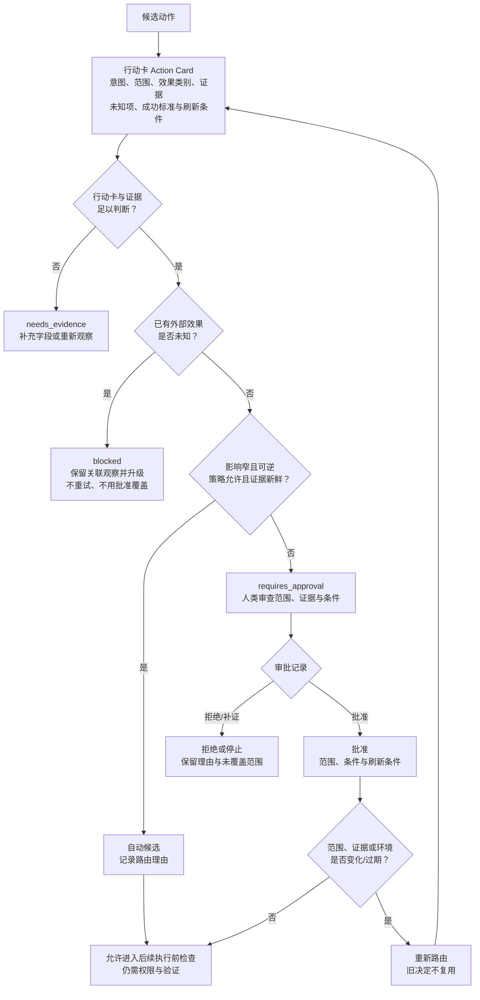

# 14. Human-in-the-loop：把人类参与设计成可审查的决策接口

> 人类在环（Human-in-the-loop，HITL）的价值不是在 Agent 旁边放一个“确认”按钮，而是在动作影响扩大之前，把意图、证据、责任和停止条件交给一个能作出判断的人。

## 本章目标

完成本章后，读者能够：

- 区分批准、复核、共同决策、接管和事后纠错，不把它们压缩成同一种“人工确认”。
- 为一个候选动作写出行动卡（Action Card），让范围、效果、证据、未知项和成功标准可审查。
- 用审批矩阵（Approval Matrix）把动作路由到自动候选、人工审批、补证、阻塞或升级，而不是依赖模型的自我置信描述。
- 把批准约束为一次具体行动、具体证据和具体条件，并在范围变化、证据过期或效果未知时重新判断。
- 解释为何批准不等于权限、执行、外部效果发生或结果验证通过。

## 为什么要学

“高风险操作请人工审批”听起来谨慎，却没有解决实现问题：谁看什么信息、同意的范围有多大、过多久失效、拒绝后如何恢复、系统是否已经做过部分动作？如果这些问题只存在于聊天记录或人的记忆中，任何接手者都无法判断旧决定能否复用。

以依赖漏洞修复为例。Agent 可以整理一个升级建议、推断受影响范围、生成测试计划，甚至提出一条发布命令。但“建议可以阅读”与“允许修改锁文件”“允许在隔离环境运行测试”“允许生产发布”是不同的决策。把它们合成一次模糊确认，会让人无法知道自己批准了什么，也让 Agent 容易把旧同意扩展到新的范围。

NIST AI RMF 1.0 把人类角色、责任和监督列为 AI 风险管理中的人机交互议题；其核心资源也列出定义、评估和记录人机配置/监督过程的结果项。[REF-048](14-human-in-the-loop.references.md#第-14-章候选参考资料human-in-the-loop) [REF-049](14-human-in-the-loop.references.md#第-14-章候选参考资料human-in-the-loop) 这些是自愿风险管理框架中的结果，不是“每个动作都要人工点一次”的处方。本章的工程目标更窄：把需要人类参与的决定做成可审查、可刷新、可交接的接口。

## 前置知识

- **前置章节：** 第 11 章说明 Tool 请求、结果与效果不确定性；第 12 章讨论环境、Sandbox 与权限；第 13 章说明知识来源、证据回链和新鲜度。
- **技术前提：** 能阅读 Markdown 表格、对象字段和简单流程图；不要求使用某个 Agent SDK 或审批产品。
- **不要求：** 本章不要求部署审批系统、身份提供商、消息队列、生产发布流程或法律合规工具。

> 注意：人工批准是决策边界，不是授权实现。即使人批准了某个候选动作，系统仍要经过第 12 章的环境与权限检查；动作完成后，仍要由第 17 章定义的验收规则判断结果。反过来，拥有权限的系统也不因此获得自动批准。

## 场景引入：一句“可以修吗”为什么不够

假设一个维护 Agent 读到一份已提供给它的漏洞报告，准备升级一个依赖。它向维护者发出消息：“发现高风险问题，可以修复吗？”维护者回答“可以”。第二天，另一个执行者根据这句回答修改了更多依赖、开始发布，并把测试日志中的一段成功文本写进报告。

这里的问题不在于维护者是否认真，而在于原请求没有给出可判断的对象：漏洞报告的证据是否仍新鲜、修改哪些版本、影响哪些服务、会不会写入、是否可回滚、测试计划是什么、发布是否包含在请求范围、旧同意是否可继续使用。后续执行者也无法知道“可以”是批准分析、测试还是发布。

本章用一个更小的教学接口替代这句自然语言：先提交行动卡，再按审批矩阵路由。人工看到的是被约束的候选；系统保存的是一个有范围和刷新条件的决定。这个接口仍可能被人误判，但至少能让误判、范围变化和证据缺失显式出现。

**成功标准：** 维护者能从行动卡指出自己批准的对象、条件和不覆盖范围；范围或证据变化时，系统要求重新路由，而不是复用旧文本。

**边界：** 本章案例不扫描真实漏洞库、不修改依赖、不运行测试、不创建工单、不发布软件，也不评估任何真实漏洞的严重程度。

## 核心概念

### 人类参与的五种方式

“人在环”至少可能表示五种不同动作。它们应有不同输入和不同可观察输出。

| 方式 | 人在判断什么 | 最小输入 | 输出 | 不能推出的结论 |
| --- | --- | --- | --- | --- |
| 批准（Approval） | 一个候选动作是否可在限定条件下进入下一步 | 行动卡、证据和策略 | 批准、拒绝或补证决定 | 系统已获得真实权限或已执行 |
| 复核（Review） | 证据、分析或验证结论是否足以接受 | 结论、原始证据和验收规则 | 接受、拒绝或修订意见 | 已批准后续写入动作 |
| 共同决策（Co-decision） | 多个可行方案应选择哪一个 | 备选项、取舍和约束 | 选择及理由 | 选择一定正确或能自动执行 |
| 接管（Takeover） | 自动路径是否应停止，由人继续处理 | 当前状态、风险、已知未知项 | 控制权转移和下一步 | 问题已解决 |
| 事后纠错（Feedback） | 已观察结果应怎样修订规则或知识 | 结果、偏差和影响范围 | 反馈记录或改进任务 | 未来相同情况必然避免 |

这五种分类是本书的工程模型。它的目的不是增设流程名词，而是避免“批准了测试计划”被解释为“复核了测试结果”，或“人接管了故障”被误写成“问题已修复”。

### 行动卡（Action Card）：把候选动作变成可判断的输入

行动卡记录待决定的候选，不记录已经发生的事实。一个最小行动卡可以包含：

| 字段 | 要回答的问题 | 示例性值 | 不能代表什么 |
| --- | --- | --- |
| `actionId` | 哪一个候选正在被讨论？ | `dependency-update-plan` | 身份、权限或真实任务 ID |
| 意图与范围 | 想改变什么、明确不改变什么？ | “准备升级候选，不发布” | 修改已经发生 |
| 效果类别 | 只读、可逆写入、不可逆写入或未知？ | “可逆写入候选” | 外部效果已验证 |
| 证据与新鲜度 | 依据哪些材料、何时需要重读？ | “报告摘要，需重新核验” | 材料正确、完整或仍有效 |
| 可逆性与替代方案 | 失败后能否回退，还有哪些路线？ | “先隔离验证，允许放弃” | 回滚一定成功 |
| 成功标准与未知项 | 如何判断下一步、什么仍未知？ | “测试计划通过审查；发布范围未知” | 结果已经接受 |

行动卡没有“模型置信度”这一单一放行字段。模型可以提供不确定性线索，但它不应替代影响范围、可逆性、证据新鲜度和策略约束。若行动卡缺少范围、效果类别、证据或成功标准，正确输出通常是补证，而不是把问题原样抛给审批者。

某个 SDK 能把批准绑定到具体 Tool 调用，并在敏感调用处中断、等待批准或拒绝后恢复；这是 OpenAI Agents SDK Python 的特定流程。[REF-050](14-human-in-the-loop.references.md#第-14-章候选参考资料human-in-the-loop) 本章借用“决定应关联具体候选”的思想，但行动卡的字段、存储和恢复规则都是本书模型，不是该 SDK 的 API。

### 审批矩阵（Approval Matrix）：先判断风险结构，再决定是否找人

人工节点是稀缺资源。过度弹窗会产生“橡皮图章”式审核；完全自动则会把不确定、不可逆或越权的动作藏在模型输出后面。本书建议把动作先路由到五个出口：

| 条件组合 | 本书建议的路由 | 必须留下什么 | 仍需什么 |
| --- | --- | --- | --- |
| 影响窄、只读或可逆、证据充分且策略允许 | 自动候选 | 行动卡与自动路由理由 | 环境/权限检查和结果验证 |
| 敏感、影响较大、不可逆，或策略明确要求 | `requires_approval` | 行动卡、风险理由和请求范围 | 人类决定及后续检查 |
| 行动卡字段或证据不足 | `needs_evidence` | 缺失字段与补证请求 | 新证据，不是猜测 |
| 之前的效果未知或状态互相矛盾 | `blocked` | 关联观察、未知项和停止理由 | 重新观察或人工接管 |
| 范围变化、批准过期或出现新风险 | 重新路由 / 升级 | 旧决定、变化摘要和新范围 | 新的适用决定 |

OpenAI 的工程指南把超过失败阈值，以及敏感、不可逆或高风险动作列为应考虑人工介入的两类触发器。[REF-051](14-human-in-the-loop.references.md#第-14-章候选参考资料human-in-the-loop) 这里的“触发器”是该指南的限定建议，不提供统一风险分数或默认重试次数。本书矩阵把它扩展为可审查字段，并明确任何自动候选都不是“无需控制”。

### 审批记录（Approval Record）：批准不是永久令牌

人工的决定需要与当时看到的行动卡绑定。否则“昨天同意了”会被错误解释成无限期、无限范围的授权。本书将审批记录定义为下列信息的组合：

- 行动卡的关联标识、意图摘要和明确范围；
- 决定类型：批准、拒绝、补证、接管或停止；
- 决策条件：证据版本、环境假设、可用回滚和成功标准；
- 刷新条件：范围扩大、效果类别改变、证据过期、策略变更、等待超时或新观察与旧证据冲突；
- 决定理由、未覆盖范围和下一步候选。

这不是身份验证、数字签名、权限令牌或不可抵赖审计设计。它只能让评审者回答“谁在什么证据和范围下作了什么决定”。NIST AI RMF 的在线核心资源将角色/责任以及人类监督过程的定义、评估和文档化列为其框架结果项。[REF-049](14-human-in-the-loop.references.md#第-14-章候选参考资料human-in-the-loop) 本书审批记录是对“可审查记录”的工程扩展，不声称 NIST 指定了这些字段。

> 风险：旧批准不是默认安全的。对象从“生成变更计划”变为“写入锁文件”，或证据从当日来源变为过期摘要，都会改变需要判断的对象；系统必须回到路由步骤。

### 暂停、拒绝、超时和效果未知：不会回复不是同意

等待人类决定是一种状态，不是一个可以跳过的异常。下面的表为本书教学模型；它不假定某个系统一定有队列、超时器或恢复 API。

| 状态或观察 | 保守动作 | 记录重点 | 不能解释为 |
| --- | --- | --- | --- |
| 正在等待决定 | 停在 `requires_approval` | 请求范围、当前证据和等待原因 | 已批准或已执行 |
| 明确拒绝 | 保留理由，停止或返回补证/替代方案 | 拒绝范围与下一步候选 | 人已经修复问题 |
| 等待超时 | 重新路由、提醒、接管或停止 | 超时条件和旧请求 | 默认批准 |
| 范围或证据变化 | 使旧决定失效，重新请求 | 变化摘要与旧记录 | 同类动作仍在旧范围内 |
| 外部效果未知 | 阻塞并重新观察或升级 | 关联尝试、最后观察和未知范围 | 可以安全重试，或批准能覆盖未知效果 |

OpenAI Agents SDK Python 文档说明，其 Human-in-the-loop 流程会在需要审批的敏感 Tool 调用处暂停，之后可对中断中的具体项批准或拒绝并恢复运行。[REF-050](14-human-in-the-loop.references.md#第-14-章候选参考资料human-in-the-loop) 这是该 SDK 的行为。本章不据此假定所有 Agent 都能暂停、持久化、恢复或自动处理超时。

## 架构图：从候选动作到人工决策的保守路由

下图回答：行动卡为何要先经过完整性、效果不确定性、影响/可逆性和证据检查，才能进入自动候选或人工审查？人工批准后又为何只能“允许进入后续执行前检查”，而不是直接等同于执行或验证？

Mermaid 源文件位于 [chapter-14-human-approval-routing.mmd](../../diagrams/mermaid/chapter-14-human-approval-routing.mmd)，已于 2026-07-16 使用 Mermaid CLI 11.16.0 导出并查看 [SVG](../../diagrams/exported/chapter-14-human-approval-routing.svg) 与 [PNG](../../diagrams/exported/chapter-14-human-approval-routing.png)。

图只表达本书的路由模型，不表示真实身份、权限、审批系统、Tool 调用、漏洞扫描、外部效果、发布动作或内容正确性。



图中的关键限制有三条：`blocked` 的出口不是再试一次，而是重新观察或升级；批准记录必须再过一次刷新条件检查；`Preflight` 只表示路由阶段允许下一步，环境与权限检查属于第 12 章，结果验证属于第 17 章。

## 工作流程：为一次候选动作设置人工节点

1. **形成行动卡：** 记录意图、范围、效果类别、证据、未知项、替代方案、成功标准和关联标识。缺少关键字段时输出 `needs_evidence`，不要请求空白批准。
2. **识别已知与未知效果：** 若先前尝试的写入、通知或发布是否发生仍未知，记录关联观察并进入 `blocked`；批准不能改变历史效果的不确定性。
3. **根据审批矩阵路由：** 以影响、可逆性、证据新鲜度、策略、失败历史和不确定性决定自动候选、人工审批、补证、阻塞或升级。
4. **记录人类决定：** 批准或拒绝必须关联行动卡的范围、证据和条件；人要求补证时，记录缺口而不是猜测其意图。
5. **检查刷新条件：** 生产系统可以将范围、证据、环境、效果类别或等待时间的变化定义为旧记录失效条件，随后回到行动卡和矩阵。本章纯内存示例只建模范围和证据状态两个刷新信号；其余信号属于后续扩展。
6. **进入后续控制：** 批准后才允许进入环境/权限前检查；动作完成后独立重新观察并按验收规则验证，不能从批准推导成功。

## 最小示例：纯内存审批路由

完整实现位于 [human-approval-routing.mjs](../../examples/agent/human-approval-routing.mjs)，计划说明位于 [14-human-in-the-loop.example-plan.md](14-human-in-the-loop.example-plan.md)。`assessHumanApprovalRoute` 只读取注入的行动卡、策略、审批快照和观察结果：

```js
const decision = assessHumanApprovalRoute({
  action: {
    id: 'dependency-update-plan',
    scope: 'prepare-isolated-change',
    effect: 'reversible_write',
    evidence: { status: 'fresh' },
    successCriteria: 'reviewed-test-plan',
  },
  policy: {
    allowsAutoFor: ['read_only', 'reversible_write'],
    requiresApprovalFor: ['irreversible_write', 'sensitive_write'],
  },
  approval: null,
  observation: { effectStatus: 'not_started' },
});
```

这个最小输入返回 `allowed` / `auto_candidate`。函数还可能返回 `requires_approval`、`needs_evidence`、`rejected` 或 `blocked`，只代表教学对象上的路由判断。它不访问网络、真实审批系统、密钥、文件、时钟、身份、环境、Tool 或外部系统，也不产生依赖修改或发布。

**实际验证命令：**

```bash
node --test examples/agent/human-approval-routing.test.mjs
node examples/agent/human-approval-routing.mjs
```

2026-07-16 已实际运行：10 项 Node 内置测试全部通过、0 项失败；演示输出 `allowed` / `auto_candidate`。红绿过程与完整输出边界记录在[示例整合审查](../../.memory/reviews/2026-07-16-chapter-14-example-integration.md)。这些结果不证明真实审批、权限、发布、Tool 或外部效果。

## 逐步增强：从判断函数到真实系统前的约束

1. **结构化决定：** 最小函数只给出路由状态和代码；当需要向人解释决定时，增加“缺什么证据”和“哪些刷新条件会失效”的结构化字段。
2. **版本化行动卡：** 当相同任务会跨会话或跨团队交接时，为行动摘要、证据集和策略附带版本引用；范围变化必须新建或重新评审记录。
3. **环境前检查：** 只有确实接入受控执行环境时，才由第 12 章的权限与 Sandbox 机制验证环境、主体和实际许可。不要用审批记录替代这些检查。
4. **独立验收：** 对外部效果，按第 17 章重新观察并验证成功标准。只有在“自动路由”经常被错误放行时，才调整矩阵、策略或证据要求；不要只增加更多确认框。

## 完整工程案例：依赖漏洞修复建议与人工发布门

**背景：** 一个维护 Agent 接到已提供的漏洞报告后，需要帮助团队准备修复建议。团队希望缩短分析时间，但不希望未经审查地修改依赖或发布软件。

**约束：** 案例中的报告、依赖、版本、命令、测试和发布均为抽象教学对象。Agent 只能形成行动卡；它不能读取真实仓库、查询漏洞库、修改锁文件、执行命令、创建拉取请求或部署服务。

**设计选择：**

| 阶段 | Agent 可做的教学动作 | 人类节点 | 不能宣称的结果 |
| --- | --- | --- | --- |
| 分析 | 组织受影响范围、未知项和候选方案 | 复核证据是否足以提出方案 | 漏洞已被独立证实 |
| 准备 | 形成“在隔离环境准备变更”的行动卡 | 批准范围窄、可回滚的准备工作 | 依赖已被修改或测试已运行 |
| 扩大范围 | 候选从准备变为发布，或影响对象增加 | 重新路由；旧批准不复用 | 发布已获批准 |
| 执行后 | 提交待验证观察 | 复核验收结论或接管异常 | 修复一定生效 |

**关键决策：** 发布不与准备变更共享同一审批记录。因为效果类别、回滚条件、影响范围和所需证据已经变化。即使两者都和“修复漏洞”有关，也必须重新形成行动卡。

**失败处理：** 如果行动卡缺少证据时间，进入 `needs_evidence`；如果有先前写入但不能确定是否发生，进入 `blocked`；如果人拒绝，保存拒绝范围和下一步候选；如果人没有回复，保持等待或升级，不默认放行。

**结果与证据：** 本章只交付行动卡、矩阵、审批记录样式、路由图和纯内存判断函数。它们证明“信息可以被审查”，不证明真实漏洞修复、发布或风险已被消除。

## 实现说明

| 决策 | 本章选择 | 原因 | 替代方案与边界 |
| --- | --- | --- | --- |
| 审批输入 | 使用行动卡而非自然语言确认 | 让范围、效果和证据可检查 | UI 表单可以承载行动卡，但 UI 不是本章必需品 |
| 低风险路径 | 返回“自动候选”而非“自动执行” | 保留权限与验证两道独立边界 | 真实自动执行需第 12 章控制环境与权限 |
| 效果未知 | 优先阻塞和重新观察 | 避免重复副作用 | 真实恢复策略属于第 18 章，不能用本章函数替代 |
| 决定复用 | 当前示例检查范围和证据状态 | 防止旧批准扩大适用范围或沿用过期证据 | 环境、时间和影响类型等刷新信号，以及真实身份、签名和审计需要额外系统设计 |

OpenAI Agents SDK Python 在 Human-in-the-loop 文档中描述了其敏感 Tool 调用的中断、批准/拒绝和恢复流程。[REF-050](14-human-in-the-loop.references.md#第-14-章候选参考资料human-in-the-loop) 如果项目采用该 SDK，应在实施当天重新核验其具体接口、支持的 Tool 类型、状态序列化和安全边界；本章的函数不模仿或依赖该 SDK。

## 测试与验证

| 层级 | 验证对象 | 命令或方法 | 成功标准 | 实际状态 |
| --- | --- | --- | --- | --- |
| 红灯 | 缺失示例模块 | `node --test examples/agent/human-approval-routing.test.mjs` | 因目标模块不存在而报 `ERR_MODULE_NOT_FOUND` | 已实际执行，作为实现前证据 |
| 单元 | 纯内存路由 | `node --test examples/agent/human-approval-routing.test.mjs` | 10 项测试通过、0 项失败 | 已实际执行 |
| 演示 | 低影响自动候选 | `node examples/agent/human-approval-routing.mjs` | 输出 `allowed` / `auto_candidate` | 已实际执行 |
| 图示 | Mermaid 路由图 | Mermaid CLI 导出 SVG/PNG 并查看 PNG | 节点、箭头、阻塞和刷新路径可读 | 已实际执行 |
| 仓库总校验 | 全部 Markdown、链接和全局示例 | 主线程统一运行 `npm run validate` | 以主线程实际输出为准 | 本子任务未运行，避免并发冲突 |

专用测试只覆盖纯函数的输入分类；没有浏览器或真实 UI，因此不存在本章的前端端到端测试。没有任何测试证明真实人类判断、身份、权限、审批后端、漏洞处理、Tool 调用或发布行为。

## 工程实践

- **把决策理由和决定分开记录：** `approved` 不是理由；应同时保留批准时的范围、依据和刷新条件，便于后续审查或重新路由。
- **把审批队列视为状态机边界：** 等待、拒绝、补证、超时和接管均要有可观察出口。不要把“没有响应”吞掉后继续执行。
- **在进入人类节点前先压缩信息，不压缩证据：** 行动卡可用摘要帮助阅读，但必须能回到证据来源和未知项；摘要不替代证据。
- **先校验环境，再使用批准：** 同一个批准在不同环境、不同对象或不同范围下未必适用。实际执行前应重新检查环境、权限和策略。

## 最佳实践

- 将批准绑定到可比较的范围，而不是“完成这个任务”之类宽泛句子。
- 对不可逆、敏感、范围大、证据弱或失败模式不明的动作，默认选择人工审查或补证。
- 让拒绝可操作：记录拒绝的是范围、证据、时机还是动作本身，并给出下一步候选；不要把拒绝隐藏为一般错误。
- 为每个可复用决定列出刷新条件。触发刷新时，重新请求决策而不是尝试用旧记录解释新动作。

## 常见错误

| 错误 | 表现 | 根因 | 修复方向 |
| --- | --- | --- | --- |
| 把批准当作权限 | 人同意后系统在任意环境执行 | 决策边界和执行授权混在一起 | 批准后仍做环境、主体和权限前检查 |
| 使用模糊请求 | 审批者不知道影响对象或后果 | 没有行动卡或字段缺失 | 补齐范围、效果、证据、未知项和成功标准 |
| 默认同意 | 人未回复，系统继续 | 超时被误当作批准 | 保持等待、升级或停止，并记录超时 |
| 复用旧批准 | 范围扩大或证据变化仍继续 | 缺少刷新条件 | 记录变化并重新路由 |
| 用批准覆盖未知效果 | 上次写入是否发生不明仍再次执行 | 将未来决策误用于历史事实 | 先重新观察，必要时阻塞或接管 |
| 把复核当结果 | 人看过一段日志就宣称修复成功 | 没有独立验收规则 | 由第 17 章定义可观察成功标准 |

## 安全与边界

- **权限边界：** 审批记录不授予凭证、文件权限、Shell 权限、发布权限或 API 访问；实际执行须经过环境和权限控制。
- **数据边界：** 行动卡可能含业务对象、证据摘要或风险信息。真实系统应最小化展示和保存范围，并由项目的隐私与审计规则处理；本章不提供此类控制实现。
- **人工审批点：** 高影响、不可逆、敏感、范围扩大、证据不足、策略要求或外部效果未知的动作，都不应仅因模型自称有把握而放行。
- **法规边界：** Regulation (EU) 2024/1689 的第 14 条处于其适用范围内的法规语境。[REF-052](14-human-in-the-loop.references.md#第-14-章候选参考资料human-in-the-loop) 本章不构成法律意见，也不判断具体系统是否适用该条款。
- **不适用范围：** 紧急安全响应、法律要求的人工监督、行业审批职责和生产变更流程可能需要更严格或不同的制度设计，不能仅使用本章矩阵代替。

## 章节总结

Human-in-the-loop 不是减少自动化的口号，而是把“何时由人作出什么决定”设计成可检查接口。行动卡让候选动作可读；审批矩阵让路由依据可见；审批记录和刷新条件阻止旧决定悄悄扩大；阻塞、拒绝和效果未知路径则避免系统把沉默或不确定性写成成功。

批准最多说明一个人在特定范围与条件下允许候选进入后续检查。它不提供真实权限、不替代执行、不解释历史效果，也不接受最终结果。下一章将讨论 Observation 与状态感知：当系统说“需要补证”或“效果未知”时，应怎样形成可关联的观察，而不是继续依赖文本猜测。

## 练习

1. 为“向外部客户发送变更通知”设计一张行动卡。列出至少三个刷新条件，并说明为什么“内容相同”不足以复用旧批准。
2. 将“删除一个临时文件”“批量改写 10,000 条记录”“重新读取公开文档”分别路由到自动候选、人工审批、补证或阻塞。写出你的影响、可逆性和证据依据。
3. 设计一个拒绝记录，使接手者能分辨“拒绝动作本身”“拒绝当前证据”和“拒绝当前时间窗口”。
4. 解释为什么一次人工批准不能证明外部 Tool 已执行成功，并写出至少一种独立验证方法。

## 延伸阅读

- [NIST AI RMF 1.0](https://nvlpubs.nist.gov/nistpubs/ai/NIST.AI.100-1.pdf)：人机交互、角色和监督的风险管理背景；访问于 2026-07-16。
- [NIST AI RMF Core](https://airc.nist.gov/airmf-resources/airmf/5-sec-core/)：Govern/Map 中与角色、责任、监督过程相关的框架结果项；访问于 2026-07-16。
- [OpenAI Agents SDK: Human-in-the-loop](https://openai.github.io/openai-agents-python/human_in_the_loop/)：Python SDK 的中断、决定和恢复机制；动态页面，后续使用时应重新核验。
- [OpenAI: A practical guide to building agents](https://openai.com/business/guides-and-resources/a-practical-guide-to-building-ai-agents/)：失败阈值与高风险动作的人类介入建议；动态页面，后续使用时应重新核验。

## 参考资料

- [REF-048 至 REF-052：第 14 章来源映射与限定范围](14-human-in-the-loop.references.md)。

## 章节完成检查表

- [x] Front matter、目标、前置知识、章节依赖和相邻章节边界完整。
- [x] 内容以原创场景和工程模型组织，来源观点、本书扩展与教学案例已区分。
- [x] 可归因陈述已链接到可追溯的局部资料；法规和动态产品内容未被外推。
- [x] Mermaid 图有源码、读图说明、一致术语和导出资源。
- [x] 示例有路径、环境、直接验证命令、实际结果和安全边界。
- [x] 技术、图示、事实、语言和最终审查记录均已创建。
- [ ] 主线程尚未将本章局部资料合并到 `.ai/references.md`、`docs/SUMMARY.md`、`.ai/progress.md`、`.context/*` 或仓库总校验；本子任务遵守并发写入隔离，不能把这些项目标为完成。
