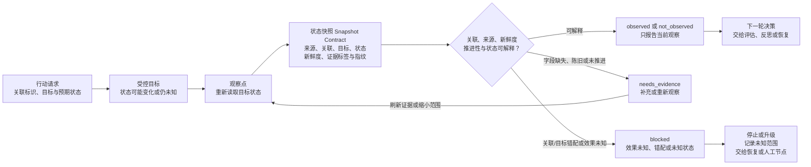

# 15. Observation 与状态感知

> Agent 不能只根据“我已经点击”“工具返回成功”或一段日志文本决定下一步；它需要把目标重新观察成可关联、可解释且有边界的状态信号。

## 本章目标

- 区分动作请求、动作层返回、状态观察、评估接受和业务完成这几类不同事实。
- 为一个行动设计最小观察记录（Observation Record）与状态快照（State Snapshot）契约。
- 用关联、来源、新鲜度、推进性与可解释状态审查一次观察能否支持下一步决策。
- 在 UI 自动化场景中把“点击”与“重新观察目标状态”拆开，不用动作返回代替结果。
- 在效果未知、信号陈旧、目标错配或状态无法解释时，保留不确定性并把问题交给后续章节。

## 为什么要学

一次调用没有抛出异常，最多说明调用路径在它能观察到的范围内没有报告错误。它不说明目标对象已经改变，更不说明改变满足任务要求。把这几层混在一起，会使 Agent 在错误页面、过期缓存、重复任务或未知副作用之后继续推进，最终留下“看起来完成”的记录。

观察是智能闭环的输入，而不是附属日志。第 10 章的工作流需要状态来恢复；第 16 章的反思需要轨迹；第 17 章的评估需要证据；第 18 章的恢复需要知道什么尚未发生、什么已经发生但无法确认。本章只解决其中较小的一步：让下一轮决策拿到可审查的观察，而不是替这些章节宣布结果已经接受。

## 前置知识

- **前置章节：** 建议先阅读第 07 章的记忆边界、第 10 章的状态管理、第 11 章的工具请求与结果关联、第 12 章的环境权限，以及第 14 章的人类审批。
- **技术前提：** 能阅读 JavaScript 对象、Markdown 表格和 Mermaid 流程图；不要求安装监控平台或浏览器自动化工具。
- **不要求：** 本章不要求部署 OpenTelemetry、使用 W3C Trace Context、运行 Playwright、编写真实 UI 测试或连接任何外部系统。

> 注意：观察不是验收。即使一个快照显示了预期状态，也仍需要第 17 章按照任务成功标准判断结果是否可接受；反过来，评估也不能跳过它所依赖的真实观察。

## 场景引入：点击“提交”之后究竟知道什么

假设一个 UI 测试 Agent 想提交表单。它找到按钮、发出点击动作，调用层没有报错，于是写下“表单提交成功”。下一步它开始检查下游数据，结果发现页面仍停在编辑状态，或显示的是前一次提交留下的提示。

问题不一定在按钮、浏览器或模型。问题是记录把四件事揉成了一件：动作被请求、动作满足执行前条件、页面状态被重新读取、业务提交被接受。为了让下一位执行者能区分它们，本章要求行动和快照至少共享关联标识、目标和预期状态；快照还要说明来源、观察时刻、新鲜度、证据标签与可比较指纹。

**成功标准：** 点击后只有拿到关联正确、目标正确、新鲜且可解释的状态快照，Agent 才能报告“已观察到预期状态”；看到 `pending`、未知效果或缺少证据时，输出必须保留相应缺口。

**边界：** 案例中的页面、按钮、状态和数据都是教学对象。本章不启动浏览器、不发真实点击、不读取 DOM、截图、网络响应或数据库，也不声称任何表单已经提交。

## 核心概念

### 动作返回、状态观察与评估接受不是同一个信号

下表刻意把常被混用的句子拆开。每一行都能为下一步提供信息，但支持的结论不同。

| 信号 | 它回答的问题 | 典型来源 | 不能据此推出 |
| --- | --- | --- | --- |
| 动作请求 | 系统试图对哪个目标做什么？ | Plan、Tool 请求、浏览器指令 | 动作已执行或目标已改变。 |
| 动作层返回 | 调用层是否返回值或错误？ | Tool 返回、浏览器操作返回 | 业务状态已达到目标。 |
| 观察事件 | 某个观察点何时记录了什么？ | 日志、测试断言、回读、探针 | 现在仍保持该状态。 |
| 状态快照 | 此刻对一个目标看到什么？ | 受控读取、页面状态区域、查询结果 | 该状态由刚才行动造成，或已满足验收。 |
| 评估接受 | 证据是否满足任务标准？ | 第 17 章的评估器与验收规则 | 未来不会漂移，或风险已经消失。 |

OpenTelemetry 的官方 Signals 页面把追踪（traces）、指标（metrics）、日志（logs）、随附上下文（baggage）和性能剖析（profiles）列作不同信号类别。[REF-053](15-observation-and-state-awareness.references.md) 这不要求每个 Harness 采集全部类别，但提醒我们：不要把一条日志当作轨迹、当前状态、趋势指标和最终验收的通用替身。

### 观察记录（Observation Record）：把“看到了什么”绑定到对象

本书建议，把能够改变控制流的一次观察写成观察记录。它不是监控平台的表结构，而是一组可审查问题：

| 字段 | 要回答的问题 | 示例性值 | 不能代表什么 |
| --- | --- | --- |
| `correlationId` | 它关联哪次行动或工作流？ | `ui-click-1` | 用户身份、权限或真实追踪协议。 |
| `target` | 观察的是哪一个目标？ | `submit-status` | 整个页面或业务流程都正确。 |
| `source` | 信息从哪里来？ | `ui_state_assertion` | 来源一定可靠、完整或无偏。 |
| `observedAt` | 何时或在哪个流程步骤观察？ | `step-2` | 可与真实时钟或服务端时间互换。 |
| `state` | 此次读取到什么状态？ | `submitted` | 根因、因果关系或最终接受。 |
| `evidenceStatus` | 这是观察、推测还是缺口？ | `observed` | 证据已满足所有质量门。 |
| `freshness` | 它是否仍适用于当前决定？ | `fresh` | 固定 TTL 或跨系统时间正确性。 |
| `fingerprint` | 它与前一快照有什么可比较的差异？ | `status-submitted` | 内容真实、完整或不可伪造。 |

字段本身不会制造可信度。若一个快照来自模型摘要，`source` 必须如实标注；若无法确定外部写入是否发生，不能把 `state` 填成成功，而应保留 `effectStatus: unknown`。这些字段帮助后来者问对问题，不替代回读、权限、审批或验收。

### 关联、目标与来源：避免把别人的状态接到这次行动上

关联标识（Correlation ID）把一次行动、一次观察和后续解释连在一起。W3C Trace Context 提供了跨服务传播追踪上下文的标准 HTTP 头和值格式；其中 `traceparent` 用可移植格式描述请求在追踪图中的位置。[REF-054](15-observation-and-state-awareness.references.md) 这是分布式追踪的具体规范，不是本章 `correlationId` 的实现要求。

本书从这个实例得到的工程结论更小：若快照不能关联到当前行动，或它观察的是另一个目标，那么它不能作为本次行动的确认。正确动作是阻塞并重新定位观察对象，而不是通过文字相似度猜测它们“应该有关”。关联标识同样不能承载密钥、个人信息或权限断言；传播和存储它们仍需数据最小化与安全审查。

### 新鲜度与推进性：新读取不等于新证据

新鲜度（Freshness）回答“这份证据是否仍可用于当前决定”。推进性（Advancement）回答“行动之后是否真的获得不同的可解释观察”。两者需要同时检查：

- 一份一分钟前的快照可能仍新鲜，但如果它恰好是在本次行动之前读取的，就不能确认这次行动的效果。
- 一份刚复制进记录的旧日志可能有新的写入时间，但其状态指纹没有变化，仍不能构成行动后的观察。
- 一份状态已变化的快照若来自错误目标或无法关联，也不能替代当前目标的证据。
- 只有前后快照都属于同一 `correlationId` 和同一 `target` 时，相同指纹才说明该观察对象没有推进；另一个行动或目标的同名指纹不参与本次推进判断。

本书不为所有任务规定 TTL、时间戳格式或指纹算法。对发布动作，证据可能需要来自受控系统回读；对 UI 状态，可能需要匹配状态区域；对长任务，可能需要阶段检查点。规则应写进任务和环境契约，而不是藏在模型的直觉中。

### 事件、日志、快照、指标与轨迹：让每种信号只回答自己的问题

| 信号类型 | 适合回答 | 不适合单独回答 | 设计提醒 |
| --- | --- | --- | --- |
| 事件 | 某一步是否记录发生 | 当前状态是否仍成立 | 事件要有对象、来源和关联。 |
| 日志 | 局部上下文、错误文本、诊断线索 | 操作一定成功或目标已达成 | 日志可能缺失、重复、延迟或不可信。 |
| 状态快照 | 当前读取到的对象状态 | 状态为何变化、是否满足业务定义 | 需要目标、时间/步骤、来源与新鲜度。 |
| 指标 | 趋势、分布、异常比例 | 某个个体请求的完成证据 | 聚合后可能丢失个体上下文。 |
| 轨迹 | 多个关联步骤的路径 | 每个步骤的真实业务语义 | 关联不是授权，也不是完整审计。 |

这张表是本书的观察点设计模型。真正系统可以用不同的字段、采集器和存储方式；关键是让每一类信号的证明能力与限制在控制流中显式出现。

### UI 场景中的动作前检查与动作后观察

Playwright 当前文档说明，`locator.click()` 等动作会先检查目标元素是否唯一、可见、稳定、接收事件且启用；未能在超时内满足条件会失败。[REF-055](15-observation-and-state-awareness.references.md) 这类 actionability 检查解决“点击是否有机会按预期发出”，不能证明页面已经显示业务成功。

Playwright 的 web-first 异步断言会重复获取元素并检查条件，直到满足或断言超时。[REF-056](15-observation-and-state-awareness.references.md) 本书借此说明，观察可由有上限的条件轮询组成，而不应依赖任意 `sleep`。不过默认超时、断言 API 与其执行语义都属于该产品；本章不采用其默认值，也不运行任何浏览器测试。

## 架构图：行动、重新观察与下一轮决策

下图回答：为什么行动请求必须经过受控目标和观察点，才会产生能被决策器解释的快照？为什么效果未知、字段缺失或快照错配不能直接进入下一步？

Mermaid 源位于 [chapter-15-observation-feedback-loop.mmd](../../diagrams/mermaid/chapter-15-observation-feedback-loop.mmd)，已导出为 [SVG](../../diagrams/exported/chapter-15-observation-feedback-loop.svg) 与 [PNG](../../diagrams/exported/chapter-15-observation-feedback-loop.png)。图只表达本书的教学反馈回路，不表示真实浏览器、日志平台、追踪系统、权限、审批、外部效果、验收或自动重试。



图中有三条限制。第一，`Action` 到 `Target` 只表示候选行为被提出，不表示动作已经生效。第二，`observed` 与 `not_observed` 都只是当前读数，不能代替第 17 章的验收。第三，字段缺失、陈旧或同一观察对象未推进时，`needs_evidence` 可以在刷新证据或缩小范围后回到观察点；效果未知、关联/目标错配和未识别状态则进入 `blocked → 停止或升级`。是否在有明确恢复策略后重新观察，属于第 18 章或人工节点的决定，不是图中的自动回路。

## 工作流程：把一次行动变成可解释的观察

1. **定义观察目标：** 为行动写下关联标识、目标、预期状态和不覆盖范围。目标不能只写“页面成功”或“任务完成”。
2. **选择观察点：** 指定要重新读取的对象和来源，例如一个状态区域、受控回读接口或阶段检查点；同时声明哪些来源只是诊断线索。
3. **收集状态快照：** 记录来源、观察步骤、目标、状态、证据标签、新鲜度和指纹。缺字段时不要补写想象出来的信息。
4. **检查关联与目标：** 快照必须对应当前行动和目标。错配时阻塞，因为另一个任务的成功不证明本次任务成功。
5. **检查证据质量：** 推测性、陈旧或未推进的快照进入 `needs_evidence`。这不是失败结论，而是补充或重新观察请求。
6. **保留未知效果：** 若外部效果是否发生仍未知，输出 `blocked`、记录未知范围并停止或升级。第 18 章才讨论是否存在明确的安全恢复路径；不能把本章的 `blocked` 自动连回重新观察或重试。
7. **交给下一层：** 匹配或未匹配的已知状态成为第 16、17、18 章的输入；本章不决定反思结论、质量接受或重试。

## 最小示例：纯内存状态快照判断

完整实现位于 [observation-snapshot-assessment.mjs](../../examples/agent/observation-snapshot-assessment.mjs)，测试位于 [observation-snapshot-assessment.test.mjs](../../examples/agent/observation-snapshot-assessment.test.mjs)，设计与红绿记录位于 [第 15 章示例计划](15-observation-and-state-awareness.example-plan.md)。

```js
const decision = assessObservationSnapshot({
  action: {
    correlationId: 'ui-click-1',
    target: 'submit-status',
    expectedState: 'submitted',
  },
  observationContract: {
    version: 'chapter-15-v1',
    requiredFields: [
      'observedAt',
      'source',
      'correlationId',
      'target',
      'state',
      'evidenceStatus',
      'freshness',
      'fingerprint',
    ],
    knownStates: ['submitted', 'pending', 'error'],
  },
  snapshot: {
    observedAt: 'step-2',
    source: 'ui_state_assertion',
    correlationId: 'ui-click-1',
    target: 'submit-status',
    state: 'submitted',
    evidenceStatus: 'observed',
    freshness: 'fresh',
    fingerprint: 'status-submitted',
  },
});
```

该输入返回 `observed` / `expected_state_observed`。函数还可能返回 `not_observed`、`needs_evidence` 或 `blocked`，只表示注入教学对象的判断。它不访问真实 UI、浏览器、网络、文件、日志、追踪、数据库、模型、Tool、时钟、凭证、权限或外部系统，也不点击、等待、重试、写入、回读或验证真实业务结果。

**实际验证命令：**

```bash
node --test examples/agent/observation-snapshot-assessment.test.mjs
node examples/agent/observation-snapshot-assessment.mjs
```

2026-07-16 已实际执行：交叉审查补齐跨行动与跨目标同指纹两个边界后，共 12 项 Node 内置测试通过、0 项失败；演示输出 `observed` / `expected_state_observed` / `ui-click-demo` / `submit-status`。详细边界见 [事实核验](15-observation-and-state-awareness.fact-check.md)。这些结果不证明真实页面点击、状态变化、断言、网络、外部效果或任务完成。

## 逐步增强：只在需要时加入真实复杂度

1. **先增加结构化缺口：** 如果审批者或下一位 Agent 需要知道为何观察不可用，就让 `needs_evidence` 带回缺字段、陈旧原因或未推进条件，而不是增加更多自然语言日志。
2. **再接入受控观察器：** 只有实际需要 UI 或服务回读时，才把第 25 章的浏览器验证或受控 Tool 接到观察点。必须记录具体环境、权限、超时、动作和重新观察结果。
3. **最后接入评估与恢复：** 只有任务有明确成功标准时，才把 `observed` 交给第 17 章评估；只有产生可恢复失败时，才由第 18 章为 `blocked`、`needs_evidence` 或 `not_observed` 定义策略。

## 完整工程案例：提交状态的受限 UI 测试 Agent

**背景：** 团队希望一个 Agent 协助验证“提交”路径。它需要避免把“脚本发送了点击”误写成“用户数据已提交”。

**约束：** 本案例不包含真实网站、DOM、用户、浏览器、截图、网络请求、测试运行或后端数据。行动、状态区域和快照都是教学对象；系统也没有权限、审批或恢复实现。

| 阶段 | 教学动作 | 需要的观察 | 不能宣称 |
| --- | --- | --- | --- |
| 准备 | 定义 `submit-status` 为目标，预期为 `submitted` | 行动卡与观察契约 | 页面或表单存在。 |
| 请求 | 记录 `ui-click-1` 提出点击 | 动作请求关联 | 点击已经被浏览器接收。 |
| 重新观察 | 读取目标状态并形成快照 | 关联、来源、新鲜度、指纹 | 业务已经持久化。 |
| 解释 | `submitted` 返回 `observed`；`pending` 返回 `not_observed` | 已知状态集合 | `pending` 的根因或应重试。 |
| 异常 | 效果未知或目标错配返回 `blocked` | 缺口和关联信息 | 安全重试或问题已修复。 |

**关键设计：** 状态区域必须是行动前就定义的观察目标，而不是动作后从页面任意文本中挑选一句积极的话。这样，快照可被关联、复审和比较；也能避免另一个测试或历史提示被误接到当前行动。

**结果与证据：** 本章交付观察契约、快照字段、反馈图和纯内存判断函数。它们证明“教学输入能够被保守分类”，不证明真实表单、浏览器、后端、权限、数据持久化或用户体验。

## 实现说明

`assessObservationSnapshot` 的判断顺序刻意从可验证的结构缺口开始：先检查必填字段，再检查关联和目标，再看证据标签、新鲜度、未知效果、推进性与状态集合。推进性比较只在 `previousSnapshot` 与当前快照的 `correlationId`、`target` 都相同时才成立；它没有读取真实时钟，因此 `freshness` 是调用方注入的结果。这能避免在没有环境契约时虚构统一 TTL，也避免把另一个对象的相同指纹错误接到当前行动。

| 决策 | 选择 | 原因 | 替代方案与边界 |
| --- | --- | --- | --- |
| 观察新鲜度 | 注入 `freshness` | 让真实策略留在任务/环境层，而非函数猜测时间 | 真实系统可记录时间、版本或 TTL，但需验证时钟与缓存边界。 |
| 行动后确认 | 只比较同一关联与目标的 `fingerprint` | 避免复用未推进的旧快照或串接其他对象 | 指纹不是内容真实性证明；真实 UI 需重新读取受控目标。 |
| 未知效果 | 保守 `blocked → 停止或升级` | 不以超时、断开或模型文本推断外部未发生 | 只有第 18 章定义明确恢复策略后，才可能重新观察、回滚或接管。 |
| 未匹配状态 | `not_observed` 而非 `failed` | 记录事实，不伪造根因 | 第 16、17 章可进一步分析与评估。 |

## 测试与验证

| 层级 | 验证对象 | 命令或方法 | 成功标准 | 实际状态 |
| --- | --- | --- | --- | --- |
| 单元 | 纯内存快照判断 | `node --test examples/agent/observation-snapshot-assessment.test.mjs` | 12 条独立状态路径均符合教学契约 | 2026-07-16 已执行：12 通过、0 失败。 |
| 演示 | 允许的教学输入 | `node examples/agent/observation-snapshot-assessment.mjs` | 输出匹配的观察判断 | 2026-07-16 已执行：退出码 0，输出 `observed`。 |
| 图示 | Mermaid 源与导出图 | Mermaid CLI 导出及 PNG 视觉检查 | 源、正文图块、SVG/PNG 术语一致 | 见 [图示审查](../../.memory/reviews/2026-07-16-chapter-15-diagram-review.md)。 |
| 端到端 | 真实 UI 点击与重新快照 | 第 25 章的浏览器自动化流程 | 点击后重新观察到期望 UI 状态 | 本章未执行；纯内存示例不能替代。 |

## 工程实践

- 先写“观察什么、从哪里看、怎样关联、何时过期”，再写日志格式或监控集成。没有观察对象的日志通常无法支持自动决策。
- 让每一次状态判断保留来源与限定范围。人工摘要、模型输出、工具回读和独立测试断言可以共存，但不能被标成同一种证据。
- 用条件驱动的重新观察替代任意等待。等待的条件、超时、对象和失败出口都应可审查；等待本身不是状态变化。
- 当观察数据跨系统传播时，单独审查关联信息、敏感字段、存储与访问路径。关联能够帮助诊断，也可能扩大数据暴露面。

## 最佳实践

- **把预期状态写进行动。** 因为没有目标状态，任何正面文本都可能被错误解释成成功。
- **把快照的来源写进证据。** 因为同样的 `submitted` 字符串可能来自 UI、缓存、日志或模型推测，证明能力不同。
- **把旧快照与新行动分开。** 因为只有行动后的关联观察才能成为该行动的确认候选。
- **让未知效果阻塞。** 因为“无法确认是否发生”既不等于安全重试，也不等于未发生。
- **把观察与评估分层。** 因为读到状态只是输入，第 17 章才回答它是否满足任务成功标准。

## 常见错误

| 错误 | 表现 | 根因 | 修复方向 |
| --- | --- | --- | --- |
| 用点击返回代替状态 | 动作无报错就报告提交成功 | 没有行动后的观察点 | 定义目标状态，点击后重新读取。 |
| 复用历史提示 | 旧成功文本被当成本次证据 | 缺少关联或推进性检查 | 绑定 `correlationId`，比较行动后的新快照。 |
| 把模型摘要当观察 | 摘要被写成 `observed` | 来源与证据标签混淆 | 标记为推测，要求独立回读。 |
| 用固定 sleep 等页面 | 偶尔通过，偶尔读到旧状态 | 等待没有明确条件 | 等待或轮询目标状态，并设置边界与失败出口。 |
| 把未知效果立即重试 | 可能重复写入或覆盖状态 | 超时被误解为未发生 | 保持 `blocked`，停止或升级；只有明确恢复策略才重新观察。 |
| 在关联字段放敏感信息 | 日志/追踪传播扩大暴露 | 将关联视为无害元数据 | 使用无业务含义的标识，审查存储和传播。 |

## 安全与边界

- **权限边界：** 观察到状态不授予下一步读写权限；真实环境仍须通过第 12 章的权限与 Sandbox 检查。
- **数据边界：** 快照应收集最少必要字段，避免把令牌、Cookie、个人数据、完整页面内容或密钥混入关联字段、日志和图示。
- **人工审批点：** 高风险、不可逆或影响范围变化的行动仍需第 14 章的审批路由；快照不能取代人类决定。
- **不适用范围：** 本章不规定生产监控架构、采样、SLO、日志保留、告警规则、浏览器兼容性、法律合规或外部效果验证。

## 章节总结

观察把 Agent 的“做过什么”转化为可供下一轮判断的输入，但前提是它关联正确、来源明确、足够新鲜、相对行动有所推进且能被当前任务解释。一次 `observed` 只是“看到了预期状态”；一次 `not_observed` 是“看到了不同状态”；`needs_evidence` 和 `blocked` 则保护系统不在缺口上继续推理。

下一章会使用这些观察和轨迹做反思（Reflection）：不是把任何异常都写成经验，而是提出可验证的根因假设与改进候选。第 17 章再为这些信号定义可执行的结果评估。

## 练习

1. 为“创建拉取请求”设计一个 Observation Record：哪些字段可以证明请求已被重新读取，哪些字段仍不足以证明 CI、审查或合并已经完成？
2. 给出一个“快照新鲜但未推进”的例子，并说明为什么不能把它作为当前行动的确认。
3. 某 UI 自动化动作返回成功，但快照显示 `pending`。分别写出本章、第 17 章和第 18 章应回答的问题，避免把三章的责任混在一起。
4. 审查一条包含用户邮箱和访问令牌的关联日志。应如何修改关联设计，才能保留诊断能力而降低数据暴露？

## 延伸阅读

- [OpenTelemetry：Signals](https://opentelemetry.io/docs/concepts/signals/)：了解其官方文档如何区分信号类别；动态页面后续改写时重查。[REF-053](15-observation-and-state-awareness.references.md)
- [W3C Trace Context](https://www.w3.org/TR/trace-context/)：了解分布式追踪上下文传播及其隐私/安全注意事项。[REF-054](15-observation-and-state-awareness.references.md)
- [Playwright：Auto-waiting](https://playwright.dev/docs/actionability)：理解操作前 actionability 条件的产品限定行为。[REF-055](15-observation-and-state-awareness.references.md)
- [Playwright：Assertions](https://playwright.dev/docs/test-assertions)：理解 web-first 异步断言的产品限定行为。[REF-056](15-observation-and-state-awareness.references.md)

## 参考资料

| 正式引用 | 支持的具体陈述 | 全局登记 |
| --- | --- | --- |
| REF-053 | OpenTelemetry 官方文档将多类 signals 分开呈现。 | `.ai/references.md` 已登记。 |
| REF-054 | W3C 定义跨服务追踪上下文传播的标准 HTTP 头和值格式。 | `.ai/references.md` 已登记。 |
| REF-055 | Playwright 对点击等操作执行前 actionability 检查。 | `.ai/references.md` 已登记。 |
| REF-056 | Playwright 的 web-first 断言会重复检查，直至满足或超时。 | `.ai/references.md` 已登记。 |

## 章节完成检查表

- [x] Front matter、目标、前置知识、章节依赖和后续交接完整。
- [x] 内容使用原创结构与表达，并区分来源事实、本书模型和教学案例。
- [x] 来源有可追溯 URL、正式引用、动态复核要求与未外推边界。
- [x] 图示有 Mermaid 源、导出资源、读图说明和一致术语。
- [x] 纯内存示例有环境、命令、真实结果、失败边界和无副作用说明。
- [x] 技术、事实、语言、图示、示例和终审记录均在本章局部工件中保存。
- [x] 已纳入全局引用、术语、目录、npm 校验、进度与项目状态；全仓验证结果记录于项目状态文件。
