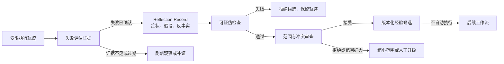

# 16. Reflection 与经验提炼：把失败轨迹变成可验证的候选改进

> 反思（Reflection）不是让 Agent 对一次失败写一段解释，而是把受限轨迹中的观察、假设、反事实和可证伪检查组织为一项候选改进；候选通过独立验证与审查后，才可能影响后续工作。

## 本章目标

完成本章后，读者能够：

- 区分症状、观察、根因假设、反事实和可复用经验，避免把一次文本输出当作结论。
- 为失败轨迹创建反思记录（Reflection Record），并把候选改进绑定到明确范围和可证伪检查。
- 在暂态噪声、缺观察、范围扩大、验证失败和重复模式之间选择刷新、补证、拒绝、验证或升级。
- 解释为何“模型自评找到了原因”不等于真实根因已经确认、经验已经写入或 Harness 已经改进。
- 为后续的评估、重试和长期治理提供可审查的经验准入入口。

## 为什么要学

失败后的第一句解释往往很有诱惑力：“链接检查失败，所以 URL 格式不对。”它可能是正确的，也可能把临时网络问题、认证页、检查器配置或输入范围混成同一种原因。若系统马上把这句话写入长期记忆、修改公共规则或重试更激进的动作，错误解释会被放大为错误策略。

本章把反思收窄为一个工程过程：先确认发生了什么，再提出可以被推翻的假设，之后在原范围内验证候选改变。Google SRE 将事后分析描述为记录事件、影响、处置、成因与后续行动的书面工件，并强调把预防行动落实到位，而不是把复盘当作惩罚。[REF-059](16-reflection-and-learning.references.md) 这提供了可靠性工程的类比，并不意味着 Agent 能自动得到或验证根因。

对语言 Agent 而言，Reflexion 论文提出使用语言反馈和情景记忆促进后续尝试；Self-Refine 论文讨论由反馈和精炼组成的迭代过程。[REF-057](16-reflection-and-learning.references.md) [REF-058](16-reflection-and-learning.references.md) 它们支持“反馈可以参与后续尝试”的研究背景，不能证明某段反思在你的仓库中正确、可迁移或值得持久化。

## 前置知识

- **前置章节：** 第 7 章区分工作记忆与长期记忆；第 10 章说明状态、检查点与交接；第 15 章负责采集可读状态和新鲜度。
- **技术前提：** 能阅读对象字段、Markdown 表格和最小 Node.js 测试；不要求使用向量数据库、Agent SDK 或故障管理平台。
- **不要求：** 本章不实现真实根因分析、遥测采集、事故管理、自动改写规则、模型训练或跨项目知识库。

> 注意：第 17 章系统说明如何定义和保存评估证据。本章只要求反思候选拥有可证伪检查；它不把“自我批评”当作评估器，也不在检查通过后自动修改 Harness。

## 场景引入：两个链接检查失败，究竟该学到什么

设想一个文档 Agent 在已提供的候选资料上运行链接检查，两次得到失败输出。它准备写下经验：“所有外部链接都不可靠，以后跳过链接检查。”这个结论既扩大了范围，也没有解释失败：可能是 URL 无效、页面临时不可达、检查器对某类页面需要允许规则，或输入本身并不是要发布的链接。

一个受控反思不会先改策略。它先保留失败轨迹及观察来源，写出“候选资料 URL 的格式可能不符合检查器规则”的假设，指定同一检查器对最小 URL 列表的可证伪检查，并补上反事实：如果最小列表通过，应优先调查暂态网络或页面可达性。候选改变的范围只限本章资料预检查；若提议改用全仓检查器，就必须重新立项或升级审查。

**成功标准：** 接手者能指出该记录中的已观察事实、尚未证实的假设、验证动作、影响范围和不覆盖的结论。

**边界：** 这个教学场景不访问网络、不检查真实 URL、不修改检查器配置、不记录真实事故，也不声称演示数据对应仓库的实际失败。

## 核心概念

### 反思记录（Reflection Record）：候选解释，不是结论

反思记录把一次**已评估为失败**的轨迹与一项候选改进关联起来。最小记录应包含：

| 字段 | 要回答的问题 | 示例性值 | 不能代表什么 |
| --- | --- | --- | --- |
| `traceId` | 回看哪次受限轨迹？ | `link-check-attempt-02` | 真实工单、用户或生产事件 ID |
| 观察证据 | 失败来自哪里、是否仍新鲜？ | `injected:link-check-output` | 环境状态已经重新确认 |
| 症状 | 可观察到什么偏差？ | “两个检查请求未通过” | 根因已经确认 |
| 根因假设 | 哪个机制值得检验？ | “URL 格式可能不符合规则” | 唯一解释或事实 |
| 可证伪检查 | 什么观察会支持或推翻假设？ | “对最小 URL 列表重跑同一检查器” | 检查已经执行 |
| 反事实 | 假设不成立时先看哪里？ | “最小列表通过则检查暂态可达性” | 所有替代原因已穷尽 |
| 候选改变与范围 | 想改变什么、只影响哪里？ | “本章资料预检查” | 已写入规则或长期记忆 |
| 验证状态 | 候选检查结果是什么？ | `not_run`、`passed` 或 `failed` | 经验已被采纳 |

这些字段是本书工程模型。它们借鉴“反馈进入后续循环”的思想，但不是 Reflexion、Self-Refine、任何 Agent SDK 或事故工具的固定 Schema。

### 症状、假设与经验：三个层级不能互换

| 层级 | 例子 | 必需证据 | 允许的动作 | 不能直接推出 |
| --- | --- | --- | --- | --- |
| 症状 | 链接检查返回失败 | 原始输出、退出状态或快照 | 保留轨迹、刷新观察 | URL 为什么失败 |
| 根因假设 | URL 格式触发规则 | 可证伪检查及对照 | 创建候选验证 | 已找到真实根因 |
| 候选经验 | “提交资料前先做格式预检查” | 独立检查通过、范围审查 | 提交人工或策略审查 | 可跨项目自动生效 |
| 已采纳经验 | 版本化规则或 Skill 变更 | 审查、验证、回滚路径 | 在限定范围加载 | 长期正确或不可撤销 |

有些失败没有单一根因。分布式系统、外部服务和模型生成都可能产生多种相互作用；此时“尚不能归因”是合理输出。把这种不确定性写进记录，比虚构一个易记的原因更有价值。

### 可证伪检查与反事实：让“复盘”能改变结论

一个假设至少应说明怎样被推翻。例如，若“URL 格式不符合检查器规则”为假设，则对最小 URL 集重新运行同一规则是可证伪检查；若结果通过，反事实分支会把调查方向转向网络、可达性或输入范围。可证伪不是保证检查设计完美，而是要求反思有机会失败。

Anthropic 对 evaluator-optimizer 工作流的限定建议是：当存在清晰评估标准，且迭代精炼能带来可测价值时，这种循环更适合使用。[REF-060](16-reflection-and-learning.references.md) 本章据此提出一个更保守的工程扩展：没有明确检查与可观察结果时，只保存问题和未知项，不生成可复用经验。

### 经验准入（Lesson Admission）：验证通过仍不是自动写入

候选检查通过只说明“这项有限改变在定义的检查下没有被拒绝”。它没有证明候选对其他任务、其他环境或未来版本仍合适。经验准入至少还要审查：

- **范围：** 改变是否仍与原轨迹同范围，还是已扩大到全仓或生产环境？
- **证据：** 观察是否过期，检查是否覆盖关键反例？
- **冲突：** 是否与现有 Instructions、Skill Contract、权限规则或人工决定冲突？
- **可撤销性：** 规则失效时能否定位版本、停用和回滚？
- **责任：** 谁能批准把候选写入共享记忆或项目规则？

因此，本章示例的最高状态是 `eligible_for_review`，不是“已写入经验”。跨任务持久化由第 7 章的记忆边界约束；影响 Harness 的变更仍须经过第 17 章的评估与后续章节的版本化、审批流程。

## 架构图

下图回答：一条失败轨迹如何在不自动改写系统的前提下，变成可验证的候选？



图示说明：箭头 `Candidate → Workflow` 使用虚线，表示候选经验只有在后续审查与加载条件满足时才可能影响工作流。图中没有“自动写入长期记忆”或“确认根因”的出口。

对应的可审查源文件为 [chapter-16-reflection-candidate-loop.mmd](../../diagrams/mermaid/chapter-16-reflection-candidate-loop.mmd)，导出图见 [SVG](../../diagrams/exported/chapter-16-reflection-candidate-loop.svg) 与 [PNG](../../diagrams/exported/chapter-16-reflection-candidate-loop.png)。

## 工作流程

1. **冻结受限轨迹：** 保存任务范围、尝试、观察来源和评估结论；不补写未观察字段。
2. **确认反思入口：** 只有失败已被独立评估、且观察仍新鲜时才创建候选。成功、未知或过期轨迹分别保留、补评或刷新。
3. **分离症状与假设：** 用可观察症状描述偏差；将每个可能机制写为单独假设，而不是选出“最像的原因”。
4. **写出反事实：** 说明假设不成立时哪个观察或分支应改变，防止解释变成不可反驳叙事。
5. **限定候选改变：** 将 proposed change 绑定到原轨迹范围。若需要扩大到共享规则、工具或生产环境，停止并升级。
6. **运行独立检查：** 用明确输入、成功条件和失败出口检验候选；检查失败时拒绝候选，不把失败重命名为经验。
7. **审查后再采纳：** 检查通过后仍检查冲突、可撤销性和责任；通过审查的版本化工件才可能进入未来工作流。

## 最小示例

完整示例位于 [reflection-record-assessment.mjs](../../examples/agent/reflection-record-assessment.mjs)。它只判断注入对象是否足以形成候选，不读取文件、网络、环境变量、时钟、模型或持久化服务。

```js
const result = assessReflectionRecord({
  trace: {
    id: 'link-check-attempt-02',
    scope: 'docs:chapter-16',
    outcome: 'failed',
    observationStatus: 'current',
    evidence: 'injected:link-check-output',
  },
  reflection: {
    symptom: '两个链接检查请求未通过。',
    hypothesis: '候选资料 URL 的格式可能不符合检查器规则。',
    falsifiableCheck: '用同一检查器对最小 URL 列表重新执行。',
    counterfactual: '若最小 URL 列表通过，优先检查暂态网络或原页面可达性。',
    proposedChange: '为候选资料增加可追溯链接预检查。',
    changeScope: 'docs:chapter-16',
  },
  verification: { status: 'not_run' },
});
```

**实际验证命令：**

```bash
node --test examples/agent/reflection-record-assessment.test.mjs
node examples/agent/reflection-record-assessment.mjs
```

2026-07-16 实际运行后，前者 8 项 Node 内置测试通过、0 项失败；后者输出 `candidate_for_validation` / `reflection_candidate_ready` / `run_falsifiable_check`。这只证明函数对注入教学对象的确定性判断，不验证真实链接、检查器、根因、经验写入、权限或外部系统。

## 逐步增强

1. **从单个假设开始：** 只要求观察来源、症状、假设、反事实和可证伪检查，适用于一次范围窄的失败。
2. **增加对照与重复性：** 在低风险环境中保存最小输入、对照轨迹和失败分类，适用于需要区分暂态噪声与重复模式的任务。
3. **增加版本化经验工件：** 为接受的候选记录来源、适用范围、失效条件、负责人和回滚步骤，适用于跨会话或团队复用。
4. **增加受控试验：** 只有改变可回滚、评估规格清楚且有人负责审查时，才在有限任务中比较旧规则和新规则。

升级触发条件是：候选将跨任务复用、影响写入/权限/成本、需要修改共享 Instructions 或无法用原范围的检查判定。此时不要让反思函数直接改变系统。

## 完整工程案例：把链接失败变成可审查的改进任务

**背景：** 文档 Agent 维护第 16 章参考资料，教学输入中包含两次失败轨迹。目标不是消除所有外部失败，而是决定“是否值得为候选资料增加预检查”。

**约束：** 不访问真实网页；不把一次失败解释为 URL 无效；不跳过链接检查；不改动全仓配置；不持久化经验。

**设计选择：**

| 决策 | 选择 | 原因 | 替代方案与边界 |
| --- | --- | --- | --- |
| 反思入口 | 失败评估和当前观察同时满足 | 防止从成功或陈旧状态推导经验 | 未评估轨迹只能补证 |
| 原因表达 | 假设 + 反事实 | 保留可推翻路径 | 单一“根因”标签会过早收敛 |
| 改变范围 | 与轨迹范围严格相同 | 防止局部故障触发全仓改写 | 全仓更改需独立任务和审查 |
| 结果处理 | 检查通过后仅进入审查 | 验证与采纳分离 | 自动写入共享记忆不在本章范围 |

**结果与证据：** 示例能把缺观察、过期观察、不可证伪假设、范围扩大、候选检查失败和检查通过导向不同出口。它不运行真实链接检查，所以不能说明候选预检查会改善真实仓库。

## 实现说明

`assessReflectionRecord` 先检查轨迹字段，再检查失败结论和观察新鲜度，之后要求完整的反思记录。它把“缺可证伪检查”归为 `needs_evidence`，而不是把语言流畅的假设视为根因；它把范围扩大归为 `blocked`；只有验证状态为 `passed` 的候选才达到 `eligible_for_review`。

这个顺序体现了一个保守原则：越接近改变共享行为，越需要回到原始观察、明确范围和独立检查。函数没有 `writeLesson`、`updatePolicy` 或 `retry` 分支，避免一个教学判断器暗中承担持久化、修改和恢复职责。

## 测试与验证

| 层级 | 验证对象 | 命令或方法 | 成功标准 | 实际状态 |
| --- | --- | --- | --- | --- |
| 单元 | 反思候选纯逻辑 | `node --test examples/agent/reflection-record-assessment.test.mjs` | 8 条边界断言通过 | 2026-07-16 已运行，8 通过、0 失败 |
| 演示 | 默认教学对象 | `node examples/agent/reflection-record-assessment.mjs` | 输出候选验证状态而非已采纳经验 | 2026-07-16 已运行，退出码 0 |
| 图示 | Mermaid 源与导出图 | Mermaid CLI 导出 SVG/PNG | 节点、拒绝路径和虚线边界可读 | 2026-07-16 已运行，见图示审查 |
| 真实系统 | 真实链接、网络和规则修改 | 不在本章执行 | 不得用纯内存结果替代 | 未执行，超出范围 |

## 工程实践

- 让反思记录引用不可变或可版本化的观察，而不是把模型摘要当作唯一证据。
- 预先定义哪些失败值得反思，例如影响扩大、重复出现、人工升级、数据损失或评估器失效；不要对每条低价值日志都生成“经验”。
- 将候选、验证、审查和采纳保留为不同状态，便于统计候选被拒绝的原因而不污染共享记忆。
- 为已采纳经验添加过期、撤销和冲突检查。经验的生命周期属于系统设计，不能假设“写入一次就永久正确”。

## 最佳实践

- **先写观察，再写解释。** 这样接手者能重放思路，而不是只能相信叙述。
- **假设必须带反事实。** 如果没有能改变结论的观察，优先标记未知而非收集“自信解释”。
- **把改动范围做小。** 一次候选检查应先证明最小变化的价值；扩大范围需要新的风险与审批判断。
- **将反思质量接到评估规格。** 检查应来自任务成功条件、失败分类或证据要求，而非模型给自己的评分。

## 常见错误

| 错误 | 表现 | 根因 | 修复方向 |
| --- | --- | --- | --- |
| 把失败文本当根因 | 一段日志就触发规则修改 | 没有可证伪检查 | 保存症状，生成多个可检验假设 |
| 把暂态现象写入长期记忆 | 下一次任务被旧结论误导 | 没有新鲜度与撤销条件 | 刷新观察，给经验定义有效期 |
| 从局部失败改写全仓规则 | 一个章节问题影响所有工作流 | 范围没有绑定轨迹 | 阻塞并缩小范围或人工升级 |
| 验证一次即自动采纳 | 候选绕过冲突、权限和回滚检查 | 把验证与治理混为一层 | 进入审查队列，保留拒绝出口 |
| 反思失败后继续生成同一解释 | 重试只增加文字，不增加证据 | 没有反事实分支 | 回到观察或切换假设，不重复断言 |

## 安全与边界

- **数据边界：** 反思记录可能包含日志、用户输入或工具结果。进入共享经验库前必须脱敏、最小化并检查访问范围。
- **权限边界：** 反思函数无权改写 Instructions、Skill、工具配置、权限或生产数据；任何此类动作走独立变更流程。
- **人工审批点：** 范围扩大、不可逆改动、跨项目共享、证据冲突或候选影响安全策略时，需要人工复核。
- **不适用范围：** 本章不提供因果推断保证、事故响应规范、模型微调流程、自动 A/B 测试或组织级知识治理方案。

## 章节总结

可靠的反思不是“失败后再生成一次”，而是把失败轨迹转为可以被推翻的候选改进：观察要新鲜，假设要有反事实，改变要受范围约束，检查通过后仍要审查。这样，反思既能帮助系统学习，也不会让一次偶发输出自动成为永久规则。

第 17 章将把这一过程需要的“失败已确认”“候选检查通过”等信号进一步落实为 Evaluation Spec、证据与质量门。

## 练习

1. 为“UI 测试点击后未出现预期元素”写一条反思记录：列出至少两个假设、各自的可证伪检查和一个反事实分支。
2. 说明为何“把等待时间从 500 ms 增加到 5 s”在没有新观察时不能直接成为跨项目经验。
3. 设计一个经验准入规则：当候选会影响写操作时，它还需要哪些权限、验证和回滚信息？

## 延伸阅读

- [REF-057](16-reflection-and-learning.references.md)：语言反馈与情景记忆的研究背景。
- [REF-058](16-reflection-and-learning.references.md)：迭代反馈—精炼的研究背景。
- [REF-059](16-reflection-and-learning.references.md)：工程事后分析和无责学习的实践背景。
- [REF-060](16-reflection-and-learning.references.md)：有清晰评估标准时的 evaluator-optimizer 工作流建议。

## 参考资料

本章使用的来源、允许陈述和外推禁区见 [第 16 章候选参考资料](16-reflection-and-learning.references.md) 与 [第 16 章事实核验](16-reflection-and-learning.fact-check.md)。正式 REF-057 至 REF-060 已登记到 `.ai/references.md`；局部键仅保留在历史工件中以便追溯。

## 章节完成检查表

- [x] Front matter、目标、前置知识和章节依赖完整。
- [x] 内容为原创表达，研究背景与本书工程扩展已区分。
- [x] 每项可归因事实有局部来源，动态资料保留复核边界。
- [x] 图示有 Mermaid 源码、读图说明和一致术语。
- [x] 示例有环境、验证方式、真实运行结果和安全边界。
- [x] 技术、事实、语言和图示审查均已记录。
- [ ] 主线程统一更新 `.ai/progress.md`、`.context`、全局引用和全仓校验。
