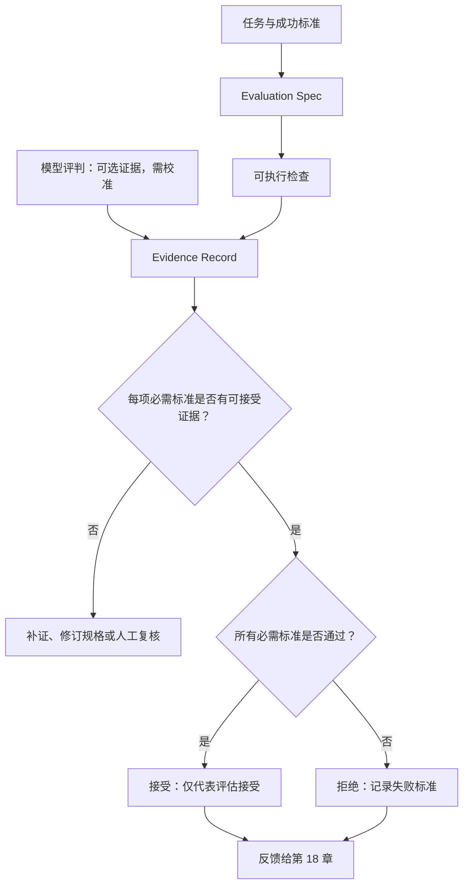

# 17. Evaluation 与可验证结果：把完成写成证据链

> 评估（Evaluation）不是让 Agent 再说一次“我做得不错”，而是把一个任务拆成能被独立检查的标准、证据和判定。只有这些工件能让后续的人或系统理解“为什么接受”与“哪里仍未知”。

## 本章目标

完成本章后，读者能够：

- 为一个 Agent 任务写出 Evaluation Spec，明确范围、成功标准、证据、评分规则和不覆盖范围。
- 区分结果、过程、安全与资源约束，不让一个绿色检查覆盖其他维度的失败。
- 在确定性检查、状态观察、人工复核和模型评判之间选择合适的评分器（Grader）。
- 使用证据矩阵（Evidence Matrix）和质量门（Quality Gate）把任务路由到接受、拒绝、补证或复核。
- 识别模型自评、未校准评判器、模糊规格和环境污染造成的假阳性与假阴性。

## 为什么要学

“已经更新文档，所有内容都没问题。”这句话可能来自模型、命令输出，也可能来自一段没有关联到任务的日志。它没有说明更新了哪一篇文档、哪些链接被检查、事实如何追溯、哪些读者路径仍未复核。即使某一个检查确实通过，也无法推出其余条件满足。

对 Agent 而言，问题更复杂：同一任务可能经过多轮工具调用，改变环境状态，又受模型输出随机性影响。Anthropic 的工程文章把 task、trial、grader、transcript 和 outcome 作为评估中的不同工件，并明确指出评估 Agent 时评估的是 Harness 与模型的组合。[REF-061](17-evaluation-and-verifiable-results.references.md) 这是一家厂商的工程定义，不是统一标准；它提醒我们，不应只看最终一段自然语言。

本章的目标不是建立一个万能总分，而是让“完成”有清晰的证明责任。它不负责采集状态，也不决定如何重试：第 15 章提供观察信号，第 16 章把失败整理为待验证的经验候选并审查其准入，第 18 章消费本章的拒绝或补证结论来选择恢复动作。

## 前置知识

- **前置章节：** 第 10 章的工作流状态、 第 11 章的工具结果与效果不确定性、 第 14 章的人工审批边界，以及第 15 章的状态快照与证据等级。
- **技术前提：** 能阅读 Markdown 表格、对象字段和简单的 Node.js 函数；不要求接入某个评估平台。
- **不要求：** 本章不要求运行真实 CI、Browser E2E、模型评分器、数据库、Benchmark 或生产 Agent。

> 注意：质量门接受一个任务，不等于该任务在真实世界已经执行、拥有权限、没有风险或让用户满意。它只说明给定的 Evaluation Spec 与证据记录满足了该门的规则。

## 场景引入：更新文档后，什么才能叫“完成”

假设一个文档维护 Agent 收到任务：“把架构说明补充为新版流程，并修复相关链接。”它提交了一段 Markdown，并说“链接已经修好”。如果团队只看这句话，就无法回答四个基本问题：文件格式是否有效、链接是否仍能到达、事实引用是否可追溯、读者能否从入口找到这个页面？

把这四个问题混成一项“文档质量”会带来两种误判：格式和链接都通过时，团队可能忽略事实没有来源；模型认为叙述流畅时，团队又可能忽略核心链接已经失效。本章用一个教学 Evaluation Spec 将它们拆开：每项标准有检查方式、证据记录、失败出口和不能推出的结论。

**成功标准：** 每一项必需标准都有适用的通过证据；每一条不通过、缺失或不可信的记录都能定位到具体标准。

**边界：** 本章案例不读取、修改或发布任何真实文档，也不运行 `markdownlint`、链接检查或模型调用。文中的文件名、检查名称和结果均为教学对象。

## 核心概念

### Evaluation Spec：先定义如何证明，再开始声称完成

本书将 Evaluation Spec 定义为任务的验收契约。它至少回答：

| 字段 | 要回答的问题 | 教学示例 | 不能代表什么 |
| --- | --- | --- | --- |
| 任务与范围 | 评估的是哪一次任务，哪些对象不在范围内？ | “更新一篇指定架构文档，不发布站点” | 系统已经修改文件。 |
| 成功标准 | 哪些结果必须成立？ | 格式有效、必需链接可达、来源登记存在 | 标准已经被检查。 |
| 证据要求 | 由什么记录支撑每项标准、对应哪个范围、是否仍新鲜？ | 带范围和新鲜度的检查记录、状态快照、人工复核 | 证据必然可信或永不过期。 |
| 评分规则 | 谁可以判定，如何聚合？ | 必需项全部通过；可选项待复核 | 单一分数代表所有维度。 |
| 失败出口 | 缺证、失败或歧义时去哪里？ | 补证、拒绝、人工复核 | 已经开始重试或回滚。 |
| 不覆盖范围 | 哪些结论刻意不做？ | 不评估真实用户理解与生产发布 | 这些范围没有风险。 |

Evaluation Spec 的关键不是字段数量，而是判定能否复现。如果一位领域专家看到相同任务与证据仍无法说出通过条件，规格还不够。把这种歧义留给模型“自行判断”，会让指标中的噪声看起来像能力波动。

### 四类标准：结果、过程、安全与资源约束不能互相抵消

一个 Agent 任务常常同时有四类需要关注的标准：

| 标准类别 | 问题 | 文档更新案例中的教学检查 | 通过后仍不能推出 |
| --- | --- | --- | --- |
| 结果（Outcome） | 目标状态是否成立？ | 所有必需链接的观察记录为通过 | 来源准确、读者理解或发布完成。 |
| 过程（Process） | 是否遵守必须保留的步骤？ | 变更前后均留下关联记录 | 输出内容一定正确。 |
| 安全（Safety） | 是否越过权限、数据或不可逆边界？ | 规格声明“仅提出内容候选，不写入生产” | 已完成真正的权限审计。 |
| 资源（Resource） | 成本、时延和次数是否在预算内？ | 记录教学试次数与检查预算 | 结果正确、安全或对用户有用。 |

NIST AI RMF 的 Measure 语境要求选择、应用和记录测量方法，并把有效性与可靠性列为需要评估的特征。[REF-062](17-evaluation-and-verifiable-results.references.md) [REF-063](17-evaluation-and-verifiable-results.references.md) 本书把这些背景落到四类标准，是工程扩展，不是 NIST 提供的 Agent 评分表。

四类标准并不要求每个任务都同等复杂。只读、低风险的小任务可以只有确定性结果检查；一旦涉及安全边界、开放式质量或成本承诺，就应把相应标准显式加入规格，而不是在任务失败后才补写理由。

### 评分器（Grader）：选择能回答问题的检查，而非最漂亮的分数

评分器是把一部分证据转换成通过、失败或不确定结论的逻辑。一个任务可以有多个评分器，但每个评分器都应有狭窄、可解释的职责。

| 评分器 | 擅长的问题 | 主要风险 | 本书建议 |
| --- | --- | --- | --- |
| 确定性检查 | 格式、Schema、精确状态、单元测试 | 对有效但未预期的变体过于严格 | 可确定时优先使用，并保留输入与输出位置。 |
| 状态观察 | 目标对象是否处于预期状态 | 观察过期、范围错误或只看到了表面 UI | 关联观察时间、对象范围和来源；不要用一次快照覆盖后续变化。 |
| 人工复核 | 领域正确性、风险、开放式质量 | 成本高、标准不一致、交接困难 | 写 Rubric、保留理由，并抽样检查评分一致性。 |
| 模型评判 | 开放文本的覆盖、连贯性、Rubric 维度 | 随机性、偏差、提示词/模型漂移 | 只评估明确维度；记录版本与 Rubric；设置“不知道”出口并与人工校准。 |
| 自我报告 | Agent 声称自己做了什么 | 不独立、无法证明外部状态 | 只能作诊断线索，不能单独满足必需标准。 |

Anthropic 的文章把代码、模型和人工列为不同类型的评分器，并指出模型评分需要与人工评分校准。[REF-061](17-evaluation-and-verifiable-results.references.md) Zheng 等也讨论了 LLM-as-a-judge 的位置、冗长和自我增强等偏差。[REF-064](17-evaluation-and-verifiable-results.references.md) 因而，本书不把模型评判器称为“客观裁判”；它只是可扩展但需要校准的证据来源之一。

### 证据矩阵与质量门：不要把“有记录”误写成“已通过”

证据矩阵把标准和记录一一关联。一个最小记录可以含有标准 ID、证据种类、状态、关联对象、范围、采集方式和刷新条件。教学函数把范围写作 `scope`，把刷新条件的已判定结果写作 `freshness`；它不读取真实时钟，也不自行计算 TTL。它可以保存 `passed`、`failed`、`unknown` 或“未提供”，但这些状态都只在对应标准的语境中成立。若同一标准同时出现通过和失败记录，且没有可复核的版本或时间规则，本书质量门把它视为冲突证据，而不是挑选第一条绿色记录。

| 成功标准 | 证据种类 | 教学记录状态 | 质量门解释 | 不能推出 |
| --- | --- | --- | --- | --- |
| Markdown 格式有效 | 确定性检查 | 同一 `scope` 中的 `passed` / `fresh` | 该格式标准可进入下一步 | 链接、事实或读者路径也通过。 |
| 必需链接可达 | 状态观察 | 同一 `scope` 中的 `passed` / `fresh` | 该观察记录满足链接标准 | 页面内容正确或未来仍可达。 |
| 来源可追溯 | 人工复核 | `unknown` | `needs_evidence` | 来源必然错误。 |
| 读者路径清楚 | 经校准模型评判 | `failed` | 可选项进入 `needs_review` | 必需结果标准自动失败。 |

本书质量门遵循保守顺序：规格不完整先返回 `needs_spec`；必需标准缺证、范围不匹配、证据种类不适用、证据不新鲜或状态为 `unknown`/未提供时返回 `needs_evidence`；只有必需标准已有适用证据并明确为 `failed` 时才返回 `rejected`；可选项缺证或未满足返回 `needs_review`；只有所有必需标准均有同范围、足够新鲜且通过的证据时才返回 `accepted`。这些是教学规则，既不是某个 CI 系统状态，也不是外部任务的真实性结论。

## 架构图：从任务到可解释结论

下图回答：一个任务如何从“希望完成”转成“有条件的评估结论”？图中的质量门不执行任何动作；它只读取规格和记录，输出下一步需要的信息。



图示说明：`Checks` 和 `Judge` 都只生成 Evidence Record，不能直接宣告任务成功。质量门先检查必需标准是否有适用证据，再检查这些证据是否通过；拒绝与接受都把结构化信息交给第 18 章，而不在本章触发重试。

发布源文件见 [chapter-17-evaluation-evidence-pipeline.mmd](../../diagrams/mermaid/chapter-17-evaluation-evidence-pipeline.mmd)，导出图见 [SVG](../../diagrams/exported/chapter-17-evaluation-evidence-pipeline.svg) 与 [PNG](../../diagrams/exported/chapter-17-evaluation-evidence-pipeline.png)。

## 工作流程：为任务建立评估闭环

1. **界定任务：** 写清任务对象、允许效果、排除范围和成功标准；输入是任务 Brief，输出是 Evaluation Spec 草案。
2. **选择评分器：** 为每项标准选择能独立回答问题的检查器；可确定的结果优先使用确定性检查，开放式质量再考虑 Rubric 与人工/模型复核。
3. **固定证据形状：** 为记录分配标准 ID、证据种类、状态、关联对象、范围和刷新条件；范围不匹配、状态未知或缺字段时不能进入接受路径。
4. **运行或收集检查：** 在真实项目中执行检查并保存可回溯结果；本章的代码只接收已经注入的教学记录。
5. **应用质量门：** 先区分规格缺失、证据缺失、证据失败和可选项待复核，再决定接受或拒绝。
6. **复查误判：** 读取失败记录和抽样轨迹，判断问题在 Agent、Harness、环境、规格还是评分器；不要把任何分数变化立即归因给模型。
7. **交接下一步：** 把 `rejected`、`needs_evidence` 和 `needs_review` 连同标准 ID 交给第 18 章的恢复策略，或交给第 16 章形成待验证的反思/经验候选并经过准入审查；本章不自动写入跨任务经验。

## 最小示例：纯内存 Evaluation Spec 质量门

完整示例位于 [examples/agent/evaluation-spec-assessment.mjs](../../examples/agent/evaluation-spec-assessment.mjs)。它只对显式注入的任务、证据和策略做确定性判断：

```js
import { assessEvaluationSpec } from './examples/agent/evaluation-spec-assessment.mjs';

const conclusion = assessEvaluationSpec({
  task: {
    id: 'docs-update-evaluation',
    scope: 'chapter-17-docs',
    successCriteria: [
      { id: 'markdown', required: true },
      { id: 'links', required: true },
    ],
  },
  evidence: [
    {
      criterionId: 'markdown',
      kind: 'deterministic_check',
      scope: 'chapter-17-docs',
      freshness: 'fresh',
      status: 'passed',
    },
    {
      criterionId: 'links',
      kind: 'state_observation',
      scope: 'chapter-17-docs',
      freshness: 'fresh',
      status: 'passed',
    },
  ],
  policy: {
    acceptedEvidenceKinds: ['deterministic_check', 'state_observation'],
    requiresModelJudgeCalibration: true,
    requiredFreshness: 'fresh',
  },
});
```

**运行前提：** 从仓库根目录执行，Node.js 支持内置 `node:test`；不需要网络、账户、密钥、环境变量、文件写入或真实检查工具。

**验证命令：**

```bash
node --test examples/agent/evaluation-spec-assessment.test.mjs
node examples/agent/evaluation-spec-assessment.mjs
```

**实际结果：** 专用测试与演示的真实执行结果记录在[示例整合审查](../../.memory/reviews/2026-07-16-chapter-17-example-integration.md)。

**限制：** 函数不会运行 Markdown lint、链接检查、模型评分、浏览器操作或真实 CI。它只能说明注入的 Evidence Record 是否满足本书教学质量门，不能证明文档、模型或外部系统的真实状态。

## 逐步增强：从布尔值到可维护的评估系统

1. **先增加结构化原因：** 不只返回 `false`，还返回失败标准 ID 与 `needs_spec`、`needs_evidence`、`rejected` 的区别。升级触发是接手者需要知道下一步该补什么。
2. **再增加可追溯证据：** 在真实实现中记录检查命令、输入版本、输出位置、环境和刷新条件。升级触发是单次结果无法重现或来源发生变化。
3. **最后处理开放式质量：** 为模型评判添加明确 Rubric、人工校准和抽样复核。升级触发是确定性检查无法覆盖读者体验、覆盖度或论述质量。

不要把第三步反过来做成“先加一个总分模型”。如果任务的必需结果可以被确定性检查，先保留该检查的独立结论；模型评判只能补充它无法表达的维度。

## 完整工程案例：文档更新的联合质量门

下面是一个教学 Evaluation Spec，不代表本仓库或任何外部项目已经执行这些检查。

| 标准 | 必需性 | 评分器 | 通过证据 | 失败出口 | 不能推出 |
| --- | --- | --- | --- | --- | --- |
| 标题、代码块和表格结构符合约定 | 必需 | 确定性 Markdown 检查 | 同一范围、`fresh` 的检查记录为 `passed` | `rejected` | 链接和事实正确。 |
| 指定的站内链接可解析 | 必需 | 相对链接状态观察 | 每条必需链接有同一范围、`fresh` 的通过记录 | `needs_evidence` 或 `rejected` | 目标页内容适合读者。 |
| 外部事实可追溯 | 必需 | 人工复核 | 来源、用途、日期和外推禁区完整 | `needs_evidence` | 来源本身真实或永不过期。 |
| 新读者能找到下一步 | 可选 | 经校准的 Rubric 复核 | 复核记录说明路径完整 | `needs_review` | 所有读者都理解内容。 |
| 评估成本在预算内 | 可选 | 资源记录 | 明确的试次与预算记录 | `needs_review` | 内容正确或安全。 |

案例中的关键决定是：格式、链接和来源不能互相抵消。即使格式与链接均通过，来源缺失仍意味着必需证据不足；即使可选读者路径未通过，也不应悄悄改写为“全部失败”，而应要求复核决定它是否该升级为必需标准。

### 实现说明

`assessEvaluationSpec` 的输入只包含 `task`、`evidence` 与 `policy`。函数按证据可靠性先后处理：规格是否完整、必需证据是否存在、证据种类是否适用、范围是否匹配、刷新条件是否满足、模型评判是否标为已校准、状态是否明确、必需标准是否明确失败、可选标准是否需要复核。`freshness` 是调用方注入的判断，不是函数读取时钟的结果。这个顺序避免了“证据已经失败”掩盖“根本没有合格证据”的情况。

| 决策 | 选择 | 原因 | 替代方案与边界 |
| --- | --- | --- | --- |
| 成功条件 | 每项必需标准独立通过 | 让失败可定位 | 加权总分适合另有明确权重和容错规则的任务。 |
| 证据范围与新鲜度 | 必须匹配任务 `scope` 与策略 `requiredFreshness` | 不让其他对象或陈旧状态支持当前接受 | 真实系统可改用版本、观察时间和任务专用刷新规则，但需将等价关系写入契约。 |
| 自我报告 | 不接受为必需证据 | 声明不能独立证明结果 | 可作为诊断字段或生成补证建议。 |
| 模型评判 | 仅在策略允许且标为已校准时接受 | 使其前提显式 | “已校准”只是注入字段，真实校准仍需独立证据。 |
| 可选项 | 缺证或未满足均进入 `needs_review` | 避免可选质量项悄悄被忽略 | 若该项变关键，应修订 Evaluation Spec。 |

## 测试与验证

| 层级 | 验证对象 | 命令或方法 | 成功标准 | 实际状态 |
| --- | --- | --- | --- | --- |
| 单元 | 纯内存质量门 | `node --test examples/agent/evaluation-spec-assessment.test.mjs` | 14 条教学路径均匹配精确对象 | 已执行，详见示例整合审查。 |
| 演示 | 接受路径 | `node examples/agent/evaluation-spec-assessment.mjs` | 输出 `accepted` / `evaluation_accepted` | 已执行，详见示例整合审查。 |
| 图示 | Mermaid 源与正文图块 | Mermaid CLI 导出、`diff -u` 比较 | SVG/PNG 生成且源一致 | 已执行，详见图示审查。 |
| 局部文档 | 本章 Markdown 与链接 | markdownlint、markdown-link-check | 退出码为 0 | 已执行，详见终审记录。 |
| 真实文档更新 | 外部项目、读者路径、模型/CI | 不在本章运行 | 不适用 | 未执行；明确排除。 |

## 工程实践

- **让标准面向观察，而非面向模型措辞。** “链接解析为目标页面”比“模型确信链接正确”更容易独立复查。
- **保存拒绝的理由。** `criterion_not_passed` 需要关联到哪个标准和哪份证据；否则第 18 章无法安全选择恢复路径。
- **把评分器版本纳入证据。** 当 Rubric、模型、脚本或环境变更时，旧分数可能失去可比性。
- **为不确定性留出口。** 不知道、证据缺失和评分器不适用都应阻断接受，而不是被转成低分后平均掉。
- **定期审查评估本身。** Anthropic 的经验强调阅读轨迹和检查任务/评分器是否公平；这是对评估设计的复查，不是对模型的无条件辩护。[REF-061](17-evaluation-and-verifiable-results.references.md)

## 最佳实践

- 先把人工验收中反复出现的问题写成小而明确的 Evaluation Spec，再逐步自动化评分器。
- 对关键标准保留反向样本：既测试“应该通过”，也测试“应该拒绝”，以免系统只学会多做动作或多给肯定。
- 优先评估任务结果；过程记录只在安全、成本、可审计或用户体验确实要求时成为独立标准。
- 为模型评判设置独立维度与“不知道”选项，并用人工抽样校准，而不是让一个总分决定所有结论。
- 将能力探索和回归保护分成不同套件：前者寻找尚未可靠解决的任务，后者保护已经承诺的行为。两者的通过率预期不同，不能混合解读。[REF-061](17-evaluation-and-verifiable-results.references.md)

## 常见错误

| 错误 | 表现 | 根因 | 修复方向 |
| --- | --- | --- | --- |
| 把自我报告当证据 | Agent 说“完成”即显示绿色 | 任务声明与外部观察未分开 | 为每个必需标准要求独立 Evidence Record。 |
| 只看最终结果文本 | 页面显示“成功”，数据或文件状态未检查 | 结果和界面确认混淆 | 选择能观察目标状态的检查器。 |
| 单一总体分数 | 高格式分掩盖来源缺失或安全失败 | 不可替代维度被平均 | 对必需标准使用单独门槛。 |
| 挑选冲突中的绿色记录 | 同一标准既通过又失败，却被接受 | 未定义版本、新鲜度或冲突规则 | 返回 `needs_evidence`，补齐可复核的证据排序。 |
| 把模型评判当事实 | 未校准 Rubric 直接接受高风险输出 | 忽略偏差和随机性 | 限定维度、人工校准、记录版本与不确定出口。 |
| 评估环境不干净 | 上一次试次留下文件使下一次通过 | 共享状态污染证据 | 在真实系统中隔离试次并记录环境版本。 |
| 失败就直接重试 | `rejected` 被当作“再跑一次”的命令 | 评估和恢复职责混合 | 把结构化结论交给第 18 章按副作用与错误类别处理。 |

## 安全与边界

- **权限边界：** 评估接受不授予读取、写入、发布或调用 Tool 的权限；这些仍由第 12 和第 14 章的边界决定。
- **数据边界：** 真实证据可能包含敏感文本、日志、用户数据或密钥。收集和保留前需定义最小化、访问与删除规则；本章示例不处理任何真实数据。
- **人工审批点：** 开放式高影响结论、模型评判校准、规格争议和安全例外应可升级给人；审批并不替代结果检查。
- **不适用范围：** 本章不提供性能排行榜、模型能力结论、法律意见、通用合规认证或生产评估平台实现。

## 章节总结

评估的价值不在于让 Agent 获得一个漂亮分数，而在于让任务的完成定义可观察、可复查、可交接。Evaluation Spec 先写清证明责任；证据矩阵将每个标准和记录关联；质量门将规格缺失、证据不足、失败和可选项待复核区分开；评分器的选择与校准则防止一个未经审查的分数覆盖所有问题。

下一章将把这些结论当作输入：缺证、拒绝和待复核并不自动意味着重试。第 18 章需要结合错误类别、幂等性和副作用，决定是补证、恢复、停止还是升级。

## 练习

1. 为“Agent 生成一次 API 测试报告”写三项必需标准和一项可选标准，并说明每项不能由哪一种证据替代。
2. 某个模型评判器给“读者路径清楚”打高分，但人工复核发现入口链接不见了。请分别检查规格、证据、Rubric 与环境，说明可能的误判来源。
3. 将本章的 `accepted` 结论交给一个涉及写入的任务。列出在真正执行前仍需由环境、审批和恢复机制回答的三个问题。

## 延伸阅读

- [Anthropic：Demystifying evals for AI agents](https://www.anthropic.com/engineering/demystifying-evals-for-ai-agents)：任务、试次、评分器、轨迹、结果与评估维护的限定工程讨论；动态资料，后续改写前重新核验。
- [NIST AI RMF Core：Measure](https://airc.nist.gov/airmf-resources/airmf/5-sec-core/)：有效性、可靠性和测量过程的风险管理背景；不是 Agent 评估模板。
- [Zheng et al.：Judging LLM-as-a-Judge with MT-Bench and Chatbot Arena](https://arxiv.org/abs/2306.05685)：理解模型评判器的研究背景与偏差风险。

## 参考资料

- [本章候选参考资料与外推边界](17-evaluation-and-verifiable-results.references.md)
- [Research Brief](17-evaluation-and-verifiable-results.research.md)
- [事实核验](17-evaluation-and-verifiable-results.fact-check.md)

## 章节完成检查表

- [x] Front matter、目标、前置知识、依赖与章节边界完整。
- [x] 正文为原创表达，来源级陈述与本书工程模型已分开。
- [x] 每项可归因事实可追溯到本章候选资料，动态资料标明重核要求。
- [x] Mermaid 源码、读图说明和导出图链接完整。
- [x] 纯内存示例有环境、命令、限制和真实执行记录入口。
- [x] 技术、事实、语言、图示与终审记录已创建。
- [ ] 全局引用编号、章节进度、目录和总校验由主线程统一整合。
