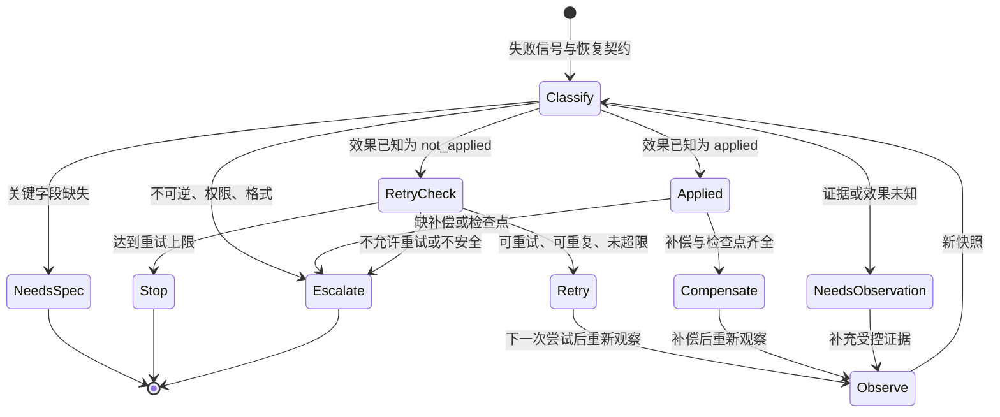

# 18. Retry、Recovery 与容错

> 失败后的下一步不是默认“再试一次”，而是先说明此前效果是否可知、是否安全重复、何时停止，以及由谁承担恢复责任。

## 本章目标

- 区分失败信号、外部效果状态、重试资格、恢复路径和最终升级，而不把它们压成一个 `error`。
- 为一次行动定义最小恢复契约（Recovery Contract）：错误分类、效果状态、尝试上限、检查点、补偿说明和交接对象。
- 在短暂失败、效果未知、已部分生效、不可逆和非重试错误之间选择不同的保守出口。
- 解释退避、随机化、重试预算和单一重试所有者为什么是系统设计问题，而非模型措辞问题。
- 使用纯内存示例审查恢复判断，且不把 `retry`、`compensate` 或 `escalate` 伪装成真实外部动作。

## 为什么要学

第 17 章可以说明一项任务尚未被接受，却不会告诉执行者是否应重新调用工具。这个空白很危险：如果此前写入已经成功、只是响应丢失，重试可能制造重复副作用；如果服务已过载，许多层各自重试会把原本局部的问题扩大；如果已经完成一半，简单退出又会留下不可解释的中间状态。

重试（Retry）、恢复（Recovery）与容错不是“让系统永远成功”的承诺。它们是一套承认不确定性、保存可恢复信息、限制自动动作并给人类留出口的机制。本章不替某个 HTTP 客户端、工作流引擎、浏览器测试框架或云服务设置参数；它给 Harness 一个可以审查的恢复判断框架。

## 前置知识

- **前置章节：** 第 10 章的状态机和检查点、第 11 章的 Tool 副作用与效果不确定性、第 14 章的人类审批、第 15 章的状态快照，以及第 17 章的证据质量门。
- **技术前提：** 能读懂 JavaScript 对象、Markdown 表格和 Mermaid 状态图；不要求运行队列、数据库、云平台或浏览器。
- **不要求：** 本章不要求配置 HTTP 重试、实现断路器（Circuit Breaker）、使用 Saga、部署工作流引擎，或接入真实监控和告警系统。

> 注意：`timeout` 只说明调用方在限定时间内没有得到预期响应。除非有受控观察证据，否则它不能推出外部动作未执行。第 15 章负责重新观察，第 17 章负责判断任务是否接受；本章只决定是否存在一条受限的下一步路径。

## 场景引入：资料获取失败后，不要用编造内容“恢复”

一个研究 Agent 需要读取一份候选资料以完成章节事实核验。它发出只读获取请求，但得到网络层失败。若它立刻把资料内容凭记忆补齐，就把“获取失败”变成了“来源已经核验”的假记录；若它在多个封装层各自重试，又可能放大对同一来源的请求。

本章把这个场景限制为教学对象。行动称为 `source-fetch-1`，目标是 `candidate-source`，失败类别是 `transient_network`。若行动效果明确为 `not_applied`、该操作被声明为安全可重复、重试所有者和上限已经写入策略，则可以返回一个 `retry` 候选；它仍不读取网页。若效果为 `unknown`，则必须先请求受控观察或交接；若错误摘要已部分写入且有明确补偿和检查点，才可提出 `compensate` 候选。

**成功标准：** 每一个自动出口都能说明自己的前提和不代表什么；未知效果、重试耗尽、不可逆副作用和非重试错误不会被沉默地改写为下一次尝试。

**边界：** 本案例不发网络请求、不下载资料、不创建摘要、不修改仓库、不等待、不执行退避或补偿，也不证明外部来源可用。

## 核心概念

### 失败信号、效果状态与恢复决定要分开

失败信号描述某个观察点收到了什么，例如 `transient_network`、`invalid_input`、`permission_denied` 或 `timeout`。效果状态（Effect Status）描述外部目标是否已经改变：`not_applied`、`applied`、`unknown` 或 `irreversible`。恢复决定才是 Harness 在已有证据和策略下选择的下一步。

这三层不能互相替代。连接关闭可能伴随 `not_applied`、`applied` 或 `unknown`；同样的 `timeout` 在只读查询上可能可安全重试，在创建外部工单上可能不能。RFC 9110 把 HTTP 幂等方法的自动重试限定在通信失败且客户端尚未读到响应的场景，并指出非幂等请求不应自动重试，除非客户端能确认语义幂等或确认原请求未被应用。[REF-065](18-retry-recovery-and-fault-tolerance.references.md) 这是 HTTP 协议语境，而不是给任意 Agent Tool 的通行证。

| 层次 | 需要回答的问题 | 示例 | 不能推出 |
| --- | --- | --- | --- |
| 失败信号 | 哪个观察点报告了什么？ | `transient_network` | 动作一定未生效。 |
| 效果状态 | 外部目标已知处于什么状态？ | `unknown` | 可安全重新执行。 |
| 策略条件 | 是否允许在此范围内自动继续？ | 上限为 3、只读、安全可重复 | 下一次一定成功。 |
| 恢复决定 | 当前应请求什么后续动作？ | `needs_observation` | 动作已被执行或人类已处理。 |

### 恢复契约（Recovery Contract）：让“再试一次”可被反驳

本书建议将影响控制流的恢复信息写成显式契约。它不是某个协议、日志格式或数据库表，而是最小问题集：

| 字段 | 作用 | 教学示例 | 缺失时的保守动作 |
| --- | --- | --- | --- |
| `operation.id` 与 `target` | 关联哪次行动和哪个对象 | `source-fetch-1` / `candidate-source` | `needs_spec`，不要把别的任务的状态接过来。 |
| `failure.kind` 与 `evidenceStatus` | 失败是什么、是否已被观察确认 | `transient_network` / `observed` | `needs_observation`。 |
| `effectStatus` | 外部效果已知为何种状态 | `not_applied` | `unknown` 时不能自动重试。 |
| `attempt` 与 `maxAttempts` | 本次已尝试多少次、何时停止 | `1` / `3` | `needs_spec`。 |
| `repeatability` | 为什么重复是安全的 | `safe` | 升级而非猜测。 |
| `checkpoint` | 恢复所需关联、进度与输入摘要是否保存 | `recorded` | 对补偿路径升级。 |
| `compensation` | 已生效后是否有业务特定的后续操作 | `available` | 升级，不假定可回滚。 |
| `owner` | 谁负责退避、恢复和停止 | `workflow-layer` | 设计期阻止多层重复拥有重试。 |

字段不是可信度的来源。`repeatability: safe` 必须有任务或系统契约支持；`checkpoint: recorded` 也必须指向可读、受保护且足以恢复的记录。本章的纯内存示例只检查这些词是否被注入，不能核验它们在真实系统中是否为真。

### 有条件重试：限制放大，而不是追求无限成功

Google SRE 的级联失败章节给出一个关键警告：重试本身会增加后端负载，可能放大失败。该章节建议随机化指数退避、限制单请求重试次数、考虑服务级重试预算、避免多层同时重试，并区分可重试和不可重试错误。[REF-066](18-retry-recovery-and-fault-tolerance.references.md) 这些建议不是固定参数表；它们要求团队先知道负载、错误类别、成功条件和重试由谁拥有。

本书将它们转译为四个可审查问题：

1. **谁拥有重试？** 同一逻辑请求只应有一个明确层负责自动重试；其他层传播结构化失败而不是再包一层循环。
2. **为什么可重复？** 重复前需要效果为 `not_applied`，或有独立证据证明操作可安全重复；“看起来是读取”不是证据。
3. **何时停止？** 每次请求和系统级预算都需要上限。上限耗尽返回 `stop`，不是继续把最后一次错误换一种措辞。
4. **如何避免同一时刻重试？** 真实系统可依据策略引入退避和随机化；延迟公式、时钟、限速和具体阈值必须由运行环境与负载测试决定。

> 风险：把“最多重试三次”复制到所有层会使一次逻辑操作产生乘法级尝试数。上限不是安全性证明，反而需要和所有者、预算、可重复性和观察一起审查。

### 先观察还是先重复：未知效果是一个停止点

当效果状态为 `unknown`，Harness 不知道外部目标是否已经改变。这是第 15 章的观察问题，不是一个可以被默认重试抹平的异常。正确出口是 `needs_observation`：保存关联、失败信号、已知输入和当前未知范围，再通过受控回读或人工判断缩小不确定性。

对于 HTTP，协议对幂等方法给出受限的重试语义；真实 Tool、消息投递、支付、部署、浏览器点击或数据库写入还需要各自的幂等键、状态回读、事务和权限规则。[REF-065](18-retry-recovery-and-fault-tolerance.references.md) 因此，本书不按方法名、函数名或模型描述自动推断 `repeatability`。

| 已知情况 | 自动动作候选 | 必须附带的限制 |
| --- | --- | --- |
| 失败被观察、效果确定未生效、安全可重复、未达上限 | `retry` | 只表示允许安排下一轮；下一轮后仍须观察。 |
| 失败或效果证据未知 | `needs_observation` | 不重复、不宣布失败已修复。 |
| 效果状态不在契约枚举内 | `needs_spec` | 不能让未知字段穿过恢复策略。 |
| 格式错误、权限拒绝、策略不允许 | `escalate` | 不能靠等待或换 Prompt 修复。 |
| 已达到预算 | `stop` | 保留最终失败与尝试轨迹，供反思或人工处理。 |

### 恢复与补偿：修复可接受状态，不承诺回到过去

恢复（Recovery）是让工作流回到可继续、可观察或可交接状态的总称。补偿（Compensation）只是其中一种：当多步骤操作已部分生效且后续失败时，执行一组业务特定动作来处理已完成的效果。它并不必然是数据库回滚，也不必然严格按正向步骤倒序。

Microsoft 的补偿事务模式指出，补偿逻辑要考虑并发工作，通常依赖业务；补偿本身可能失败，需要记录进度、设计可重复步骤、关联并审计正向和补偿过程；在某些高影响决定中，人工介入是唯一可靠路径。[REF-067](18-retry-recovery-and-fault-tolerance.references.md) 本书据此得出的边界是：没有补偿契约和检查点时，`applied` 效果不应由 Agent 凭直觉“撤销”。

| 情况 | 本书恢复候选 | 不能宣称 |
| --- | --- | --- |
| 已生效且有补偿说明、检查点和权限 | `compensate` | 补偿已执行或原始状态已恢复。 |
| 已生效但缺补偿说明或检查点 | `escalate` | 可以安全重试正向动作。 |
| 不可逆效果 | `escalate` | 自动回滚、自动批准或业务风险已消失。 |
| 未生效且可重复 | `retry` | 重试会得到相同结果。 |

### 停止、熔断与人工升级：容错也需要拒绝动作

停止不是放弃记录，而是把“当前自动策略不能安全继续”转换为可交接状态。最小交接包应包含关联标识、目标、输入摘要、失败分类、已尝试次数、效果状态、检查点位置、补偿可用性、权限范围和需要人类决定的问题。

熔断（Circuit Breaker）在真实系统中通常依据一段时间内的失败和恢复信号限制继续请求。本章不实现也不声明任何熔断器的触发规则；这里只保留它的设计提醒：当失败不再是单次任务问题时，策略必须有一个能降低负载和阻止持续尝试的出口。是否关闭通道、多久半开、如何探测恢复，都属于特定运行时与负载验证问题。

## 架构图：从失败分类到受限恢复出口

下图回答：什么信息必须先于 `retry`，以及为何效果未知、已生效和不可逆状态不能直接落到同一条重试边上？

Mermaid 源位于 [chapter-18-retry-recovery-state-machine.mmd](../../diagrams/mermaid/chapter-18-retry-recovery-state-machine.mmd)，导出图位于 [SVG](../../diagrams/exported/chapter-18-retry-recovery-state-machine.svg) 与 [PNG](../../diagrams/exported/chapter-18-retry-recovery-state-machine.png)。本图只表达本书的教学状态机，不表示真实 HTTP、Tool、队列、浏览器、数据库、补偿、审批或外部效果。



图中 `Retry` 和 `Compensate` 都不是完成状态。它们必须回到 `Observe`，重新收集第 15 章定义的关联状态快照，再由第 17 章判断证据是否满足任务标准。`NeedsSpec`、`Stop` 与 `Escalate` 是有意保留的出口：前者缺少可执行约束，后两者表示自动决策不应继续扩大。

## 工作流程：把失败变成受限的下一步

1. **冻结当前事实：** 记录行动标识、目标、输入摘要、失败信号、当前尝试次数和已知效果状态。不要用“请求失败”覆盖已存在的观察。
2. **核对恢复契约：** 检查是否有失败分类、重试所有者、上限、可重复性、检查点、补偿信息和升级对象。关键字段缺失时返回 `needs_spec`。
3. **先处理未知：** 失败证据或效果为 `unknown` 时，返回 `needs_observation`，要求受控回读或人工判断；不自动重发。
4. **拒绝不可重试路径：** 权限、格式、策略拒绝、不可逆副作用和明确不安全重复的操作进入 `escalate`。
5. **检查有界重试：** 仅在效果确定未生效、失败属于允许类别、操作安全可重复且未达上限时，输出 `retry` 候选。
6. **处理已生效效果：** 若有补偿说明和已记录检查点，输出 `compensate` 候选；否则升级并交接。
7. **重新观察并评估：** 任何后续动作之后都重新观察目标，再由评估质量门决定是否接受。重试或补偿不能替代证据。

## 最小示例：纯内存恢复决策

完整实现位于 [retry-recovery-assessment.mjs](../../examples/agent/retry-recovery-assessment.mjs)，测试位于 [retry-recovery-assessment.test.mjs](../../examples/agent/retry-recovery-assessment.test.mjs)，接口设计与测试矩阵位于 [第 18 章示例计划](18-retry-recovery-and-fault-tolerance.example-plan.md)。

```js
const decision = assessRecoveryDecision({
  operation: {
    id: 'source-fetch-1',
    target: 'candidate-source',
    repeatability: 'safe',
    effectStatus: 'not_applied',
    attempt: 1,
    compensation: 'none',
  },
  failure: { kind: 'transient_network', evidenceStatus: 'observed' },
  checkpoint: { status: 'recorded', correlationId: 'source-fetch-1' },
  policy: {
    maxAttempts: 3,
    retryableFailures: ['transient_network', 'rate_limited'],
    allowedRepeatability: ['safe'],
    requireCheckpointForCompensation: true,
  },
});
```

该输入返回 `retry` / `retry_allowed`。同一个函数也可能返回 `needs_spec`、`needs_observation`、`compensate`、`stop` 或 `escalate`；这些都只是注入教学对象在本书规则中的位置。函数不访问真实网页、网络、文件、数据库、队列、日志、模型、Tool、时钟、凭证、权限或外部系统；它不等待、重试、补偿、回滚、熔断、告警或联系人工。

**实际验证命令：**

```bash
node --test examples/agent/retry-recovery-assessment.test.mjs
node examples/agent/retry-recovery-assessment.mjs
```

2026-07-16 已实际执行：13 项 Node 内置测试通过、0 项失败；演示退出码为 0，输出 `retry` / `retry_allowed` / `source-fetch-demo`。该结果只能证明函数对显式对象的判定契约，不证明任何来源下载、网络重试、补偿、人工升级或真实任务恢复。详见 [事实核验](18-retry-recovery-and-fault-tolerance.fact-check.md)。

## 逐步增强：何时才接入真实恢复能力

1. **先补观察而非加循环：** 如果调用效果未知，先实现受控状态回读，并把关联、目标、来源与新鲜度写入第 15 章的快照；不能靠增加次数消除未知。
2. **再加入受控策略：** 当真实系统已有错误分类和负载数据时，让单一所有者维护上限、预算、退避和随机化；将参数、版本和变更理由记录到策略工件。
3. **最后接入业务补偿：** 只有业务明确了可补偿步骤、不可逆点、检查点、权限与审批时，才运行真实补偿。高影响、法律或外部副作用操作应先经过第 14 章的人类审批。

## 完整工程案例：资料获取失败的受限研究 Agent

**背景：** Agent 需要为一段技术书稿核验候选资料，但网络获取失败。团队关心的是“不编造内容”和“留下可接力的阻塞记录”，不是让 Agent 以任何代价完成。

**约束：** 资料、URL、网络、作者和内容均为教学对象。案例没有真实 HTTP 请求、缓存、下载、文件写入、模型生成、用户数据、权限或外部系统。`safe` 是假设的操作契约，不是对所有资料请求的断言。

| 阶段 | 教学输入 | 决定 | 需要留下的证据 | 不能宣称 |
| --- | --- | --- | --- | --- |
| 初次失败 | `transient_network` 且效果 `not_applied` | 候选 `retry` | 关联、目标、次数、策略所有者 | 来源已经读取。 |
| 重试后仍失败 | 达到上限 | `stop` | 每次观察、预算和最后错误 | 根因已经确诊。 |
| 响应丢失 | 效果 `unknown` | `needs_observation` | 输入摘要、目标、未知范围 | 请求一定没有生效。 |
| 错误摘要已部分写入 | 效果 `applied` 且补偿/检查点齐全 | 候选 `compensate` | 已完成步骤、补偿说明、检查点 | 文件已回滚。 |
| 权限拒绝或不可逆动作 | 不可重试或不可逆 | `escalate` | 权限范围、影响、需要的人类决定 | 人类已批准。 |

**关键设计：** 不把“获取内容”和“写书稿”放入同一个不透明动作。获取失败只产生恢复判断；事实核验、书稿修改和发布仍要分别经过来源、权限、观察和评估。这样即使恢复策略停止，下一位执行者也能看见缺了什么，而不是面对一段自称完成的文字。

**结果与证据：** 本书的示例测试只检验了上表中决策分支的纯内存对象。真实网络、来源正文、重试次数、退避时长、权限、人工介入和文件状态均未被测试，不能由案例推断。

## 实现说明

`assessRecoveryDecision` 刻意按保守顺序做判断：先拒绝缺契约和未知证据，再处理不可逆和已生效效果，最后才允许有界重试。这样可以防止后来添加的“可重试错误列表”越过效果未知或补偿缺失的安全门。

| 决策 | 选择 | 原因 | 替代方案与边界 |
| --- | --- | --- | --- |
| 效果未知 | `needs_observation` | 未知效果不能安全重放。 | 真实系统可通过幂等键或受控回读进一步缩小未知。 |
| 已生效且可补偿 | `compensate` 候选 | 强制要求显式补偿说明和检查点。 | 不执行补偿；业务契约、权限和人类决定仍在外部。 |
| 非重试错误 | `escalate` | 权限和格式问题通常不能靠重复请求改变。 | 个别系统可有专门纠正流程，但必须在任务策略中写明。 |
| 预算耗尽 | `stop` | 保持失败可见，避免无限尝试。 | 停止后可由人工或新任务建立新的、可审查策略。 |

## 测试与验证

| 层级 | 验证对象 | 命令或方法 | 成功标准 | 实际状态 |
| --- | --- | --- | --- | --- |
| 单元 | 纯内存恢复判断 | `node --test examples/agent/retry-recovery-assessment.test.mjs` | 各边界路径返回精确状态与代码 | 2026-07-16：13 项通过、0 项失败。 |
| 演示 | 默认教学输入 | `node examples/agent/retry-recovery-assessment.mjs` | 输出 `retry` / `retry_allowed` | 2026-07-16：退出码 0，输出与示例一致。 |
| 图示 | Mermaid 状态机 | Mermaid CLI 渲染 SVG/PNG 并检查图块一致性 | 所有出口与正文术语一致 | 2026-07-16：已渲染并查看 PNG；图块与源文件一致。 |
| 外部系统 | 真实重试或补偿 | 不在本章范围 | 需要环境、权限、观察与人工审批 | 未执行。 |

## 工程实践

- **给每个重试一个所有者：** 把重试循环放在最理解业务错误和预算的层，其他层只返回结构化错误与效果状态。
- **把未知写进状态：** 使用显式 `unknown` 和 `needs_observation`，比根据日志语气猜测“应该没问题”更有利于交接。
- **把检查点设计为恢复输入：** 至少保存关联、目标、已完成步骤、输入摘要、补偿信息和权限边界；一句“失败了”无法支持恢复。
- **为补偿另设质量门：** 补偿完成后仍需重新观察和评估，不可用正向操作的旧成功记录替代。
- **把停止当作一等结果：** 预算耗尽和不可逆影响要有可消费的状态、原因和升级对象，不能静默吞掉。

## 最佳实践

- 只在效果明确未生效或有独立可重复性契约时自动重试；原因是“未收到响应”常常不能证明“未产生效果”。
- 在策略中同时声明每请求上限和系统级预算；原因是局部上限不能阻止多层或多任务的负载叠加。
- 对补偿记录正向步骤和补偿步骤的关联；原因是补偿可能独立失败，且后续审查需要看到完整轨迹。
- 将不可逆点放在必要验证和审批之后；原因是不可逆操作不能依赖“事后再重试”来降低风险。
- 每次自动动作后重新观察目标；原因是 `retry` 和 `compensate` 是请求，而不是结果证据。

## 常见错误

| 错误 | 表现 | 根因 | 修复方向 |
| --- | --- | --- | --- |
| 超时后立即重发写操作 | 重复创建、重复扣费或状态冲突 | 把未收到响应当作未执行 | 先保留 `unknown`，通过受控观察或幂等契约缩小范围。 |
| 每层都有重试 | 故障时请求量急剧增长 | 没有明确所有者和预算 | 选择单一重试所有者，传播结构化错误。 |
| 无限退避 | 任务不结束、状态难以交接 | 停止条件未建模 | 记录上限和预算，耗尽时返回 `stop`。 |
| 把补偿称为回滚 | 并发或不可逆业务规则被覆盖 | 忽略补偿的业务特定性 | 为每一步定义业务补偿、检查点和人工边界。 |
| 补偿后不观察 | 记录显示“已恢复”，实际状态未知 | 把动作请求当成恢复证据 | 重新观察目标并交给评估质量门。 |

## 安全与边界

- **权限边界：** `retry`、`compensate` 和 `escalate` 不是授权。真实写入、删除、发布、支付、凭证或外部请求必须分别经过最小权限和审批。
- **数据边界：** 检查点不应默认包含密钥、完整用户数据或敏感请求正文；记录最小可恢复信息，并按数据政策保护访问。
- **人工审批点：** 不可逆、副作用未知、补偿缺失、权限冲突、预算耗尽和高影响业务决定都应停止自动动作并交给明确责任人。
- **不适用范围：** 本章不是高可用架构、灾难恢复、事务处理、法律合规或 SLA 指南；其中的教学状态不能取代特定系统的设计、压测和演练。

## 章节总结

可靠的 Harness 不会把失败藏在下一次尝试里。它先分开失败信号与效果状态，再用恢复契约限制什么时候可以重试、什么时候必须观察、什么时候可提出补偿、什么时候应停止或升级。退避、预算和熔断的价值在于限制负反馈失控，而补偿的价值在于把已完成工作处理成可接受状态；两者都需要检查点、关联和重新观察。

下一章将讨论长任务中的上下文压缩（Context Compaction）。它会复用本章的检查点和交接包，但解决的是“如何保留足以恢复的证据”，而不是替本章决定能否重试。

## 练习

1. 为“上传构建产物”的 Tool 写一个恢复契约：哪些效果状态必须通过回读确认？哪些条件下不能自动重试？
2. 某任务的客户端、代理和工作流层都各自重试两次。画出最坏情况下的尝试数，并指定一个更合适的重试所有者。
3. 为“撤销错误发布”列出补偿前必须保存的四类检查点信息；指出其中哪一项可能需要人工批准。
4. 将一个 `timeout` 设计为 `needs_observation` 分支：写出需要的关联、目标和重新观察条件，而不是直接给出重试次数。

## 延伸阅读

- [RFC 9110，第 9.2.2 节](https://www.rfc-editor.org/rfc/rfc9110.html#name-idempotent-methods)：理解 HTTP 幂等方法的受限重试语义；访问于 2026-07-16。
- [Google SRE Book：Addressing Cascading Failures](https://sre.google/sre-book/addressing-cascading-failures/)：理解重试放大、退避、预算与多层重试风险；访问于 2026-07-16。
- [Microsoft：Compensating Transaction pattern](https://learn.microsoft.com/en-us/azure/architecture/patterns/compensating-transaction)：理解多步骤、最终一致操作中的补偿限制；访问于 2026-07-16。

## 参考资料

- [REF-065](18-retry-recovery-and-fault-tolerance.references.md)：支持 HTTP 幂等方法和受限自动重试的协议语境。
- [REF-066](18-retry-recovery-and-fault-tolerance.references.md)：支持重试可放大负载、退避、上限、预算和避免多层重试的工程背景。
- [REF-067](18-retry-recovery-and-fault-tolerance.references.md)：支持补偿可失败、需要进度、幂等、关联、审计和人工边界的模式背景。

> 注意：以上仍是本章局部临时键。主线程登记到全局引用表后，需替换 Front matter 与正文的局部标识。

## 章节完成检查表

- [x] Front matter、目标、前置知识、场景和章节依赖完整。
- [x] 正文为原创表达，并区分了来源事实、本书模型和教学案例。
- [x] 可归因事实有局部可追溯来源；动态或产品特定能力未被写成通用结论。
- [x] Mermaid 图有源文件、导出目标、读图说明和一致术语。
- [x] 示例已声明环境、验证命令、输出边界和外部 I/O 禁区。
- [x] 技术、事实、语言、图示和最终审查均有本章局部记录。
- [ ] 主线程需登记全局引用、同步状态、目录、示例入口和项目总校验。
