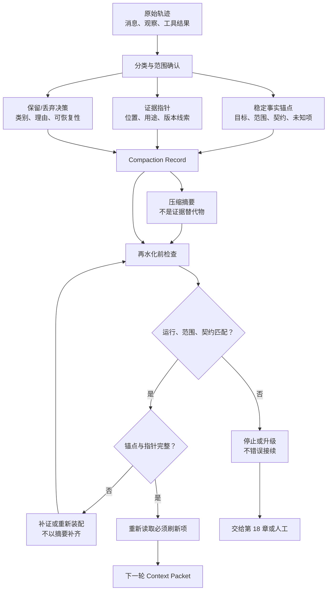

# 19. Context Compaction 与长任务：把轨迹压缩成可恢复的前提

> 长任务真正需要保留的不是“更多聊天记录”，而是下一位执行者继续判断所必需的目标、证据位置、未知项和停止条件。压缩（Context Compaction）若没有这些边界，只会把遗忘伪装成摘要。

## 本章目标

完成本章后，读者能够：

- 区分当前上下文选择、压缩、长期记忆写入、工作流恢复和任务验收，避免让一个摘要承担全部职责。
- 为长任务写出压缩记录（Compaction Record），包含摘要、稳定事实锚点、证据指针、保留/丢弃决策、再水化计划和损失检测。
- 在预算临界、阶段切换、交接和分支合并前选择压缩时机，而不是把 token 数当作唯一触发器。
- 在继续前检查运行身份、范围、契约版本、必需锚点和指针，把缺失、漂移与不确定性路由到补证、重新装配或停止。
- 用一个纯内存示例验证压缩记录的保守出口，而不将它误写成真实模型、文件系统或外部记忆的恢复能力。

## 为什么要学

一个跨多日的书稿审查任务会积累研究笔记、工具输出、草稿版本、链接检查结果、待核验引用和交接说明。把所有材料持续塞进下一轮模型输入，会让“当前要做什么”和“曾经发生过什么”纠缠在一起；只留下几句“已完成大半”的摘要，又会抹掉未决引用、版本冲突或尚未观察到的外部效果。

Anthropic 的工程文章将 Context Engineering 描述为维护推理时 token 集合的策略，并把长时程任务中的 compaction、结构化笔记和多 Agent 分工列为应对上下文污染的不同方法。[REF-068](19-context-compaction-and-long-running-tasks.references.md) 这是一篇厂商工程文章，不是通用协议；它提供的关键提醒是，保留与丢弃本身需要设计。

研究也不支持“模型可以接收更长输入，所以全部保留就更可靠”的直觉。Liu 等在多文档问答和键值检索实验中观察到，相关信息在输入中的位置变化会影响所测模型的表现，长输入中间位置尤其值得纳入评估。[REF-069](19-context-compaction-and-long-running-tasks.references.md) 这不能推出所有模型都会以同一方式退化，但足以要求工程师把“哪些内容在何处、何时重新装入”写成可检查条件。

本章不实现真实压缩服务、跨进程恢复、会话 API、向量检索、持久化记忆、重放或权限控制。第 6 章决定一次调用看什么；第 7 章决定记录能否跨任务保存；第 10 章处理状态机和检查点；第 17 章决定证据是否足以接受任务；第 18 章才选择重试、恢复、回滚或升级。

## 前置知识

- **前置章节：** 第 6 章的 Context Packet 和刷新边界；第 7 章的 Memory Record；第 10 章的 Workflow Contract、State Record 与 Checkpoint；第 15 章的观察新鲜度；第 17 章的证据与质量门。
- **技术前提：** 能阅读 Markdown 表格和简单的 JavaScript 对象；不要求使用任何特定模型或 Agent 平台。
- **不要求：** 本章不要求访问真实对话、源代码、文件、数据库、浏览器、网络、生产日志或模型 API。

> 注意：压缩记录能让恢复前提更清楚，不会自动保留原始数据、证明指针仍有效、授予读取权限或证明外部效果已经发生。

## 场景引入：接手者只看到“已经处理过”

假设一位 Agent 连续几天审查技术书的第 19 章。它已经比较过两个草稿、找到三个候选来源、运行过一次本地 Markdown 校验，但仍有一项引用需要重新读取。会话即将结束，系统生成摘要：“章节已完成研究和校验，可继续写作。”

这段话遗漏了四个会改变下一步动作的事实：当前章节范围、哪一条引用尚未核验、哪些工具输出只是重复文本、以及恢复时必须比对的契约版本。接手者若直接相信摘要，可能把旧草稿中的来源状态写成事实，或对错误的章节运行校验。

本章把案例改写为一份压缩记录。它把摘要降为导航层，并要求稳定事实锚点（stable fact anchors）、证据指针、保留/丢弃决定、再水化（rehydration）和损失检测各自承担责任。

**成功标准：** 恢复者能定位任务身份、范围、契约版本、未决项、证据位置与下一步核验，并能在它们缺失时停止接续。

**边界：** 案例中的章节、记录、路径和结果都是教学对象。本章不读取本仓库的实际聊天记录，不执行真实恢复，也不声称候选来源已被生产流程接受。

## 核心概念

### 压缩不是记忆，也不是恢复

五种常被混称为“上下文管理”的动作解决不同问题：

| 工件或动作 | 它回答的问题 | 本章如何使用 | 它不代表什么 |
| --- | --- | --- | --- |
| Context Packet | 此次模型调用要看哪些资料？ | 压缩后可作为下一轮装配的输入候选。 | 已保存为长期记忆或已获访问权。 |
| 压缩记录（Compaction Record） | 怎样带着最少必要前提进入下一轮？ | 本章的核心教学工件。 | 通用 schema、产品 API 或验收结论。 |
| Memory Record | 为什么保存、谁可读、何时失效？ | 压缩记录若要跨任务保存，必须另经第 7 章的写入门槛。 | 当前模型已经看见该记录。 |
| State Record / Checkpoint | 这一执行位于什么状态，恢复线索是什么？ | 再水化时需要重新比对它。 | 快照本身证明目标已经完成。 |
| Evaluation Spec | 哪些证据足以接受任务结果？ | 再水化后的新观察仍交给第 17 章判定。 | 可以自动选择重试或回滚。 |

MemGPT 论文的摘要以分层记忆中的数据移动类比有限上下文管理。[REF-023](19-context-compaction-and-long-running-tasks.references.md) 本书借用“不同层承担不同职责”的思路，但不复制其实现：一个文件指针、一个摘要和一个检查点在真实系统中可能具有不同的保留期、权限和一致性要求。

### 压缩记录：用字段保留证明责任

本书的 Compaction Record 不是把历史改写成一段更短的叙述，而是由六类字段组成的恢复协议：

| 字段 | 要回答的问题 | 教学示例 | 不能推出 |
| --- | --- | --- | --- |
| 压缩摘要 | 当前阶段和边界是什么？ | “研究完成，引用状态仍待重新读取。” | 引用已经正确或外部页面仍可访问。 |
| 稳定事实锚点 | 下一轮不能丢掉什么？ | 任务目标、范围、契约版本、已确认决定、未知项。 | 这些事实刚刚被重新观察。 |
| 证据指针 | 在授权后去哪里重新定位？ | 来源条目、状态快照、受控日志范围。 | 指针等于访问授权或目标一定存在。 |
| 保留/丢弃决策 | 为什么留下或删去一类内容？ | 保留未决引用；丢弃可重新定位的重复工具输出。 | 丢弃内容毫无价值或永不可恢复。 |
| 再水化计划 | 恢复者先做什么、验证什么？ | “先读来源位置，再核对契约版本。” | 已经执行了这些动作。 |
| 损失检测 | 如何发现摘要遗漏或错误接续？ | 检查必需锚点、指针和未知项。 | 一次检查覆盖所有将来变化。 |

这里的“稳定”不等于永远正确。它只表示恢复前必须显式检查的前提。例如“引用尚未核验”是稳定锚点，因为它不能被压缩器改成“引用已完成”；而一段重复的命令输出若能由受控指针重新定位，可以被标记为可丢弃。

### 压缩触发：预算只是信号，不是唯一规则

token 预算临界是常见触发，但不能单独决定何时压缩。更可审查的触发包括：

1. **阶段边界：** Research 完成、Draft 开始或一次人工审批结束时，已有明确的输入输出契约。
2. **交接边界：** 会话、执行器或责任人变化前，需要把下一步从聊天历史中移到工件。
3. **分支边界：** 两个候选方案各自试验后，应记录共同锚点和分支差异，避免将一条分支的结论误接到另一条。
4. **恢复边界：** 外部效果未知、版本变更或证据冲突时，先冻结当前叙述并记录未知范围，不要压缩成乐观结论。
5. **预算边界：** 模型可见材料接近任务设定的预算时，优先清理重复输出、指针化大对象，再审查是否需要摘要。

来源文章强调高信号、紧凑的上下文，而不是“越短越好”。[REF-068](19-context-compaction-and-long-running-tasks.references.md) 本书的对应建议是：不要为了达到 token 目标而删除任务目标、未决项、契约版本或证据定位；这些字段常比冗长轨迹更能减少错误接续。

### 稳定事实锚点与证据指针：让摘要能被质疑

一个锚点至少应包含标识、当前陈述和对应指针。对于尚未确认的内容，应保持 `uncertain` 或等价的未知状态，并为其增加专属损失检查。例如：

```text
anchor.id: unknown-citation
anchor.statement: “第二项候选来源尚未按当前版本重新读取。”
anchor.pointerId: source-evidence
lossCheck: uncertain_anchor:unknown-citation
```

这比在摘要里写“来源大致没问题”更保守。指针也应有用途和范围：`records/citation-brief.md` 只是教学位置，不代表任何系统都允许读取它。真实环境仍须经过工具协议、Sandbox、数据最小化和审批边界。

### 再水化与损失检测：恢复前先验证前提

再水化不是把摘要原样贴回模型输入，而是重新装配下一轮所需材料。本书建议按以下顺序做检查：

1. **核对身份：** 记录的运行标识与任务范围是否匹配？不匹配时不能拼接。
2. **核对契约：** 记录中的契约版本是否仍与当前任务一致？不同版本需要回到当前规则或状态重新装配。
3. **检查锚点：** 必需目标、决定和未知项是否存在？摘要不能补写缺失锚点。
4. **解析指针：** 在被允许时定位证据；无法定位时保留缺失，而不是用模型记忆补全。
5. **刷新易变信息：** 重新读取需要更新的来源、状态或评估记录；新观察仍由第 15、17 章处理。
6. **路由结果：** 只有前提完整时才输出“可进入下一轮”；证据缺失、需要再水化、丢弃不明或身份冲突分别走不同出口。

这套顺序是本书工程模型。它不保证指针目标真实存在，也不替代第 18 章的恢复策略。它的价值在于把“我记得上次已经处理过”变成可被反驳的检查链。

### 白盒参考：pi 公开的 compaction 设计

上文的字段与检查顺序是本书工程模型；要看类似职责在真实系统中如何落地，可以对照一份公开的参考实现。开源极简编码代理 pi（由 Mario Zechner 开发，MIT 协议）把自身的压缩设计写成了公开文档，是目前少见的全文档化 compaction 实现。[REF-148](https://github.com/earendil-works/pi) 本小节的机制描述全部取自其官方 compaction 文档；实现细节随版本变化，均以访问日（2026-07-26）文档为准。[REF-152](https://github.com/earendil-works/pi/tree/main/packages/coding-agent/docs)

**触发与切割。** 按该文档，pi 的自动压缩与手动压缩并存，切割位置有明确规则：

1. 自动触发条件是 `contextTokens > contextWindow − reserveTokens`，默认 `reserveTokens` 为 16384、`keepRecentTokens` 为 20000；两者均可配置，自动压缩也可以整体关闭。
2. 手动 `/compact` 命令可附自定义指令，让使用者在压缩前指定这次摘要应强调什么。
3. 切割发生在轮次（turn）边界，绝不把一次工具调用（tool call）与其对应的工具结果（tool result）拆开；单个轮次超出预算时执行拆分轮次（split-turn）处理——先拆成两段分别摘要，再合并结果。

**摘要与延续。** 压缩产物不是自由叙述，而是有固定形状的记录：

1. 摘要是结构化模板，固定分区为 Goal / Constraints / Progress / Key Decisions / Next Steps / Critical Context，外加已读文件（read-files）与已修改文件（modified-files）两份清单。
2. 多次压缩时，文件操作记录跨压缩累积，不会因为二次压缩丢失“读过、改过哪些文件”。
3. 扩展可以通过 `session_before_compact` 钩子取消一次压缩，或完全接管压缩过程；接管语义中包含溢出恢复时的重试。

这两组规则合起来，把“压缩后剩下什么、丢掉什么、边界在哪里”变成可以从文档预测的行为，而不是摘要器的临场发挥。

把这些设计点与本章的 Compaction Record 并排，可以看清哪些职责已有公开实现对应、哪些是本书额外要求的证据项。下表是本书的工程对照，不是 pi 文档的自我描述：

| pi 公开设计（归属其文档） | 对应本章字段或时机 | 本书额外要求的证据项 |
| --- | --- | --- |
| 结构化摘要模板（Goal / Constraints / Progress / Key Decisions / Next Steps / Critical Context） | 压缩摘要与稳定事实锚点：目标、约束、决定、下一步各有固定位置 | 未知项须保持 `uncertain` 状态并配专属损失检查，不允许被改写成完成态 |
| read-files / modified-files 清单，且跨压缩累积 | 证据指针：可重新定位的材料位置，不因二次压缩丢失 | 指针要有用途与范围说明，且不等于访问授权 |
| 轮次边界切割，工具调用与工具结果不拆开 | 保留/丢弃决策的完整性约束：动作与其观察成对处理 | 每类丢弃要有类别、理由与可恢复性，无理由丢弃进入人工复核 |
| 自动触发公式与可配置阈值 | 压缩触发中的预算边界 | 阶段、交接、分支、恢复边界同样是触发器，预算只是信号之一 |
| 手动 `/compact` 附自定义指令 | 交接边界与再水化计划：交接前指定摘要侧重点 | 计划还要写明不能继续的条件与移交对象 |
| `session_before_compact` 钩子可取消或接管压缩 | 本章未内建对应扩展点 | 接管方产出的记录仍应通过身份、契约、锚点与指针检查 |

这份对照说明两件事。第一，compaction 可以是被文档化、可检查的子系统：触发条件、默认阈值、切割规则和摘要形状全部公开，使用者能够预测“压缩后剩下什么”，并在结果不符合预期时指出偏差——这正是本章要求的“摘要能被质疑”。其中结构化模板与跨压缩累积的文件清单，分别对应“锚点有固定位置”与“证据定位不因二次压缩丢失”两个要求。

第二，公开实现不天然覆盖恢复侧职责。模板保证了摘要的形状，但形状正确不等于内容可信：恢复前的身份、契约与指针核对、丢弃审查与损失检测，是本书在这类参考实现之外仍然要求的证据项。pi 文档描述的是压缩如何发生，而本章的检查链回答的是压缩结果能否被接续。

使用这份对照时有四个限定：

- **归属：** 上述机制描述均归属 pi 官方文档；本章的字段命名、状态码与检查顺序是本书模型，不来自该文档。
- **版本：** 默认阈值、命令名与钩子名都是动态产品细节，引用或复现前应重新查看当日文档。
- **范围：** 本小节只对照压缩机制本身；该实现的其他设计不在本章讨论范围。
- **不外推：** pi 的设计不证明本章检查已被任何实现采用，也不证明结构化模板能防止摘要内容出错；反向同样成立——本章的额外要求不构成对该实现的缺陷判定。

本书由此延伸出一条可执行的评估建议：评估任何 harness 的压缩能力时，先要求它回答这份清单级别的问题——何时触发、在哪里切割、摘要是什么形状、二次压缩会丢失什么、压缩能否被审查或接管。答不出这些问题的压缩机制，就是把遗忘伪装成摘要的黑盒。

## 架构图：从轨迹到可恢复的下一轮上下文

下图回答：一段原始轨迹经过什么中间工件，才可以成为下一轮模型输入的候选？



图中 `Summary` 进入再水化检查，但没有直接通往 `Context Packet`。这是本章最重要的限制：摘要只提供导航；身份、版本、锚点、指针和刷新条件仍须通过。`Stop` 也没有自动返回轨迹，因为外部效果未知、范围错配或契约冲突时，继续压缩或重试可能放大错误。

发布源文件见 [chapter-19-context-compaction-recovery.mmd](../../diagrams/mermaid/chapter-19-context-compaction-recovery.mmd)，导出图见 [SVG](../../diagrams/exported/chapter-19-context-compaction-recovery.svg) 与 [PNG](../../diagrams/exported/chapter-19-context-compaction-recovery.png)。

## 工作流程：把“继续对话”改成可检查的交接

1. **冻结范围：** 记录本次运行、目标、范围、契约版本和当前阶段；若不知道权威状态在哪里，先停止并查证。
2. **分类材料：** 将原始轨迹分成稳定前提、可重新定位的证据、暂时细节、冲突或未知项；不要因为材料冗长就把未知项删除。
3. **建立锚点与指针：** 每个必需锚点都关联一条有用途的证据指针；敏感材料只保留最少说明和受控位置。
4. **写下保留/丢弃决定：** 标明为什么保留或删去某类材料，以及删去后能否重新定位。无理由的丢弃进入人工复核。
5. **写再水化计划：** 指定恢复者的下一动作、需要刷新的资料、不能继续的条件和交给谁处理。
6. **执行损失检测：** 比对身份、范围、契约版本、锚点、指针与不确定项。缺证据时输出缺证，而不是从摘要推断。
7. **装配下一轮：** 只有检查通过后，才把摘要、必要锚点和已解析的最小材料组成新的 Context Packet。结果仍不是任务验收。

## 最小示例：纯内存 Compaction Record 判定

完整示例位于 [examples/agent/context-compaction-assessment.mjs](../../examples/agent/context-compaction-assessment.mjs)。它只检查调用者明确传入的教学对象：

```js
import { assessCompactionRecord } from './examples/agent/context-compaction-assessment.mjs';

const conclusion = assessCompactionRecord({
  run: {
    id: 'book-review-run-19',
    scope: 'chapter-19-review',
    contractVersion: '2026-07-16',
  },
  record: {
    runId: 'book-review-run-19',
    scope: 'chapter-19-review',
    contractVersion: '2026-07-16',
    summary: '保留目标、决定、未知项和恢复条件。',
    anchors: [/* 每项关联证据指针 */],
    pointers: [/* 受控再定位线索 */],
    retained: [/* 保留理由 */],
    discarded: [/* 丢弃类别与理由 */],
    resumption: { nextAction: '先重新读取来源', mustVerify: ['unknown-citation'] },
    lossChecks: ['required_anchors_present'],
  },
  policy: {
    requiredAnchorIds: ['goal', 'decision-source', 'unknown-citation'],
    allowedDiscardKinds: ['redundant_tool_output', 'superseded_draft'],
    requiredPointerKinds: ['evidence'],
  },
});
```

**运行前提：** 从仓库根目录执行，Node.js 支持内置 `node:test`；不需要网络、账户、密钥、环境变量、真实对话、文件读取或写入。

**验证命令：**

```bash
node --test examples/agent/context-compaction-assessment.test.mjs
node examples/agent/context-compaction-assessment.mjs
```

**实际结果：** 真实红灯、绿灯、测试数和演示输出记录在[示例整合审查](../../.memory/reviews/2026-07-16-chapter-19-example-integration.md)。

**限制：** 函数不会压缩 token、读取聊天、检查文件是否存在、解析路径、调用模型、访问外部记忆、运行工作流或确认外部效果。它只说明注入的记录是否满足本书教学检查。

## 逐步增强：先保护恢复前提，再接入真实系统

1. **增加结构化理由：** 从一个布尔摘要扩展为锚点、指针、丢弃理由和状态码。升级触发是接手者无法说明缺什么。
2. **加入版本与刷新规则：** 在真实系统中记录工件版本、观察时间和来源范围。升级触发是旧摘要与当前规则可能冲突。
3. **接入受控再定位：** 只在工具协议、权限和数据最小化已定义时解析文件、数据库或检索指针。升级触发是需要重新读取原始材料。
4. **接入恢复策略：** 将身份冲突、效果未知或证据缺失交给第 18 章的明确策略。升级触发是任务要重试、补偿、回滚或人工升级。

不要从第一步直接跳到“把全部对话保存为长期记忆”。这会跳过第 7 章的生命周期和访问审查，也会把原始噪声、敏感信息和过时假设带入未来任务。

## 完整工程案例：多日书稿审查的恢复包

下面的案例是教学设计，不代表本书仓库实际执行了这些步骤。

**背景：** 一章书稿已经完成 Research Brief 和初稿，但一条动态产品资料需要在发布前重新核验。原始轨迹含有重复的命令输出、两个已被替换的段落和一次未完成的图示审查。

**约束：** 恢复者不得根据摘要宣布引用已核验；不得复制原始页面内容、个人数据或凭证；若章节范围或规则版本变化，必须重新装配上下文。

| 内容类别 | 决策 | 理由 | 恢复时的行为 | 不能推出 |
| --- | --- | --- | --- | --- |
| 章节目标与范围 | 保留为锚点 | 防止错误接续到别章 | 先比对 `runId` 与 `scope` | 目标已经完成。 |
| 待核验引用 | 保留为 `uncertain` 锚点和证据指针 | 不让摘要覆盖未知项 | 重新读取当前来源后再交给评估 | 来源当前仍可访问。 |
| 当前契约版本 | 保留为锚点 | 规则变化会改变恢复条件 | 与当前规则比对 | 版本兼容或已迁移。 |
| 重复工具输出 | 丢弃并记录理由 | 可由受控原始材料再次定位 | 只有需要诊断时再读取 | 原始命令已被真正重跑。 |
| 已替换草稿措辞 | 丢弃为 `superseded_draft` | 更高版本工件是当前候选 | 指向当前草稿而非粘贴旧段落 | 新草稿事实正确。 |
| 图示审查未完成 | 保留为下一动作 | 它是明显未决项 | 先导出/核对图源再继续 | 图已经可发布。 |

这个案例的关键不是把记录写得长，而是让恢复者能够拒绝一个危险的捷径：如果 `unknown-citation` 锚点、`source-evidence` 指针或当前契约版本任一缺失，就不能用“研究已完成”继续写作。

### 实现说明

`assessCompactionRecord` 的输入只有 `run`、`record` 和 `policy`。函数不相信摘要本身，而按如下顺序判断：记录是否有最小形状、是否属于当前任务、契约是否一致、必需指针类别是否存在、必需锚点是否存在且能定位、丢弃是否有允许类别和理由、不确定锚点是否有专属损失检查。

| 决策 | 本书选择 | 原因 | 替代方案与边界 |
| --- | --- | --- | --- |
| 身份错配 | `blocked` | 避免把另一任务的摘要拼到当前运行 | 真实系统可用签名或版本图，但仍需明确定义等价关系。 |
| 契约不匹配 | `needs_rehydration` | 规则变化时重新装配比延续旧叙述更保守 | 不等于自动迁移或真实重放。 |
| 锚点断指针 | `needs_rehydration` | 摘要无法代替可审查材料 | 指针能解析后仍要检查权限和新鲜度。 |
| 无理由丢弃 | `needs_review` | 让选择性遗忘可被审查 | 不强制所有原始材料永久保存。 |
| 不确定锚点 | 要求专属损失检查 | 未知项最容易在摘要中被弱化 | 检查通过也不等于未知已解决。 |

## 测试与验证

| 层级 | 验证对象 | 命令或方法 | 成功标准 | 实际状态 |
| --- | --- | --- | --- | --- |
| 单元 | 纯内存 Compaction Record 判断 | `node --test examples/agent/context-compaction-assessment.test.mjs` | 九条教学路径的状态与代码精确匹配 | 已执行，详见示例整合审查。 |
| 演示 | 可进入下一轮的教学记录 | `node examples/agent/context-compaction-assessment.mjs` | 输出 `ready_to_resume` / `compaction_record_ready` | 已执行，详见示例整合审查。 |
| 图示 | Mermaid 源、SVG、PNG 与正文图块 | Mermaid CLI、`diff -u` 与 PNG 人工查看 | 图源一致且边界出口可读 | 已执行，详见图示审查。 |
| 局部文档 | 本章 Markdown 与链接 | markdownlint、markdown-link-check | 命令退出码为 0 | 已执行，详见终审。 |
| 真实压缩/恢复 | 模型、会话、文件、数据库、工具和外部效果 | 不在本章运行 | 不适用 | 未执行；明确排除。 |

> 风险：本地单元测试证明的是教学函数对注入对象的判断，不证明实际模型摘要没有遗漏、指针可访问、文件可读、记忆已写入、工作流可恢复或外部操作没有副作用。

## 工程实践

- **将摘要视为派生物。** 当摘要与新的 Observation Record 或当前工件冲突时，保留冲突并回到可审查材料；不要让旧摘要赢得争论。
- **让未知项具名。** “尚不确定”应有 ID、范围、指针和下一项核验，而不是藏在“待后续确认”的段尾。
- **丢弃也要有证据。** 对每类被移除的材料记录类别、理由、是否可重新获取及风险，尤其不要静默丢掉原始错误、批准记录或效果未知信息。
- **将恢复测试纳入任务验收。** 对关键工作流，故意删除锚点、断开指针或改变版本，确认系统能够停止而不是继续编造上下文。
- **分离内容压缩和访问控制。** 指针化可以减少模型输入，但无法替代对文件、网络、账户、敏感数据和保留期的真实控制。

## 最佳实践

- 从“下一位执行者必须回答什么”反推锚点，而不是从“哪些句子看起来重要”挑选摘要。
- 用任务 ID、范围和契约版本绑定压缩记录；当任一项不同，默认重新装配而不是拼接。
- 对未决、冲突、外部效果未知和高风险决定优先保留原始定位与停止条件，而不是过度概括。
- 将可刷新资料与稳定前提分开。来源版本、测试结果和外部状态常需重新观察；任务范围和未知项则必须显式携带。
- 先验证记录完整性，再让模型继续生成。生成语言的流畅性不能取代损失检测。

## 常见错误

| 错误 | 表现 | 根因 | 修复方向 |
| --- | --- | --- | --- |
| 只保存一段摘要 | 接手者不知道范围、版本和未决项 | 把流畅叙述当作状态 | 增加锚点、指针、再水化计划和损失检查。 |
| 将摘要当证据 | “已核验”没有来源位置 | 派生文本覆盖原始观察 | 为每个可归因结论保留证据指针并重新读取。 |
| 无理由清理轨迹 | 错误、批准或未知效果消失 | 只以 token 数做优化 | 记录丢弃类别、理由、可恢复性和风险。 |
| 错任务接续 | A 章节的结论进入 B 章节 | 缺少身份、范围或契约比对 | 默认 `blocked`，重新装配当前上下文。 |
| 以旧版本恢复 | 新规则已变但继续沿用旧摘要 | 把 Checkpoint 当作正确性证明 | 契约不匹配时要求再水化和重新评估。 |
| 把指针当权限 | Agent 因看见路径而读取敏感材料 | 目录或 URL 被误解为授权 | 将实际访问交给工具、Sandbox、审批和审计。 |

## 安全与边界

- **数据边界：** 不要把密钥、Cookie、个人数据、完整原始日志或不可信外部文本复制进摘要。只保留恢复所需的最小说明、脱敏字段和受控指针。
- **权限边界：** Compaction Record 不授予文件、网络、账户、数据库或工具访问权；解析指针仍需要第 11、12、14、41 章的相应控制。
- **完整性边界：** 摘要可能遗漏、误解或被污染。关键锚点应由独立来源、当前版本或人工复核支持，而不是被模型自述确认。
- **恢复边界：** `blocked`、`needs_evidence` 和 `needs_rehydration` 不是失败的同义词，也不自动授权重试。是否重试、补偿、回滚或升级属于第 18 章或人工策略。
- **不适用范围：** 本章不提供分布式一致性、加密存储、审计留存、法律保全、灾难恢复、跨组织访问或真实模型性能保证。

## 章节总结

压缩的目标不是获得最短历史，而是保存下一轮判断的最小前提。一个可信的 Compaction Record 要把摘要、稳定事实锚点、证据指针、保留/丢弃决策、再水化计划和损失检测分开；这样，恢复者才能知道什么可以继续、什么必须重读、什么仍未知，以及何时应停止。

第 20 章将讨论长期运行 Agent 是否可以依据这些记录修改自己的规则、技能或工作流。答案不能只是“能学习就让它学习”：任何改进仍需要隔离、评估、批准、版本化和回滚。

## 练习

1. 为一次 API 迁移任务写一份 Compaction Record：列出三个稳定锚点、两个证据指针、一条可丢弃材料和一条不能自动恢复的未知项。
2. 某摘要写着“数据库迁移已完成”，但它没有迁移版本、目标环境或验证记录。写出你会创建的锚点、指针和停止条件。
3. 选择一个你常用的长任务，分别指出哪些材料属于 Context Packet、Memory Record、State Record 和 Compaction Record；说明为什么不能把它们合并成一个“记忆文件”。
4. 修改示例输入，使 `unknown-citation` 的指针断开或契约版本变化，解释为什么应进入 `needs_rehydration` 而不是继续生成下一步。

## 延伸阅读

- [REF-068：Anthropic, *Effective context engineering for AI agents*](https://www.anthropic.com/engineering/effective-context-engineering-for-ai-agents)，用于了解其对 token 策展、长时程任务与 compaction 的工程观点；2026-07-16 读取，产品细节发布前须重查。
- [REF-023：MemGPT v2](https://arxiv.org/abs/2310.08560v2)，用于理解分层上下文管理的研究背景；不将其实现外推为本章协议。
- [REF-069：Lost in the Middle v3](https://arxiv.org/abs/2307.03172v3)，用于理解相关信息位置应纳入长上下文评估的实验背景；不使用固定性能结论。

## 参考资料

- [REF-068](19-context-compaction-and-long-running-tasks.references.md)：支持厂商工程文章对 Context Engineering、长任务压缩和结构化笔记的限定讨论。
- [REF-023](19-context-compaction-and-long-running-tasks.references.md)：支持分层管理有限上下文的研究背景。
- [REF-069](19-context-compaction-and-long-running-tasks.references.md)：支持相关信息位置影响所测长上下文实验表现的限定陈述。

## 章节完成检查表

- [x] Front matter、目标、前置知识、章节依赖和交叉引用完整。
- [x] 内容为原创表达；来源观点、研究背景与本书工程模型已区分。
- [x] 可归因事实映射到 REF-068、REF-023 与 REF-069，动态产品信息未写成稳定事实。
- [x] Mermaid 源码、读图说明、导出链接和一致术语完整。
- [x] 纯内存示例有环境、命令、真实运行记录入口和无外部 I/O 边界。
- [x] 技术、示例、图示、事实、语言和终审记录已建立。
- [x] 局部 Markdown、链接、示例与图示命令已实际运行，结果见终审记录。
- [ ] 主线程登记正式引用、术语和共享校验入口，并更新全局项目状态。
