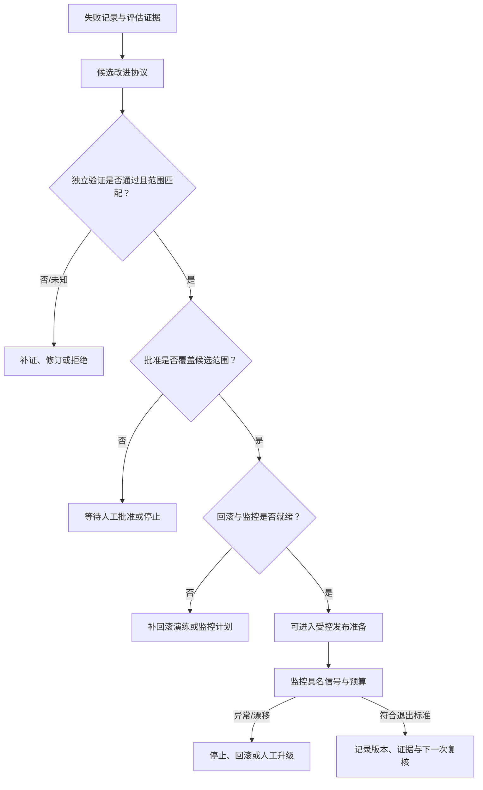

# 20. 自改进的工程边界与长期运行 Agent：候选不等于发布

> 自改进不是 Agent 在一次失败后自动重写自己；它是把候选变更放进独立验证、范围批准、监控和回滚边界中的工程流程。

## 本章目标

完成本章后，读者能够：

- 区分失败观察、反思假设、候选改进、受控发布准备和已发布效果。
- 为 Prompt、Skill、工作流或重试策略建立候选改进协议（Candidate Change Protocol）。
- 说明独立验证、范围批准、具名监控和可回滚性为何不能相互替代。
- 为长期运行任务设置版本、预算、漂移、所有者、停止与升级条件。
- 识别“测试通过就自动改生产”“模型认为更好就覆盖基线”等不受控自改进模式。

## 为什么要学

第 16 章的反思可以把一次失败整理成可证伪的候选；第 17 章可以判定某项任务是否具有足够证据。两者仍不能推出“现在可以改 Harness”。一段失败轨迹也许来自临时网络问题、陈旧上下文、评估器误判或范围外样本。即使候选在一个固定集上通过，也可能牺牲权限边界、成本预算或另一个任务族。

Lilian Weng 的文章把 Harness 讨论为连接模型、执行、工具、上下文、工件与评估的系统，并将候选提出、评估和接受视为研究自改进的一种组织方式。[REF-001](20-self-improvement-boundaries-and-long-running-agents.references.md) 这给出研究背景，不是发布许可。本文不把文章中的预测、论文结果或产品例子写成本书系统已经具备的能力。

本章也不提供递归训练、模型权重更新或无人值守运行方案。它只回答一个较窄的问题：如果一个 Agent 提出了改变 Harness 的建议，工程团队应当先要求哪些可审查工件？

## 前置知识

- **前置章节：** 第 16 章的 Reflection Record、第 17 章的 Evaluation Spec、 第 18 章的恢复状态和第 19 章的长期上下文记录。
- **技术前提：** 能阅读对象字段、Markdown 表格和 Node.js 纯函数测试。
- **不要求：** 不要求接入模型训练、特征开关、监控平台、发布系统、数据库、生产权限或后台 Agent。

> 注意：候选被标为“可进入受控发布准备”不表示它已经发布、已经观察到真实效果或能够安全回滚。它只表示输入工件满足本章的教学变更门。

## 场景引入：重试策略的候选为何不能自行上线

假设文档研究 Agent 在多次任务中遇到资料下载失败，于是提出：“把重试等待时间加长，并在第一次失败后自动切换来源。”这个建议可能合理，也可能掩盖了权限错误、来源不可靠、重复副作用或输入范围变化。

如果 Agent 直接改写重试策略，它同时改变了成本、等待时间和外部请求行为。正确的问题不是“新策略看起来是否聪明”，而是：候选只覆盖哪个环境？由什么独立检查确认它改进了什么？谁批准其影响范围？运行后看哪些信号？出现异常时能退到哪一个版本？

**成功标准：** 候选在进入任何受控发布前，具有明确范围、独立验证、相符批准、具名监控和已准备的回滚工件。

**边界：** 本章的案例不请求网页、不运行重试、不切换来源、不修改本仓库规则，也不接触任何生产环境。

## 核心概念

### 候选改进（Improvement Candidate）：先把“想法”变成可拒绝的工件

本书把候选改进定义为针对一个版本化目标的、有限范围的变更提议。它至少包含基线、拟议变更、作用范围、预期改善、可能损失和判定方式。没有这些字段，“让 Agent 变得更好”只是愿望，无法复核，也无法在失败后准确回退。

| 状态 | 含义 | 不能推出 |
| --- | --- | --- |
| 反思假设 | 从轨迹中发现可能的模式 | 模式是真因，或应修改系统。 |
| 候选改进 | 假设被写成带范围和基线的提议 | 已经评估、获批或发布。 |
| 独立验证通过 | 指定范围内的检查明确通过 | 已取得更大范围的授权。 |
| 受控发布准备 | 验证、批准、监控和回滚工件齐备 | 真实环境已部署或稳定。 |
| 发布后观察 | 在实际批准范围内收集信号 | 改善由候选单独造成，或可永久保留。 |

Google SRE 对 Canary 的讨论将其限定为部分且限时的变更与评估，用来决定是否继续发布，并强调可归因监控信号和小而自包含的变更。[REF-009](20-self-improvement-boundaries-and-long-running-agents.references.md) 本书借用的是“先缩小暴露面、再观察”的工程思想；它不指定 Agent 流量、比例、SLO 或任何真实发布机制。

### Candidate Change Protocol：把变化、责任和退出条件写在同一处

一个教学协议可以包含以下字段：

| 字段 | 要回答的问题 | 教学例子 | 不能代表什么 |
| --- | --- | --- | --- |
| `id` 与目标 | 改哪一项 Harness 工件？ | `retry-policy-backoff-v2`，目标为重试策略 | 已存在的真实版本或配置。 |
| 基线与范围 | 与什么比较，在哪个边界内？ | 只比较固定教学输入、`staging-only` | 对生产或所有任务都适用。 |
| 拟议变更 | 行为如何变化？ | 对确认的瞬态失败增加有上限的等待 | 已运行外部请求。 |
| 独立验证 | 谁或什么检查预期改善与副作用？ | 与候选分离的固定检查记录 | 统计因果结论或真实压测。 |
| 批准 | 谁允许哪个范围？ | 对 `staging-only` 的明确批准 | 继承到其他环境或权限。 |
| 监控与预算 | 运行时看什么、何时停止？ | `failure-rate`、`recovery-latency` 与次数上限 | 已接入监控系统。 |
| 回滚 | 回到什么版本、前提是什么？ | 已测试的基线恢复步骤 | 在任何副作用后都能恢复数据。 |

来源中的 NIST AI RMF Core 在自愿风险管理语境讨论持续风险管理、明确角色责任、上线后监控、事件恢复、变更管理与可测量的持续改进。[REF-070](20-self-improvement-boundaries-and-long-running-agents.references.md) 上表的字段和状态是本书工程模型，并非 NIST 提供的 Agent 协议或合规清单。

### 变更门（Change Gate）：验证、批准、监控和回滚各自回答不同问题

四类工件的逻辑不能压缩成一个绿色勾选：

- **独立验证**回答“在约定范围内，候选是否满足指定检查”。它不授予执行权限。
- **范围批准**回答“由谁允许这一范围的下一步”。它不能替代失败证据。
- **监控计划**回答“进入受控范围后，怎样观察偏差、漂移和资源耗尽”。它不证明当前结果正确。
- **回滚就绪**回答“异常后是否存在已知的停止/恢复方向”。它不保证所有外部副作用都可逆。

Google 的配置设计资料讨论配置与结果数据分离、变更追踪、所有权、渐进应用与回滚能力。[REF-071](20-self-improvement-boundaries-and-long-running-agents.references.md) 本书因此要求候选拥有可识别目标、范围和退出条件；这只是类比，不把配置实践等同于 Agent 变更安全。

## 架构图：候选变更必须经过哪些门

下图回答：失败证据如何在不自动发布的前提下，变成可审查的候选变更？所有节点都是本书的工程模型；`可进入受控发布准备`不是执行动作。



读图时先看左侧证据：它只能产生候选，不直接到达发布。中间三道门分别检查验证、批准和准备度。右侧监控产生的是后续观察；异常仍应回到停止、回滚或人工升级，而不是让 Agent 用新的候选覆盖告警。

发布源文件见 [chapter-20-improvement-change-gate.mmd](../../diagrams/mermaid/chapter-20-improvement-change-gate.mmd)，导出图见 [SVG](../../diagrams/exported/chapter-20-improvement-change-gate.svg) 与 [PNG](../../diagrams/exported/chapter-20-improvement-change-gate.png)。

## 工作流程：从失败记录到可停止的长期循环

1. **冻结观察范围：** 记录任务、版本、环境边界和失败证据；输出是可审查的 Reflection Record 或 Evaluation Spec 结论。
2. **提出有限候选：** 指定一个目标、一个拟议变更和一个比较基线；若候选要求扩大权限、接触敏感数据或改变不可逆行为，停止并交给人工风险审查。
3. **独立验证：** 让候选之外的检查器、固定任务集或人工 Rubric 比较基线和候选。未知、冲突或范围不匹配的结果只能补证，不能当作通过。
4. **请求范围批准：** 批准必须指出候选 ID 与适用范围；通过测试、旧批准和 Agent 自我报告均不能替代它。
5. **准备恢复与观察：** 写出回滚目标、已知不可逆项、具名监控信号、预算、观察窗口和停止条件。
6. **进入受控发布准备：** 只有上述工件齐备时，才由具备权限的外部流程决定是否执行。本章函数不会执行该流程。
7. **长期复核或退出：** 发生漂移、预算超限、所有者缺失、证据过期或异常时，停止、回滚或人工升级；符合退出标准后记录版本、证据和下一次复核日期。

## 最小示例：纯内存候选变更门

完整示例位于 [examples/agent/self-improvement-boundary-assessment.mjs](../../examples/agent/self-improvement-boundary-assessment.mjs)。它读取已注入的候选、验证、批准和准备度记录：

```js
const conclusion = assessImprovementChange({
  candidate: {
    id: 'retry-policy-backoff-v2',
    target: 'retry-policy',
    scope: 'staging-only',
    proposedChange: 'increase bounded backoff after independently verified transient failures',
  },
  evidence: {
    independentValidation: { status: 'passed', scope: 'staging-only' },
    rollback: { available: true, tested: true },
    monitoring: { metrics: ['failure-rate', 'recovery-latency'] },
  },
  approval: { status: 'approved', scope: 'staging-only' },
});
```

**运行前提：** 从仓库根目录运行，Node.js 支持内置 `node:test`；不需要网络、账户、密钥、环境变量、文件写入或任何真实发布系统。

**验证命令：**

```bash
node --test examples/agent/self-improvement-boundary-assessment.test.mjs
node examples/agent/self-improvement-boundary-assessment.mjs
```

**实际结果：** 10 项 Node 内置测试通过；演示输出 `ready_for_controlled_release`。详情见[示例整合审查](../../.memory/reviews/2026-07-16-chapter-20-example-integration.md)。

**限制：** 函数不验证监控系统、不检查真实回滚、不发出部署请求，也不修改重试策略。它只说明输入对象是否满足本书最小变更门。

## 逐步增强：从候选判断到真实治理

1. **保留基线和比较协议：** 真实系统要保存版本、输入集、评估器与已知不覆盖范围。升级触发是团队无法解释“改善”相对于什么。
2. **引入隔离与最小权限：** 将候选放进独立环境或干运行路径，并把批准范围与工具权限绑定。升级触发是候选会接触真实数据、不可逆效果或其他团队资产。
3. **引入发布后观察：** 为变更建立版本标签、监控信号、告警路由、预算和人工所有者。升级触发是运行持续跨越会话或值班周期。
4. **建立退役和复审：** 规则、模型、数据、依赖或目标改变时，重新评估旧候选；没有所有者或证据的长期任务应停止，而非“继续学习”。

## 完整工程案例：受限的重试策略改进

下表是教学案例，不代表本仓库或外部系统执行过网络请求、重试、发布或回滚。

| 阶段 | 允许动作 | 必需工件 | 阻止或升级条件 |
| --- | --- | --- | --- |
| 发现 | 汇总多个已关联的失败记录 | 失败范围、基线版本、反例 | 记录缺关联、范围跨任务或无法区分权限/网络错误。 |
| 候选 | 提出“仅在确认瞬态失败时增加有上限的退避” | Candidate Change Protocol、成本上限 | 候选会增加权限、绕开来源核验或隐藏错误。 |
| 验证 | 在固定教学输入上对比基线和候选 | 独立验证、失败/未知出口 | 验证器与提议器没有独立性，或信号不匹配范围。 |
| 批准 | 审阅 `staging-only` 的下一步 | 候选 ID、范围、责任人 | 批准缺失、过期或被要求扩展到生产。 |
| 受控发布准备 | 准备监控、预算和回滚 | 指标、停止条件、回滚演练 | 无法说明异常后如何停止或恢复。 |
| 长期复核 | 复核漂移、资源和所有者 | 版本、健康记录、下次复核点 | 预算超限、证据过期、责任人缺失或高风险变化。 |

关键决定是把“重试策略更好”拆成多个可否决问题。即使固定验证显示候选通过，也不能跳过范围批准；即使批准已给出，也不能省略回滚和监控。若重试行为会影响外部副作用，优先回到第 18 章审查幂等性、恢复记录和人工升级，而不是把它包装成“自改进”。

## 实现说明

`assessImprovementChange` 的顺序刻意保守：先检查候选规格，再判断独立验证的明确失败、未知或范围不匹配；随后检查批准及其范围，最后检查回滚和监控。这个顺序使“没有证据”和“证据失败”保持不同出口，也避免测试通过自动获得批准。

| 决策 | 选择 | 原因 | 替代方案与边界 |
| --- | --- | --- | --- |
| 验证主语 | 要求 `independentValidation` | 不让候选自身的解释构成唯一证据 | 真实独立性需要组织、隔离、评估器和数据设计；本例只用字段表达。 |
| 授权主语 | 明确 `approval.scope` | 防止 staging 批准被推断为生产批准 | 真实审批还需身份、时效、审计和撤销规则。 |
| 恢复要求 | `available` 且 `tested` | “有回滚想法”不足以进入准备状态 | 外部副作用可能无法撤回，必须单独建模补偿或人工处置。 |
| 输出 | 只返回状态与代码 | 保持示例为判断器，不把它伪装成发布器 | 真实系统需要把工件交给受控执行器。 |

## 测试与验证

| 层级 | 验证对象 | 命令或方法 | 成功标准 | 实际状态 |
| --- | --- | --- | --- |
| 单元 | 纯内存变更门 | `node --test examples/agent/self-improvement-boundary-assessment.test.mjs` | 10 条候选、验证、批准、回滚和监控路径精确匹配 | 已执行，10 项通过。 |
| 演示 | 完整教学输入 | `node examples/agent/self-improvement-boundary-assessment.mjs` | 输出受控发布准备状态，不含发布字段 | 已执行。 |
| 图示 | Mermaid 源、SVG、PNG 与正文图块 | Mermaid CLI、图像检查、`diff -u` | 图可渲染且术语一致 | 已执行，见图示审查。 |
| 局部文档 | 本章 Markdown 和链接 | markdownlint、markdown-link-check | 退出码 0 | 已执行，见终审记录。 |
| 真实发布/长期运行 | 外部 Agent、环境与人类流程 | 不在本章执行 | 不适用 | 明确排除。 |

## 工程实践

- **把候选和现役版本分开存放：** 候选应有独立 ID、基线、范围和证据链接；不要就地覆盖唯一可工作的规则。
- **把监控作为发布契约而非仪表盘装饰：** 每个信号都应能影响停止、回滚或升级决定，并说明由谁接收。
- **为长任务安排所有者和终止条件：** 任务跨会话后，责任人、预算、版本、未决风险和下次复核点比更长的上下文更重要。
- **保留“不改”的结论：** 证据不足、范围不明或不可回滚时，拒绝候选是可审计的正确结果。

## 最佳实践

- 将权限、数据边界、审计与人工责任视为不变量；候选不能用“质量改善”交换它们。
- 在扩大范围前重复验证；`staging-only` 的结果不能自动推广到生产。
- 用独立且范围匹配的证据比较基线与候选；模型自评只作为诊断线索。
- 先定义停止与回滚，再讨论自动化；没有退出路径的长期循环不应启动。

## 常见错误

| 错误 | 表现 | 根因 | 修复方向 |
| --- | --- | --- | --- |
| 把反思当作改进 | 一次失败后直接改 Prompt 或策略 | 没有基线、验证或范围 | 先建立 Candidate Change Protocol 和独立检查。 |
| 测试通过即自动发布 | 验证记录被当作授权 | 混淆正确性判断和权限决策 | 要求范围匹配、可撤销的批准记录。 |
| 只记录“可回滚” | 异常后找不到基线或恢复前提 | 回滚没有目标、演练或不可逆项 | 写出恢复工件并单独审查副作用。 |
| 长期循环没有退出 | 任务不断尝试、耗费资源或积累漂移 | 没有预算、所有者、告警与停止条件 | 增加健康检查和人工升级门。 |

## 安全与边界

- **权限边界：** 本章不允许候选自行扩大环境、工具或数据权限；高风险、敏感或不可逆动作必须由具备权限的人和独立流程审查。
- **数据边界：** 验证集、轨迹和监控记录可能含敏感数据；真实系统需要数据最小化、访问控制和保留策略。
- **人工审批点：** 范围升级、生产触达、不可逆副作用、预算例外、回滚失败和所有者缺失均应停止或升级。
- **不适用范围：** 本章不是模型训练方法、生产发布 Runbook、SRE 值班手册、法律/合规意见或自动化安全证明。

## 章节总结

“自改进”只有在我们能说清它改变了什么、为什么比较、由谁允许、如何观察、何时停止和如何恢复时，才是工程问题。第 16 章产生候选，第 17 章给出可验证结论，第 18、19 章提供恢复与长期状态；本章在它们之间加上了发布前的责任边界。候选通过变更门也只是允许进入下一道受控流程，而不是自动完成。

下一部分将把这些抽象边界连接到 Claude Code、Codex、仓库规则、工具协议和多 Agent 协作。无论工具如何变化，候选、证据、批准、监控与回滚的分离仍是可移植的工程接口。

## 练习

1. 为“更新 Skill 的说明文字”写一份 Candidate Change Protocol，说明基线、范围、独立验证、批准、监控和回滚各是什么。
2. 一个候选在固定评估集上得分更高，但需要新增网络写权限。请列出至少三项不能由得分替代的审查工件。
3. 为跨三天的研究 Agent 写出三个健康检查信号和两个停止/升级条件；解释为什么它们不能只靠上下文长度判断。

## 延伸阅读

- [Lilian Weng：Harness Engineering for Self-Improvement](https://lilianweng.github.io/posts/2026-07-04-harness/)：本章的思想来源之一；阅读时区分研究综述、预测与可直接归因事实。
- [Google SRE Workbook：Canarying Releases](https://sre.google/workbook/canarying-releases/)：受控变更、可归因监控与回滚的工程背景。
- [NIST AI RMF Core](https://airc.nist.gov/airmf-resources/airmf/5-sec-core/)：自愿 AI 风险管理中的治理、监控、响应和变更管理语境；后续使用应重读。

## 参考资料

本章局部候选键和外推禁区见[候选参考资料](20-self-improvement-boundaries-and-long-running-agents.references.md)。这些键尚待主线程映射到全局 `.ai/references.md`：

- REF-001：Harness 与自改进研究组织的作者文章。
- REF-009：Canary、可归因监控与小变更的官方工程背景。
- REF-070：AI 风险管理、上线后监控、恢复和变更管理的 NIST 语境。
- REF-071：变更追踪、渐进应用和回滚能力的配置工程背景。

## 章节完成检查表

- [x] Front matter、目标、前置知识、依赖和交叉章节关系完整。
- [x] 正文为原创表达，来源观点、本书模型和教学案例已区分。
- [x] 所有可归因陈述使用本章临时来源键并标注待主线程登记。
- [x] Mermaid 源码、读图说明、导出图链接和纯内存示例一致。
- [x] 示例有运行环境、实际命令、结果与无外部副作用边界。
- [x] 技术、事实、语言、图示和终审记录位于本章隔离审查路径。
- [ ] 共享引用、术语、目录、进度和全仓校验由主线程统一处理。
