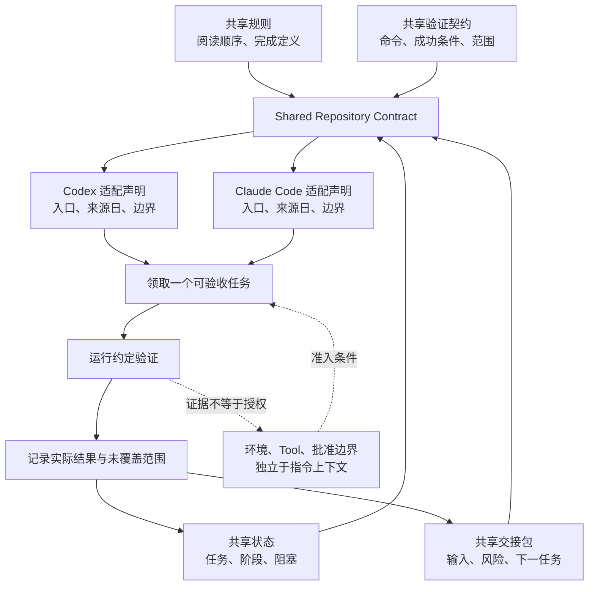

# 21. Claude Code 与 Codex 的项目 Harness

> 一套项目 Harness 的价值不在于让两个工具看起来一样，而在于让它们都能找到同一份规则、当前事实、验证证据和下一步。产品差异应留在适配层，不应污染共享项目真相。

## 本章目标

完成本章后，读者能够：

- 将共享仓库契约（Shared Repository Contract）与产品适配声明（Product Adapter Declaration）分开设计。
- 说明 Codex 的 `AGENTS.md` 与 Claude Code 的 `CLAUDE.md` 都可承载项目指导，但不据此假定加载、配置、权限或工具行为相同。
- 为跨工具接力准备规则、状态、验证和交接四类可审查工件。
- 把“指令已被提供”与“动作被技术控制、已执行、已验证”分开记录。
- 用写作日官方资料复核动态产品能力，并在来源不足时停止外推。

## 为什么要学

一个团队很容易把某个编码 Agent 的成功经验写成产品专属操作：在 A 工具里有效的根目录指令文件、某个 settings 层或本地记忆机制，被不加说明地当成 B 工具也会执行的规则。接手者只要换了入口、工作目录、信任状态或版本，项目就会出现两份真相：一份是仓库里的规则，一份是某个工具的隐含行为。

更可靠的做法是反过来组织。先把跨工具都需要的东西写进版本控制：稳定规则、当前状态、可复现的验证命令、交接包。然后把“某个产品如何发现它们、还需要哪些产品配置、在什么信任或权限边界下工作”写成可过期的适配声明。这样，工具变化时只需重新核验适配层；项目的任务历史和完成证据仍留在共享工件层。

本章讨论的是工程接口，不是两款产品的功能评测。第 22 章会细化 `AGENTS.md`、`CLAUDE.md` 与仓库级规则；第 23 章再讨论 Skill、Hook 与自动化；第 45 章才处理长期跨工具接力。

## 前置知识

- 已阅读第 03 章，了解仓库可保存规则、状态、历史、正式工件和校验反馈。
- 已阅读第 05 章，了解稳定指令、任务输入与上下文应该分层。
- 已阅读第 10 至 12 章，了解状态、Tool、环境和权限不是一份 Markdown 可以替代的系统。
- 不要求已安装 Codex 或 Claude Code；本章不要求账户、密钥、网络、MCP、hooks 或本地配置。

## 场景引入：两位维护者，两个入口，一套项目事实

设想一份书稿的第 21 章尚未完成。第一位维护者使用 Codex 创建 Research Brief；第二位维护者在另一个会话中使用 Claude Code 做 Technical Review。若这件事只靠聊天口头约定，第二位维护者很难回答：研究来源是在何时读取的？第一位是否真的运行了示例？下一步该审查正文还是先修状态？

本章采用一个教学场景：两位维护者都进入同一仓库，且仓库内有入口文件、稳定写作规则、当前状态、章节工件、示例和校验脚本。它们可以使用不同产品入口，但都要先读取共享工件，再领取一个可验收任务。

| 问题 | 共享仓库工件回答什么 | 产品适配声明回答什么 | 不能由任何一方单独推出什么 |
| --- | --- | --- | --- |
| 应如何工作？ | 阅读顺序、禁止事项、完成定义。 | 当前产品由哪个指令入口提供这些规则。 | 规则一定被强制执行。 |
| 当前做到哪里？ | 当前状态、阶段表、任务前置。 | 产品能否或何时读取目录内材料。 | 产品已经读取全部文件。 |
| 怎样证明完成？ | 验证命令、示例测试、审查记录。 | 产品是否提供额外配置或工具表面。 | 命令已执行或外部效果已发生。 |
| 谁可以做高风险动作？ | 任务范围和升级要求。 | 本次会话声明的权限/环境边界。 | Markdown 指令已授予或限制真实权限。 |

成功标准不是“两个产品完全一致”，而是维护者可以在不用猜测产品细节的前提下，定位项目事实、留下验证证据并把风险交接出去。

## 核心概念

### 共享仓库契约：先保存可审查的项目事实

本书把下表称为共享仓库契约。它是本书的工程模型，不是 Codex 或 Claude Code 的默认目录规范。

| 共享工件 | 最小内容 | 更新责任 | 不能替代 |
| --- | --- | --- | --- |
| 稳定规则 | 项目目标、阅读顺序、禁止事项、完成定义。 | 规则变化或复盘发现重复问题时。 | Tool policy、Sandbox、账户权限。 |
| 当前状态 | 已完成内容、实际校验、阻塞和下一项任务。 | 每个可验收任务完成后。 | 来源原文、测试本身、产品内部记忆。 |
| 验证契约 | 要运行的命令、成功条件、未覆盖范围。 | 示例、图示、正文或工具链变化后。 | 对外部系统或产品能力的永久保证。 |
| 交接包 | 输入路径、已执行动作、风险、未完成项。 | 会话切换、任务暂停或任务完成时。 | 当前状态的第二份权威来源。 |

这里的关键是**责任分离**。规则告诉维护者“应先读什么”；状态告诉维护者“现在已知什么”；验证记录告诉维护者“哪些命令真的运行过”；交接包告诉下一位“从哪里继续”。把它们挤进一份越来越长的说明会制造冲突和过期信息。

### 产品适配声明：记录差异，而非抹平差异

截至 2026-07-16，Codex 官方手册将 `AGENTS.md` 描述为可自动进入 Codex 上下文的仓库指导入口，并说明可以在全局、仓库和更具体目录层级放置指导，较近目录的指导优先。[REF-072](21-claude-code-and-codex-project-harness.references.md) 同一手册还说明项目 `.codex/config.toml`、项目 hooks 和项目 rules 的加载与项目是否受信任有关。[REF-073](21-claude-code-and-codex-project-harness.references.md)

截至同日，Claude Code 官方文档将 `CLAUDE.md` 说明为持久指令上下文，提供项目根和目录层级的加载说明，并建议已有 `AGENTS.md` 的仓库可以由 `CLAUDE.md` 使用 `@AGENTS.md` import 来共享规则。[REF-074](21-claude-code-and-codex-project-harness.references.md) 文档也明确将 `CLAUDE.md` 定位为上下文而不是强制配置，并把 settings、sandbox、权限拒绝和 hook 等技术控制另行区分。[REF-074](21-claude-code-and-codex-project-harness.references.md)

这些资料只支持有限比较：两类工具都提供项目层指导的文档化路径，但具体加载、层级、信任、设置与强制控制属于各自产品语境。为了避免把资料表扩写成“功能对比榜”，我们只保留与项目 Harness 有关的工程问题。

| 工程问题 | Codex 的写作日资料可支持的限定描述 | Claude Code 的写作日资料可支持的限定描述 | 共享层应怎么处理 |
| --- | --- | --- | --- |
| 项目指导入口 | `AGENTS.md` 可承载仓库指导；存在层级指导的文档说明。 | `CLAUDE.md` 可承载项目指导；可 import 既有 `AGENTS.md`。 | 保持一份共享稳定规则，另用轻量入口引用它。 |
| 具体加载与作用域 | 文档描述层级和项目可信条件。 | 文档描述根、目录和相关 settings 的作用域。 | 不把任一加载顺序写成跨产品“标准”。 |
| 可执行控制 | 手册把指导、配置、Sandbox 和 approvals 区分。 | 文档把指导与 settings、Sandbox、权限拒绝、hook 区分。 | 另建 Environment/Tool/Approval 边界，不从指导文件推导权限。 |
| 长期项目记忆 | 本章不把手册中的本地产品配置当成项目历史。 | 文档有 auto memory，但它是产品机制。 | 当前状态、决策与交接仍保存在可审查仓库工件中。 |

表中的“可支持”不等于当前会话已使用这些能力，也不代表两者在任意版本、界面或部署模式下行为相同。若正文需要新增具体产品细节，应在写作日重新读取官方资料；不能借用本表代替核验。

### 指令上下文不是强制执行

一个常见错误是写下“Agent 必须运行测试”，然后把文件存在当成测试必然发生。指令上下文可以提高一致性、提供提醒和给出验收输入；它没有自动创建网络限制、文件写入限制、账户权限或结果证据。

因此每项高风险动作至少应分开问四个问题：

1. **规则是否要求该动作？** 这是项目意图问题。
2. **当前产品/会话是否能够提出或调用它？** 这是产品与 Tool 表面问题。
3. **环境是否允许它？** 这是第 12 章的文件、网络、凭证、目标和批准边界问题。
4. **动作后是否有独立观察？** 这是第 15、17 章的证据与验收问题。

四个问题都得到肯定答案，仍不表示业务目标一定成功；但任一问题缺失时，至少不应把“读到了规则”写成“已经安全完成”。

## 架构图：共享工件与产品适配层

下图回答：两类产品入口怎样通过不同的适配声明使用同一套项目工件，而不把上下文、权限和验证混成一条箭头？可编辑源文件是 [chapter-21-project-harness-portability.mmd](../../diagrams/mermaid/chapter-21-project-harness-portability.mmd)，导出图为 [SVG](../../diagrams/exported/chapter-21-project-harness-portability.svg) 与 [PNG](../../diagrams/exported/chapter-21-project-harness-portability.png)。图表达的是本书教学模型，不表示真实产品内部调用、账户、配置、Tool、Sandbox 或网络路径。



> 图示替代描述：共享规则、状态、验证契约和交接包汇成一个仓库契约。Codex 与 Claude Code 各自通过有来源日期和边界的适配声明进入同一个可验收任务。任务经过约定验证后把实际结果和未覆盖范围回写到状态与交接包。环境、工具和批准边界单独约束任务，验证证据不被当作授权。

读图时要保持两条边界：第一，适配器不是共享事实的副本；它只记录某产品如何接入和何时需要重新核验。第二，验证箭头证明的是执行过特定检查，不是产品已经获权或外部目标已经改变。

## 工作流程：让不同入口接力同一任务

下面的流程适合“Codex 创建 Research Brief，Claude Code 做技术审查”这一教学场景，也适合未来替换为其他 Agent。它不是产品快捷操作说明。

1. **先读取共享入口。** 从仓库根入口进入稳定规则、当前状态、下一任务和阶段表；确认只领取一个明确任务。
2. **读取任务前置。** 研究时读取章节依赖、模板和候选来源；审查时读取正文、研究记录、示例计划和事实核验清单。
3. **选择产品适配声明。** 检查当前产品的官方资料日期、入口和未验证边界。若资料过期、入口不明确或项目信任/设置未知，不把产品行为当事实。
4. **明确环境与效果范围。** 读取第 11、12、14 章所定义的 Tool、环境和审批工件。指令要求不能代替这些准入条件。
5. **产出一个可检查工件。** 例如 Research Brief 或 Technical Review；不要同时悄悄重排目录、改动安全边界和写完整正文。
6. **运行约定验证。** 按项目约定运行 Markdown、链接、示例或状态检查，并记录实际命令、结果和未覆盖范围。
7. **回写共享状态和交接。** 只在证据存在时更新完成状态；将下一位需要的输入、风险和动态资料复核需求写入交接包。

步骤 3 是可移植性的关键。它不是让维护者“无视产品差异”，而是要求把差异从项目事实层移到可更新、可审查的声明层。

## 最小示例：纯内存可移植性评估

本章的 [`assessProjectHarnessPortability`](../../examples/agent/project-harness-portability-assessment.mjs) 接收调用者构造的共享契约和适配声明，返回 `portable`、`needs_shared_context`、`needs_adapter_evidence` 或 `needs_boundary_review`。它不读取真实 `AGENTS.md`、`CLAUDE.md`、`.codex/`、`.claude/`、环境变量、账户、网络或 Tool。

```js
import { assessProjectHarnessPortability } from '../../examples/agent/project-harness-portability-assessment.mjs';

const result = assessProjectHarnessPortability({
  shared: {
    rules: { readOrder: ['entry', 'stable-rules', 'current-state'] },
    taskState: { taskId: 'chapter-21-review', status: 'ready' },
    handoff: { nextTask: 'technical-review' },
    validation: { scope: 'chapter-21', checks: ['markdownlint', 'links'] },
  },
  adapter: {
    productId: 'codex',
    instructionSurface: 'AGENTS.md',
    productEvidence: { reviewedAt: '2026-07-16', source: 'official-docs' },
    rulesAreEnforcement: false,
    permissionBoundaryDeclared: true,
  },
});

// result.status === 'portable'
```

从仓库根目录执行：

```bash
node --test examples/agent/project-harness-portability-assessment.test.mjs
node examples/agent/project-harness-portability-assessment.mjs
```

本章实际红绿记录、判定顺序和测试矩阵见[示例计划](21-claude-code-and-codex-project-harness.example-plan.md)。实际结果是 6 项 Node 内置测试通过、0 项失败；演示输出 `portable` / `shared_contract_and_adapter_boundary_present`。这些结果只证明测试构造的 JavaScript 对象会得到确定性分类，不能证明本机加载了任何产品指令、配置或权限。

## 逐步增强：从共享 Markdown 到受控接力

不需要一开始就搭建双产品的复杂配置。可以随着任务风险逐步增加工件。

1. **共享入口和状态。** 先确保任何维护者能回答项目是什么、当前到哪和下一步是什么。升级触发：开始依赖聊天回忆或反复重复同一任务。
2. **增加验证契约和交接包。** 明确什么命令应运行、哪些结果已知、哪些范围未覆盖。升级触发：状态写“完成”却找不到可复现证据。
3. **增加产品适配声明。** 将官方来源、访问日、指令入口、信任/配置前提和外推禁区写出来。升级触发：团队开始把一个产品的行为当成另一产品的保证。
4. **最后引入技术控制。** 为外部 Tool、写入、网络和发布配置环境与批准边界。升级触发：任务将产生不可逆或跨系统效果。

每一步的目标是让误判可见，而不是让 Markdown 承担所有控制职责。

## 完整工程案例：研究与审查的跨入口交接

以下案例是本书的原创教学设计，不是 Codex 或 Claude Code 的真实运行记录。

**背景：** 维护者 A 使用 Codex 的项目入口开始第 21 章 Research Brief。维护者 B 随后使用 Claude Code 的项目入口做 Technical Review。两人共享同一仓库，但产品入口与会话不同。

**设计：** A 把写作日官方资料、允许陈述和外推禁区写入 Research Brief。B 不重做产品配置，也不从 A 的会话推断权限；B 读取 Research Brief、正文、事实核验清单和适配声明，检查是否把 `AGENTS.md` 或 `CLAUDE.md` 写成强制执行机制。双方都只将可复现校验结果写入共享状态。

| 阶段 | 共享输入 | 产品特有的可核验问题 | 输出 | 停止条件 |
| --- | --- | --- | --- | --- |
| Research | 规则、章节依赖、来源政策、当前任务。 | 当前产品相关官方页面是否已在写作日读取。 | Research Brief 与候选来源表。 | 官方来源缺失或无法区分事实/扩展。 |
| Draft | Research Brief、模板、共享术语。 | 无需把产品设置当作正文事实。 | 原创章节草稿。 | 把产品细节泛化为通用行为。 |
| Technical Review | 草稿、引用边界、示例计划。 | 适配声明的日期、来源与外推禁区是否完整。 | 审查发现与修订。 | 规则被写成权限，或事实无来源。 |
| Validate | 验证契约、示例和图示。 | 当前会话是否有另行声明的环境范围。 | 实际命令结果与未覆盖范围。 | 不能运行却伪称通过。 |
| Handoff | 当前状态、审查记录、剩余任务。 | 无需假设下一个产品的内部记忆。 | 下一任务、风险与复核提醒。 | 没有可定位输入或验证证据。 |

案例刻意没有包含“自动同步记忆”或“工具天然互通”的步骤。可移植性来自共享工件与显式边界，而不是假设两个产品的内部状态相同。

## 实现说明：用适配声明约束结论强度

`Product Adapter Declaration` 至少包含产品标识、指令入口、官方资料复核日期、来源类型、上下文是否仅为指导以及权限边界是否已单独声明。少任何一项时，教学函数不会返回 `portable`。

这个接口的两个设计选择很重要：

- `productId` 只是记录调用者声明的字符串，不会查询真实安装或账户。示例中出现 `codex` 和 `claude-code` 只是教学标签，不能证明产品状态。
- `rulesAreEnforcement: true` 会得到 `needs_boundary_review`。它不是对某个产品的运行时判断，而是拒绝本书模型中的越界叙述：上下文规则不能被当作技术强制。

真实集成需要比纯函数更多证据：当前版本、工作目录、指令发现结果、项目可信状态、配置层、环境策略、Tool annotations、批准记录、外部观察和审计日志。应分别通过对应产品的官方文档和真实环境测试获得，不应从本章代码推断。

## 测试与验证

| 路径 | 实际验证 | 支持的有限结论 | 不支持的结论 |
| --- | --- | --- | --- |
| 两类适配声明 | 以相同共享对象、不同 `productId` 与入口运行纯函数。 | 本书函数可以把共同契约与适配标签分开。 | 两种产品真实加载相同文件。 |
| 状态缺失 | 删除注入的 `taskState`。 | 没有任务状态时函数保守地要求共享上下文。 | 真实仓库状态一定完整。 |
| 来源不足 | 删除适配来源日期。 | 动态产品声明缺证据时函数不返回可移植。 | 官方页面无法访问或产品不可用。 |
| 强制执行混淆 | 令 `rulesAreEnforcement` 为真。 | 本书模型拒绝该叙述。 | 任一产品的实际执行机制被完整模拟。 |
| 权限声明缺失 | 令 `permissionBoundaryDeclared` 为假。 | 函数要求另行声明边界。 | 真实权限已被检查或阻止。 |

本章只进行了 Node 内置测试、演示、Mermaid 渲染、局部 Markdown lint 和局部链接检查。它没有进行浏览器端到端测试，因为没有改动可交互 Web UI。

## 工程实践

- **主入口要短。** 让 `AGENTS.md` 或 `CLAUDE.md` 指向稳定规则、当前状态和任务模板；不要复制整本手册或所有历史日志。
- **产品差异写成可过期资料。** 在适配声明中保留“来源、访问日、允许陈述、外推禁区”；不要在共享规则里写入某版产品的临时 UI 或命令。
- **验证结果回写为证据。** 写“运行了什么、结果如何、未覆盖什么”，不要只写“已验证”。
- **将 Tool 与环境单独建模。** 指令文件最多表达意图；外部操作仍需 Tool Contract、Environment Contract、批准和观察。
- **让接手只领取一个任务。** 如果 Research、Draft、审查和目录重构都同时发生，跨产品问题会被混入工作流问题，无法定位责任。

## 最佳实践

| 做法 | 原因 | 常见反例 |
| --- | --- | --- |
| 同一事实只保留一个共享权威位置。 | 减少跨会话冲突。 | 在两个入口文件里复制不同版本的当前进度。 |
| 用轻量入口引用专题规则。 | 让稳定规则可读，任务细节按需加载。 | 把所有产品说明和历史记录塞进根文件。 |
| 对动态资料保留复核日期。 | 产品行为会变，旧链接不是当前事实。 | 将以前的资料访问日当作永久验证。 |
| 规则与权限分开记录。 | 行为提示和技术准入属于不同层。 | 写“禁止发布”却未配置或审查真实环境边界。 |
| 交接时包含未覆盖范围。 | 下一位能避免重复或越界推断。 | 只留“继续即可”。 |

## 常见错误

| 错误 | 表现 | 根因 | 修复方向 |
| --- | --- | --- | --- |
| 把 Markdown 名称当作兼容协议 | 认为 `AGENTS.md` 与 `CLAUDE.md` 文件名相似就一定相同加载。 | 忽略产品、版本和设置语境。 | 记录产品适配声明并在写作日复核官方资料。 |
| 用指令替代权限 | 规则写了“只读”，却没有环境和 Tool 边界。 | 混淆行为指导与技术控制。 | 按第 11、12、14 章单独建立准入与批准证据。 |
| 复制当前状态 | 根入口、交接和阶段表都各写一份进度。 | 没有单一权威位置。 | 让入口引用状态，将状态更新集中到一个位置。 |
| 自动记忆取代项目记录 | 依赖某个工具的本地记忆保存关键决策。 | 把产品内部状态当作可协作工件。 | 将团队必须审查的事实写入版本控制的决策、状态与交接文件。 |
| 校验通过即跨产品兼容 | 一次 lint 通过就宣称两个 Agent 可无缝接力。 | 只验证了文本格式。 | 分别记录共享验证、产品适配证据和真实环境验证范围。 |

## 安全与边界

- **权限边界：** 本章不授予或改变任何文件、网络、账户、秘密、发布或外部 Tool 权限；真实高风险动作仍要经过环境和人工审批流程。
- **来源边界：** Codex 与 Claude Code 的动态事实仅在 `REF-072` 至 `REF-074` 写明的官方资料范围内使用。后续修订需要重新核验。
- **数据边界：** 交接包、自动记忆、日志和状态文件可能含敏感信息；真实项目应另行定义最小化、访问控制和保留策略。
- **不适用范围：** 本章不是产品安装手册、配置参考、权限审计、模型评测、MCP 指南或跨产品兼容性保证。

## 章节总结

Codex 与 Claude Code 可以服务于同一个项目 Harness，但“共同项目”不要求它们拥有共同的内部实现。更稳定的做法是：让仓库保存规则、状态、验证与交接，让每个产品把自身的入口、版本化资料和环境边界写成适配声明。这样，工具变更会暴露为可核验差异，而不会悄悄改写项目真相。

下一章将聚焦如何把这些入口拆成简洁、分层且可审查的仓库级规则。第 45 章则会把共享状态与交接契约扩展为长期跨工具接力。

## 练习

1. 为一个已有仓库列出四类共享工件：规则、状态、验证和交接。每一类删掉后，接手者最先失去哪个问题的答案？
2. 选择一个你使用的 Agent 产品，建立一张适配声明卡：官方资料 URL、访问日、项目入口、权限/环境边界和两个外推禁区。不要把未核验内容填成事实。
3. 找出一条“Agent 必须做 X”的规则，分别写出它的上下文提示、技术准入、独立观察和人工升级条件。
4. 将本章的纯内存示例扩展为仅解析调用者传入的 Markdown 字符串；不要读取真实仓库。为“规则冲突”增加一个保守状态，并先写失败测试。

## 延伸阅读

- [第 03 章：仓库即 Agent 上下文](../part-01-foundations/03-repository-as-agent-context.md)
- [第 12 章：Environment、Sandbox 与权限](../part-02-components/12-environment-sandbox-and-permissions.md)
- [第 20 章：自改进的工程边界与长期运行 Agent](../part-03-intelligence-loop/20-self-improvement-boundaries-and-long-running-agents.md)
- [第 22 章计划：AGENTS.md、CLAUDE.md 与仓库级规则](../../.ai/outline.md)

## 参考资料

- [REF-072 至 REF-074 的访问日、限定用途和外推禁区](21-claude-code-and-codex-project-harness.references.md)

## 章节完成检查表

- [x] 已区分共享仓库 Harness、Codex 适配事实、Claude Code 适配事实和本书工程模型。
- [x] 已为动态产品事实记录官方资料、写作日和外推禁区。
- [x] Mermaid 图、示例、审查记录和正文均未声称真实产品配置、权限或工具调用已发生。
- [x] 已实际运行本章 Node 示例测试、演示、Mermaid SVG/PNG 渲染和局部 Markdown/链接检查；结果见 Fact Check 与 Final Review。
- [x] 正式引用、全书目录、术语、状态和总校验入口由主线程统一收口；完整校验结果以项目状态文件为准。
