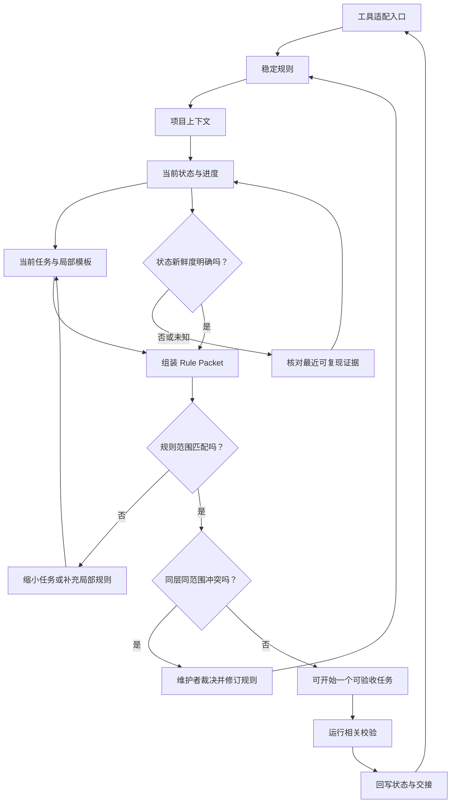

# 22. AGENTS.md、CLAUDE.md 与仓库级规则：入口导航，而非规则堆栈

> 好的仓库入口不是把所有要求塞进一页 Markdown，而是让执行者在修改前能定位稳定约束、当前事实与局部任务材料，并在信息冲突时停下来复核。

## 本章目标

完成本章后，读者能够：

- 为编码 Agent 设计简洁的根入口、稳定规则、可变状态和任务局部材料。
- 区分 `AGENTS.md` 与 `CLAUDE.md` 的产品特有事实，以及可迁移的仓库组织原则。
- 用来源、范围、层级、状态和修订审查规则，而不是用“更多指令”掩盖矛盾。
- 在缺规则、状态陈旧、范围不匹配或同层冲突时给出保守出口。
- 解释为什么仓库规则只能引导行为，不能替代权限、Sandbox、hook、测试或人工责任。

## 为什么要学

团队常从一句“写一个 `AGENTS.md`”开始，随后把代码风格、目录介绍、构建命令、当前任务、旧故障、发布流程和本周待办不断追加进去。几轮迭代后，入口文件看似更完整，实际却更难维护：当前状态复制了三份，过期结论与稳定原则并排，任务专用步骤迫使无关工作也读取，冲突只能靠“以最后一条为准”猜测。

第 3 章已经把仓库定义为可恢复的项目上下文，第 5 章已经把项目规则、任务请求和数据上下文分开，第 21 章讨论不同 Agent 如何接入同一项目 Harness。本章不重讲它们，而是把问题收窄为：**入口文件怎样把执行者带到正确上下文，而不成为一份易过期、不可审查的巨型 Prompt？**

> 边界：本章不承诺 Codex、Claude Code 或其他 Agent 会加载、理解或遵守某个文件；不配置真实 hooks、权限或 Sandbox；也不将 Markdown 规则当作对写入、命令或网络访问的技术拦截。

## 前置知识

- 已阅读第 3 章，理解规则、状态、历史和正式工件更新频率不同。
- 已阅读第 5 章，理解指令、任务请求和数据不能因放在同一上下文就拥有同等权威。
- 已阅读第 10、12 章，理解状态、权限和运行环境另有独立责任。
- 能阅读 Markdown front matter、相对路径和 Node.js 的对象字面量。

## 场景引入：入口为什么不能承担当前事实

设想一个书稿仓库有两位执行者。第一位在根 `AGENTS.md` 中补了“第 22 章下一步写正文”；第二位只更新了 `NEXT_TASK.md`；第三位又在章节说明中写了“示例仍未开始”。一周后，新的 Agent 接到“继续第 22 章”。它能读到三个合理却不一致的描述：哪一个是当前事实？它是否该继续写？是否需要先核对测试和图示？

问题不是“哪份 Markdown 更像真相”，而是三类信息被放错了位置：低频规则被当前任务污染，可变状态被复制，局部阶段信息没有与可复现证据关联。为了避免这种混乱，本章把仓库材料按职责拆开。

| 工件类型 | 它回答的问题 | 更新者与频率 | 典型位置 | 不能替代 |
| --- | --- | --- | --- | --- |
| 根入口 | 开始前先读什么、结束时做什么？ | 维护者；低频 | `AGENTS.md`、`CLAUDE.md` | 当前任务或完整规则正文。 |
| 稳定规则 | 哪些原则、禁止项和质量门长期有效？ | 团队；低频 | `BOOK_RULES.md`、风格指南 | 当前进度与外部事实。 |
| 项目上下文 | 项目是什么、为何这样设计？ | 维护者；中低频 | `.context/PROJECT_CONTEXT.md` | 本次任务验收。 |
| 可变状态 | 完成了什么、阻塞什么、下一步是什么？ | 当前执行者；高频 | `CURRENT_STATE.md`、`NEXT_TASK.md`、进度表 | 历史理由或权限证明。 |
| 任务局部材料 | 本次范围、模板、研究、示例与审查怎样做？ | 任务执行者；随任务 | 章节目录、`templates/` | 覆盖稳定规则或安全约束。 |

这张表是本书的工程模型。不同项目可以采用不同目录；不可省略的是责任分离：根入口负责导航，稳定规则定义预期，可变状态记录当前事实，局部材料描述这次工作。

## 核心概念

### 两种产品入口：相似目标，不同加载机制

对 Codex，官方手册将 `AGENTS.md` 描述为可自动进入上下文的开放格式仓库指导，并建议其中包含布局、运行命令、约束和完成/验证定义。手册还说明可在全局、仓库与更具体目录放置该文件，靠近当前目录的指导优先；当主文件变长时，应保持它简短并引用任务专用资料。[REF-075](22-agents-claude-and-repository-rules.references.md)

对 Claude Code，官方文档将 `CLAUDE.md` 描述为用户写入的持久指令上下文，而不是强制配置；它建议将每次会话都需要的内容写得具体、简洁，将局部或多步骤内容移到 path-scoped rules 或 skills。该页面还明确说明 Claude Code 读取 `CLAUDE.md` 而不是 `AGENTS.md`，并展示以 `@AGENTS.md` 导入共享内容的方式。[REF-076](22-agents-claude-and-repository-rules.references.md)

这两组事实只能支持一个有限结论：版本控制的项目入口可以减少重复说明，并把共同工作方式留给后续会话阅读。它们不支持以下推论：

- Codex 和 Claude Code 使用相同的目录发现、覆盖或注入实现。
- 某个入口被写入后，当前会话一定已经读取了它。
- 文本中的“禁止”能机械阻止命令、写入或外部操作。
- 规则加载成功就能证明内容正确、测试通过或权限已授予。

因此，同一仓库可以共享**内容模型**，却不必假装两个产品共享**加载模型**。一个务实安排是让每个工具的根入口只说明它所需的启动路径，再指向共同的稳定规则、状态文件和任务工件；若采用文件导入或符号链接，仍要按各自官方文档与当前运行环境复核。

### 根入口应像目录，不应像档案室

根入口最有价值的信息是执行者无法从目录结构立即推断的内容：先读什么、哪些原则不可绕过、当前事实在哪里、完成后要运行什么。它不适合保存长篇架构说明、上个月的事故复盘、每个目录的细节，或正在变化的“下一件事”。

一个可维护的入口通常只做四件事：

1. **定向：** 指向启动说明和稳定规则，而不是复制它们。
2. **排序：** 给出读取上下文的顺序，避免先写后读。
3. **设边界：** 提醒哪些动作不能由文本规则替代，例如权限、事实核验和真实测试。
4. **收尾：** 指明完成后的验证和状态回写责任。

当团队发现入口不断增长，应先问“这些内容是否每项任务都要读”。答案若是否定的，应拆分为稳定规则、路径局部规则、Skill、模板、状态或历史记录；不要通过加粗、重复或更强语气让巨型入口看起来更权威。

### 规则记录（Rule Record）：让规则可审查

自然语言规则可以很短，却仍需要最小元数据。为了讨论冲突与陈旧，本书将单条规则抽象为规则记录（Rule Record）：

| 字段 | 回答的问题 | 教学例子 | 不是 |
| --- | --- | --- | --- |
| `id` | 这条规则如何被准确引用？ | `chapter-template` | 真实产品配置键。 |
| `layer` | 它属于入口、稳定、状态还是任务层？ | `task` | 跨产品优先级。 |
| `scope` | 它适用于仓库还是某类路径？ | `docs` | 真实 glob、访问权限或文件发现算法。 |
| `directive` | 它要求什么可观察行为？ | `use the chapter template` | 自动执行的命令。 |
| `source` 与 `revision` | 来自哪里、哪个可审查版本？ | `CHAPTER_TEMPLATE.md` / `r2` | 当前文件一定存在或已加载。 |
| `status` | 当前活跃、还是已退役？ | `active` / `retired` | 事实已被外部系统删除。 |
| `conflictKey` | 哪些指令不能同时成立？ | `chapter-write-mode` | 自动裁决权。 |

字段的作用不是把每个 Markdown 文件变成数据库，而是让维护者在发生矛盾时能定位“谁写的、适用于哪里、它是否仍活跃”。本书的 Rule Record 不属于 Codex、Claude Code 或任何产品的文件格式。

### 规则包（Rule Packet）：先判断是否具备读取前提

本章进一步定义规则包（Rule Packet）：在一项任务开始前，按本书声明的层级组织适用规则，并返回“可以开始”或保守出口。它避免把“读到很多文本”误当作“上下文足够”。

一个教学 Packet 至少检查：

- 是否具有入口、稳定、状态和任务四个必要层。
- 注入的当前状态是否被外部判断为明确新鲜；未知或陈旧不能静默继续。
- 每条适用规则是否具有足够元数据，以及层级是否属于已声明策略。
- 同层、同范围、同一冲突键的指令是否相互矛盾。
- 路径局部规则是否只进入匹配任务，而没有泄漏到无关目录。

这些检查回答的是“本书教学输入是否完整”，不回答“Agent 实际读到了什么”“规则是否真正执行”或“该任务是否可被授权”。后两个问题分别属于产品诊断与第 12、14、23、41 章的运行时控制。

## 架构图：从入口到可开始的 Rule Packet

下图描述本书的仓库规则工作流。它不是 Codex、Claude Code 的内部加载顺序，也不是权限架构：任何“可开始”都只表示经过教学 Packet 的前置检查，仍必须在权限、验证和人工责任边界内行动。



Mermaid 源文件是 [chapter-22-repository-rule-loading.mmd](../../diagrams/mermaid/chapter-22-repository-rule-loading.mmd)，导出图为 [SVG](../../diagrams/exported/chapter-22-repository-rule-loading.svg) 与 [PNG](../../diagrams/exported/chapter-22-repository-rule-loading.png)。

> 图示替代描述：工具适配入口依次定位稳定规则、项目上下文、当前状态、任务与局部模板。状态未知时先回到可复现证据；范围不匹配时缩小任务或补局部规则；同层同范围冲突时交由维护者修订。只有无冲突 Packet 才开始一个可验收任务，校验结果随后回写状态与交接。

读图时要注意，`State` 同时进入新鲜度检查和任务定位，表示状态是读取顺序中的输入，不是入口中复制的一段文字。冲突出口回到稳定规则，是为了修订规则来源，而不是在某次任务里临时覆盖它。

## 工作流程：先定位，再动手

对一项“补充第 22 章正文”的任务，本书建议采用以下流程：

1. **选择工具入口。** Codex 从项目的 `AGENTS.md` 开始，Claude Code 从 `CLAUDE.md` 开始；产品具体行为只按写作日官方资料理解。
2. **读取稳定信息。** 读取启动说明、书籍规则、项目上下文与风格指南，明确原创性、引用、校验和目录边界。
3. **建立当前事实。** 读取当前状态、下一任务和进度表；若不一致，定位最近可复现校验和实际工件，不能以旧交接说明裁决。
4. **读取任务材料。** 阅读 Research Brief、详细提纲、模板、相邻章节、引用候选和已有示例。
5. **组装并审查 Packet。** 检查层级、范围、状态新鲜度和冲突；任何保守出口都先补证、复核或交给维护者。
6. **只完成一个可验收任务。** 产出正文、示例、图示或审查记录；不要把多个未核验方向一起改进。
7. **运行相关校验并回写。** 记录真实命令和结果，再更新状态、下一任务和交接。状态回写不等于将结果复制进入口文件。

这个顺序是本书 Harness 的工作契约。它不覆盖平台或组织规则；若产品、组织管理策略或运行环境给出更高层约束，应先停止并遵循已核验的适用边界。

## 最小示例：纯内存规则加载预检

完整示例位于 [repository-rule-loading-assessment.mjs](../../examples/agent/repository-rule-loading-assessment.mjs)。它只处理注入对象：

```js
const conclusion = assessRepositoryRuleLoading({
  task: {
    id: 'chapter-22-draft',
    path: 'docs/part-04-engineering-practice/22-agents-claude-and-repository-rules.md',
  },
  rules: [
    {
      id: 'entry-codex',
      layer: 'entry',
      scope: 'repo',
      directive: 'read the project entry',
      source: 'AGENTS.md',
      status: 'active',
      revision: 'r1',
    },
    // 省略稳定、上下文、状态和任务层的教学 Rule Record。
  ],
  state: { revision: 'state-r22', freshness: 'current' },
  policy: {
    requiredLayers: ['entry', 'stable', 'state', 'task'],
    layerOrder: ['entry', 'stable', 'context', 'state', 'task'],
  },
});
```

**运行前提：** 从仓库根目录使用支持内置 `node:test` 的 Node.js；不需要账户、密钥、真实仓库文件、网络、环境变量或产品客户端。

**验证命令：**

```bash
node --test examples/agent/repository-rule-loading-assessment.test.mjs
node examples/agent/repository-rule-loading-assessment.mjs
```

**实际结果：** 本章测试在实现前以 `ERR_MODULE_NOT_FOUND` 失败，随后实现后 7 项 Node 内置测试通过、0 项失败；演示输出 `ready_to_load`。详细边界见[示例实现记录](22-agents-claude-and-repository-rules.example-plan.md)。

**限制：** `scope` 只是本例的 `repo` 或路径首段匹配，`freshness` 是调用者注入的判定，排序来自本书的 `layerOrder`。函数没有读取任何 Markdown，也不证明 Codex 或 Claude Code 的真实层级、加载情况、权限或遵从性。

## 逐步增强：从 Markdown 约定到可维护 Harness

1. **先减少入口负担。** 将“每次都要读”的低频规则保留在入口或稳定规则，将任务步骤移入模板或 Skill。升级触发是入口开始重复章节、团队或目录专用内容。
2. **再加入可观察状态。** 为当前任务、最近校验和阻塞项保留单一权威位置，并在任务结束时更新。升级触发是多个执行者频繁接力、状态冲突或长任务中断。
3. **引入范围化规则。** 对目录、语言或风险类型建立局部规则，并让实际工具的路径匹配行为接受独立核验。升级触发是 monorepo 或同一仓库出现相互独立的工作流。
4. **将必须执行的约束移出 Markdown。** 对高风险工具、敏感数据、写入和发布使用受控权限、Sandbox、hook、审批与审计。升级触发是规则失败会导致不可逆后果。

每一步都应保留“为何存在、谁维护、何时复审、如何验证”的答案。缺少这些答案时，新增一份规则文件只会增加另一处可能过期的上下文。

## 完整工程案例：为技术书仓库设计共同入口

本书仓库使用以下教学组织方式：Codex 的 `AGENTS.md` 保持简洁，给出阅读顺序和禁止项；Claude Code 的 `CLAUDE.md` 指向相同的稳定规则，而非复制一份“第二宪法”；`AI_BOOTSTRAP.md` 描述执行流程；`BOOK_RULES.md` 保存稳定质量原则；`.context/` 记录项目理由、当前状态与下一任务；`.ai/`、`docs/`、`templates/` 与 `examples/` 保存任务材料和可检查工件。

下面不是对当前仓库的执行证明，而是一个可移植的维护审查表：

| 检查点 | 要问的问题 | 合格证据 | 需要停止或复核的信号 |
| --- | --- | --- | --- |
| 根入口 | 是否只说明导航、边界和收尾？ | 指向稳定规则、状态、模板和校验的链接。 | 入口包含多份当前任务、旧测试输出或重复规则。 |
| 稳定规则 | 是否有长期目标、禁止项、完成定义？ | 可审查规则文件和明确维护责任。 | 同一原则在多处以不同措辞出现。 |
| 当前状态 | 是否说明完成、阻塞、下一步和最近验证？ | 单一高频状态位置与可复现命令。 | 入口、交接和进度表互相矛盾。 |
| 任务规则 | 是否只对相关目录/任务生效？ | 模板、Research Brief、局部审查项。 | 无关任务也被要求读取或遵循。 |
| 强制机制 | 高风险动作是否由运行时控制？ | 权限、Sandbox、hook、审批或审计方案。 | Markdown 中写着“禁止”，却没有控制或验证。 |

案例的关键不是使用这些确切文件名，而是保持规则、状态、历史和工件之间的单一职责。若换成服务仓库，可以把“章节模板”替换为 API 变更模板；若换成测试仓库，可以把“事实核验”替换为环境准备清单。不可替换的是：不要以可读文本取代可观察证据和执行边界。

## 实现说明

`assessRepositoryRuleLoading` 采用保守顺序：先检查输入和状态，再检查每条适用 Rule Record，随后检查必须层和同层冲突，最后按注入的 `layerOrder` 返回规则 ID。它不会为冲突自动选择“更高优先级”文本，因为同一层、同一范围的相反要求常代表维护错误，而不是需要模型猜测的业务决策。

| 决策 | 本书选择 | 原因 | 不替代 |
| --- | --- | --- | --- |
| 陈旧状态 | 由调用者显式注入 `freshness` | 纯函数不读取时钟或文件，避免伪造“刚刚更新”。 | 真实状态探测、版本控制或观测系统。 |
| 范围匹配 | 仅支持 `repo` 与路径首段 | 让教学边界可在少量测试中检查。 | glob、符号链接、monorepo 根发现或产品路径规则。 |
| 冲突处理 | 同层同范围同键但不同指令即阻止 | 让来源维护者明确裁决。 | 真实 Agent 的优先级解析。 |
| 已退役规则 | 不进入活跃 Packet | 避免旧记录继续改变当前教学结论。 | 删除历史、撤销权限或审计保留策略。 |
| 成功状态 | `ready_to_load` | 只表达教学输入已齐备。 | 已读取、已授权、已修改或已验证。 |

## 测试与验证

| 层级 | 验证对象 | 命令或方法 | 成功标准 | 实际状态 |
| --- | --- | --- | --- | --- |
| 单元 | 纯内存 Rule Packet | `node --test examples/agent/repository-rule-loading-assessment.test.mjs` | 7 条范围、缺层、状态、冲突、元数据与退役规则路径精确匹配 | 已执行，7 项通过。 |
| 演示 | 完整教学输入 | `node examples/agent/repository-rule-loading-assessment.mjs` | 输出有序 Rule Record ID，且状态为 `ready_to_load` | 已执行。 |
| 图示 | Mermaid 源、导出图和正文图块 | Mermaid CLI、图像检查、`diff -u` | 图可渲染，术语与正文一致 | 已执行，见图示审查。 |
| 局部文档 | 本章 Markdown 与链接 | markdownlint、markdown-link-check | 退出码 0 | 已执行，见终审记录。 |
| 真实 Agent 加载/授权 | Codex、Claude Code、操作系统与外部系统 | 不在本章运行 | 不适用 | 明确排除。 |

## 工程实践

- **把“状态更新”做成任务完成的一部分。** 没有状态回写的章节正文、代码或测试，只是未交接的局部工作；但回写前必须先运行对应校验。
- **用来源与作用域审查规则。** 无法说清来源、适用路径和修订的规则不应默默进入长期入口。
- **把冲突当作维护信号。** 同层相反规则不是提示模型“自由选择”的机会；应删除、合并、限定范围或请求维护者裁决。
- **为不同工具保留小差异。** 可共享稳定原则，但不要因追求“统一”而虚构完全相同的产品配置、指令层或诊断方式。
- **让可观察证据胜过叙述。** 状态文件说“已完成”时，仍应能定位对应工件和实际校验记录。

## 最佳实践

- 根入口优先写不可从代码推断的事实：读取顺序、验证命令、风险边界和完成责任。
- 每份规则保留一个清晰主责；规则改变后同时检查入口、局部规则、模板和状态是否产生重复或冲突。
- 当前状态只维护一组高频事实，历史理由归入决策和审查记录；不要用历史记录覆盖今天的测试证据。
- 对动态产品能力、配置、版本和加载机制在正式写作当天重新读官方资料，并将结论限于页面直接支持的范围。
- 任何必须“无论 Agent 如何决定都要阻止”的动作，都应放到运行时控制，而不是 Markdown 句子中。

## 常见错误

| 错误 | 表现 | 根因 | 修复方向 |
| --- | --- | --- | --- |
| 入口变成百科 | `AGENTS.md` 或 `CLAUDE.md` 包含架构史、当前任务和所有流程 | 没有区分常驻与按需信息 | 保持入口导航性，外置稳定规则、状态和任务模板。 |
| 把状态复制到规则 | 三个文件各自写“下一步” | 规则与状态的更新频率混淆 | 指定一个状态权威位置，其余文件只链接。 |
| 用“优先级”掩盖矛盾 | 两条同层规则相反，执行者自行选择 | 来源、范围和冲突键没有被审查 | 阻止任务，修订或限定规则来源。 |
| 规则越细越安全 | Markdown 中写“禁止发布”却没有权限控制 | 将行为指导误当作强制执行 | 建立 Sandbox、权限、hook、审批和审计。 |
| 将局部规则全局化 | 文档规则干扰示例或测试目录 | 没有范围契约 | 用路径局部材料、Skill 或任务模板减少噪声。 |

## 安全与边界

- **权限边界：** 规则文本不授予或撤销文件、网络、凭证、发布或生产访问权限；这些由实际运行环境和组织控制决定。
- **数据边界：** 入口、状态和审查记录不应复制密钥、Cookie、个人数据、完整敏感日志或未审查外部文本。
- **人工审批点：** 同层冲突、状态无法确认、范围需要扩大、规则涉及不可逆效果或需要改变权限时，应停止并请求具备责任的人裁决。
- **不适用范围：** 本章不是 Codex 或 Claude Code 的完整配置手册、操作系统安全方案、合规意见、hook 教程或多 Agent 调度协议。

## 章节总结

仓库级规则的核心不是“让 Agent 看到更多文字”，而是让执行者在需要时看到**正确种类**的文字：入口给路径，稳定规则给不变量，状态给当前事实，任务材料给本次验收。规则记录让来源与范围可审查，规则包让缺层、陈旧和冲突在编辑前暴露。

产品会演进，文件发现方式也会不同；可迁移的工程原则仍然是把指导与强制执行分开、把状态与历史分开、把当前事实与可复现证据关联。下一章将把重复性流程进一步包装为 Skills、Hooks 与自动化工作流，并继续保留这些边界。

## 练习

1. 为一个你熟悉的仓库列出五类工件：入口、稳定规则、项目上下文、当前状态和任务局部材料。找出至少一条被放错位置的信息，并说明迁移后的更新责任。
2. 设计三条 Rule Record：一条全仓稳定规则、一条只适用于测试目录的规则、一条已退役规则。为它们写出来源、范围、修订和冲突键。
3. 构造两个同层、同范围、同冲突键但相反的规则。说明为何本章选择 `blocked`，以及谁应负责裁决。
4. 将“禁止直接发布”分别写成 Markdown 指导和运行时控制需求，比较两者能证明与不能证明的内容。

## 延伸阅读

- [Codex Manual：Customization, Skills, Rules, MCP, and Integrations](https://learn.chatgpt.com/docs/customization/overview)
- [Claude Code Docs：How Claude remembers your project](https://code.claude.com/docs/en/memory)
- 第 3 章：仓库即 Agent 上下文
- 第 5 章：Instructions 与 Prompt
- 第 12 章：Environment、Sandbox 与权限

## 参考资料

本章局部来源、允许用途与动态复核边界见[候选参考资料](22-agents-claude-and-repository-rules.references.md)。全书正式引用编号由主线程登记。

## 章节完成检查表

- [x] 使用原创场景、规则分层、Rule Record 和 Rule Packet 解释仓库入口。
- [x] Codex 与 Claude Code 事实分别受 REF-075、REF-076 限定。
- [x] 正文没有将上下文加载、规则文本或示例状态写成权限、执行或正确性保证。
- [x] 纯内存示例覆盖缺层、状态、冲突、范围、元数据与退役规则。
- [x] 图示、测试、事实核验、语言审查和终审记录已关联。
