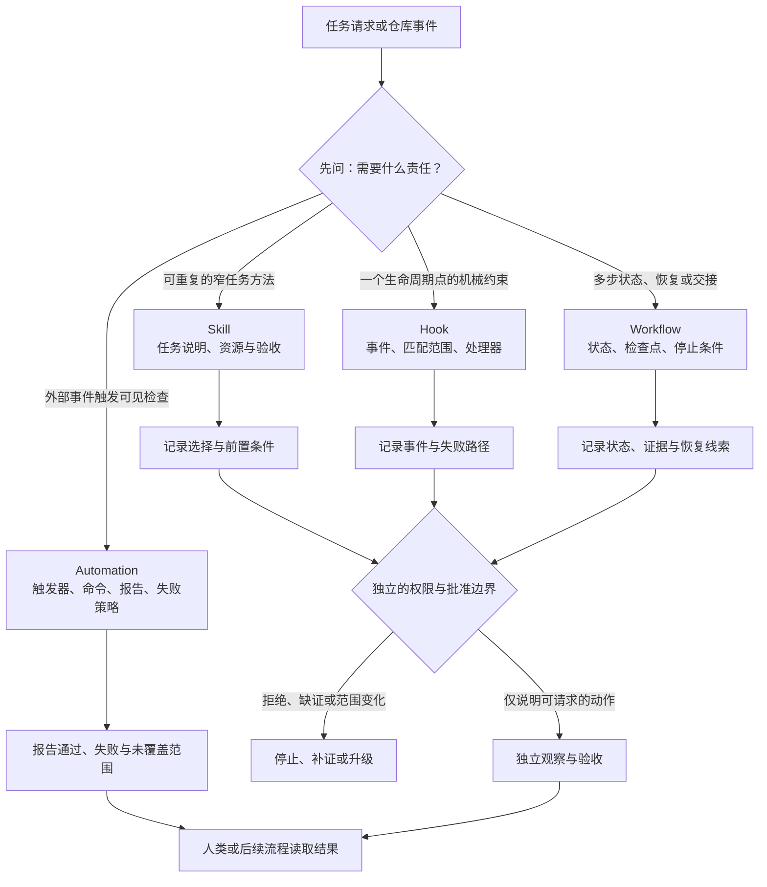

# 23. Skills、Hooks 与自动化工作流

可复用的说明、生命周期约束和事件驱动检查都能减少重复劳动，但它们解决的不是同一个问题。本章将它们拆成可审查的边界，避免把“已经自动化”误写成“已经被授权、执行或验证”。

## 本章目标

完成本章后，读者能够：

- 根据任务的重复方式、触发时机和状态需要，在 Skill、Hook、Workflow 与事件驱动自动化之间作出可解释的选择。
- 为 Hook 或自动化检查写出触发条件、输入范围、失败可见性、退出路径和所有者，而不把它们当作权限系统。
- 识别把 Hook 当成长流程编排、把 Skill 当作强制门禁、把 CI 绿色当作结果正确等常见边界错误。
- 用纯内存判断函数检查一个自动化提案的责任归属，并明确其不代表真实 Hook、CI、调度、授权或外部效果。

## 为什么要学

“每次修改书稿后都跑 Markdown 检查”看起来是一个单句需求，实际至少包含四个不同问题：怎样把检查步骤复用、何时触发、失败是否阻断、失败由谁观察并处理。若把答案全塞进一个 Prompt、一个 Hook 或一条 CI 配置，团队很难解释为什么它会运行、失败后发生什么，以及何时应该停止自动化。

本书仓库已有两条可观察的 GitHub Actions 工作流：在 `pull_request` 与推送到 `main` 时分别运行 Markdown lint 与链接检查；lint 工作流还运行最小 Harness 测试。这是“事件触发检查”的具体配置，不是对所有分支、所有平台、所有 Agent 或所有书稿正确性的保证。它也不等同于当前对话中的 Hook，更不代表检查通过后可以自动发布。

本章不教读者把任何检查都自动修复，也不建立真实的 Codex Hook、云端调度器或 CI/CD 权限。第 8 章已定义可复用 Skill 的任务契约；第 10 章已定义状态、检查点和恢复。本章只处理它们如何在工程实践中保持分工。

## 前置知识

- 已阅读第 8 章，理解 Skill 是可维护的任务能力，发现或安装不等同于授权。
- 已阅读第 10 章，理解 Workflow 需要状态、检查点、失败路径与交接，而不只是按顺序执行的列表。
- 已阅读第 12、14 章，理解运行环境权限和人工批准要独立于说明、触发和检查配置。
- 不要求读者已经安装 Codex Plugin、配置 Hook 或拥有 GitHub Actions 权限。

## 场景引入：把“自动检查书稿”拆回责任

维护者希望每次书稿变更都能尽早发现格式与链接问题，并希望把“研究、写作、审查、验证”这套重复过程沉淀下来。一个草率的方案可能是：“写一个 Hook，在提交前执行全部流程并自动修复。”

**成功标准：** 对一个给定提案，团队能说明它为什么是 Skill、Hook、Workflow 或自动化检查；能指出缺失的输入、状态、失败策略或批准；失败结果不会被悄悄吞掉。

**边界：** 本章的案例不创建 Git Hook，不执行 Git 命令，不启动 CI，不调用模型、网络、文件系统、计划任务或任何外部工具。它只分析一个声明式提案。

## 核心概念

### 任务能力、生命周期约束、状态编排与事件检查

本书用四个问题区分四类工件。它们可组合，但不能互相代替：

| 工件 | 首先回答的问题 | 合理产物 | 不能据此推出的结论 |
| --- | --- | --- | --- |
| 技能（Skill） | 某个重复任务怎样按同一套方法完成？ | 说明、模板、参考资料、可选脚本与验收要求。 | 每次都会触发、可强制拦截、已有外部权限。 |
| 钩子（Hook） | 哪个生命周期事件发生时要运行什么受控检查？ | 事件、匹配范围、处理器、超时与失败处理。 | 多步骤任务已被编排、动作安全、结果正确。 |
| 工作流（Workflow） | 多个有依赖的步骤如何携带状态、恢复和交接？ | 状态、检查点、迁移证据、停止与升级规则。 | 每一步自然是可复用 Skill，或会自动被事件触发。 |
| 自动化检查（Automation） | 某个外部事件或计划何时启动一个可见检查？ | 触发器、命令、报告、失败策略与责任人。 | 运行环境已授权写入、检查覆盖业务正确性或可以无人值守修复。 |

这张表是本书的工程模型，不是任何产品的通用类型系统。Tool、权限、审批与验证仍分别属于第 11、12、14、17 章的责任边界。

### Skill：让重复任务有可维护入口

Codex 的官方 Build skills 文档将 Skill 描述为包含说明、资源和可选脚本的任务特定能力；其 `SKILL.md` 包含 `name` 和 `description`，并可通过显式提及或依据描述的隐式匹配被激活。[REF-077](https://learn.chatgpt.com/docs/build-skills.md) 该文档还说明，Codex 会先获得 Skill 的名称、描述和路径，再按需要读取完整 `SKILL.md`，以控制上下文占用。[REF-077](https://learn.chatgpt.com/docs/build-skills.md)

这些是 Codex 的当前产品行为，不应外推为所有 Agent 的发现机制。本书从中得到的工程结论更窄：把稳定、重复、可说明输入和验收方式的任务做成 Skill；把一次性任务条件留在 Prompt；不要把 Skill 的描述或目录位置当作权限授予。

例如，“对一个指定 Markdown 章节进行只读术语审查”可以成为 Skill，因为其输入、输出、排除条件和证据能稳定复用。“将团队所有旧文档改写并发布”则同时包含范围判断、长程状态、写入和发布责任，不应假装成一个无副作用的 Skill。

### Hook：把事件约束放在工具生命周期附近

Codex 的 Hooks 文档把 Hook 定义为向 agentic loop 注入脚本的扩展机制，可用于记录、敏感内容检查、回合停止时的验证或目录特定的提示调整。[REF-078](https://learn.chatgpt.com/docs/hooks.md) 文档列出 `PreToolUse`、`PostToolUse`、`PermissionRequest`、`Stop` 等事件，并说明多个来源中匹配同一事件的命令 Hook 会并发启动。[REF-078](https://learn.chatgpt.com/docs/hooks.md)

因此，Hook 适合在**一个已定义的生命周期点**做机械、可观察的约束，例如在某类工具调用前检查命令形状，或在一次回合停止时运行限定校验。它不适合偷偷承担“研究—写作—技术审查—发布”的状态机：后者需要第 10 章的 Workflow Contract、State Record、Checkpoint 和交接证据。

> 风险：并发匹配 Hook 意味着“先执行一个检查再由另一个检查决定是否开始”不是可凭直觉假设的顺序。需要顺序依赖时，应把它建模为一个明确的工作流步骤，或在单一受控处理器内设计协议并实测。

官方文档还说明，非受管命令 Hook 在运行前需要审查和信任当前定义；项目本地 Hook 只有在项目配置层被信任时才会加载。[REF-078](https://learn.chatgpt.com/docs/hooks.md) 这是一层配置与信任行为，不是对脚本内容、安全策略、源系统权限或外部结果的认证。

### Workflow：为状态和恢复保留单独的接口

工作流并不因为“自动运行”才成为工作流。它的关键是：某项任务跨越多个状态时，下一步能否依据记录、证据、检查点和停止条件被审查。第 10 章中的 Workflow Contract 与 State Record 就是为此服务。

下面的错误很常见：在 `PostToolUse` Hook 中追加一个待办清单，然后声称已经实现了“失败后重试、恢复写作和发布”。这个 Hook 最多记录一次事件；它没有证明任务是否进入了一个合法状态、先前效果是否已观察、重试是否安全，或交接者能否恢复。因此，状态性工作必须回到 Workflow；Hook 只可作为其某个边界检查或记录来源。

### 自动化检查：让失败成为可路由的信号

事件驱动自动化的价值不是“减少点击次数”，而是把失败暴露给能处理它的人。一个最小的自动化检查应至少写清：

1. **触发条件。** 哪个事件、分支、目录或时间窗口启动检查？
2. **输入范围。** 检查哪个版本、哪些文件、使用哪套规则？
3. **命令与报告。** 命令把什么结果输出到哪里，失败怎样定位？
4. **失败策略。** `fail_visible`、停止、创建待处理项或请求人工判断，哪一种适用？
5. **退出与所有者。** 什么条件表示不再自动重试，谁负责决定下一步？

本书仓库的 `.github/workflows/markdown-lint.yml` 和 `link-check.yml` 具备明确事件、Node 环境与命令，适合作为“失败可见检查”的实例。它们不包含自动修复、发布或权限升级；这正是它们边界清晰的原因。

### Plugin：分发包，不是第五种执行语义

Codex 的官方 Plugin 资料说明，Plugin 必须以 `.codex-plugin/plugin.json` 为入口，并可打包 Skills、Hooks、MCP 配置、应用映射与资产。[REF-079](https://learn.chatgpt.com/docs/build-plugins) Plugin 的价值是安装与分发，而不是创造一种替代 Skill、Hook、Workflow 或权限的运行语义。

所以，团队要共享“书稿审查 Skill + 连接文档服务的配置 + 一条可选 Hook”时，可以考虑 Plugin；但仍应分别审查 Skill 的任务边界、Hook 的事件与信任、MCP/Tool 的权限，以及工作流的状态。安装包存在不证明其中所有组件在当前环境已启用或被允许。

## 架构图：选择正确的自动化边界

下图回答：当书稿变更或任务请求到达时，为什么要先按责任选择 Skill、Hook、Workflow 或事件检查，而不是让任意一种工件承担全部工作？Mermaid 源文件位于 [chapter-23-skill-hook-workflow-boundary.mmd](../../diagrams/mermaid/chapter-23-skill-hook-workflow-boundary.mmd)。

图只表达本书的责任划分模型，不表示真实 Codex 配置、Hook 注册、任务调度、CI 执行、权限授予、文件修改、网络请求或外部效果。



> 图示替代描述：任务请求或仓库事件先按责任分类，而不是直接进入同一种自动化。可重复窄任务进入 Skill；单个生命周期点的机械约束进入 Hook；有状态、多步、恢复或交接进入 Workflow；外部事件启动的可见检查进入 Automation。四条路径分别产出选择记录、事件记录、状态记录或检查报告。它们都要经过独立的权限与批准边界；拒绝、缺证或范围变化时停止、补证或升级。即使允许提出动作请求，仍需独立观察与验收，最后由人类或后续流程读取结果。图不表示真实配置、运行、权限或结果。

## 工作流程：先缩小自动化，再把失败暴露出来

下面是本书建议的选择过程，不是任何产品的默认算法：

1. **写出重复对象。** 是一个可反复执行的任务方法、一次生命周期事件、一个跨步骤过程，还是一个外部事件检查？
2. **声明最小输入和输出。** 没有任务范围、规则版本、输出报告或验收语义时，不开始自动化。
3. **选择一个主要工件。** 选择 Skill、Hook、Workflow 或 Automation 中责任最窄的一项；其余能力以接口协作而非隐式兼任。
4. **定义失败策略。** 错误必须变成可读报告、阻断、待处理项或人工升级；不能只写“忽略错误后继续”。
5. **审查副作用。** 读操作、写操作、外发、费用与不可逆动作要交给运行环境、Tool 协议和审批边界判断。
6. **记录证据与退场。** 记录触发、版本、输入范围、结果、未覆盖范围和所有者；连续失败、范围变化或效果不明时停止自动重试。

## 最小示例：自动化提案的纯内存准入判断

本章实现了 [`assessAutomationWorkflowAdmission`](../../examples/agent/automation-workflow-admission-assessment.mjs)。它只接受注入的教学对象：一个提案的 `kind`、触发、任务、输出、效果类别、失败策略及可选状态信息，以及一个允许效果类别列表。它返回 `ready`、`blocked`、`requires_approval` 或 `not_applicable`。

该函数用来练习三条边界：

- Skill 必须是有明确任务触发与输出的可复用能力；它不是生命周期强制器。
- Hook 必须有生命周期事件；需要状态性编排时，返回 `not_applicable` 并指向 Workflow。
- Workflow 必须明确状态记录和检查点；Automation 必须明确触发与失败策略。

它不会：

- 发现、加载或调用真实 Skill、Plugin、Hook、MCP、Tool、Git、CI、调度器或任何外部服务；
- 创建文件、运行检查、读取权限、申请批准、启动后台任务或产生外部效果；
- 证明某个 Hook 会触发、某条工作流会恢复、某条 CI 会执行，或报告会被任何人看到。

```bash
node --test examples/agent/automation-workflow-admission-assessment.test.mjs
node examples/agent/automation-workflow-admission-assessment.mjs
```

在本章 Final Review 中，以上命令实际运行：9 项 Node 内置测试通过，演示输出 `event_driven_check` 的教学判断。该结果只证明当前函数对注入对象的确定性处理。

## 逐步增强：从检查提案到受控工程流程

1. **先判定责任。** 用提案表区分四类工件。升级触发条件：评审者无法说明“它为什么是 Hook 而不是 Workflow”。
2. **再接入只读检查。** 让 Automation 输出可定位报告。升级触发条件：检查结果需要与提交、问题单或审查结论关联。
3. **再建状态与交接。** 对跨回合、跨执行者的过程引入 Workflow Contract 与 State Record。升级触发条件：需要恢复、重试、并发协调或审计。
4. **最后考虑有副作用动作。** 为写入、外发、发布和高成本调用引入 Tool 协议、环境策略、审批和独立验收。升级触发条件：错误可能改变共享环境或产生不可逆效果。

## 完整工程案例：书稿检查的分层设计

以下案例描述本仓库可以采用的分层设计，不宣称这些工件已形成一个可自动执行的统一系统。

**背景：** 书稿经常新增章节、图示、来源和示例。维护者希望在审查前发现格式或链接问题，又不希望机械检查自动改写正文或绕过来源核验。

**约束：** 正文的原创性、事实范围和引用语义不能仅由 Markdown lint 判断；真实写入、提交、发布、外部访问和权限决定不属于章节检查本身。

| 责任 | 建议工件 | 输入 | 可观察输出 | 失败后的保守动作 |
| --- | --- | --- | --- | --- |
| 重复写作方法 | `book-chapter-review` Skill | 章节路径、规则版本、来源登记。 | 结构化发现与未验证范围。 | 缺路径或规则时 `blocked`。 |
| 命令前机械约束 | 可选 Hook | 工具事件、命令形状、项目根。 | 允许、阻断或日志。 | 未匹配、超时或不可信时停止该约束的结论并显式报告。 |
| 章节生产过程 | Workflow | Research Brief、Outline、Draft、审查记录与状态。 | 当前阶段、证据、未知项和下一步。 | 状态冲突或效果未知时补证、停止或升级。 |
| 变更后的格式检查 | GitHub Actions Automation | 指定事件、检出的仓库、Node 环境与命令。 | lint 或链接检查报告。 | 保持失败可见，交给维护者修复或判断。 |

当前仓库中的 GitHub Actions 只覆盖最后一行的部分检查。它不能判定 Skill 是否选择正确，不能替代研究与技术审查，也不构成写入授权。把这点写清，才不会在“自动化”一词下遗失责任。

## 实现说明：选择与执行要分开

| 决策 | 本章建议 | 原因 | 不替代的机制 |
| --- | --- | --- | --- |
| 任务复用 | 先用 Skill 记录稳定方法与验收。 | 让步骤和资源可维护。 | 运行环境权限。 |
| 生命周期约束 | Hook 只围绕明确事件与窄处理器。 | 便于审查触发点和失败路径。 | 长流程状态机。 |
| 长程过程 | Workflow 保存状态、证据与恢复线索。 | 接手者可判断下一步，而非猜测聊天历史。 | 单次事件触发。 |
| 自动化检查 | 保持输入、输出和失败报告可见。 | 失败可被定位和路由。 | 业务正确性或人工审查。 |
| 组件分发 | Plugin 打包已审查的组件。 | 让安装和版本传播可管理。 | 各组件的信任、权限和行为验证。 |

## 测试与验证

本章的审查、示例与图示均使用可复查工件。它们验证的是书稿中的教学模型和本地文件，不是产品服务行为。

| 层级 | 验证对象 | 方法 | 成功标准 | 实际状态 |
| --- | --- | --- | --- | --- |
| 纯函数 | 提案责任路由 | Node 内置测试。 | 9 个独立输入得到预期 `status` 与理由。 | 已实际运行，9 项通过。 |
| 演示 | 一个只读事件检查提案。 | Node 直接执行。 | 输出 `ready` 与 `event_driven_check`。 | 已实际运行。 |
| 图示 | 责任分类与退出路径。 | Mermaid 源、SVG/PNG 导出、图源比较与人工检查。 | 节点、箭头、术语和正文一致。 | 已实际导出并查看；只表达教学模型。 |
| 文稿 | 链接、格式与局部范围。 | Markdown lint、链接检查、`git diff --check`。 | 命令以退出码 0 完成。 | Final Review 已实际执行。 |
| 运行时 | 真实 Hook、Plugin、CI、调度、权限与外部效果。 | 对应产品与环境中的集成验证。 | 独立观察目标状态。 | 本章不实现。 |

> 注意：一次 CI、一次 Hook 输出或一次本地函数测试通过，只能说明其各自覆盖范围内的结果；它们不能证明书稿事实正确、自动修复安全或生产环境已改变。

## 工程实践

- **把失败策略写成配置的一部分。** 自动化的“退出 1”或 `blocked` 不是细节；它决定失败是否会被隐藏、重试或升级。
- **让 Hook 保持窄而可解释。** 事件、匹配器、命令、超时、输出和失败处理都应能由评审者定位；把长流程拆回 Workflow。
- **把 Skill 描述当作发现线索，而不是可信执行指令。** 选择后仍需检查任务范围、输入、环境和副作用。
- **以报告连接自动化与人类判断。** 报告应标出规则版本、输入范围、失败位置和未检查范围，而不是只有“成功”或“失败”。
- **为自动化保留退场条件。** 当事件语义、规则版本、权限、依赖或效果类型变化时，停止或降级比沿用旧配置更可靠。

## 最佳实践

- 一个 Hook 只守一个生命周期边界；若需要前后相互依赖的多个步骤，优先写成 Workflow。
- 先让自动化只读并输出证据；对写入、外发和发布单独设计权限、批准、回读和回滚。
- 为每个 Skill 写清“不该触发的情形”，以减少宽泛描述导致的错误选择。
- 将 Plugin 视为分发单元：安装前审查内容，安装后仍逐项检查实际启用状态与最小权限。
- 对失败持续发生的自动化，记录停止条件和负责人；不要无限重试或静默绕过。

## 常见错误

| 错误 | 表现 | 根因 | 修复方向 |
| --- | --- | --- | --- |
| 用 Hook 编排整章生产 | 一个事件处理器累积状态、重试和发布逻辑。 | 将生命周期回调误作状态机。 | 提取 Workflow Contract、State Record 与检查点。 |
| 把 Skill 当作强制门禁 | “有 Skill 就一定会执行或阻断”。 | 混淆任务选择与事件约束。 | 为强制检查使用明确 Hook 或 Automation，并记录其范围。 |
| 把绿色检查当事实正确 | lint 通过后宣称来源、案例和结论均正确。 | 将格式验证扩大为语义验收。 | 保留 Fact Check、Technical Review 与独立证据。 |
| 自动修复失败后继续 | 写入失败被吞掉，流程仍报告成功。 | 没有失败策略和重新观察。 | 让失败可见，停止、回滚候选或升级。 |
| 安装 Plugin 后假设已获权限 | 连接器或脚本试图访问未授权系统。 | 混淆打包、安装、信任与源系统授权。 | 独立核对组件、环境策略、身份和源系统权限。 |

## 安全与边界

- **权限边界：** Skill、Hook、Workflow、Automation 或 Plugin 都不能自行授予文件、网络、凭证、Git、CI 或源系统权限。
- **信任边界：** Hook 可运行命令，第三方 Skill 或 Plugin 也可能带资源与脚本；必须先审查来源、内容、触发条件和最小权限。
- **数据边界：** 自动化报告应避免输出密钥、个人数据、完整凭证或不必要的原始上下文；失败记录也属于需要最小化的数据面。
- **人工审批点：** 写入共享分支、外发通知、发布、费用动作、未知效果、规则冲突或未经验证的自动修复应保留人工或环境层面的决定。
- **不适用范围：** 本章不承诺任何 Hook 顺序、跨平台兼容、CI 可用性、插件安全、调度可靠性、沙箱强度、权限策略或真实外部结果。

## 章节总结

Skill 保存“这类重复任务该怎样做”；Hook 在一个生命周期点施加受控约束；Workflow 保存“多步任务目前到了哪里、如何恢复”；Automation 把外部事件转成可见检查。它们组合时会更有用，但把其中任一个扩张成全部责任，反而会隐藏状态、权限或失败处理。

可靠自动化的最低标准不是“无人点击”，而是每一次触发、输入范围、失败、退出和人工接手都可解释。下一章将进一步讨论 MCP 与外部工具集成，届时“哪个任务该做什么”还必须与“当前环境允许哪个工具做什么”分开设计。

## 练习

1. 为“在 Pull Request 中检查 Markdown 链接”写一张 Automation Contract：列出触发、输入范围、报告、失败策略、停止条件与负责人，并指出它不能证明什么。
2. 把“任何文件写入前都检查路径是否在工作区”分别设计成 Hook 与 Workflow 的候选。说明为什么其中一个更适合主要责任。
3. 设计一个只读 Skill，其排除条件包含“范围不明的全仓重写”和“需要真实生产权限”。说明触发描述为什么不应过宽。
4. 某个 Hook 在两个配置来源中都匹配同一事件。基于本章边界，列出在启用前需要验证的三件事，以及为什么不能假定顺序。

## 延伸阅读

- [REF-077：Build skills](https://learn.chatgpt.com/docs/build-skills.md)，用于核对 Codex Skill 的目录、加载和触发语境；访问于 2026-07-16。
- [REF-078：Hooks](https://learn.chatgpt.com/docs/hooks.md)，用于核对 Codex Hook 的事件、信任与配置语境；访问于 2026-07-16。
- [REF-079：Build plugins](https://learn.chatgpt.com/docs/build-plugins)，用于核对 Codex Plugin 的打包边界；访问于 2026-07-16。

## 参考资料

- [REF-077](https://learn.chatgpt.com/docs/build-skills.md)：支持 Codex Skill 的 `SKILL.md`、显式或隐式激活、渐进加载与目录发现等产品特有陈述。
- [REF-078](https://learn.chatgpt.com/docs/hooks.md)：支持 Codex Hook 的事件、匹配并发、信任审查、项目配置层与限制等产品特有陈述。
- [REF-079](https://learn.chatgpt.com/docs/build-plugins)：支持 Codex Plugin 的 manifest、可打包组件与分发边界等产品特有陈述。

## 章节完成检查表

- [x] Front matter、学习目标、前置知识、章节依赖和相关章节已写明。
- [x] 正文使用原创场景、案例、表格和工程模型；来源事实与本书扩展已分开。
- [x] Codex 动态产品行为只以 2026-07-16 读取的官方资料限定陈述。
- [x] Mermaid 图源、SVG/PNG 导出、图源一致性比较和 Diagram Review 已完成；图只表达教学模型。
- [x] 纯内存示例计划、实现与独立测试已完成；模块缺失红灯、9 项测试与演示结果已记录。
- [x] Technical Review、Fact Check、Language Editing 与 Final Review 已记录；共享引用登记留给主线程。
- [x] 本章局部 Markdown lint、链接检查与 `git diff --check` 已运行；完整项目校验由主线程在整合共享入口后执行。
