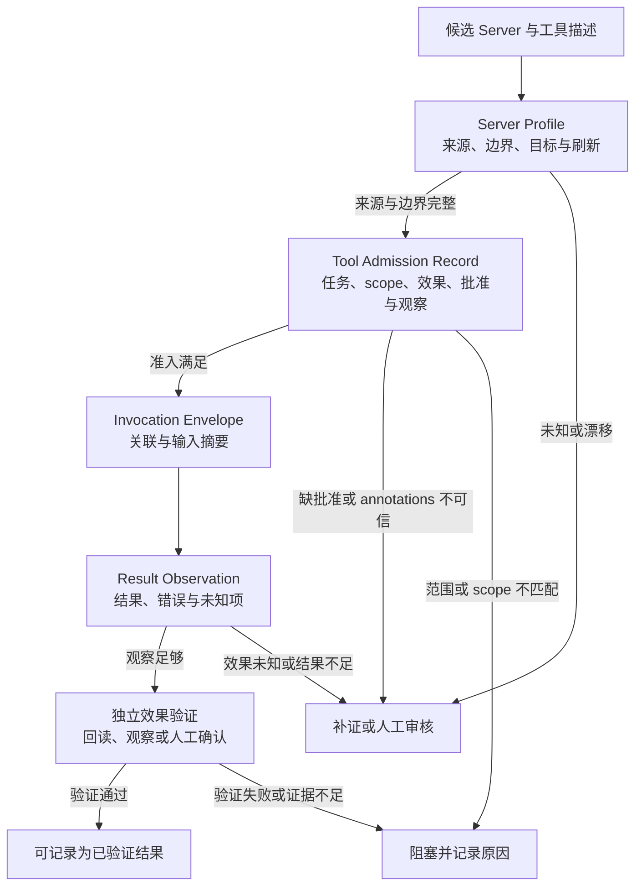

# 24. MCP 与外部工具集成

> 接入外部能力的难点不是让工具出现在列表中，而是让每一次能力使用都能回答：来自哪里、允许做什么、谁批准、做完后看到了什么，以及什么还没有得到证明。

## 本章目标

完成本章后，读者能够：

- 区分工具发现、信任判断、调用准入、调用结果和外部效果验证；
- 为候选 MCP Server 编写 Server Profile，而不把配置文件当作信任结论；
- 以 Tool Admission Record 约束一次具体任务的范围、效果、环境、批准和观察计划；
- 解释为什么 schema、工具 annotations 或一次成功返回不能单独证明安全和任务完成；
- 使用纯内存示例拒绝缺来源、缺 scope、缺批准或缺观察计划的接入描述。

## 为什么要学

团队把 MCP（Model Context Protocol）接到 Agent 时，常见的第一步是“列出工具，然后调用”。这在演示里很顺畅，在工程里却遗漏了最关键的问题：谁发布了这个 Server？它的工具描述覆盖哪个目标？这次任务要求的写入是否得到批准？工具返回的只是协议结果，还是已经验证了外部效果？

MCP 的 Tools 规范描述了工具发现、调用、输入 schema、结果/错误和 annotations 等协议面。[REF-036](https://modelcontextprotocol.io/specification/2025-11-25/server/tools) 这使客户端和 Server 能交换能力描述，但不为某个工具背书。尤其是规范对 annotations 的提示应当让读者警惕：来自 Server 的工具元数据不能自动成为可信安全标签。

本章不搭建真实 MCP Client 或 Server，不运行 stdio、HTTP、OAuth、浏览器、文件或网络调用。它给出一套可审查的接入模型；真实连接、授权和效果必须在相应环境中独立验证。

## 场景引入：外部索引更新请求

假设书稿助手发现某个外部 MCP Server 提供“更新参考资料索引”的工具。有人看到工具列表后，直接要求它同步全部参考资料。这个请求至少漏掉五个问题：

| 问题 | 若没有答案会发生什么 | 本章的保守动作 |
| --- | --- | --- |
| Server 来源和所有者是否可追溯？ | 无法判断能力描述来自哪里。 | 阻塞并补 Server Profile。 |
| 目标索引是否在任务范围内？ | 可能写入错误项目或租户。 | 阻塞并确认允许目标。 |
| 请求的 scope 是否最小？ | 无关资源也可能暴露或被改动。 | 缩小范围或人工审核。 |
| 写入是否有匹配批准？ | “工具可用”被误解为“可执行”。 | 进入人工批准。 |
| 写入后怎样验证？ | 返回成功被误记为索引已更新。 | 定义回读或独立效果检查。 |

这些步骤不是 MCP 的一组固定字段，而是本书为外部能力接入建立的工程接口。

## 核心概念

### 协议能力不是任务权限

协议解决“双方怎样表达工具”，而权限解决“这一次是否允许做这件事”。工具能被 `tools/list` 发现，只说明某个 Server 向 Client 声明了能力；它不证明 Server 来源可信、当前任务覆盖该目标，或用户同意了具有副作用的动作。[REF-036](https://modelcontextprotocol.io/specification/2025-11-25/server/tools)

同样，输入 schema 主要解决形状检查。它可以帮助发现缺字段、类型不匹配或不符合声明的参数，却不能说明参数的业务含义正确、目标属于当前项目，或调用会产生可接受效果。

此外，在“是否允许”之前还有一个更早的问题：外部能力以什么形态交付给 harness。这不是准入流程的一环，而是一项独立的设计决策，本章在下文“工具交付形态的 token 经济学”小节单独讨论。

### Server Profile：先把候选能力说清楚

本书用 Server Profile 记录一个候选外部能力在进入任务前已知与未知的事实。它不是安装文件、凭证、网络配置或信任授予。

| 字段 | 要回答的问题 | 教学例子 | 不代表什么 |
| --- | --- | --- | --- |
| `serverId` | 正在讨论哪一个候选能力？ | `reference-index-service` | 已成功连接。 |
| `sourceVerified` | 来源和维护责任能否追溯？ | 官方仓库和维护团队已记录。 | Server 没有漏洞或内容正确。 |
| `transportBoundary` | 将通过何种受控边界接触？ | 受限的远程服务 profile。 | 网络、身份或数据边界已配置。 |
| `allowedTargets` | 本章任务允许接触哪些目标？ | `book-references-staging`。 | 任意同名资源都可写入。 |
| `refreshCondition` | 哪些变化会使旧判断失效？ | Server 版本、来源或目标切换。 | 信息永远有效。 |

### Tool Admission Record：把“能做”收窄为“本次可请求”

Tool Admission Record 是一次特定请求的准入工件。它把任务范围、效果类别、环境、批准和观察要求放在同一处，避免从“工具列表里有它”直接跳到“执行它”。

| 字段 | 为什么需要 | 不能替代 |
| --- | --- | --- |
| 工具与输入摘要 | 将请求关联到明确能力和意图。 | 完整参数验证或业务正确性。 |
| 任务范围与允许目标 | 防止工具正确地作用于错误对象。 | 源系统授权。 |
| 效果类别 | 区分只读、写入和高风险动作。 | 已知实际副作用。 |
| scope 与环境边界 | 检查请求没有超出最小范围。 | Token、RBAC 或 sandbox 的真实状态。 |
| 批准引用 | 对写入和高风险动作要求具名决定。 | 不可抵赖签名或平台授权。 |
| 观察计划 | 规定调用后需要回读什么。 | 结果已经发生。 |

MCP 的安全资料特别讨论了本地 Server、OAuth URL、SSRF、scope 过宽与用户同意等风险。[REF-086](https://modelcontextprotocol.io/docs/tutorials/security/security_best_practices) 这些资料说明接入不能只审参数；不过风险和缓解措施必须结合具体 Client、Server、部署和源系统验证。本书的准入记录只是把这种验证需求显式化。

### Invocation Envelope 与 Result Observation：不要跳过中间证据

请求通过准入后，Invocation Envelope 仍只是“准备调用”的记录。它应该绑定关联标识、工具、输入摘要、效果类别、批准引用和观察计划。若请求没有真正送出，应保持“未执行”；若送出但没有可信观察，应保持“效果未知”。

Result Observation 则记录工具实际返回了什么、什么时候返回、由哪个边界观察到，以及哪些效果仍需独立验证。一个 JSON 结果可以是失败、部分结果、重试提示或未知状态；即使结果显示成功，也不自动替代业务层回读、用户界面观察、审计记录或人工确认。

### 工具交付形态的 token 经济学：原生 schema、MCP 还是 CLI 加文档

前面的工件回答“外部能力接入之后如何治理”；在此之前还有一个常被默认跳过的设计决策——外部能力以什么形态交付给 harness。同一批能力至少有三种交付形态：注册为 harness 原生工具 schema、经 MCP Server 暴露、打包为命令行（CLI）工具加一份说明文档。形态不改变能力本身，却决定 token 成本在何时支付、被缓存如何固化，以及出问题时能否就地改造。

极简编码代理 pi 的作者 Mario Zechner 在 2025 年 11 月对 MCP 形态的固定成本做过实测；下表数字来自其博文当日环境，本书未独立复测，仅作量级参考。[REF-150](https://mariozechner.at/posts/2025-11-02-what-if-you-dont-need-mcp/)

| 交付形态（作者实测） | 开场装入的定义成本 | 约占其所用 Claude 模型上下文 |
| --- | --- | --- |
| Playwright MCP（21 个工具定义） | 约 13.7k token | 约 6.8% |
| Chrome DevTools MCP（26 个工具定义） | 约 18k token | 约 9% |
| 同批浏览器能力改为 CLI 工具加 README | README 约 225 token | 其余内容模型按需读取，不占开场成本 |

MCP 形态的定义成本在每个会话开场即支付：只要 Server 挂载，无论本次会话是否用到对应能力。而 CLI 形态把细节留在文档里，模型需要时才读取，即渐进披露（progressive disclosure）。作者还指出 CLI 输出可以落盘或经管道传递，不必全部流经模型上下文。[REF-150](https://mariozechner.at/posts/2025-11-02-what-if-you-dont-need-mcp/)

在这一权衡下，pi 明确不支持 MCP，作者原话是 “pi does not and will not support MCP”；确实需要某个 MCP Server 时，他的逃生舱是把它包装成 CLI 再交给代理（pi 的具体行为以访问日 2026-07-26 的资料为准）。[REF-149](https://mariozechner.at/posts/2025-11-30-pi-coding-agent/)

Armin Ronacher 补充了一个结构性观察：MCP 工具定义在会话开始时装入上下文并被 prompt cache（提示词缓存）固化，之后要热更新工具能力而不毁掉缓存，在他看来极难乃至不可能。[REF-151](https://lucumr.pocoo.org/2026/1/31/pi/)

本书由此延伸出一张对照表，把交付形态当作显式设计决策来评估。表中判断是本书的工程归纳，不出自上述作者：

| 维度 | 原生工具 schema | MCP | CLI 加文档 |
| --- | --- | --- | --- |
| token 成本 | 定义随 harness 常驻，每会话固定支付 | 全部工具定义开场装入，随工具数量线性增长 | 常驻仅一段短说明，细节按需读取 |
| 缓存行为 | 随系统提示词一同缓存，harness 升级即失效重建 | 被开场缓存固化，热更新能力与保住缓存难以两全 | 文档在会话中途按需进入上下文，不占开场缓存 |
| 可改造性 | 需要修改并发布 harness 本身 | 受 Server 实现与协议演进约束 | 可用 bash 直接组合、包装、改写 |
| 治理适配 | 随 harness 发布流程审查 | Server Profile 与 Admission 可直接对接 | 同样需要来源、scope、批准与观察，但最容易被绕过 |

落到选型上，本书建议按使用画像判断（本书工程延伸，不是唯一正确答案）：

1. 能力高频使用、需要跨客户端共享或协议化发现——选 MCP，并把开场 token 视为为治理接口支付的价格；
2. 能力在长会话中偶尔使用、可命令行化——选 CLI 加文档，用渐进披露换取更低的固定成本；
3. 少量核心能力、与 harness 同生命周期演进——收进原生工具 schema，随发布流程一起审查。

两条边界必须说明，它们是本书立场：

- **交付形态改变的是 token 经济学，不是证据链。** 本章的 Server Profile 与 Tool Admission Record 对 CLI 形态同样适用：一个从外部安装的 CLI 工具和一个 MCP Server 一样是外部能力，来源要可追溯、scope 要最小、写入要批准、效果要观察。“只是个命令行”不构成豁免。
- **本书不采纳“永不 MCP”的立场。** 当团队需要协议化的工具发现、跨客户端共享或与准入记录的结构化对接时，MCP 的开场 token 是在为治理接口付费；当团队能对 CLI 执行同样的准入纪律时，CLI 加文档避免了每会话的固定税。真正的错误不是选了哪一种形态，而是从未把形态当作需要记录理由的决策。

## 架构图：外部能力接入的证据边界

图源位于 [chapter-24-mcp-integration-boundary.mmd](../../diagrams/mermaid/chapter-24-mcp-integration-boundary.mmd)，已导出 [SVG](../../diagrams/exported/chapter-24-mcp-integration-boundary.svg) 与 [PNG](../../diagrams/exported/chapter-24-mcp-integration-boundary.png)。图表达本书模型，不表示真实 MCP 连接、授权、调用、日志或外部效果。



读图时要注意两个断点：Envelope 到 Result 之间才可能有真实调用；Result 到 Verify 之间仍不能宣称业务完成。图中没有画出凭证、网络、OAuth 或外部资源，因为这些都必须由具体实现和环境规则单独处理。

## 工作流程：从候选到可验证结果

1. **登记候选。** 记录 Server 来源、所有者、传输边界、允许目标与刷新条件。未知来源不能以“先连上看看”绕过。
2. **限定任务。** 把具体目标、工具、输入摘要和效果类别写入准入记录。不要让工具说明代替任务范围。
3. **检查环境与 scope。** 用任务 allowlist 比较本次请求，而不是因为某个凭证存在就接受更大范围。
4. **处理批准。** 写入、高风险或不可逆效果需要与本次范围匹配的决定；批准过期、范围不同或证据不足时停止。
5. **形成 Invocation Envelope。** 为可能的调用分配关联标识和观察计划。此时状态仍是“准备”，不是“已执行”。
6. **记录 Result Observation。** 记录实际返回或错误，并保留效果未知项；不要将传输级成功写成业务成功。
7. **独立验证。** 按效果类型回读目标、重新观察用户界面、比对审计记录或请人工确认。验证失败、未知或不可得时保持保守结论。

## 最小示例：接入前的纯内存判断

本章示例 [`assessMcpIntegrationAdmission`](../../examples/agent/mcp-integration-admission-assessment.mjs) 只检查一个注入对象是否有足够的来源、目标、scope、批准和观察计划。它不解析 MCP 消息、不连接 Server，也不执行 Tool。

```js
const result = assessMcpIntegrationAdmission({
  serverProfile: {
    serverId: "reference-index-service",
    sourceVerified: true,
    transportBoundary: "reviewed-remote-profile",
    allowedTargets: ["book-references-staging"]
  },
  toolRequest: {
    tool: "update_reference_index",
    target: "book-references-staging",
    effectClass: "write",
    requestedScopes: ["references:write"]
  },
  environment: { allowedScopes: ["references:write"] },
  approval: { status: "approved", target: "book-references-staging" },
  observationPlan: { verifyEffect: "read_back_index" }
});

// { status: "ready", executionPerformed: false, ... }
```

`ready` 的含义仅是“这份教学输入具备进入受控调用准备的条件”。它不是连接成功、授权成功、工具调用成功、索引更新成功或读者可见效果已验证。

## 逐步增强：从列表到接入门

### 第一步：只看工具列表

这一步只能回答“某个 Server 声明了什么”。把它用于探索可以，但不能自动建立信任或发起写入。

### 第二步：加入 Server Profile

在工具名之外记录来源、所有者、边界、目标和刷新条件。它让团队能发现“同名工具来自不同 Server”或“旧判断已过期”。

### 第三步：加入 Admission 与批准

把工具能力收窄到本次任务，并将写入、高风险动作送往批准。此时最小 scope 和目标范围必须同时满足。

### 第四步：加入观察与效果验证

将返回值与外部效果拆开。若工具对文档、数据库、工单或部署目标有副作用，就需要适合该目标的回读或独立观察；不能把“没有抛异常”作为最终验收。

## 工程实践

- **先从只读能力开始。** 用小范围、可观察、可撤销的任务熟悉能力边界，再讨论写入或高风险效果。
- **为来源和版本设刷新条件。** Server 来源、工具描述、目标、传输或批准任一变化，都可能使旧准入记录失效。
- **保持 tool metadata 与信任判断分离。** Schema、名称和 annotations 是输入，仍要经过来源、任务和环境审查。
- **把 scope 当成任务属性。** 只请求本次动作需要的最小范围；更宽 scope 是需要明确审查的变化，而不是便利优化。
- **保存观察的限制。** 记录观察来自哪里、何时取得、覆盖什么与不覆盖什么，避免交接时把局部结果扩大为全局成功。

## 常见错误

| 错误 | 为什么不成立 | 改正方式 |
| --- | --- | --- |
| 工具出现在列表里，所以可以使用。 | 发现不等于来源可信、范围匹配或批准。 | 建立 Profile 与 Admission。 |
| 输入通过 schema，所以调用安全。 | 形状正确不说明目标、权限或效果合理。 | 单独审查任务、目标、scope 和效果类别。 |
| Server 自己的 annotations 说“只读”，所以无需审核。 | 协议资料提示 annotations 不应被默认信任。 | 把它当作线索，结合独立策略判断。 |
| 工具返回成功，所以外部数据已更新。 | 结果可能只反映协议层或部分执行。 | 记录 Observation，并执行独立效果验证。 |
| 有 token 就可复用任何范围。 | 凭证存在不等于当前任务最小权限或批准。 | 用任务范围、目标和 scope 重新准入。 |

## 安全与边界

MCP 安全资料给出的风险背景提醒我们，外部接入可能牵涉本地进程、授权 URL、网络请求、scope、会话和源系统权限。[REF-086](https://modelcontextprotocol.io/docs/tutorials/security/security_best_practices) 这些问题都不能由一份 Markdown 准入记录解决。实际系统还要由安全负责人、平台、Client、Server 和资源所有者共同定义部署边界、凭证生命周期、网络策略、审计与事故响应。

本章示例故意不接触这些能力。它的价值是暴露缺口：当来源、范围、批准或观察计划缺失时，系统应当停止，而不是用“工具已经可见”填补证据空白。

## 章节总结

MCP 让外部能力可以被描述、发现和调用，但工程上的完成定义更长：候选能力必须有可追溯来源；每次请求必须匹配任务、目标、环境和批准；结果必须被观察；具有外部效果的任务还必须独立验证。交付形态（原生 schema、MCP 或 CLI 加文档）同样应作为显式设计决策记录：它改变 token 成本与缓存行为，但不改变这条证据链。将这些边界写成工件，才能让后续的浏览器自动化、协作和 Git 工作流沿用同一套“能力不等于完成”的原则。

## 练习

1. 为一个只读知识检索工具写 Server Profile，列出来源、允许目标、刷新条件与未知项。
2. 将“创建工单”写成 Tool Admission Record，并定义哪种批准和回读证据才足以进入下一步。
3. 找出一个把 schema 验证误当作授权或业务验收的流程，设计一条独立验证路径。

## 延伸阅读

- 第 11 章：Tool Use 与工具协议。
- 第 12 章：Environment、Sandbox 与权限。
- 第 14 章：Human-in-the-loop。
- 第 17 章：Evaluation 与可验证结果。
- [REF-149：pi 作者构建札记](https://mariozechner.at/posts/2025-11-30-pi-coding-agent/)，用于核对不内置 MCP 与 CLI 逃生路径的作者立场；访问于 2026-07-26。
- [REF-150：What if you don't need MCP at all?](https://mariozechner.at/posts/2025-11-02-what-if-you-dont-need-mcp/)，用于核对 token 实测与 CLI 文档渐进披露；访问于 2026-07-26。
- [REF-151：Pi: The Minimal Agent Within OpenClaw](https://lucumr.pocoo.org/2026/1/31/pi/)，用于核对 prompt cache 与工具定义热更新的作者观察；访问于 2026-07-26。

## 参考资料

- [REF-036、REF-086、REF-149、REF-150 与 REF-151 的用途、访问日和外推禁区](24-mcp-and-external-tool-integration.references.md)。

## 章节完成检查表

- [x] 已区分协议能力、来源、准入、调用、观察与效果验证。
- [x] 已将外部能力接入模型标为本书原创工程模型。
- [x] 纯内存示例、测试和图示不伪称真实 MCP 连接或调用。
- [x] 协议与安全资料的动态复核条件已记录。
