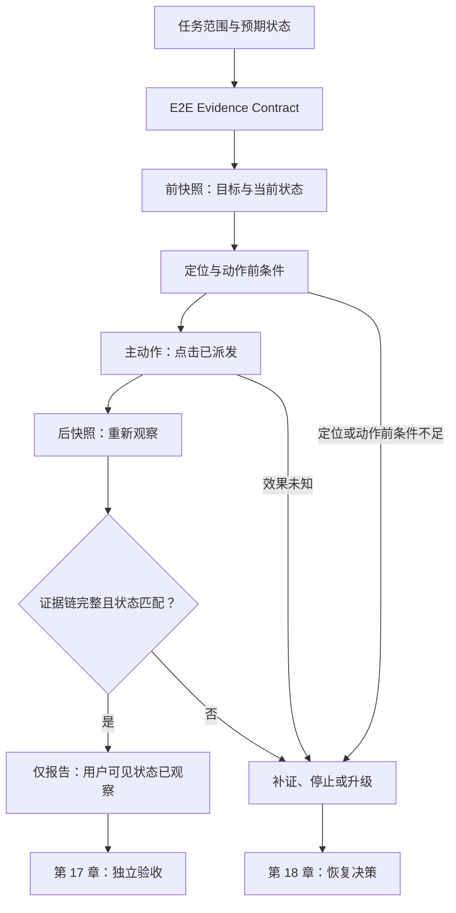

# 25. 浏览器自动化 Agent

> 浏览器自动化 Agent 的难点不是发出点击，而是把“要验证哪条用户路径、到底操作了什么、操作后看见什么、还没有证明什么”变成可以复查的证据链。

## 本章目标

完成本章后，读者能够：

- 区分浏览器会话可达、元素可定位、动作可派发、用户可见状态被观察与业务结果被验收这五种不同结论；
- 为一个浏览器路径写出范围明确的 E2E Evidence Contract，而不把截图、HTTP 成功或模型文本当成唯一证据；
- 解释为什么本书要求“前快照 → 主动作 → 后快照”，以及该规则不证明什么；
- 将定位、自动等待、断言、环境、敏感操作、恢复和人类审批放到各自应承担的层；
- 用纯内存示例识别一条证据链何时不足，而不伪称已经验证真实 UI。

## 为什么要学

浏览器是用户真正接触的边界。后端接口可以返回成功，页面也可以加载；但按钮可能被遮挡、表单校验提示可能没有出现、跳转可能去了错误账号，或操作实际上从未送出。反过来，浏览器工具没有报错，也只说明某项工具层动作得到一个结果，并不自动说明用户目标、业务规则、权限或外部副作用已经满足。

WebDriver 是远程检查和控制用户代理的、平台与语言无关的协议，主要用途之一就是由独立控制进程自动化浏览器。[CH25-REF-01](https://www.w3.org/TR/webdriver2/) Chrome DevTools Protocol（CDP）则把对 Chromium 系浏览器的检查、调试和分析能力组织为 domains、commands 与 events。[CH25-REF-05](https://chromedevtools.github.io/devtools-protocol/) 这些来源说明了“浏览器可被工具化控制或读取”的事实，却没有提供一个通用的 Agent 成功定义。

本章不教你绕过登录、防机器人、支付确认或权限控制，也不宣称一个浏览器脚本可以取代人工验收。它只建立一条保守原则：**要把某条用户可见路径报告为 E2E 已观察，必须留下与同一范围关联的前观察、主动作和后观察；随后还要把业务接受交给独立评估。** 这是本书工程模型与本项目的 E2E 规则，不是 Playwright、WebDriver 或 CDP 的强制流程。

## 前置知识

- **前置章节：** 第 11 章区分工具候选、调用、结果和外部效果；第 12 章给出环境与 Sandbox 边界；第 14 章处理人工批准；第 15 章定义观察质量；第 17 章定义验收；第 18 章处理未知效果和恢复。
- **技术前提：** 能阅读 JavaScript 对象、测试断言和顺序流程；了解浏览器、DOM 与 HTTP 是不同层即可。
- **不要求：** 本章不要求安装 Node 包、启动本地站点、登录账号、配置浏览器驱动、运行 Playwright、Selenium、CDP 或 WebDriver。

> 注意：第 25 章关注浏览器这个外部执行边界。第 24 章讨论 MCP 与外部工具接入；本章不会把浏览器工具协议、用户权限或任务验收重新定义一遍。

## 场景引入：订单提交后，究竟看见了什么

设想测试环境中有一个“提交订单”页面。Agent 收到任务：“确认用户按下提交后能看见已提交状态。” 这句话至少缺少五个决定：

1. 当前会话属于哪个测试账号，是否允许操作该订单？
2. “提交”对应哪个用户可见目标，而不是某个恰好存在的 CSS 路径？
3. 动作之前页面处于什么状态？
4. 动作是否真的被派发，还是被策略、定位歧义、遮挡或超时阻止？
5. 动作之后需要看见什么，才能说“该用户可见状态被观察”？

本章把成功标准限制为：在允许的测试范围内，对同一目标留下动作前快照；派发一次明确的主点击；随后取得另一份动作后的观察，并看见 `submitted`。即使这些条件都满足，我们仍不能推出库存、扣款、邮件、后端异步任务或生产订单全部完成。那些是更大范围的业务验收问题。

**场景边界：** 本章没有真实订单、站点、浏览器、网络请求、Cookie、账号或截图。所有字段和状态都只是教学对象。

## 核心概念

### 浏览器自动化是工具层，不是验收层

浏览器自动化工具可以导航、寻找元素、输入、点击、读取 DOM、截取屏幕或观察网络。WebDriver 标准把这类能力表述为从外部进程远程控制用户代理，并提供发现与操作文档元素的接口。[CH25-REF-01](https://www.w3.org/TR/webdriver2/) CDP 是另一个协议实例，并且其最新协议明示可能变化且不保证向后兼容。[CH25-REF-05](https://chromedevtools.github.io/devtools-protocol/)

这解释了工具层的职责：它传递操作或观察。它不解释业务语义。例如，读取到 `200`、获得截图字节、看到元素仍在 DOM 中，都可能是有价值的观察，但它们不能单独回答“用户是否完成了提交”。

本书据此分开五个结论：

| 结论 | 最多能说明什么 | 仍不能说明什么 |
| --- | --- | --- |
| 会话可达 | 某个工具能够连接或创建浏览器上下文 | 账号、环境或任务范围合适。 |
| 目标可定位 | 在当前观察中找到了某个候选元素 | 它就是用户意图的唯一目标。 |
| 动作可派发 | 工具已经尝试发送输入事件或命令 | 后端、页面或业务状态已改变。 |
| 后状态已观察 | 在动作之后读到了受控范围内的状态 | 业务流程、权限或外部副作用已经完成。 |
| 任务已验收 | 独立规格确认当前范围的成功条件 | 未覆盖范围也正确，或不再需要人工责任。 |

第 17 章负责最后一行。浏览器 Agent 不应跳过前四层，直接把工具日志说成验收结论。

### 定位与 Actionability：动作前条件不是动作后结果

定位器（Locator）是把意图映射到当前页面候选的选择。Playwright 的 Locator 文档建议优先使用面向用户的属性或显式测试契约来提升韧性，并说明 Locator 每次被用于动作时会定位当时的 DOM。[CH25-REF-04](https://playwright.dev/docs/locators) 这是该产品对 Locator 的建议，不代表任何定位器都正确，更不能自动理解“用户想完成什么”。

Playwright 还会在 `locator.click()` 等动作前进行 actionability 检查，例如检查目标是否唯一、可见、稳定、可接收事件以及启用；在给定超时内未通过时会失败。[CH25-REF-02](https://playwright.dev/docs/actionability) 这很重要，因为它把“看似能点”与“工具准备点击”区分开来。但 actionability 是**动作前**条件，而不是“提交后状态已经出现”。

因此，下面两段判断不能合并：

```text
目标在当前页面可操作  ≠  用户可见目标已经达成
点击调用没有抛错      ≠  业务提交已经完成
```

如果一个 Agent 为了让测试“通过”而强制绕过工具的动作前检查，结果可能只是把定位或遮挡问题藏起来。本书不规定每个工具的等待策略；它只要求记录该策略是否被绕过，并仍以动作后的独立观察判断用户可见状态。

### E2E Evidence Contract：把观察、动作和范围绑在一起

**E2E Evidence Contract** 是本书为浏览器路径定义的审查工件，不是 WebDriver command、CDP event、Playwright fixture 或测试框架配置。它用来回答以下问题：

| 字段类别 | 本书建议记录的内容 | 作用 | 不替代什么 |
| --- | --- | --- | --- |
| 任务范围 | 允许环境、测试数据、目标页面、用户目标与不覆盖范围 | 防止“在任何页面点一下”成为测试 | 真实授权或环境配置。 |
| 前快照 | 快照标识、序号、目标、当前状态、来源与限制 | 说明动作前究竟看见什么 | 长期日志、完整 Trace 或真实截图。 |
| 主动作 | 关联标识、意图、目标、动作类型、派发状态与效果未知项 | 说明测试真正操作了什么 | 动作必然成功或一定无副作用。 |
| 后快照 | 不同快照标识、动作后序号、目标、状态、来源与限制 | 说明动作后实际重新观察到什么 | 业务验收或因果证明。 |
| 判定 | 预期状态、观察结论、未覆盖范围与下一步 | 防止把证据不足伪装成成功 | 恢复计划、人工批准或产品发布。 |

本书不要求这些工件都保存为数据库表。一个小型测试可以把它们作为 Trace 附件；一个长期 Agent 可以写成状态记录。关键是能回答“哪一份观察在动作之前、哪一份在之后、是否针对同一目标、为什么当前结论仍然受限”。

### “前快照 → 主动作 → 后快照”是本书 E2E 规则

对于用户可见路径，本书采用以下最小证据顺序：

1. **前快照：** 在动作前观察目标，写清页面范围、目标和当前状态。
2. **主动作：** 执行任务要验证的用户交互，例如点击“提交”，而不是仅加载页面或调用旁路接口。
3. **后快照：** 在同一任务范围重新观察，且后快照不能复用前快照的标识。
4. **受限判定：** 仅当后状态满足已声明的预期，才可写“该用户可见状态已观察”。
5. **独立验收或升级：** 仍由第 17 章的 Evaluation Spec 判断业务成功；证据不足、状态不匹配或效果未知则按第 18 章补证、停止或恢复。

这条规则的目的不是强制所有测试都点击按钮。例如，纯展示页面的可访问性检查、只读报表核对或协议兼容性测试会有不同主动作。它也不是说一次点击即可消除竞态、缓存、错误页面或后台任务延迟。它只是拒绝一种常见的错误替代：只加载、只读源码、只看接口或只读工具输出就报告 E2E 完成。

## 架构图：从动作到可审查的 E2E 证据

下图回答：动作之后为什么仍然必须重新观察，并由质量门限制结论？灰色边界外的产品或业务验收不由浏览器工具自动完成。



图示说明：`Click` 与 `After` 之间的箭头不是因果证明，而是本书要求后续观察仍以同一目标和范围为依据。`Observed` 的文字刻意不写“任务完成”；它必须移交给独立验收。

图源：[Mermaid 源码](../../diagrams/mermaid/chapter-25-browser-e2e-evidence-loop.mmd)；导出：[SVG](../../diagrams/exported/chapter-25-browser-e2e-evidence-loop.svg) 与 [PNG](../../diagrams/exported/chapter-25-browser-e2e-evidence-loop.png)。

## 工作流程：设计一条浏览器 E2E 路径

1. **限定环境与数据：** 先指定允许的浏览器 profile、测试账号、域名、页面与禁止操作。若目标包含个人信息、支付、删除、提交或生产会话，先停在第 12、14 章的环境与批准门。
2. **写出用户可见预期：** 用“提交后状态区域显示 `submitted`”这样的可观察条件，替代“按钮应该能用”的抽象愿望。把不覆盖的异步后台结果也写出来。
3. **选择可审查定位：** 优先让产品提供稳定、面向用户的名称、角色或明确测试契约。Playwright 的 Locator 建议支持这种选择方向，但真实页面仍需人工核对定位是否符合用户意图。[CH25-REF-04](https://playwright.dev/docs/locators)
4. **记录前快照：** 保存当前目标、状态、来源、范围和限制。没有前快照时，后来的变化无法与动作前状态对照。
5. **执行一项主动作：** 真正执行所验证的交互，例如点击、填写并提交，记录动作关联标识、派发结论和任何工具层异常。不要把辅助导航当成主动作。
6. **记录后快照：** 在主动作之后重新读取同一目标。Playwright 的异步断言会重复获取与检查已声明条件直到满足或超时，这是一个产品层“重新检查条件”的实例。[CH25-REF-03](https://playwright.dev/docs/test-assertions) 本书不会把该机制外推为所有工具或业务规则。
7. **做受限判定：** 后快照缺失、目标不一致、只是推测、时间顺序不明或预期状态未出现时，都只能报告证据不足或状态未观察，不报告 E2E 成功。
8. **移交验收与恢复：** 由 Evaluation Spec 处理业务接受；若动作是否产生副作用仍未知，不能盲目重放，而应记录最后观察并进入恢复或人工升级。

## 最小示例：检查教学 E2E 证据链

本章示例没有浏览器。它把前快照、点击、后快照与预期状态表达为注入对象，并检查顺序和结论是否完整。完整实现见 [browser-e2e-evidence-assessment.mjs](../../examples/agent/browser-e2e-evidence-assessment.mjs)。

```js
const decision = assessBrowserE2EEvidence({
  action: {
    actionId: 'submit-order-demo',
    kind: 'click',
    target: 'submit-order',
    sequence: 2,
    dispatchStatus: 'dispatched',
    effectStatus: 'known',
    expectedState: 'submitted',
  },
  beforeSnapshot: {
    snapshotId: 'before-demo',
    sequence: 1,
    target: 'submit-order',
    state: 'ready',
    evidenceStatus: 'observed',
  },
  afterSnapshot: {
    snapshotId: 'after-demo',
    sequence: 3,
    target: 'submit-order',
    state: 'submitted',
    evidenceStatus: 'observed',
  },
  evidenceContract: contract,
});
```

**实际验证命令：**

```bash
node --test examples/agent/browser-e2e-evidence-assessment.test.mjs
node examples/agent/browser-e2e-evidence-assessment.mjs
```

2026-07-16 已实际执行：专用测试 10 项通过、0 项失败；演示输出 `observed` 与 `e2e_evidence_chain_complete`。更早的红灯步骤真实得到 `ERR_MODULE_NOT_FOUND`，因为实现模块尚不存在。上述结果仅证明 JavaScript 纯函数对注入对象的判断；它不证明真实浏览器、DOM、点击、用户路径、外部效果或业务完成。

## 逐步增强：只在有明确需求时增加真实复杂度

1. **从教学对象到真实测试环境：** 只有已确定测试站点、账号、允许范围和数据清理方式时，才让快照来源改为实际浏览器观察。升级触发条件是需要验证具体用户路径，而不是“想让 Agent 更自动”。
2. **从单状态到多证据：** 若页面状态不足以表达风险，可增加网络结果、下载清单、无障碍树或 Trace。但每项证据要说明它支持哪条准则，不能把更多日志误当作更完整的成功。
3. **从单 Agent 到隔离会话：** 当任务并行或有登录态时，为每个任务分配隔离浏览器上下文、命名和清理责任。隔离减少状态串扰，不等于自动获得权限。
4. **从失败到恢复：** 只有确定操作可安全重试，或已有重新观察/补偿/人工处理规则时，才对超时或中断设计恢复。`effect_unknown` 不是“再点一次”的许可。

## 完整工程案例：测试环境中的订单提交验证

**背景：** 团队需要让一个测试 Agent 验证订单提交页面的用户路径。它只能使用测试账号和测试数据，且不得提交真实订单。

**约束：** 订单可能在页面提交后异步处理；页面按钮、接口状态和业务状态不是同一件事。系统还可能因为浏览器会话遗留、定位器过宽或页面重渲染而产生假阳性。

**设计选择：**

| 决策 | 选择 | 原因 | 仍需的边界 |
| --- | --- | --- | --- |
| 会话 | 一项任务一份受控测试会话 | 降低账号与页面状态串扰 | 仍需确认会话不含生产凭证。 |
| 定位 | 用户可见名称或显式测试契约 | 更接近用户意图，便于审查 | 仍需人工确认名称和可访问语义。 |
| 主动作 | 只记录真正的“提交”交互 | 区分导航、准备动作和受测动作 | 不说明请求已被业务处理。 |
| 后观察 | 重新读取状态区域 | 避免只根据点击返回下结论 | 状态区域不代表库存、扣款或邮件。 |
| 验收 | 由独立规格判断当前测试范围 | 不让浏览器工具自证正确 | 扩展到后端状态要新增明确准则。 |

**运行路径：** Agent 先建立订单页和状态区域的前快照；以唯一关联标识记录提交点击；动作后重新读取状态区域。若页面显示 `submitted`，可记录“当前用户可见状态已观察”。如果出现 `validating`、错误提示、后快照缺失或效果未知，则保留原始观察、停止报告成功，并交给第 18 章的恢复路径或人类处理。

**结果与证据：** 本案例是设计案例，不包含真实运行输出。它提供的是如何组织将来 E2E 记录的结构，而非一个已经验证过的订单流程。

## 实现说明：证据链比工具名更稳定

浏览器工具会变：WebDriver 是标准协议，CDP 是 Chromium 特有协议，测试框架和 Agent 工具还会在它们之上封装更多操作。相比绑定某一个 SDK，本书把稳定接口放在证据关系上：

- 前快照与后快照需要针对同一个受测目标；
- 后快照在记录顺序上必须晚于主动作，且不能复用前快照标识；
- 主动作需要有派发结论，效果未知则不能当作失败后安全重试；
- 后观察即使匹配期望，也只进入 `observed`，不能越过 Evaluation Spec 直接进入“已完成”。

示例用 `sequence` 而不是实际时间。这样能避免伪造浏览器等待或时钟行为，也让测试只验证这一章想教的顺序关系。生产系统可用 Trace、事件时间、会话标识或工具自身日志实现相似关联，但字段、时钟来源、隐私要求和可靠性必须由实际环境重新设计。

## 测试与验证

| 层级 | 验证对象 | 命令或方法 | 成功标准 | 实际状态 |
| --- | --- | --- | --- | --- |
| 单元 | 注入的 E2E Evidence Contract | `node --test examples/agent/browser-e2e-evidence-assessment.test.mjs` | 主点击、前后快照、顺序和状态的 10 条判断符合教学契约 | 2026-07-16 已执行：10 通过、0 失败。 |
| 演示 | 最小接受路径 | `node examples/agent/browser-e2e-evidence-assessment.mjs` | 输出受限的 `observed / e2e_evidence_chain_complete` | 2026-07-16 已执行，退出码 0。 |
| 图示 | Mermaid 源码与导出图 | Mermaid CLI 渲染并检查图文一致性 | 图中不把点击或后状态写成业务完成 | 本章局部渲染已执行；共享总校验由主线程整合时复跑。 |
| 真实 E2E | 实际用户路径 | `TODO(verify)：` 指定环境后选用浏览器自动化工具 | 快照、主动作、后快照与独立验收均留有真实证据 | 未执行；本章没有真实目标与授权。 |

## 工程实践

- **把浏览器上下文视为有状态资源：** 明确由谁创建、使用、隔离、清理和保存证据。不要因为会话可达就把它视作可安全复用。
- **让被测用户目标可审查：** 定位策略应能解释“为什么这是用户要操作的元素”，而不只是“这个选择器刚好匹配”。
- **将观察范围写在证据旁：** 例如“状态区域文本”与“订单业务已完成”不是同一范围。限制越清楚，越不容易在交接时扩大结论。
- **在未知效果时停止自动重放：** 浏览器连接中断、页面跳转或工具超时后，先重新观察或升级。不要从缺回包推导“动作没有发生”。
- **只保存必要证据：** 截图、DOM、Trace 与 Cookie 可能含敏感信息。范围、脱敏、保留期和访问控制应在环境契约中事先约定。

## 最佳实践

- 为每条 E2E 路径先写“用户看到什么”，再选择工具、定位和断言。
- 让一个主动作对应一个明确关联标识；对并行流程不要用“最近一次点击”猜测归属。
- 保留前后观察的不同标识和顺序，避免后来的报告复用动作前状态。
- 将工具动作前检查视为降低操作失败的机制，而不是产品成功证据。
- 把登录、删除、支付、提交、下载、生产访问和跨账号操作列为需要额外环境与审批判断的风险动作。

## 常见错误

| 错误 | 表现 | 根因 | 修复方向 |
| --- | --- | --- | --- |
| 只加载页面就报告 E2E | 页面标题存在即写“用户流程通过” | 没有执行受测主动作 | 写出主动作并在动作后重新观察。 |
| 只看 HTTP 或工具返回 | 收到 `200` 或 click 返回即报告成功 | 将协议层结果当作用户可见状态 | 把协议观察与页面/业务验收分开。 |
| 定位器过宽 | 点击到同名但错误的元素 | 没有表达用户目标和唯一性 | 采用可审查定位契约，并人工核对语义。 |
| 复用前快照 | 动作后没有真实读取仍报告状态存在 | 无法区分动作前后 | 记录不同快照标识与顺序。 |
| 超时后盲目再点 | 产生重复提交或不可解释状态 | 将效果未知误当成未发生 | 先重新观察，按恢复契约停止或升级。 |
| 将 `observed` 写成 `accepted` | 页面状态出现就宣称任务完成 | 混淆观察和验收 | 用第 17 章的独立规格判断接受范围。 |

## 安全与边界

- **权限边界：** 浏览器或远程调试连接拥有的会话能力不等于任务被批准。特别是生产 profile、跨账号访问、支付、删除、下载和提交必须有显式环境与批准条件。
- **数据边界：** DOM、截图、下载、控制台日志、网络请求和 Cookie 都可能泄露敏感数据；记录前应确定最小采集、脱敏、保留期和访问者。
- **人工审批点：** 不可逆或高影响动作、需要真实身份的操作、Cookie/凭证导入、跨租户或跨环境导航，以及效果未知后的继续操作，应由人类决定。
- **不适用范围：** 本章不保证反自动化绕过、视觉正确性、无障碍合规、性能、跨浏览器一致性、法律合规、数据正确性或生产发布质量。

## 章节总结

浏览器自动化 Agent 应把浏览器看作一项有状态、可能带来副作用的外部工具。定位、动作、断言和截图都很有用，但没有任何一项自动等于用户目标成功。本书的 E2E Evidence Contract 用前快照、主动作、后快照和受限判定防止最常见的跳步；随后仍把业务接受、风险动作和恢复交给各自的专门章节。

下一章会把同样的边界扩展到多 Agent 协作：当多个执行者共享任务、浏览器状态或证据时，如何保持隔离、归属和交接。

## 练习

1. 为“更新个人资料”路径写一个 E2E Evidence Contract：前快照、主动作、后快照、预期状态与不覆盖范围分别是什么？
2. 某测试只有 API 返回 `200` 和一张动作前截图。按本章模型，它缺少哪些证据？为什么不能报告 E2E 成功？
3. 页面提交超时，但你无法判断点击是否已经抵达服务端。写出一个保守的下一步，说明为什么不能立即重试。
4. 比较“可定位”“可点击”“状态已观察”和“业务已验收”四个结论各自需要的最小证据。

## 延伸阅读

- [W3C WebDriver](https://www.w3.org/TR/webdriver2/)：浏览器远程控制协议的范围、会话和安全/隐私附录。
- [Playwright Auto-waiting](https://playwright.dev/docs/actionability)：动作前 actionability 检查的产品限定行为。
- [Playwright Assertions](https://playwright.dev/docs/test-assertions)：Web-first 异步断言与其受限范围。
- [Playwright Locators](https://playwright.dev/docs/locators)：面向用户的定位与显式测试契约建议。
- [Chrome DevTools Protocol](https://chromedevtools.github.io/devtools-protocol/)：Chromium 专有协议的 domain、command、event 与版本漂移边界。

## 参考资料

- CH25-REF-01 — W3C WebDriver；支持浏览器远程控制协议的受限背景。
- CH25-REF-02 — Playwright Auto-waiting；支持特定动作的 actionability 与超时边界。
- CH25-REF-03 — Playwright Assertions；支持 Web-first 异步断言重新检查条件的限定描述。
- CH25-REF-04 — Playwright Locators；支持定位建议与动作时重新定位 DOM 的限定描述。
- CH25-REF-05 — Chrome DevTools Protocol；支持 Chromium 协议的 domain、command、event 与版本漂移背景。

## 章节完成检查表

- [x] Front matter、目标、前置知识、依赖和交接关系完整。
- [x] 内容为原创表达，协议/产品事实与本书工程模型已分开。
- [x] 每项外部事实都有局部可追溯来源；未来真实运行项明确标记 `TODO(verify)：`。
- [x] Mermaid 图源、读图说明、导出文件和正文术语一致。
- [x] 示例已实际运行，且明确不代表真实浏览器 E2E。
- [x] 技术、事实、语言、示例与图示审查已记录在本章隔离路径。
- [ ] 共享引用、术语、目录、进度与全仓 `npm run validate` 由主线程整合后复核。
