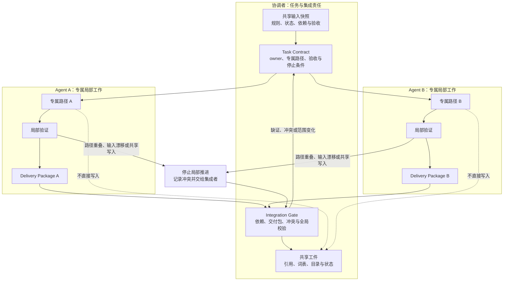

# 26. 多 Agent 协作与任务隔离

> 多 Agent 协作的最小单位不是“多开几个会话”，而是一份有明确所有者、专属输出、验收条件、停止条件和集成责任的任务契约（Task Contract）。

## 本章目标

完成本章后，读者能够：

- 分清委派、并行、交接、集成和审批的责任，不把多个 Agent 同时工作写成天然协作。
- 为一个可并发候选写出 Task Contract，包含所有者、输入快照、专属路径、验收和停止条件。
- 识别路径重叠、共享工件、输入漂移和外部效果未知等情况，并选择停止、补证或交给集成者。
- 使用交付包（Delivery Package）将局部成果与实际验证结果、未覆盖范围和冲突线索交给集成门（Integration Gate）。
- 说明纯内存隔离预检能验证什么，不能验证真实 Agent、进程、worktree、文件锁、消息或浏览器会话。

## 为什么要学

一个团队常把“研究、起草和审查可以同时做”理解成“让三个 Agent 同时改仓库”。这两句话之间少了最关键的设计：谁拥有哪个输出？哪些输入已经固定？哪些文件是共享真相？出现冲突时谁有权合并、谁必须停止？

若没有这些答案，任务标题即使不同，也可能争夺同一份状态文件、术语表、目录、接口或外部目标。更糟的是，两个 Agent 可能各自通过了局部测试，却基于不同版本的输入；随后有人把两份“完成”摘要拼在一起，错误地写入共享进度。这不是模型不够聪明，而是协作边界没有被写成可审查接口。

OpenAI Agents SDK 的编排文档把“由 LLM 决定”与“由代码决定流程”分开，并说明互不依赖的任务可以并行以缩短时间。[OpenAI Agents SDK：Agent orchestration](https://openai.github.io/openai-agents-python/multi_agent/) 这只说明某个 SDK 的编排选择；它不证明两个任务真的互不依赖，也不提供本书所需的路径、权限、验证或集成协议。

> 边界：本章不创建真实多 Agent、子进程、后台调度、worktree、文件锁、消息队列、浏览器会话、Git 分支或外部资源。第 27 章专门讨论 Git、worktree 与代码审查；环境、批准、观察和恢复仍分别由第 12、14、15、17、18 章负责。

## 前置知识

- **前置章节：** 第 03 章的仓库上下文分层；第 09 章的任务拆解；第 10 章的工作流与状态；第 12、14 章的环境与批准边界；第 21 至 23 章的跨工具规则与自动化责任。
- **技术前提：** 能读懂 Markdown 表格、路径字符串、简单对象和 Node.js 内置测试输出。
- **不要求：** 不要求安装 Agent SDK、创建账户、配置并发执行器、使用 Git worktree 或拥有任何外部系统权限。

## 场景引入：三份“完成”，一份共享状态

设想一本技术书需要补齐三个互有关联的工件：研究人员准备第 26 章 Research Brief，写作者起草同章正文，审查者同时更新全书术语表。三人都把自己的任务叫作“第 26 章协作”，并且都认为完成后应更新 `.ai/progress.md`。

这组任务不能直接并行。Research Brief 是 Draft 的输入，正文和术语表都可能改变同一术语，进度表是共享工件。若三人同时写入，最后一个保存的人并不一定拥有更正确的结论。此时“并行”只是竞争的别名。

本章改用一个教学场景：协调者先将任务拆成两个专属输出和一个集中集成动作。Agent A 只写研究工件；Agent B 只写正文或示例；集成者唯一负责共享引用、术语、目录、进度和全仓校验。每个局部任务还必须声明输入、验收和停止条件。

| 原始意图 | 误解后的并行 | 可审查的拆分 | 成功标准 | 不能据此声称 |
| --- | --- | --- | --- | --- |
| 完成一个章节 | 多人随时修改正文和状态。 | 研究、正文、局部审查、共享收口分别有 owner。 | 每个交付物的路径与验收可定位。 | 真实 Agent 已并行执行。 |
| 更新全书术语 | 任意作者顺手改词表。 | 词表只由集成者在交付包检查后更新。 | 术语变更能回指到章节与证据。 | 术语在所有产品、会话或文档中自动同步。 |
| 快速完成 | 一份摘要宣称全部完成。 | 每个交付包保存实际命令、结果与未覆盖范围。 | 集成者可区分局部通过与全局通过。 | 外部效果、权限或书稿质量已全面验证。 |

**边界：** 这是一份本书教学模型。它没有运行任何实际协作系统，也没有修改本仓库的共享状态。

## 核心概念

### 并行候选不等于独立任务

两个任务能否并行，至少要检查四种依赖，而不能只比较名称：

| 依赖面 | 需要问的问题 | 可并行的最低条件 | 冲突时的保守出口 |
| --- | --- | --- | --- |
| 输入 | 两个任务是否读取同一份会变化的规则、状态或资料？ | 输入快照、版本或刷新条件明确。 | 停止其中一个，重新取得一致输入。 |
| 输出 | 是否会写同一路径、同一字段、同一术语或同一接口？ | 专属输出互不重叠，或共享写入有唯一集成者。 | 冻结局部写入，转入集成门。 |
| 验收 | 一个任务的测试是否依赖另一个未完成产物？ | 各自的验收对象、命令和成功条件可分开。 | 串行化，或把依赖改为显式前置。 |
| 效果 | 是否触及同一外部目标、身份、额度或不可逆动作？ | 独立环境与权限边界已经另行核验。 | 不把它当成局部并行；交由环境与批准流程。 |

这里的“专属输出”不是“谁先打开文件谁拥有”。它是一项在开始前可比较的声明：当前窗口中，只有一个具名 owner 可以修改这组局部工件。真正的文件锁、版本控制、租约或并发控制属于实现层；本章只定义其审查输入。

### Task Contract：先定义可领取的局部工作

本书将 Task Contract 定义为一个可领取任务的最小审查工件。它不是产品 schema、调度 API 或权限令牌。

| 字段 | 要回答的问题 | 教学例子 | 不代表什么 |
| --- | --- | --- | --- |
| `id` | 这次任务如何被准确引用？ | `chapter-26-draft` | 真实队列 ID、会话 ID 或用户身份。 |
| `owner` | 当前谁负责产生局部交付？ | `chapter-26-writer` | 永久的文件或系统权限。 |
| `inputSnapshot` | 依据哪些已知输入开始？ | Research Brief 的版本与日期。 | 输入仍然新鲜或没有其他依赖。 |
| `exclusivePaths` | 哪些输出面只能由该 owner 修改？ | 一个章节正文与其局部审查记录。 | 路径已被锁定或不存在语义冲突。 |
| `acceptance` | 用什么命令或审查判断交付可提交？ | 专用 Node 测试、局部 Markdown lint。 | 共享校验、发布或读者价值已经通过。 |
| `stopConditions` | 何时不得继续局部推进？ | 共享工件需要写入、路径重叠、输入漂移。 | 停止会自动修复问题。 |
| `requestedSharedWrites` | 哪些共享变更需要交给集成者？ | 进度表、词表、引用登记。 | 集成者已接受或已经写入。 |

任务契约的重点是把“待做事项”变成可判定的边界。没有 owner 时，无法知道谁该处理冲突；没有验收时，无法区分草稿与交付；没有停止条件时，任务会在输入变化或共享写入出现时继续漂移。

### 编排、委派与交接：谁保留最终责任

在 OpenAI Agents SDK 的 Python 文档中，manager 模式让一个 agent 保留对对话和最终答案的控制，并把专门任务作为工具调用；handoff 模式则让分诊 agent 将后续对话交给专门 agent。[OpenAI Agents SDK：Agent orchestration](https://openai.github.io/openai-agents-python/multi_agent/) [OpenAI Agents SDK：Handoffs](https://openai.github.io/openai-agents-python/handoffs/) 这是该 SDK 的产品语境，不是本章任务路由的实现。

本书将它们抽象为三个可审查问题：

| 协作动作 | 谁决定下一步？ | 谁拥有最终汇总？ | 本章要求保留的工件 | 不能推出的结论 |
| --- | --- | --- | --- | --- |
| 委派 | 协调者或已定义的路由规则。 | 协调者。 | Task Contract 与 Ownership Claim。 | 子任务已执行或被授权。 |
| 交接 | 当前 owner 因范围、专长或停止条件将任务交给下一位。 | 接手者只拥有新的明确范围。 | Handoff/Delivery Package。 | 上一位的摘要自动成为事实。 |
| 汇总 | 集成者检查交付包、依赖、冲突和验证。 | 集成者。 | Integration Gate 与共享更新计划。 | 所有局部结果已正确合并。 |

Handoff 文档还说明该 SDK 的 handoff 位于一次 run 内，且可通过输入 schema 和 input filter 调整交接输入。[OpenAI Agents SDK：Handoffs](https://openai.github.io/openai-agents-python/handoffs/) 这提醒我们：交接输入需要明确边界；但本书的交付包不采用该 SDK 的字段，也不承诺跨会话历史、消息或权限会自动传递。

### Ownership Claim 与共享工件：一份真相只能有一个写入责任

所有权声明（Ownership Claim）记录“谁在当前任务窗口负责哪个专属输出面”。它不授予环境权限，不能覆盖更高层规则，也不处理外部副作用。

| 工件类别 | 合适的写入模式 | 例子 | 为什么 |
| --- | --- | --- | --- |
| 章节局部正文 | 单 owner 专属路径。 | 一个章节的 `.md`、`.outline.md`、`.fact-check.md`。 | 局部修改可独立审查和测试。 |
| 局部示例与图示 | 单 owner 专属路径。 | 章节对应的 `.mjs`、测试、`.mmd` 与导出图。 | 代码、图与正文可按同一任务交付。 |
| 共享术语与引用 | 集成者唯一写入。 | `.ai/glossary.md`、`.ai/references.md`。 | 多章同时新增术语时需要统一命名和编号。 |
| 共享目录与状态 | 集成者唯一写入。 | `docs/SUMMARY.md`、`.ai/progress.md`、`.context/`。 | 这些文件回答全书当前事实，不能由局部摘要竞争。 |
| 外部目标 | 由环境、Tool 与批准边界决定。 | 网络服务、真实工作区、发布目标。 | 任务 owner 不等于技术授权或责任主体。 |

若两个局部任务都需要改同一共享工件，正确的动作不是建立两个 owner，而是把它列为 `requestedSharedWrites`，交由一个 Integration Gate 收口。若共享工件变更又影响某个局部任务的输入，该局部交付包必须标记输入漂移并重新验证。

### Delivery Package：交付的是证据，不是一句“已完成”

交付包是从局部所有权转向集成责任的接口。它应帮助集成者判断“能否合并、还要检查什么、哪些结论不能写进状态”。

| 字段 | 作用 | 示例性内容 | 不能替代 |
| --- | --- | --- | --- |
| 任务引用 | 关联 Task Contract 和 owner。 | `chapter-26-draft` / `chapter-26-writer`。 | 身份认证或权限证明。 |
| 产物清单 | 指出新增或修改的专属路径。 | 正文、测试、图源、审查记录。 | 已被共享目录收录。 |
| 验证记录 | 保存实际命令、退出状态和结果摘要。 | 10 项测试通过、局部 lint 通过。 | 全仓校验、外部效果或语义正确。 |
| 未覆盖范围 | 写明没有运行的真实系统或环境。 | 未创建 Agent、worktree、锁或消息。 | 失败或不重要。 |
| 冲突与漂移 | 报告输入、路径、术语或依赖变化。 | 共享词表需集成者更新。 | 已由集成者解决。 |

摘要只能作为导航，不能覆盖状态记录、测试输出或共享工件。第 10 章已经说明一次执行的状态、观察和验收结论不能混为“完成”；多 Agent 协作只是让这种要求更严格，因为错误摘要会被更多执行者放大。

### Integration Gate 与冲突恢复：先保存边界，再决定合并

集成门是本书模型中唯一有权处理共享更新的责任点。它的职责不是“替所有人重写工作”，而是验证局部交付是否可被放入同一份共享真相。

| 发现 | 先做什么 | 集成者需要的证据 | 可能的出口 |
| --- | --- | --- | --- |
| 专属路径重叠 | 停止受影响的局部写入。 | 两份 Ownership Claim、路径和最近修改意图。 | 拆分路径、串行化或人工裁决。 |
| 输入版本漂移 | 标记旧验证的适用范围。 | 输入快照、变化摘要、受影响验收。 | 重新验证、重新领取或停止。 |
| 共享术语冲突 | 不让任一作者覆盖词表。 | 两个章节的定义、来源与上下文。 | 统一术语、保留区别或升级。 |
| 外部效果未知 | 不把交付包写成成功。 | 尝试、观察、环境与批准记录。 | 按第 18 章补证、恢复或停止。 |
| 局部验证通过 | 比对依赖与共享变更。 | 命令、结果、未覆盖范围。 | 接受进入全局校验，或要求补充。 |

Lilian Weng 的文章把 Harness 概括为组织 prompts、tool calls、subagents、control flow、memory 与 workflow logic 的代码，并强调可编辑面与权限控制不应混在同一循环中。[Lilian Weng：Harness Engineering for Self-Improvement](https://lilianweng.github.io/posts/2026-07-04-harness/) 本章借用的是“协作需要可观察组件和外部边界”的问题意识；Task Contract、Ownership Claim 和 Integration Gate 均为本书原创工程模型。

## 架构图：专属工作与集中集成

下图回答：协调者如何将共享输入变成两个互不重叠的局部任务，并在局部验证后由集成门处理共享写入和冲突？可编辑源码位于 [chapter-26-multi-agent-ownership-swimlane.mmd](../../diagrams/mermaid/chapter-26-multi-agent-ownership-swimlane.mmd)，导出图为 [SVG](../../diagrams/exported/chapter-26-multi-agent-ownership-swimlane.svg) 与 [PNG](../../diagrams/exported/chapter-26-multi-agent-ownership-swimlane.png)。

图只表达本书的工件流；它不表示真实 Agent、并行进程、worktree、文件锁、消息、浏览器会话、Git 操作、权限、外部写入或验证结果。



> 图示替代描述：协调者将共享输入快照变成带 owner、专属路径、验收和停止条件的 Task Contract。Agent A 与 Agent B 分别只处理自己的专属路径，完成局部验证后形成两个 Delivery Package。两个包都进入 Integration Gate；只有 Gate 可以更新共享引用、词表、目录和状态。专属路径到共享工件的虚线表示禁止直接写入。路径重叠、输入漂移或共享写入请求会停止局部推进并回到集成门；缺证、冲突或范围变化会要求重新形成任务契约。图不表示真实并发或技术隔离。

读图时有两个限制：第一，两个子图同时出现不代表它们已经并发运行；它只表示它们的输出边界可以被设计成独立。第二，Integration Gate 写入共享工件也不等于它天然拥有权限或结果正确；第 12、14、17 章仍要求环境、批准和独立验收。

## 工作流程：从任务领取到集中收口

1. **冻结输入范围。** 协调者记录适用规则、当前状态、前置工件、版本和刷新条件。若不能说明输入来自哪里，暂不分派。
2. **写 Task Contract。** 为每个候选指定一个 owner、专属输出、验收、停止条件和任何共享写入请求。不要用“帮忙做第 26 章”替代契约。
3. **检查冲突面。** 比对专属路径、术语、接口、依赖、环境和外部目标。只有冲突面可分离时，任务才是并行候选。
4. **领取一个局部任务。** owner 只修改契约中的专属路径；遇到输入漂移、共享写入、范围扩大、效果未知或路径重叠时停止并记录原因。
5. **完成局部验证。** 执行已声明的专用测试、图示或文档检查；把实际命令、结果和未覆盖范围放入 Delivery Package。
6. **由集成者审查交付包。** Integration Gate 检查输入是否仍适用、输出是否冲突、依赖是否完成、验证是否足够，以及共享变更是否需要重新验证。
7. **统一回写共享工件。** 只有集成者在证据存在时更新引用、术语、目录、状态和全仓验证记录。接受、补证、冲突或停止均应保留可追溯结论。

此流程故意让“局部完成”与“全局完成”分开。局部任务通过并不自动释放共享状态更新；反过来，集成者也不应把没有实际验证记录的交付包写成已完成。

## 最小示例：纯内存任务隔离预检

本章的 [`assessTaskIsolation`](../../examples/agent/task-isolation-assessment.mjs) 只比较调用者注入的 Task Contract、Ownership Claim 和 Integration Contract。它返回 `ready`、`blocked`、`requires_integration` 或 `not_applicable`，用来训练“开始前发现边界缺口”的判断。

```js
import { assessTaskIsolation } from "../../examples/agent/task-isolation-assessment.mjs";

const result = assessTaskIsolation({
  task: {
    kind: "task_contract",
    id: "chapter-26-draft",
    owner: "chapter-26-writer",
    exclusivePaths: ["docs/part-04-engineering-practice/26-multi-agent-collaboration-and-task-isolation.md"],
    acceptance: ["local-node-test", "local-markdown-lint"],
    stopConditions: ["shared-artifact-needed", "ownership-conflict"],
  },
  claims: [],
  integration: {
    owner: "integration-lead",
    sharedArtifacts: [".ai/progress.md", ".context/CURRENT_STATE.md"],
  },
});

// result.status === "ready"
// result.route === "isolated_task"
```

从仓库根目录运行：

```bash
node --test examples/agent/task-isolation-assessment.test.mjs
node examples/agent/task-isolation-assessment.mjs
```

测试先于模块创建。2026-07-16 第一次命令实际以 `ERR_MODULE_NOT_FOUND` 失败，缺失的是目标模块；实现后同一命令实际通过 10 项测试、0 项失败。演示实际输出 `ready` / `isolated_task`，完整红绿过程见[示例计划](26-multi-agent-collaboration-and-task-isolation.example-plan.md)。

该结果只证明 JavaScript 函数会对注入对象作确定性分类。它没有创建 Agent、子进程、并行任务、worktree、文件锁、消息、浏览器会话、真实路径访问或共享状态写入。

## 逐步增强：从路径检查到可审查协作

1. **先分开专属输出。** 用人工维护的 Task Contract 避免同一路径被同时领取。升级触发：团队无法解释某个文件当前由谁负责。
2. **再冻结输入与验收。** 为输入快照和局部验证附带版本、时间或刷新条件。升级触发：局部测试经常基于过期规则或互相不兼容的资料。
3. **引入 Delivery Package 与 Integration Gate。** 让共享引用、词表、目录和状态只由集成者收口。升级触发：多个任务经常修改共享真相，或完成状态无法回指证据。
4. **最后接入真实隔离技术。** 当任务需要真实并发、分支、worktree、外部执行或共享环境时，另行设计版本控制、环境、凭证、锁、队列、审计、恢复和回滚。升级触发：冲突会影响生产目标、费用、不可逆数据或团队交付。

每一步只增加一种责任。不要因为开始有多个 Agent，就跳过输入、权限、批准、观察和集成设计。

## 完整工程案例：两位作者与一位集成者完成章节包

**背景：** 一个书稿团队想为虚构第 26 章同时准备正文和示例。写作者负责正式 Markdown；示例作者负责纯内存 JavaScript、测试和 Mermaid 图。两人都需要引用同一份研究结论，但共享引用表、术语表、目录和进度由集成者维护。

**约束：** 案例没有创建真实 Agent、Git worktree、分支、文件锁、网络、浏览器、消息或文件写入竞争。所有“作者”“集成者”“路径”和“验证”都是教学角色与工件。

| 角色 | 专属输入与输出 | 局部验收 | 停止条件 | 交付给集成者的内容 |
| --- | --- | --- | --- | --- |
| 写作者 | Research Brief、章节模板；正文、Outline、Fact Check。 | 原创性、引用范围、局部 Markdown 检查。 | 来源不足、术语冲突、需要共享登记。 | 文稿路径、来源键、命令、结果、未覆盖范围。 |
| 示例作者 | 示例计划；`.mjs`、测试、图源和导出图。 | 红灯、Node 测试、演示、图文一致性。 | 契约缺失、图文术语漂移、需要共享脚本入口。 | 模块、测试、演示、图、实际输出与边界。 |
| 集成者 | 两个 Delivery Package 与共享规则。 | 依赖、路径、术语、引用、目录、状态和全仓校验。 | 局部证据不足、共享冲突、全局校验失败。 | 统一的共享更新和下一项任务。 |

**设计选择：** 写作者与示例作者不直接改共享引用、词表、目录或状态。它们将需要的新增键、术语和链接写入交付包，由集成者统一核对。若集成者发现“同一术语被赋予不同含义”，它不会选择最后一份文稿，而是回传冲突、要求限定术语或由维护者裁决。

**失败处理：** 若写作者发现 Research Brief 被更新，正文的输入快照漂移，应停止并重读来源；若示例作者发现路径已被其他 owner 领取，应停止而非改名绕过；若共享写入请求出现，局部任务输出 `requires_integration`，而不是假装拥有写入责任。

**结果与证据：** 本案例只定义责任表和工件流。没有真实协作、合并、提交、运行时、浏览器或外部效果可以报告。

## 实现说明：让所有权只约束局部输出

`assessTaskIsolation` 按以下顺序作出教学判断：先确认输入像 Task Contract，再检查 owner、专属路径、验收和停止条件；随后拒绝把共享工件声明为专属路径；最后比对其他 owner 的 claim，或把共享写入请求路由给 integration owner。

| 决策 | 本章选择 | 原因 | 不替代的机制 |
| --- | --- | --- | --- |
| 路径表示 | 使用调用者传入的字符串。 | 让测试无文件系统依赖。 | 路径解析、符号链接、文件锁或 worktree。 |
| 重叠判断 | 不同 owner 的相同或父子路径即阻塞。 | 让可见写入面先被保守地保护。 | 语义冲突、生成物依赖或外部资源竞争。 |
| 同 owner 续接 | 允许相同 owner 继续已有 claim。 | 不把暂停恢复误判为并发冲突。 | 真实身份验证、租约、超时或抢占。 |
| 共享写入 | 返回 `requires_integration`。 | 将共享真相的回写从局部工作中拿出来。 | 集成者权限、实际写入、冲突解决或总校验。 |
| 非结构化输入 | 返回 `not_applicable`。 | 不把普通对话伪装成可分派任务。 | 任务理解、自动拆解或人类协调。 |

函数不读取当前仓库，也不通过路径字符串判断真实存在、修改时间或权限。这样它可以准确演示“契约完整性判断”，而不会把机器状态或产品行为伪装成测试结果。

## 测试与验证

| 层级 | 验证对象 | 命令或方法 | 成功标准 | 实际状态 |
| --- | --- | --- | --- | --- |
| 红灯 | 缺失的示例模块。 | `node --test examples/agent/task-isolation-assessment.test.mjs`。 | `ERR_MODULE_NOT_FOUND`，证明测试先于模块。 | 2026-07-16 实际运行，退出码 `1`。 |
| 单元 | 纯内存任务隔离预检。 | `node --test examples/agent/task-isolation-assessment.test.mjs`。 | 10 条路径精确断言状态、路由或原因。 | 2026-07-16 实际运行：10 项通过、0 项失败。 |
| 演示 | 完整的教学 Task Contract。 | `node examples/agent/task-isolation-assessment.mjs`。 | 输出 `ready` / `isolated_task`。 | 2026-07-16 实际运行。 |
| 图示 | 所有权、交付和集成流。 | Mermaid 源导出 SVG/PNG，比较图源并人工查看 PNG。 | 节点、箭头、虚线禁止写入与停止路径可读。 | 已完成，见 Diagram Review。 |
| 局部文稿 | 本章 Markdown 与相对链接。 | `npx --no-install markdownlint-cli2`、`markdown-link-check`。 | 退出码 0。 | 已完成，见 Final Review。 |
| 运行时 | 真实多 Agent、进程、worktree、锁、消息、浏览器与外部效果。 | 不在本章实现。 | 需要独立环境与端到端证据。 | 明确排除。 |

> 风险：10 项测试通过只表示本书函数对 10 组注入对象的处理符合断言。它既不证明真实路径没有竞争，也不证明多个 Agent 已被隔离、任务已合并或共享状态已安全更新。

## 工程实践

- **先分配输出面，再分配角色。** “研究者”“写作者”是能力标签；真正的协作边界应以输入、专属输出和验收来表达。
- **让共享写入显式排队。** 共享引用、术语、目录和进度进入集成门，而不是让任意局部任务在最后顺手修改。
- **把停止条件当成交付质量的一部分。** 输入漂移、路径重叠、共享写入、效果未知和验收缺失应生成结构化理由，而不是隐藏为延迟或沉默。
- **把局部验证与全局验证分层。** 局部测试帮助尽早发现问题；集成者仍需检查交叉引用、共享术语、目录和全仓校验。
- **为外部效果另建控制面。** 任务所有权不能取代最小权限、批准、回读、审计、重试或补偿。

## 最佳实践

| 推荐 | 原因 | 适用边界 |
| --- | --- | --- |
| 每项并行候选只拥有一组可比较的专属输出。 | 冲突可以在写入前暴露。 | 不足以隔离同一外部目标或语义依赖。 |
| Task Contract 同时列出验收与停止条件。 | “何时完成”和“何时不能继续”同样重要。 | 停止后仍需一个责任主体处理后续。 |
| Delivery Package 总是写未覆盖范围。 | 集成者不会把局部绿色结果扩大为全局事实。 | 不能代替实际补充验证。 |
| 共享工件只由集成者写入。 | 全书状态和术语维持单一权威位置。 | 集成者也必须遵守权限、审查与验证。 |
| 把冲突恢复为显式流程。 | 记录冲突比“最后写入者获胜”更容易复盘。 | 复杂语义冲突仍需人类或领域负责人裁决。 |

## 常见错误

| 错误 | 表现 | 根因 | 修复方向 |
| --- | --- | --- | --- |
| 任务名称不同就并行 | 两个任务都修改同一状态、词表或接口。 | 只看标题，不看输入、输出、验收和效果依赖。 | 写 Task Contract 并先比对冲突面。 |
| 所有 Agent 都回写进度 | 阶段表不断被局部摘要覆盖。 | 共享真相没有单一集成责任。 | 让局部任务交付包，集成者统一更新状态。 |
| 共享路径被伪装成专属路径 | 用不同文件名绕开词表、目录或接口冲突。 | 所有权只看文件名，不看共享语义。 | 声明 shared artifacts，并在集成门审查语义依赖。 |
| 局部测试绿色即全局完成 | 合并后链接、术语或依赖失效。 | 没有区分局部与集成验收。 | 保留全局校验与集成门。 |
| 用聊天摘要代替交付包 | 接手者不知道命令、输入版本和未覆盖范围。 | 交接没有结构化事实和证据。 | 交付工件清单、实际命令、结果、冲突与边界。 |
| 把 owner 当权限 | 任务 owner 直接操作共享或生产资源。 | 协作职责和技术授权混淆。 | 按第 12、14、17、18 章另行检查环境、批准与验证。 |

## 安全与边界

- **权限边界：** Task Contract、Ownership Claim 和 Integration Gate 不授予文件、网络、凭证、Git、CI、发布或源系统权限。实际行动须经过 Environment Contract、Tool Contract 和批准流程。
- **数据边界：** 交付包应包含最小必要的输入摘要、证据指针和结果，不复制密钥、Cookie、私有日志、生产数据或完整敏感上下文。
- **人工审批点：** 路径或语义冲突、共享工件定义变化、外部效果未知、不可逆动作、范围扩大或验收规则变化时，停止自动推进并由有责任的维护者裁决。
- **不适用范围：** 本章不提供调度公平性、并发性能、死锁预防、分布式锁、事务、消息一致性、Git 合并策略、浏览器隔离、合规审计或跨组织访问治理。

## 章节总结

可靠协作不是让更多 Agent 同时生成文本，而是让每个任务拥有可解释的输入、所有者、专属输出、验收与停止条件。局部工作通过 Delivery Package 交给集成者；共享真相只在 Integration Gate 中更新；冲突、漂移和未知效果则成为停止或升级的可见出口。

这一设计让“并行”从一句速度承诺变成可审查的工程前提。下一章将把版本控制、worktree 与代码审查作为实现层展开：当专属输出需要真实隔离和合并时，仍必须用具体工具、环境和审查证据落实本章的责任模型。

## 练习

1. 将“为一个 API 增加认证并补充测试”拆成两个并行候选。写出各自的输入、专属输出、验收、停止条件和必须由集成者处理的共享工件。
2. 两个任务写不同文件，但都要修改同一数据库表和同一个外部通知目标。解释为什么本章的路径隔离不足，并列出还需要哪些环境、批准与观察证据。
3. 设计一个 Delivery Package，使集成者能区分“局部 lint 通过”“全仓验证通过”“尚未验证生产行为”三种结论。
4. 选择一个路径重叠冲突，分别给出拆分、串行化和停止三个出口；说明每个出口需要谁作决定。

## 延伸阅读

- [OpenAI Agents SDK：Agent orchestration](https://openai.github.io/openai-agents-python/multi_agent/)，用于理解该 Python SDK 的 manager、handoff、代码编排与独立任务并行语境；访问于 2026-07-16。
- [OpenAI Agents SDK：Handoffs](https://openai.github.io/openai-agents-python/handoffs/)，用于理解该 SDK 的指定委派、输入 schema、input filter 与单次 run 边界；访问于 2026-07-16。
- [Lilian Weng：Harness Engineering for Self-Improvement](https://lilianweng.github.io/posts/2026-07-04-harness/)，用于 Harness 组件协同和可编辑面/权限边界的思想背景；访问于 2026-07-16。
- 第 10 章：Workflow 与状态管理。
- 第 27 章：Git、Worktree 与代码审查。

## 参考资料

- [CH26-REF-01 至 CH26-REF-03 的用途、访问日和外推禁区](26-multi-agent-collaboration-and-task-isolation.references.md)。全书正式编号由主线程统一登记。

## 章节完成检查表

- [x] Front matter、学习目标、前置知识、章节依赖和相邻章节边界完整。
- [x] 正文使用原创 Task Contract、Ownership Claim、Delivery Package 和 Integration Gate 解释协作。
- [x] 动态 SDK 与作者文章的陈述均限于 CH26-REF-01 至 CH26-REF-03。
- [x] 纯内存示例先记录 `ERR_MODULE_NOT_FOUND` 红灯，再实际运行 10 项测试与演示；未把结果外推为真实协作或技术隔离。
- [x] Mermaid 源、SVG/PNG、替代描述、图文一致性和 Diagram Review 已完成。
- [x] Technical Review、Fact Check、Language Editing 与 Final Review 已记录。
- [ ] 共享引用、词表、目录、npm 入口、项目状态和全仓校验由主线程统一收口；本隔离任务未修改它们。
