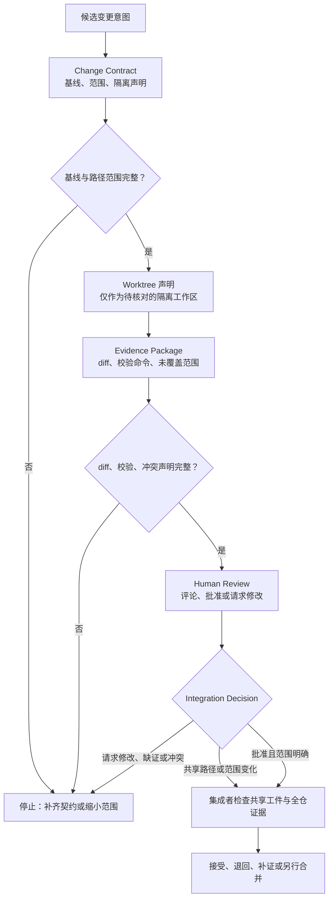

# 27. Git、Worktree 与代码审查

> 对 Agent 产生的候选修改，最重要的不是尽快写进主线，而是让人能回答：它相对什么基线发生了什么变化、谁在何处修改、哪些证据已经看到、谁有权决定下一步。

## 本章目标

完成本章后，读者能够：

- 将一次候选修改写为变更契约（Change Contract），明确基线、范围、隔离工作区声明、证据、冲突和集成责任。
- 区分 Git worktree 的工作树隔离、Git diff 的比较证据与代码审查（Code Review）的人类判断，不把其中任何一项夸大成完整安全保证。
- 在共享路径、范围越界、冲突未知、校验失败或人类未批准时，给出停止或交给集成者的理由。
- 说明纯内存准入函数的输出只是一份教学判断，不能代表真实 Git、远端、Pull Request（PR）或合并已经发生。

## 为什么要学

Agent 特别擅长在很短时间内改动很多文件，也特别容易让人跳过“改动是否可被理解”的中间层。只看最终文本，维护者很难知道它是否覆盖了意外文件、是否基于过期输入、是否只通过了局部测试，或是否碰到了其他人的未完成工作。

Git 提供历史与比较能力，worktree 提供多工作树的组织方式，PR review 提供协作判断的界面；但它们不会自动组成可靠流程。一个独立目录不会自动隔离凭证、配置或外部资源；一份 diff 不会自动证明行为正确；一个 Approve 也取决于仓库规则和审查范围。本章把这些工具的责任拆开，再以本书的 Change Contract 把它们接到人类可审查的集成门。

> 边界：本章不执行 Git 命令，不创建 worktree、分支、commit 或 PR，不访问远端、CI、审查规则、凭证或权限，也不实施 merge、发布或回滚。第 42 章才讨论版本化与回滚策略；本章只定义候选变更进入人工决定前应具备的证据。

## 前置知识

- **前置章节：** 第 10 章的状态与恢复；第 12、14 章的环境权限与批准；第 17、18 章的证据、失败和恢复；第 23 章的自动化边界；第 26 章的任务隔离与集成门。
- **技术前提：** 能读懂路径字符串、对象字段、Markdown 表格与 Node.js 内置测试输出。
- **不要求：** 不要求本地安装 Git、不要求有 GitHub 账户、不要求创建 worktree，也不要求拥有仓库写入、审查或合并权限。

## 场景引入：一份“修复完成”缺少什么

假设维护者让 Agent 修复第 27 章的示例，并要求“不要影响正在写的其他章节”。Agent 回答：“已经在独立目录修改，测试通过，等待合并。”这句话至少遗漏了五个问题：独立目录对应哪个基线？允许修改哪些路径？实际改动是否超出范围？运行的是哪条测试命令？谁确认变更符合书稿与共享状态规则？

本章将它改写成教学用 Change Contract。局部作者只能提交一份带有路径、基线、证据和未覆盖范围的交付包；共享词表、目录和进度由集成者集中处理；人类审查者决定接受、退回或要求补证。这里的“独立 worktree”只是一个待核对的声明，不能替代权限、环境和人类责任。

| 原始说法 | 缺失的可审查信息 | Change Contract 的补充 | 不能据此声称 |
| --- | --- | --- | --- |
| “我在独立目录改了。” | 基线、branch、路径范围和真实目录关联。 | `baseSnapshot`、`branch`、`worktreePath` 与 `exclusivePaths`。 | worktree 已创建、环境已隔离或无冲突。 |
| “我看过 diff。” | 比较对象、路径范围和审查者。 | `diffReviewed` 与证据包说明。 | 变更语义正确、没有机密或遗漏。 |
| “测试通过。” | 实际命令、版本、输入和未覆盖面。 | `validation.status`、`validation.command`、未覆盖范围。 | CI 通过、外部效果正确或可合并。 |
| “审查批准了。” | 审查主体、结论与规则语境。 | 人类审查记录与集成决定。 | 平台已记录 Approve、规则允许 merge。 |

## 核心概念

### Change Contract：把候选修改变成可判断的对象

本书把 Change Contract 定义为一个待集成修改的最小审查对象。它包含变更标识、基线声明、branch 与 worktree 声明、专属/实际/共享路径、冲突状态、校验证据、审查记录与集成责任。它不是 Git config、commit object、GitHub API payload 或任意平台的固定 schema。

这份契约解决的不是“怎样自动 merge”，而是“在 merge 前什么信息必须可见”。例如，`changedPaths` 不在 `exclusivePaths` 内，说明局部作者触及了未被授权的范围；`changedPaths` 命中 `sharedPaths`，说明应由集成者收口。它们都不自动判定文件内容好坏，只把后续人类判断所需的边界暴露出来。

| 字段 | 要回答的问题 | 教学例子 | 不代表 |
| --- | --- | --- | --- |
| `baseSnapshot` | 相对哪个起点比较？ | `teaching-baseline-a`。 | 可访问的真实 commit 或最新远端。 |
| `branch` | 候选主题如何命名？ | `chapter-27-teaching`。 | 分支已存在或已推送。 |
| `worktreePath` | 局部工作区声明在哪里？ | `/teaching/worktrees/chapter-27`。 | 路径已创建、关联 Git 或隔离了所有状态。 |
| `exclusivePaths` | 局部作者可交付哪些路径？ | 本章正文与局部示例。 | 真实文件锁或语义独立。 |
| `sharedPaths` | 哪些路径必须由集成者写入？ | `.ai/progress.md`。 | 集成者已拥有实际写入权限。 |
| `evidence` | 哪些比较、校验和审查输入已经被声明？ | diff、命令、审查状态。 | 任何命令或审查系统已经发生。 |

### Worktree：工作区组织，不是安全沙箱

Git 官方文档将 `git worktree` 定义为管理附着于同一仓库的多个工作树，并说明一个仓库可以同时检出多个分支。[Git：git-worktree](https://git-scm.com/docs/git-worktree) linked worktree 有自己按工作树区分的 `HEAD`、index 等文件，同时仍连接到同一仓库的共享数据与元数据。[Git：git-worktree](https://git-scm.com/docs/git-worktree)

因此，worktree 对“两个主题不应在同一工作目录互相覆盖”很有帮助，却不是完整隔离。它没有替你切分系统环境、凭证、网络目标、外部数据库、缓存、共享配置或人类权限。即使两个任务改不同路径，也可能使用同一个 API key、影响同一部署环境，或依赖同一术语和接口。第 12、14、17 与 26 章分别保留这些边界。

本书建议把 worktree 看成 Change Contract 中的**隔离工作区声明**：它提示审查者需要在真实环境中核对目录、branch、基线和共享面，而不是授权 Agent 自行创建、删除或强制操作 worktree。

### Diff：比较证据，不是正确性证明

Git 对 `git diff` 的定义是展示提交、工作树等对象之间的变化；具体命令形式决定比较的是工作树与索引、索引与提交、两个提交或两个磁盘路径。[Git：git-diff](https://git-scm.com/docs/git-diff) 因此“我看过 diff”必须补全比较基线和路径范围，否则审查者甚至无法确认它展示的是未暂存修改、待提交修改还是两个分支之间的差异。

Diff 的优点是让文件层面的变化可见。它不告诉你测试是否覆盖了行为，不验证引文是否准确，不判断权限是否足够，也不能确认某个外部效果没有发生。对于 Agent 变更，diff 证据应与验证命令、输入版本、未覆盖范围和人工审查一起保存；任何一项缺失时，都不该把“有 diff”升级成“可以合并”。

### Code Review：把判断权留给明确的人

GitHub 的 PR review 页面列出三种审查状态：Comment、Approve 与 Request changes。[GitHub Docs：About pull request reviews](https://docs.github.com/en/pull-requests/collaborating-with-pull-requests/reviewing-changes-in-pull-requests/about-pull-request-reviews) 同一页面还说明，管理员可以设置合并前所需批准；Request changes 是否阻止合并取决于仓库规则。[GitHub Docs：About pull request reviews](https://docs.github.com/en/pull-requests/collaborating-with-pull-requests/reviewing-changes-in-pull-requests/about-pull-request-reviews)

这两个事实带来一个保守结论：审查状态需要连同**平台与仓库规则语境**被解释。本书示例只接受 `reviewerKind: human` 和 `review.status: approved`，是为了拒绝“Agent 自评已批准”的教学输入；它既不读取 GitHub，也不模拟平台规则。真实项目还需判断审查者权限、保护规则、提交后审查是否失效、所需 checks、冲突与变更范围。

## 架构图：候选变更的证据流

下图回答：为什么候选变更必须经过基线、范围、证据和人工审查，才能交给集成决定？Mermaid 源文件位于 [chapter-27-git-change-admission.mmd](../../diagrams/mermaid/chapter-27-git-change-admission.mmd)。

图只表达本书的 Change Contract 与证据流，不表示真实 Git、worktree、diff、PR、CI、权限、merge、发布或回滚已执行。



> 图示替代描述：候选变更意图先形成带基线、范围和隔离工作区声明的 Change Contract。若基线或路径范围不完整，流程停止并要求补齐。完整契约产生一份含 diff、校验命令和未覆盖范围的 Evidence Package；若 diff、校验或冲突声明不完整，仍然停止。完整证据再进入人类审查与集成决定。共享路径、范围变化和批准后的局部包都由集成者检查共享工件与全仓证据，最后决定接受、退回、补证或另行合并。图不表示真实 Git、worktree、PR、CI、权限、merge、发布或回滚。

## 工作流程：从局部改动到集成决定

以下是本书建议的保守流程，不是 Git 或 GitHub 的默认命令序列：

1. **固定比较意图。** 写出改动要解决的问题、成功标准和不应触及的路径。若意图含糊，先拆分任务而不是创建分支。
2. **声明基线与工作区。** 在 Change Contract 写出基线标签、候选 branch 和 worktree 路径。真实执行前，由有权限的人核对这些声明是否对应实际仓库状态。
3. **划分专属与共享路径。** 局部作者只交付 `exclusivePaths`；任何 `sharedPaths` 由集成者统一更新。路径不同但接口、术语或外部目标相同，也要显式登记依赖。
4. **收集可定位证据。** 记录比较对象、diff 范围、实际运行的验证命令、结果、输入版本和未覆盖范围。没有命令或失败结果不能被包装为绿色状态。
5. **声明冲突而非猜测没有冲突。** 未知、未检查或需要人工解释的冲突都应使契约停在 `blocked`；不要把“暂时看不见”写成“没有”。
6. **进行人类审查。** 审查者检查范围、证据、来源、风险和不适用条件，并作出评论、批准或请求修改。Agent 可以准备材料，但不能替人类批准。
7. **由集成者决定下一步。** 集成者检查共享工件、全仓校验和其他交付包，选择接受、退回、补证或另行合并。若触及不可逆外部效果，仍需第 12、14 与 17 章的权限、审批和观察流程。

## 最小示例：候选变更准入的纯内存判断

本章实现了 [`assessGitChangeAdmission`](../../examples/agent/git-change-admission-assessment.mjs)。它接收一个注入的 Change Contract，检查：

- 是否声明了基线、branch、worktree、专属/实际路径、集成者和无已报告冲突；
- 是否有 diff 声明、成功的校验记录和人类批准记录；
- 实际或专属路径是否命中共享路径，或实际路径是否越出专属范围。

它返回 `ready`、`blocked`、`requires_integration` 或 `not_applicable`。`ready` 的路由是 `integration_decision`，只表示教学包的字段齐全，可交给集成者判断；不是“可以 merge”。

```bash
node --test examples/agent/git-change-admission-assessment.test.mjs
node examples/agent/git-change-admission-assessment.mjs
```

本章 Final Review 记录了真实结果：12 项 Node 内置测试通过，演示输出 `ready` / `integration_decision`。模块创建前，同一测试命令真实返回 `ERR_MODULE_NOT_FOUND`。这两次运行都没有调用 Git、文件系统、子进程、网络或审查服务。

## 逐步增强：从字段检查到真实变更控制

1. **先只声明边界。** 用 Change Contract 记录基线、路径、共享面和停止条件。升级触发：审查者无法确定实际变更相对什么比较。
2. **再接入只读观察。** 在获得权限的真实环境中读取 worktree/branch 状态并生成范围明确的 diff。升级触发：字符串声明与实际状态可能漂移。
3. **再接入校验报告。** 将实际命令、环境、输入版本和输出保存为可回看的证据。升级触发：多个校验或多个任务需要统一判断。
4. **最后接入平台审查和集成。** 在仓库规则允许的情况下创建 PR、请求审查并检查所需规则。升级触发：需要提交、合并、发布、回滚或影响共享环境；这些动作必须另行授权和观察。

## 完整工程案例：章节草稿与示例修复的隔离交付

下面的案例是本书的设计练习，不表示本仓库真的执行了 Git 流程。

**背景：** 作者 A 更新第 27 章正文，作者 B 修复第 27 章纯内存示例；两人都需要避免直接改动 `.ai/references.md`、目录和进度表。集成者 C 负责共享工件和全仓校验。

**约束：** 两位作者各自只交付授权路径；任何来源编号、目录、进度和全局脚本变动必须进入 C 的共享集成门；没有真实 Git/PR/权限操作。

| 角色 | 专属工件 | 应提交的证据 | 碰到的边界 | 下一步责任 |
| --- | --- | --- | --- | --- |
| 作者 A | 正文、Research Brief、Outline、Fact Check。 | 基线声明、局部 diff 范围、文稿 lint、来源外推禁区。 | 需要登记正式引用编号。 | 将候选资料交给 C。 |
| 作者 B | 示例模块和 Node 测试。 | 红灯、绿灯、演示输出与不覆盖范围。 | 测试入口需要写 `package.json`。 | 将命令建议交给 C。 |
| 审查者 | 局部技术、事实、图示与语言反馈。 | 明确位置、证据和需修复项。 | 发现共享路径或范围漂移。 | 请求补证或交给 C。 |
| 集成者 C | 正式引用、目录、状态、入口与全仓校验。 | 合并后的引用映射、全仓命令、失败与决定。 | 发现跨章节冲突或全仓失败。 | 退回局部包、拆分任务或另行决定。 |

这里最关键的规则是：局部作者的“完成”只表示交付包可供审查，不能覆盖集成者对共享工件和全仓状态的结论。

## 实现说明

| 决策 | 本章建议 | 原因 | 不替代的机制 |
| --- | --- | --- | --- |
| 比较基线 | 将基线写入契约并让审查者可核对。 | 防止不清楚 diff 相对谁。 | 真实 Git revision 解析。 |
| 工作区 | 将 worktree 看作隔离声明与现场核对项。 | 避免把不同目录误当作完整隔离。 | 沙箱、身份、网络和外部资源隔离。 |
| 范围 | 划分专属路径与共享路径。 | 防止局部包悄悄改写共同真相。 | 文件锁、语义冲突检测或权限系统。 |
| diff | 记录比较对象与路径。 | 让审查证据可解释。 | 行为测试、事实核验或安全审计。 |
| 审查 | 要求明确的人类审查记录。 | 保留对范围与风险的判断权。 | 平台规则、自动 merge 或法律合规。 |

## 测试与验证

本章验证的是书稿中的教学模型和本地纯函数，不是 Git 产品或托管平台行为。

| 层级 | 验证对象 | 方法 | 成功标准 | 实际状态 |
| --- | --- | --- | --- | --- |
| 纯函数 | 变更准入路由。 | Node 内置测试。 | 12 个独立输入得到准确 `status`、`route` 或理由。 | 已实际运行，12 项通过。 |
| 演示 | 一个完整教学 Change Contract。 | Node 直接执行。 | 输出 `ready` 与 `integration_decision`。 | 已实际运行。 |
| 图示 | 证据流与停止出口。 | Mermaid 源、SVG/PNG 导出、图源比较与人工检查。 | 节点、箭头、术语和正文一致。 | 已实际导出并查看；只表达教学模型。 |
| 文稿 | 本章格式与链接。 | Markdown lint 与链接检查。 | 命令以退出码 0 完成。 | Final Review 记录局部结果。 |
| 运行时 | 真实 Git、worktree、远端、PR、CI、权限、merge 与回滚。 | 真实环境中的授权集成验证。 | 独立观察各目标状态。 | 本章不实现。 |

> 注意：在真实仓库中，`git diff --check` 只能检查它定义的空白错误一类问题，不能代替 Markdown lint、链接检查、测试、来源核验、人类审查或外部效果观察。

## 工程实践

- **把比较对象写进证据。** 不只保存“diff 已看过”，还要保存基线、比较范围、审查者与未覆盖面。
- **把 worktree 当作一个隔离层。** 它帮助局部目录和分支并行，不应替代环境、凭证、网络、数据和权限设计。
- **让共享工件有唯一集成者。** 进度、目录、术语、引用和自动化入口不应由每个局部任务顺手回写。
- **把审查结论与合并权限分离。** Approve 是重要信号，但必须连同实际规则、checks、权限和基线变化一起判断。
- **把停止视为产物。** `blocked` 应包含可定位原因；这比在范围未知时继续修改更利于接力。

## 最佳实践

- 每个候选变更先声明 `exclusivePaths` 与 `sharedPaths`，再开始写入；出现新路径时重新审查范围。
- 对每条验证记录保存命令、输入版本、结果与未覆盖范围；不要仅复制绿色图标或摘要。
- 在审查前先看范围与基线，再看具体 diff，最后核对测试、风险和共享工件，避免只审几段显眼文本。
- 当两个 worktree 或两个 Agent 可能影响同一外部目标时，按共享效果处理，而不是按目录不同处理。
- 需要真实 Git 操作时，先获得明确授权；操作后重新观察 branch、diff、测试、平台规则和目标状态。

## 常见错误

| 错误 | 表现 | 根因 | 修复方向 |
| --- | --- | --- | --- |
| 把 worktree 当沙箱 | 不同目录仍使用同一凭证或影响同一环境。 | 只隔离了工作树，没有建模环境与权限。 | 回到第 12、14 章，独立处理环境、身份和批准。 |
| 不写 diff 的比较对象 | 审查者不知道变更相对基线还是暂存区。 | 将“有 diff”误当作充分证据。 | 记录基线、命令形式、路径范围和未覆盖面。 |
| 局部作者改共享状态 | 正文完成时顺手改目录、引用、进度。 | 没有专属/共享路径与集成责任。 | 将共享变更移交集成者并重跑全仓校验。 |
| 把 Agent 自评视为审查 | 模型写“approved”后继续合并。 | 混淆生成、检查和最终责任。 | 要求具名人类审查与规则语境。 |
| 把 Request changes 等同绝对阻断 | 在不同仓库中作出相同合并假设。 | 忽略平台规则与权限设置。 | 检查实际规则；无法核对时保持人工决定。 |

## 安全与边界

- **权限边界：** Change Contract 不授予 `git`、远端、PR、审批、合并、删除或回滚权限；任何写操作必须由实际环境策略和明确授权决定。
- **数据边界：** diff、日志和审查内容可能含敏感信息；在真实系统中应按组织政策限制收集、展示、保存和外发。本章不处理任何真实数据。
- **人工审批点：** 范围扩大、共享路径、未知冲突、失败校验、不可逆动作和外部效果都应进入人类决定；`ready` 不是批准。
- **不适用范围：** 本章不解决真实 merge 冲突、rebase、分支保护、CI 失败、凭证隔离、部署控制、审计留存、灾难恢复或版本回滚。

## 章节总结

Git、worktree、diff 与代码审查各自提供不同的变更控制信号：工作树帮助组织局部目录，diff 让比较对象可见，审查保留人类判断。可靠 Harness 不会把其中任一项偷换成全部结论，而是用 Change Contract 明确基线、路径、证据、冲突和集成责任。

当契约不完整、范围触及共享工件、校验失败、冲突未知或人类未批准时，正确动作是停止、补证或交给集成者。下一篇案例章节将把这些控制原则放进最小 Harness 的实际工程构造中；第 42 章再扩展到版本化与回滚策略。

## 练习

1. 为“更新一个测试夹具”的候选变更写 Change Contract，分别标出专属路径、共享路径、比较基线、校验命令和停止条件。
2. 说明为何两个不同 worktree 仍可能不能并行执行；至少给出一个共享外部效果和一个共享语义依赖。
3. 某 PR 显示 Approve，但之后新增了一个涉及权限的文件。列出集成者在决定前仍需要重新核对的至少三项信息。

## 延伸阅读

- [Git：git-worktree](https://git-scm.com/docs/git-worktree)，用于核对多工作树、共享与按工作树区分的元数据；访问日期：2026-07-16。
- [Git：git-diff](https://git-scm.com/docs/git-diff)，用于核对不同 diff 形式的比较对象；访问日期：2026-07-16。
- [GitHub Docs：About pull request reviews](https://docs.github.com/en/pull-requests/collaborating-with-pull-requests/reviewing-changes-in-pull-requests/about-pull-request-reviews)，用于核对 PR review 状态与规则依赖；访问日期：2026-07-16。

## 参考资料

- CH27-REF-01 — Git `git-worktree` 官方参考：支持多工作树、分支检出与共享/按工作树区分数据的限定陈述。
- CH27-REF-02 — Git `git-diff` 官方参考：支持比较对象和默认/`--cached` 范围的限定陈述。
- CH27-REF-03 — GitHub PR review 官方文档：支持审查状态及规则依赖的限定陈述。

## 章节完成检查表

- [x] Front matter、目标、前置知识、依赖和交叉章节完整。
- [x] 内容为原创表达；Git/GitHub 事实与本书 Change Contract 分开。
- [x] 可归因事实使用 CH27-REF-01 至 CH27-REF-03，未将产品行为外推为系统保证。
- [x] Mermaid 源、替代描述、正文和导出图使用同一术语。
- [x] 示例记录了真实红灯、绿灯与演示，并说明不覆盖真实 Git/PR 行为。
- [x] 技术、事实、语言、图示和最终审查记录独立保存。
- [x] 本子任务已运行局部校验；全仓 `npm run validate` 由主线程统一执行。
- [ ] `.ai/progress.md`、`CURRENT_STATE.md`、`NEXT_TASK.md` 与交接由主线程在共享收口时更新。
