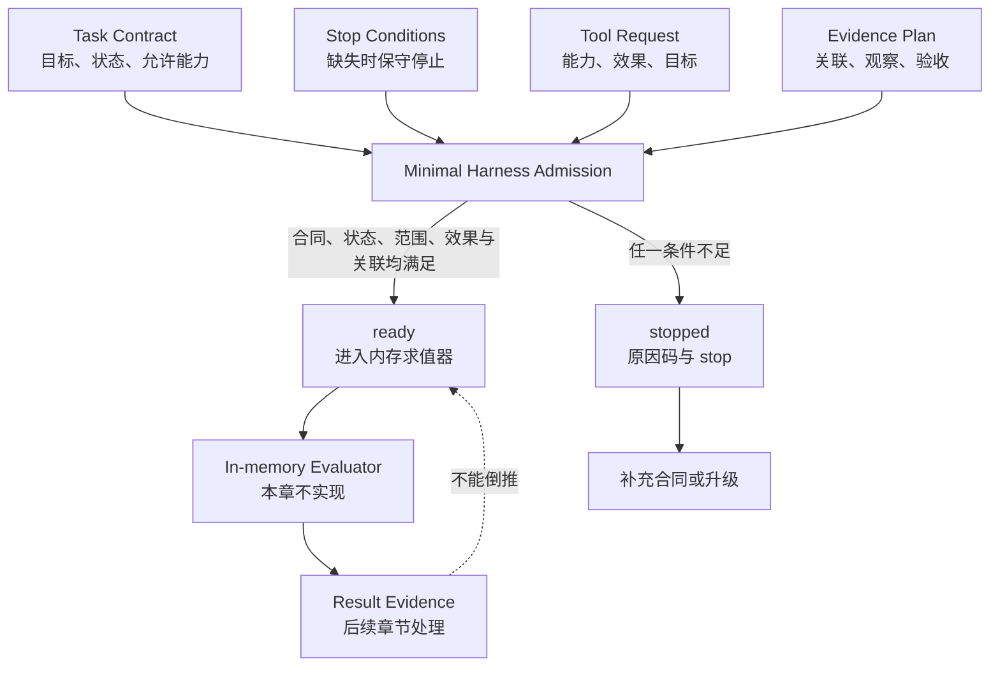

# 28. 从零搭建最小 Harness

> 一个最小 Harness 不是“让模型多想一步”的 Prompt；它至少要能在行动之前说清楚：任务是什么、当前能否开始、请求的能力是否允许、要留下什么证据，以及条件不足时何时停止。

## 本章目标

完成本章后，读者能够：

- 用 Task Contract、Tool Request、Evidence Plan 和 Stop Conditions 写出一个可判断的最小输入接口。
- 区分“允许进入下一步”的 `ready`、“拒绝继续”的 `stopped`、已执行动作与已完成任务。
- 为一个无副作用、纯内存的教学请求设置能力范围和停止出口。
- 运行并解释本章 7 项 Node 测试中的接受与拒绝路径。
- 判断何时必须离开这个最小示例，转向真实 Tool、环境、观察、审批和恢复设计。

## 为什么要从最小闭环开始

从零开始时，人们常先写一个循环：把用户输入交给模型，再把模型建议送给一个函数。这个循环很快能“跑起来”，但它通常没有回答一件更基础的问题：**在调用任何东西之前，系统凭什么认为这次请求值得继续？**

假设请求中缺少目标、任务仍在草稿状态、调用的能力不在范围内，或没有办法说明后续怎样观察结果。若程序仍默认继续，错误会被推到 Tool、环境或用户面前才暴露；这时难以区分是需求不完整、范围越界，还是动作真的失败。

本章的策略故意保守：先实现一个能拒绝不完整候选的入口，再讨论真实执行。它不减少后续需要的工作；它把工作拆成可检查的层次。Weng 把 Harness 描述为围绕基础模型、组织执行、规划、Tool、上下文、工件与结果评估的系统。[CH28-REF-01](28-minimal-harness-from-scratch.references.md) 本章从这一工作性背景抽出最小入口，而不是试图用几十行代码复制完整的 Agent 系统。

> 边界：本章不是模型调用教程，不创建真实 Agent 或 Tool，也不证明任何生产安全性。它只构建一个纯内存的**准入器（admission assessor）**；第 29 至 35 章才把这一思路放入更完整的软件工程案例。

## 前置知识

- 建议已读第 01 章，理解“提议、行动、验证和证据”不应混成一个结论。
- 建议已读第 10 至 12 章，理解状态、Tool、环境与权限需要分别设计。
- 建议已读第 17、18 章，理解证据、失败、停止和恢复的关系。
- 能阅读 JavaScript 对象、数组和 `if` 分支即可；不要求模型账户、API key、MCP、浏览器或本地服务。

## 场景引入：把标签分类请求挡在错误入口之外

我们用一个刻意小到不能造成副作用的场景。维护者想把一个输入标签归入既有分类，后续会由一个“内存求值器”完成判断。当前章节不实现那个求值器，也不调用模型；它只判断候选请求是否已经具备进入求值器的条件。

候选请求包含：

- 任务 `classify-incident-01`，目标是“将输入标签归入已知分类”，状态为 `ready`；
- 允许的唯一能力 `classify-label`；
- 一个声明 `effect: 'none'`、`target: 'in-memory'` 的 Tool Request；
- 与任务 ID 相同的 Evidence Plan，说明未来要记录什么观察、按什么标准接受；
- 三个显式的 `stop` 条件，分别处理合同、Tool 范围和证据计划的缺失。

| 候选情况 | 最小 Harness 应返回什么 | 为什么不能继续 |
| --- | --- | --- |
| 字段齐全且 Tool 仅限内存 | `ready` | 仅表示可以交给下一步的内存求值器。 |
| 任务没有目标或能力列表 | `stopped / missing_task_contract` | 无法判断任务或范围。 |
| 状态仍为 `draft` | `stopped / task_not_ready` | 任务尚未被显式准备好。 |
| 请求 `delete-label` | `stopped / tool_out_of_scope` | 请求能力超出任务合同。 |
| 请求声称 `write` 效果 | `stopped / effect_not_allowed` | 本章没有为副作用提供环境、权限或观察。 |
| 证据关联的是另一个任务 | `stopped / evidence_plan_not_linked` | 之后无法把观察归给当前候选。 |

这里的成功标准不是“标签已正确分类”，而是“系统没有把不完整或越界的对象送进下一步”。这是构建 Harness 时容易被忽略的第一层验收。

## 核心概念

### 最小 Harness 的五个工件

本书把下表称为最小 Harness 的教学接口。它是本书的工程模型，不是厂商 API、NIST 控制清单或通用 schema。

| 工件 | 最小字段 | 回答的问题 | 不得据此推出 |
| --- | --- | --- | --- |
| Task Contract | `id`、`objective`、`state`、`allowedCapabilities` | 这是一个什么任务，当前是否准备好？ | 真实需求已经正确、完整或获批。 |
| Tool Request | `id`、`capability`、`effect`、`target`、`input` | 请求的能力和预期效果是否在范围内？ | Tool 存在、已调用、已授权或安全。 |
| Evidence Plan | `correlationId`、`observation`、`acceptance` | 以后要如何关联观察与接受条件？ | 已获得观察或任务已完成。 |
| Stop Conditions | 三类 `stop` 规则 | 输入不足时是否明确停止？ | 停止后能自动恢复或有人已处理。 |
| Admission Decision | 状态、原因码、下一步 | 当前能否进入内存求值？ | 用户目标已实现。 |

这些字段的价值不是“对象格式漂亮”，而是让五个问题不再混在一句自然语言里。比如 `effect` 把“这是一次纯内存判断”与“这会写入某处”分开；`correlationId` 让未来的观察能明确归属；`stop` 让输入不完整时有可审查的出口。

### 准入、执行与完成必须分开

这三个词看起来接近，证据强度却不同。

| 陈述 | 本章是否会产生 | 还缺什么 |
| --- | --- | --- |
| **已准入（ready）**：输入合同和边界满足教学条件。 | 会。 | 尚未求值、尚未产生结果。 |
| **已执行（executed）**：某个 Tool 或运行时做过动作。 | 不会。 | 需要调用记录、环境范围和独立观察。 |
| **已完成（completed）**：目标状态已按验收条件得到证据支持。 | 不会。 | 需要结果、证据、评估与必要的人类决定。 |

本章示例在任何返回中都保留 `executionPerformed: false`。这不是一个无用的字段，而是一条防止叙述漂移的边界：演示输出 `ready` 时，读者不能把它读成“分类器运行过”或“任务成功”。

### 证据计划不是证据

`Evidence Plan` 只是一份提前声明：哪个任务将产生观察、要记录什么、怎样接受。它的作用是让系统在行动前就暴露“我将来怎样证明结果”。它不含真实测试输出、日志、状态快照或外部对象的回读。

这与第 17 章的 Evaluation 相衔接：验收需要对象、标准和证据。本章只要求把标准和未来观察的关联写好。真正执行后，还必须记录结果、时间、范围和限制；若没有这些材料，正确结论应是“未证实”，而不是“已完成”。

### 停止是可解释的结果

在一个教学案例中，遇到缺字段就抛异常可能足够；在协作系统里，结构化停止通常更利于审查和交接。本章返回 `stopped` 加原因码，例如 `tool_out_of_scope`。它告诉后续维护者：系统没有尝试补猜或绕过边界，当前需要的是修正输入，而不是把失败伪装成模型能力不足。

NIST AI RMF Core 明确其行动不是必须照顺序执行的检查表，且会依组织和场景而调整。[CH28-REF-03](28-minimal-harness-from-scratch.references.md) 因而本章的五项工件也不应被误当作合规清单。它们只是为这个低风险教学场景选出的最小拒绝条件；一旦涉及敏感数据、发布、金钱或不可逆操作，必须增加专门的环境、审批、审计与恢复设计。

## 架构图：一个请求怎样被允许或保守停止

下图回答：候选任务在什么条件下才可进入内存求值？可编辑源文件是 [chapter-28-minimal-harness-loop.mmd](../../diagrams/mermaid/chapter-28-minimal-harness-loop.mmd)，导出图为 [SVG](../../diagrams/exported/chapter-28-minimal-harness-loop.svg) 与 [PNG](../../diagrams/exported/chapter-28-minimal-harness-loop.png)。图中所有节点都是本书教学模型，不表示真实模型、Tool、文件、网络、权限、日志或生产运行时。



> 图示替代描述：任务合同、停止条件、Tool 请求和证据计划同时进入最小 Harness 准入器。所有条件满足时，结果是 `ready`，仅进入一个本章不实现的内存求值器；任一条件不足时，结果是带原因码的 `stopped`，转向补充合同或升级。后续结果证据不能倒推为已准入或已执行。

读图时要注意两条刻意缺失的箭头：没有从 `ready` 直接到“完成”，也没有从 `Tool Request` 直接到真实 Tool。第一个缺失防止把准入当作验收，第二个缺失防止把声明当作执行。

## 工作流程：先把不该继续的情况挡住

本章的函数按以下顺序判断。顺序不是唯一正确的生产顺序，而是为了让最便宜、最容易解释的缺失先返回。

1. **读取 Task Contract。** 检查 ID、目标、状态和允许能力是否具备；否则返回 `missing_task_contract`。
2. **检查任务状态。** 只接受 `ready`；`draft`、未知状态或未显式准备的任务返回 `task_not_ready`。
3. **检查 Stop Conditions。** 三类输入不足都必须规定 `stop`；缺任一项返回 `missing_stop_condition`。
4. **检查 Tool Request 的范围。** 请求必须有 ID 与能力，且能力属于 `allowedCapabilities`；否则返回 `missing_tool_request` 或 `tool_out_of_scope`。
5. **检查效果边界。** 本章只接受 `effect: 'none'` 且 `target: 'in-memory'`；否则返回 `effect_not_allowed`。
6. **检查 Evidence Plan。** 计划必须有关联、观察和验收字段，且关联 ID 与任务一致；否则返回 `missing_evidence_plan` 或 `evidence_plan_not_linked`。
7. **返回准入决定。** 只有全部通过才返回 `ready / minimal_harness_ready / run_in_memory_evaluator`，并明确 `executionPerformed: false`。

这套顺序没有任何隐藏重试。如果输入不足，调用方应补充合同、调整范围或升级给人，而不是由函数根据猜测自动放行。

## 最小示例：纯内存准入评估器

完整代码位于 [minimal-harness-admission-assessment.mjs](../../examples/agent/minimal-harness-admission-assessment.mjs)。它只读取调用者传入的对象，并返回一个决定对象；没有接受函数类型的 Tool 参数，因此不可能在本章实现中调用真实 Tool。

```js
import { assessMinimalHarnessAdmission } from '../../examples/agent/minimal-harness-admission-assessment.mjs';

const result = assessMinimalHarnessAdmission({
  task: {
    id: 'classify-incident-01',
    objective: '将输入标签归入已知分类。',
    state: 'ready',
    allowedCapabilities: ['classify-label'],
  },
  toolRequest: {
    id: 'in-memory-classifier',
    capability: 'classify-label',
    effect: 'none',
    target: 'in-memory',
    input: { label: 'network-timeout' },
  },
  evidencePlan: {
    correlationId: 'classify-incident-01',
    observation: '记录分类值与拒绝原因。',
    acceptance: '分类值属于预先声明的集合。',
  },
  stopConditions: {
    onMissingContract: 'stop',
    onDisallowedTool: 'stop',
    onMissingEvidencePlan: 'stop',
  },
});

// result.status === 'ready'
// result.executionPerformed === false
```

从仓库根目录运行：

```bash
node --test examples/agent/minimal-harness-admission-assessment.test.mjs
node examples/agent/minimal-harness-admission-assessment.mjs
```

Node 的 `node:test` 与 `node --test` 机制见 [CH28-REF-02](28-minimal-harness-from-scratch.references.md)。本章实际先运行了不存在模块的测试，得到 `ERR_MODULE_NOT_FOUND`；创建实现后，同一命令得到 **7 项通过、0 项失败**。演示输出 `ready`、`minimal_harness_ready`、`run_in_memory_evaluator` 与 `executionPerformed: false`。

| 示例字段或结果 | 本章的含义 | 不能证明 |
| --- | --- | --- |
| `allowedCapabilities` | 任务对可请求能力的显式范围。 | 操作系统、云账户或数据源授权。 |
| `effect: 'none'` | 仅允许无副作用的教学请求。 | 实际实现没有隐藏副作用。 |
| `correlationId` | 未来观察应归属的任务。 | 已存在日志或真实观察。 |
| `stopped` | 当前候选不应继续。 | 已完成恢复、回滚或人工审批。 |
| `executionPerformed: false` | 准入器没有执行动作。 | 未来求值器或真实 Tool 的安全性。 |

## 逐步增强：风险增加时再增加控制

不要从这个纯函数直接跳到“允许模型写文件”。每增加一种风险，就增加一个与该风险相匹配、可验证的工件。

| 增加的需求 | 应新增的工件或控制 | 升级触发 | 本章为什么不实现 |
| --- | --- | --- | --- |
| 真正的确定性求值 | 输入/输出契约、结果记录、独立断言。 | `ready` 后必须产生可复核结果。 | 本章只负责准入，不负责结果正确性。 |
| 文件、网络或服务调用 | Tool Contract、Environment Contract、最小权限、超时和观察。 | 请求出现非 `none` 效果。 | 仅靠字段无法限制真实环境。 |
| 跨会话或长任务 | State Record、Checkpoint、关联标识与恢复契约。 | 要中断、交接或重试。 | 内存对象在进程结束后消失。 |
| 高风险决定 | 审批矩阵、批准记录、审计与人工责任。 | 影响用户、数据、资金或发布。 | `ready` 不创造授权。 |
| 模型选择或工具编排 | Evaluation Spec、基准、失败样本和成本预算。 | 需要比较模型或策略。 | 本章没有模型输出可评估。 |

每次升级都应保留本章的三条原则：行动前可判断、行动后有独立证据、条件不足时可解释地停止。

## 完整工程案例：一个可交接的标签分类入口

下面的案例是本书原创教学设计。它不对应真实工单、真实数据或真实 Agent 部署。

**背景：** 团队要在一个后续的纯内存分类练习前，先检查任务是否有目标、允许的分类能力和可关联的验收计划。维护者 A 创建候选对象，维护者 B 负责审查拒绝原因；两人都不运行真实 Tool。

**约束：** 输入标签是虚构字符串；请求只能访问内存；任何副作用、未知能力或证据关联不一致都会停止；没有人可以把 `ready` 写成“已分类”。

| 阶段 | 输入 | 决定 | 可交接证据 | 停止或升级条件 |
| --- | --- | --- | --- | --- |
| 定义任务 | ID、目标、允许能力。 | Task Contract 是否完整。 | 候选对象和原因码。 | 目标或能力缺失。 |
| 申请能力 | Tool Request。 | 能力是否在范围、效果是否为内存。 | `tool_out_of_scope` 或 `effect_not_allowed`。 | 请求写入、网络或未知目标。 |
| 声明验收 | Evidence Plan。 | 关联是否相同，是否写明观察与标准。 | `evidence_plan_not_linked` 或 `missing_evidence_plan`。 | 不能说明怎样观察结果。 |
| 准入 | 所有输入。 | `ready` 或 `stopped`。 | 演示 JSON、测试断言。 | 任何拒绝路径。 |
| 后续求值 | 不在本章范围。 | 需要单独的执行与评估设计。 | 将来的 Result Evidence。 | 环境、权限、结果或风险不明确。 |

**设计选择：** 该案例将“能否开始”放在“怎样执行”之前。它牺牲了一个看似方便的自动补全行为，换来可定位的拒绝理由。当 B 看到 `evidence_plan_not_linked`，不必猜模型为何失败；应该修正关联 ID 或重新定义任务。

**结果与证据：** 本章实际运行的 7 项测试覆盖一个准入路径和六条停止路径。它们只能证明 JavaScript 函数在固定输入下遵守上述分类规则，不能证明真实标签正确、真实 Agent 已协作或任何外部动作没有发生。

## 实现说明：用结构化停止限制结论强度

`assessMinimalHarnessAdmission` 的内部顺序有三个刻意选择。

第一，它先验证 Task Contract，再看请求。这样缺少任务 ID 或允许能力时不会生成“Tool 被拒绝”的模糊结论。第二，它把副作用边界写得极窄：只有 `effect: 'none'` 与 `target: 'in-memory'` 同时出现才可能准入。第三，它把证据计划与任务 ID 关联，却不接收“证据结果”；这强制调用者承认计划和结果之间仍隔着一次独立行动。

| 决策 | 选择 | 原因 | 有意未做的替代方案 |
| --- | --- | --- |
| 输出形式 | `ready` 或 `stopped` 加原因码。 | 便于测试、审查和交接。 | 抛异常后由调用方猜测错误语义。 |
| Tool 表达 | 数据对象而不是可调用函数。 | 保证本章示例不会执行真实效果。 | 注入 Tool 函数后“仅演示”调用。 |
| 证据字段 | 只收计划，不收结果。 | 不把行动前声明伪装成完成证据。 | 由函数生成虚构日志或成功输出。 |
| 停止策略 | 输入不足时立即 `stop`。 | 防止函数补猜任务或范围。 | 默认允许、自动扩大能力或自动重试。 |

如果要把它变成真正的运行入口，至少要另行设计：身份与权限来源、Tool 的真实 schema、目标环境、调用记录、超时、错误分类、回读观察、评估器、持久化状态、批准和审计。它们不能通过把本函数的 `effect` 字段改成 `write` 而获得。

## 测试与验证

| 层级 | 验证对象 | 实际命令或方法 | 成功标准 | 实际状态 |
| --- | --- | --- | --- | --- |
| 红灯 | 测试先于模块存在。 | `node --test examples/agent/minimal-harness-admission-assessment.test.mjs`。 | 模块缺失导致可定位失败。 | 2026-07-16：实际得到 `ERR_MODULE_NOT_FOUND`。 |
| 单元 | 1 条准入与 6 条停止路径。 | 同一 `node --test` 命令。 | 7 项通过、0 项失败。 | 2026-07-16：实际通过。 |
| 可执行演示 | 完整内存对象的准入输出。 | `node examples/agent/minimal-harness-admission-assessment.mjs`。 | `ready`、`minimal_harness_ready`、`executionPerformed: false`。 | 2026-07-16：实际输出满足。 |
| 图示 | 图源与正文术语。 | Mermaid CLI 导出 SVG/PNG，并检查正文图块与源文件。 | 可渲染、箭头和边界一致。 | 见本章 Diagram Review。 |
| 项目校验 | Markdown、链接、已登记示例入口与状态。 | 主线程统一运行 `npm run validate`。 | 全部检查退出码 0。 | 待主线程统一收口；本子任务不修改共享脚本或状态。 |

测试的红绿记录和具体断言见 [示例计划](28-minimal-harness-from-scratch.example-plan.md)；来源与未覆盖范围见 [事实核验](28-minimal-harness-from-scratch.fact-check.md)。

## 工程实践

- **先使输入可判定。** 一份任务必须能被检查，而不是让系统从模糊文本推断所有前提。
- **使范围成为数据。** 把允许能力与效果类别放进输入，才能测试“越界时停止”。
- **把未来证据提前写出来。** 这会暴露“没有办法验收”的任务，但不会伪造已经验收。
- **让停止保留原因。** 原因码比“模型没做好”更便于下一位维护者选择补合同、改范围或人工升级。
- **让教学副作用为零。** 当目标是理解控制流时，纯内存例子比一段会写文件的半真实代码更容易验证边界。

## 最佳实践

| 推荐 | 原因 | 适用边界 |
| --- | --- | --- |
| 将 `ready` 设计成中间状态。 | 避免从前置检查跳到任务完成。 | 小脚本也可合并阶段，但仍应保留证据判断。 |
| 对每个停止路径给稳定原因码。 | 测试与交接可以针对原因修复输入。 | 原因码本身不是用户可读的完整诊断。 |
| 用关联标识连接任务和未来观察。 | 避免结果被误归属给另一个任务。 | 真实系统还需要时间、来源、范围与防篡改策略。 |
| 在副作用出现前切换到环境准入模型。 | 字段检查不能替代权限或隔离。 | 仅适合当前无副作用的教学对象。 |

## 常见错误

| 错误 | 表现 | 根因 | 修复方向 |
| --- | --- | --- | --- |
| 把 `ready` 写成“完成”。 | 审查者以为分类已发生。 | 准入、执行和验收没有分层。 | 在输出和正文中保留 `executionPerformed: false`，另行记录结果证据。 |
| 把 Tool Request 当作 Tool 调用。 | 数据对象出现后就声称已执行。 | 请求、路由、调用和观察没有区分。 | 为真实调用建立 Invocation Record 与独立观察。 |
| 接受 `write` 但没有环境设计。 | 示例不再纯内存，却没有权限或回读。 | 将字段值误当技术控制。 | 停止并转向 Tool/Environment Contract。 |
| 自动补全缺失目标或能力。 | 系统悄悄扩大任务。 | 把便利性置于可审查边界之上。 | 返回 `missing_task_contract`，要求人类或上游补充。 |
| 只记录“有证据计划”。 | 后续没有真实结果却显示完成。 | 混淆计划与观察。 | 记录实际 Result Evidence 并由 Evaluation 判断。 |

## 安全与边界

- 本章代码不应接收密钥、真实用户数据、生产路径、shell 命令或可调用的外部 Tool。
- `effect: 'none'` 是教学约束，不是对 JavaScript 代码或宿主环境的安全证明；真实限制必须由运行环境、权限和审计机制实现。
- 若任务会写入、删除、发送、发布、付费或影响用户，必须在执行前引入 Environment Contract、最小权限、人工批准和可观察的结果验证。
- 若证据计划无法说明范围、新鲜度或来源，正确结论是停止或升级，不是由模型自行补全。
- `stopped` 表示当前候选未继续，不表示风险已被消除、数据已回滚或问题已被处理。

## 章节总结

最小 Harness 的价值不在于把复杂 Agent 缩成一个函数，而在于先固化最容易被跳过的责任：任务合同、状态、能力范围、证据计划和停止条件。本章的准入器只会输出 `ready` 或带原因码的 `stopped`，并明确没有执行任何动作。这使“可以开始”“已经执行”和“已经完成”不再被同一段文本混淆。

下一步不是盲目增加更多字段，而是根据风险增加恰当的工件：真实 Tool 需要环境与观察，长任务需要状态与恢复，高风险影响需要批准与审计。第 29 章开始会把这种最小入口放进 AI 软件工程师工作流，而不是把它误写为生产 Agent 的替代品。

## 练习

1. 为一个“读取内存知识卡片”的无副作用请求写出 Task Contract、Tool Request 与 Evidence Plan。哪些字段能让它保持在本章范围内？
2. 如果将 `target` 改为“客户数据服务”，仅将 `effect` 改成 `read` 为什么仍不足以放行？列出至少四项必须新增的环境或审批工件。
3. 设计一个新的停止原因码，用于“验收条件写了，但无法观察目标状态”的情形；说明它与 `missing_evidence_plan` 有何不同。

## 延伸阅读

- [CH28-REF-01](28-minimal-harness-from-scratch.references.md)：Harness 的工作性背景；本书不复刻其文章结构或自改进论证。
- [CH28-REF-02](28-minimal-harness-from-scratch.references.md)：Node 内置测试运行器；用于理解本章测试命令，不替代实际运行记录。
- [CH28-REF-03](28-minimal-harness-from-scratch.references.md)：风险管理的非清单式提醒；页面在修订语境，使用前需重新核验。

## 参考资料

- CH28-REF-01 至 CH28-REF-03 的完整 URL、访问日、允许用途与外推禁区见 [本章参考资料](28-minimal-harness-from-scratch.references.md)。
- 正式 `REF-NNN` 由主线程统一登记；本章不声称这些本地键已是全局引用编号。

## 章节完成检查表

- [x] Front matter、目标、前置知识、相关章节和交付物完整。
- [x] 正文使用原创案例和本书工程模型，未逐句翻译来源。
- [x] 可归因背景使用 CH28-REF 本地键；未核验或未覆盖范围明确说明。
- [x] Mermaid 图有源文件、读图说明、替代描述和一致术语。
- [x] 示例有红绿记录、命令、实际结果与副作用边界。
- [x] Technical、Example、Diagram、Language 与 Final Review 记录位于 `.memory/reviews/`。
- [ ] 全仓 `npm run validate` 与共享状态更新由主线程统一完成；本子任务不修改共享文件。
