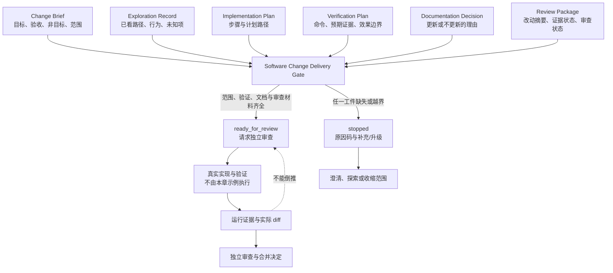

# 29. AI 软件工程师工作流

> 软件工程 Agent 的交付物不应是一段“看起来像补丁”的文本，而应是一份可解释的变更包：它能说明要解决什么、看过什么、准备改什么、如何验证、文档是否受影响，以及为什么现在可以请求审查。

## 本章目标

完成本章后，读者能够：

- 用变更简报（Change Brief）写清目标、验收条件、非目标和允许改动范围。
- 区分探索记录、实现计划、验证计划、文档决定和审查包分别提供的证据。
- 将“计划验证”“实际验证”“可请求审查”“已批准”和“已合并”写成不能互相替代的状态。
- 运行本章纯内存示例，识别范围越界、验证缺失、文档影响未决定和审查材料不足等停止原因。
- 知道何时必须从本章的教学对象升级到真实仓库、环境、权限、测试输出和人类审查。

## 为什么代码建议不等于软件交付

一个需求写着“给报告摘要增加格式化字段”，模型很容易生成几行构造对象的代码。困难不在这几行代码，而在后面的工程问题：字段是否属于当前需求？是否会影响已有调用方？应修改哪些测试？公开文档是否要同步？执行过什么验证？审查者应看哪些差异？如果这些问题没有明确工件，所谓“完成”就只能靠一句自述。

软件工程中的 Agent 因此不应被理解为“更会写代码的补全器”。它需要把不确定的任务逐步收缩成可观察、可审查的交付范围。Anthropic 的工程文章把预定义代码路径编排 LLM 和工具的系统称为 workflow，并将其与由模型动态决定过程和工具使用的 Agent 区分开来；该文也强调环境反馈、停止条件、测试与人类审查的作用。[CH29-REF-01](29-ai-software-engineer-workflow.references.md) 本章借用这些讨论作为背景，但不把该文的分类写成通用标准，也不讨论任何特定产品的实际工作方式。

本章的策略是先让“准备交付”成为可检查的中间状态。它不替代真实编程或测试：相反，它使缺少真实证据时不能被漂亮的语言掩盖。

> 边界：本章不会读取真实仓库、创建分支、运行 Git、执行项目测试、发起 Pull Request、调用浏览器、访问网络或修改文件。案例路径、命令字符串与审查对象均是教学输入；只有本章纯内存 Node 示例的测试和演示实际运行过。

## 前置知识

- 建议先读第 09 章，理解任务需要目标、依赖、停止条件和可验收输出。
- 建议先读第 10 章，理解计划、执行、观察和交接必须有不同状态。
- 建议先读第 17 章，理解验收条件、证据与效果不能混为“成功”。
- 建议先读第 27、28 章，分别理解变更比较与审查的责任，以及最小 Harness 的保守准入原则。
- 只需能阅读 JavaScript 对象和基本测试；不要求模型账户、GitHub 账户、Git、CI、浏览器或本地服务。

## 场景引入：一个小字段怎样变成失控改动

本章使用原创教学场景。维护者收到一个小需求：“为报告摘要增加一个可读格式字段。”为了避免把字段变化扩展成存储重构、认证改造或无关清理，维护者先创建一份交付包，而不是直接改代码。

该交付包声明：

- 目标是新增格式化字段；验收条件包含“新字段存在”和“已有字段不变”。
- 非目标是修改报告存储格式；允许路径只包含摘要构造、对应测试和 README。
- 探索记录说明当前测试已断言摘要对象字段，也保留仍未知的项。
- 验证计划写出一个**尚未执行**的示例命令和预期证据；文档决定明确 README 为什么要更新。
- 审查包写出变更摘要、计划中的证据状态和“可请求审查”的状态。

| 候选情况 | 交付门应返回什么 | 为什么不能把它叫做完成 |
| --- | --- | --- |
| 六类工件完整、计划路径与范围一致。 | `ready_for_review` | 只允许请求独立审查；尚未运行命令或修改代码。 |
| 没有 Change Brief。 | `stopped / missing_change_brief` | 后续计划无法反推需求、非目标和范围。 |
| 验收条件为空。 | `stopped / missing_acceptance_criteria` | 没有标准就无法判断结果。 |
| 探索记录没有当前行为。 | `stopped / missing_exploration_record` | 计划可能建立在错误假设上。 |
| 计划出现认证模块路径。 | `stopped / scope_expansion_detected` | 小字段需求不能静默扩大为跨域重构。 |
| 文档影响还是 `unknown`。 | `stopped / documentation_impact_unknown` | 文档同步不能被留成未显式决定的后续。 |
| 没有可读的 diff 摘要。 | `stopped / missing_review_package` | 审查者没有足够的变更入口。 |

此处的成功标准不是“格式化字段已经上线”，而是“下一位维护者能够判断这个候选是否有资格进入真实实现和审查流程”。

## 核心概念：软件变更交付包

### 六类工件不是六段说明文字

本章将六类对象合称为**软件变更交付包（Software Change Delivery Package）**。这是本书的工程模型，不是 Git、GitHub、Node、Codex、Claude Code 或其他工具的 schema。每个对象负责一个不同的问题，不能由另一个对象代写结论。

| 工件 | 最小字段 | 回答的问题 | 不能据此推出 |
| --- | --- | --- | --- |
| Change Brief | `id`、`objective`、`acceptanceCriteria`、`nonGoals`、`allowedPaths` | 要解决什么，怎样验收，明确不做什么，预期范围是什么？ | 需求已获批准，真实路径存在或路径具有权限。 |
| Exploration Record | `inspectedPaths`、`relevantBehavior`、`unknowns` | 已经看过什么，当前行为是什么，还有哪些未知？ | 所有调用方已被穷尽，设计一定正确。 |
| Implementation Plan | `steps`、`plannedPaths` | 准备按什么顺序改动哪些范围？ | 计划已执行，改动已产生。 |
| Verification Plan | `command`、`expectedEvidence`、`externalEffects` | 准备怎样验证，期待收集什么证据？ | 命令已运行，测试已通过。 |
| Documentation Decision | `impact`、`paths`、`rationale` | 文档要更新还是不更新，为什么？ | 文档已经同步或读者已理解变化。 |
| Review Package | `changedPaths`、`diffSummary`、`evidenceStatus`、`reviewState` | 审查者要看哪些变化，证据处于哪个状态？ | diff 已生成，审查已完成或可以合并。 |

这些字段把“我已经处理好了”拆成可反驳的陈述。例如，`allowedPaths` 让审查者可以问“为什么要改这个文件”；`unknowns` 让计划承认还有什么没看清；`evidenceStatus: 'planned'` 防止还没有运行的命令被写成通过。

### 探索记录不等于搜索结果堆积

探索（Exploration）不是为了向审查者展示读过多少文件，而是为了在计划前形成最小可用的行为模型。一个有用的 Exploration Record 至少包含：已查看的路径、与当前需求有关的观察、以及仍未确认的未知项。它允许“不知道”存在，却不允许把不知道伪装成确定事实。

本章不会规定探索必须使用哪种搜索工具。真实仓库可能需要语言服务器、测试、调用图、日志或维护者解释；用错探索方法的风险也不同。此处只提出一个交接约束：如果计划依据某个行为，就应能指向观察该行为的证据或明确标为未知。

### 变更范围、实际权限和效果是三件事

`allowedPaths` 是本章交付包里的范围声明。它仅回答“本次变更承诺不应超出哪些路径”，而不是“操作系统允许写什么”或“版本控制系统实际记录了什么”。真实路径权限、容器沙箱、Git worktree、分支策略和环境准入属于另一个控制层。

同样地，`externalEffects: 'none'` 只是本章纯内存示例的约束。它不能证明一段 JavaScript 永远没有副作用，也不能给任何真实命令授权。只要从教学对象接入文件写入、网络请求、数据库迁移、发布或真实测试，就必须建立环境、权限、超时、观察、恢复和人工批准的独立设计。

### 验证计划、运行证据和审查决定必须分层

下面三句话的证据要求不同：

| 陈述 | 本章示例是否产生 | 还需要什么 |
| --- | --- | --- |
| “已计划验证。” | 会，作为 `verificationPlan` 数据。 | 还没有测试输出。 |
| “已运行验证。” | 不会。 | 真实命令、退出码、输出范围和必要的独立观察。 |
| “已通过审查并可合并。” | 不会。 | 平台或团队流程中的实际审查、批准与分支规则证据。 |

Git 的 `git diff` 文档说明该命令可比较工作树、索引、树或文件等不同对象之间的变化。[CH29-REF-02](29-ai-software-engineer-workflow.references.md) 因此，真实 diff 是理解“改了什么”的重要工件，但它仍不是功能正确性的证明。GitHub 的 Pull Request review 文档也将 Comment、Approve 和 Request changes 作为该平台的评审提交状态，并描述评审在合并前用于协作改进代码质量。[CH29-REF-03](29-ai-software-engineer-workflow.references.md) 本章的 `reviewState` 只借用“可请求审查”的工作性概念；它不创建、查询或模拟任何真实 PR。

### `ready_for_review` 是一个保守中间状态

本章的评估器只有两个类别：`ready_for_review` 和 `stopped`。前者表示注入对象通过了教学规则；后者表示当前材料缺失或越界。无论哪一种，返回值都固定带有 `executionPerformed: false`。

这个字段避免叙述从“交付材料齐全”滑向“代码已改动”。一个正确的后续系统可以在 `ready_for_review` 后运行真实检查，也可以要求人类先补充风险信息；它不应该跳过这两个选择。

## 架构图：从变更简报到可请求审查

下图回答：哪些工件必须同时进入交付门，且 `ready_for_review` 之后还缺哪些独立证据？可编辑源为 [chapter-29-software-change-delivery-loop.mmd](../../diagrams/mermaid/chapter-29-software-change-delivery-loop.mmd)，导出图为 [SVG](../../diagrams/exported/chapter-29-software-change-delivery-loop.svg) 与 [PNG](../../diagrams/exported/chapter-29-software-change-delivery-loop.png)。图中的节点均为本书教学模型，不表示真实 Git、GitHub、CI、浏览器、模型、权限或生产系统。



> 图示替代描述：六类交付工件共同进入软件变更交付门。范围、验证、文档和审查材料齐全时，输出是 `ready_for_review`，随后才进入本章示例不执行的真实实现与验证、运行证据和实际 diff、独立审查与合并决定。任一工件缺失或越界时，输出是带原因码的 `stopped`，回到澄清、探索或收缩范围。运行证据不能倒推为此前已经具备准入资格。

图中的两条缺失箭头同样重要：没有从 Change Brief 直达“代码已改”，也没有从 `ready_for_review` 直达“已合并”。前者要求探索与计划，后者要求实际运行证据和独立决定。

## 工作流程：为交付包设置可停止的门

本章推荐的顺序是为了把最便宜、最容易解释的缺失尽早暴露，不是某个产品的固定执行协议。

1. **澄清需求。** 写 Change Brief，包含目标、至少一个验收条件、非目标和允许路径。若这些信息无法取得，停止并要求需求方补充。
2. **探索当前行为。** 记录看过的范围、与需求有关的行为和未知项。若没有行为依据，停止而不是从文件名猜测实现。
3. **拟定小范围计划。** 将步骤和计划路径写入 Implementation Plan；若任何路径超出声明范围，收缩需求或建立新的 Change Brief。
4. **预先声明验证。** 写出验证命令、预期证据和效果边界。此时只能说“计划验证”，不可说“测试通过”。
5. **决定文档影响。** 显式选择更新或不更新并给出理由。`unknown` 不是可交付的决定。
6. **组装审查包。** 写出变更路径、可读 diff 摘要、当前证据状态和请求审查的状态；范围不一致时停止。
7. **请求独立审查。** 只有交付包齐全，才产生 `ready_for_review`。真实实现、命令运行、diff、审查与合并必须由后续受控流程留下证据。

这是一条可以被人类或程序检查的证据链。它没有假设模型能看懂所有代码，也没有要求每个任务都用多 Agent；简单、可组合的模式往往应优先于额外抽象。[CH29-REF-01](29-ai-software-engineer-workflow.references.md)

## 最小示例：纯内存交付包评估器

完整代码位于 [software-change-delivery-assessment.mjs](../../examples/agent/software-change-delivery-assessment.mjs)。它不接收路径读取器、Shell 回调、Git 客户端、网络客户端或测试运行器，因此本章实现不可能通过这些接口访问真实外部系统。

```js
import { assessSoftwareChangeDelivery } from '../../examples/agent/software-change-delivery-assessment.mjs';

const result = assessSoftwareChangeDelivery({
  changeBrief: {
    id: 'add-format-summary',
    objective: '为报告摘要增加格式化字段。',
    acceptanceCriteria: ['摘要包含格式化字段。', '既有摘要字段保持不变。'],
    nonGoals: ['不修改报告存储格式。'],
    allowedPaths: ['src/report/summary.mjs', 'tests/report/summary.test.mjs', 'README.md'],
  },
  explorationRecord: {
    inspectedPaths: ['src/report/summary.mjs', 'tests/report/summary.test.mjs'],
    relevantBehavior: '现有测试断言摘要对象字段。',
    unknowns: [],
  },
  implementationPlan: {
    steps: ['先写失败断言。', '只修改摘要构造。', '运行相关测试。'],
    plannedPaths: ['src/report/summary.mjs', 'tests/report/summary.test.mjs'],
  },
  verificationPlan: {
    command: 'node --test tests/report/summary.test.mjs',
    expectedEvidence: ['新增断言通过。', '既有断言通过。'],
    externalEffects: 'none',
  },
  documentationDecision: {
    impact: 'update',
    paths: ['README.md'],
    rationale: '公开摘要字段发生变化。',
  },
  reviewPackage: {
    changedPaths: ['src/report/summary.mjs', 'tests/report/summary.test.mjs', 'README.md'],
    diffSummary: '新增格式化字段及其测试和文档说明。',
    evidenceStatus: 'planned',
    reviewState: 'ready_for_review',
  },
});

// result.status === 'ready_for_review'
// result.executionPerformed === false
```

从仓库根目录运行：

```bash
node --test examples/agent/software-change-delivery-assessment.test.mjs
node examples/agent/software-change-delivery-assessment.mjs
```

Node 的 `node:test` 模块用于创建 JavaScript 测试，官方文档也展示 `node --test` 作为测试文件的运行方式。[CH29-REF-04](29-ai-software-engineer-workflow.references.md) 本章实际先运行了导入尚不存在模块的测试，得到 `ERR_MODULE_NOT_FOUND`；创建实现后，同一测试命令得到 **10 项通过、0 项失败**。演示实际输出 `ready_for_review`、`software_change_package_ready`、`request_review` 和 `executionPerformed: false`。

| 字段或结果 | 在本章的含义 | 不能证明 |
| --- | --- | --- |
| `allowedPaths` | 交付包声明的计划范围。 | 路径存在、可写或已被 Git 跟踪。 |
| `unknowns` | 探索中仍未解决的项。 | 未知项已被忽略或风险已消除。 |
| `verificationPlan.command` | 未来计划运行的命令字符串。 | 命令已执行或输出为通过。 |
| `evidenceStatus: 'planned'` | 尚未收集实际运行证据。 | 测试、静态分析或端到端验证完成。 |
| `ready_for_review` | 可提交给下一层审查的教学状态。 | 代码已修改、审查已批准或可合并。 |
| `executionPerformed: false` | 本函数不执行动作。 | 真实项目中不存在其他副作用。 |

示例的红绿记录、测试矩阵和未覆盖范围见 [示例计划](29-ai-software-engineer-workflow.example-plan.md)；外部事实的限定范围见 [事实核验](29-ai-software-engineer-workflow.fact-check.md)。

## 逐步增强：何时离开纯函数

从交付包评估器接入真实工程时，每增加一种风险，就需要相应增加可观察的控制，而不是把 `executionPerformed` 改成 `true`。

| 新需求 | 应新增的工件或控制 | 升级触发 | 本章为什么不实现 |
| --- | --- | --- | --- |
| 读取真实仓库 | 只读范围、路径清单、读取记录与敏感文件规则。 | 必须确认当前代码行为。 | 示例没有文件读取接口。 |
| 运行项目测试 | 受控命令、环境/依赖快照、超时、退出码和输出保存策略。 | 需要把计划验证升级为实际验证。 | 示例不执行 `command` 字符串。 |
| 修改文件 | Environment Contract、最小写权限、预览、回读与回滚设计。 | 改动产生外部效果。 | `allowedPaths` 不等于权限。 |
| 生成真实 diff 或提交 | Git 工作树状态、身份、分支策略、变更比较与审查策略。 | 需要把差异交给真实协作流程。 | 示例中的摘要不是 Git 输出。 |
| 处理 UI 或设备 | 浏览器/设备目标、交互验证、截图或报告证据。 | 读者可见行为被改变。 | 留给第 30、31 章的专门案例。 |
| 处理故障修复 | 最小复现、可证伪假设、回归测试和复盘。 | 测试或观察已失败。 | 留给第 32 章的调试闭环。 |

渐进增强的原则不是“字段越多越可靠”，而是每个新增动作都必须增加能约束并观察该动作的工件。

## 完整工程案例：报告摘要字段的可审查交付

下面是本书原创案例。路径、字段和测试命令只是教学字符串，不对应真实仓库。

**背景：** 维护者希望在报告摘要中增加一个格式化字段。另一个维护者需要在不读聊天记录的情况下判断任务意图、范围、验证打算和文档影响。

**约束：** 本次任务不改存储格式、不动认证模块；任何超出三条允许路径的计划都停止；示例不执行代码、测试或 Git。

| 阶段 | 输入 | 判定 | 可交接证据 | 停止或升级条件 |
| --- | --- | --- | --- | --- |
| 澄清 | Change Brief | 目标、验收、非目标和范围是否齐全。 | 简报对象。 | 缺目标或验收。 |
| 探索 | Exploration Record | 是否说明已见行为与未知项。 | 路径列表和行为描述。 | 行为为空或未知未记录。 |
| 计划 | Implementation Plan | 路径是否全部属于允许范围。 | 步骤和计划路径。 | 引入认证或存储路径。 |
| 验证 | Verification Plan | 是否声明命令和预期证据。 | 命令字符串与预期。 | 想说“通过”却没有运行记录。 |
| 文档 | Documentation Decision | 影响是否已决定并有理由。 | README 路径与理由。 | `impact` 仍是 `unknown`。 |
| 审查 | Review Package | 摘要、范围和证据状态是否可读。 | `diffSummary` 与 `planned`。 | 摘要缺失或范围不一致。 |
| 后续真实执行 | 不属于本章示例。 | 需要真实环境与独立观察。 | 命令输出、实际 diff、审查记录。 | 权限、失败、风险或合并规则不明。 |

**设计选择：** 这个案例故意将“代码修改”放在教学流程图的后段。若在探索阶段发现认证模块也可能受影响，正确动作不是让 Agent 顺便修掉它，而是停止当前交付包：更新范围、拆分任务，或由人类决定是否扩大 Change Brief。

**结果与证据：** 本章实际运行的 10 项 Node 测试覆盖一条准入路径和九条停止路径。它们只能证明 JavaScript 函数对固定输入按预期分类，不能证明虚构字段正确、路径存在、项目测试通过、diff 正确、文档已更新或任何人已经审查。

## 实现说明：让交付约束成为数据

`assessSoftwareChangeDelivery` 按“定义—探索—计划—验证—文档—审查”的顺序检查。最先检查 Change Brief，避免缺需求时返回“测试计划缺失”这类误导性原因；之后比较计划路径和范围，避免范围在计划中被悄悄扩大；最后才接受审查包，避免用空摘要掩盖尚未准备好的材料。

| 决策 | 选择 | 原因 | 有意未做的替代方案 |
| --- | --- | --- | --- |
| 变更范围 | 明确字符串列表比较。 | 可为越界写稳定测试。 | 从真实仓库路径或 Git 状态推断。 |
| 验证状态 | 使用 `planned`，并固定无执行。 | 防止计划被误读为运行结果。 | 伪造测试日志或默认通过。 |
| 文档影响 | `update` 或 `none` 都需要理由。 | 让“不更新”也成为可审查决定。 | 用空数组表示“以后再说”。 |
| 审查材料 | 必须含 `diffSummary`。 | 给审查者一个最小语义入口。 | 将没有上下文的路径列表视为足够。 |
| 真实工具 | 不注入 Git、Shell 或文件函数。 | 使本章示例的副作用边界可从接口检查。 | “仅演示”地执行真实命令。 |

如果要实现一个可在仓库中工作的 Agent，至少还需要：对不可信任务输入的验证、读取和写入权限、真实路径归一化、受控命令白名单、依赖安装策略、超时、输出采集、失败分类、敏感信息处理、状态持久化、人工批准、实际 diff 比较和回读验证。这些控制不会因为交付包字段齐全而自动出现。

## 测试与验证

| 层级 | 验证对象 | 实际命令或方法 | 成功标准 | 实际状态 |
| --- | --- | --- | --- | --- |
| 红灯 | 测试先于实现模块存在。 | `node --test examples/agent/software-change-delivery-assessment.test.mjs`。 | 模块缺失导致可定位失败。 | 2026-07-16：实际得到 `ERR_MODULE_NOT_FOUND`。 |
| 单元 | 一条准入和九条停止路径。 | 同一 `node --test` 命令。 | 10 项通过、0 项失败。 | 2026-07-16：实际通过。 |
| 可执行演示 | 默认虚构交付包的返回值。 | `node examples/agent/software-change-delivery-assessment.mjs`。 | `ready_for_review`、`software_change_package_ready`、`executionPerformed: false`。 | 2026-07-16：实际输出满足。 |
| 图示 | 图源与正文术语。 | Mermaid CLI 导出 SVG/PNG，并比较正文图块与源文件。 | 可渲染、箭头和边界一致。 | 见本章 Diagram Review。 |
| 项目校验 | Markdown、链接、示例入口与共享状态。 | 主线程统一运行 `npm run validate`。 | 全部检查退出码 0。 | 待主线程统一收口；本子任务不修改共享脚本或状态。 |

## 工程实践

- **把验收写在探索之前。** 这使探索有明确问题，而不是无边界浏览仓库。
- **让未知项留在记录中。** 未知不是失败；无标记地假定未知才会造成隐性范围扩张。
- **把文档影响做成决定。** “不更新”应带理由，才能在审查时被确认或反驳。
- **保存意图和实际证据的距离。** `planned`、`executed`、`observed`、`approved` 是不同状态，应由不同证据支持。
- **以停止保护范围。** 发现越界时先缩小或拆分任务，比让一个 Agent 临时承担更多责任更容易审查。

## 最佳实践

| 推荐 | 原因 | 适用边界 |
| --- | --- | --- |
| 每个 Change Brief 同时写验收与非目标。 | 减少模型或人类把小需求扩展成重构。 | 紧急修复仍可简短，但不能省掉可观察的成功条件。 |
| 计划路径与允许路径都显式列出。 | 可自动检测静默越界。 | 动态生成文件时需增加模式、生成器与审查规则。 |
| 把测试命令与预期证据分开。 | 命令存在不等于知道应该看什么。 | 复杂验证还需保存版本、环境和输出摘要。 |
| 将文档同步纳入交付门。 | 公共行为变化不会在合并后才被发现。 | 内部纯重构可以明确决定 `none` 并说明理由。 |
| 将审查视为独立决策。 | 代码、测试和需求适配性需要不同视角。 | 低风险个人脚本也应留下最小自审证据。 |

## 常见错误

| 错误 | 表现 | 根因 | 修复方向 |
| --- | --- | --- | --- |
| 先生成补丁，再补需求。 | 改动出现后才解释目标。 | 用代码输出代替 Change Brief。 | 先写目标、验收、非目标和范围。 |
| 用文件名当探索。 | 看见 `summary` 就假设行为。 | 没有记录相关行为和未知项。 | 建立 Exploration Record，并在未知时停止。 |
| 把计划命令写成通过证据。 | 文档中出现“测试已通过”，却无运行记录。 | 混淆计划和执行。 | 将命令、退出码、输出与观察分层记录。 |
| 范围声明后仍顺手重构。 | 计划悄悄加入无关模块。 | 没有对比 `plannedPaths` 与 `allowedPaths`。 | 停止、拆分 Change Brief 或请求扩大范围。 |
| 把 diff 摘要当真实 diff。 | 只有文字说明，没有可比较对象。 | 审查包与 Git 工件混淆。 | 在真实流程中另行生成和审查实际 diff。 |
| 忽略文档影响。 | 用户可见行为改变，说明仍旧存在。 | 将文档视为合并后的可选项。 | 明确 `update` 或 `none` 并给出理由。 |

## 安全与边界

- 本章示例不应接收密钥、真实用户数据、文件句柄、Shell 命令回调、Git 客户端、网络客户端或可调用的外部 Tool。
- `allowedPaths` 不是权限控制；真实写入必须由环境隔离、最小权限、身份、审批和回读验证约束。
- `verificationPlan.command` 是字符串，不应被不加限制地交给 Shell。真实系统需要命令白名单、参数校验、超时、输出脱敏和运行环境控制。
- 真实 diff、审查评论和批准记录可能包含敏感信息；采集、保留和展示都应遵循项目的数据与访问政策。
- 若需求影响认证、支付、删除、发布、生产数据或用户可见行为，`ready_for_review` 不应取代人工批准、专门测试和变更管理。
- `stopped` 仅表示教学评估器拒绝当前输入；它不表示真实动作已经回滚、风险已消失或问题已由任何人处理。

## 章节总结

AI 软件工程师工作流的核心不是把“需求—代码—测试”排成漂亮的步骤，而是让每一步留下能被下一步质疑的工件。Change Brief 固定目标与边界，Exploration Record 固定已知与未知，Implementation Plan 固定拟议改动，Verification Plan 固定未来证据，Documentation Decision 固定读者影响，Review Package 固定审查入口。

本章的纯内存示例只会给出 `ready_for_review` 或带原因码的 `stopped`，并明确没有执行任何动作。这样，真正的仓库操作、分层测试、浏览器验证、实际 diff 和人类合并决定仍必须各自取得证据。第 30 章会把交付包放进 Flutter 登录功能，第 31 章会把验证扩展为 API 与 UI 测试，第 32 章会处理失败后的最小复现和回归闭环。

## 练习

1. 为“修改错误提示文案”写一份 Change Brief。列出两个验收条件、两个非目标和一条可能的文档决定。
2. 一项需求要求“优化登录性能”，但 Exploration Record 只记录了一个组件文件。解释为什么不能直接写 Implementation Plan，并列出还需要的观察。
3. 将本章案例的 `externalEffects` 从 `none` 改成“写文件”。至少列出五项必须新增的环境、权限或验证工件。
4. 一个审查者认为 README 不必更新。如何用 Documentation Decision 把这项异议变成可审查的结论，而不是一句口头判断？

## 延伸阅读

- [CH29-REF-01](29-ai-software-engineer-workflow.references.md)：工作流、Agent、反馈、停止条件和人类审查的工程讨论；使用前需保留来源范围。
- [CH29-REF-02](29-ai-software-engineer-workflow.references.md)：Git 的变更比较语义；不替代测试或审查。
- [CH29-REF-03](29-ai-software-engineer-workflow.references.md)：GitHub PR review 的平台特定状态与协作语境。
- [CH29-REF-04](29-ai-software-engineer-workflow.references.md)：本章 Node 示例测试命令的官方说明。

## 参考资料

- CH29-REF-01 至 CH29-REF-04 的完整 URL、访问日、允许用途与外推禁区见 [本章参考资料](29-ai-software-engineer-workflow.references.md)。
- 正式映射已由主线程登记：CH29-REF-01 至 CH29-REF-04 分别对应 REF-029、REF-088、REF-089 与 REF-090；正文保留局部键，便于追溯本章的限定用途与外推禁区。

## 章节完成检查表

- [x] Front matter、学习目标、前置知识、相关章节和交付物完整。
- [x] 正文使用原创案例与工程模型，未逐句翻译或大段复刻来源。
- [x] 可归因事实使用 CH29-REF 局部键；来源范围与外推禁区已标明。
- [x] Mermaid 图有源文件、读图说明、替代描述和一致术语。
- [x] 示例有红绿记录、命令、实际结果与副作用边界。
- [x] Technical Review、Example Implementation、Diagram Review、Fact Check、Language Editing 与 Final Review 已完成。
- [x] 全仓 `npm run validate`、全局引用登记和共享状态更新已由主线程完成；其结果只证明本书工件和注入的教学对象。
