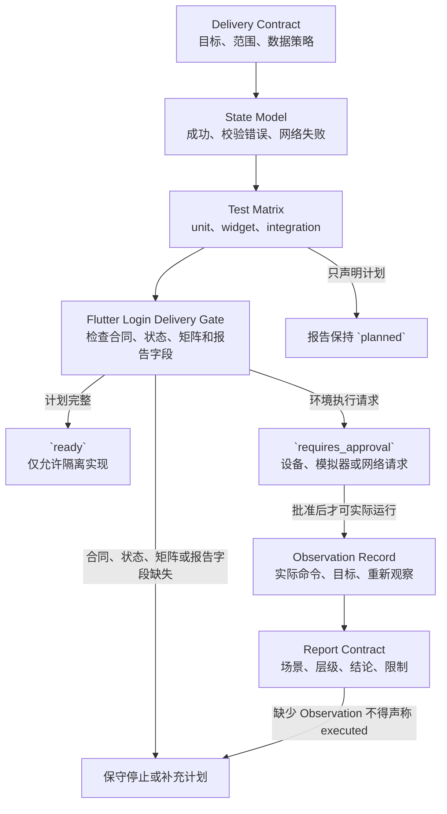

# 30. 应用交付 Harness：Flutter 登录到测试报告

> 一个移动登录功能的交付不应由“页面看起来可用”或“测试计划是绿色的”来定义。本章用一个虚构 Flutter 登录案例，将需求、状态、测试计划、观察和报告分离成可审查工件，并在环境尚未执行时保留保守出口。

## 本章目标

完成本章后，读者能够：

- 写出包含可观察验收、非目标和数据限制的交付契约（Delivery Contract）。
- 用状态模型（State Model）区分输入校验错误、提交中、认证成功和网络错误。
- 说明 unit、widget、integration 三层测试各自提供的有限证据，且不把计划写成执行结果。
- 为每条场景建立测试矩阵（Test Matrix）、观察记录（Observation Record）和报告契约（Report Contract）。
- 识别纯内存准入器返回 `ready` 后，仍需真实 Flutter、目标环境和人工审查才能完成的事项。

## 为什么“登录页面能显示”不是交付结论

一个登录页面可以有按钮、输入框和加载动画，却仍未回答几个关键问题：空输入是怎样被分类的？网络失败与密码错误是否被混为一谈？计划中的测试会在哪一层运行？报告中的“通过”是观察事实，还是只是一份待执行清单？若没有这些问题的独立答案，页面展示只能证明某段 UI 描述存在，不能证明登录功能已完成。

本章使用三个虚构场景：成功认证、空输入触发校验错误、提交后出现网络错误。它不建立 Flutter 工程，不创建账号，不保存密码，也不访问认证服务。案例的作用是让每个交付物有明确对象，而不是模拟真实登录。

> 边界：文中 Flutter 资料只说明测试类别、表单校验示例和集成测试的运行语境。本章的工件、状态名、准入规则和案例都是本书工程模型；它们不代表 Flutter、Dart 或任何测试平台的固定 schema。

## 前置知识

- 第 17 章说明如何把成功标准与证据分开。
- 第 25 章说明用户交互需要动作前后观察，不能只检查页面加载。
- 第 28 章给出最小 Harness 的任务、能力、停止条件和证据计划。
- 第 29 章将一般软件变更收束到可请求审查的交付包；本章只把这一思路落到移动登录场景。

读者只需能阅读 JavaScript 对象和测试表格。不要求安装 Flutter、Dart、Android/iOS 工具链、模拟器、浏览器、账户、CI 或网络服务。

## 场景引入：一份没有真实凭证的登录交付计划

假设维护者收到的需求是：“为移动应用交付登录入口，并说明如何验证。”他不应先问模型生成哪个组件，而应先要求一份受限计划。计划中的任务只允许引用虚构的 `login-flow-demo`，并明确 `dataPolicy: 'no-real-credentials'`。任何要求真实邮箱、密码、token 或认证地址的输入都不能进入本章的教学路径。

这份计划至少回答四个问题：

1. 成功、输入错误和网络错误各自是什么可观察状态？
2. 每条状态由哪一类测试计划检查？
3. 哪些字段只是计划，哪些字段必须来自一次实际观察？
4. 当有人要求启动设备或模拟器时，谁可以批准，报告应该如何降级表述？

## 核心概念：五类不互相替代的交付工件

### 交付契约：定义目标，而不是宣布完成

交付契约至少包含目标、验收条件、非目标、数据策略和允许工件。例如，它可以规定“空输入应产生独立的校验错误状态”“网络失败不显示为认证成功”“示例不接受真实凭证”。它不证明需求已批准、组件已实现或用户能够登录。

Flutter 的表单校验示例创建带 `GlobalKey` 的 `Form`，再以 `validate()` 检查输入。[CH30-REF-02](30-application-delivery-harness-flutter-login-to-test-report.references.md) 这支持“输入校验可以成为可观察分支”的背景；本章把该分支与网络错误分开，是为了让交付计划能够表达不同的证据需要，不是对真实认证流程的断言。

### 状态模型：把不同失败保留为不同问题

本章使用以下教学状态：

| 状态 | 进入条件 | 需要的观察 | 不能由它推出的结论 |
| --- | --- | --- | --- |
| `idle` | 用户尚未提交。 | 表单仍可接受输入。 | 表单已经在任何设备渲染。 |
| `validating` | 计划开始检查输入。 | 将检查结果关联到本次场景。 | 服务端认证已发起。 |
| `validation_error` | 空输入或格式不合法。 | 独立的错误分类与预期提示。 | 账号、密码或服务器一定错误。 |
| `submitting` | 输入通过本地校验。 | 后续请求或环境动作仍待观察。 | 网络调用已发送。 |
| `authenticated` | 外部认证成功的观察被记录。 | 具体环境、时刻和结果证据。 | 任何其他用户或版本都成功。 |
| `network_error` | 请求阶段的网络问题被观察到。 | 错误来源和限制。 | 输入校验机制失效。 |

这些名称不绑定 Flutter 的任何状态管理库。它们只是要求维护者不要把“输入不合法”和“请求失败”压缩成一个无法诊断的 `failed`。

### 测试矩阵：先说明每一层能看见什么

Flutter 文档将自动测试分为 unit、widget 和 integration 三类：前者关注单一逻辑单元，中间层关注单一 widget，最后一层关注完整应用或大部分应用。[CH30-REF-01](30-application-delivery-harness-flutter-login-to-test-report.references.md) 这个分类不是“测试越多越好”的配额，也不证明一个项目已经执行过任何测试。

本章为虚构案例采用下列计划矩阵：

| 层级 | 计划检查的问题 | 预期观察 | 仍需补足的证据 |
| --- | --- | --- | --- |
| unit | 空输入是否转到 `validation_error`。 | 状态分类的返回值。 | 组件显示、网络、设备和真实账户。 |
| widget | 输入、错误提示和提交控制应怎样互动。 | 单一表单的可观察期望。 | 完整应用、平台 UI 和服务协作。 |
| integration | 从输入到结果的关键路径应如何在目标环境中检查。 | 预先声明的动作和结果。 | 实际目标、命令、前后快照和运行输出。 |

Flutter 的集成测试资料展示 `integration_test`、`WidgetTester` 和绑定初始化，并说明集成测试通常在真实设备或操作系统模拟器上运行。[CH30-REF-03](30-application-delivery-harness-flutter-login-to-test-report.references.md) 因此“我们计划 integration 测试”不能改写成“已在设备上通过”；后一句需要实际的目标环境和观察记录。

### 观察记录与报告契约：限制结论强度

测试矩阵只描述未来需要什么。观察记录才将某次执行的任务、场景、层级、目标、时刻、输出和限制绑定在一起。没有观察记录时，报告只能说 `planned`，不能说 `passed`。

报告契约至少要求以下字段：

| 字段 | 作用 | 缺失时的处理 |
| --- | --- | --- |
| `scenario` | 指向成功、校验错误或网络错误。 | 停止，不能让结论失去对象。 |
| `layer` | 区分 unit、widget 或 integration。 | 停止，不能混合证据范围。 |
| `observation` | 保存实际看到的结果。 | 保留为计划或停止。 |
| `verdict` | 将观察解释为有限结论。 | 不得由“绿色”措辞替代。 |
| `limitation` | 写明未覆盖的环境和风险。 | 不得声称完整移动质量。 |

`Report Contract` 是本书用来限制语言的工件，不是测试报告生成器、审计系统或发布许可。

## 工作流程：在动作前检查计划，在观察后再写报告

本章的应用交付门按以下顺序处理输入：

1. **收缩任务：** 读取交付契约，拒绝没有验收条件、非目标或数据限制的任务。
2. **检查状态：** 确认六个教学状态和三条场景都存在，避免将网络错误写入输入校验分支。
3. **检查测试计划：** 确认 unit、widget、integration 三层各自说明对象和预期观察；此时仍没有任何测试结果。
4. **检查报告语言：** 若报告声称已执行却没有观察记录，则停止；若只处于计划阶段，则固定为 `claimState: 'planned'`。
5. **处理环境请求：** 当输入要求设备、模拟器、网络或真实认证时，返回 `requires_approval`，而不是假设环境可用。
6. **允许隔离实现：** 只有计划材料齐全，才返回 `ready` 并请求在后续受控环境中实现；`ready` 不等于应用已经构建或测试。

下图只表达本书交付工件的检查顺序。`Test Matrix` 只能通向计划性报告或环境批准；只有获批后实际运行所留下的 `Observation Record` 才能为报告提供执行证据。若合同、状态、矩阵或观察缺失，图将其路由到保守停止或补充计划，而不把 `ready` 写成移动交付完成。



替代描述：交付契约依次约束状态模型和测试矩阵，三者进入 Flutter Login Delivery Gate。完整计划只得到 `ready` 以进入隔离实现；测试矩阵在没有观察时保持 `planned`。环境执行请求得到 `requires_approval`，批准后才可能有实际运行和重新观察，观察记录才流入报告。输入工件缺失或报告声称已执行却没有观察，均流向“保守停止或补充计划”。

典型停止码及其含义如下：

| 返回 | 维护者应补什么 | 不代表什么 |
| --- | --- | --- |
| `missing_task_contract` | 目标、验收条件和非目标。 | 登录需求已被否决。 |
| `credential_policy_violation` | 无真实凭证的数据策略。 | 真实凭证已经泄露。 |
| `missing_required_state` | 被遗漏的独立状态。 | Flutter 状态管理库出错。 |
| `missing_test_scenario` | 未覆盖的案例与层级。 | 真实测试失败。 |
| `report_claim_not_observed` | 关联的观察记录，或将结论降为计划。 | 环境执行发生过。 |
| `environment_execution_not_approved` | 具体环境、范围和人工批准。 | 设备、模拟器或权限存在。 |

## 最小示例：只审查注入的交付计划

后续 Example Implementation 将提供 `assessFlutterLoginDelivery(deliveryPackage)`。该函数只审查调用方传入的 JavaScript 对象，不读取项目文件，也不调用 `flutter`。完整计划应返回：

```json
{
  "status": "ready",
  "code": "flutter_login_delivery_plan_ready",
  "next": "implement_in_isolated_example",
  "executionPerformed": false
}
```

这个 JSON 既是教学返回合同，也是当前演示的实际输出。实现前的测试 import 曾以 `ERR_MODULE_NOT_FOUND` 失败；实现后，`node --test examples/agent/flutter-login-delivery-assessment.test.mjs` 得到 8 项通过、0 项失败，演示维持 `executionPerformed: false`。缺失合同、场景、状态、观察或批准时，函数返回 `stopped` 或 `requires_approval`。这些结果只验证注入对象的分类，不验证 Flutter、设备、模拟器、网络或认证。

Node 的 `node:test` 模块和 `--test` 标志将用于该纯内存测试入口。[CH30-REF-04](30-application-delivery-harness-flutter-login-to-test-report.references.md) 这只说明测试机制，不代表任何 Flutter/Dart 测试、设备控制或登录请求已经运行。

## 完整工程案例：三条路径怎样进入可审查状态

维护者为三个虚构场景准备同一份交付计划：

为避免把矩阵行与状态终态混为一谈，示例把 `success` 用作“输入有效并认证成功”这一场景键，而对应的状态模型终态为 `authenticated`；`validation_error` 与 `network_error` 在本案例中恰好同时作为场景键和状态名。它们都只是教学对象中的受控标签，不是 Flutter 或认证协议字段。

| 场景 | 状态目标 | 测试计划 | 报告允许的当前措辞 |
| --- | --- | --- | --- |
| 输入有效并认证成功 | `authenticated`。 | unit 检查状态分类；widget 和 integration 列入后续计划。 | “已计划观察认证成功路径”。 |
| 输入为空 | `validation_error`。 | unit 检查独立分类；widget 计划检查提示。 | “已计划检查输入校验路径”。 |
| 提交后网络失败 | `network_error`。 | integration 计划保留目标环境和观察字段。 | “未运行目标环境，不能写为网络失败已复现”。 |

三行共享一个限制：它们都不能包含真实用户、token、地址、设备名、构建号或截图。若后续有人要求在模拟器运行第三行，计划必须附加环境批准、命令、前后观察和清理方式；否则报告保持计划状态。

## 逐步增强：何时离开教学准入器

纯内存检查不应被偷偷扩展成移动测试执行器。每一种真实风险都需要一个额外控制：

| 新需求 | 必须新增的控制 | 为什么原有证据不足 |
| --- | --- | --- |
| 创建 Flutter 项目 | SDK、项目来源和文件读写范围。 | 计划对象不包含真实项目。 |
| 运行 unit/widget 测试 | 命令、版本、退出码、输出和未覆盖范围。 | 测试矩阵没有运行观察。 |
| 运行设备/模拟器集成测试 | 目标、批准、交互前后观察和失败工件。 | `ready` 没有设备证据。 |
| 请求认证服务 | 最小权限、密钥处理和后端契约。 | `no-real-credentials` 明确禁止此动作。 |
| 发布测试报告 | 关联的 Observation Record 与人工审核。 | 报告字段本身不能产生事实。 |

第 31 章将继续讨论 API 与浏览器自动化的测试证据；第 32 章在真实失败观察已经存在时处理最小复现、假设和回归。它们不是本章准入器可以提前完成的工作。

## 测试与验证

本章 First Draft 当前只验证书稿结构、引用和状态一致性；没有 Flutter 代码或移动环境可运行。

| 层级 | 验证对象 | 命令或方法 | 实际状态 | 不证明 |
| --- | --- | --- | --- | --- |
| 文档 | Markdown、链接、全书状态。 | `npm run validate`。 | Example Implementation 收口后执行。 | Flutter 或移动环境已验证。 |
| 纯内存单元 | 计划准入规则。 | `node --test examples/agent/flutter-login-delivery-assessment.test.mjs`。 | 8 项通过、0 项失败。 | Flutter 测试、设备或网络已执行。 |
| 移动集成 | 用户可见登录流程。 | 需要获批的真实目标环境。 | 本章未执行。 | 计划完整即可替代观察。 |

## 工程实践

- 让交付契约先写出禁止项，特别是凭证、账户、目标环境和报告结论的边界。
- 将输入校验失败与网络失败作为不同的状态和报告行；这能避免一个笼统的“失败”掩盖恢复路径。
- 让每一条“已执行”都回到一个 Observation Record；没有观察时，保留 `planned` 比补写结论更有价值。
- 将环境执行单独路由到批准出口，避免测试计划悄悄获得设备、网络或账户权限。

## 常见错误

| 错误 | 表现 | 根因 | 修复方向 |
| --- | --- | --- | --- |
| 把测试矩阵当测试结果 | 报告说“覆盖三层测试”，却没有命令或观察。 | 计划与执行共用同一字段。 | 让 Report Contract 强制要求 Observation Record。 |
| 合并两类失败 | 空输入与网络问题都显示为 `failed`。 | 状态模型只追求简短。 | 保留 `validation_error` 和 `network_error` 的独立入口。 |
| `ready` 自动触发环境动作 | 准入器随后启动设备或访问网络。 | 将计划许可误当运行许可。 | 返回 `requires_approval` 并绑定具体环境。 |
| 引用 Flutter 文档作为运行证据 | 因文档有命令就写“本项目已运行”。 | 来源事实和当前观察混淆。 | 单独记录实际命令、目标、输出与限制。 |

## 安全与边界

- **数据边界：** 教学输入不得包含真实用户名、密码、token、地址、设备标识、构建号或用户日志。
- **权限边界：** 交付契约和 `allowedArtifacts` 不是文件、设备、网络或账户权限；环境执行必须由具备相应责任的人另行批准。
- **报告边界：** 任何 `passed`、`authenticated` 或“已在设备上验证”的文字都需要相应 Observation Record；本章草稿不具备这种证据。
- **不适用范围：** 本章不提供认证安全设计、离线策略、可访问性、性能、平台兼容性、签名、发布或 CI 配置建议。

## 章节总结

应用交付 Harness 的价值不在于替代 Flutter 测试，而在于让测试开始前的每个缺口可见：交付契约限定目标，状态模型保持失败差异，测试矩阵规划分层证据，观察记录限制结论，报告契约阻止“绿了”式叙述。纯内存 `ready` 只是下一步实现的准备状态；真实移动交付仍必须产生受控环境中的实际证据。

## 练习

1. 为“登录按钮在输入为空时不可提交”写出一项验收条件、一项非目标和一个可观察状态。
2. 在没有 `network_error` 的状态模型中，指出应补的工件，并说明为什么不能把它并入输入校验错误。
3. 将一份 `claimState: 'planned'` 的集成测试报告升级为“已在模拟器观察到”的报告时，列出至少四项额外证据。

## 延伸阅读

- [CH30-REF-01：Flutter Testing Flutter apps](30-application-delivery-harness-flutter-login-to-test-report.references.md)——测试类别及其范围。
- [CH30-REF-02：Flutter Build a form with validation](30-application-delivery-harness-flutter-login-to-test-report.references.md)——表单输入校验示例。
- [CH30-REF-03：Flutter integration test](30-application-delivery-harness-flutter-login-to-test-report.references.md)——交互测试与目标环境语境。
- [CH30-REF-04：Node.js Test runner 与 CLI](30-application-delivery-harness-flutter-login-to-test-report.references.md)——纯内存教学测试入口。

## 参考资料

- REF-092：Flutter Testing Overview；支持 unit、widget、integration 测试的受限分类与范围。
- REF-093：Flutter 表单校验示例；支持 `Form`、`GlobalKey` 和 `validate()` 的受限背景。
- REF-094：Flutter 集成测试文档；支持 `integration_test`、`WidgetTester` 和设备/模拟器运行语境。
- REF-090：Node.js Test runner 与 CLI；支持本章纯内存示例的 `node:test` 和 `node --test` 测试入口。

## 章节完成检查表

- [x] Front matter、学习目标、前置知识、相关章节和交付物已建立。
- [x] 正文为原创表达，Flutter/Node 来源与本书工程模型已区分。
- [x] 每项可归因事实均有本章来源与正式 REF 映射。
- [x] Mermaid 图、源文件、替代描述和导出图已由 Diagram Review 正式验收。
- [x] 纯内存示例、红绿记录和 8 项实际 Node 测试已完成；示例不执行 Flutter 或外部环境。
- [x] Example Implementation、Diagram Review、Fact Check、Language Editing 与 Final Review 已完成。
- [x] Example Implementation 收口后的全仓 `npm run validate` 已通过。
- [x] 本阶段的进度、当前状态和交接已同步。
