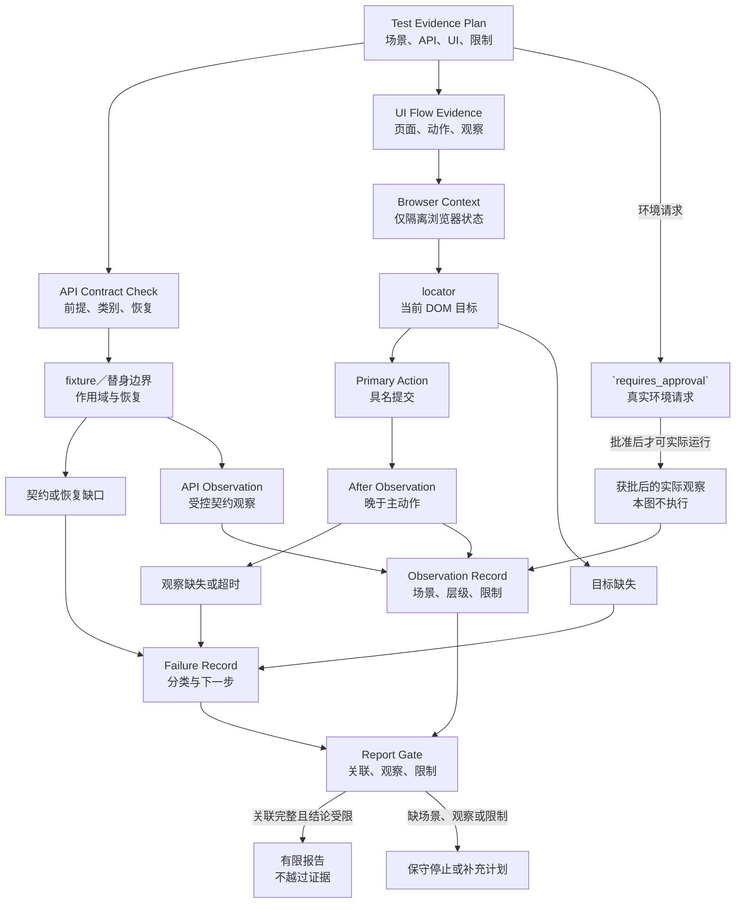

# 31. 测试自动化 Harness：pytest 与 Playwright

> 自动化测试的价值不在于出现一个绿色状态，而在于让每个状态知道自己回答了什么问题。一个接口响应正常不能替代用户提交后的可见结果；一个浏览器元素可定位，也不能替代接口契约或失败原因。本章用同一虚构登录场景，把 API 与 UI 的证据分开组织，再让报告只表达已具备依据的结论。

## 本章目标

完成本章后，读者能够：

- 为同一场景分别写出 API 契约检查（API Contract Check）与 UI 流程证据（UI Flow Evidence）。
- 说明 pytest 测试夹具（fixture）、`monkeypatch`、Playwright 浏览器上下文（Browser Context）、定位器（locator）与可重试断言各自只提供什么有限机制。
- 用测试证据计划（Test Evidence Plan）规定隔离、动作、观察、失败记录和报告门，而不把计划当作运行结果。
- 将 API 契约差异、替身恢复问题、浏览器状态泄漏、定位失败和动作后状态不符路由到不同的失败记录（Failure Record）。
- 在没有受控服务或浏览器目标时，诚实地停在计划和纯内存准入边界。

## 前置知识

- 第 17 章说明结论必须回到可验证证据。
- 第 25 章说明浏览器流程需要快照、主动作和动作后重新观察。
- 第 28 章说明最小 Harness 如何用任务、能力、停止条件和证据计划限制副作用。
- 第 29、30 章将这些约束分别放进软件变更包和虚构移动登录交付计划。

读者只需能读基础 Python、JavaScript 对象和测试表格。不要求安装 pytest、Playwright、浏览器、数据库、HTTP 服务、账户、凭证、网络代理或 CI。

## 问题不是“有没有测试”，而是“哪一层观察到了什么”

假设一个虚构登录需求有三个场景：凭据被接受、凭据被拒绝、服务暂时不可用。维护者可能先看到一条响应状态正常，也可能先看到页面上的提交按钮。两种信息都很有用，但它们不是同一种证据：前者讨论接口输入、输出形状和错误分类，后者讨论用户执行动作前后看见的状态。

因此，本章不把“API 200”定义为登录成功。它最多是某一次 API 检查中、与某个场景关联的响应观察。同样，“找到提交按钮”最多是定位器能够解析目标；它不表示按钮已被点击、动作有结果，或后端契约正确。

本章中的登录、页面、响应和失败名称全部是教学输入：不包含真实 URL、账号、密码、cookie、token、请求包、服务日志或截图。不会创建 pytest 项目、Playwright 项目、HTTP 服务、浏览器会话、账户、网络模拟或 CI。

## Test Evidence Plan：共享场景，不共享结论

本书把测试证据计划定义为一份可审查的教学合同。它把同一 `scenarioId` 下的 API 证据、UI 证据、隔离边界、失败记录要求和报告限制放在一起，却不把它们压缩成一个笼统的 `passed`。这不是 pytest fixture 定义、Playwright 配置文件或任何产品的固定 schema。

| 工件 | 最少回答的问题 | 合格时可说什么 | 仍不能说什么 |
| --- | --- | --- | --- |
| API Contract Check | 请求前提、受控依赖、响应形状和错误分类是什么？ | 一条 API 观察满足了已声明的有限契约。 | 用户已完成网页流程。 |
| UI Flow Evidence | 用户看见什么、做了什么、动作后重新看见什么？ | 一次具名 UI 流程具有动作前后观察。 | 接口的所有错误分类均正确。 |
| Failure Record | 哪一层、哪一个隔离或观察节点出现缺口？ | 问题已被限定为可继续诊断的类别。 | 根因已经找到。 |
| Report Gate | 结论是否关联场景、层级、观察与限制？ | 报告措辞没有越过现有证据。 | 已发布、已修复或已通过人工验收。 |

同一计划可以明确声明某一层尚未运行。例如，“认证拒绝”的 API 契约已有观察，而 UI 流程尚无动作后观察。此时报告只能保留 API 层的有限结论，并写出 UI 层缺失；它不能把 API 的绿色结果填进 UI 字段。

下面是一份足够小的教学计划轮廓。字段名用于讨论证据，不是可直接复制到真实测试框架的配置。

```js
const loginEvidencePlan = {
  scenarioId: 'credential-rejected',
  apiContract: {
    fixtureScope: 'function',
    substituteBoundary: 'authentication-client',
    expectedCategory: 'authentication_rejected',
    restorationRequired: true,
  },
  uiFlow: {
    contextBoundary: 'fresh-browser-context',
    beforeObservation: 'login-form-visible',
    primaryAction: 'submit-invalid-credential',
    afterObservation: 'rejection-message-visible',
  },
  report: {
    requiresFailureRecord: true,
    executionClaim: 'planned',
  },
};
```

这段对象没有发起请求、创建页面或执行断言。它的作用是迫使维护者先说清缺哪条证据，以及缺失时报告必须收缩到什么程度。

## API 契约检查（API Contract Check）：测试夹具（fixture）、替身与恢复要各自留痕

pytest 文档指出，测试函数可以通过参数请求 fixture，fixture 可以有不同作用域，并承担准备与清理工作。[CH31-REF-01](31-test-automation-harness-pytest-and-playwright.references.md) 这一点可用于思考 API 检查怎样把受控前提写清楚，而不是让本次检查依赖上一项测试、开发者机器或一个未说明的真实服务。

pytest 的 `monkeypatch` 文档还说明，对目标做出的修改会在请求它的测试或 fixture 完成后撤销。[CH31-REF-02](31-test-automation-harness-pytest-and-playwright.references.md) 这支持一个受限结论：替身应该拥有明确恢复边界。它不支持“替身与真实认证服务等价”或“所有副作用都已覆盖”的结论。

本书的 API Contract Check 至少登记以下内容：

| 字段 | 本章中的作用 | 缺失时的处理 |
| --- | --- | --- |
| `precondition` | 说明受控输入和所需 fixture。 | 停止；不要把机器现状当作前提。 |
| `substituteBoundary` | 标明替身覆盖的依赖边界。 | 记录为未知真实依赖。 |
| `expectedCategory` | 区分接受、认证拒绝和服务错误。 | 停止；不能将所有错误归为失败。 |
| `restorationRequired` | 要求替身生命周期结束后恢复。 | 写入替身恢复缺口。 |
| `observation` | 关联一次真实或计划中的接口层观察。 | 结论只能是计划，不能是执行成功。 |

例如，认证拒绝和服务错误都可能不返回成功结果，但它们应是两条不同的检查路径。前者讨论凭据被拒绝这一已声明类别，后者讨论服务可用性或受控替身返回的错误类别。若响应形状不符、错误被错误归类或替身未恢复，Failure Record 应分别指出 `response_shape_mismatch`、`error_category_mismatch` 或 `substitute_not_restored`；它们不应被合并为“API flaky”。

## UI 流程证据（UI Flow Evidence）：浏览器上下文（Browser Context）只处理浏览器状态

Playwright 的 Browser Context 文档说明，每项测试可以使用具有独立 storage 和 cookies 的隔离语境。[CH31-REF-03](31-test-automation-harness-pytest-and-playwright.references.md) 因此，fresh context 对减少浏览器状态泄漏有帮助。但“上下文是新的”只回答浏览器状态是否从另一条测试继承；它不证明账户可用、服务可达、提交成功或业务规则正确。

本书把 UI Flow Evidence 写成一条必须有顺序的观察链：

```text
beforeObservation → primaryAction → afterObservation → limitedVerdict
```

其中的 `primaryAction` 是具名用户动作，例如“提交无效凭据”或“提交有效凭据”。`afterObservation` 必须发生在该动作之后，并与同一 `scenarioId` 关联。页面加载、预先保存的截图或动作前的 DOM 快照，都不能替代这一项。

| UI 工件 | 可以收缩的风险 | 仍需另行观察的风险 |
| --- | --- | --- |
| 新建 Browser Context | 另一条测试遗留的浏览器 storage/cookies。 | 服务状态、账户真实性、数据库和外部系统。 |
| `beforeObservation` | 动作前目标页面是否呈现预期起点。 | 动作是否产生效果。 |
| `primaryAction` | 某项用户意图被明确表达。 | 该意图是否被后端接受。 |
| `afterObservation` | 动作后的可见状态是否被重新读取。 | 全部业务路径、可访问性、性能或发布质量。 |

若实际工作需要触及浏览器、账户或网络，计划应先转到环境批准，而不是因为已声明 Context 就自动启动目标。没有获批目标时，本章仍停在 UI 流程计划，不能伪造前后快照。

## 定位器（locator）、动作与可重试断言：新鲜度不是业务结论

Playwright 的 locator 指南建议优先采用用户可见属性或显式的测试契约，并说明 locator 会在动作时解析当前 DOM。[CH31-REF-04](31-test-automation-harness-pytest-and-playwright.references.md) 这使它适合表达“为本次动作解析当前目标”，尤其是在页面重渲染时。它并不说明所定位元素的业务含义正确，更不说明用户流程完成。

Playwright 的断言指南说明 Web-first 异步断言会持续重试，直至条件满足或达到超时（timeout）。[CH31-REF-05](31-test-automation-harness-pytest-and-playwright.references.md) 这可降低异步页面读取中的竞态，却不能替代一次主动作，也不能将 timeout 自动诊断为产品缺陷。

本书的定位选择门按以下顺序评估输入：

1. 先选择读者能理解的用户可见属性。
2. 只有存在明确维护约定时，才使用测试标识。
3. 若只能提供 CSS、XPath、任意 sleep 或未关联场景的旧快照，将其登记为待诊断输入。
4. 在动作后重新观察；断言通过时仍保留其层级、场景与未覆盖范围。

| 现象 | 可记录的有限事实 | 不应立刻推断 | 下一步 |
| --- | --- | --- | --- |
| locator 无法解析 | 目标没有按当前定位契约出现。 | 服务一定出错。 | 检查页面目标、定位契约与动作前观察。 |
| 断言 timeout | 在规定窗口内未满足该可观察条件。 | “flaky”或完整根因。 | 写入 timeout 的层级、动作和最后观察。 |
| 断言通过 | 该断言在关联观察中满足。 | API 契约或发布质量已通过。 | 继续检查另一层证据和报告限制。 |

“可重试”解决的是读取时机，不是证据范围。若没有主动作或 after observation，重试再多次也不能给出登录流程的结论。

## 失败记录（Failure Record）与报告门（Report Gate）：把缺口保留下来

Failure Record 与 Report Gate 都是本书工程模型。前者把失败或证据缺失绑定到场景、层级、隔离边界、观察和下一步；后者防止报告把不完整工件改写成“已通过”。它们不生成日志、截图、trace、根因或发布许可。

一个最小 Failure Record 可以包含：

| 字段 | 示例值 | 为什么需要 |
| --- | --- | --- |
| `scenarioId` | `service-unavailable` | 避免失败脱离具体场景。 |
| `layer` | `api` 或 `ui` | 不把两层的观察混写。 |
| `category` | `substitute_not_restored` 或 `after_observation_missing` | 指明缺口类型。 |
| `evidenceRef` | 计划中的观察或缺失位置。 | 让复查者找到依据。 |
| `limitation` | `no-approved-browser-target` | 限制结论强度。 |
| `nextStep` | `supply-after-observation` | 指向可执行的补充动作。 |

Report Gate 的规则很简单：当 API 和 UI 两层都具有相应观察时，报告可分别描述它们；当一层未运行或观察缺失时，报告必须明说该层缺失。任何声称 `executed` 的字段都必须绑定观察；任何环境请求都必须通过批准出口。换言之，报告门不能由绿色用语代替事实。

## 工作流程：先声明，再观察，最后限制结论

本章建议维护者按以下教学顺序处理一份测试请求：

1. **声明场景：** 为每个 `scenarioId` 分开列出 API 契约、UI 目标、非目标和数据边界。
2. **检查 API 前提：** 说明 fixture 作用域、替身边界、预期类别与恢复条件；缺任一项时停止并写入 Failure Record。
3. **检查 UI 观察链：** 声明 Browser Context、动作前观察、具名主动作和动作后重新观察；不要用页面加载或旧快照补位。
4. **收集有限观察：** 只有在受控环境实际运行后，才把 API 或 UI 的观察关联到场景和层级；没有运行时保留 `planned`。
5. **通过 Report Gate：** 报告分别写出已观察层、缺失层、限制和下一步；真实服务、浏览器、账户、网络或 CI 请求转到 `requires_approval`。

前 3 步只形成计划，不触发测试框架。第 4 步需要独立的环境、权限和实际观察，因此没有被本章的 Draft、计划对象或纯内存示例替代。

## 最小示例：只评估注入对象

`assessTestEvidencePlan(plan)` 已实现为只判断调用方传入普通对象的纯函数。它不导入 pytest 或 Playwright，也不创建 HTTP 请求、浏览器、文件、子进程、账户、凭证、网络或 CI；完整输入、红绿记录和测试矩阵见[示例计划](31-test-automation-harness-pytest-and-playwright.example-plan.md)。

示例的准入语义如下：

| 输入状态 | 计划返回 | 含义 |
| --- | --- | --- |
| API 契约、UI 前后观察、隔离边界、失败分类和报告限制都齐全。 | `ready` | 纯函数允许进入后续隔离实现。 |
| 缺少 API 契约、动作后观察、失败分类或报告限制。 | `stopped` | 需要补充计划，不能宣称测试通过。 |
| 请求真实服务、浏览器、账户、网络或 CI。 | `requires_approval` | 需要明确目标、范围和人工批准。 |

实现前，测试 import 因模块不存在而实际得到 `ERR_MODULE_NOT_FOUND`。实现后，`node --test examples/agent/test-evidence-plan-assessment.test.mjs` 实际得到 8 项通过、0 项失败；`node examples/agent/test-evidence-plan-assessment.mjs` 输出 `ready`、`test_evidence_plan_ready`、`implement_in_isolated_example` 与 `executionPerformed: false`。npm 同时登记了 `test:test-evidence-plan-assessment` 与 `example:test-evidence-plan-assessment`。这些结果只证明注入对象的分类，不代表 pytest、Playwright、API 或浏览器已经运行。

## 图示：两条证据流如何汇入有限报告

下图把 Test Evidence Plan 分为两条平行路径：API Contract Check 经过 fixture／替身和恢复检查；UI Flow Evidence 经过 Browser Context、locator、主动作和动作后观察。两条路径各自写入 Observation Record 或 Failure Record，最后才进入 Report Gate。图的可审查源位于 [Mermaid 源](../../diagrams/mermaid/chapter-31-test-evidence-flow.mmd)；Diagram Review 已导出并查看 [SVG](../../diagrams/exported/chapter-31-test-evidence-flow.svg) 与 [PNG](../../diagrams/exported/chapter-31-test-evidence-flow.png)。



替代描述：Test Evidence Plan 平行进入 API Contract Check 和 UI Flow Evidence。API 路径用 fixture／替身边界检查受控依赖、类别和恢复，再把 API Observation 写入 Observation Record；UI 路径依次经过只隔离浏览器状态的 Browser Context、locator、具名主动作和动作后的重新观察。契约／恢复、目标或观察缺口分别写入 Failure Record。Observation Record 和 Failure Record 共同进入 Report Gate，只有场景、层级、观察与限制关联完整时才输出有限报告；缺失时停止或补充计划。环境请求先去 `requires_approval`，获批后才可能产生实际观察；本图不执行任何环境动作。

图中保留三个断点：没有“API 200 直接到用户成功”的箭头，没有“新 Browser Context 直接到业务通过”的箭头，也没有“locator 找到元素直接到报告通过”的箭头。请求真实环境的输入会通向 `requires_approval`，而不是绕过观察。

## 完整工程案例：同一登录场景的两层证据

下表只描述虚构计划应怎样组织，不记录真实响应或页面行为。为了避免场景名和状态名混淆，`accepted-credential`、`credential-rejected` 与 `service-unavailable` 都是场景键；它们不是认证协议字段。

| 场景 | API Contract Check | UI Flow Evidence | 若缺证据，报告怎样写 |
| --- | --- | --- | --- |
| `accepted-credential` | 受控前提下，预期接受类别和响应形状。 | 输入、提交与动作后可见成功状态。 | 缺 UI 后观察时，只报告 API 层观察。 |
| `credential-rejected` | 预期认证拒绝类别，且替身恢复边界清楚。 | 提交无效凭据后重新观察拒绝提示。 | 缺 API 分类时，不把提示写成后端契约正确。 |
| `service-unavailable` | 预期服务错误类别，不与认证拒绝混合。 | 提交后重新观察受限的失败提示。 | 未批准浏览器目标时，报告 UI 为 planned。 |

从这个表能得到的最强结论不是“登录通过”，而是：同一场景必须让每一层独立产生观察；若某一层尚未产生观察，就明确保留该层的缺失与限制。

## 逐步增强：什么时候才应运行真实测试

纯内存计划不能悄悄演化为真实测试执行器。每一种升级都会新增风险，也必须新增相应控制。

| 新需求 | 必须新增的控制 | 原计划为何不足 |
| --- | --- | --- |
| 运行 pytest API 测试 | 受控服务、依赖锁定、命令、输出、清理与实际观察。 | fixture 描述不等于服务已存在。 |
| 运行 Playwright UI 流程 | 获批浏览器目标、Context 管理、动作前后观察和失败工件。 | UI 计划没有可见流程证据。 |
| 使用真实认证或数据 | 最小权限、凭证处理、数据策略和后端契约。 | 教学输入明确禁止真实身份数据。 |
| 发布团队测试报告 | Observation Record、Failure Record、限制和人工审核。 | Report Gate 本身不会产生运行事实。 |
| 自动分析并修复失败 | 最小复现、可证伪假设、回归测试和复盘。 | 本章只分类缺口，不诊断根因。 |

第 32 章将在真实失败观察已经存在时讨论最小复现、假设和回归。把这一步提前到尚无观察的计划阶段，只会让 Agent 猜测一个看似合理的修复。

## 测试与验证边界

本章的 First Draft 已完成；Example Implementation 新增了一个纯内存 Node 示例。完整 Markdown、链接、状态和示例入口将由章节收口校验检查。本章没有新增 pytest 或 Playwright 测试，也没有可运行的 UI 目标，因此不存在可报告的浏览器 E2E 结果。

| 层级 | 验证对象 | 本章当前状态 | 不证明 |
| --- | --- | --- | --- |
| 文档 | 正文、引用链接、进度和状态工件。 | Technical Review 收口后已运行项目校验；本阶段收口将再次运行。 | pytest、Playwright、API 或浏览器已运行。 |
| 纯内存示例 | `assessTestEvidencePlan` 的对象分类。 | 8 项 Node 测试通过、0 项失败；演示保持 `executionPerformed: false`。 | 真实测试框架、服务或环境行为。 |
| API／UI E2E | 受控目标上的完整用户流程。 | 未执行；没有获批目标。 | 计划或文档能代替观察。 |

## 工程实践与常见错误

- 将“响应状态”“动作前观察”“主动作”“动作后观察”和“报告结论”保持为不同字段。字段更少不一定更清楚；若它们被合并，证据范围会立即丢失。
- 让 fixture 和替身说明覆盖边界及恢复条件；不要因为测试名称里有 mock 就假设真实副作用不存在。
- 把 Browser Context 当作浏览器状态隔离，而不是身份、授权、数据库或业务正确性的替身。
- 让动作后观察晚于主动作。任意 sleep、旧快照和页面加载都不是该顺序的替代品。
- 记录 timeout、定位失败和环境未批准的区别；“flaky”只能描述待调查现象，不能遮盖已知缺口。

## 最佳实践

- **让一行报告只对应一层证据。** 这样 API 的响应形状、UI 的动作后状态和环境限制不会彼此覆盖。
- **为隔离写出作用域和恢复。** fixture 或替身的名字不构成边界；请求者、生命周期和恢复条件才构成。
- **让观察的时序可检查。** `afterObservation` 应与主动作和场景关联，避免把旧页面状态误记为动作效果。
- **把未知留在报告里。** 缺少 API、UI 或环境观察时，保留 `planned` 或受限结论，比补写一个完整成功状态更可审查。

| 常见错误 | 为什么证据失真 | 修复方向 |
| --- | --- | --- |
| 将 API 200 写为“用户登录成功”。 | 忽略了用户动作和可见状态。 | 分开 API 契约与 UI 后观察。 |
| 新建 Context 后跳过主动作。 | 只证明浏览器状态隔离。 | 补具名动作与 after observation。 |
| 让可重试断言承担全部流程验证。 | 重试只处理指定条件的异步读取。 | 关联场景、动作和未覆盖范围。 |
| 用“flaky”合并所有失败。 | 替身、定位、环境和业务问题不可路由。 | 写入带 layer 的 Failure Record。 |
| 把计划输出写为实际报告。 | 计划字段不会产生 Observation Record。 | 将结论降为 planned 或停止。 |

## 安全与边界

- **数据边界：** 不在计划、示例或 Failure Record 中写入真实用户名、密码、token、cookie、地址、设备标识或用户日志。
- **权限边界：** Test Evidence Plan、fixture 字段和 Browser Context 名称都不是网络、文件、浏览器、账户或 CI 权限。触及任何真实目标前必须另行批准。
- **来源边界：** pytest 与 Playwright 文档支持的是本章引用处的有限机制；API Contract Check、UI Flow Evidence、Failure Record 与 Report Gate 是本书原创模型。
- **结论边界：** `ready`、定位成功和单条断言通过不等于生产可用、发布批准、真实账号成功或完整交付。

## 章节总结

测试自动化 Harness 的目标不是把更多框架名放进流程，而是让证据不能越级：fixture 和替身限定依赖边界，Browser Context 限定浏览器状态，locator 与可重试断言帮助获得当前观察，主动作和动作后观察支撑 UI 结论，Failure Record 保留差异，Report Gate 限制措辞。API 与 UI 可以共享同一登录场景，但它们不能共享一条未经补全的“通过”结论。

## 练习

1. 为 `credential-rejected` 写出一条 API Contract Check、一条 UI Flow Evidence，以及在 UI 未运行时报告可使用的最强措辞。
2. 某测试声称“fresh Browser Context 所以登录已验证”。指出它遗漏的两类证据，并写出应补的 Failure Record 字段。
3. 某条可重试断言 timeout。列出至少三种可能的 Failure Record 分类，说明为什么不能直接开始修改业务代码。
4. 将一个只包含 API 观察的计划送入 Report Gate；为它写出一个诚实的 `planned` 或有限结论。

## 延伸阅读

- [pytest fixture 指南](31-test-automation-harness-pytest-and-playwright.references.md)
- [pytest monkeypatch 指南](31-test-automation-harness-pytest-and-playwright.references.md)
- [Playwright Browser Context 隔离](31-test-automation-harness-pytest-and-playwright.references.md)
- [Playwright locator 与断言](31-test-automation-harness-pytest-and-playwright.references.md)

## 参考资料

- [CH31-REF-01：pytest fixture](31-test-automation-harness-pytest-and-playwright.references.md) — 支持测试请求 fixture 与 fixture 作用域的受限说明；对应 REF-095。
- [CH31-REF-02：pytest monkeypatch](31-test-automation-harness-pytest-and-playwright.references.md) — 支持修改在请求方结束后撤销的受限说明；对应 REF-096。
- [CH31-REF-03：Playwright Browser Context](31-test-automation-harness-pytest-and-playwright.references.md) — 支持独立 storage/cookies 的浏览器隔离语境；对应 REF-097。
- [CH31-REF-04：Playwright locators](31-test-automation-harness-pytest-and-playwright.references.md) — 支持用户可见属性、测试契约和动作时当前 DOM 解析的受限说明；对应 REF-083。
- [CH31-REF-05：Playwright assertions](31-test-automation-harness-pytest-and-playwright.references.md) — 支持异步断言重试至满足或 timeout 的受限说明；对应 REF-082。

逐项可归因陈述、工程模型与实际运行范围见[第 31 章事实核验](31-test-automation-harness-pytest-and-playwright.fact-check.md)。

## 章节完成检查表

- [x] Front matter、学习目标、前置知识、相关章节和引用映射已建立。
- [x] 正文为原创表达，pytest／Playwright 的来源事实与本书工程模型已区分。
- [x] 每项可归因事实均有本章来源与正式 REF 映射。
- [x] Mermaid 图、源文件、替代描述和导出图已由 Diagram Review 正式验收。
- [x] 纯内存示例、红绿记录和 8 项实际 Node 测试已完成；示例不运行 pytest、Playwright 或外部环境。
- [x] Technical Review 已复核官方来源、结构、术语、阶段时态和相邻章节边界。
- [x] Fact Check 已复核五项官方来源、正式映射、纯内存示例与未覆盖范围。
- [x] Language Editing 已统一术语首现、具体主语、时态、图文术语与相邻章节衔接。
- [x] Final Review 已重跑专用测试、演示、Mermaid 导出／视觉检查和图源一致性比较。
- [x] First Draft 收口后的全仓 `npm run validate` 已通过；Technical Review 收口将再次运行。
- [x] Diagram Review 状态、下一任务和交接已同步。
