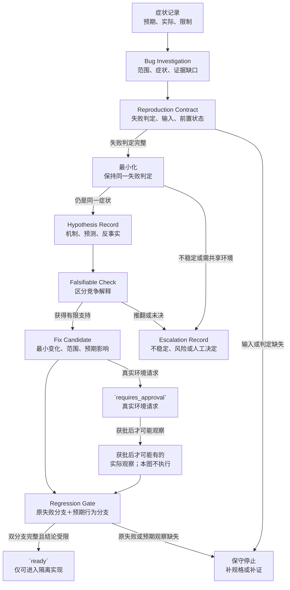

# 32. 自动分析失败并修复 Bug

> 本章把失败处理组织为症状、复现、假设、检查、候选修复和回归门的证据链，避免 Agent 看到报错便猜测修改。

## 本章目标

- [ ] 区分症状、候选根因和已验证修复，并指出三者需要的不同证据。
- [ ] 为一个失败写出复现契约（Reproduction Contract）与最小化停止条件。
- [ ] 用假设记录（Hypothesis Record）表达可推翻的预测和最低风险检查。
- [ ] 用回归门（Regression Gate）限制候选修复的结论，并在证据不足时升级。

## 为什么要学

“测试超时”是一次观察，不是一个原因；“加一秒等待”是一个候选改变，也不是修复结论；“已修复”则需要独立的回归证据。若 Agent 把这三件事压成同一句“修好了”，它可能掩盖真正的状态缺口、让偶发失败继续存在，或把无关改动混进补丁。

本章处理的是**已有失败观察之后**的调查与准入，不处理自动诊断所有系统、替代领域知识、真实生产处置或自动发布。它也不规定跨项目通用的重试次数、超时值或升级阈值；这些都应由具体项目的风险、权限和运行约束决定。

## 前置知识

- 前置章节：第 15 章的观察记录（Observation Record）、第 16 章的反思记录（Reflection Record）与可证伪检查（Falsifiable Check）、第 17 章的评估规格，以及第 31 章的测试证据边界。
- 技术前提：能阅读测试场景、状态表和简单对象；不要求安装 pytest、Playwright 或 Git。
- 不要求：真实缺陷、浏览器、服务地址、账户、凭证、生产日志或提交历史。

## 场景引入

**场景：** 一个虚构的网页登录检查偶发失败：提交动作之后，检查没有观察到预期的可见状态。现有记录只说明动作、预期与实际观察之间有缺口；它没有说明是等待条件、定位目标、服务状态、测试数据还是环境造成。

**成功标准：** 调查输出能把症状、复现条件、竞争假设、检查结果、候选修复和回归条件关联起来；任何缺失都能阻止“已修复”结论。

**边界：** 本章不运行浏览器、接口、Git `bisect`、测试命令或补丁，也不使用真实账号、网络、CI 或日志。

## 核心概念

### 症状与缺陷调查（Bug Investigation）

Google SRE 的排障章节把过程描述为：根据观察与对系统的理解提出候选原因，再用检查寻找支持或反证；它还建议问题报告尽量写明预期、实际和复现方式 [REF-099]。这不是“日志多了就会自动找到根因”的承诺。

本书用 Bug Investigation 保存任务范围、`symptomId`、预期、实际、已有观察、未知变量、风险和停止条件。它只说明“为什么值得调查”：例如“提交后未观察到欢迎状态”。症状是观察，候选根因是待检查的解释，候选修复（Fix Candidate）是尚待实施的最小变化；写成“等待条件错误”或“已经修复”都已经跨过了假设与验证两层，必须另有证据。

### 复现契约（Reproduction Contract）与最小化

Zeller 与 Hildebrandt 的论文讨论 Delta Debugging：通过连续测试把失败样例简化为仍能触发该失败的最小样例；若同时有通过和失败样例，还可隔离两者差异 [REF-098]。论文中的 Mozilla 案例、运行次数和耗时属于其研究语境，不能拿来估算本章或读者项目的成本。

本书的 Reproduction Contract 至少声明输入、前置状态、失败判定、允许动作、被观察变量和不可信变量。最小化不是“删到最短”，而是每一次删减后仍用**同一个失败判定**检查。若失败消失、观察不稳定或缩小动作需要进入共享环境，结论应是“不可稳定复现”或“需要批准”，不是“已经修复”。

### 假设记录（Hypothesis Record）与可证伪检查（Falsifiable Check）

“可能是等待问题”还不能指导工程动作。可用的假设必须写出机制、预测、反事实和检查：例如，若提交后观察早于目标状态可观察的时刻，那么把观察关联到明确的目标条件后，缺失观察应与该条件相关；若不相关，应转查目标、数据或服务层证据。

Google SRE 书特别强调检查应能区分候选原因，并提醒主动检查可能有副作用或混杂因素 [REF-099]。因此，本书的 Hypothesis Record 记录“支持／推翻／未决”，而不是只有“通过／失败”。一次未命中的检查仍是有价值的负面结果：它缩小了下一次检查应覆盖的范围。

### 候选修复（Fix Candidate）与回归门（Regression Gate）

候选修复只关联一个已获有限支持的假设，声明最小改变、预期影响、不得触及的范围和回退假设。扩大 timeout、加入任意 sleep、吞掉异常或跳过失败测试，都破坏了失败判定，不能因“看起来更绿”而称为修复。

回归门则要求两件独立的事：原失败路径被按 Reproduction Contract 重新检查，候选变化后的预期行为被重新观察。还必须保留关联范围、未知项和未覆盖项。只有这些证据齐全时，才能对其覆盖范围作出“已验证修复”的受限描述；它仍不执行测试或发布，也不把单次绿色结果升级为“可以上线”。

## 架构图：从症状到受限结论或升级

下图回答：一个症状如何在不把猜测、候选补丁或单次绿色结果当作结论的前提下，经过复现、假设、检查和回归门？可审查图源位于 [Mermaid 源](../../diagrams/mermaid/chapter-32-bug-investigation-flow.mmd)，Diagram Review 已导出并查看 [SVG](../../diagrams/exported/chapter-32-bug-investigation-flow.svg) 与 [PNG](../../diagrams/exported/chapter-32-bug-investigation-flow.png)。

读图时，症状先进入 Bug Investigation，以保留范围、证据缺口和停止条件，再进入 Reproduction Contract。还应保持三条断点：症状不会直接成为根因；候选修复不会直接成为已验证修复；`ready` 只允许进入隔离实现，不能替代真实环境观察、发布或人工验收。升级记录（Escalation Record）保留负面结果、复现不稳定和需要人工决定的原因，而不把它们吞成“已修复”。

## 工作流程

1. **收集症状：** 记录预期、实际、关联标识与已知限制；输出 Bug Investigation。错误文本只能作为观察摘要。
2. **定义复现：** 写入 Reproduction Contract，并确认失败判定、输入与前置状态。判定不完整时停止，而不是反复重跑。
3. **缩小范围：** 一次只移除或比较一类变量；保留仍触发同一症状的条件。存在通过／失败边界时才讨论差异。
4. **搜索模式：** 比较受控记录、组件边界或已批准的变化区间。Git 文档说明 `bisect` 需要 good/bad 边界并在中点反复测试，最终报告第一个 bad 提交 [REF-100]；这只缩小嫌疑集合，不证明机制。
5. **塑形假设：** 为每个候选写预测、反事实、最低风险检查和期望读数；按相关性、可区分性和风险排序。
6. **执行受限检查：** 关联新观察，记录支持、推翻或未决。检查会触及真实环境或产生副作用时先进入批准／升级出口。
7. **提出候选修复：** 仅为有支持的假设提出最小变更；未决或推翻的假设不得触发修复请求。
8. **经过回归门：** 独立审查原失败路径、候选变化后的预期行为、范围与未覆盖项；任何一项缺失都停止或升级。
9. **复盘与升级：** 把负面结果、无法复现的条件和人工所需决定写入升级记录（Escalation Record），再决定是否形成可撤销经验。

## 最小示例

纯内存 `assessBugInvestigation(investigation)` 只检查调用方注入的教学对象是否含失败判定、可塑形假设、区分性检查、关联的候选修复和双分支回归门。完整计划返回 `ready`；缺少复现、预测、原失败分支或候选变化后的预期观察时停止；任何真实环境请求返回 `requires_approval`。完整接口、红绿记录和测试矩阵见[示例计划](32-automated-failure-analysis-and-bug-fixing.example-plan.md)。

**验证命令：** `npm run test:bug-investigation-assessment` 与 `npm run example:bug-investigation-assessment`。

**实际边界：** 该函数只能分类教学对象；它不复现真实失败，也不调用 pytest、Playwright、Git、浏览器、网络、文件或 CI。

实现前，测试 import 实际得到 `ERR_MODULE_NOT_FOUND`，只说明教学模块尚未存在。实现后，`npm run test:bug-investigation-assessment` 实际得到 8 项通过、0 项失败；`npm run example:bug-investigation-assessment` 输出 `ready`、`bug_investigation_ready`、`implement_in_isolated_example` 与 `executionPerformed: false`。npm 已登记对应测试和演示入口。这些结果只证明注入对象的分类，不代表 Bug 修复、pytest、Playwright、API、浏览器、Git 或端到端流程已经运行。

## 逐步增强

1. 在纯内存调查记录上增加结构化原因码，先保证“未知”不会被伪装成根因。
2. 只有获得受控目标和清理策略后，才把 Reproduction Contract 连接到真实测试环境。
3. 只有具备通过／失败提交边界、可重复性质和工作树批准后，才使用 Git 特定的二分操作。
4. 只有具备最小权限、回退、审查和发布流程后，才允许候选修复写入真实代码。

## 完整工程案例

**背景：** 虚构的 UI 流程在提交后偶发遗漏目标观察。Playwright 文档说明某些 locator 动作会检查可见、稳定、可接收事件和启用等条件，并提供自动重试断言 [REF-081]；这只是该工具的行为语境，不说明本案例真正运行了 Playwright，也不等同业务状态已经正确。

**约束：** 不把自动等待直接归为根因；不添加任意 sleep；不访问真实页面、账号或接口；不将一次未复现当作解决。

**设计选择：** 调查先把“动作后观察缺失”写为症状，建立复现判定，再提出两条竞争假设：观察早于目标状态，或目标本身／前置状态不正确。每条假设都有不同预测；只有第一条获得受限支持时，才形成“将观察绑定到具名条件”的候选修复。

**结果与证据：** 本章仅给出计划性证据链，不产生真实测试结果。回归门会要求原症状和候选变化后的预期行为被分别观察，并保留 UI、服务、数据和发布均未覆盖的限制。

## 实现说明

| 决策 | 选择 | 原因 | 替代方案与边界 |
| --- | --- | --- | --- |
| 失败主语 | `symptomId` 与预期／实际分开 | 避免把异常消息伪装成原因。 | 只保存日志文本无法表达范围。 |
| 假设准入 | 预测与检查缺一不可 | 使候选原因能被推翻。 | 脑暴清单可作输入，不能直接驱动修复。 |
| 修复准入 | Fix Candidate 关联已支持假设 | 防止顺手重构混入调查。 | 大范围重构应另建任务与审查。 |
| 接受结论 | 原失败和预期行为双分支 | 防止“未再失败”掩盖功能缺失。 | 绿色回归仍不证明发布或外部效果。 |

## 测试与验证

| 层级 | 验证对象 | 命令或方法 | 成功标准 | 实际状态 |
| --- | --- | --- | --- | --- |
| 文档 | 来源映射、术语和状态工件 | `npm run validate` | Markdown、链接、既有示例与章节状态通过 | Fact Check 收口后的全仓校验已通过；Final Review 状态同步后由主线程重跑 |
| 单元 | 纯内存调查准入器 | `npm run test:bug-investigation-assessment` | 输出符合调查契约 | 8 项通过、0 项失败 |
| 演示 | 纯内存调查准入器 | `npm run example:bug-investigation-assessment` | 输出受限 `ready` 与 `executionPerformed: false` | 已运行；返回 `ready` |
| 端到端 | 虚构 UI 失败 | 受控环境中的动作与重新观察 | 需要真实批准和证据 | 未运行 |

## 工程实践

- 把负面检查结果和已排除条件保留在 Hypothesis Record；它们可防止下一位调查者重复同一猜测，但不自动成为长期规则。
- 让每项主动检查声明可能副作用和恢复条件；未知副作用比“快速验证”更值得先升级。
- 在变化区间调查中把“第一个 bad 提交”称为待检查变化，而不是根因；机制仍要由独立观察解释。

## 最佳实践

- **先写失败判定，再做最小化。** 否则缩小过程无法判断自己是否还在研究同一个问题。
- **优先选择能区分竞争假设的低风险检查。** 这比累积相同日志或重复重跑更能减少不确定性。
- **让回归门保留未覆盖范围。** 这样已验证修复的受限结论只扩展到证据实际覆盖的范围。

## 常见错误

| 错误 | 表现 | 根因 | 修复方向 |
| --- | --- | --- | --- |
| 把超时当根因 | 一看到失败就增加等待 | 没有区分症状与机制 | 建立竞争假设和预测。 |
| 最小化时更换失败判定 | 样例变短但不再触发原症状 | 没有 Reproduction Contract | 固定同一判定，失去复现时停止。 |
| 二分后直接改代码 | 第一个 bad 提交被称为根因 | 混淆变化引入与机制证明 | 以独立检查解释候选变化。 |
| 只检查“不再失败” | 功能没有被重新观察 | 回归门缺候选变化后的预期分支 | 同时检查原症状和目标行为。 |
| 无止境重跑 | 失败不稳定仍继续猜 | 缺少升级条件 | 写入 Escalation Record 并请求决定。 |

## 安全与边界

- 权限边界：真实测试、Git 状态改变、代码写入、环境访问和发布都需要项目明确授权；本章模型不授予这些权限。
- 数据边界：不记录真实用户、令牌、cookie、生产日志、截图、接口响应或提交标识。
- 人工审批点：涉及共享／生产环境、不可逆数据、真实凭证、工作树切换、补丁写入或发布结论时必须升级。
- 不适用范围：无法定义失败判定、主动检查会造成不可接受风险或观察缺失时，自动调查应停止，不应用“再试一次”掩盖不确定性。

## 章节总结

可靠的 Bug 修复 Harness 不承诺自动找出根因。它要求症状先成为可检查的调查输入，候选根因先写成可推翻的假设，候选修复只服务于获得有限支持的假设；只有回归门保留原失败和候选变化后预期行为两条证据，才可在覆盖范围内作出已验证修复的受限结论。证据不足时应诚实升级。第 33 章将讨论如何把其中已验证、可撤销的经验写入项目记忆，而不是把每条猜测永久化。

## 练习

1. 为“后台任务完成后页面没有刷新”写一个 Reproduction Contract，并列出至少两个不可信变量。
2. 为“等待条件过早”与“目标状态从未产生”分别写一条可区分的 Hypothesis Record。
3. 设计一个 Regression Gate，说明为什么“原失败未出现”仍不足以声明发布成功。

## 延伸阅读

- REF-098：用于理解失败样例最小化与通过／失败差异隔离的研究范围。
- REF-099：用于理解观察、假设、检查、负面结果和调查记录的排障语境。
- REF-100：用于理解 Git 历史二分的产品特定边界。
- REF-081：用于理解 Playwright actionability 与自动重试断言的产品特定语境。

## 参考资料

- [第 32 章参考资料](32-automated-failure-analysis-and-bug-fixing.references.md)
- [第 32 章事实核验](32-automated-failure-analysis-and-bug-fixing.fact-check.md)
- [全局引用登记](../../.ai/references.md)

## 章节完成检查表

- [x] Front matter、目标、前置知识和章节依赖完整。
- [x] 内容为原创表达，来源观点与本书扩展已区分。
- [x] 每项可归因事实有来源，未核验项明确标记。
- [x] 图示有 Mermaid 源码、读图说明和一致术语。
- [x] 示例有环境、验证方式、结果状态和安全边界。
- [x] 技术、事实、语言和图示审查均已记录。
- [x] 已运行 First Draft 收口后的 `npm run validate`。
- [x] `.ai/progress.md`、`CURRENT_STATE.md`、`NEXT_TASK.md` 与交接已更新。
