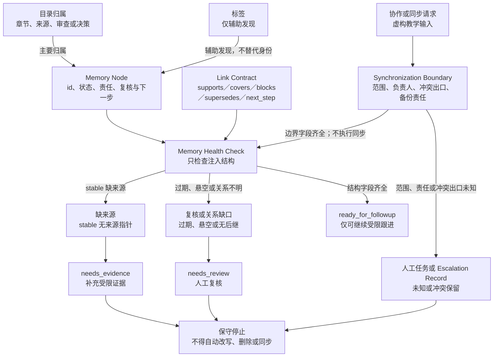

# 33. Obsidian 项目记忆系统

> 本章把长期项目记忆拆成节点、关系、生命周期和复核边界；Obsidian 只提供受限的文件、属性、链接、标签与同步背景，不替代证据、权限或协作决策。

## 本章目标

- [ ] 区分目录、属性、链接和标签各自回答的问题，不把其中任一项当作完整项目记忆。
- [ ] 为记忆节点（Memory Node）声明稳定标识、状态、责任、复核时间和后继动作，并说明字段存在不等于结论正确。
- [ ] 用链接契约（Link Contract）表达来源支持、审查覆盖、阻塞、替代和下一步等关系。
- [ ] 用记忆健康检查（Memory Health Check）把结构缺口路由为补证或人工复核，而不是自动修改笔记。
- [ ] 在跨设备或多人协作前，以同步边界（Synchronization Boundary）记录责任与冲突出口，不把同步功能视为写入授权。

## 为什么要学

长任务的风险不只在于“内容会忘记”。更常见的情况是：文件仍在，但下一位读者不知道某个结论来自哪里、它最后何时复核、它是否已被替代，以及应当做什么。把这些信息压进一次聊天摘要或一个文件夹，通常只能保住文本，不能保住可审查的推理链。

本章讨论的是项目记忆的组织模型，而不是某个笔记软件的配置教程。它不创建 vault，不读取或写入项目笔记，也不执行 Obsidian、Obsidian Sync、插件、云盘、Git、网络、账户、备份或冲突处理。一个文件可被人类在 Obsidian 中浏览，也不表示 Agent 获得了读取、写入、同步或执行的权限。

## 前置知识

- 前置章节：第 03 章的仓库上下文、第 07 章的工作记忆与长期记忆、第 13 章的来源与检索、第 16 章的经验准入、第 19 章的上下文压缩，以及第 31、32 章的测试证据与失败调查边界。
- 技术前提：能阅读 Markdown、YAML front matter 和相对链接；不要求使用过 Obsidian。
- 不要求：真实 vault 路径、设备、账户、同步订阅、插件、团队共享目录、备份或冲突记录。

## 场景引入

**场景：** 为说明结构，本章使用一个虚构的“第 31 章登录测试证据”记忆网。它包含章节说明、来源卡、测试证据计划、图示审查、事实核验和一个未决问题。读者能够看到这些材料的文件名，却无法仅凭文件名判断“测试已完成”是否仍可引用，或下一步应继续调查什么。

**成功标准：** 这张虚构网中的每个可交接结论都能定位到稳定节点、主要归属、关系、生命周期、最低证据和下一步；缺一项时，模型会保留不确定性并要求补证或人工复核。

**边界：** 场景中的章节、来源、责任人和日期均为教学输入。它不代表本仓或任何 Obsidian vault 已被读取，测试、审查、同步和迁移也都没有发生。

## 核心概念

### 项目记忆层（Project Memory Layer）：可保存不等于可接力

本书将项目记忆层定义为：让人类和 Agent 以同一组可定位、可追溯、可审查的 Markdown 材料恢复工作上下文的工程模型。它解决的是“谁能解释这条结论为何存在、现在是否仍可用、接下来由谁处理”的问题；它不是聊天记录的堆积、目录树、图谱视图或无边界知识库。

下表区分“找到文件”与“能够接力”的信息量。后一列的字段是本书工程模型，不是任何应用自动生成的保证。

| 只有文件名与目录时可以回答 | 加入节点、关系与状态后额外可以回答 |
| --- | --- |
| 材料大致归属在何处。 | 该材料的稳定身份、用途、当前生命周期和责任人是什么。 |
| 哪些文件名称看似相关。 | 一条来源是否仅支持某项结论，某次审查覆盖了什么范围。 |
| 一个目录里有哪些条目。 | 节点何时复核、是否已被替代、下一位读者应先做什么。 |
| 文件是否仍然存在于某个位置。 | 结构是否足以支持后续工作，以及哪些缺口必须人工决定。 |

因此，“测试已完成”若只有一行笔记而没有来源范围、复核时间、限制和后继动作，就仍不是可复用的项目结论。第 32 章中的调查记录也应保留在这种受限边界内：未验证的假设不能因为被记下就升级为长期经验。

### Vault 与目录归属：路径只说明主要归属

Obsidian 官方帮助说明，笔记以 vault 中的 Markdown 纯文本文件保存，vault 是本地文件系统中的文件夹，应用会刷新外部文件变化 [REF-101]。这些陈述仅说明一种文件组织和显示背景；它们不证明文件语义正确、外部编辑没有冲突、任何主体已获访问权，或本章已经打开了 vault。

在本书的项目记忆层中，目录只表达主要归属。例如，虚构网络可以把 `chapter-31` 放在 `chapters/`，把 `source-ref-097` 放在 `sources/`，把 `review-ch31-fact-check` 放在 `reviews/`。路径不能取代稳定身份：同一条来源可能服务多个章节，同一审查也可能覆盖多份材料。路径更不能证明读取权限、同步状态或事实真实性。

当路径重组、同一结论被复制、文件出现在预期目录外，或外部变化来源未知时，模型应转入人工复核。即使某个应用能够刷新文件变化，也不能由此推断内容已合并、冲突已解释或读者已经看见它。

### 记忆节点（Memory Node）与生命周期记录（Lifecycle Record）

Obsidian 官方帮助将 Properties 描述为文件顶部 YAML 中的结构化数据，并说明同名属性在 vault 中使用同一类型 [REF-102]。这为字段的表达方式提供产品背景，却不定义本书的 schema，也不验证 YAML 中的值是否符合项目语义。

本书建议每个 Memory Node 至少携带 `id`、`kind`、`status`、`owner`、`reviewed_at` 与 `next_action`。下列片段只是虚构教学输入，用来说明字段的职责；它没有被写入任何文件或 Obsidian 属性。

```yaml
id: review-ch31-fact-check
kind: review
status: stable
owner: evidence-maintainer
reviewed_at: 2026-07-16
next_action: link_to_chapter_summary
```

字段中的 `stable` 只表示本书模型中“已具备继续交接所需的最小结构”，不表示结论已经通过全部技术或事实审查。为此，生命周期记录还要区分 `collected`、`under_review`、`stable`、`superseded`、`archived` 与 `pending_removal`：

| 生命周期状态 | 本书模型中的含义 | 仍不能主张的事实 |
| --- | --- | --- |
| `collected` | 材料已被登记，尚未完成范围判断。 | 内容正确、来源适用或可执行。 |
| `under_review` | 已指定复核任务或责任。 | 复核已经完成或结论可靠。 |
| `stable` | 结构化交接字段齐全，允许进入后续受限判断。 | 产品、代码、事实或权限已被独立验证。 |
| `superseded` | 旧节点不应继续作为首选入口，并应给出替代目标。 | 替代目标正确，旧材料已删除。 |
| `archived` / `pending_removal` | 材料有保留或删除意图。 | 迁移、通知、删除或审批已经执行。 |

若稳定节点缺 `reviewed_at`、被替代节点缺替代指针，或任何节点没有下一步，记忆健康检查只能报告结构缺口。它不能自动移动文件、删除内容、通知负责人或批准结论。

### 链接契约（Link Contract）：可点击不等于关系成立

Obsidian 官方帮助说明，产品支持 Wikilink 与 Markdown 内部链接，并可在重命名时更新 vault 内链接；使用者也可以关闭 Wikilink 格式 [REF-103]。这些能力并不保证外部 Markdown 渲染器理解 Wikilink 或块引用，也不保证一次重命名保留附件、Git 历史、跨工具关系和人工语义。

本书用 Link Contract 为重要边声明 `from`、`relation`、`to`、方向和最小可检查条件。允许的教学关系包括：

| 关系 | 说明 | 被反驳或缺失时的保守处理 |
| --- | --- | --- |
| `supports` | 来源节点为某结论提供有限范围的依据。 | 回到来源范围审查，不能把结论标为已证实。 |
| `covers` | 审查节点说明它检查了某个明确范围。 | 标出未覆盖范围，不把审查外推到全部材料。 |
| `blocks` | 一个缺口阻止另一项工作继续。 | 保持停止，不用同名文件或标签绕过它。 |
| `supersedes` | 新节点替代旧节点作为后续入口。 | 缺替代目标或出现循环时进入 `needs_review`。 |
| `next_step` | 节点把工作交给一个明确的后继问题。 | 缺目标时要求补全交接，而不是猜测下一步。 |

跨工具的关键关系应优先使用项目约定的 Markdown 相对链接；若展示 Wikilink，必须标出其 Obsidian 特定性。无论格式如何，链接存在只能提供可追溯入口，不能代替来源范围判断或人工语义审查。

### 标签与检索：辅助发现，不承担身份或权限

Obsidian 官方帮助将标签描述为帮助查找笔记的方式；YAML 中的 `tags` 使用列表，嵌套标签可帮助筛选相关标签 [REF-104]。本章只把这些能力用作检索背景，不将标签层级写成权威目录、依赖图、访问控制或事实核验。

本书中可用 `memory`、`chapter-31` 或 `needs-review` 一类标签形成粗粒度候选集合。但稳定身份由 `id` 承担，主要归属由路径承担，关键关系由 Link Contract 承担。一个节点缺标签仍可能被稳定链接定位；反过来，找到 `#needs-review` 只说明可能找到待审候选，不能证明候选完整、权限充分或结果可执行。

标签含义漂移、同名标签被不同团队使用、敏感状态通过标签泄露，或筛选结果被拿来决定执行权限时，都应停止扩大标签的含义。此时需要的是明确目录规则、节点字段、关系契约或人工决策，而不是再增加一层标签。

### 记忆健康检查（Memory Health Check）：检查结构，不裁判事实

记忆健康检查是本书的纯内存判断模型。它的输入是注入的节点、关系、状态、来源指针、复核时间、后继动作和同步边界；输出可以为 `ready_for_followup`、`needs_evidence`、`needs_review` 或在请求外部执行时为 `requires_approval`，并附具名原因。它检查的不是“文章内容是否真实”，而是“这份教学记忆结构是否足以让后续工作在受限范围内继续”。

建议检查以下维度：

1. 稳定节点是否同时有来源指针、`reviewed_at` 和后继动作或替代关系。
2. `superseded` 节点是否指向可定位的替代节点，且替代链没有循环。
3. 每条核心 Link Contract 是否有明确目标、允许的关系类型和可检查的范围。
4. 标签是否只作发现辅助，没有冒充稳定身份、关系或权限结论。
5. 跨设备或协作请求是否已声明同步边界，而非把“需要同步”写成“已经同步”。

例如，缺来源的 `stable` 结论应返回 `needs_evidence`；过期复核、悬空链接或未知同步范围应返回 `needs_review`；字段齐全的虚构教学图才可得到 `ready_for_followup`。即便最后一种结果也只证明给定对象的结构完整，不代表真实 vault 已扫描、链接目标可访问、来源权威、Agent 有读取权或外部系统状态正确。

### 同步边界（Synchronization Boundary）：先记录冲突出口与责任

Obsidian 官方帮助将 Obsidian Sync 描述为跨设备私有同步笔记的附加服务，并提醒同时使用其他云存储时应先备份以避免同步冲突 [REF-105]。这是一项需要单独选择和核验的产品能力背景，不是本仓已启用 Sync、已备份或冲突必然可自动合并的证据。

本书的 Synchronization Boundary 记录候选渠道、覆盖范围、负责人、变更入口、冲突停止条件、备份责任和人工决策出口。下面是一条未启用的虚构边界记录：

```yaml
scope: chapter-memory
channel: undecided
owner: documentation-maintainer
conflict_exit: request_human_review
backup_responsibility: undecided
```

`channel: undecided` 表示协作范围不能被扩展为“已经同步”。遇到多个同步渠道、备份未知、负责人未知、冲突无法安全解释，或需要真实账户、设备与写入权限时，模型应停止同步尝试，并建立人工任务或升级记录。同步边界的完成条件是责任和停止出口清楚，而不是某个界面显示了状态。

## 架构图：项目记忆如何保留不确定性

下图回答：虚构的项目记忆节点如何按目录、标签、链接契约与同步边界完成有限结构检查，再分别进入补证、人工复核或仅可受限跟进？可编辑源为 [Mermaid 源](../../diagrams/mermaid/chapter-33-project-memory-health-flow.mmd)；Diagram Review 已导出并查看 [SVG](../../diagrams/exported/chapter-33-project-memory-health-flow.svg) 与 [PNG](../../diagrams/exported/chapter-33-project-memory-health-flow.png)。图表达本书项目记忆层模型，不表示真实 vault、Obsidian、Sync、文件、网络、账户、插件、备份或外部系统已经读取、写入、同步或执行。



读图时，目录和标签只帮助定位 Memory Node，关键关系仍由 Link Contract 提供。同步请求先经过 Synchronization Boundary；边界字段齐全也只允许它作为结构检查输入，不执行同步。Memory Health Check 的 `ready_for_followup` 只表示给定教学对象的字段完整，不能代表事实正确、链接可访问、权限已授予或外部状态已验证；缺来源、关系缺口和同步未知均保留在补证、人工复核或保守停止出口。

替代说明：一张自上而下的教学流程图。目录与标签汇入记忆节点，节点、链接契约与已声明的同步边界进入记忆健康检查；检查分别通向 `ready_for_followup`、`needs_evidence` 与 `needs_review`。缺来源、复核或关系缺口，以及同步边界未知，最终都停在“不得自动改写、删除或同步”的保守出口。

## 工作流程

以下是为项目记忆建模的建议顺序，而非对真实文件执行的操作：

1. **界定交接问题：** 写明下一位读者需要恢复的结论、限制和未决问题；不要从“收集更多笔记”开始。
2. **声明主要归属：** 只用目录表达章节、来源、审查、决策或归档等主要归属。
3. **建立记忆节点：** 为教学节点填写稳定标识、种类、生命周期、责任、复核时间和后继动作。
4. **写链接契约：** 为来源支持、审查覆盖、阻塞、替代和下一步分别指定关系与目标。
5. **收敛标签用途：** 只把标签用于主题或粗粒度发现，不将其用于唯一身份、权限或完整依赖判断。
6. **运行受限检查：** 仅对注入的纯内存输入报告缺来源、过期、悬空关系和缺同步边界等原因。
7. **记录同步边界：** 在协作前写出渠道、范围、责任、备份和冲突出口；任何未知项都保留为停止条件。
8. **人工复核后再升级：** 若要读取、迁移、同步或写入真实材料，另行申请明确范围、权限、预览、回读和审计控制。

## 最小示例

Example Implementation 阶段已完成。`assessProjectMemoryGraph(graph)` 仅评估调用方注入的教学对象，返回结构状态与原因码；它不会读取 Markdown 文件、打开 Obsidian、执行同步、访问网络、云盘、Git、账户、设备、插件、子进程或 Agent 工具。接口、红绿记录与运行边界见[第 33 章示例计划](33-obsidian-project-memory-system.example-plan.md)。

下列虚构输入使这份契约可被反驳；它们描述受限路由，并不把对象分类写成外部操作已经发生。

| 教学输入 | 预期的受限路由 | 不能由路由推出的事实 |
| --- | --- | --- |
| 结构完整的记忆图 | `ready_for_followup` | 真实项目记忆正确、已读取或已同步。 |
| `stable` 节点缺来源 | `needs_evidence` | 缺口已被修复或来源不可用。 |
| 节点复核日期过期 | `needs_review` | 内容必然错误或需要删除。 |
| 链接目标悬空 | `needs_review` | 外部系统或本地文件一定不存在。 |
| `superseded` 无替代节点 | `needs_review` | 旧结论不再有价值。 |
| 标签试图充当身份 | `needs_review` | 标签系统本身故障。 |
| 同步范围未定义 | `needs_review` | 已获得同步或写入授权。 |

Example Implementation 阶段先记录模块缺失红灯，再以 Node 测试和演示收口。演示固定包含 `executionPerformed: false`，避免把对象分类误写成外部执行；实际结果与未覆盖的外部边界见“测试与验证”和[事实核验](33-obsidian-project-memory-system.fact-check.md)。

## 逐步增强

| 新需求 | 需要新增的控制 | 升级触发 | 本章为何不实现 |
| --- | --- | --- | --- |
| 读取真实 Markdown 项目材料 | 获批路径、只读范围、敏感信息规则、读取记录与新鲜度检查。 | 需要主张当前项目内容。 | 本章没有文件读取接口。 |
| 创建或迁移 vault 属性 | 备份、schema 迁移计划、字段冲突检查、预览和回读。 | 需要改变真实笔记结构。 | 本章字段只是教学模型。 |
| 使用 Obsidian 特定链接或插件 | 写作当日产品／插件核验、跨工具回退、权限和数据边界。 | 相对 Markdown 链接不足以表达需求。 | 本章不打开 Obsidian 或安装插件。 |
| 跨设备或多人同步 | 已选渠道、负责人、冲突处理、备份和人工升级。 | 记忆需要离开单一受控位置。 | Synchronization Boundary 不执行同步。 |
| 让 Agent 提议更新项目记忆 | 最小写权限、变更预览、来源复核、人工批准、回读和审计。 | 工作从阅读升级为写入。 | 节点和健康检查不授予工具权限。 |

每一次增强都只增加一种真实能力及其对应控制。仅因团队规模变大而直接接入同步、插件或写入工具，会跳过来源、权限、冲突和回读这些仍然需要证明的条件。

## 完整工程案例：虚构的章节证据网

下表把“第 31 章登录测试证据”作为教学网络，而不是仓库事实。它说明节点需要什么最小信息才能供下一位读者审查，也说明节点拥有这些字段后仍不能声称什么。

| 虚构节点 | 主要归属 | 生命周期与关系 | 最小证据 | 当前不能主张的事实 |
| --- | --- | --- | --- | --- |
| `chapter-31` | `chapters/` | `stable`；由来源与审查节点支持；`next_step` 指向未决问题。 | 章节范围、限制和下一步。 | 真实测试或浏览器流程已运行。 |
| `source-ref-097` | `sources/` | `under_review`；`supports chapter-31`。 | 来源链接、受限支持范围和复核任务。 | 来源支持全部测试或项目结论。 |
| `test-evidence-plan` | `reviews/` | `stable`；被 `chapter-31` 引用。 | 计划范围、未运行边界和后继审查。 | 测试已经执行或结果可用。 |
| `review-ch31-diagram` | `reviews/` | `stable`；`covers chapter-31` 的图示范围。 | 审查范围、图文边界和复核时间。 | 审查覆盖所有后续改动。 |
| `review-ch31-fact-check` | `reviews/` | `stable`；`covers chapter-31` 的可归因陈述。 | 来源映射、访问日期和外推禁区。 | 任何相关产品的动态行为不再变化。 |
| `open-question-observation` | `decisions/` | `collected`；`next_step` 指向第 32 章主题。 | 问题描述、未知变量和责任人。 | 失败调查已经发生或根因已确定。 |

这个案例的关键选择是：每条边都说清自己的关系类型，而不让一个总览页面承担所有语义。即使图可以被浏览，缺少 `reviewed_at` 或来源范围的节点仍然必须进入补证或复核出口。这样，项目记忆能够帮助恢复工作，却不会默默放大不确定性。

## 实现说明

本章的可运行实现仅处理调用方注入的纯内存教学对象；下表记录它保持的设计取舍，不能被读作已经部署的架构。

| 决策 | 当前选择 | 原因 | 不采用的捷径与边界 |
| --- | --- | --- | --- |
| 身份 | 用稳定 `id` 区分节点。 | 文件名和标签都会随组织方式变化。 | 仅用路径或标签会混淆身份与发现。 |
| 关系 | 为关键边使用 Link Contract。 | 点击链接不能说明支持、覆盖或替代。 | 用一张无类型关系图无法审查语义。 |
| 状态 | 生命周期与复核时间共同出现。 | `stable` 需要知道何时最后复核。 | 状态字段不自动证明内容正确。 |
| 检查结果 | 只返回原因码和保守路由。 | 结构检查不应伪装成事实裁判。 | 自动重写、删除或同步超出模型权限。 |
| 协作 | 同步边界先于任何渠道操作。 | 同步涉及冲突、备份和责任。 | 把文件共享当作写入授权会越过控制面。 |

## 测试与验证

本章已完成纯内存示例、图示与事实核验；尚未运行或尚未由共享集成收口的验证仍保持为未完成状态。

| 层级 | 验证对象 | 命令或方法 | 成功标准 | 实际状态 |
| --- | --- | --- | --- |
| 文档 | 正文、引用映射和交叉链接 | 共享集成运行 `npm run validate`。 | Markdown、链接和章节状态通过。 | 已在 Final Review 前运行：检查 499 个 Markdown 文件、0 个 Markdown lint 错误；当时章节状态为 32 章完成、6 章进行中、9 章未开始。本轮不重复全仓校验。 |
| 单元 | 纯内存记忆图评估器 | `node --test examples/agent/project-memory-health.test.mjs`。 | 公开返回结构符合受限契约。 | 已运行：7 项通过、0 项失败；只覆盖测试构造的教学对象。 |
| 演示 | 纯内存记忆图评估器 | `node examples/agent/project-memory-health.mjs`。 | 显式保留 `executionPerformed: false`。 | 已运行：输出 `ready_for_followup`、`project_memory_graph_ready`、`implement_in_isolated_example` 与 `executionPerformed: false`。 |
| 端到端 | vault、链接、同步与协作流程 | 需要单独授权的真实环境观察。 | 操作后重新观察目标状态与冲突处理。 | 未运行；不在本章范围。 |

## 工程实践

- 将“结论内容”与“结论的来源、状态、范围和下一步”分开保存。前者可被讨论，后者让讨论可以被恢复和交接。
- 给每个 `stable` 节点设置复核入口，而不是把一次审查写成永久有效。动态产品资料、项目约束和关联关系都可能变化。
- 把无法判断的链接、同步和权限问题显式路由给人类。未知项被写成原因码，比被压成空白或默认值更容易审查。
- 让目录、属性、链接和标签各自只承担一种主要职责。重叠使用可以提高可发现性，但不能互相替代为证据。

## 最佳实践

- **先定义下一位读者要恢复什么。** 只有知道要交接结论、限制和下一步，字段与关系才有明确目的。
- **把链接写成有类型的断言。** `supports` 与 `covers` 的证据要求不同，不能因为它们都指向同一页就混为一谈。
- **对稳定状态设置反例。** 例如缺来源、过期复核或悬空替代关系时，应能说明为什么需要降级为补证或人工复核。
- **把同步看作独立变更。** 在范围、负责人、备份和冲突出口未明确时，不以“工具支持同步”替代协作设计。

## 常见错误

| 错误 | 表现 | 根因 | 修复方向 |
| --- | --- | --- | --- |
| 用文件夹代替状态 | 资料归类后就被当作可直接复用。 | 路径只描述主要归属。 | 补充节点状态、复核时间和下一步。 |
| 把标签当作知识图 | `#needs-review` 被当成所有待审材料清单。 | 混淆检索候选与完整关系。 | 用稳定 ID 与 Link Contract 表达关键边。 |
| 链接存在就认为来源成立 | 一条链接被写成“已证明”。 | 未检查来源范围和审查结论。 | 记录 `supports` 的受限陈述与反驳出口。 |
| `stable` 没有复核时间 | 旧结论持续被引用。 | 生命周期没有新鲜度条件。 | 把过期复核路由为 `needs_review`。 |
| 同步功能等于协作完成 | 共享目录被当成已授权、已备份且可合并。 | 没有同步边界和冲突责任。 | 先记录渠道、范围、备份和人工出口。 |

## 安全与边界

- 权限边界：本章不授予本地文件、vault、同步服务、插件、网络、云盘、Git、账户、设备或 Agent 工具的读取、写入和执行权限。
- 数据边界：教学节点不包含真实项目路径、个人笔记、账户、订阅、同步日志、备份、凭证或团队成员数据。
- 人工审批点：读取真实材料、迁移属性、启用插件、选择同步渠道、解决冲突、创建备份或让 Agent 提议写入时，都需要独立的范围与批准。
- 不适用范围：当不能说明来源、责任、复核日期、关系目标或同步退出条件时，项目记忆模型应停止给出可继续的结论，而不是用默认值补齐。

## 章节总结

可持续的项目记忆不是更多笔记，而是让路径、节点、关系、生命周期、健康检查和同步责任各自只回答它们能证明的问题。Obsidian 的 Markdown 文件、Properties、内部链接、标签和同步资料提供了受限背景；本书的工程价值在于把这些表面组织成可交接、可反驳、可升级的记忆边界。

第 34 章将把单个可复用能力扩展为团队级 Skill Library，进一步处理登记、质量、版本和弃用。第 37 章再从项目记忆和 Skill 的案例中提炼可复用的设计模式；这些后续章节同样不能把教学工件倒写成真实部署、权限或组织治理证明。

## 练习

1. 为一个“依赖升级决策”写出 Memory Node、生命周期、来源关系和下一步，并指出哪些字段仍不能证明结论正确。
2. 为一个 `superseded` 节点设计替代关系，说明替代链接悬空时健康检查应返回什么原因。
3. 比较相对 Markdown 链接与 Wikilink 在跨工具场景中各自能主张的最小能力。
4. 为计划同步给同事的一组章节记忆写出 Synchronization Boundary，并列出至少两个必须人工决定的冲突。

## 延伸阅读

- REF-101：Obsidian vault、Markdown 纯文本与本地文件夹的受限产品背景。
- REF-102：Obsidian Properties 的 YAML 结构化数据与同名属性类型语境。
- REF-103：Obsidian Wikilink、Markdown 内部链接和 vault 内重命名更新的限定行为。
- REF-104：Obsidian 标签的检索、YAML 列表与嵌套标签筛选背景。
- REF-105：Obsidian Sync 的跨设备私有同步和备份防冲突提醒。

## 参考资料

- [第 33 章参考资料](33-obsidian-project-memory-system.references.md)
- [第 33 章事实核验](33-obsidian-project-memory-system.fact-check.md)
- [全局引用登记](../../.ai/references.md)

## 章节完成检查表

- [x] Front matter、目标、前置知识和章节依赖完整。
- [x] 内容为原创表达，来源观点、本书工程模型与虚构教学输入已区分。
- [x] 每项可归因事实已有受限引用，未实施工件明确标记。
- [x] 图示有 Mermaid 源码、读图说明和一致术语。
- [x] 示例有环境、验证方式、结果状态和安全边界。
- [x] 技术、图示与事实审查均已记录。
- [x] 语言审查已记录。
- [x] 已运行 Final Review 前的共享 `npm run validate` 基线；本轮不重复全仓校验。
- [x] `.ai/progress.md`、`CURRENT_STATE.md`、`NEXT_TASK.md` 与交接已更新。
- [x] Final Review 已记录；本轮重跑专用测试、演示、图源一致性检查并查看现有 PNG。
