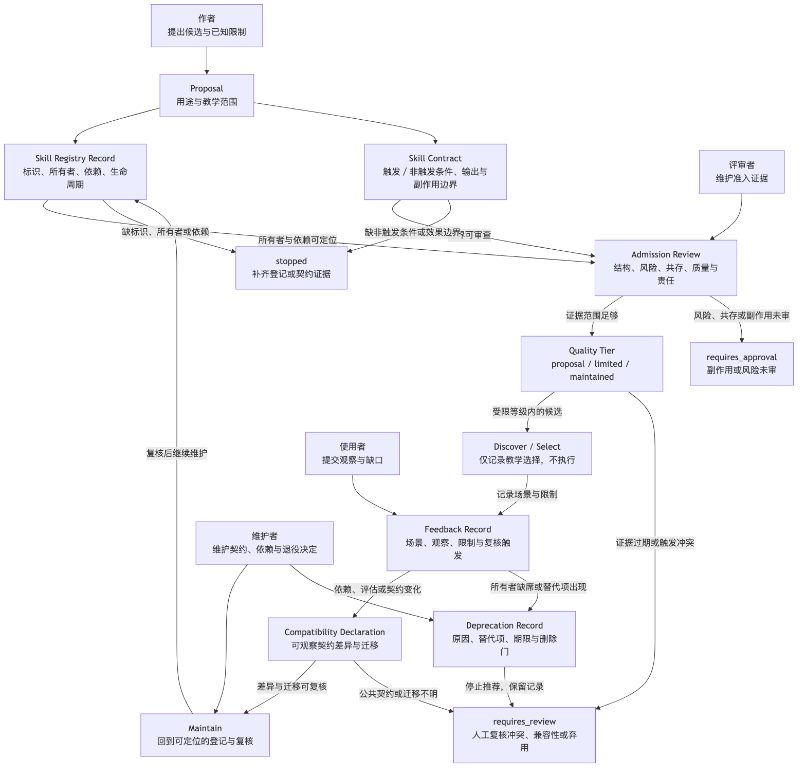
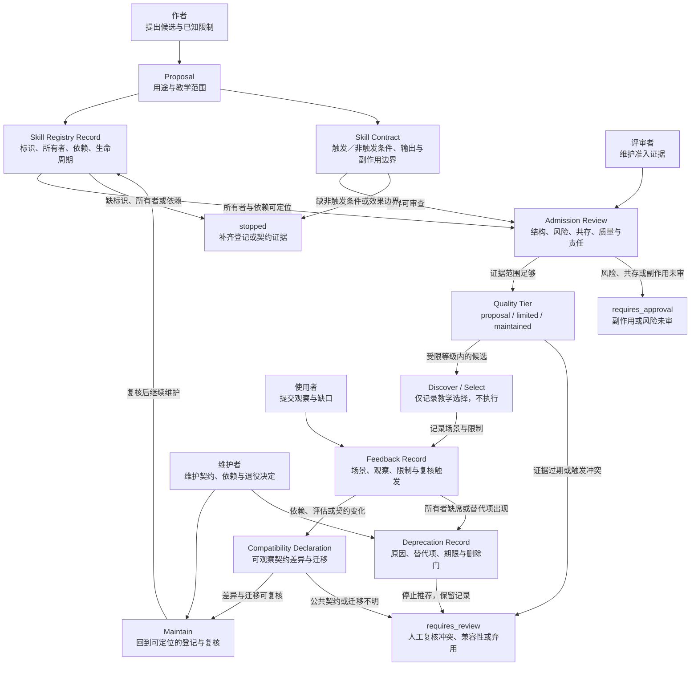

# 34. 团队级 Skill Library

> 本章把团队共享的 Skill 视为需要登记、审查、维护和退役的受限资产，而不是把一个可发现目录误当成可安全执行的能力。

## 本章目标

- [ ] 区分一个含有 `SKILL.md` 的目录、一个可发现候选和一项可维护的团队资产。
- [ ] 用技能注册记录（Skill Registry Record）与技能契约（Skill Contract）分别表达发现责任和允许行为。
- [ ] 为候选 Skill 设计准入审查（Admission Review）、质量等级（Quality Tier）和保守停止出口。
- [ ] 用兼容性声明（Compatibility Declaration）讨论可观察契约的变化，而不把版本号当作质量或安全证明。
- [ ] 用反馈记录（Feedback Record）与弃用记录（Deprecation Record）处理所有权消失、评估退化和替代能力出现的情形。

## 为什么要学

共享仓库里出现一个 `SKILL.md`，只能说明某处有一份文件；即使某个产品能够发现它，也仍不能回答由谁维护、何时不应触发、带副作用的部分是否已被审查，以及失效时由谁决定停止推荐。把这些问题留给使用者临场猜测，会让“团队复用”退化成一批名称相似、边界不明的提示词和脚本。

本章处理的是**团队资产的治理接口**。它不建立注册表服务，也不安装 Skill、打包 plugin、配置产品、访问网络或调用 MCP。登记、审查和版本相关文字都只是可以被审阅的教学工件；它们不授予运行时权限，不代表组织授权，也不证明某项输出已经产生价值。

## 前置知识

- 前置章节：第 08 章的技能与技能契约、第 17 章的评估规格与证据、第 23 章的 Skills／Hooks、第 26 章的任务隔离，以及第 33 章的项目记忆与责任信息。
- 技术前提：能阅读 Markdown、YAML frontmatter、表格和简单的结构化记录。
- 不要求：真实 Skill、产品账户、插件市场、组织目录、生产数据、凭证、网络或浏览器。

## 场景引入：共享文件夹为何不能替代团队库

**场景：** 一个虚构团队收集了三个“已经有人用过”的候选能力：API 契约测试、文档事实核验和发布检查。成员只看见名称与简短说明，却无法判断两个候选是否会抢同一任务、未知依赖是否可接受，或谁应在维护者离开后处理失效项。

**成功标准：** 团队能把用途、触发范围、非触发条件、所有者、依赖、风险、评估状态、版本差异和退役路径写成不同的可审查字段；任一字段缺失时都能给出停止理由。

**边界：** 三个候选都是本章注入的虚构教学记录。它们不读取仓库、不请求资料、不启动测试、不写文件、不访问用户数据、URL、凭证或外部系统，也不表示任何 Skill 已经安装、发布、选择或执行。

## 从目录到团队资产：三种主张不能互相替代

Agent Skills Specification 将 Skill 描述为至少包含 `SKILL.md` 的目录，并在其 frontmatter 中规定 `name` 与 `description` 等格式信息；指令、参考资料和资源可按需组织 [REF-024]。这是格式层的有限背景：它有助于表达一个条目如何被描述，却不自动给出维护责任、风险结论或团队可用性。

Codex 文档在其产品语境中说明了 Skill 的若干发现位置，并指出 `description` 会影响隐式触发；同一文档也区分了直接 Skill 与可分发 plugin 的用途 [REF-106]。Anthropic 的企业指南要求第三方或内部贡献者的 Skill 在部署前完成审查，并将不受信任来源的安装按生产软件同等严格对待 [REF-108]。这些资料不能合并成“所有 Agent 都会以相同方式发现、共享或运行 Skill”的断言。

本书因此把下列三种主张分开：

| 层次 | 可以回答的问题 | 不能回答的问题 |
| --- | --- | --- |
| 目录与格式 | 是否有一个被命名的候选及其说明材料。 | 谁对它负责、是否允许执行、是否与其他候选冲突。 |
| 产品发现 | 某一产品文档描述的范围内，条目可能怎样被发现或被描述影响。 | 团队是否应推荐它、模型是否会选对、其他产品是否相同。 |
| 团队资产 | 谁维护、何时触发、哪些副作用可接受、何时降级或退役。 | 外部动作已经被授权、已经运行或已经产生预期效果。 |

描述写得更宽泛，并不能修复责任和冲突问题；它反而可能扩大不恰当的触发范围。团队库首先要让人能拒绝“文件存在，所以可用”的推理，再讨论怎样把候选变成可维护资产。

## 教学案例：三个候选，三种不能直接发布的原因

下表不是一个真实目录，也不是产品配置。它只让三类缺口同时可见，使后续审查不必从一个抽象的“Skill 平台”开始。

| 候选 | 用途与触发范围 | 当前已声明的边界 | 当前缺口与教学路由 |
| --- | --- | --- | --- |
| API 契约测试 | 在输入已声明 API 契约、期望响应形状与错误分类时提供测试计划候选。 | 不访问服务、不发送请求、不读取凭证。 | 没有维护者和依赖声明，保持 `proposal`。 |
| 文档事实核验 | 在有来源清单、待核验陈述和只读范围时提出核验步骤。 | 只读、不得声称已访问网站或已确认事实。 | 有评估样例，可进入 `limited` 的受限评审。 |
| 发布检查 | 在变更需要交付前列出检查项。 | 尚未分开草稿、审批与外部写入。 | 副作用边界不清，路由为 `requires_approval`。 |

这里的 `proposal`、`limited` 与 `requires_approval` 都是本书教学状态，而不是某个产品的枚举值。它们只表达“给定记录还缺哪些可审查材料”。例如，API 契约测试即使名称熟悉，也不能因为团队有人用过就跳过维护者和依赖；发布检查即使包含许多正确的检查项，也不能把无条件写入描述包装成可发布能力。

## 两份独立工件：登记记录与技能契约

技能注册记录（Skill Registry Record）解决“团队怎样找到并追溯候选”的问题。本书建议它至少记录稳定标识、用途、触发范围、所有者、契约版本、依赖、评估状态、生命周期状态和证据指针。它的职责是可定位性与责任归属：登记一条记录不会安装、授权或执行任何 Skill。

技能契约（Skill Contract）解决“候选允许做什么、不该做什么”的问题。本书把输入前提、触发条件、非触发条件、允许输出、工具边界、副作用类别、失败路径、所需证据和维护范围放入这份工件。它延续第 08 章的单 Skill 契约，但本章不把契约扩张为产品 schema、模型选择保证或环境许可。

| 陈述或字段 | 应属于的工件 | 原因 |
| --- | --- | --- |
| “由谁处理失效依赖” | Skill Registry Record | 它指向责任人与生命周期。 |
| “什么时候不应触发” | Skill Contract | 它限定行为和冲突出口。 |
| “使用了哪一版契约” | Skill Registry Record | 它让条目可回溯到具体声明。 |
| “是否允许写入或联网” | Skill Contract | 它描述效果边界，不能由条目名称推断。 |
| “已做过一次评估” | 登记中的评估状态 | 它只记录证据位置，不替代评估本身。 |

`name` 与 `description` 的格式要求可作为这一分工的背景 [REF-024]；Codex 文档中 `description` 对隐式触发的限定语境，也不能替代本书所列的全部契约字段 [REF-106]。若缺稳定标识、所有者、非触发条件、依赖、副作用边界或失败路径，教学路由应给出“登记证据缺失”或“契约边界缺失”一类的停止结论，而不是进入下一层评审。

## 准入审查与质量等级：结构正确不等于可用

Anthropic 的企业指南将发布前风险审查、触发准确性、隔离、共存、输出质量、所有者、版本、监测和弃用列为组织治理的考量维度 [REF-108]。该指南没有为所有团队提供统一流程，也不构成跨供应商合规标准；本章只借其受限背景说明，结构检查之外仍有风险、共存、责任和质量问题。

本书的准入审查（Admission Review）将审查者、范围、来源与依赖、风险、触发准确性、共存关系、输出质量、责任和未决项分开记录。通过准入审查的结论应写成“就给定材料可进入某个受限等级”，而不是“获得运行时权限”“已经安全”或“业务已经验收”。

质量等级（Quality Tier）则让团队说清条目被推荐到什么程度：

| 等级 | 进入条件 | 可见限制 | 降级或停止触发 |
| --- | --- | --- |
| `proposal` | 只有候选用途，或登记、契约、所有者、依赖尚不完整。 | 可讨论，不应被推荐为团队基础能力。 | 核心字段缺失、来源未知或责任不明。 |
| `limited` | 已具备受限契约、审查范围和可解释的评估样例。 | 只能在声明的输入、范围和人工复核前提下讨论。 | 触发冲突、评估退化、依赖变更或副作用不清。 |
| `maintained` | 所有者、契约、依赖、评估、反馈与复核触发均可定位。 | 仍不等于安全认证、SLA、自动选择正确或运行时授权。 | 所有者缺席、证据过期、替代项出现或关键边界变化。 |

这些审查项都不能互代。结构正确只说明材料形状可读；依赖审查只说明依赖被列出；风险审查只说明风险被讨论；共存评估只说明冲突被暴露；输出评估也只在所给场景中提供有限证据。把任一项的通过写成真实执行安全，正是团队库最容易制造的错误结论。

## 发现、触发、共存与反馈：被选择不等于成功

当“文档事实核验”和“发布检查”都面对“更新公开说明”时，名称相近并不足以让其中一个默认胜出。前者的非触发条件可以是“要求产生外部写入或没有待核验来源”；后者的非触发条件可以是“审批和副作用尚未拆开”。两条规则的作用是把模糊任务送往复核，而不是让描述文本猜中执行路径。

本书的触发记录应包含触发范围、非触发条件、互斥或优先关系、所需输入和证据缺口。共存评估把同一任务下的候选、被选与未选原因、冲突、隔离假设、输出边界和人工覆盖条件并列。它不调用模型、不运行浏览器、不请求网络，也不保证模型一定遵守这些文字。

反馈记录（Feedback Record）只关联候选版本、场景类别、观察、限制、责任人和重新评估触发。一次正面反馈不把 `limited` 自动提升为 `maintained`；一次负面反馈也不自动删除条目。缺少隔离假设、评估不完整、输入来自未知来源、触发重叠或副作用未说明时，正确路由是 `requires_review`，而不是重试选择或默认执行。

## 版本与兼容性声明：先声明可观察契约

语义化版本规范（Semantic Versioning）2.0.0 以清晰 public API 为前提，区分不兼容改动、兼容新增和兼容缺陷修复，并要求已发布版本不可原地修改 [REF-109]。本章只把这条规则作为受限类比：团队若没有先写清可观察契约，就没有足够依据从 `1.2.0` 或 `2.0.0` 推断一个自然语言 Skill 的触发、输出或风险变化。

兼容性声明（Compatibility Declaration）是本书模型。每次候选改动都应列出触发条件、输入、输出、依赖、工具边界、副作用、评估样例、迁移路径与未覆盖范围的前后差异。版本意图必须能回到差异表，而不能由版本号单独承担解释责任。

| 变动 | 需要比较的可观察差异 | 不能由版本号推出的结论 |
| --- | --- | --- |
| 收紧事实核验的来源范围 | 哪些输入不再满足触发条件，哪些场景需复评。 | 模型一定更准确，或所有旧材料都已迁移。 |
| 改写 API 契约测试的必需输入 | 输入缺失如何停止，依赖和样例怎样变化。 | API 已被调用，或测试已经通过。 |
| 为发布检查增加审批字段 | 副作用边界、人工交接和迁移提示如何变化。 | 外部写入已获授权，或新流程已经被采用。 |

当公共契约未定义、依赖版本未知、迁移路径不明、评估无法覆盖重要变化或存在未审副作用时，候选应保持 `not_ready_to_publish`。这是一个停止状态，不是邀请团队用“先升版本再观察”来替代审查。

## 所有权、反馈与弃用：可撤回比静默遗忘更重要

一个团队库需要的不只是作者名字。作者可以提交候选与已知限制；维护者负责契约、依赖和弃用决定；评审者维护准入证据；使用者记录观察与缺口；集成者只处理已通过独立门审查的共享登记变更。这里的角色是本书的责任划分，并不描述真实组织身份、权限系统或审批链。

弃用记录（Deprecation Record）为停止推荐或移除的条目保留原因、受影响契约版本、替代项、迁移期限、维护终点、风险提示、保留证据和删除门。它不迁移调用方，不删除旧资源，也不撤销任何真实权限。对虚构的“发布检查”候选，维护者不可用与副作用边界改变应分别触发降级或人工复核，而不是直接删除文件。

| 状态 | 最小含义 | 仍不能据此主张 |
| --- | --- | --- |
| 停止推荐 | 新使用者不应把它作为默认候选。 | 文件已删除，或旧调用已停止。 |
| 停止维护 | 不再承诺处理新依赖或评估问题。 | 没有任何人会继续使用它。 |
| 停止执行 | 某个明确环境不应再允许该契约进入动作阶段。 | 相关权限已被撤销或外部效果已回滚。 |
| 删除文件 | 教学或真实材料的载体被移除。 | 责任、记录、依赖或外部副作用已自动清理。 |

这样设计的目的不是延缓变化，而是让变化可以被交接、被反驳并在风险出现时撤回。第 35 章会把这种责任边界进一步置于企业控制与执行平面的讨论中；本章不会提前把它们称为企业部署。

## 架构图：团队 Skill Library 的受限治理生命周期

这张图回答一个问题：候选如何经由登记、契约、准入、等级、反馈、兼容性与退役，得到一个可审查的教学结论，同时把缺口保留在停止或人工复核出口？它的每个节点都是本书工件，既不代表产品已发现 Skill，也不代表任何安装、发布、选择、工具调用或外部效果已经发生。

读图时先看两条并行输入：技能注册记录（Skill Registry Record）让所有者、依赖和生命周期可定位；技能契约（Skill Contract）让触发、非触发和副作用边界可审查。只有两者都满足准入审查的证据要求，候选才会进入质量等级（Quality Tier）和“仅记录”的发现／选择节点。被选不表示效果发生，反馈记录（Feedback Record）也不批准下一版；它只触发兼容性声明（Compatibility Declaration）、维护或弃用记录（Deprecation Record）的后续复核。

图的三类出口同样是结论的一部分：登记或契约缺口进入 `stopped`，风险、共存或副作用未审进入 `requires_approval`，触发冲突、兼容性不明与停止推荐进入 `requires_review`。作者、评审者、维护者和使用者分别只连接到自己负责的教学工件，图中没有“登记后已安装”“选择后外部效果已发生”或“反馈后下一版已批准”的箭头。

## 最小示例：纯内存准入评估器

本章的 [示例计划](34-team-skill-library.example-plan.md) 已实现 `assessTeamSkillAdmission(candidate)`。它检查注入的登记记录、Skill Contract、准入审查、质量等级、兼容性声明和可选弃用记录，并把材料保守地分类为 `ready`、`stopped`、`requires_review` 或 `requires_approval`，并返回具名原因。

Node 内置测试覆盖完整只读候选、缺维护者、缺 Skill Contract、缺质量证据、写入候选、兼容性不明与弃用候选；已实际运行 `node --test examples/agent/skill-library-admission-assessment.test.mjs`，结果为 7 项通过、0 项失败。演示命令 `node examples/agent/skill-library-admission-assessment.mjs` 输出 `ready`、`skill_library_candidate_ready`、`implement_in_isolated_example` 与 `executionPerformed: false`。

**安全边界：** 该纯内存评估器不得读取仓库、安装或打包 Skill／plugin、调用产品 API、请求网络、访问凭证、执行脚本、修改文件或改变注册表。`ready` 只表示给定教学字段可进入隔离示例，不表示任何真实 Skill 已被安装、发布、授权或执行。

## 逐步增强：每增加一种真实能力，增加一种控制

| 新需求 | 必须新增的控制 | 升级触发 | 本章为何不实现 |
| --- | --- | --- | --- |
| 扫描真实仓库中的 Skill | 只读范围、来源清单、路径规则和敏感文件边界。 | 需要从教学目录判断真实材料。 | 本章不读取文件。 |
| 分发或安装 Skill／plugin | 发布源、来源验证、版本锁定、回滚与受影响范围。 | 要改变其他人的可用能力。 | 本章不打包或安装。 |
| 让 Skill 调用工具 | 环境契约、最小权限、审批、前后观察、超时和效果处理。 | 产生网络、文件或业务副作用。 | 登记与契约不授予权限。 |
| 收集实际使用反馈 | 数据分类、保留策略、同意或匿名化、观测质量和人工解释。 | 要记录真实用户或任务数据。 | Feedback Record 不采集数据。 |
| 跨团队或跨租户治理 | 身份、策略、隔离、预算、审计与人工升级。 | Skill 触及企业共享系统。 | 留给第 35 章讨论。 |

渐进增强的判断问题始终是：“纯内存工件缺少哪一种真实证据或控制？”答案不能只是“团队变大了”。一项外部能力一旦进入范围，团队就需要对相应的数据、权限、失败和回退承担新的责任。

## 工程实践与常见错误

- **让非触发条件成为一等字段。** 它可以把“名称相似”的候选送往复核，而不是伪装为智能选择。
- **把评估证据定位到版本和场景。** 没有场景、范围和限制的“曾经有效”不足以支撑推荐。
- **先写兼容性差异，再选择版本意图。** 这样版本不会遮蔽输入、输出、依赖和副作用的真实变动。
- **把停止推荐和删除分开。** 先阻止新推荐，再决定记录保留、迁移和删除门，能避免证据链被静默抹去。

| 常见错误 | 表现 | 根因 | 修复方向 |
| --- | --- | --- | --- |
| 用格式替代治理 | 有 `SKILL.md` 就进入团队默认列表。 | 混淆目录、发现与责任。 | 补齐登记、契约、所有者和审查证据。 |
| 用宽泛描述解决冲突 | 两个候选都声称适用于“所有发布任务”。 | 缺非触发条件和共存评估。 | 写明互斥、优先与人工覆盖出口。 |
| 用版本号替代迁移说明 | 升主版本后假定所有使用者会安全调整。 | 没有可观察公共契约。 | 写 Compatibility Declaration 与受影响范围。 |
| 用一次好评替代维护 | 一次正面反馈后永久推荐条目。 | 未记录版本、场景、限制和复核触发。 | 将反馈回链到责任人和重新评估门。 |

## 测试与验证

| 层级 | 验证对象 | 命令或方法 | 成功标准 | 实际状态 |
| --- | --- | --- | --- | --- |
| 文档 | 正文、来源映射与章节结构 | 共享集成运行 `npm run validate`。 | Markdown、链接和章节状态通过。 | 已在 Final Review 前运行：检查 499 个 Markdown 文件、0 个 Markdown lint 错误；当时章节状态为 32 章完成、6 章进行中、9 章未开始。本轮不重复全仓校验。 |
| 单元 | 纯内存准入评估器 | `node --test examples/agent/skill-library-admission-assessment.test.mjs`。 | 只检查注入对象的公开返回结构。 | 已运行：7 项通过、0 项失败。 |
| 演示 | 纯内存准入评估器 | `node examples/agent/skill-library-admission-assessment.mjs`。 | 输出保留 `executionPerformed: false`。 | 已运行：`ready / skill_library_candidate_ready / implement_in_isolated_example`。 |
| 图示 | 团队 Skill Library 的受限治理生命周期 | Mermaid 图源、SVG／PNG 与正文 Mermaid 块。 | 图文术语、角色责任与停止／人工复核边界一致。 | 已导出 SVG／PNG，PNG 已目视检查，正文 Mermaid 块与图源逐字一致。 |
| 端到端 | 真实 Skill 的发现、安装与外部效果 | 受控环境中的独立验证。 | 需要明确授权、观察与审批。 | 不在本章范围，未运行。 |

## 安全与边界

- **权限边界：** 登记、契约、审查、等级、版本和弃用记录不授予真实 Skill、工具、网络、文件、凭证或组织权限。
- **数据边界：** 本章不收集真实用户、任务内容、仓库路径、依赖清单、评估分数、使用日志或外部返回。
- **人工审批点：** 任何安装、分发、发布、写入、网络访问、凭证使用、未知来源接入、生产评估或组织授权都必须离开本章模型并进入具名审批。
- **不适用范围：** 无法说清所有者、触发范围、非触发条件、副作用或迁移路径的候选，不应被提升为团队资产；它应保持提案或被停止推荐。

## 章节总结

团队级 Skill Library 的价值不在于让更多条目被发现，而在于让每个条目的用途、触发、责任、风险、评估、兼容性和退出路径都可以分别审查。格式、登记、评审、版本与反馈都只能产生受限结论；它们不能直接推出已安装、已授权、已执行或已成功。

第 35 章将讨论当这些共享能力进入多租户、策略与执行边界时，为什么控制面与执行面还必须继续分责。第 37 章再把项目记忆与 Skill 的接口提炼为可复用模式。后续章节不能倒过来把本章的虚构登记、计划评估器或生命周期图写成真实治理已经生效的证据。

## 练习

1. 为一个“变更日志核验”候选分别写出技能注册记录和技能契约各自必须具备的三项字段，并说明字段不可互换的原因。
2. 为两个触发描述重叠的候选设计一个共存评估问题和一个 `requires_review` 出口。
3. 为收紧输入范围的候选写一条兼容性声明，并列出两个不能从版本号推出的事实。
4. 为失去维护者的条目写出弃用记录的最小字段，并区分停止推荐、停止维护与删除文件。

## 延伸阅读

- REF-024：Skill 目录、frontmatter 与渐进资源的开放格式背景。
- REF-106：Codex 的有限发现、`description` 触发与直接 Skill／plugin 区别。
- REF-108：团队治理中的风险审查、评估、所有权、版本和弃用建议。
- REF-109：以公共契约为前提的版本语义类比。

## 参考资料

- [第 34 章参考资料](34-team-skill-library.references.md)
- [第 34 章 Research Brief](34-team-skill-library.research.md)
- [第 34 章详细 Outline](34-team-skill-library.outline.md)
- [第 34 章 Fact Check](34-team-skill-library.fact-check.md)
- [全局引用登记](../../.ai/references.md)

## 章节完成检查表

- [x] Front matter、目标、前置知识和章节依赖完整。
- [x] 内容为原创表达，来源观点、本书模型与虚构教学输入已区分。
- [x] 每项可归因事实均限定到 REF-024、REF-106 至 REF-109。
- [x] 图示有 Mermaid 源码、读图说明和一致术语。
- [x] 示例有环境、验证方式、结果状态和安全边界。
- [x] Technical Review、Diagram Review 与 Fact Check 已记录。
- [x] Language Editing 已完成并记录。
- [x] 已运行 Final Review 前的共享 `npm run validate` 基线；本轮不重复全仓校验。
- [x] `.ai/progress.md`、`CURRENT_STATE.md`、`NEXT_TASK.md` 与交接已更新。
- [x] Final Review 已记录；本轮重跑专用测试、演示、图源一致性检查并查看现有 PNG。
