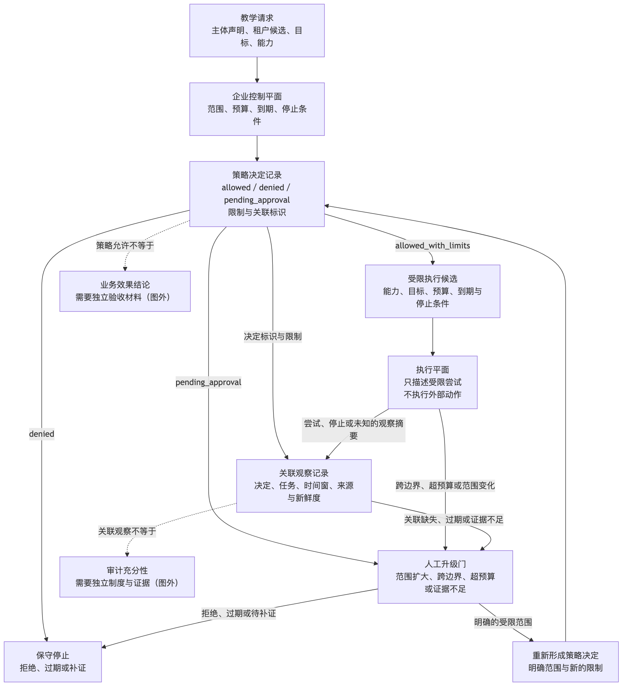
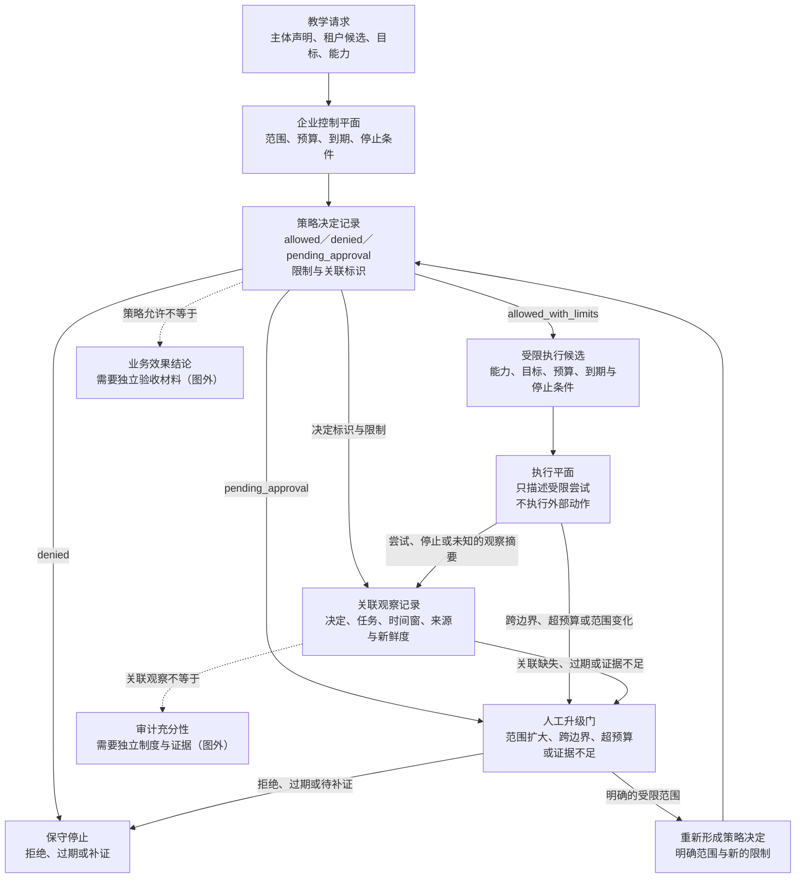

# 35. 企业级 Harness 架构

> 本章把跨团队 Agent 工作拆成可审查的控制责任、受限执行责任和观察责任；它不提供企业部署、合规或自动授权方案。

- [第 35 章 Research Brief](35-enterprise-harness-architecture.research.md)
- [第 35 章详细 Outline](35-enterprise-harness-architecture.outline.md)
- [第 35 章参考资料](35-enterprise-harness-architecture.references.md)
- [第 35 章事实核验](35-enterprise-harness-architecture.fact-check.md)

## 本章目标

读完本章后，读者能够：

- 区分企业控制平面（Enterprise Control Plane）与执行平面（Execution Plane），并说明策略允许、执行返回和业务效果为何不是同一结论。
- 为跨业务单元的请求写出租户、主体、目标、能力、预算、到期时间和人工升级条件，而不把网络位置或单一角色字段当作充分授权。
- 使用策略决定记录（Policy Decision Record）表达允许、拒绝和待批准的理由与限制，不把策略求值写成合规或结果证明。
- 使用关联观察记录（Correlated Observation Record）连接决定、执行尝试和人工处理，同时保留记录完整性与业务效果仍未知的边界。
- 为虚构知识助手从只读试点到有限工单更新的范围扩大设计重新取证和人工升级门（Human Escalation Gate）。

## 为什么企业规模首先改变责任边界

单个团队中的 Agent 常常只面对一个仓库、一组维护者和一条相对短的反馈链。当它开始服务多个业务单元时，难题不只是请求更多，而是同一句“帮我处理这件事”同时带来了主体、数据类别、目标范围、资源消耗、审批责任和争议还原的问题。若这些问题仍藏在某个执行器的提示词或代码分支中，后续很难说明谁作出了哪一种决定。

[NIST SP 800-207](https://csrc.nist.gov/pubs/sp/800/207/final) 在零信任架构语境中指出，不应依据网络位置或资产所有权给予隐式信任，并把主体和设备的认证、授权置于建立资源会话前的离散功能中。这个背景不要求 Harness 采用某个身份产品；它只提醒我们：`在企业网络内` 与 `可对某个目标执行某项能力` 是两个需要分别回答的问题。

本章因此不把“企业级”理解为更多 Agent、更多队列或更多产品。它把企业规模理解为更多必须可区分的责任面：谁界定输入范围，谁作出计划性限制，谁在限制内尝试工作，谁观察结果，谁在证据不足或风险上升时接手。第 34 章讨论团队 Skill 如何成为可治理资产；本章继续讨论这些资产一旦触及共享组织边界，应如何进入控制与执行的分责结构。

## 前置知识与本章边界

- **建议前置：** 第 12 章的环境与最小权限、第 14 章的人类参与、第 15 章的观察记录、第 26 章的协作与隔离、第 27 章的审查，以及第 34 章的团队 Skill 治理。
- **技术前提：** 能读懂结构化记录、状态表和最小的 JavaScript/JSON 示例；不要求熟悉 Kubernetes、OPA 或 OpenTelemetry。
- **本章负责：** 用虚构企业内部知识助手说明控制平面、执行平面、租户与数据边界、策略决定、资源限制、关联观察和人工升级如何共同限制一项计划性工作。
- **本章不负责：** 真实企业目录、身份提供方、Kubernetes 集群、OPA 或 Rego 部署、OpenTelemetry Collector、云账户、队列、工单系统、知识库、审计保留、法规解释、合规认证、账户、凭证、网络、外部 API 或真实审批。

### 三类结论必须分开

在后续讨论中，同一请求最多会经过多份记录。它们不能替对方背书：

| 状态 | 它只表示什么 | 它不能表示什么 |
| --- | --- | --- |
| `request_received` | 收到了一个待处理的教学请求。 | 主体、租户、目标或能力已经可信。 |
| `policy_allowed` | 一份教学策略记录允许在明确限制内继续。 | 已执行、已满足业务要求或已合规。 |
| `execution_observed` | 有一份关联到该任务的执行观察。 | 观察完整、数据无误或外部效果已经验收。 |
| `business_effect_verified` | 独立验收材料支持某个受限的业务效果结论。 | 所有风险、审计义务或后续影响已经消失。 |

这张表是本书的结论模型。它不是某个状态机、审计标准或产品 API。其用途是防止一份“允许”记录被改写成“已经完成”，也防止一次工具返回被改写成“已经合规”。

## 场景：虚构企业内部知识助手的三个阶段

一个虚构企业内部知识助手收到请求：汇总某个业务单元的已批准知识摘要，并提交给人工审阅。请求中只有教学用的主体声明、租户候选、数据类别、目标范围和期限；没有真实员工、客户、文件、工单、身份令牌或连接。

这个案例故意分成三个阶段：

| 阶段 | 可申请能力 | 额外约束 | 不可推出的结论 |
| --- | --- | --- | --- |
| 1：只读试点 | 读取已批准的知识摘要并提交人工。 | 明确租户、数据类别、目标、到期时间和观察要求。 | 没有证明知识库已被读取或摘要已经发送。 |
| 2：候选生成 | 生成工单草稿，仍由人工提交。 | 草稿与最终提交分离，写明审阅责任、预算和停止条件。 | 草稿不是工单，也不是外部系统中的变更。 |
| 3：有限更新 | 请求一个可回滚的工单状态更新。 | 重新取得明确批准，限定能力、回滚假设、观察和超限升级。 | 请求或批准不等于更新已经发生。 |

后面的设计都以这三个教学阶段为输入。它们不描述某个企业已经上线的流程，更不构成任何部署或审批建议。

## 核心概念

### 企业控制平面：让限制先于尝试出现

本书把企业控制平面定义为：在执行前汇总租户定义、主体声明、任务分类、目标资源、请求能力、资源预算、到期时间和升级条件的计划性责任面。它可以提出或限制后续工作，但不执行业务动作。

该定义受到 NIST 所述资源会话前离散认证和授权功能的启发，但字段本身是本书模型。不要从它推出某个身份流程、令牌格式、单点登录实现或认证结果。尤其不能把“有企业账号”填入某个字段后，就省略目标、能力和时间范围的检查。

控制平面的最小产物可以是下表中的计划性输入，而不是一个万能的“已授权”布尔值：

| 输入 | 谁需要说明 | 控制平面能给出的受限结论 | 不能推导 |
| --- | --- | --- | --- |
| 租户定义 | 业务或数据责任人。 | 该请求需要按哪一种隔离语义审查。 | 所有组织、数据或法律边界已经相同。 |
| 主体声明 | 请求发起方和身份治理责任人。 | 需要验证或补证的主体信息。 | 主体已经通过真实身份验证。 |
| 请求能力 | 任务设计者。 | 可以比较其是否超过当前阶段。 | 任意执行器可自行扩展能力。 |
| 目标边界 | 数据或业务责任人。 | 应限制在哪个教学范围中讨论。 | 目标中的真实数据可被访问。 |
| 预算与到期 | 任务责任人。 | 何时必须停止、重新审查或升级。 | 已经计量真实成本或保证不会超支。 |

当任一输入缺失或彼此冲突时，控制平面不应补猜。它只可以形成 `insufficient_context`、`denied` 或 `requires_approval` 一类的教学路由，并保留缺口原因。

### 执行平面：只接收已限制的工作

本书的执行平面接收任务引用、允许能力、资源上限、停止条件和观察要求。它的职责是尝试受限工作并返回可定位的观察，不是从任务文本、工具返回或上游身份声明中自行扩大权限。

这种分责并不意味着控制平面天然正确，也不意味着执行平面天然被隔离。它要求读者把“决定能否继续”和“在限制内尝试”写成两个可分别审查的工件。即使执行平面报告成功，也仍需独立观察和业务验收才能讨论效果。

| 责任面 | 可产生的记录 | 必须保留的限制 |
| --- | --- | --- |
| 控制平面 | 请求摘要、策略决定、能力上限、到期和升级原因。 | 不把计划性判断写成外部效果。 |
| 执行平面 | 任务引用、尝试状态、观察摘要和停止原因。 | 不从结果文本、数据或任务名称推导额外权限。 |
| 独立验收 | 验收范围、观测材料和结论限制。 | 不把一次观察扩展为审计或合规结论。 |

第 36 章将把这种控制权、状态和停止条件抽象为模式卡。本章只在企业共享边界的案例中说明，为什么这些责任不能被一个“执行成功”字段压扁。

### 策略决定记录：求值结果不是授权神谕

[Open Policy Agent 的哲学文档](https://www.openpolicyagent.org/docs/latest/philosophy/) 将策略描述为约束服务行为的规则，并说明策略可以与受其约束的服务解耦，服务可查询策略和数据以得到求值结果。本章只使用这一点说明“策略决定”可以和“执行器实现”分开；不假定使用 OPA、Rego、sidecar、远程加载或任何具体部署。

本书的策略决定记录至少保存以下教学字段：

| 字段 | 作用 | 不表示 |
| --- | --- | --- |
| 输入摘要 | 固定本次判断所见的主体、租户、目标和能力。 | 输入已由真实系统验证。 |
| 规则版本引用 | 使后续审查能定位判断依据。 | 规则正确、完整或仍然新鲜。 |
| 决定 | `allowed`、`denied` 或 `pending_approval`。 | 外部动作或业务效果已经发生。 |
| 限制 | 允许能力、目标范围、预算、到期和停止条件。 | 执行器可以忽略或扩展限制。 |
| 关联标识 | 将决定与后续教学观察连接。 | 已经拥有完整日志或审计链。 |
| 升级原因 | 说明为何不能自动继续。 | 人工会必然批准。 |

`allowed` 的语义应当克制：它只把明确限制传入执行平面。`denied` 表示停止并保留理由。`pending_approval` 表示需要有人在指定范围内决定，不能悄悄降级成 `allowed`。规则版本不明、输入范围冲突、数据新鲜度未知或决定缺少限制时，最小系统行为是记录未知项并升级，而不是制造一个模拟批准令牌。

### 租户、数据与能力：先定义隔离目标

[Kubernetes 的多租户文档](https://kubernetes.io/docs/concepts/security/multi-tenancy/) 在共享集群语境中讨论安全、公平性和 noisy-neighbor 挑战，并强调租户定义会随使用场景而变化。文档也讨论 RBAC、配额与网络策略。这里的可迁移结论很小：在讨论隔离之前，必须先明确“租户”在当前场景里指什么，以及要降低的是哪类风险。

因此，本书的租户与数据边界（Tenant and Data Boundary）不是一个 `tenant` 字段。它至少包含：谁被视为同一租户、哪些数据类别可见、哪些能力可申请、共享例外由谁批准、跨边界时何时升级。RBAC、命名空间、配额或网络策略都不是本章的实现前提，更不能被写成任意 Harness 的充分隔离证明。

下面的矩阵只展示教学检查项目：

| 数据类别 | 当前可申请能力 | 目标范围 | 共享例外 | 升级条件 |
| --- | --- | --- | --- | --- |
| 已批准知识摘要 | 只读摘要整理。 | 单一教学租户。 | 无。 | 租户或摘要批准状态不清。 |
| 工单草稿 | 生成候选文本。 | 指定人工审阅队列。 | 人工提交。 | 草稿被要求直接提交。 |
| 有限状态更新 | 请求可回滚更新。 | 明确的教学目标。 | 显式、未过期的批准。 | 跨租户、不可回滚、超预算或缺观察。 |

能力必须与目标、期限、预算、停止条件和观察要求一起出现。把任务拆小不能绕开边界；若租户语义未定义、数据分类冲突或共享例外没有责任人，正确出口仍是人工升级门。

### 预算、到期与停止条件：资源也是边界

共享环境中的公平性与资源竞争是 Kubernetes 多租户资料的受限背景，不是本章的成本模型。本书仅把预算视为计划性资源限制：一次请求必须说明可使用的资源类别、上限、到期、观察频率和达到上限后的停止或升级路径。这里不出现真实货币、token、账单、配额读取、价格或节省比例。

例如，一个教学计划可以包含 `budgetLimit`、`expiresAt`、`stopCondition` 与 `observationRequired`。这些字段只表示“在进入实现前，责任人应说明什么”；它们不能证明真实用量已被读取，也不能证明任务仍在预算内。单位、上限来源、到期依据或消耗观察不清时，系统应停止或升级，而不是把缺失数值写成零。

| 停止信号 | 执行平面应返回的受限结论 | 后续处理 |
| --- | --- | --- |
| 到期时间已过 | 当前计划不再可继续。 | 请求新的策略决定。 |
| 能力与目标不匹配 | 当前能力不能覆盖所请求范围。 | 拒绝自动扩大能力。 |
| 预算即将耗尽或无法观察 | 资源限制无法被可靠判断。 | 停止并请求责任人决定。 |
| 数据边界不清 | 不能说明允许处理的范围。 | 路由到人工升级。 |
| 要求不可逆动作 | 本章的低风险阶段不适用。 | 保持停止，另行设计批准与验证。 |

### 关联观察记录：连接事件，不替代审计

[OpenTelemetry 的 traces 文档](https://opentelemetry.io/docs/concepts/signals/traces/) 说明，trace 由具有关联关系的 span 表示；span context 包含 trace ID 和 span ID，上下文传播可以把不同位置产生的 span 关联并组装为 trace。本章借此说明跨边界的观察需要可关联标识，但不把 trace、日志或上下文传播等同于完整审计、数据保留、不可抵赖或已经采集的遥测。

本书的关联观察记录包含决定 ID、任务 ID、关联标识、时间窗、观察摘要、来源、状态、新鲜度和限制。它回答的是“哪几份材料可能属于同一次受限工作”，而不是“所有发生过的事都已经完整记录”。

要判断一组材料能否支持讨论同一任务，至少需要下列问题：

1. 这份观察能否回到一个具名的策略决定和任务引用？
2. 时间窗是否与该决定和尝试相容？
3. 观察的来源和新鲜度是否已声明？
4. 观察说明的是计划、尝试、停止还是独立验收？
5. 哪些空白仍让结论停在 `unlinked` 或 `insufficient_evidence`？

相同或相似的文本不是关联证据。关联缺失、时间窗重叠、来源不明或观察过期时，不应把若干片段拼成一个完整故事。关联记录帮助下一位审查者找回边界；它不代替安全、法务、平台或业务责任人的审计判断。

### 人工升级门：自动系统不能借证据不足扩权

本书把人工升级门定义为高风险、跨租户、超预算、不可回滚或证据不足时的保守出口。它接收触发条件、已有材料、未知项、请求范围、可批准上限、拒绝或过期处理和责任人；其输出只能是明确范围内的批准、拒绝或待补证。

审批本身不验证业务结果，也不消除原有缺口。一个有价值的升级门会让责任人清楚看到：请求想扩大什么、现有证据支持什么、哪些边界仍不清、若拒绝或过期应怎样停止。它不应成为“有人点过按钮，所以其余记录都不必看”的捷径。

## 工作流程：从请求到保守停止

下面的流程是本书对虚构案例的工作方法，不是可直接连接企业系统的实现说明：

1. **整理请求：** 写下主体声明、租户候选、数据类别、目标、能力、预算、到期和风险标签；缺项即标注，不补猜。
2. **形成控制输入：** 企业控制平面检查请求是否能进入策略判断，并为每个字段标出责任人与来源限制。
3. **写入策略决定记录：** 保存输入摘要、规则版本引用、决定、限制、关联标识和升级原因。`pending_approval` 不得进入自动路径。
4. **限制执行平面：** 只有明确能力、目标、停止条件和观察要求的任务引用才可成为执行候选；执行器不能自行添加数据、工具或权限。
5. **关联观察：** 将受限尝试、停止原因与人工处理关联回决定和任务。观察不足时维持不确定状态。
6. **验收或升级：** 只有独立验收材料才可讨论受限效果；跨边界、超预算、不可逆或证据不足的请求进入人工升级门。

流程的要点不是让每个请求穿过更多节点，而是每一个节点只得出自己负责的结论。若所有节点都把自己的输出称为“成功”，下一位维护者就无法追问失败究竟发生在范围、决定、执行、观察还是验收。

## 架构图：控制、执行与关联观察的受限责任流

下图回答：在虚构企业知识助手的请求中，控制决定、受限执行候选、关联观察与人工升级如何各自停在自己的结论范围内？可审查图源位于 [Mermaid 源](../../diagrams/mermaid/chapter-35-enterprise-control-observation-flow.mmd)；Diagram Review 已导出并查看 [SVG](../../diagrams/exported/chapter-35-enterprise-control-observation-flow.svg) 与 [PNG](../../diagrams/exported/chapter-35-enterprise-control-observation-flow.png)。





读图时，企业控制平面（Enterprise Control Plane）只整理范围与停止条件，策略决定记录（Policy Decision Record）只写出受限决定；`allowed_with_limits` 只能产生受限执行候选，不能产生业务效果结论。执行平面（Execution Plane）和策略决定记录都可向关联观察记录（Correlated Observation Record）提供可定位的教学材料，但关联不倒流为权限，也不成为审计充分性。人工升级门（Human Escalation Gate）只处理范围扩大、冲突或证据缺口；即使形成新的受限范围，也必须回到新的策略决定，而不是直接进入外部执行。

## 最小示例：纯内存企业架构计划

Example Implementation 已将 `assessEnterpriseHarnessPlan(plan)` 实现为只检查注入对象的纯内存教学评估器；完整接口、红绿记录与测试矩阵见[第 35 章示例计划](35-enterprise-harness-architecture.example-plan.md)。下面仍只是用于讨论 `pending_approval` 字段边界的虚构输入，而不是企业配置或实际运行的演示对象。

```json
{
  "tenantDefinition": "single_training_tenant",
  "subjectClaim": "declared_requester",
  "requestedCapability": "draft_ticket_only",
  "targetBoundary": "approved_summary_scope",
  "policyDecisionRecord": {
    "decision": "pending_approval",
    "ruleVersion": "training-policy-v1",
    "limits": ["no_submit", "expires_at_required"]
  },
  "budgetLimit": "declared_limit",
  "expiresAt": "declared_expiry",
  "stopCondition": "missing_or_unlinked_observation",
  "observationRequirement": "correlated_record_required",
  "escalationGate": "human_review_required"
}
```

评估器只检查注入对象是否具备租户定义、目标边界、能力限制、策略记录、预算、到期、停止条件、观察关联和升级条件。它不得调用身份服务、策略引擎、Kubernetes、OpenTelemetry、队列、工单系统、云资源、文件、网络、账户、凭证或外部 API，也不得创建真实审批。

已运行的最小测试覆盖完整只读候选、控制平面或租户边界缺失、策略限制缺失、待批准策略、外部执行、写入能力、预算过期和关联不一致。2026-07-16 实际运行 `node --test examples/agent/enterprise-harness-admission-assessment.test.mjs` 得到 9 项通过、0 项失败；随后运行同名 `.mjs` 演示，输出 `ready`、`enterprise_read_only_candidate_ready`、`continue_read_only_candidate` 与 `executionPerformed: false`。这些结果只证明教学对象分类，不证明企业系统、策略、身份、预算、追踪、人工审批或外部动作已执行。

## 完整工程案例：能力扩大必须重新取证

虚构知识助手的价值不在于一步跳到“自动更新工单”，而在于每次扩大能力前重新暴露问题。下表将三个阶段的控制面、执行面和观察要求放在一起：

| 阶段 | 控制平面必须重述 | 执行平面最多可尝试 | 必须出现的观察 | 人工责任 |
| --- | --- | --- | --- | --- |
| 只读试点 | 租户、数据类别、只读目标、到期。 | 整理已批准摘要的候选材料。 | 候选材料与策略决定的关联。 | 审阅候选摘要。 |
| 候选生成 | 草稿范围、审阅责任、预算、不可提交限制。 | 生成工单草稿。 | 草稿仍未提交的状态与限制。 | 决定是否提交或退回。 |
| 有限更新 | 最小能力、可回滚假设、独立批准、超限出口。 | 在批准范围内请求状态更新。 | 尝试、停止或结果材料的受限关联。 | 判断是否允许、是否接受结果、是否继续扩大范围。 |

这一案例没有真实工单、账户、日志、追踪、成本数据或审批记录。因此，“关联观察存在”只能说明教学结构中的材料可被连接；它不能说明工单已创建、更新已回滚、成本已受控或组织已满足审计要求。

## 逐步增强：何时离开纯内存模型

本章的最小模型刻意不接触外部系统。真正的集成不是把这些字段复制到生产配置，而是每次只增加一种新能力，并为它补齐相应控制：

| 新需求 | 需要新增的控制 | 触发条件 | 本章不实现的原因 |
| --- | --- | --- | --- |
| 连接真实身份来源 | 身份协议、凭证存储、验证、撤销、审计和安全审查。 | 主体声明将用于真实资源会话。 | 本章不连接身份提供方。 |
| 在共享集群执行工作 | 具体隔离设计、资源配置、网络与运行时安全验证。 | 需要主张实际隔离或资源公平性。 | 本章不部署 Kubernetes 或工作负载。 |
| 让策略影响真实工具 | 规则测试、数据新鲜度、变更审批、失败恢复和权限验证。 | 策略决定将触发外部动作。 | 本章不部署策略引擎或调用工具。 |
| 收集真实遥测与审计材料 | 数据分类、保留、完整性、访问控制和独立审查。 | 需要讨论真实记录或合规。 | 关联观察记录不是审计系统。 |

若无法写清新增控制、所有者和停止出口，就不应以“企业需要规模化”为理由直接连接外部系统。较小、可审查的范围通常比一个无法说明授权边界的自动化路径更有价值。

## 测试与验证

本章已完成 First Draft、Technical Review、Example Implementation、Diagram Review、Fact Check、Language Editing 与 Final Review。下表区分已重读的一手资料、已运行的纯内存示例和明确未进行的企业集成，避免把设计文档或教学测试写成外部系统证据：

| 层级 | 验证对象 | 方法 | 成功标准 | 实际状态 |
| --- | --- | --- | --- | --- |
| 文档 | 正文、来源映射与章节结构。 | 共享集成运行 `npm run validate`。 | Markdown、链接和章节状态通过。 | 已在 Final Review 前运行：检查 499 个 Markdown 文件、0 个 Markdown lint 错误；当时章节状态为 32 章完成、6 章进行中、9 章未开始。本轮不重复全仓校验。 |
| 内容审查 | 来源事实、本书模型与虚构案例的分层。 | Fact Check 重读 REF-110 至 REF-113。 | 不把零信任、多租户、策略解耦或 trace 关联外推为部署、审计或合规。 | 已执行：2026-07-16 完成四项官方资料重读、正文限定语核对与事实核验记录。 |
| 单元 | 纯内存计划评估器。 | 运行 `node --test examples/agent/enterprise-harness-admission-assessment.test.mjs`。 | 缺关键边界时停止；请求外部执行、写入、过期预算或关联不一致时不继续。 | 已执行：9 项通过、0 项失败。 |
| 图示 | 控制与执行的责任断点。 | Diagram Review 创建 Mermaid 源、导出图并检查正文一致性。 | 图保留“策略允许不等于外部效果”和“关联不等于审计”的断点。 | 已执行：图源、SVG、PNG 与正文图块已验收；详见 Diagram Review。 |
| 端到端 | 真实企业集成。 | 不在本章运行。 | 不适用。 | 明确不执行。 |

## 工程实践

- **让限制随任务而不是随文本漂移。** 能力、目标、预算、到期和停止条件应作为可审查字段传递；执行器不能从自然语言说明中默许增加它们。
- **把“未知”保留在记录中。** 缺身份验证、策略数据新鲜度、关联观察或验收材料时，写出未知项并升级，比用默认成功值掩盖缺口更安全。
- **将关联与结论分开。** 关联标识帮助定位材料；每份材料仍应写清来源、时间窗、新鲜度和它只能支持的结论。
- **每次扩大能力都重新审查。** 只读、草稿和有限更新需要不同的能力、证据、批准和停止条件，旧批准不应自动覆盖新范围。

## 最佳实践

- 为每一项策略决定记录一个具名的限制集合，而不是只存 `true` 或 `false`。这样审查者能看到允许的边界，也能发现缺失的边界。
- 为每个跨边界请求规定保守出口。`requires_approval` 与 `insufficient_evidence` 不是异常文本，而是防止自动扩权的正常状态。
- 让最终效果由独立验收承担。控制决定、执行观察和业务验收由不同责任面提供时，错误归因和补证路径更清楚。
- 在引入真实产品前，先写出要验证的产品专属事实。Kubernetes、OPA 与 OpenTelemetry 的文档都提供受限背景，不能替代该环境中的配置、权限和运行验证。

## 常见错误

| 错误 | 表现 | 根因 | 修复方向 |
| --- | --- | --- | --- |
| 把网络位置写成充分信任 | “在企业网络内”就跳过目标和能力检查。 | 把零信任背景误当成某种实现反证。 | 为资源会话保留主体、目标、能力和限制的独立记录。 |
| 把策略允许写成业务完成 | `allowed` 后直接报告工单已更新。 | 混淆计划性决定、执行尝试和外部效果。 | 分开策略决定、执行观察和独立验收。 |
| 把 tenant 字段写成隔离证明 | 有租户字段就允许处理任意数据。 | 未定义租户语义、数据类别和共享例外。 | 用租户与数据边界矩阵明确允许范围和升级条件。 |
| 把关联标识写成审计 | 有关联 ID 就声称记录完整和合规。 | 混淆可关联性、完整性、保留和取证。 | 写明来源、时间窗、缺口与需要独立审查的事项。 |
| 将低风险批准复用到高风险动作 | 只读试点批准被当作写入许可。 | 忽略能力、不可逆性和责任的变化。 | 每次扩大范围重新形成策略决定和人工升级。 |

## 安全与边界

- **权限边界：** 本章的主体、能力、批准和限制均为教学字段，不能充当真实认证、授权、凭证或资源会话。
- **数据边界：** 不记录真实租户标识、员工信息、客户数据、角色、知识库内容、策略内容、工单、日志或追踪数据。
- **资源边界：** 预算是计划性限制，不读取账单、token、配额或用量，不作价格、成本或节省结论。
- **人工审批点：** 跨租户、超预算、不可回滚、目标不清、关联不足或需要外部动作时，自动路径必须停止并进入人工升级。
- **不适用范围：** 本章不证明 Kubernetes 隔离、OPA 策略正确性、OpenTelemetry 采集、审计充分性、法律合规、外部系统效果或任何企业集成已运行。

## 章节总结

企业级 Harness 的可扩展性不来自把集群、策略或追踪工具拼成一个“自动合规”的黑盒，而来自责任面可以被分别提问。企业控制平面限制计划，执行平面限制动作，策略决定记录限制允许结论，关联观察记录限制可连接的材料，人工升级门限制自动扩权。

这些边界使团队能从只读试点开始，在每一次能力扩大前重新说明租户、数据、目标、预算、到期、观察和责任。下一章会把控制权、状态、证据、停止与副作用的关系抽象为可比较的 Harness Design Patterns；抽象模式同样不能倒过来证明本章的虚构架构已经部署。

## 练习

1. 为一个虚构跨部门知识助手写出租户与数据边界的最小字段，并指出哪一项缺失时必须停止。
2. 为只读摘要阶段写一份 Policy Decision Record，分别列出输入摘要、限制、到期和一条 `pending_approval` 的升级原因。
3. 给出两种必须进入 Human Escalation Gate 的情况，并说明为什么“之前阶段稳定”不足以自动批准。
4. 设计一条 Correlated Observation Record，说明它能够关联哪些材料，以及为什么它仍不能替代审计或业务验收。

## 延伸阅读

- [NIST SP 800-207: Zero Trust Architecture](https://csrc.nist.gov/pubs/sp/800/207/final)：理解不依赖网络位置给予隐式信任的受限背景。
- [Kubernetes Documentation: Multi-tenancy](https://kubernetes.io/docs/concepts/security/multi-tenancy/)：理解共享集群语境中的多租户定义、安全、公平性与资源竞争问题。
- [Open Policy Agent Documentation: Philosophy](https://www.openpolicyagent.org/docs/latest/philosophy/)：理解策略与受约束服务可以解耦的受限背景。
- [OpenTelemetry Documentation: Traces](https://opentelemetry.io/docs/concepts/signals/traces/)：理解 trace、span context 与上下文传播的关联语境。

## 参考资料

- [REF-110 — NIST SP 800-207: Zero Trust Architecture](https://csrc.nist.gov/pubs/sp/800/207/final)：支持资源会话前不按位置或资产所有权给予隐式信任、认证与授权为离散功能的限定陈述。
- [REF-111 — Kubernetes Documentation: Multi-tenancy](https://kubernetes.io/docs/concepts/security/multi-tenancy/)：支持共享集群多租户中的安全、公平性、资源竞争与场景相关租户定义的限定陈述。
- [REF-112 — Open Policy Agent Documentation: Philosophy](https://www.openpolicyagent.org/docs/latest/philosophy/)：支持策略与受约束服务可解耦、服务查询策略和数据以求值的限定陈述。
- [REF-113 — OpenTelemetry Documentation: Traces](https://opentelemetry.io/docs/concepts/signals/traces/)：支持关联 span、trace ID、span ID 和上下文传播的限定陈述。

逐项可归因陈述、本书模型与实际运行范围见[第 35 章事实核验](35-enterprise-harness-architecture.fact-check.md)。

## 章节完成检查表

- [x] Front matter、目标、前置知识和章节依赖完整。
- [x] 内容为原创表达，来源观点与本书扩展已区分。
- [x] 每项可归因事实有来源，未将动态产品行为写成部署结论。
- [x] Mermaid 图、源文件、替代说明和导出图已由 Diagram Review 正式验收。
- [x] 示例有环境、验证方式、结果状态和安全边界。
- [x] Technical Review、Diagram Review 与 Fact Check 已记录。
- [x] Language Editing 已完成并记录。
- [x] 已运行 Final Review 前的共享 `npm run validate` 基线；本轮不重复全仓校验。
- [x] `.ai/progress.md`、`CURRENT_STATE.md`、`NEXT_TASK.md` 与交接已更新。
- [x] Final Review 已记录；本轮重跑专用测试、演示、图源一致性检查并查看现有 PNG。
