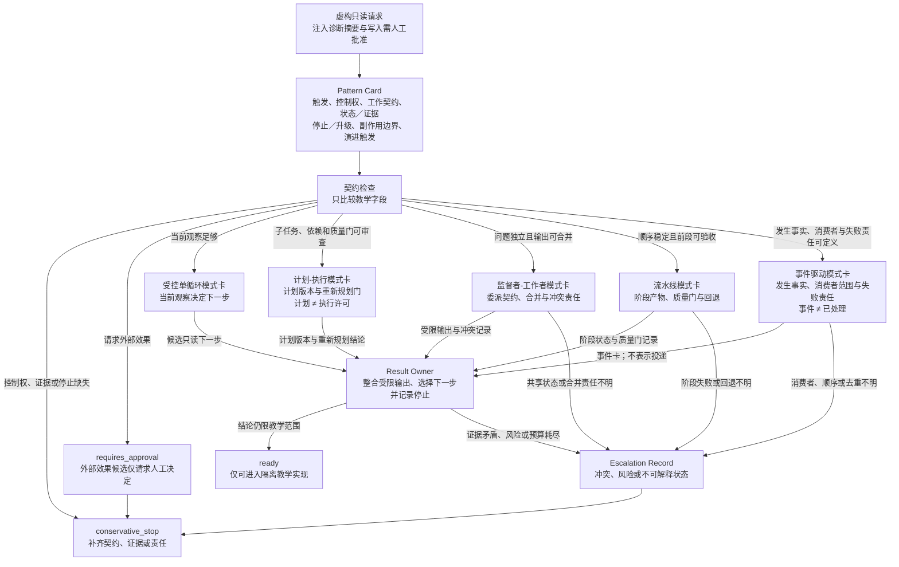

# 36. Harness Design Patterns

> 本章用模式卡（Pattern Card）比较控制流的责任边界：先确定谁拥有结论、什么观察能改变下一步、何时停止，再决定是否需要计划、委派、流水线或事件。

## 本章目标

- [ ] 将控制流选择拆成触发、控制权、工作契约、状态与证据、停止／升级和副作用责任，而不是按角色数量命名架构。
- [ ] 在受控单循环（Controlled Single Loop）、计划—执行（Plan–Execute）、监督者—工作者（Supervisor–Worker）、流水线（Pipeline）和事件驱动（Event-Driven）之间作出有限选择。
- [ ] 用模式卡记录结构为何适用、何时不适用、何时升级，以及它不能证明哪些运行时性质。
- [ ] 识别把计划当作执行许可、用并行掩盖共享状态冲突、让事件失去失败所有者和无退出条件叠加模式等反模式。
- [ ] 为一个虚构文件修复请求写出从简单结构演进到更强控制结构所需的证据、停止条件和人工审批点。

## 为什么要学

“多 Agent”是角色数量的描述，不是控制设计；“事件驱动”是触发方式的描述，也不是可靠处理的证明。若团队先选一个听起来成熟的架构，再补控制权、状态、失败和审批，最常见的结果是：多个角色都能给出结论，却没有人对最终结论负责；事件被发出，却没有消费者拥有失败；计划被生成后，被误当作外部动作的许可。

本章只讨论如何选择和审查**控制流模式**。它不实现 Agent、模型、队列、事件总线、调度器、工作流引擎、并发工作者、外部工具、Git、浏览器、CI、文件、网络、账户、凭证或外部系统，也不比较吞吐、延迟、成本、模型能力、可靠投递、恰好一次或安全效果。模式卡完整，只说明一个教学提案的边界可被检查；它不说明真实系统已经存在或可以运行。

## 前置知识

- 前置章节：第 9 章的任务拆解、第 10 章的工作流与状态管理、第 12 章的环境和权限、第 14、15 章的审批与观察，以及第 26、28 章的协作与最小 Harness。
- 技术前提：能阅读状态表、输入输出契约和简单的结构化对象。
- 不要求：真实仓库、缺陷、模型账号、消息队列、工作流产品、浏览器、外部工具、网络、CI、账户或凭证。

## 场景引入：一个只读的文件修复请求

**场景：** 本章使用一个虚构请求：一份只读诊断摘要指出“某项校验没有观察到预期状态”，并限制分析只能生成候选结论；任何真实文件写入都必须先经过人工批准。输入不对应真实仓库、文件、错误、测试、Git 记录或运行环境。

**成功标准：** 读者可以为同一请求说明：何时由一个结果所有者保留受控单循环，何时才能把任务分成可审查计划，何时可以委派或串成阶段，何时才有足够信息讨论事件；每种选择都能写出停止与审批出口。

**边界：** 场景中的“诊断”“工作者”“阶段”和“事件”都是注入的教学对象。它们不会读取文件、调用模型、分派任务、发送消息、创建工作流、运行测试或产生修复结果。

## 来源边界：产品与规范只提供局部背景

来源材料帮助我们避免把词汇当作事实来源，却不能给出本章的模式卡。Anthropic 的工程文章在其语境中区分预定义代码路径的工作流（workflow），以及由模型动态决定过程和工具使用的 Agent，并列举了若干组合结构与复杂度取舍 [REF-029]。这为“先从简单结构开始”提供受限工程背景，不是跨产品的分类标准或选型算法。

OpenAI Agents SDK 的 Python 文档给出代码编排、manager、handoff、串联、评估循环和独立任务并行的产品特定例子 [REF-030]。AWS Step Functions 文档则在该产品语境中描述事件驱动步骤的状态机及其流控制状态 [REF-031]。二者不能证明其他 SDK 的接口相同，也不能证明任何委派、并行、恢复或状态机在本章场景中已经运行。

CloudEvents 规范把 event 描述为一次发生及其上下文的数据记录，并区分 producer、consumer 与 intermediary [REF-114]。Node.js 的 `EventEmitter` 文档只说明该运行时的命名事件和按注册顺序同步调用监听器 [REF-115]。因此，本章把事件语义视为必须由具体运行时和实际验证补足的缺口；不会把事件描述格式或一个运行时的监听器行为外推成投递、顺序、重试、去重、授权或安全保证。

下文标注为“本书工程模型”的模式卡、选择顺序、停止规则和教学状态均是原创的比较工具；它们不是上述任何资料的 schema、API 或部署说明。

## 核心概念

### 先选择控制责任，而不是先堆叠角色

面对一个任务，最先要回答的不是“需要几个 Agent”，而是“谁拥有最终结论”。本书工程模型把**结果所有者（Result Owner）**定义为：对下一步选择、结论范围、冲突处理和升级出口负责的角色或明确的人类节点。它可以是一个受控循环中的单一决策点，也可以是监督者；但它不能只是一个汇总标签。

控制流还需要区分五种经常被混淆的状态标签：`proposal_received` 表示收到一个提案，`pattern_selected` 表示教学模式已被选择，`work_observed` 表示有了某项受限观察，`external_effect_requested` 表示有人请求外部动作，`external_effect_verified` 才可能讨论已经观察到的外部效果。前一项永远不能自动证明后一项。尤其是 `pattern_selected` 不等于计划开始执行，`external_effect_requested` 更不等于修复发生。

当输入缺少结果所有者、停止条件或副作用边界时，本书模型返回 `insufficient_contract`。这比基于“任务很复杂”直接增加角色更诚实：缺失的不是执行能力，而是让执行可审查的条件。

### 模式卡（Pattern Card）：把选型理由写成可检查输入

模式卡是本书工程模型中的最小选择工件。它不执行控制流，也不授予能力；它只要求提出者先把以下字段写清楚。

| 字段 | 要回答的问题 | 字段存在时仍不能主张什么 |
| --- | --- | --- |
| `trigger` | 哪个受限输入、观察或发生事实允许进入比较？ | 外部事件已经投递或被消费。 |
| `controlOwner` | 谁可选择下一步，谁拥有最终结论？ | 该角色已获执行或审批权。 |
| `workContract` | 每个步骤或工作者接收什么、返回什么、禁止什么？ | 子任务真的独立、输出一定正确。 |
| `stateAndEvidence` | 什么是任务状态，什么材料可以支持受限结论？ | 状态文本本身等于事实或完成证明。 |
| `stopAndEscalation` | 预算、矛盾、风险或缺证时到哪里停止或升级？ | 升级者一定会批准或处理。 |
| `sideEffectBoundary` | 哪些外部效果不在模式内，谁可提出或批准？ | 任何外部动作已被授权或执行。 |
| `evolutionTrigger` | 什么可观察缺口证明需要更复杂的结构？ | 更复杂的模式天然更成熟。 |

例如，一张“只读失败分析”卡可以声明：触发是注入的诊断摘要，结果所有者是教学场景中的分析负责人，输出只能是候选结论，任何真实写入都要停在人工批准前。该卡即使字段齐全，也只能得出“可在隔离示例中实现”的教学状态；没有真实环境观察时，它不能把候选结论写成已修复。

### 受控单循环（Controlled Single Loop）：观察决定下一步

本书把受控单循环定义为：一名结果所有者读取受限观察，在可见的尝试预算内选择下一步，并为停止保留原因。它适合下一步主要由当前观察决定、子任务还不能稳定枚举、没有未声明并行或外部触发的任务。

在本章的虚构请求中，该循环只决定“需要补充哪一项诊断证据”。它不会访问仓库、重试测试或修改文件。若当前观察无法说明应补什么，或者连续若干轮只是在重述同一段历史，正确结果不是增加一个万能工作者，而是记录当前卡缺少何种状态或证据。

来源指出工作流与 Agent 可以有不同的控制方式，并提醒复杂度需要结合效果判断 [REF-029]。本书据此保留一个更窄的工程判断：除非能指出单循环缺少的可观察条件，否则优先保留一个可定位的结果所有者。这不是关于成本、延迟或可靠性的结论。

### 计划—执行（Plan–Execute）：计划不是执行许可

当子任务、依赖、验收门和不可触及范围能够在开始前写成可审查工件时，计划—执行模式才有意义。本书将它拆成三个不同对象：计划版本、执行状态和重新规划门。计划版本说明将来可以检查什么；执行状态说明当前停在哪里；重新规划门说明输入变化或验收失败时必须回到哪一项决策。

同一虚构请求中的计划可以列出“检查诊断范围”“检查复现契约”“记录候选假设”三个只读步骤，并为每一步写入输入、预期输出和质量门。它没有读取任何文件，也没有提供写入许可。如果提案把“生成修复方案”直接接到“修改文件”，则 `sideEffectBoundary` 为空，应拒绝该卡而不是把它称为自动化。

计划—执行模式不适用于环境快速变化、计划不能解释下一步，或提出者无法给出当前观察与重新规划门的场景。此时继续执行旧计划只会把过期文字伪装成控制。应记录 `evolution_triggered`，返回模式选择，而不是静默扩大任务范围。

### 监督者—工作者（Supervisor–Worker）：委派不转移最终责任

监督者—工作者模式适用于：存在一个结果所有者；不同分析工作有明确专长、输入和输出；输出可被合并；冲突和失败有明确处理者。本书的监督者拥有最终结论、任务归并、冲突处理和升级责任。它不是某个 SDK 的 manager，也不是自动授权角色。

OpenAI Agents SDK 文档在其 Python SDK 语境中讨论 manager、handoff、代码编排和独立任务并行 [REF-030]。本章只借此提醒读者：分派结构必须写出谁调用谁、谁接回结果和谁承担结论；不会从该文档推断 handoff 安全、并行隔离或任何真实运行。

一份本书工作契约至少应说明专长、输入范围、输出形状、状态所有权、禁止副作用、停止条件和冲突反馈。虚构工作者可以分别审查“复现契约是否完整”和“候选修复是否越界”，但两者只能把结构化教学输出交给监督者。若两个工作者要写同一外部状态、预算不可见、输出无法关联，或任何工作者请求真实执行，监督者必须停止分派并升级；添加一个名为“聚合器”的角色并不能弥补责任空洞。

### 流水线（Pipeline）：稳定顺序需要逐段质量门

流水线适用于顺序稳定、前一阶段产物可被下一阶段检查和消费的任务。本书的流水线规定：每一阶段只消费已经通过前一质量门的具名产物，并返回可审查状态、证据指针和下一阶段候选。阶段顺序稳定不等于阶段已经运行，也不等于结论正确。

AWS Step Functions 在其产品语境中描述事件驱动步骤的状态机，并列举 Choice、Wait、Map 和 Parallel 等流控制状态 [REF-031]。本章不借用这些字段设计模式卡，也不把产品的执行、错误或恢复语义当作本书流水线的保证。

虚构请求可排列为“症状整理 → 复现契约检查 → 假设记录 → 候选修复审查 → 人工批准请求”。其中最后一项只能生成请求。阶段表必须保留输入、输出、质量门、失败分支、回退状态和不能据此主张的结论：例如“假设可检查”绝不等于“根因已证实”。若阶段跳过验收、失败后丢失关联、回退目标不明或试图产生外部效果，流水线应进入 `conservative_stop`，而不是重试所有阶段。

### 事件驱动（Event-Driven）：事件描述不等于可靠处理

事件驱动模式只在发生事实、消费者范围和失败责任均可定义时才值得讨论。CloudEvents 规范提供 event、producer、consumer 与 intermediary 的受限背景 [REF-114]；Node.js `EventEmitter` 提供某个运行时的命名事件和同步监听器语义 [REF-115]。这些材料共同说明的不是“事件可靠”，而是事件术语脱离具体运行时就不足以解释系统行为。

本书事件卡至少包含事件 ID、来源、时间窗、主题、消费者范围、去重依据、处理状态、失败记录和升级责任。虚构的 `analysis_ready` 只能表示一份教学分析摘要可供后续审查；它不能表示队列存在、消息已投递、消费者已领取、工作者已完成或修复已开始。

若事件没有消费者所有者、重复处理会影响结论却没有保守出口、顺序影响结论却未定义、观察无法关联，或消费者要求外部动作，模式卡应进入 `requires_human_review`。无法写出这些条件时，保留同步路径或停止，比假设一个不存在的事件总线更可审查。

### 组合与演进：每加一层，都要写出新增责任

模式可以组合，但组合不能传递隐式许可。计划—执行可以位于监督者—工作者结构中的一份工作契约内；流水线的某一阶段也可以使用受控单循环。无论层数如何，每一层都必须单独声明控制权、状态所有权、预算、停止／升级和副作用边界。

本书采用以下选择顺序：先问一个结果所有者能否根据当前观察决定下一步；再问子任务是否能预先枚举、是否真正独立并可合并；最后才问外部触发、跨执行状态或副作用是否需要事件和更具体的运行时契约。这个顺序是教学上的风险控制，不是来源宣称的唯一算法。

| 观察到的缺口 | 可以考虑的新增结构 | 必须新增的责任 | 没有证据时的保守选择 |
| --- | --- | --- | --- |
| 单一负责人反复丢失稳定子任务。 | 计划—执行。 | 计划版本、依赖、质量门与重新规划门。 | 保留受控单循环，并补观察。 |
| 两个分析问题输入分离、输出可合并。 | 监督者—工作者。 | 委派契约、最终结论、合并、冲突、预算。 | 不并行；由一个负责人顺序处理。 |
| 阶段顺序固定，前一产物能验收。 | 流水线。 | 阶段输入输出、质量门、失败分支与回退状态。 | 保留显式清单，不伪造流程运行。 |
| 有可定义的发生事实和消费者范围。 | 事件驱动。 | 事件契约、消费者责任、去重、失败与升级。 | 保留同步边界或停止。 |
| 需要真实文件修改。 | 独立的环境与审批设计。 | 最小权限、批准、回读、回归验证和恢复。 | 停在候选请求；本章不执行。 |

来源并不提供这些升级阈值。它们是为了让“复杂度值得吗”变成可反驳问题的本书模型。若提出者不能为某一层写出新增责任和回退条件，就应删除该层或退回更简单的可观察结构。

### Pi 借鉴矩阵：先吸收约束，再选择机制

Pi 的价值不在于提供一套应当整包复制的“标准答案”，而在于把若干 Harness 选择做得足够小、足够白盒，因而可以逐项审查。项目 README、作者构建札记和官方文档共同展示了极小默认工具面、可见提示词、结构化会话与压缩、进程内扩展，以及有意不内置部分复杂能力的设计 [REF-148](https://github.com/earendil-works/pi) [REF-149](https://mariozechner.at/posts/2025-11-30-pi-coding-agent/) [REF-152](https://github.com/earendil-works/pi/tree/main/packages/coding-agent/docs)。另两篇作者观察补充了 CLI 加文档的渐进披露路径，以及“最小内核加可持久扩展”的使用方式 [REF-150](https://mariozechner.at/posts/2025-11-02-what-if-you-dont-need-mcp/) [REF-151](https://lucumr.pocoo.org/2026/1/31/pi/)。

把这些材料映射回本书，可得到下面这张采用矩阵。表中的“直接借鉴”是本书的工程建议，不表示已经移植 pi 的代码；“需加的护栏”和“不应照搬”则是选择模式时必须保留的责任断点。

| Pi 暴露的设计选择 | 可直接借鉴 | 需加的护栏 | 不应照搬 | 本书落点 |
| --- | --- | --- | --- | --- |
| 极小系统提示词与默认工具面 | 给提示词和工具 schema 设置可测量预算；每项常驻内容都要证明价值。 | 用任务回归集比较删减前后的成功率、误用率与恢复成本。 | 把“更短”当作目标，或假设四个工具适合所有任务。 | [第 5 章](../part-02-components/05-instructions-and-prompt.md) |
| 工具结果区分模型文本与 UI 结构化细节 | 从同一原始结果生成模型观察投影与人类证据投影。 | 保留共同关联 ID、原始证据指针和一致性检查。 | 维护两套互不关联的事实源。 | [第 11 章](../part-02-components/11-tool-use-and-tool-protocols.md) |
| 会话树与结构化 compaction | 在轮次边界压缩，并保留目标、约束、进度、决定、下一步和文件清单。 | 为摘要设置丢失检查、恢复入口和人工复核点。 | 把摘要写入当作事实已保存，或默认压缩不会损失关键条件。 | [第 10 章：会话树](../part-02-components/10-workflow-and-state-management.md)、[第 19 章：compaction](../part-03-intelligence-loop/19-context-compaction-and-long-running-tasks.md) |
| 最小内核加进程内扩展 | 将非通用能力移出核心，通过显式事件和注册契约按需加载。 | 代理生成的扩展也要经过代码审查、权限检查、测试和可撤销加载。 | 因为扩展可热重载，就允许它绕过审批、审计或信任边界。 | [第 23 章](../part-04-engineering-practice/23-skills-hooks-and-automation-workflows.md) |
| CLI 加文档的渐进披露 | 对低频、已有成熟 CLI 的能力，先暴露简短入口，需要时再读帮助和专门文档。 | 记录版本、退出码、结构化输出约定、权限与可重试边界。 | 把作者特定环境中的 token 对比外推为“MCP 总是更差”。 | [第 24 章](../part-04-engineering-practice/24-mcp-and-external-tool-integration.md) |
| 先用独立会话与工件隔离复杂任务 | 在引入子代理前，先尝试可检查的会话分支、独立上下文和显式交接工件。 | 定义 Task Contract、集成所有者、冲突处理与 Integration Gate。 | 把对内置子代理的怀疑升级为禁止并行或委派的普遍规则。 | [第 26 章](../part-04-engineering-practice/26-multi-agent-collaboration-and-task-isolation.md) |
| 统一模型层显式吸收供应商差异 | 将线协议、上下文转换、中止、部分结果和用量计量分别建模。 | 能力矩阵标记未知与 best-effort，并对每个 provider 做契约测试。 | 把“统一 API”宣传成供应商可无差异替换。 | [第 40 章](40-cost-latency-and-token-management.md) |
| 把提示词与工具描述视为行为接口 | 对 instruction、tool schema 和模型兼容性生成摘要、差异与回滚入口。 | 版本变更必须配套回归评测和实际行为观察。 | 只靠语义版本号推断兼容，或把作者评测结果当成本项目结果。 | [第 42 章](42-harness-versioning-rollback-and-ab-testing.md) |

采用顺序也应保持最小：先选一个当前可量化的成本或失败，例如常驻工具 schema 占用、压缩后约束丢失或扩展不可撤销；再只引入一项对应机制；最后用本书的证据链验证它是否改善目标，同时没有越过权限、审计和恢复边界。无法写出基线、回退条件和结果所有者时，Pi 的设计只能作为观察样本，不能进入本章的 `ready`。

## 架构图：模式选择如何保留责任断点

下图回答：同一虚构只读请求怎样先经过模式卡的契约检查，再在受控单循环、计划—执行、监督者—工作者、流水线和事件驱动之间比较受限选择，同时把缺口保留在停止或人工复核出口？可编辑源为 [Mermaid 源](../../diagrams/mermaid/chapter-36-control-flow-pattern-selection.mmd)；Diagram Review 已导出并查看 [SVG](../../diagrams/exported/chapter-36-control-flow-pattern-selection.svg) 与 [PNG](../../diagrams/exported/chapter-36-control-flow-pattern-selection.png)。图只表达本书的控制流选择模型，不表示真实 Agent、模型、工作者、队列、事件、调度、并发、工具、Git、浏览器、CI、网络或外部系统已存在、运行或产生效果。

读图时先看 Pattern Card 与契约检查，而不是先挑一个模式名称。五张卡只描述何种教学条件可被比较：它们的输出都必须先回到结果所有者（Result Owner），由其整合受限结论并保留停止原因。`ready` 只表示可进入隔离教学实现；它不能越过“观察不等于外部效果”的断点。缺少控制权、状态／证据或停止条件时直接进入 `conservative_stop`；外部效果候选只得到 `requires_approval`，并不表示人工已经批准。

替代说明：一张自上而下的模式选择图。虚构只读请求先进入模式卡和契约检查，再分支到五张模式卡；所有可比较的模式输出都交给结果所有者。契约缺口进入保守停止，外部效果候选进入仅请求人工决定的 `requires_approval`；事件消费者、共享状态合并或流水线回退责任不清时进入升级记录，再保守停止。结果所有者只能给出“可进入隔离教学实现”的 `ready`，不代表任何外部效果。

## 工作流程：用模式卡选择控制流

下面的流程描述选择顺序，不描述已运行的系统。

1. **界定输入与副作用：** 写明任务锚点、允许的教学输入、不可触及的外部效果和人工批准点。缺失任一项时返回 `insufficient_contract`。
2. **指定结果所有者：** 明确谁整合输出、谁选择下一步、谁记录停止或升级。多个角色都能宣布完成时，先回到此步。
3. **补齐模式卡：** 分开工作契约、状态与证据。计划、角色名称或工具返回文字都不能替代这两个字段。
4. **检查下一步是否稳定：** 能依据当前观察而变化时，保留受控单循环；子任务、依赖与验收门可预先写清时，才考虑计划—执行。
5. **检查拆分条件：** 只有独立性、合并规则、状态所有权、预算和失败责任同时可写时，才讨论监督者—工作者或流水线。
6. **检查事件条件：** 只有发生事实、消费者范围、去重依据和失败所有者明确时，才讨论事件卡；否则保留同步路径或停止。
7. **保留升级出口：** 外部执行请求、证据矛盾、风险上升或无法解释的状态都进入人工审查，而不是由模式名称自动放行。

这七步的输出是“可比较的教学提案”或“仍缺的契约字段”，而不是调度、执行、投递、修复或验证记录。

## 最小示例：一张纯内存模式提案

下表给出一张将传入纯内存评估器的注入式教学模式卡，不是现有配置、任务队列或产品 API。它只说明该教学对象包含哪些字段；评估器的实现、测试命令与实际结果见后文“实现说明”。

| 字段 | 虚构值 | 在本例中可支持的结论 | 不能支持的结论 |
| --- | --- | --- | --- |
| `pattern` | `controlled_single_loop` | 当前只比较单一结果所有者的下一步。 | 已启动 Agent 或循环。 |
| `trigger` | `injected_diagnostic_summary` | 有一份教学诊断摘要可供阅读。 | 真实错误、日志或文件已被读取。 |
| `controlOwner` | `analysis_owner` | 有人对教学结论和停止负责。 | 该主体拥有环境权限。 |
| `workContract` | `read_only_analysis` | 输出只限候选分析记录。 | 可以调用工具、修改文件或运行测试。 |
| `stateAndEvidence` | `symptom_and_scope_record` | 观察与范围被分开记录。 | 根因或修复已经证实。 |
| `stopAndEscalation` | `human_approval_for_external_effect` | 外部效果必须停在审批前。 | 审批已经发生。 |
| `sideEffectBoundary` | `no_external_execution` | 本例不产生外部副作用。 | 任一真实系统已被验证。 |
| `evolutionTrigger` | `stable_independent_questions` | 若条件成立，可重新评估是否需要委派。 | 已经安全地并行执行。 |

本章的纯内存评估器只检查这些注入字段是否完整和相互矛盾。例如，事件卡缺消费者所有者、并行卡缺合并规则、计划卡把写入动作直接当成许可，或任何输入声称已经执行外部系统，都应返回具名的停止原因。它不会启动工作者、调用模型、发送事件、读写文件、运行 Git、访问浏览器或网络。

## 完整教学案例：同一请求的五种受限处理方式

虚构请求的起点始终相同：只有一份只读诊断摘要和“写入必须人工批准”的边界。下表比较五种模式如何改变**责任**，而不比较它们的速度、成本或真实运行结果。

| 模式 | 在本案例中何时可考虑 | 允许产生的教学产物 | 必须停止或升级的情况 | 绝不能据此声称 |
| --- | --- | --- | --- | --- |
| 受控单循环 | 下一步只是补充哪项观察，且一个所有者可解释选择。 | 下一步的只读分析问题。 | 观察不足、尝试预算耗尽或出现外部动作请求。 | 诊断、测试或修复已经执行。 |
| 计划—执行 | 子任务、依赖和验收门可先写成版本化计划。 | 只读分析计划和重新规划门。 | 输入改变、质量门不明或计划越过写入边界。 | 计划已自动获批或已落实。 |
| 监督者—工作者 | 两项分析输入分离，输出能由一个人合并。 | 两份受限分析输出和冲突记录。 | 输出竞争同一状态、无法合并、预算不明。 | 工作者、handoff 或并行运行存在。 |
| 流水线 | 症状、契约、假设和审查可按稳定顺序验收。 | 阶段表、质量门和保守停止记录。 | 某阶段失败、关联丢失或回退目标不明。 | 每一阶段已经执行或根因已确认。 |
| 事件驱动 | 可定义 `analysis_ready` 的发生事实、消费者范围与失败所有者。 | 事件卡与消费者责任说明。 | 去重、顺序、消费者或失败责任无法界定。 | 事件已投递、消费或产生外部效果。 |

这个案例的关键不是找出“最佳架构”，而是把不能支持的结论写出来。若诊断摘要无法提供稳定子任务，保留单循环；若工作分派会造成共享状态冲突，撤回并行设计；若出现真实修复请求，所有模式都必须把它交给单独的环境、权限、批准与回归验证过程。

## 实现说明

本章的纯内存示例已实现为 [`assessHarnessPatternSelection(card)`](../../examples/agent/harness-pattern-selection-assessment.mjs)。它只检查调用方注入的模式卡，绝不会把提案评估器写成调度器或执行器。2026-07-16 已直接运行其 [Node 测试](../../examples/agent/harness-pattern-selection-assessment.test.mjs)，得到 8 项通过、0 项失败；无副作用演示只输出 `ready`、`controlled_single_loop_ready`、`continue_controlled_single_loop` 与 `executionPerformed: false`。这些结果只证明该教学模块的确定性分类，不代表任何控制流、Agent、并发、事件、计划、队列、工作流、外部写入或外部系统已运行。

| 决策 | 计划选择 | 原因 | 不采用的捷径与边界 |
| --- | --- | --- | --- |
| 选型单位 | 使用 Pattern Card。 | 让不同模式用同一组字段比较。 | 架构名称不能替代控制权和停止条件。 |
| 最终结论 | 每张卡必须有 `controlOwner`。 | 委派或阶段不能抹去结果归属。 | 用“系统”或“聚合器”代替责任人不可审查。 |
| 状态与证据 | 分开记录。 | 状态说明位置，证据说明可支持的范围。 | 任一文本都不自动成为事实。 |
| 并行 | 只接受已声明独立性与合并规则的候选。 | 避免以并行遮蔽共享状态和预算冲突。 | 本章不启动并行工作者。 |
| 事件 | 先写事件卡和失败责任。 | 发生事实不等于投递或处理。 | 本章不创建事件、消费者或事件总线。 |
| 外部效果 | 一律停在批准请求前。 | 模式选择不授予环境权限。 | 本章不读取、写入、修复或验证真实文件。 |

## 测试与验证

下表的验证状态对应不同阶段；2026-07-26 的 Pi 专项增补复核了引用映射、全仓文档、站点构建与读者跳转，图示一行仍以 Diagram Review 的独立记录为准。

| 层级 | 验证对象 | 命令或方法 | 成功标准 | 实际状态 |
| --- | --- | --- | --- |
| 文档 | 正文、引用映射和交叉链接。 | 共享集成运行 `npm run validate`。 | Markdown、链接和章节状态通过。 | 2026-07-26 已运行：退出码 0，检查 629 个 Markdown 文件、0 个 lint 错误；链接、47 组示例测试与 47/47 章节状态检查通过。 |
| 在线阅读 | 第 36 章 Pi 借鉴矩阵及其章节落点。 | `npm run site:build`、`npm run site:check`，再用 Playwright 打开第 36 章并点击矩阵中的“第 5 章”。 | 矩阵可见，链接进入对应正文，浏览器控制台无错误。 | 2026-07-26 已运行：构建成功，308 个 HTML 页面无缺失本地链接；点击后进入第 5 章，0 条控制台错误。 |
| 单元 | 纯内存模式提案评估器。 | `node --test examples/agent/harness-pattern-selection-assessment.test.mjs`。 | 公开返回结构能保守路由完整与缺失卡。 | 2026-07-16 已运行：8 项通过、0 项失败。 |
| 演示 | 纯内存评估器。 | `node examples/agent/harness-pattern-selection-assessment.mjs`。 | 明确保留 `executionPerformed: false`。 | 2026-07-16 已运行：输出 `ready`、`controlled_single_loop_ready`、`continue_controlled_single_loop` 与 `executionPerformed: false`。 |
| 图示 | 模式选择责任图。 | Mermaid 图源、SVG／PNG、正文 Mermaid 块与替代说明。 | 图文术语、停止箭头和边界一致。 | 已导出 SVG／PNG，PNG 已目视检查；正文 Mermaid 块与图源逐字一致。 |
| 端到端 | 队列、工作者、事件、文件修复与审批。 | 需要单独授权的真实环境观察。 | 操作后重新观察目标状态与失败处理。 | 未运行；不在本章范围。 |

## 工程实践

- **先写结果所有者。** 任务可以有多个受限输出，但最终结论、冲突和升级必须归属到一个可定位的主体。
- **让复杂度可反驳。** 每新增计划、角色、阶段或事件层，都要写出它解决的观察缺口和回退条件；否则复杂度只是装饰。
- **将状态与证据拆开。** `phase=review` 只能说明当前教学阶段；它不能替代来源、观察或外部效果的证据。
- **把外部效果放在模式之外。** 模式卡负责说明何时提出请求；环境权限、审批、回读和回归验证由独立契约承担。
- **把事件语义留给具体运行时。** 模式选择可以提出需要的事件字段，但投递、顺序、去重、重试和错误传播必须由选定实现和实际验证说明。

## 最佳实践

- **从受控单循环开始。** 若一个负责人和当前观察足以决定下一步，先让责任链变短、可读、可停止。
- **为计划保留重新规划门。** 计划的价值在于可审查的依赖与验收，而不是把旧计划强行用于变化的输入。
- **只并行真正独立的工作。** 独立性至少包括输入范围、状态所有权、输出合并、预算和失败处理，而不只是“可以同时开始”。
- **把批准与模式选择分开。** 一张模式卡可以显示外部动作何时出现，但不能把“可考虑”转换成“可以执行”。
- **以失败所有者审查事件卡。** 若无人对未处理、重复或不可关联的事件负责，事件结构尚不具备可审查条件。

## 常见错误

| 错误 | 表现 | 根因 | 修复方向 |
| --- | --- | --- | --- |
| 把多 Agent 当作默认架构 | 角色重叠，最终结论无人拥有，失败只在角色间转述。 | 没有先定义控制权和合并规则。 | 先证明单循环或流水线不能满足可检查约束。 |
| 把计划当作执行许可 | 计划写出修复动作后，系统直接报告完成。 | 混淆计划、批准、执行与观察。 | 分开计划版本、批准门、执行记录和外部效果验证。 |
| 把并行当作免费加速 | 共享状态冲突、预算不可见、输出被强行合并。 | 未证明子任务独立，也未定义状态所有权。 | 只提出独立任务的并行候选，并保留冲突出口。 |
| 把事件当作可靠处理 | 事件产生后没有消费者、去重、失败记录或升级。 | 将描述格式或某运行时行为外推为系统保证。 | 先写事件契约；无法定义时保留同步路径或停止。 |
| 无退出条件地组合模式 | 计划、监督、评估与事件循环不断叠加。 | 每层都没有停止与演进触发器。 | 为每层补齐退出条件；不能补齐时删除新增层。 |

## 安全与边界

- 权限边界：本章不授予 Agent、模型、队列、事件总线、调度器、工作流、工具、Git、浏览器、CI、文件、网络、账户、凭证或外部系统的读取、写入、调用、执行或审批权限。
- 数据边界：虚构输入不包含真实仓库路径、代码、日志、错误、用户数据、密钥、账户、事件记录、队列消息或审查材料。
- 人工审批点：任何真实环境准入、工具调用、文件修改、事件发布、模型调用、任务分派、外部观察、回归验证、发布或恢复，都需要独立范围、风险判断和授权。
- 不适用范围：当不能说明结果所有者、状态所有权、停止条件、事件失败责任、并行合并方式或外部效果边界时，本章模型应停止提出可执行结论。

## 章节总结

Harness Design Patterns 不提供一个“最先进”的控制流答案。它要求每个选择先回答控制权、状态、证据、停止和副作用责任：观察足够时保留受控单循环；任务可预先审查时才分开计划与执行；工作确实独立且可合并时才委派；顺序稳定时才引入阶段门；只有发生事实和失败责任可定义时才讨论事件。

第 37 章将把这种模式卡语言延伸到记忆与 Skill：那里要区分读取候选、提议写入与项目适配，而不把保存或加载误作事实、授权或执行。第 38 章再将反思、评估与审批组织成决策闭环。两章都不应把本章的教学选型倒写成真实存储、运行时或外部效果证明。

## 练习

1. 为一个虚构“测试失败摘要”写两张模式卡：一张选择受控单循环，一张选择计划—执行；分别说明触发、结果所有者、停止条件和不能主张的外部事实。
2. 设计两个看似可并行的分析子任务，指出它们的状态所有权、合并规则、预算和冲突出口；若其中一项缺失，应如何回退？
3. 为虚构 `analysis_ready` 写一张事件卡，列出 producer、consumer、去重依据、失败所有者和升级条件，并解释为什么事件卡不能证明消息已投递。
4. 选择一个计划中的真实文件修改动作，说明它需要哪些环境、权限、审批、回读和回归证据；为什么模式卡不能替代这些工件？

## 延伸阅读

- REF-029：Anthropic 对 workflow、agent 与常见组合结构的受限工程建议。
- REF-030：OpenAI Agents SDK 对代码编排、manager、handoff 和独立任务并行的产品特定背景。
- REF-031：AWS Step Functions 对状态机、事件驱动步骤和流控制状态的产品语境。
- REF-114：CloudEvents 对 event、producer、consumer 与 intermediary 的规范背景。
- REF-115：Node.js `EventEmitter` 的命名事件和同步监听器顺序语义。
- REF-148：pi 项目 README，用于项目定位、默认工具面与明确的安全边界。
- REF-149：pi 作者的构建札记，用于极小提示词、能力取舍、供应商抽象与版本稳定立场。
- REF-150：pi 作者关于 MCP 与 CLI 加文档的对比实验和渐进披露主张。
- REF-151：Armin Ronacher 对 pi 最小内核、扩展和会话工作流的个人观察。
- REF-152：pi 官方 extensions、sessions 与 compaction 文档；实现细节以访问日版本为准。

## 参考资料

- [第 36 章参考资料](36-harness-design-patterns.references.md)
- [第 36 章 Research Brief](36-harness-design-patterns.research.md)
- [第 36 章详细 Outline](36-harness-design-patterns.outline.md)
- [第 36 章事实核验](36-harness-design-patterns.fact-check.md)
- [全局引用登记](../../.ai/references.md)

## 章节完成检查表

- [x] Front matter、目标、前置知识和章节依赖完整。
- [x] 内容为原创表达，来源观点、本书工程模型与虚构教学输入已区分。
- [x] 每项可归因事实已有受限引用，未实施工件明确标记。
- [x] 图示有 Mermaid 源码、读图说明和一致术语。
- [x] 示例有环境、验证方式、结果状态和安全边界。
- [x] Technical Review、Example Implementation、Diagram Review 与 Fact Check 已记录。
- [x] Language Editing 与 Final Review 已完成并记录。
- [x] 已运行 Final Review 前的共享 `npm run validate` 基线；本轮复跑专用测试、演示与图源一致性检查，并查看现有 PNG。
- [x] `.ai/progress.md`、`CURRENT_STATE.md`、`NEXT_TASK.md` 与交接已更新。
- [x] Final Review 已记录；正文、示例、图示、引用和八阶段审查工件一致。
