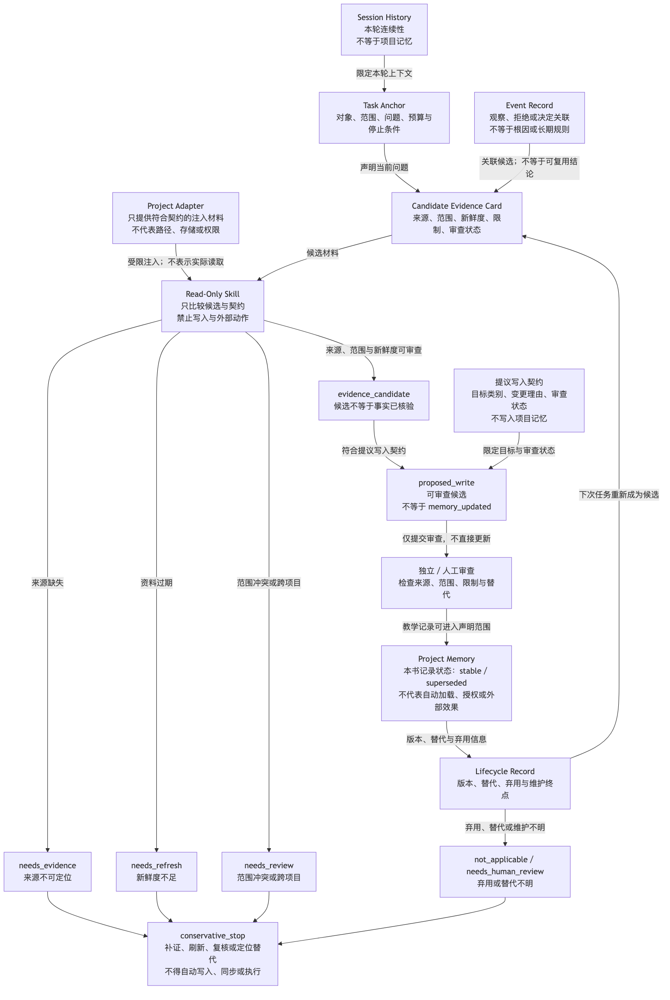
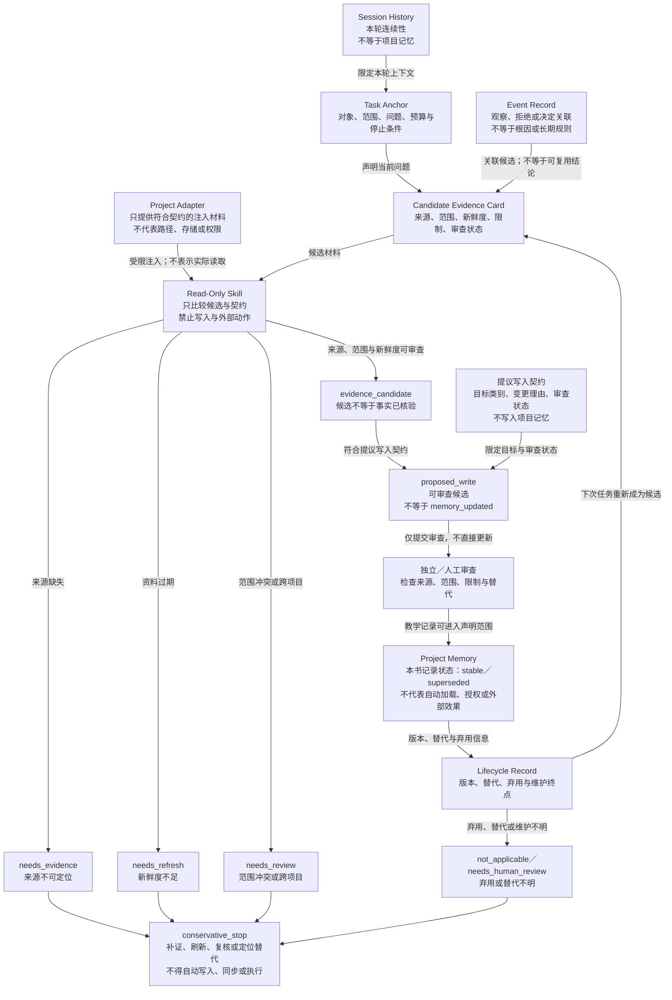

# 37. Memory 与 Skill Design Patterns

> 本章用模式卡（Pattern Card）把读取、提议写入、审查、替代与退役拆成可检查的责任；某项内容曾被保存或检索到、某个技能（Skill）被发现，都不等于事实成立、权限已授予或外部动作已执行。

- [第 37 章 Research Brief](37-memory-and-skill-design-patterns.research.md)
- [第 37 章详细 Outline](37-memory-and-skill-design-patterns.outline.md)
- [第 37 章参考资料](37-memory-and-skill-design-patterns.references.md)

## 本章目标

读完本章后，读者能够：

- 区分会话历史（Session History）、任务范围记忆（Task-Scoped Memory）、项目记忆（Project Memory）、事件记录（Event Record）与决策记录（Decision Ledger）的责任，不将保存位置或检索命中误作可复用事实。
- 用来源、范围、新鲜度、读取触发与审查状态设计记忆候选的读写边界，并把写入候选与已进入长期记录的结论分开。
- 用技能契约（Skill Contract）区分只读技能（Read-Only Skill）与提议写入技能（Propose-Write Skill），说明后者为何只能提交候选，何时必须停在人工或独立审查前。
- 为记忆与 Skill 的组合声明版本、兼容性、替代和弃用信息，避免让旧记录或旧契约静默参与新任务。
- 为一个虚构事实核验场景选择最小的记忆／技能模式卡（Memory／Skill Pattern Card）组合，并指出它不能证明的权限、检索、同步或外部执行事实。

## 为什么“记住了”仍不是工程结论

长期项目最危险的上下文错误，往往不是遗漏，而是把不同责任的文本放进同一个“记忆”容器后，逐渐失去它们的来历。上一轮对话的摘要、一次失败观察、已审查的项目决定和某条可检索来源可以共同出现，但它们回答的问题不同：谁在当前任务中暂存判断、哪条材料能够支持有限陈述、什么规则仍然适用、哪一次发生需要重新检查。

如果这些文本共享同一种读取和写入规则，常见后果是：过期的猜测在下一任务中变成默认前提；一次失败被改写为根因；一个检索片段被改写为已核验结论；只应整理证据的 Skill 获得了更新项目知识的隐式角色。本章不试图以更多存储解决这些问题，而是把每次读取、提议写入、审查、替代和退役的责任写成可检查输入。

本章讨论的是本书的工程模式，不实现 Session、数据库、向量检索、嵌入、文件同步、权限系统、运行时加载器、真实 Skill、产品配置、网络、文件 I/O、模型、账户、凭证、审批或外部系统。后文所有“来源卡”“候选写入”“审查门”和状态均为虚构教学对象；它们不会读取、写入或同步任何真实项目材料。

## 前置知识与来源边界

建议先阅读第 7 章的工作记忆（Working Memory）、长期记忆（Long-term Memory）与读写闸门，第 8 章的技能契约，第 13 章的检索候选，以及第 33、34、36 章的项目记忆、团队 Skill 治理和模式选择语言。读者只需要能阅读 Markdown、字段表和简单结构化对象；不要求拥有任何 Agent 产品账户、存储后端或外部工具。

来源材料只提供局部背景。OpenAI Agents SDK 的会话（Sessions）文档说明，该 SDK 的特定会话（session）会在多次运行（run）之间维护对话历史，并在运行前读取、运行后保存本轮产生的项；该文档同时限制其与服务端延续机制的组合方式 [REF-020]。这不是长期项目记忆的通用定义，也不证明会话历史天然可靠、可审查或可跨项目复用。

LangChain 文档在其框架语境中区分 thread 内短期记忆与跨 session 的长期数据，并以命名空间（namespace）和键（key）组织长期数据 [REF-022]。本章仅将其用作“范围标识可以是存储设计的一部分”的背景；命名空间本身不能证明授权、租户隔离、正确性、删除或兼容性。

Agent Skills 规范说明最小 Skill 目录包含 `SKILL.md`，并把 frontmatter、指令正文和可选资源组织为渐进加载的层次 [REF-024]。Claude Code 文档在其产品语境中说明 Skill 的发现、激活与上下文加载 [REF-025]。本书将过程型 Skill 与常驻项目上下文分开审查；这是一项工程约束，而非该产品对其他系统的保证。这些资料不构成跨产品的发现、调用、权限、安全或写入保证。下文的模式卡、状态和检查问题均是本书工程模型；产品路径、加载优先级和调用行为仍须由具体产品资料和实际验证确认。

## 场景：一个只形成候选的事实核验请求

本章使用一个虚构的事实核验任务。任务接收一条待核验陈述、上一轮对话摘要、三张候选证据卡（Evidence Card）以及两份技能契约（Skill Contract）：一份只读事实核验契约，一份提议写入契约。三张卡分别代表范围匹配的候选、已过期的候选和无法定位来源的候选。所有文本都是注入的教学材料，不对应真实 URL、文件、用户、审核人或运行记录。

**成功标准：** 读者能够说明哪一类材料可进入当前任务的候选上下文，何时只能请求补证或刷新，何时可以产生 `proposed_write`，以及为什么该状态仍不表示项目记忆已经更新。

**边界：** 案例不会调用模型、执行 Skill、访问网络、查询数据库、检索向量、读写文件、修改引用库、运行审批或触及任何外部系统。它只比较注入对象的字段和责任边界。

## 核心概念

### 四类记录：连续对话不等于可复用知识

同一段文本可以在一份文件中保存，却不应因此共享同一个责任。为了让下一位读者能判断何时可用，本书将会话历史、任务范围记忆、项目记忆和事件记录分开；决策记录则补充“为何曾采用某项规则”的可追溯说明。

| 记录类别 | 产生时机 | 读取前需要回答的问题 | 失效或停止信号 | 不能承担的结论 |
| --- | --- | --- | --- | --- |
| 会话历史（Session History） | 同一受限对话或任务上下文持续时。 | 当前任务是否仍需要该段上下文？ | 任务切换、主体不明或摘要缺来源。 | 已形成跨任务项目知识。 |
| 任务范围记忆（Task-Scoped Memory） | 当前任务产生临时观察或中间判断时。 | 与当前对象、范围和停止条件是否匹配？ | 任务结束、范围变化或观察被推翻。 | 已审查的长期规则或外部效果。 |
| 项目记忆（Project Memory） | 资料经定位、范围判断和审查后，需要跨任务引用时。 | 适用条件、来源、新鲜度和替代关系是什么？ | 来源过期、范围不再匹配或被替代。 | 永久正确、自动加载或自动授权。 |
| 事件记录（Event Record） | 某次观察、失败、人工决定或停止发生时。 | 该事件与哪个任务、证据和时间窗有关？ | 关联缺失、事实被否定或含义无法解释。 | 根因、长期偏好或可复用规则。 |
| 决策记录（Decision Ledger） | 有人需要保留“为何选择此规则”的理由时。 | 决定由谁作出，依据和复核条件是什么？ | 适用条件改变、替代决定出现或证据失效。 | 当前事实、永久政策或执行许可。 |

OpenAI Agents SDK 的特定 session 历史与 LangChain 的短期／长期数据区分，可以帮助读者看到“范围不同”的问题 [REF-020] [REF-022]。但上表的字段和停止规则是本书的责任模型。物理位置相同不改变记录性质：一条失败日志即使与项目规范放在同一目录，也仍需要来源、范围和审查，才能讨论它是否可被引用。

在本章场景中，上一轮摘要只属于会话历史；“候选来源过期”是一条任务观察；已经审查过的项目写作规则才可能属于项目记忆；某次人工拒绝则应留下事件记录和决定理由。任何一项缺少来源、主体、时效或关联时，都只能保留为候选或未知项，不能因为“系统保存过”而获得读取许可。

### 证据卡与写入门：检索命中只产生候选

证据卡是本书用来承载候选材料的记录，而不是事实证明。它至少要让审查者回到来源位置、看到可支持的陈述与适用范围，并知道材料的时间和限制。没有这些字段的摘要，即使措辞完整，也无法说明它为何适用于当前任务。

| 字段 | 要回答的问题 | 缺失时的保守路由 |
| --- | --- | --- |
| 来源位置 | 审查者能否回到原材料？ | `needs_evidence`。 |
| 可支持的陈述 | 卡片究竟支持哪一句受限结论？ | 不把摘录扩展为一般规则。 |
| 适用范围 | 主体、版本、任务或条件是否匹配？ | `needs_scope_review`。 |
| 访问或观察日期 | 新鲜度能否判断？ | `needs_refresh`。 |
| 反例或限制 | 哪些情况不能使用这张卡？ | 停止直接复用。 |
| 提出者与审查状态 | 谁提出，谁还需检查？ | 只能作为候选。 |

LangChain 对长期数据和 namespace／key 的说明，不能规定本书的证据卡字段或写入策略 [REF-022]。本书的写入门依次问五个问题：来源能否定位，范围是否匹配，新鲜度是否可判断，是否与当前直接证据冲突，以及谁负责审查。回答后只允许得到几种有限结果：保留为任务材料、请求补证、请求刷新、提出写入候选、拒绝或升级。

虚构案例中的三张卡因此会走向不同出口：范围匹配且待审的卡可以形成 `proposed_write`；过期卡只能得到 `needs_refresh`；无法定位来源的摘要进入 `needs_evidence`。相似度、URL、标签、引用格式或一次“摘要成功”都不能跨过这些检查。`proposed_write` 表示可被审查的提议，并不表示任何项目记忆、引用、正文或外部系统已经更新。

### 读取门与项目适配层：旧记录必须重新成为候选

项目记忆的价值不在于每次都把全部历史放进上下文，而在于读者能够解释“为什么此时需要这一小段材料”。本书的读取门要求任务先声明对象、范围、问题、预算和停止条件，再比较记录的读取触发、来源、新鲜度、冲突状态和最小所需片段。通过读取门的材料只是当前上下文包（Context Packet）的候选，不会自动成为结论。

以虚构事实核验任务为例，合理的结果可能是：读取与当前句子有关的两张证据卡；保留一条过期决策的指针但要求刷新；拒绝来自另一项目且无共享范围的经验记录。这样做不是追求“最少记忆”，而是让每条被纳入的材料都有可复查理由。

| 读取情形 | 需要的最低条件 | 可以输出 | 不能输出 |
| --- | --- | --- | --- |
| 当前任务的证据卡 | 范围匹配、来源可定位、新鲜度可判断。 | `candidate_evidence`。 | 事实已核验。 |
| 过期的决策记录 | 仍可定位、替代关系未明、刷新入口明确。 | `needs_refresh`。 | 历史决定仍自动适用。 |
| 跨项目经验记录 | 有显式共享范围和项目适配说明。 | `needs_review`。 | 可以静默注入。 |
| 弃用的记忆或 Skill 契约 | 有弃用状态和替代信息。 | `not_applicable` 或升级。 | 可继续作为默认输入。 |

这里的项目适配层（Project Adapter）只负责在调用前提供符合契约的注入材料，例如受限的记录类别和最小字段。它不应被写入通用 Skill 的主体，也不等于真实文件路径、账户、密钥或同步渠道。Agent Skills 规范的渐进资源层次和 Claude Code 的 Skill 发现、激活与加载时机，都不能证明资源自动隔离或已获访问权限 [REF-024] [REF-025]。

### 生命周期、版本与弃用：旧记录不会因旧而自动失效

“旧”不是可执行的状态。某条记录可能仍有历史价值，却不再适合参与当前判断；某个 Skill 也可能仍可阅读其契约，却不应再被推荐或提出写入。本书用生命周期记录区分这些情况，而不把弃用误写成删除。

| 教学状态 | 表示什么 | 下一步候选 | 不表示什么 |
| --- | --- | --- | --- |
| `under_review` | 材料或契约尚在核验。 | 补证、明确范围或指定审查者。 | 已稳定可复用。 |
| `stable` | 当前记录在声明范围内可供再次审查。 | 按读取门重新选择。 | 永久正确或自动适用。 |
| `superseded` | 已有具名替代项或更窄的规则。 | 定位替代项并比较范围。 | 旧内容已安全删除或所有读取方已迁移。 |
| `archived` | 保留历史线索，但不作为默认候选。 | 按需追溯或人工复核。 | 不再有任何解释价值。 |

版本与兼容性声明（Compatibility Declaration）也不应压缩成一个版本号。每次改变都需要分别比较：允许读取的记忆类别、触发条件、输入、输出、允许副作用、所需证据和退役路径。版本号只能索引变化；它不能自行证明迁移完成、旧数据可删或读取方仍兼容。

例如，虚构引用策略被替代时，需要有替代关系和刷新入口；一个收紧来源范围的核验 Skill 则需要重新审查触发、输入与既有候选。若 `superseded` 没有替代目标、兼容范围未知、维护者不明，或旧 Skill 仍试图提出写入，路由应停在 `needs_human_review`。停止推荐、停止维护、停止执行与删除数据是四种不同动作，不能用一个“deprecated”掩盖差异。

### 两类 Skill：只读与提议写入的责任不同

Skill 的格式不能决定它可以对什么产生影响。Agent Skills 规范所述的 frontmatter、指令和资源分层，适合用来讨论信息怎样组织 [REF-024]；Claude Code 所述的 Skill 发现、激活与内容加载，适合提醒读者将过程说明和常驻事实分开审查 [REF-025]。二者都不会授予写入权限。

本书把 Skill 分成两类教学契约。只读 Skill 可以整理或比较允许读取的材料；提议写入 Skill 可以在更严格的字段约束下形成候选。两者都不执行真实读写、审批或外部行动。

| 契约字段 | 只读 Skill | 提议写入 Skill | 仍需本章外的控制 |
| --- | --- | --- | --- |
| 允许读取的记忆类别 | 必填。 | 必填。 | 实际访问授权与环境隔离。 |
| 输入范围与停止条件 | 必填。 | 必填。 | 真实调用、超时和错误处理。 |
| 证据输出 | 证据包、限制和未知项。 | 候选内容、来源、范围和变更理由。 | 内容正确性与业务效果。 |
| 写入边界 | 明确禁止写入。 | 只能提出目标类别和审查状态。 | 项目记忆的真实写入权限。 |
| 审查与拒绝出口 | 说明何时停止。 | 必须说明审查状态和拒绝出口。 | 人工或独立审查已经发生。 |

只读并不保证读到的材料正确、完整、可访问或适用于当前结论。提议写入也只产生一个带来源和范围的候选，不会更新项目记忆、全局引用或正文。若候选没有来源字段、目标类别不明、禁止条件缺失、带有未声明的外部副作用，或企图用 `SKILL.md` 的格式替代审批，它应被阻塞或升级，而不是得到“更智能”的自动化标签。

### 组合模式：Skill 读取公共契约，而非携带私有状态

可复用 Skill 需要知道它依赖什么类别的材料，却不应把某个项目的私有路径、一次性命令、猜测或写入步骤固化为通用指令。本书的组合规则是：Skill Contract 声明所需的记录类别、最小字段、允许的证据输出和禁止动作；项目适配层在调用前提供符合契约的注入资料；Skill 输出再回到读取门、写入门和审查门。

| 组合 | 适用条件 | 最小工件 | 允许的教学产物 | 不能主张 |
| --- | --- | --- | --- | --- |
| 任务范围读取 | 当前任务只需近期观察。 | 任务锚点、只读输入、过期条件。 | 任务候选。 | 已形成跨任务知识。 |
| 证据卡复核 | 待核验陈述能回到来源候选。 | Evidence Card、范围、刷新条件。 | 受限证据判断。 | 来源已支持最终结论。 |
| 决策记录查询 | 已有决定可能适用。 | 决定、所有者、适用条件、替代关系。 | 复核请求或候选上下文。 | 历史决定自动适用。 |
| 提议写入 | 新结论有来源，且需要人工或独立审查。 | 候选、变更理由、审查门、拒绝出口。 | `proposed_write`。 | 项目记忆已经更新。 |

如果一个 Skill 需要私有路径、隐式写入、跨主体资料或无法解释的上下文，正确做法不是把这些细节悄悄加入契约，而是拒绝复用，并由项目侧建立受限适配或人工评估。这个结论不依赖某个产品是否支持按需加载：按需加载只能改变何时取得指令，不能解释指令是否应拥有数据、权限或写入责任。

## 完整教学案例：事实核验 Skill 只形成可审查候选

下面的表格把虚构输入、契约检查和输出状态放在同一处。它的目的是检查责任断点，不模拟来源访问、检索、审查、写入或执行。

| 输入记录 | 契约检查 | 输出状态 | 缺失证据或责任 | 不能主张 |
| --- | --- | --- | --- | --- |
| 范围匹配、来源可定位、日期明确的候选卡。 | 只读 Skill 比较当前陈述、范围和新鲜度；提议写入契约保留来源与审查状态。 | `evidence_candidate`，随后可形成 `proposed_write`。 | 仍需独立或人工审查。 | `fact_verified`、`memory_updated` 或外部动作已发生。 |
| 来源范围匹配但已经过期的卡。 | 读取门发现新鲜度不足。 | `needs_refresh`。 | 需要重新取得可审查材料。 | 旧结论仍可直接复用。 |
| 无法定位来源的模型摘要。 | 写入门无法检查来源和限制。 | `needs_evidence`。 | 缺少来源位置与可支持陈述。 | 摘要正确、可写入或可发布。 |
| 范围跨项目的经验记录。 | 项目适配层不能解释共享条件。 | `needs_review` 或停止。 | 缺少共享范围和责任人。 | 可静默读取或进入长期记忆。 |
| 已弃用的核验 Skill 契约。 | 生命周期记录要求检查替代项和维护终点。 | `not_applicable` 或 `needs_human_review`。 | 替代项、迁移状态或兼容范围不清。 | 旧 Skill 仍可提议写入。 |

案例中有三条不能跨越的等式：`evidence_candidate ≠ fact_verified`、`proposed_write ≠ memory_updated`、`review_approved ≠ external_action_executed`。第一条防止把候选材料写成事实；第二条防止把提议写成存储事实；第三条防止把审查记录外推为文件、系统或业务效果。即使未来某个真实系统实现了这些步骤，也仍需要独立的权限、执行记录和外部观察来支持相应结论。

## 最小示例：纯内存 Memory／Skill 边界评估器

本章的 [示例计划](37-memory-and-skill-design-patterns.example-plan.md) 已实现 `assessMemorySkillBoundary(card)`。它只评估调用方注入的 Memory／Skill Pattern Card，不读取真实项目文件、调用模型、启动 Skill、请求网络、访问数据库、写入存储、同步、调用 Git、使用账户或凭证。

| 输入类别 | 评估器需要检查的字段 | 可以返回的教学状态 | 不能返回的结论 |
| --- | --- | --- | --- |
| 任务范围 | 对象、范围、问题、预算与停止条件。 | `ready_for_isolated_example` 或具名停止原因。 | 已获得真实执行环境。 |
| Evidence Card | 来源、范围、新鲜度、限制与审查状态。 | `needs_evidence`、`needs_refresh` 或 `requires_review`。 | 来源已访问或事实已经成立。 |
| Skill Contract | 可读类别、禁止动作、输出证据与写入边界。 | `stopped`、`requires_review` 或 `requires_approval`。 | Skill 已被发现、调用或授权。 |
| 生命周期摘要 | 版本、替代、弃用和维护信息。 | `requires_review` 或升级。 | 数据已迁移或旧项已删除。 |

Node 内置测试覆盖完整只读路径、缺来源、过期资料、跨项目范围、提议／隐式写入、弃用、执行请求／声称与缺 Skill 契约；已实际运行 `node --test examples/agent/memory-skill-boundary-assessment.test.mjs`，结果为 8 项通过、0 项失败。演示命令 `node examples/agent/memory-skill-boundary-assessment.mjs` 输出 `ready_for_isolated_example`、`memory_skill_boundary_ready`、`continue_read_only_assessment` 与 `executionPerformed: false`。这些结果只证明注入对象的教学路由，不代表真实 Session、项目记忆、Skill、审查、批准、同步或外部动作已发生。

## 架构图：让候选、提议与项目记忆停在不同责任边界

下图回答：在同一个虚构事实核验任务里，会话历史、事件记录、候选证据卡、只读 Skill、提议写入契约、审查、项目记忆与生命周期记录如何形成一条可解释的教学路径，同时不把保存、发现、提议或审查写成真实读写、授权或外部效果？可编辑源为 [Mermaid 源](../../diagrams/mermaid/chapter-37-memory-skill-boundaries.mmd)；Diagram Review 已导出并查看 [SVG](../../diagrams/exported/chapter-37-memory-skill-boundaries.svg) 与 [PNG](../../diagrams/exported/chapter-37-memory-skill-boundaries.png)。图只表达本书的记录、契约、审查与保守停止模型，不表示真实 Session、存储、检索、同步、权限、Skill、网络、文件、模型、账户、凭证、审批或外部系统已执行。

读图时先看每个节点能提出什么，而不是把箭头当成外部动作：会话历史只限定本轮上下文，事件记录只关联可复查材料；只读 Skill 只能得到 `evidence_candidate`，而 `proposed_write` 仍要经过独立或人工审查。图中唯一进入 Project Memory 的箭头也只表示“本书教学记录可在声明范围内被登记”，不代表真实项目已经写入、自动加载、获得权限或产生效果。Lifecycle Record 让旧记录下一次重新成为候选；一旦来源缺失、新鲜度不足、范围冲突或弃用关系不明，路径必须进入 `conservative_stop`，而不是静默同步、执行或扩大适用范围。

替代说明：一张自上而下的责任边界图。Session History 限定 Task Anchor 的本轮上下文，Event Record 与 Task Anchor 都只向 Candidate Evidence Card 提供候选。Project Adapter 向 Read-Only Skill 提供受限材料；只读比较后，完整候选才可能与提议写入契约汇入 `proposed_write`。该候选必须经过独立／人工审查，才可在声明范围内成为 Project Memory 教学记录，并由 Lifecycle Record 标注版本、替代、弃用与维护终点。缺来源、过期、范围冲突或弃用不明分别流向 `needs_evidence`、`needs_refresh`、`needs_review` 或 `not_applicable`／`needs_human_review`，最终保守停止；图不代表真实读取、写入、同步、授权、审批或外部动作。

## 工程实践：从候选到退役保持责任可见

### 先记录范围，再记录内容

一条项目记忆如果没有主体、任务、版本、时间或适用条件，后续读者无法决定是否应读取它。与其把它标为“重要”，不如把它保留为候选，并记录缺少哪种范围信息。范围字段不能代替事实核验，但能阻止无界文本成为默认上下文。

### 写入候选必须保留拒绝出口

提议写入的价值在于把变更理由、来源、目标类别与审查状态放在同一记录中，让审查者能够拒绝、缩小或要求刷新。若系统只能输出“写入成功”或“失败”，它已经丢失了最重要的中间状态：该提议为何存在、由谁负责、还缺什么证据。

### 让弃用可被读取，而不是静默消失

弃用记录应保留停止推荐的原因、受影响版本、替代项、迁移期限、维护终点和未覆盖范围。这样，读取方至少可以知道自己面对的是旧工件，而不是在缺少信息时继续沿用。是否删除数据、是否完成迁移、是否仍允许某项运行时调用，必须由独立的系统与权限证据回答。

### 将数据适配留在项目侧

Skill Contract 应描述需要什么，而不是保存某个项目如何提供它。把项目路径、私有资料、账户或隐式写入步骤塞进可复用 Skill，会同时破坏迁移与审查。项目侧适配可以缩小输入、去除敏感字段并说明范围；它仍不构成真实隔离、授权或同步保证。

## 逐步增强：何时离开纯内存模式卡

| 新需求 | 必须新增的控制 | 升级触发 | 本章为何不实现 |
| --- | --- | --- | --- |
| 读取真实项目记忆 | 获批范围、敏感信息规则、读取记录、新鲜度复核和失败处理。 | 教学输入不足以判断当前项目。 | 本章不读取文件或数据库。 |
| 写入或迁移项目记忆 | 最小写权限、变更预览、来源复核、回读、审查和恢复路径。 | 候选需要改变共享资料。 | 提议写入不是写入。 |
| 运行真实 Skill | 已核验的运行环境、工具契约、权限、超时、观察和独立验证。 | 需要产生外部效果。 | Contract 不授予执行能力。 |
| 跨项目复用与分发 | 兼容性声明、项目适配、依赖治理、弃用与迁移记录。 | 同一能力面对不同私有上下文。 | 模式卡不包含私有状态。 |
| 企业级治理 | 身份、隔离、保留、审计、预算、策略和人工升级。 | 资料跨主体或触及受控系统。 | 留给第 35、41、42 章及具体组织制度。 |

这张表的“升级”不是实现清单。它只说明：当任务越过纯内存边界时，原来的 Pattern Card 不再足以支持结论。此时应增加受限环境、权限、观察和恢复设计，而不是把 `proposed_write`、目录结构或产品文档当作执行许可。

## 常见错误

| 错误 | 表现 | 根因 | 修复方向 |
| --- | --- | --- | --- |
| 永久升级会话摘要 | 一次对话中的猜测下次被当作项目规则。 | 未分开任务范围与项目记忆。 | 要求来源、范围、新鲜度和审查门。 |
| 以 URL 证明已核验 | 有链接就把陈述写成事实。 | 把可定位材料与可支持结论混为一谈。 | 使用 Evidence Card，记录限制与范围。 |
| 将 `SKILL.md` 当作授权 | 指令格式存在，就假定可读取或写入。 | 将发现与调用、调用与权限混淆。 | 在契约中显式禁止动作，并由环境另行授权。 |
| 让提议写入跳过审查 | 候选生成后直接改写共享资料。 | 缺少审查状态、拒绝出口和责任人。 | 保留 `proposed_write`，等待独立或人工审查。 |
| 以版本号代替兼容性 | 升版后仍静默读取旧记录。 | 没有比较触发、输入、输出和退役路径。 | 写 Compatibility Declaration 并指出待复核读取方。 |
| 让弃用条目静默读取 | 旧 Skill 或旧资料继续影响新结论。 | 弃用没有替代、停止或迁移信息。 | 显示 `not_applicable`，要求替代或人工复核。 |

## 安全与边界

- **权限边界：** 本章不授予 Agent、模型、Skill、文件、数据库、向量检索、同步服务、网络、账户、凭证、Git、浏览器、审批或任何外部系统的读取、写入、调用、执行或授权能力。
- **数据边界：** 虚构输入不包含真实项目路径、代码、用户资料、日志、来源内容、账户、密钥、检索结果、存储记录或审查材料。
- **人工审批点：** 任何真实记忆写入、迁移、删除、Skill 运行、外部工具调用、权限提升、同步或发布，都需要独立的范围、风险、权限与执行后观察。
- **不适用范围：** 当来源不可定位、范围不匹配、新鲜度未知、冲突未解释、写入边界不明、契约已弃用或外部效果被声称为已发生时，本章模型只能停止、补证、刷新或升级。

## 章节总结

Memory 与 Skill Design Patterns 的目标不是把更多材料存起来，或给每项整理工作包装成 Skill。它要求读者为每一次读取、提议写入、审查、替代和退役保留范围、证据与责任。会话历史能帮助维持局部连续性；长期数据与命名空间能提供框架背景；Skill 的目录、指令与按需加载能帮助组织过程说明。但这些事实都不能替代项目记忆的证据门、写入门、生命周期和环境权限。

第 38 章将把候选改进、独立评估与批准模式连接为决策闭环。它仍须保留本章的断点：候选不是结论，审查不是执行，批准记录也不是外部效果。

## 练习

1. 将一条虚构的“上次部署失败”记录拆成事件记录、Evidence Card 和项目决策候选，指出哪些字段不能从日志标题推出。
2. 为一个只读来源检索 Skill 写出三个禁止动作，并说明何时应升级为提议写入 Skill。
3. 为一条收紧读取范围的契约改动写出 Compatibility Declaration，列出两项必须重新审查的旧候选。
4. 设计一个弃用中的核验 Skill 的停止输出，区分停止推荐、停止维护、停止执行和删除数据。

## 延伸阅读

- [REF-020：OpenAI Agents SDK Sessions](37-memory-and-skill-design-patterns.references.md) —— 用于特定 session 的跨 run 历史边界。
- [REF-022：LangChain Long-term memory](37-memory-and-skill-design-patterns.references.md) —— 用于 thread 内与跨 session 记忆的框架语境。
- [REF-024：Agent Skills Specification](37-memory-and-skill-design-patterns.references.md) —— 用于 Skill 目录、frontmatter、指令与资源的分层背景。
- [REF-025：Claude Code Skills](37-memory-and-skill-design-patterns.references.md) —— 用于 Skill 发现、激活与上下文加载的产品特定语义。

## 参考资料

- [第 37 章参考资料](37-memory-and-skill-design-patterns.references.md)：列出 REF-020、REF-022、REF-024、REF-025 的限定陈述、访问日期与不可外推范围。
- [第 37 章事实核验](37-memory-and-skill-design-patterns.fact-check.md)：记录写作日的来源复读、允许陈述与未核验范围。

## 章节完成检查表

- [x] Front matter、目标、前置知识、章节依赖和来源映射完整。
- [x] 内容为原创表达，来源事实、本书工程模型与虚构教学输入已分开。
- [x] 每项可归因事实仅限 REF-020、REF-022、REF-024、REF-025 的受限范围。
- [x] 图示有 Mermaid 源码、读图说明和一致术语。
- [x] 示例有环境、验证方式、结果状态和安全边界。
- [x] Technical Review 与 Fact Check 已记录。
- [x] Language Editing 已独立验收。
- [x] Final Review 已独立验收；本轮重跑专用测试、演示、图源一致性检查并查看现有 PNG。
- [x] 已运行 Final Review 前的共享 `npm run validate` 基线；本轮不重复全仓校验。
- [x] `.ai/progress.md`、`CURRENT_STATE.md`、`NEXT_TASK.md` 与交接已更新。
