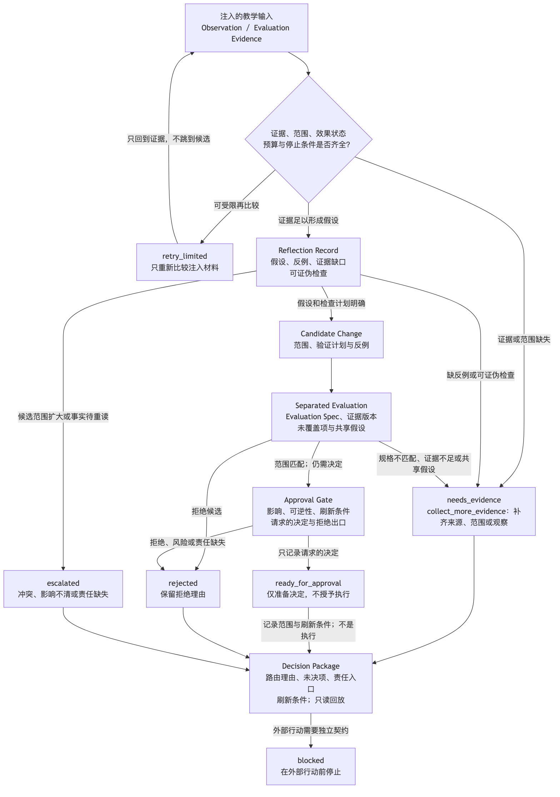
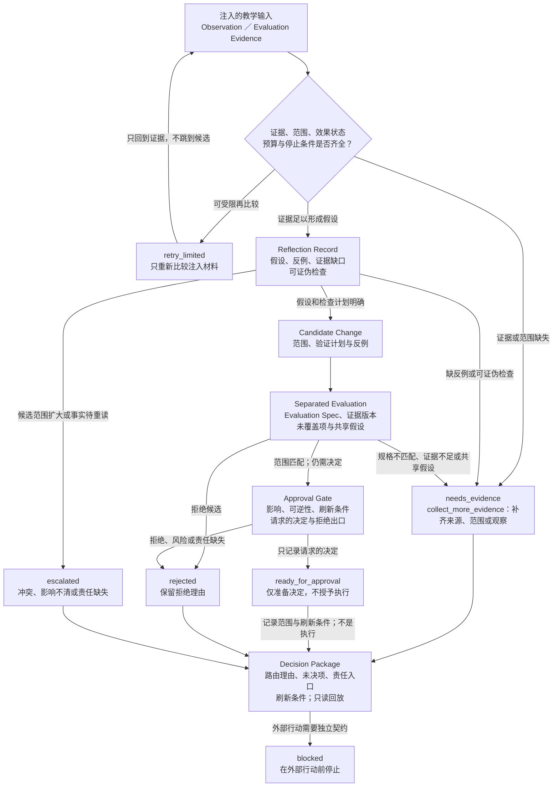

# 38. 反思、评估与批准模式

> 本章将失败观察、评估证据、反思记录、候选改变与决定记录拆开；任何一张模式卡都只路由教学输入，不能把评估、批准或记录写成真实执行与外部效果。

## 本章目标

- [ ] 区分观察（Observation）、评估证据（Evaluation Evidence）、反思记录（Reflection Record）、候选改变（Candidate Change）和决定记录（Decision Record）各自能支持的结论。
- [ ] 为补证、有限重试、独立评估、批准、拒绝和升级声明入口条件，并说明每个出口不能推出的外部事实。
- [ ] 用批准卡（Approval Card）记录候选范围、证据版本、影响、可逆性、未覆盖项与刷新条件，而不以单个评分或口头确认代替责任。
- [ ] 设计可回放的决定包（Decision Package），分清“评估接受”“记录了批准”“发生执行”和“验证到效果”。
- [ ] 在虚构文档链接修复场景中组合模式卡（Pattern Card），并指出真实文件、网络、Git、CI、人员审批和回滚均未发生。

## 为什么要学

一个 Agent 收到低分、失败提示或一段自我反思时，最容易犯的错误是把反馈直接转换为下一次执行。这样做把至少四个本应独立的问题压缩成一句“再试一次”：失败是否可定位，外部效果是否已知，候选改变是否有可证伪的依据，以及谁对风险范围负责。

本章不试图为所有组织设计审批制度，也不提供自动修复器。它只提供一组可组合的模式卡（Pattern Card），让每一个门只回答一个问题：证据是否足以再观察，反思是否足以提出候选，评估是否覆盖指定标准，批准是否仅记录一次范围决定，以及无法自动解决的争议如何被保留下来。

## 前置知识

- 前置章节：第 14 章的人类在环（Human-in-the-loop，HITL）与审批记录、第 16 章的反思记录、第 17 章的评估规格（Evaluation Spec）和证据矩阵、第 18 章的恢复出口、第 20 章的候选改进与变更门，以及第 36、37 章的模式卡与可追溯记录。
- 技术前提：能够阅读结构化对象、状态、范围和证据字段；不要求使用特定 Agent、审批系统或持续集成服务。
- 不要求：真实文件、链接检查器、Git 仓库、账户、权限、网络、部署、回滚、工单系统或组织审批流程。

## 场景引入

**场景：** 一个虚构的文档维护 Agent 收到两份注入的教学材料。第一份指出一个相对链接候选未满足当前评估规格；第二份建议把一条带来源的陈述改写。前者只涉及受控路径候选，后者则需要重新确认来源内容。两份材料都不是从真实 Markdown、URL、仓库、网络或检查器获得的。

**成功标准：** 路由器能说明链接候选为何最多到达 `ready_for_approval`，来源陈述为何仍停在 `needs_evidence` 或 `escalated`；并且任何输出都不声称文件已写入、批准人已签署、Git 已提交或回滚已执行。

**边界：** 本章使用纯教学输入讨论责任断点。没有运行真实 Agent、模型、评估器、重试、浏览器、网络、Git、CI、环境、账户、凭证、审批、部署、回滚或外部系统。

## 核心概念

### 从反馈到决定：五种记录不能压缩成“已修复”

Anthropic 的工程文章在其适用语境中讨论评估器—优化器（evaluator-optimizer）循环，并强调清晰的评估条件、环境证据、检查点与停止边界 [REF-029]。这说明反馈循环需要可观察输入；它不提供本章的状态机，也不保证某次评价足以形成修复结论。

本书把一个反馈闭环拆成五类记录。拆分的目的不是增加表单，而是防止一份文本同时假装自己是症状、根因、修复和验收。

| 记录 | 由谁产生 | 在本书模型中可支持的受限结论 | 不能推出的结论 |
| --- | --- | --- | --- |
| 观察（Observation） | 受控观察或注入教学输入。 | 某一范围内出现了待解释现象。 | 根因已经确认。 |
| 评估证据（Evaluation Evidence） | 按具名评估规格（Evaluation Spec）比较的材料。 | 某一明确标准被满足、未满足或无法判断。 | 全部质量、事实或风险均已覆盖。 |
| 反思记录（Reflection Record） | 对观察、影响、未知项和假设的结构化复盘。 | 可以提出待检查的假设与后续问题。 | 假设是根因，或规则应被改变。 |
| 候选改变（Candidate Change） | 带范围、反例和验证计划的候选。 | 有一个可供独立评估或人工决定的提案。 | 改变已写入、已合并或已发布。 |
| 决定记录（Decision Record） | 对一次受限决定及其理由的记录。 | 已保存该决定的范围、证据和刷新条件。 | 外部行动已发生，或效果已验证。 |

因此，`observed_failure ≠ root_cause`、`accepted_evaluation ≠ approved_change`，以及 `approved_change ≠ executed_change`。缺少来源、范围、时间、未知项、责任或下一步中的任何一项时，路由应是 `needs_evidence` 或 `blocked`，而不是自动进入反思或批准。

### 证据优先重试（Evidence-first Retry）：重试是受限的再取证

本章的证据优先重试（Evidence-first Retry）是一张工程模式卡，不是任何产品的重试 API。它首先读取失败类别、任务范围、已知效果状态、可重复性声明、重试预算、当前证据和停止条件；然后只形成 `collect_more_evidence`、`retry_limited`、`needs_approval` 或 `blocked` 之一。它不调用工具，不等待，不修改输入，也不判断真实系统可安全重试。

来源中的检查点、阻塞和迭代控制只能提供一个工程背景 [REF-029]。本书不据此虚构次数、等待时间、成功率或“低风险”的阈值。实际判断应优先问下面这些定性问题：

| 输入情况 | 本书可提出的下一步 | 仍不能主张 |
| --- | --- | --- |
| 观察缺少再次比较所需的证据。 | `collect_more_evidence`。 | 失败是暂态问题。 |
| 范围未变、外部效果已知为无，且只需再评估注入材料。 | `retry_limited` 候选。 | 真实检查已经重跑。 |
| 前一次外部效果未知，或输入说不清是否可重复。 | `needs_approval` 或 `blocked`。 | 可以安全重试或补偿。 |
| 候选扩大范围、不可逆影响未知或预算已耗尽。 | 停止并升级。 | 高置信度足以越过边界。 |

“模型很有信心”“之前做过一次”或“可能是暂态问题”都不是重试许可。证据优先重试（Evidence-first Retry）的价值是让再取证保持可撤销；它不能把一个没有效果状态或停止条件的请求粉饰为恢复动作。

### 反思到候选（Reflection-to-Candidate）：反思提出问题，不直接改变规则

Google SRE 的复盘实践将事件、影响、处置、成因和预防行动保留为书面学习材料，并强调对行动项进行审查的语境 [REF-059]。本章只借用这一点：反思应能回到影响、处理过程与后续行动，而不是只留下归咎性结论。它不表示本章实现了真实事故复盘或自动根因分析。

本书的反思到候选（Reflection-to-Candidate）让一条反思记录至少包含观察、假设、证据缺口、反事实、候选改变和可证伪检查（Falsifiable Check）。只有候选范围和检查计划都明确时，输出才可为 `candidate_proposed`。这仍不是确认根因、规则更新或实际修复。

例如，面对“相对链接可能写错”的教学输入，应同时保留至少三种竞争解释：路径表达错误、来源文件已移动、注入检查证据已经过期。每种解释都应写出会推翻它的下一份观察。若一条反思没有关联证据、把症状改写成根因、扩大到改写来源事实，或没有可证伪检查，路由应保持 `needs_evidence`、`needs_scope_review` 或 `escalated`。

### 分离评估（Separated Evaluation）：评估通过只回答指定问题

NIST AI RMF Core 将治理、度量、记录、测试、评估、验证和确认放在可按组织情境组合的风险管理背景中，并指出独立审查可帮助减轻内部偏差或利益冲突 [REF-062]。这不是对本章评估器的认证，也不指定评分阈值、审核人数或任何 Agent 的运行行为。

本书的分离评估（Separated Evaluation）要求把候选改变、评估规格（Evaluation Spec）、证据版本、评估方法、未覆盖项与结论分开登记。输出只能是 `accepted_for_decision`、`rejected_for_reason`、`needs_evidence` 或 `needs_independent_review`。所谓“分离”是一组可检查的问题，不是一句“我们使用了另一个模型”的声明：

1. 评估是否复用了候选中的未核验假设？
2. 评估是否只读取同一段摘要，而没有可定位的证据版本？
3. 评估规格（Evaluation Spec）是否覆盖候选要主张的范围？
4. 未覆盖的事实、影响或反例是否被明确保留？

任一问题回答为“是”或“未知”时，都不应自动进入批准。虚构链接样例中，“路径格式满足注入规则”可以成为一个受限的评估结论；它不能用来接受“来源陈述仍然准确”这一不同的问题。

### 批准门（Approval Gate）：批准记录是范围决定，不是权限令牌

NIST AI RMF 1.0 在其框架语境中讨论人机配置、监督过程、角色责任与记录如何为管理决定提供依据 [REF-063]。本章据此强调：一次决定必须说明谁在回答什么问题、使用何种证据、何时失效；它不从该框架推导具体组织矩阵、真实身份、权限、合规结论或法律授权。

批准门（Approval Gate）读取候选范围、影响类别、可逆性、证据版本和新鲜度、未覆盖项、策略输入、回滚准备摘要以及请求的决定。它可以返回 `approval_required`、`ready_for_approval`、`needs_evidence`、`rejected` 或 `blocked`，但不返回授权令牌，也不发送任何请求。

一张本书的批准卡（Approval Card）至少应包含以下字段：

| 字段 | 为什么需要 | 字段存在仍不能证明 |
| --- | --- | --- |
| 候选标识与意图 | 让决定指向一个可定位提案。 | 提案已实施。 |
| 范围与影响 | 让决定者知道哪些对象可能受影响。 | 范围已经获授权。 |
| 已评估与未评估内容 | 避免把局部绿色结果扩大成全局结论。 | 未评估部分没有风险。 |
| 证据版本与新鲜度 | 让后续读者识别结论依赖哪份材料。 | 证据永久有效。 |
| 可逆性与回滚准备摘要 | 使风险和恢复缺口可见。 | 回滚已经验证或一定可行。 |
| 请求的决定与拒绝出口 | 保留批准、拒绝、补证或升级的选择。 | 任何人已经做出决定。 |
| 刷新条件与决定者角色 | 说明何时需要重新判断以及责任落点。 | 角色拥有真实身份或系统权限。 |

一个只更新受控相对链接的虚构候选，在范围不变、证据完整且没有外部效果声明时，最多成为 `ready_for_approval`。若候选同时修改来源事实和多个章节，或证据已经刷新、可逆性未知、责任人不明，则旧的决定不能复用；它必须回到 `needs_scope_review`、`needs_evidence` 或升级记录。

### 升级与回放（Escalate-and-Replay）：停止和拒绝也要留下可读理由

NIST 的风险管理资料提供治理、记录与监督的背景 [REF-062] [REF-063]，Google SRE 的复盘实践则提供行动项需要被持续审查的学习语境 [REF-059]。本书在此基础上设计决定包（Decision Package）：保存候选、评估规格、证据版本、路由理由、决定或拒绝理由、未决项、责任入口与重新评估触发。

可回放（`replayable`）在本章只表示之后可重读已保存的教学输入与理由。它不表示真实系统可以重放、外部效果已经撤销、日志完整或审计满足任何保留要求。升级模板可以按以下问题分类，但不指定组织、SLA 或响应时间：

| 升级原因 | 至少保留的输入 | 可请求的补充 | 不能删掉的未知项 |
| --- | --- | --- | --- |
| 证据冲突 | 候选、冲突材料与范围。 | 独立来源或重新观察。 | 哪一份材料当前可用。 |
| 影响不清 | 候选范围与影响类别。 | 影响评估和责任判断。 | 是否存在外部副作用。 |
| 策略或授权缺口 | 请求的动作和现有规则。 | 具名角色或制度解释。 | 是否已获得许可。 |
| 外部效果未知 | 上一次动作的观察缺口。 | 回读或受控调查计划。 | 是否可以安全重试。 |
| 超出预算 | 已用预算与停止条件。 | 新的范围决定。 | 未完成工作不应被标为成功。 |

若记录缺少关联候选、把拒绝重写为通过、删除未知项，或在冲突中继续生成执行步骤，应将该决定包（Decision Package）路由为 `blocked`。升级不是失败掩盖；它是把尚不能由自动化回答的问题交给具名责任入口。

## 架构图：反馈—批准责任图

下图回答：一份注入的观察（Observation）或评估证据（Evaluation Evidence）如何先经过证据、范围、效果状态、预算和停止条件的检查，再依次形成反思记录、候选改变、分离评估与批准请求，同时把补证、有限重试、拒绝和升级保留为可读出口？可编辑源为 [Mermaid 源](../../diagrams/mermaid/chapter-38-feedback-approval-decision-flow.mmd)；Diagram Review 已导出并查看 [SVG](../../diagrams/exported/chapter-38-feedback-approval-decision-flow.svg) 与 [PNG](../../diagrams/exported/chapter-38-feedback-approval-decision-flow.png)。图只表达本书的教学责任路由，不表示真实文件、网络、Git、CI、审批、回滚、凭证或其他外部系统已被访问、调用、批准或执行。

读图时有三条不可跨越的断点：`retry_limited` 只回到注入证据；`ready_for_approval` 只准备决定而不授予执行；决定包（Decision Package）只保存理由、未知项和刷新条件，不代表回滚、文件写入或其他外部效果。若证据、范围、反例、责任或可逆性不足，箭头应停在 `collect_more_evidence`、`rejected`、`escalated` 或 `blocked`，而不是跳过评估或批准门。

## 工作流程

下列步骤描述本书的教学路由，不描述已经运行的系统。

1. **登记反馈：** 为注入的观察和评估证据（Evaluation Evidence）写明来源、范围、时间、未知项与关联标识。缺失时输出 `needs_evidence`。
2. **判断再取证边界：** 检查范围、已知效果、可重复性、预算和停止条件。只有受限条件齐全时，才形成 `retry_limited` 候选。
3. **形成反思候选：** 记录假设、反例、证据缺口和可证伪检查；不能解释的部分不伪装成根因。
4. **分离评估：** 用具名的评估规格（Evaluation Spec）和证据版本审查候选，保留未覆盖项与共享假设。
5. **准备决定：** 若候选通过指定评估，将范围、影响、可逆性、刷新条件和拒绝出口组成批准卡（Approval Card）。
6. **保留决定或升级：** 记录批准请求、拒绝、补证或升级理由，形成可重读的决定包（Decision Package）。
7. **在外部行动前停止：** 任何真实写入、部署、回滚、工具调用或观察都需要独立的环境、权限、执行和效果验证契约。

这套流程的终点是“下一步可以由谁在什么证据条件下判断”，而不是“文件已经修复”。

## 最小示例

本章已按[示例计划](38-reflection-evaluation-and-approval-patterns.example-plan.md)实现纯内存函数 `assessFeedbackApprovalRoute(input)`。它只读取注入的 `candidate`、`evidence`、`reflection`、`evaluation`、`approval`、`escalation` 和 `execution`，并返回教学路由与原因。

| 教学输入 | 受限输出 | 不能由输出推出的事实 |
| --- | --- | --- |
| 证据缺来源或范围。 | `needs_evidence`。 | 来源不可用或结论必定错误。 |
| 外部效果未知。 | `blocked` 或 `escalated`。 | 系统已经回滚或可以安全重试。 |
| 范围不变、无外部效果且需重新比较的候选。 | `retry_limited`。 | 真实检查已经执行。 |
| 反思没有可证伪检查。 | `needs_evidence`。 | 反思内容没有价值。 |
| 候选与评价共享关键未核验假设。 | `needs_independent_review`。 | 存在统计独立的评估者。 |
| 评价范围匹配但需人类决定影响。 | `ready_for_approval`。 | 决定已经被批准。 |
| 审批记录拒绝或范围扩大。 | `rejected` 或 `escalated`。 | 旧决定可以自动复用。 |

Node 内置测试覆盖完整的只读候选、缺少新鲜证据、非独立评估、写入候选、外部执行请求、过期批准、范围不匹配，以及带写入请求却缺少完整升级记录的候选；已实际运行 `node --test examples/agent/feedback-approval-route-assessment.test.mjs`，结果为 8 项通过、0 项失败。演示命令 `node examples/agent/feedback-approval-route-assessment.mjs` 输出 `ready_for_approval`、`read_only_candidate_ready`、`continue_to_decision` 与 `executionPerformed: false`。这些命令不运行模型、浏览器、网络、文件、Git、CI、身份、审批、回滚或外部系统。

## 逐步增强

| 新需求 | 必须新增的控制 | 升级触发 | 本章为何不实现 |
| --- | --- | --- |
| 运行真实检查或有限重试 | 环境契约、目标范围、工具权限、效果观察、超时、预算和回读验证。 | 必须接触文件、网络、服务或其他外部系统。 | 模式卡（Pattern Card）不授予工具调用权。 |
| 写入或发布候选改变 | 预览、最小写权限、独立验证、批准记录、回滚方案和执行后观察。 | 候选将产生外部副作用。 | 批准不是执行，回滚准备不是回滚。 |
| 真实组织审批与治理 | 身份、授权、职责矩阵、保留策略、审计与组织制度。 | 决定影响多人、受控资料或生产系统。 | NIST 框架背景不替代当地制度。 |
| 长期监控与版本回放 | 版本化工件、数据保留、隐私/安全限制、回放隔离、漂移检查和弃用路径。 | 决定需要跨任务复用或复盘。 | Decision Package 只是教学记录。 |

每次升级都必须补上新增的责任，而不是将原有的 `approved` 字段赋予更大的含义。

## 完整工程案例：链接候选与来源事实走不同路径

下表中的材料均为虚构输入，用于说明同一文档里的两类问题不能共用一条“修复并通过”的路径。

| 输入 | 适用 Pattern Card | 受限输出 | 缺失证据或责任 | 不能主张 |
| --- | --- | --- | --- | --- |
| 受控目录中的相对链接候选，附有路径格式评估证据。 | Evidence-first Retry → Reflection-to-Candidate → Separated Evaluation → Approval Gate。 | 最多 `ready_for_approval`。 | 范围确认、决定者、外部写入许可。 | 链接已改写、文件已写入或检查已重跑。 |
| 带来源声明的事实候选，只通过格式检查。 | Separated Evaluation → Escalate-and-Replay。 | `needs_evidence` 或 `escalated`。 | 来源重读、适用范围与新鲜度。 | 事实准确、引用仍然有效。 |
| 链接候选扩大到多个章节。 | Approval Gate。 | `needs_scope_review`。 | 扩大范围的影响与责任。 | 原来的局部决定仍可复用。 |
| 两份证据得出冲突结论。 | Escalate-and-Replay。 | `blocked` 或 `escalated`。 | 冲突解释、补充观察或独立审查。 | 任一结论已被接受。 |

这个案例的四个断点必须持续可见：`format_accepted ≠ fact_verified`、`accepted_for_decision ≠ approved_change`、`approval_recorded ≠ file_written`，以及 `candidate_has_rollback_field ≠ rollback_executed`。任何实际写入、网络访问、Git、CI、人工审批或回滚都不属于本章案例。

## 实现说明

本章已有可运行的纯内存评估器；它只检查输入卡之间是否完整、范围是否冲突、状态是否越权，不能被实现成调度器、执行器、审批系统或回滚工具。

| 决策 | 本书选择 | 原因 | 不采用的捷径与边界 |
| --- | --- | --- | --- |
| 反馈单位 | 五种分离记录。 | 每种记录只能回答一个可检查问题。 | 将观察、根因和修复合并为一条“状态”不可审查。 |
| 再取证 | Evidence-first Retry。 | 先判断效果与范围，再决定是否提出受限候选。 | 低分或高置信度不构成默认重试许可。 |
| 候选质量 | Reflection-to-Candidate 加可证伪检查。 | 让解释可被反例推翻。 | 反思文本不直接修改规则或代码。 |
| 评价质量 | Separated Evaluation。 | 显式暴露共享假设和未覆盖项。 | “另一个组件评分”不自动等于独立。 |
| 决定责任 | Approval Card 与 Decision Package。 | 把范围、依据、刷新与拒绝出口交给可定位记录。 | 决定记录不授予真实权限或执行能力。 |

## 测试与验证

本章的原创正文、示例、图示与事实核验均已有独立记录；下表汇总 Final Review 可复核的实际结果。真实文件修改、审批、回滚和组织治理仍不在本章范围内。

| 层级 | 验证对象 | 命令或方法 | 成功标准 | 实际状态 |
| --- | --- | --- | --- | --- |
| 文档 | 正文、引用映射和交叉链接。 | 共享集成运行 `npm run validate`。 | Markdown、链接和章节状态通过。 | 已在 Final Review 前运行：检查 499 个 Markdown 文件、0 个 Markdown lint 错误；当时章节状态为 32 章完成、6 章进行中、9 章未开始。本轮不重复全仓校验。 |
| 单元 | 纯内存反馈—批准路由评估器。 | `node --test examples/agent/feedback-approval-route-assessment.test.mjs`。 | 完整与缺失输入均返回保守的公开路由。 | 已运行：8 项通过、0 项失败。 |
| 演示 | 纯内存评估器。 | `node examples/agent/feedback-approval-route-assessment.mjs`。 | 输出包含 `executionPerformed: false`。 | 已运行：`ready_for_approval / read_only_candidate_ready / continue_to_decision`。 |
| 图示 | 反馈—批准责任图。 | Mermaid 图源、SVG／PNG、正文 Mermaid 块与替代说明。 | 图文术语、停止箭头与边界一致。 | 已导出 SVG／PNG，PNG 已目视检查；正文 Mermaid 块与图源逐字一致。 |
| 端到端 | 文件检查、写入、审批、回滚与组织治理。 | 需要单独授权的真实环境观察。 | 操作后重新观察目标状态与失败处理。 | 未运行；不在本章范围。 |

## 工程实践

- **把“下一步”与“已经发生”分开。** 一个输出可以请求补证、评估或批准，但除非存在独立执行和观察记录，不要把它写成效果。
- **让每个评分带着规格和版本。** 离开评估规格（Evaluation Spec）、证据版本和未覆盖项的分数，不能支持范围判断。
- **为拒绝保留信息。** 被拒绝的候选仍应保留范围、理由和未知项；删除它们会使下一次讨论重新猜测。
- **以刷新条件限制决定复用。** 范围、证据、影响、可逆性或时间发生变化时，旧决定应重新进入候选队列。
- **在升级处保守。** 当效果未知、证据冲突或责任缺失时，最有价值的输出是说明缺什么，而不是虚构一条继续执行的路径。

## 最佳实践

- 从一个明确的评估规格（Evaluation Spec）开始：先写出当前评价究竟回答哪一个问题，再谈改动。
- 为每条反思添加竞争假设和可证伪检查：这能避免把流畅解释误当成根因。
- 让批准卡暴露未评估项：批准人需要看到不确定性，而不是只看到通过项。
- 让 `retry_limited` 回到证据而非候选：有限重试的目标是改善观察，不是绕过评价。
- 在决定包（Decision Package）中保留停止语句：下一位读者应能知道系统为何没有继续，而不是误以为工作已经完成。

## 常见错误

| 错误 | 表现 | 根因 | 修复方向 |
| --- | --- | --- | --- |
| 将低分自动解释为可重试。 | 观察缺口、效果未知或范围扩大时仍继续。 | 把反馈与恢复许可混为一谈。 | 先检查效果状态、范围、预算和停止条件。 |
| 让反思直接改规则。 | 一段解释被保存为长期结论或修复指令。 | 没有竞争假设和可证伪检查。 | 先形成 Candidate Change，再做独立评估。 |
| 让同一摘要完成候选和评估。 | 绿色结果没有暴露共享假设。 | 忽略证据版本、规格和未覆盖项。 | 记录独立性检查问题并要求补证或复核。 |
| 把“审批人已看过”当作决定。 | 没有范围、影响、刷新条件或拒绝出口。 | 人类节点成为橡皮图章。 | 使用批准卡（Approval Card）记录受限问题与可复用条件。 |
| 把 `approved` 当作已写入。 | 报告跳过执行、回读和效果验证。 | 混淆决定记录与外部动作。 | 另建执行记录和观察证据；本章停在决定前。 |
| 删除拒绝、停止或未知项。 | 下次讨论重复同一风险或误判已解决。 | 把升级当成失败记录。 | 用决定包（Decision Package）保留理由、责任入口和刷新条件。 |

## 安全与边界

- 权限边界：本章不授予 Agent、模型、工具、文件、Git、CI、浏览器、网络、账户、凭证、审批、部署或回滚的读取、写入、调用、执行或授权权限。
- 数据边界：虚构输入不包含真实 Markdown、URL、仓库路径、日志、用户数据、密钥、账户、组织策略、审批记录或回滚快照。
- 人工审批点：任何真实检查、重试、写入、发布、回滚、工具调用、环境准入或外部观察，都需要独立的范围、权限、风险判断、执行记录与效果验证。
- 不适用范围：当来源不可定位、证据冲突、效果状态未知、范围无法界定、可逆性不明或责任入口缺失时，本章模式只能补证、阻塞或升级，不能给出执行结论。

## 章节总结

反思、评估与批准不是一条更长的自动化流水线。它们是责任不同的五类记录和五张模式卡：证据决定是否能再观察；反思提出可被推翻的候选；评估只判断指定标准；批准只记录一次有条件的范围决定；升级保存自动化无法解决的未知项。

第 37 章已把记忆与技能（Skill）的读取、提议写入和项目适配分层。本章继续把候选改变放回证据与责任链中。后续关于跨工具接力和技术书工厂的章节可以复用这些记录形式，但不得把本章的教学路由倒写为真实权限、同步、审批或外部执行证明。

## 练习

1. 为一个“链接检查偶发失败”的虚构输入写出 Evidence-first Retry 所需字段，并指出哪一个缺失项会阻止有限重试。
2. 将“换一个提示词就能修复”改写为 Reflection-to-Candidate 记录，补上两个竞争假设和一个可证伪检查。
3. 为“更新来源事实”写一张 Approval Card，列出三项必须先补的证据及一项不能由批准推出的结论。
4. 设计一条 `escalated` Decision Package，说明它怎样保留未知项，而不暗示真实回滚、审计或事故响应已经发生。

## 延伸阅读

- REF-029：Anthropic 关于 evaluator-optimizer、清晰评价条件与受控迭代的工程背景。
- REF-062：NIST AI RMF Core 关于治理、度量、记录与独立审查的风险管理语境。
- REF-063：NIST AI RMF 1.0 关于监督角色、责任和记录支持管理决定的框架背景。
- REF-059：Google SRE 关于书面复盘、行动项审查和建设性学习的实践语境。

## 参考资料

- [第 38 章参考资料](38-reflection-evaluation-and-approval-patterns.references.md)
- [第 38 章 Research Brief](38-reflection-evaluation-and-approval-patterns.research.md)
- [第 38 章详细 Outline](38-reflection-evaluation-and-approval-patterns.outline.md)
- [第 38 章 Fact Check](38-reflection-evaluation-and-approval-patterns.fact-check.md)
- [全局引用登记](../../.ai/references.md)

## 章节完成检查表

- [x] Front matter、目标、前置知识和章节依赖完整。
- [x] 内容为原创表达，来源观点、本书工程模型与虚构教学输入已区分。
- [x] 每项可归因事实已有受限引用，未实施工件明确标记。
- [x] 图示有 Mermaid 源码、读图说明和一致术语。
- [x] 示例有环境、验证方式、结果状态和安全边界。
- [x] 技术、图示和事实审查均已记录。
- [x] Language Editing 已完成。
- [x] 已运行 Final Review 前的共享 `npm run validate` 基线；本轮不重复全仓校验。
- [x] `.ai/progress.md`、`CURRENT_STATE.md`、`NEXT_TASK.md` 与交接已更新。
- [x] Final Review 已记录；本轮重跑专用测试、演示、图源一致性检查并查看现有 PNG。
