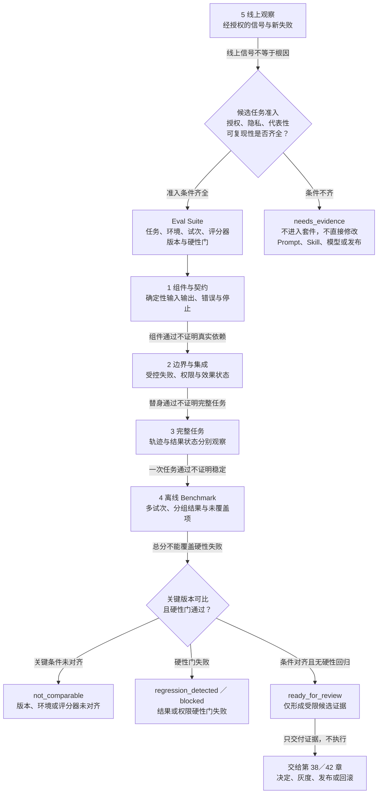

# 39. Harness 测试策略与 Benchmark

> 本章把单次演示拆成五层证据、版本化评估套件、受限基准卡和回归矩阵。任何测试通过、平均分或离线 Benchmark 都不能单独证明真实 Harness 已可靠、安全或适合上线。

## 本章目标

- [x] 将 Harness 验证拆成组件与契约、边界与集成、完整任务、离线 Benchmark 和线上观察五层。
- [x] 为评估套件（Eval Suite）写出任务、环境、试次、评分器、硬性门和未覆盖范围。
- [x] 用基准卡（Benchmark Card）限制分数的构念、数据、场景和版本边界。
- [x] 用回归测试矩阵（Regression Test Matrix）比较同条件基线与候选，识别不可比较和硬性回归。
- [x] 为虚构最小 Harness 设计受控成功、工具失败、权限拒绝和上下文缺失四类任务。

## 为什么要学

最容易被误读的 Harness 证据，是一段顺利完成的演示：输入完整，工具正常，模型一次选对路径，最终文本也符合预期。它很适合解释概念，却没有回答工具失败时是否误报成功、权限拒绝时是否继续生成动作、上下文缺失时是否补猜，也没有回答下一次运行或下一个版本是否仍然成立。

传统软件测试仍然重要，但 Agent Harness 把非确定性模型、动态上下文、多轮状态、工具边界、权限与外部效果放进同一条任务路径。Anthropic 的工程文章将任务（task）、试次（trial）、评分器（grader）、轨迹（transcript）、结果状态（outcome）、评估 Harness（evaluation harness）与智能体 Harness（agent harness）分开，并指出评估“一个 Agent”实际涉及模型与 Harness 的组合 [REF-061]。这些是该文章的工程定义，不是行业标准；本章借它们提醒读者：输入、尝试、轨迹和结果状态不能被压缩成一句“跑通了”。

本章不追求一个适用于所有 Agent 的统一分数，也不提供公开排行榜。它建立一套可审查的测试结构，使团队能说明当前证据来自哪一层、覆盖哪些场景、与哪个版本可比，以及遇到哪类失败必须停止。

## 前置知识

- 前置章节：第 10 章的状态与恢复边界，第 11、12 章的工具结果、环境与权限，第 15 章的观察记录，第 17 章的评估规格（Evaluation Spec）与质量门，第 31 章的 API／UI 分层测试，以及第 38 章的评估与批准责任断点。
- 技术前提：能够阅读测试用例、结构化对象、版本字段和简单的结果矩阵。
- 不要求：真实 Agent、模型 API、工具服务、测试平台、生产日志、在线实验、账户、凭证、发布或回滚环境。

## 场景引入：一个成功用例掩盖了三条失败路径

**场景：** 团队为一个虚构的最小 Harness 准备了四类教学任务。第一类提供完整上下文和受控工具成功结果；第二类注入可分类的工具失败；第三类注入权限拒绝；第四类缺少完成任务必需的上下文。所有输入都是手写的教学对象，不来自真实模型、文件、网络、权限系统或用户流量。

**成功标准：** 测试策略必须分别说明四类任务的预期结果、允许轨迹、禁止效果和证据缺口；任何一个任务通过都不能替代其他任务。候选版本只有在关键版本一致、硬性门没有失败且证据完整时，才可以进入人工复核，而不是直接发布。

**边界：** 本章不运行这四类真实任务，不产生真实轨迹、结果状态、分数或线上指标。纯内存示例只检查注入的教学记录；Mermaid 图只表达本书的证据责任路由，不表示真实测试、Benchmark、线上观察或发布已经发生。

## 核心概念

### 单次试次只是记录，不是系统结论

在 Anthropic 的术语中，任务（task）有明确输入和成功标准；每次尝试是一个试次（trial）；评分器（grader）检查表现的某一部分；轨迹（transcript）保存一次试次的交互；结果状态（outcome）则关注环境最终发生了什么 [REF-061]。对本章而言，重要的不是照搬这些英文名，而是保留它们之间的断点。

假设虚构 Harness 输出“已完成”。这句话最多是轨迹中的一条内容。如果任务目标是产生一个外部状态，那么仍需独立的结果观察。反过来，即使结果状态满足目标，也不能自动说明过程没有越过权限、使用了允许工具或保持了成本边界。因此至少要同时问：

1. 这是什么任务和版本？
2. 这是第几次试次，输入和环境是否相同？
3. 轨迹记录了什么，哪些内容不可用或未保存？
4. 最终状态由什么独立观察支持？
5. 哪些评分器作出什么受限判断？
6. 还有哪些场景和风险没有覆盖？

`one_green_trial` 不等于 `reliable_harness`。它只说明一个具名输入在一个具名条件下留下了一条可继续检查的记录。

### 五层测试模型：每层回答一个不同的问题

本书将 Harness 测试组织成五层。这不是按用例数量定义的行业“测试金字塔”，也不规定各层应占多少比例。层级表达的是隔离程度、诊断成本和接近真实任务语境的程度。

| 层级 | 主要问题 | 典型证据 | 通过后仍不能证明 |
| --- | --- | --- | --- |
| 组件与契约 | 纯逻辑是否按输入契约分类和停止？ | 公开输入输出、错误类型、状态迁移 | 模型、工具和生产环境可用 |
| 边界与集成 | 数据跨越工具、权限或适配器边界时是否保持契约？ | 请求／结果关联、受控失败、效果状态 | 真实依赖稳定，替身与生产一致 |
| 完整任务 | 一条端到端任务的轨迹与结果状态是否满足规格？ | 任务卡、轨迹、结果观察、多个评分器 | 多次运行稳定，未测场景也成立 |
| 离线 Benchmark | 版本化任务集能否识别能力、回归和鲁棒性变化？ | 多试次记录、分组结果、硬性门、基线 | 线上分布、真实用户效果或部署安全 |
| 线上观察 | 使用环境中出现了哪些新失败与分布变化？ | 经授权的观察、反馈、候选任务 | 根因、标准答案或自动修改许可 |

层级不是从“低级”走向“高级”的替代关系。组件测试定位精确，完整任务测试语境更强；前者不能被后者取代，后者也不能由大量组件测试推导出来。一个成熟套件往往同时保留多层证据，并把失败尽量定位到最小层级。

### 组件与契约层：先隔离确定性逻辑

指令装配、输入校验、工具路由、状态迁移、错误分类和质量门中的纯逻辑，通常可以在不调用模型或外部系统时测试。这里的价值是可重复和可定位：同一输入应得到同一公开结果，失败原因应落在明确字段中。

以四类教学任务为例，组件层可以检查：

- 受控成功场景是否包含必需上下文与结果契约；
- 工具失败是否被保留为可分类错误，而不是被字符串包装成成功；
- 权限拒绝是否保持 `denied`，且不生成“继续执行”的路由；
- 上下文缺失是否输出补证或停止，而不是推测缺失值。

这些检查只证明注入对象符合本书规则。它们不证明真实策略引擎拒绝了请求，不证明工具没有产生副作用，也不证明模型会选择相同路径。

### 边界与集成层：替身必须能够失败

集成层关注适配器、权限、工具结果和状态记录之间的接口。受控替身可以让团队稳定复现超时、拒绝、明确失败和效果未知，但一个永远返回成功的替身会把最重要的边界隐藏起来。

本书建议边界记录至少包含请求、关联标识、适配器版本、受控响应、效果状态、错误类型、停止出口和清理责任。测试应检查外部可观察结果，不以“某个替身（mock）被调用一次”代替任务结果。替身通过只说明 Harness 能处理该替身表达的行为；真实 API、文件、数据库、浏览器或权限系统仍需在隔离环境中另行验证。

### 完整任务层：轨迹和结果状态互相不能替代

完整任务把指令、上下文、工具、环境和评分器放入同一条受控路径。Anthropic 的文章特别区分 transcript 与 outcome：一个 Agent 可以在轨迹里说“已完成”，但结果状态要由环境中的实际状态判断 [REF-061]。本章把这一区分扩展为两个检查方向：

- `reported_success ≠ observed_outcome`：报告成功不等于结果已存在；
- `clean_trace ≠ correct_outcome`：过程看起来合理不等于结果正确。

NIST AI RMF Core 的 Measure 功能在风险管理语境中要求记录测试集、指标和工具细节，并关注与部署条件相近的评估、运行期监测及超出开发条件时的泛化限制 [REF-062]。这不是本章的固定测试流程，也不是认证要求；它提醒我们把环境条件和限制写进证据，而不是只保存一个分数。

完整任务卡应关联任务版本、环境摘要、允许与禁止效果、轨迹证据、结果观察、评分器、硬性门和未知项。超时、缺证据和结果失败要分开：无法观察结果时应标为不可判定，而不是假装已证明失败或成功。

### Eval Suite：固定集合是一份版本化契约

评估套件（Eval Suite）不是一个文件夹，也不是把历史缺陷随手堆进列表。它应回答“测什么、在哪测、怎样判定、何时停止”。本书建议至少记录：

| 字段 | 要回答的问题 |
| --- | --- |
| 套件与任务版本 | 当前结果对应哪一组任务和定义？ |
| 目标用途与分布 | 套件模拟哪些用户、输入和环境，不覆盖哪些？ |
| 环境契约 | 模型、工具、权限、数据和替身处于什么条件？ |
| 试次策略 | 哪些任务需要重复，怎样保留试次级结果？ |
| 评分器版本 | 每个评分器读取什么证据，能判断什么？ |
| 硬性门 | 哪些失败不能被其他分数抵消？ |
| 聚合与停止 | 怎样汇总，何时输出补证、不可比较或阻塞？ |
| 负责人和刷新条件 | 谁维护任务，哪些变化要求重建基线？ |

Anthropic 将能力评估（capability eval）与回归评估（regression eval）分开：前者探索 Agent 能做好的事情，后者保护已经能够处理的任务不发生倒退 [REF-061]。本书不采用文章中的任何固定通过率建议。对于项目而言，更重要的是用途分离：探索性难例可以保留失败以暴露能力边界；回归项则必须写清已经建立的基线和不可接受的倒退。二者不应共享一个模糊的“总分及格线”。

OpenAI 的动态评估指南建议使用面向具体任务、接近真实分布的评估，持续运行并以人工反馈校准自动评分，同时把只依赖通用指标或主观感觉列为反模式 [REF-117]。该页在写作日还包含旧 Evals 平台的停用提示，因此本章只使用这些高层建议，不引用其产品操作、模型选择或示例阈值。

### 试次与评分器：保留差异，不伪造精确度

模型输出可能随试次变化。多次运行能够暴露波动，但“需要运行多少次”没有一个适用于所有任务、风险和决策成本的数字。本章不设置统一试次数、置信区间或显著性阈值；真实项目若需要统计判断，应由任务分布、样本、误判代价和独立方法共同决定。

评分器也不应被当作同质分数来源。代码检查适合确定性契约；模型评分适合按明确评分标准（Rubric）检查开放式质量，但需要版本和校准；人工判断能处理语境与责任问题，却可能存在分歧且成本更高。每个评分器都应记录输入证据、方法、版本、结果和限制。

本书把结果拆成五个维度：任务结果、过程约束、安全／权限边界、鲁棒性和资源信号。HELM 论文在语言模型评估语境中采用场景与多指标结构，并显式讨论缺失或代表不足的部分 [REF-119]。本章不复用其场景、指标或数值；只借用“多维结果要暴露权衡和缺口”的研究背景。

最重要的聚合规则是：硬性门不能被平均。候选即使在三个成功任务上得分更高，只要权限拒绝任务出现越界候选，就应标记 `regression_detected` 或 `blocked`。步骤数、token 和时延只能作为诊断或第 40 章的资源输入，不能补偿结果或权限失败。

### Benchmark Card：先解释测量对象，再解释分数

Benchmark 的问题通常不是“有没有数字”，而是数字被拿去支持了什么结论。Raji 等的立场论文讨论了少数高影响 Benchmark 被当作广泛、通用进步替代指标时的构念效度问题 [REF-118]。这不意味着所有 Benchmark 都无效；它要求我们先确认任务、数据和指标是否真的测量了声称的对象。

本书用基准卡（Benchmark Card）限制结论范围：

| 字段 | 需要公开的边界 |
| --- | --- |
| 目标用途 | 用于探索能力、保护回归、比较候选，还是发现风险？ |
| 目标场景与人群 | 哪些输入、语言、工具和环境属于目标分布？ |
| 被测构念 | “正确”“安全”“鲁棒”具体由哪些可观察标准表达？ |
| 任务与数据来源 | 数据如何获得、版本是什么、是否可能被重复优化？ |
| 指标与评分器 | 每个值如何产生，哪些判断需要人工复核？ |
| 已知缺口 | 哪些场景、风险、群体或效果没有测量？ |
| 可比条件 | 哪些模型、Harness、环境和评分器版本必须一致？ |
| 适用期限与责任 | 何时重查，谁负责修订或停用？ |

本书把固定任务被反复用于优化、结果逐渐只反映对该集合的适配，视为需要记录的工程风险。当前来源足以支持构念与多指标边界，但不提供本书的污染检测算法。因此，保留集、轮换集或污染识别若在后续版本中展开，必须另补一手方法来源；本章只把“数据是否被反复用于优化”列为需要记录的风险。

### 离线 Benchmark 与线上观察：反馈先成为候选

离线套件提供可重复条件，线上观察提供真实使用中的新问题。两者不能互相冒充：离线通过不等于线上有效，线上投诉、点赞或一次事故也不等于标准答案。

线上信号进入套件前，应先形成候选卡，记录来源类别、授权与隐私状态、去标识化状态、任务分布、失败症状、可复现性、影响、证据缺口和负责人。没有这些字段时，它只能提示“需要调查”，不能直接改 Prompt、Skill、模型或评分规则。

OpenAI 指南把日志中的案例与持续评估联系起来 [REF-117]；NIST Core 则在风险管理语境中讨论运行期监测、用户反馈和持续更新测量方法 [REF-062]。两项来源都不授权收集数据，也不规定本章的准入流程。本书的候选卡、隐私门和套件准入是工程扩展，真实项目必须依据适用制度和用户授权另行设计。

### Regression Test Matrix：不可比较也是有效结论

回归测试矩阵（Regression Test Matrix）把基线与候选放在同一张表中。它不只记录分数差，还要对齐 Harness、模型、工具、任务集、环境、评分器和数据版本。

| 比较项 | 基线 | 候选 | 判定问题 |
| --- | --- | --- | --- |
| Harness 版本 | 具名版本 | 具名版本 | 改动范围是否明确？ |
| 模型与参数 | 具名配置 | 具名配置 | 是否只比较了计划中的变量？ |
| 工具／环境 | 具名版本 | 具名版本 | 依赖条件是否一致？ |
| 任务集与数据 | 套件版本 | 套件版本 | 场景或数据是否变化？ |
| 评分器 | 方法和版本 | 方法和版本 | 评分标准是否可桥接？ |
| 硬性门 | 分组结果 | 分组结果 | 是否有不可被平均的失败？ |
| 未覆盖项 | 明确列表 | 明确列表 | 新结论是否越过覆盖范围？ |

关键版本缺失、环境不同或评分器变化且没有桥接证据时，正确输出是 `not_comparable`，而不是勉强算出差值。候选修复工具错误分类，却让权限拒绝路径产生越界动作时，矩阵应同时记录局部改善与硬性回归。第 42 章才决定如何将这类证据用于灰度、A/B 或回滚；本章最多输出 `ready_for_review`、`needs_evidence`、`not_comparable`、`regression_detected` 或 `blocked`。

## 架构图：五层测试与离线／线上证据回路

下图回答：版本化评估套件怎样依次向组件与契约、边界与集成、完整任务和离线 Benchmark 提供条件，并在比较条件或硬性门不成立时保守停止；线上观察又怎样先成为候选任务，而不是直接修改 Prompt、Skill、模型或发布？可编辑源为 [Mermaid 源](../../diagrams/mermaid/chapter-39-harness-testing-evidence-loop.mmd)；Diagram Review 已导出并查看 [SVG](../../diagrams/exported/chapter-39-harness-testing-evidence-loop.svg) 与 [PNG](../../diagrams/exported/chapter-39-harness-testing-evidence-loop.png)。

读图时应保留四条断点：组件通过不证明真实依赖，替身通过不证明完整任务，一次任务通过不证明多次运行稳定，总分也不能覆盖结果或权限硬性门。`ready_for_review` 只把受限证据交给第 38／42 章；图中没有从该节点直接进入发布或线上观察的箭头。线上信号只有在授权、隐私、代表性与可复现性条件齐全时才能回到 Eval Suite，条件不足时停在 `needs_evidence`。

## 工作流程：把一次变更送入可比较证据链

1. **定义声明：** 写明本次要证明的是能力、回归、鲁棒性还是某项硬性边界，并列出不能主张的内容。
2. **选择层级：** 将确定性逻辑放在组件层，将适配器与错误放在边界层，将用户可见目标放在完整任务层。
3. **版本化套件：** 固定任务、环境、输入、试次策略、评分器、硬性门和未覆盖范围。
4. **保存试次：** 保留每次任务的轨迹、结果观察、评分器输出和未知项，不只保留平均值。
5. **检查基准卡：** 确认任务和指标确实支持当前构念与目标场景。
6. **对齐回归矩阵：** 比较基线与候选的关键版本；无法对齐时停止为 `not_comparable`。
7. **执行硬性门：** 结果、权限、不可解释效果等失败不能被其他维度抵消。
8. **进入复核：** 只将受限证据送给第 38／42 章的批准与发布流程，不在本章自动发布。
9. **审查线上候选：** 新观察先经过授权、隐私、代表性和可复现性检查，再决定是否加入离线套件。

## 最小示例：四类 Harness 任务

本章已按[示例计划](39-harness-testing-strategy-and-benchmark.example-plan.md)实现纯内存函数 `assessHarnessEvaluationPlan(input)`。它只读取注入的套件版本、四类场景、环境摘要、试次／评分器记录、硬性门和基线／候选矩阵，并返回受限教学状态。

| 场景 | 注入条件 | 预期受限结论 | 禁止主张 |
| --- | --- | --- | --- |
| 受控成功 | 上下文完整，工具结果明确，结果证据齐全 | 候选评估计划可以进入离线复核 | 真实任务、模型或工具已成功 |
| 工具失败 | 返回可分类错误，效果状态明确 | 失败保持可见，不能误报成功 | 生产工具一定以相同方式失败 |
| 权限拒绝 | 注入策略拒绝，动作不得进入执行候选 | 权限硬性门通过或失败可明确判断 | 真实身份、授权或策略系统已验证 |
| 上下文缺失 | 缺少完成任务的必要证据 | 输出补证、停止或 `needs_scenarios` | 模型能安全补全缺失事实 |

该函数只能返回 `ready_for_benchmark`、`needs_scenarios`、`needs_trials`、`not_comparable`、`regression_detected`、`needs_review` 或 `blocked`，所有路径均固定 `executionPerformed: false`。它不会调用模型、工具、文件、网络、权限、日志、CI、发布或回滚系统。`ready_for_benchmark` 只是示例内部状态，表示注入对象可以进入离线复核；它不等于章节级的 `ready_for_review`，也不表示真实 Benchmark 已运行。

## 逐步增强

1. 从四类纯内存场景开始，先验证套件字段和保守路由。
2. 有真实适配器后，在隔离环境增加边界测试，并记录替身与真实接口的差异。
3. 有可清理的完整任务环境后，增加轨迹和结果状态的双重观察。
4. 数据授权、隐私和责任明确后，才建立线上观察的候选回流。
5. 需要资源优化时进入第 40 章；需要安全审计时进入第 41 章；需要发布实验与回滚时进入第 42 章。

每一步只增加一种新的证据能力。没有真实环境时，不用更复杂的受控替身假装端到端验证已经发生。

## 完整工程案例：局部改善伴随权限回归

**背景：** 虚构团队修改了工具错误分类，希望让 Harness 在失败时给出更清晰的原因。候选版本在“工具失败”任务上从不可分类错误改为明确错误，看起来是一项改善。

**约束：** 四类任务必须使用同一套件、环境和评分器版本；权限拒绝是硬性门；资源指标只作诊断；没有真实模型、权限系统或发布环境。

**证据：** 回归矩阵显示，候选版本在工具失败任务上改善，但在权限拒绝任务中生成了一个继续执行候选。成功任务分数和平均值即使更高，也不能覆盖该硬性失败。

**判定：** 输出 `regression_detected`，记录局部改善和权限回归，进入人工复核。不能说候选“整体更好”，也不能自动回滚或发布。若评分器版本与基线不同且没有桥接证据，则连回归判断也应停止为 `not_comparable`。

这个案例说明，本章所说的 Benchmark 价值不在于生成一个汇总数字，而在于让相互冲突的变化同时可见。

## 实现说明

| 决策 | 本书选择 | 原因 | 未实现边界 |
| --- | --- | --- | --- |
| 输入 | 单个纯内存评估计划对象 | 易于审查版本、场景和硬性门 | 不读取文件、环境或日志 |
| 输出 | 状态、代码、下一步和 `executionPerformed: false` | 防止把分类写成执行 | 不发布、不回滚、不调用工具 |
| 比较 | 套件、环境、模型、工具与评分器版本对齐后再比较 | 避免条件漂移造成伪改善 | Harness 版本可作为候选变量；不计算统计显著性 |
| 硬性门 | 单独检查并优先路由 | 不让平均分覆盖权限或结果失败 | 不实现真实安全策略 |
| 线上候选 | 不属于本示例输入 | 保留授权、隐私和责任边界 | 不接入生产数据 |

Node 内置测试覆盖完整可比计划、计划缺项、场景缺失、试次缺失、比较条件错配、硬性门回归、不可判定试次和外部执行请求。已实际运行 `node --test examples/agent/harness-evaluation-plan-assessment.test.mjs`，结果为 8 项通过、0 项失败。演示命令 `node examples/agent/harness-evaluation-plan-assessment.mjs` 输出 `ready_for_benchmark`、`evaluation_plan_ready`、`continue_to_offline_review` 与 `executionPerformed: false`。

## 测试与验证

| 层级 | 验证对象 | 方法 | 成功标准 | 当前状态 |
| --- | --- | --- | --- | --- |
| 图示 | 五层测试与证据回路 | Mermaid 源、SVG／PNG、正文代码块与替代说明 | 图源一致，停止出口与责任边界可读 | 已导出并目视检查；正文与图源逐字一致 |
| 组件 | 评估计划分类逻辑 | Node.js 纯内存测试 | 缺场景、缺试次、硬性失败与不可比较均保守路由 | 已运行：8 项通过、0 项失败 |
| 边界 | 受控工具/权限错误契约 | 隔离替身测试 | 错误和效果状态保持可观察 | 未实现 |
| 完整任务 | 四类任务的轨迹与结果 | 受控端到端任务 | 每类任务满足独立标准和禁止效果 | 未运行 |
| 离线 Benchmark | 版本化套件与回归矩阵 | 多试次、分组报告 | 硬性门与未知项不被聚合隐藏 | 未运行 |
| 线上观察 | 候选任务准入 | 授权、隐私、代表性与复现审查 | 未审查信号不进入套件 | 未接入 |

Example Implementation 已完成纯内存分类器、Node 内置测试和演示；Diagram Review 已完成图源、导出和视觉检查。它们都没有运行真实任务、模型、工具、Benchmark 或线上验证。

## 工程实践

- **把版本写进证据：** Harness、模型、工具、环境、任务集、数据和评分器缺一项，跨版本比较都可能失真。
- **保存试次级结果：** 聚合报告服务浏览，原始试次服务诊断和复核；不要只保存平均数。
- **把硬性门单独呈现：** 结果、权限和未知效果不能与资源或风格分数相抵消。
- **让不可比较成为正式状态：** `not_comparable` 比伪造趋势更有工程价值。
- **给 Benchmark 写适用期限：** 场景、数据和工具变化后，旧基线需要重查。
- **线上信号先候选化：** 授权、隐私、责任和可复现性不明时，不进入离线套件。

## 最佳实践

- 从失败代价最高且可观察的硬性门开始，不从最容易提高的平均分开始。
- 每个测试层级都写“通过后仍不能证明什么”，防止证据跨层外推。
- 将能力评估与回归评估套件分开维护，让探索失败和发布回归承担不同语义。
- 为模型评分器和人工评分标准记录版本与校准证据，不假设评分标准永久稳定。
- 在报告中并列展示分组结果、硬性失败、未覆盖项和环境条件。
- 只有同条件基线与候选才能支持改善或回归结论。

## 常见错误

| 错误 | 表现 | 根因 | 修复方向 |
| --- | --- | --- | --- |
| 只测快乐路径 | 一次成功后宣布 Harness 完成 | 没有失败、拒绝和缺证据场景 | 至少加入工具失败、权限拒绝和上下文缺失 |
| 用替身调用次数代表结果 | 适配器被调用就算任务成功 | 测了实现细节，没有观察结果 | 断言公开结果、效果状态和停止路径 |
| 把模型自评当真值 | 模型说完成就记录通过 | 轨迹与结果状态混淆 | 独立观察结果状态，并记录不可判定 |
| 让平均分覆盖硬性失败 | 权限越界仍因总分上涨而放行 | 聚合规则没有风险优先级 | 将权限、结果和未知效果设为独立硬性门 |
| 条件不同仍比较 | 评分器或环境变了仍报告提升 | 缺版本和可比条件 | 输出 `not_comparable`，重建基线或补桥接证据 |
| 公开 Benchmark 高分外推产品 | 排名被当作线上可靠性 | 构念和分布没有对应 | 使用 Benchmark Card 限定结论 |
| 未审查线上日志直接入集 | 敏感数据或噪声成为任务 | 缺授权、隐私和责任门 | 先形成候选卡，再审查准入 |

## 安全与边界

- 权限边界：测试计划、评估通过和 `ready_for_review` 都不授予模型、工具、文件、网络、账户、发布或回滚权限。
- 数据边界：本章没有读取生产日志、用户输入、个人数据、凭证、真实任务集或公开 Benchmark 数据。
- 统计边界：没有运行多试次、计算置信区间、显著性、成功率、成本或时延；正文不提供伪造阈值。
- 评估边界：模型评分器、人工反馈和硬性检查都只回答其具名标准，不能自动证明完整系统质量。
- 线上边界：离线通过不等于线上有效；线上信号也不自动成为根因、标准答案或变更许可。
- 发布边界：本章只形成候选证据；批准、A/B、灰度、发布和回滚由第 38／42 章承担。

## 章节总结

Harness 测试不是把更多用例塞进一个目录，而是让不同证据各就其位。组件层定位确定性逻辑，边界层检查适配器和失败契约，完整任务层关联轨迹与结果，离线 Benchmark 以版本化套件比较变化，线上观察则发现离线集合没有覆盖的新问题。

Eval Suite 说明测什么，Benchmark Card 说明分数能支持什么，Regression Test Matrix 说明候选是否与基线可比。三者共同阻止一次演示、一个平均分或一条线上反馈越权成为系统结论。第 40 章将继续处理资源信号：token、时延和成本在本章只是诊断字段，不能代替正确性和硬性边界。

## 练习

1. 为一个只读研究 Harness 将六个候选检查分配到组件、边界、完整任务或离线 Benchmark 层，并说明错误分层的后果。
2. 为四类教学任务补一张 Eval Suite 表，标出硬性门、诊断指标和未覆盖范围。
3. 审查一张只给总分、不提供任务/环境/评分器版本的报告，列出三个不能成立的结论。
4. 比较两份评分器版本不同的候选结果，说明为什么应输出 `not_comparable`，以及需要补什么证据。
5. 为一条虚构线上投诉设计候选准入卡，区分症状、可复现任务、隐私状态和尚不能主张的根因。

## 延伸阅读

- REF-061：Anthropic 关于 Agent 评估结构、试次、评分器、轨迹／结果和能力／回归评估的工程背景。
- REF-117：OpenAI 关于任务特定评估、持续评估、日志案例和人工校准的动态指南；产品操作与停用时间线需持续重查。
- REF-062：NIST AI RMF Core 关于风险测量、部署前／运行期评估、记录、适用条件和不确定性的框架背景。
- REF-118：Raji 等关于将少数 Benchmark 外推为广泛通用进步指标时构念效度风险的论文。
- REF-119：HELM 关于场景／指标分类、多指标评估、代表不足项和透明度的语言模型研究背景。

## 参考资料

- [第 39 章候选参考资料](39-harness-testing-strategy-and-benchmark.references.md)
- [第 39 章 Research Brief](39-harness-testing-strategy-and-benchmark.research.md)
- [第 39 章 Chapter Outline](39-harness-testing-strategy-and-benchmark.outline.md)
- [第 39 章 Fact Check](39-harness-testing-strategy-and-benchmark.fact-check.md)
- [全局引用登记](../../.ai/references.md)

## 章节完成检查表

- [x] Front matter、目标、前置知识和章节依赖已建立。
- [x] First Draft 为原创表达，来源事实、本书工程模型与虚构教学输入已分开。
- [x] REF-061、REF-117、REF-062、REF-118、REF-119 的用途与外推禁区已按写作日资料限定。
- [x] Mermaid 图源、SVG／PNG、正文图块和视觉审查已完成，正文与图源逐字一致。
- [x] 纯内存示例、测试与演示已实施，并已由主线程接入共享 npm 入口。
- [x] Technical Review 已完成，来源、职责、术语和阶段边界已复核。
- [x] Diagram Review 已完成，图中状态、箭头、停止出口与章节职责一致。
- [x] Fact Check 已完成，来源事实、本书模型、虚构案例和纯内存运行证据已分离。
- [x] Language Editing 已完成，术语、主语、阶段时态、图文／表文和章节衔接已复核。
- [x] Final Review 已完成；8 项测试、演示、固定版本图示导出、视觉检查和章级工件均已复核。
- [ ] 全章共享 `npm run validate` 与状态同步由主线程执行。
