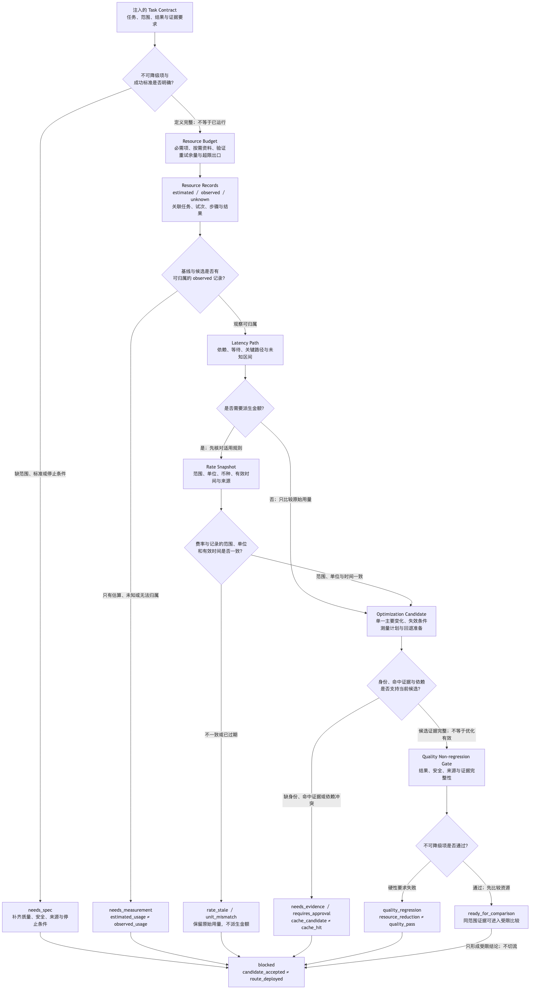
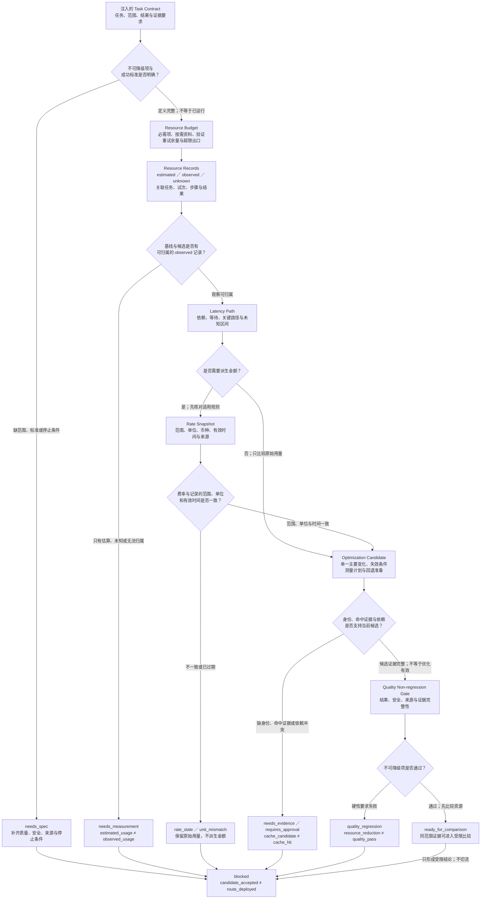

# 40. 成本、延迟与 Token 管理

> 本章把资源限制写成可审查的架构输入：先声明哪些质量和安全条件不可降级，再预算、测量和定位瓶颈，最后只接受通过同一质量门的优化候选。

## 本章目标

- [ ] 写出资源预算（Resource Budget），分开不可降级项、阶段预算、重试余量、未知项和超限出口。
- [ ] 用资源记录（Resource Record）区分估算与实际观察，并把模型、检索、工具、验证和重试归入同一任务与试次。
- [ ] 用延迟路径（Latency Path）识别真实依赖和关键路径，不把并行步骤耗时简单相加为用户等待。
- [ ] 用费率快照（Rate Snapshot）关联用量、费率范围、单位、币种和有效时间；条件不足时保留为未知。
- [ ] 为缓存、摘要、并行、批处理或模型路由建立优化候选（Optimization Candidate），并通过质量不降级门（Quality Non-regression Gate）判断是否可比较。

## 为什么要学

一个 Harness 可能交付正确结果，却在每次运行时重复加载同一资料、重复调用相同工具、串行等待本可独立的只读步骤，或在失败后无条件重试。它也可能走向另一个极端：为了少用 Token、缩短等待或降低一次调用的费用，删除来源指针、事实核验、安全检查和失败出口。前者难以长期运行，后者只是更快地得出不可接受的结果。

成本、延迟和 Token 因此不能只在月底账单或超时告警出现后处理。它们应在任务开始前进入契约，在运行中留下可归属记录，在优化时与质量证据一起比较。资源变少只是一个观察；只有任务结果、安全边界、来源新鲜度和必需证据仍满足要求，资源改善才有资格成为工程结论。

本章不提供厂商价格表、模型排行、上下文窗口、缓存阈值、延迟目标或统一计费公式。动态产品页面在写作日已重新读取，但正文只保留与论证直接相关的限定机制；任何价格、模型范围、接口字段或产品行为在后续审查和出版前仍需再次核验。

## 前置知识

- 前置章节：第 6 章的 Context Packet，第 17 章的 Evaluation Spec 和证据矩阵，第 18 章的重试预算与恢复出口，第 19 章的压缩记录，以及第 39 章的固定任务集与 Benchmark 边界。
- 技术前提：能够阅读结构化记录、依赖图、时间范围、状态和单位；理解“估算”“观察”“派生结论”不是同一种证据。
- 不要求：真实模型调用、供应商账户、账单、价格合同、缓存服务、批处理系统、性能追踪、网络、并发运行或监控平台。

## 场景引入

**场景：** 一个虚构的研究 Agent 每次接到同类任务，都会重新读取同一组官方来源、重新生成长摘要，随后执行事实核验。团队希望复用稳定的来源元数据与结构化摘要，同时保留来源更新、任务范围变化和引用主张变化时的失效检查。

**成功标准：** 候选优化能够说明哪些材料可以复用、复用依据是什么、何时必须刷新、事实核验为何仍需保留，以及资源比较依赖哪些实际记录。若只有估算、缺少费率范围或质量证据不足，系统应返回补测、补证或停止，而不是报告“已经节省”。

**边界：** 本场景只处理注入的教学对象。没有访问真实网页、模型、账单、缓存、批次、计时系统、文件、网络、账户、凭证或外部工具；案例字段不代表真实 Token、延迟、金额、命中率或性能结果。

## 先定义不可降级项

资源优化的第一步不是寻找最贵的调用，而是回答：哪些步骤即使昂贵，也不能在没有等价证据的情况下删除？

第 17 章已经说明，结果、过程、安全与资源约束应分开检查。Anthropic 的 Agent 评估文章也将任务、试次、评分器、轨迹和结果分开，并在固定任务语境中讨论 Token、延迟、单任务成本和错误率等跟踪项 [REF-061]。这些指标可以描述运行，却不能相互替代。Token 更少不能覆盖错误结果；等待更短不能覆盖权限越界；费用更低不能证明来源仍然有效。

本书建议在优化前建立三栏：

| 类别 | 研究场景中的例子 | 允许的处理 | 不能推导 |
| --- | --- | --- | --- |
| 不可降级项 | 任务范围、当前来源身份、引用主张、事实核验、安全与权限边界、必需结果证据。 | 只有提供等价或更强的证据，才能改变实现方式。 | 因为步骤昂贵或慢，就可以删除。 |
| 可优化项 | 重复装配的稳定元数据、重复生成但有原始证据指针的摘要、无条件重复请求、非关键路径等待。 | 形成带失效条件与回退准备的候选。 | 看起来重复，就一定可复用。 |
| 未知项 | 无法归属的用量、缺失的开始/结束观察、费率适用范围、缓存是否命中。 | 保持 `unknown`，请求测量或补证。 | 缺失等于零，或可以用平均值填补。 |

如果任务范围、成功标准、权限边界或必需证据仍未定义，正确出口是 `needs_spec`。在这个状态下讨论“减少多少”没有意义，因为团队还不知道哪些结果必须保留。

## Resource Budget：预算是运行前契约

资源预算（Resource Budget）不是单独的一项 Token 上限。它描述一个具名任务在特定配置下，哪些内容必须保留、哪些资料可以按需加载、重试可以消耗什么余量，以及超限时允许走向哪里。

Anthropic 的 Token counting 文档在其产品语境中提供发送消息前的输入 Token 估算，并明确该估算与实际消息使用量可能略有差异 [REF-122]。这支持一个重要边界：预算前检查和运行后记录必须分开。它不提供跨模型通用的 Token 预算，也不能把一次预检值当作账单或实际输入事实。

本书的 Resource Budget 至少包含：

| 字段 | 作用 | 缺失时的风险 |
| --- | --- | --- |
| 任务与试次标识 | 说明预算服务于哪个任务和哪类尝试。 | 不同任务的资源被混在一起。 |
| 范围与目标配置 | 关联模型/接口、工具定义、输入和策略版本。 | 预估无法判断是否仍适用。 |
| 不可降级项 | 预先保护结果、安全、来源和验证要求。 | 超预算时误删关键证据。 |
| 必需契约与证据区 | 保留规则、任务、来源身份、未知项和验证输入。 | 模型得到更短但不可审查的上下文。 |
| 可按需资料区 | 声明哪些材料可以通过指针或受控检索加载。 | 一开始装入所有候选资料。 |
| 输出、工具与验证区 | 为候选输出、工具结果和独立验证预留空间。 | 输出挤占验证，或验证被当成额外负担删除。 |
| 重试余量与停止条件 | 将第 18 章的重试边界映射到资源。 | 失败后无限增加调用与等待。 |
| 超限出口 | 指定降载、补测、批准或停止。 | 运行时静默截断或跳过步骤。 |
| 来源、单位与有效时间 | 说明预算如何产生、何时需要重估。 | 旧配置的预算被长期复用。 |

预算的分区顺序也很重要。先保留任务契约（Task Contract）、来源身份、未决风险和验证需要，再考虑可选上下文和输出长度。上下文工程（Context Engineering）的官方工程文章在其语境中建议维护高信号 Token、按需检索并谨慎处理压缩取舍 [REF-068]。本书由此得到的工程扩展是：结构化摘要、指针化和按需加载可以成为候选，但安全规则、来源指针和停止条件不能因为“占空间”被优先删除。

当预算不足时，路由可以是：

- `reduce_optional_context`：只减少已经声明为可选且可恢复的内容；
- `load_on_demand`：保留受控指针，等任务需要时再读取；
- `needs_measurement`：预估来源或目标配置不足，先补测；
- `requires_approval`：缩减将改变任务范围或不可降级项；
- `blocked`：没有安全的降载路径。

这些状态只描述下一步，不执行截断、压缩、模型切换或工具调用。

## Resource Record：估算、观察和未知值分开

预算回答“计划允许消费什么”，资源记录（Resource Record）回答“实际观察到了什么”。如果记录只保留一个总 Token 数，团队无法区分资源来自首次请求、重试、检索、工具返回、验证，还是无法归属的后台工作；也无法判断减少某一项是否会改变结果。

本书的 Resource Record 至少应记录：

| 字段组 | 计划内容 | 证据边界 |
| --- | --- | --- |
| 身份 | 任务、试次、步骤、尝试、父步骤和配置版本。 | 身份冲突时不能合并。 |
| 模型用量 | 输入、输出、缓存相关用量，并标明 `estimated` 或 `observed`。 | 估算不能冒充实际；缓存字段不能自动证明命中正确。 |
| 外部工作 | 检索、工具、验证与重试的调用记录和结果状态。 | 调用次数不等于完成，也不等于业务效果。 |
| 时间观察 | 每个步骤的开始、结束、排队或未知区间。 | 记录存在不代表时钟一致或测量完整。 |
| 结果 | `accepted`、`rejected`、`needs_evidence`、`requires_review` 或失败。 | 不能只统计成功任务。 |
| 来源与单位 | 由哪个接口、日志或教学输入产生，使用何种单位。 | 单位或来源不明时不计算派生值。 |
| 未知项 | 无法归属、未返回或不适用的字段。 | 未知不能被填成零。 |

资源归属必须绑定同一任务、试次和配置。共享缓存、公共检索、后台作业或账单中无法定位到具体任务的部分，应保留为 `unattributed`。将这些消耗平均摊给每个成功结果，会掩盖失败尝试、补证和空跑；只统计成功结果，又会让重试的真实代价消失。

同样，`estimated` 和 `observed` 不能被一个“Token”字段合并。前者适合预算和准入，后者才可能支持运行后的比较。若记录缺配置版本、任务关联、来源或单位，正确出口是 `needs_measurement`，而不是计算一个看似完整的总数。

## Latency Path：关键路径不是所有耗时之和

延迟常被误写成“模型用了多久”。一次 Harness 任务还可能等待排队、检索、工具、验证、人工决定和重试。另一方面，两个真正独立的步骤若并行执行，用户等待并不等于两段耗时相加。因此，需要把时间观察放回依赖关系中。

OpenAI 的延迟优化指南在其产品工程语境中把生成 Token、输入、请求次数、并行、用户感知等待和非 LLM 路径等列为不同优化方向 [REF-120]。本章只使用这类分解思路，不采用页面中的百分比、模型经验或产品功能作为跨系统保证。

延迟路径（Latency Path）包含节点、依赖、开始和结束观察、排队、模型请求、检索、工具、验证、重试等待、用户可见里程碑和未知区间。它要回答三个不同问题：

1. **任务何时真正完成？** 以结果验证和必需责任节点为终点，不以模型停止输出为终点。
2. **用户等待什么？** 区分首个可用反馈、持续进度和最终可接受结果；本章不虚构任何等待目标。
3. **哪条依赖链决定总时长？** 只有实际依赖和观察齐全时，才能识别关键路径。

### 并行不是默认优化

两个只读来源的加载若互不依赖，可以成为并行候选。事实核验依赖读取结果，就不能提前宣称完成。共享写入、审批、权限或外部效果观察也构成顺序约束。判断是否可并行，应至少回答：

- 后一步是否读取前一步输出？
- 两步是否写入同一对象或共享外部状态？
- 任一步失败或取消后，另一条路径的效果是否已知？
- 并行是否会增加总请求、重复工作或取消浪费？
- 结果是否仍可关联到原任务与试次？

任一答案为“是”或“未知”时，`parallel_candidate` 都不能直接晋级。并行可能缩短关键路径，也可能增加总资源；两者需要同时观察。

### 异步批处理不是交互路径的替代品

OpenAI Batch API 文档将不要求即时响应的任务描述为其异步批处理候选，并提供提交、查询状态与取回结果的产品流程 [REF-123]。本章由此引出“交互式关键路径”和“可延后离线工作”的分类，但不采用当前折扣、完成窗口、限额、端点或文件格式。

例如，用户当前需要的来源核验结论不能因为批处理方便而延后到不可知状态；固定任务回归、批量分类或其他不影响当前决定的工作，可以形成 `batch_candidate`。该候选仍需输入可冻结、结果可关联、部分失败可识别，以及完成、取消和取回的记录。正文没有创建真实批次，也没有证明批处理更快或更便宜。

若开始/结束观察缺失、依赖不明、取消效果未知，或写入步骤被误标为独立，Latency Path 应返回 `latency_path_incomplete` 或 `requires_approval`。

## Rate Snapshot：把费率从代码常量变成版本化输入

原始用量和金额不是同一个事实。即使一个供应商响应中提供了用量，金额仍取决于适用产品、计量单位、币种、时间、合同、折扣、税费和其他条件。公开价格页也不能自动解释历史账单或组织合同。

OpenAI API Pricing 页面在写作日可以访问 [REF-124]，但本章不摘录其中任何费率。该页面只作为后续按日期核验产品价格的官方入口。价格可能变化，公开价也不等于合同实际结算。

本书提出费率快照（Rate Snapshot）：

| 字段 | 必须回答的问题 |
| --- | --- |
| 供应商或合同范围 | 这条规则适用于哪个账户、合同或公开产品范围？ |
| 产品与配置版本 | 用量属于哪个明确产品和配置？ |
| 计量类别与单位 | 输入、输出、缓存、工具或其他项目如何计量？ |
| 币种 | 派生金额使用什么币种？ |
| 有效时间 | 费率从何时起适用，何时需要重新核验？ |
| 来源与复核时间 | 哪个官方页面、合同或账单提供规则，何时读取？ |
| 折扣、税费与汇率状态 | 已知、未知还是不适用？ |
| 适用记录范围 | 哪些 Resource Records 可以使用该快照？ |

只有用量单位、费率单位、币种、有效时间与适用范围一致时，才有条件形成派生金额。缺少任一条件，应返回 `rate_missing`、`rate_stale` 或 `unit_mismatch`，并保留原始用量。

访问日期也不能替代生效日期。今天看到的页面值不能被倒推为过去的费率；同样，一个过去保存的快照不能自动用于今天的新模型或新合同。Rate Snapshot 的价值不在于保存一个数字，而在于让后来的维护者知道“这个金额为何可以这样算，以及何时不再可以”。

## Optimization Candidate：一次只改变一个主要变量

当预算、实际记录、延迟路径和费率状态都可审查后，团队才有条件提出优化候选（Optimization Candidate）。候选应包含基线任务与试次、单一主要变化、预期影响、不可降级项、依赖、风险、测量计划、失效条件、回退准备和对照任务集。

一次候选不应同时更换模型、重写 Prompt、删除验证并启用缓存。即使最后结果改善，也无法知道是哪项改变产生作用；若结果退化，也难以安全回退。

本书建议按照以下顺序寻找候选：

1. **消除不必要工作：** 对高度确定的输出，先判断是否可由代码、已有结果或界面完成；但事实核验、安全检查和结果验证不是“多余调用”。
2. **减少重复工作：** 查找重复请求、重复检索、重复工具输出和无条件重试；复用前检查身份、版本、权限和新鲜度。
3. **缩短真实关键路径：** 合并只用于传递中间文本的请求，并行已证明独立的只读步骤，把非即时任务移出交互路径。
4. **压缩高成本载荷：** 使用结构化摘要、指针化或按需加载，同时保留目标、来源、未知项和恢复入口。
5. **比较模型或执行路径：** 只在相同任务、输入版本、试次策略、权限和质量门下比较候选。

这不是一个固定算法。某个任务可能没有可安全消除的步骤；某段上下文也可能已经是满足质量要求的最小集合。没有证据表明某一步重复时，保持现状比盲目删减更可靠。

## 缓存、摘要与按需加载

缓存最容易制造一种错觉：既然内容已经被复用，结果就应当可信。事实上，缓存只回答“某个对象是否按某种身份被复用”，不回答对象是否仍适合当前任务。

OpenAI Prompt Caching 文档在其产品范围内说明，缓存命中要求相同的 Prompt 前缀，并建议把稳定内容放在前部、变化内容放在后部；产品响应还可以报告缓存相关用量 [REF-121]。这些陈述不能外推为其他供应商行为，也不能推出缓存内容正确、权限一致或来源仍然新鲜。

本书建议为每个缓存或摘要候选建立缓存身份（Cache Identity）记录：

| 字段 | 研究场景中的问题 |
| --- | --- |
| 任务用途 | 该对象用于来源导航、摘要还是最终回答？ |
| 稳定对象身份 | 被复用的是 Prompt 前缀、检索结果还是结构化摘要？ |
| 内容与配置版本 | 哪个版本产生了对象？ |
| 来源与主张版本 | 摘要对应哪些来源、哪些待支持陈述？ |
| 权限范围 | 当前任务是否仍有权使用这些内容？ |
| 新鲜度 | 来源或业务条件是否要求重新读取？ |
| 原始证据指针 | 如何回到未压缩的来源或观察？ |
| 命中证据 | 真实系统是否报告了命中，还是只有候选设计？ |
| 失效触发 | 哪些变化会强制刷新或阻塞复用？ |

Prompt 前缀缓存、检索结果复用和摘要复用应分别处理。前缀命中不证明检索结果未过期；检索结果仍可访问也不证明摘要覆盖当前主张；摘要表达流畅更不代表事实已经重新核验。

在本章的虚构案例中，稳定来源元数据与带原始证据指针的结构化摘要可以成为复用候选。只要来源更新时间、任务范围、引用主张、权限、配置或质量规格发生变化，就需要 `refresh_required` 或 `needs_evidence`。事实核验步骤仍读取当前来源，不能被摘要或命中记录代替。

若对象身份、版本、命中证据、原始证据指针或失效条件缺失，输出应是 `cache_evidence_missing`。这里没有创建真实缓存，也没有测量命中。

## 模型与执行路径路由

“选择更小的模型”或“使用更快的路径”听起来像一个资源决策，实际上首先是一个可比性问题。两个候选若使用不同任务、不同来源版本、不同安全要求或不同成功标准，即使结果都叫“通过”，也不能直接比较。

可比性契约至少需要：

- 同一任务定义与范围；
- 同一输入、来源与配置版本，或明确记录受控差异；
- 同一成功标准、权限与安全要求；
- 同一试次策略和必需证据；
- 可关联的 Resource Record 与 Latency Path；
- 有效或明确缺失的 Rate Snapshot。

Anthropic 的 Agent 评估文章将 task、trial、grader、transcript 与 outcome 分开 [REF-061]，有助于提醒我们：比较模型或路径时，不能只看最终文本，也不能只看轨迹中的 Token 和步骤。候选必须在相同任务与结果标准下留下证据。

若目标模型或接口改变，发送前 Token 估算也应针对新目标重新进行；旧配置的预估不能直接复用。正文不列出任何模型名称、上下文窗口、价格、速度或排行，也不声称某一类模型一定更合适。

## Quality Non-regression Gate：质量先于资源比较

质量不降级门（Quality Non-regression Gate）把候选准入分成两个顺序固定的阶段。

### 第一阶段：检查不可降级项

先检查必需结果、安全与权限、来源新鲜度、证据完整性、允许差异和未覆盖项。任一硬性要求失败，立即返回 `quality_regression`。资源降低不能把它改写为“有取舍地通过”。

### 第二阶段：比较资源

只有第一阶段通过后，才比较同范围的 Resource Record、Latency Path 与 Rate Snapshot。此时仍需保留不确定性：

| 状态 | 含义 | 不能主张 |
| --- | --- | --- |
| `ready_for_comparison` | 基线与候选满足当前教学可比性要求。 | 候选更优或已发布。 |
| `needs_evidence` | 质量证据不足或来源需要刷新。 | 资源改善可以弥补证据缺口。 |
| `needs_measurement` | 用量、时间或归属记录不完整。 | 缺失项为零。 |
| `rate_stale` | 费率范围或有效时间不适用。 | 已知金额或节省。 |
| `requires_approval` | 候选扩大范围或影响不可降级项。 | 自动路径可以继续。 |
| `quality_regression` | 指定硬性质量要求未满足。 | 更低资源可作为接受理由。 |

即使候选在当前固定任务中通过，结论也只适用于该任务、输入版本、试次策略和质量规格。`candidate_accepted` 不等于已切流、已发布、未来任务稳定或真实业务效果已验证。

## 架构图：资源优化候选决策流

下图回答：一份注入的 Task Contract 如何先保护不可降级项，再依次形成 Resource Budget、可归属的 Resource Records 与 Latency Path；何时才需要 Rate Snapshot；Optimization Candidate 为什么必须先补齐身份、命中与依赖证据，再经过 Quality Non-regression Gate，最多到达 `ready_for_comparison`？

可编辑源为 [Mermaid 源](../../diagrams/mermaid/chapter-40-resource-optimization-decision-flow.mmd)；Diagram Review 已实际导出并查看 [SVG](../../diagrams/exported/chapter-40-resource-optimization-decision-flow.svg) 与 [PNG](../../diagrams/exported/chapter-40-resource-optimization-decision-flow.png)。图只表达本书的教学责任链，不表示模型、计费、缓存、批处理、并发、网络、文件、时钟、批准、发布或外部系统已经运行。





读图时要守住四条断点：`estimated_usage ≠ observed_usage` 阻止估算冒充实际记录；`cache_candidate ≠ cache_hit` 阻止候选设计冒充命中；`resource_reduction ≠ quality_pass` 让质量门先于资源比较；`candidate_accepted ≠ route_deployed` 则把 `ready_for_comparison` 限定为比较入口。Rate Snapshot 只在需要派生金额的分支出现；不需要金额时可以保留原始用量继续比较，不能据此声称真实费用已知。

## 工作流程

1. **锁定质量底线：** 读取任务范围、成功标准、安全与权限、来源和必需证据；不足时返回 `needs_spec`。
2. **写 Resource Budget：** 分配必需项、按需资料、输出、工具、验证与重试余量，声明超限出口。
3. **收集 Resource Records：** 区分 `estimated` 与 `observed`，关联任务、试次、步骤、配置、单位和结果。
4. **建立 Latency Path：** 记录依赖、开始/结束、等待、用户可见里程碑与未知区间，识别是否存在可并行或可移出的候选。
5. **核对 Rate Snapshot：** 只有范围、单位、币种和有效时间完整时才允许派生金额；否则保留原始用量。
6. **提出单一 Optimization Candidate：** 写明基线、改变、风险、失效条件、测量计划和回退准备。
7. **运行 Quality Non-regression Gate：** 先检查不可降级项，再比较资源；失败、缺证据或范围扩大时停止。
8. **记录受限结论：** 只说明候选在指定任务和证据下的状态，不声称外部路由、缓存或发布已经执行。

## 最小示例：资源优化评估

本章的纯内存示例已实现为 [`assessResourceOptimization(input)`](../../examples/agent/resource-optimization-assessment.mjs)。它只读取注入的 `budget`、`baselineRecords`、`candidateRecords`、`latencyPath`、`rateSnapshot`、`optimizationCandidate` 和 `qualityGate`，返回教学状态、原因与 `executionPerformed: false`。

[Node 内置测试](../../examples/agent/resource-optimization-assessment.test.mjs)覆盖以下 8 条路径：

- 基线或候选只有预估、没有实际观察，返回 `needs_measurement`；
- Rate Snapshot 已过期，返回 `rate_stale`；
- 费率单位与观察单位不匹配，返回 `unit_mismatch`；
- 缓存候选缺命中证据，返回 `cache_evidence_missing`；
- 并行候选存在依赖冲突，返回 `dependency_conflict`；
- 重试超出已声明预算，返回 `requires_approval`；
- 资源减少但质量失败，返回 `quality_regression`；
- 同任务、同范围、同规格且证据完整，最多返回 `ready_for_comparison`。

2026-07-17 已实际运行 `node --test examples/agent/resource-optimization-assessment.test.mjs`，结果为 8 项通过、0 项失败。演示命令 `node examples/agent/resource-optimization-assessment.mjs` 输出 `ready_for_comparison`、`comparable_evidence_ready`、`compare_without_deployment` 与 `executionPerformed: false`。

示例中的 `teaching_units`、次数和数量都是注入的虚构数据，不是供应商价格、Token、实测延迟或缓存命中率；命令没有运行模型、计费、缓存、批处理、并发、网络、文件、时钟或外部工具。

## 完整教学案例：复用摘要，保留事实核验

虚构研究任务有一条基线路径：读取来源、生成结构化摘要、执行事实核验、形成受限结论。资源记录指出，来源元数据和摘要在多个同范围任务中重复出现；它没有说明这些内容可以永久复用。

团队提出一个 Optimization Candidate：

- 版本化保存稳定来源元数据；
- 保存带原始证据指针的结构化摘要；
- 当任务范围、引用主张、来源更新时间、权限或配置变化时失效；
- 事实核验仍读取当前官方来源；
- 候选失败时回到未复用的基线路径。

### 候选决策包

| 工件 | 已知 | 未知 | 允许的下一步 | 禁止结论 |
| --- | --- | --- | --- | --- |
| Resource Budget | 必需来源身份、事实核验和验证不能删除。 | 真实 Token 预算。 | 用定性分区准备候选。 | 已满足供应商限制。 |
| Baseline Resource Records | 教学输入描述了重复步骤。 | 真实用量、延迟与账单。 | 请求可归属的实际记录。 | 已测得浪费。 |
| Cache Identity | 候选包含版本、来源指针与失效条件。 | 真实缓存是否命中。 | 进入 `reuse_candidate`。 | 缓存已创建或内容正确。 |
| 事实核验 | 仍要求读取当前来源。 | 来源未来是否变化。 | 保留质量门。 | 摘要可代替来源。 |
| Rate Snapshot | 状态可为完整、缺失或过期。 | 合同和真实结算。 | 完整时才做教学换算。 | 已知真实节省。 |
| Quality Non-regression Gate | 规定结果、来源和证据要求。 | 评估器是否覆盖未来任务。 | 在当前任务上判断候选。 | 候选已发布或永久有效。 |

这个案例的核心不是“缓存摘要”。核心是保留以下断点：`estimated_tokens ≠ observed_usage`、`cache_candidate ≠ cache_hit`、`cache_hit ≠ fact_verified`、`resource_reduction ≠ quality_pass`、`candidate_accepted ≠ route_deployed`。

如果来源更新，候选必须 `refresh_required`；如果实际用量缺失，只能 `needs_measurement`；如果事实核验被删除，即使教学资源字段看起来更低，也必须 `quality_regression`；如果 Rate Snapshot 过期，只比较原始用量而不输出金额。这里没有真实调用、计费、缓存命中或优化执行。

## 逐步增强

| 新需求 | 必须新增的控制 | 升级触发 | 本章为何不实现 |
| --- | --- | --- | --- |
| 读取真实模型用量或账单 | 账户/项目范围、接口契约、凭证、最小权限、脱敏、计量单位、费率版本和账单核对。 | 必须访问供应商 API、控制台或合同。 | Resource Record 与 Rate Snapshot 只是教学契约。 |
| 创建真实缓存或摘要服务 | 对象身份、租户/权限隔离、来源版本、新鲜度、失效、删除、隐私与命中观察。 | 复用跨请求、用户或任务。 | 本章不创建存储，也不证明缓存安全。 |
| 真实并发或异步批处理 | 依赖图、副作用隔离、容量、限流、取消、幂等、部分失败和结果关联。 | 任务将并行调用或进入后台。 | Latency Path 只描述候选。 |
| 模型路由、A/B 或发布 | 固定评估集、试次策略、版本、范围控制、监控、批准、回滚和漂移检查。 | 候选影响真实请求。 | 第 39、41、42 章负责测试、安全和发布控制。 |

每次增强都要增加与新外部效果相匹配的证据和责任，不能只是给教学状态增加更有力的名字。

## 实现说明

本章的数据流始终保持“原始记录优先，派生结论在后”。它从 Task Contract 开始，但契约存在不表示真实运行已经发生：

```text
Task Contract
  -> Resource Budget
  -> Resource Record + Latency Path
  -> optional Rate Snapshot
  -> one Optimization Candidate
  -> Quality Non-regression Gate
  -> limited decision state
```

这里的箭头只表示工件依赖，不表示程序已经运行。尤其要注意：

- Resource Budget 不预测真实账单；
- Resource Record 不把缺失数据变成零；
- Latency Path 不自行启动并行或批处理；
- Rate Snapshot 不把公开价变成合同结算；
- Optimization Candidate 不执行修改；
- Quality Non-regression Gate 不发布候选，也不保证评估器覆盖未来任务。

## 测试与验证

| 层级 | 验证对象 | 验证方法 | 成功标准 | 当前状态 |
| --- | --- | --- | --- | --- |
| 单元 | 纯内存路由与字段校验 | `node --test examples/agent/resource-optimization-assessment.test.mjs`。 | 缺测量、费率失效、依赖冲突和质量退化进入正确出口。 | 已运行：8 项通过、0 项失败。 |
| 演示 | 注入的可比候选 | `node examples/agent/resource-optimization-assessment.mjs`。 | 输出保留 `executionPerformed: false`。 | 已运行：`ready_for_comparison / comparable_evidence_ready / compare_without_deployment`。 |
| 集成 | 真实模型、计费、缓存或批处理接口 | 需独立环境、凭证和受控测试计划。 | 用量、范围、错误和结果可关联。 | 不属于本章实现。 |
| 端到端 | 候选在真实任务中的质量与资源 | 由第 39、41、42 章的评估、安全和版本化流程约束。 | 结果、安全、来源和资源证据都满足规格。 | 未执行。 |
| 人工审查 | 来源范围、费率适用和不可降级项 | Technical Review 与 Fact Check。 | 动态资料按当日重读，未外推产品行为。 | 已完成：两项审查均有记录。 |

Example Implementation 只完成纯内存教学路由、Node 测试与演示；Diagram Review 独立完成图示导出与视觉检查。没有性能数据、账单、真实缓存命中、并行／批处理或外部执行可以报告。

## 工程实践

- **把资源字段关联到任务和结果：** 只有知道资源支持了哪个结果，才能判断是必要成本、失败成本还是无法归属的消耗。
- **原始用量与金额分开保存：** 费率变化后仍可用新的适用快照重算；历史结论也能回到当时范围复查。
- **让未知值显式传播：** `unknown` 应阻止派生结论，而不是被平均值、默认值或零掩盖。
- **每次只优化一个主要变量：** 让改善与退化都可归因，也让回退更清晰。
- **将质量门放在资源比较前：** 硬性质量失败时立即拒绝，避免“更便宜但错误”进入加权平均。
- **同时观察关键路径和总资源：** 并行可能缩短等待却增加总请求；批处理可能移出交互路径却产生新的完成与失败责任。

## 最佳实践

- 推荐为每个生产候选保留基线任务、配置、来源和证据版本；原因是没有同范围基线，资源变化无法解释。
- 推荐对缓存、摘要和检索结果分别定义身份与失效规则；原因是三者的命中、正确性和新鲜度不是同一问题。
- 推荐在价格或产品配置进入计算时记录适用时间和来源；原因是动态页面不能解释所有历史与合同。
- 推荐将失败、补证、人工复核和成功分别统计；原因是只看成功平均值会隐藏最昂贵的路径。
- 推荐将可并行性写成依赖检查，而不是主观标签；原因是副作用、取消和结果关联可能使“并行”不安全。

## 常见错误

| 错误 | 表现 | 根因 | 修复方向 |
| --- | --- | --- | --- |
| 用总 Token 代替完整成本 | 只报告一个数字，忽略工具、检索、验证、重试与失败。 | 资源未关联步骤和结果。 | 建立 Resource Record，并保留未知项。 |
| 把预估写成实际用量 | 预算前数值被复述为账单或运行结果。 | `estimated` 与 `observed` 未分开。 | 在字段和来源中明确状态。 |
| 硬编码动态费率 | 历史任务被当前公开价重算，或合同价与公开价混用。 | 缺 Rate Snapshot。 | 记录范围、单位、币种和有效时间。 |
| 相加并行步骤得到用户等待 | 总延迟被高估，或排队/验证被漏掉。 | 没有依赖图和关键路径。 | 建立 Latency Path。 |
| 缓存命中等于事实正确 | 来源已变化，摘要仍被直接复用。 | 缓存身份没有来源版本和失效条件。 | 强制刷新并保留事实核验。 |
| 无条件并行或批处理 | 写入竞争、取消浪费、部分失败无法归属。 | 只追求等待缩短。 | 检查依赖、副作用、取消和结果关联。 |
| 一次改变多个变量 | 模型、Prompt、缓存和验证同时改变。 | 候选缺单一主要变化。 | 拆成可回退的 Optimization Candidates。 |
| 用资源改善覆盖质量失败 | 低资源路径未通过来源或安全检查仍被接受。 | 质量门顺序错误。 | 硬性质量先行，失败直接拒绝。 |
| 只报告平均值 | 少数失败、补证和长尾路径消失。 | 结果分类和分布未保留。 | 分开记录状态与范围，不伪造分位数。 |

## 安全与边界

- **权限边界：** 读取账单、供应商接口、缓存内容或追踪数据都需要独立授权；本章记录结构不授予访问权。
- **数据边界：** Prompt、工具输入、检索结果和缓存可能包含敏感信息。复用前必须核对任务、租户、权限和保留策略，具体安全与审计责任由第 41 章展开。
- **财务边界：** 公开价格页不是合同，也不包含所有折扣、税费、汇率或结算条件；金额不足以作为财务报告。
- **执行边界：** `parallel_candidate`、`batch_candidate`、`reuse_candidate` 和 `candidate_accepted` 都不代表调用、缓存、批次、切流或发布已经发生。
- **人类审批点：** 候选扩大范围、改变不可降级项、引入真实外部副作用或费率/责任无法解释时，应进入具名审批或阻塞。
- **不适用范围：** 本章不替代容量规划、财务核算、供应商合同审查、隐私评估、安全审计、SLA 设计、Benchmark、生产发布或回滚流程。

## 章节总结

成本、延迟和 Token 管理的核心不是把一次调用压到最小，而是让每份资源都能回到任务、步骤、结果、来源和责任。可靠顺序是：先保护不可降级项，再写 Resource Budget；运行后用 Resource Record 区分估算、观察和未知；用 Latency Path 找到真实关键路径；需要金额时，用 Rate Snapshot 限定费率；一次只提出一个 Optimization Candidate；最后由 Quality Non-regression Gate 先检查质量，再比较资源。

缓存、摘要、并行、批处理和模型路由都只是候选。它们没有身份、版本、失效条件、实际记录和质量证据时，不应被写成改善。下一章将进一步把安全、权限与审计加入这些资源优化边界；第 42 章再处理候选版本化、A/B、发布和回滚。

## 练习

1. 为一个包含检索、工具和事实核验的虚构任务写 Resource Budget，并指出两类不得因超预算而删除的内容。
2. 将一条只含“总 Token”和“总耗时”的教学日志补成 Resource Record 与 Latency Path；列出仍然不能计算的结论。
3. 为一个结构化摘要写出身份、来源指针、权限范围和失效条件，说明命中为何不能替代事实核验。
4. 设计两个 Optimization Candidates：一个因 `quality_regression` 被拒绝，另一个因 `rate_stale` 只能保留原始用量。
5. 解释为什么两个只读步骤可以成为并行候选，而一个依赖前序结果的事实核验不能；同时说明并行候选为何仍需观察总资源。

## 延伸阅读

- OpenAI API 的 Latency optimization、Prompt caching、Batch API 与 Pricing 页面：只用于产品限定机制与写作日动态核验，不保存当前数字。
- Anthropic Token counting 文档：用于发送前估算与实际消息用量可能不同的产品限定边界。
- Anthropic *Effective context engineering for AI agents*：用于高信号 Token、按需检索与压缩取舍的工程背景 [REF-068]。
- Anthropic *Demystifying evals for AI agents*：用于任务、试次、轨迹、结果和资源指标需在同一评估语境下记录的背景 [REF-061]。

## 参考资料

本章 Research Brief、First Draft 与 Fact Check 在 2026-07-17 读取或重读以下动态官方资料；完整 URL、允许陈述与外推禁区见[第 40 章候选参考资料](40-cost-latency-and-token-management.references.md)。

- REF-120 — OpenAI API：Latency optimization。
- REF-121 — OpenAI API：Prompt caching。
- REF-122 — Anthropic：Token counting。
- REF-123 — OpenAI API：Batch API。
- REF-068 — Anthropic：Effective context engineering for AI agents。
- REF-061 — Anthropic：Demystifying evals for AI agents。
- REF-124 — OpenAI API：Pricing；仅作为动态价格入口，正文未摘录费率。

研究阶段局部键与上述全局编号的映射见[第 40 章参考资料](40-cost-latency-and-token-management.references.md)。本轮 Fact Check 已按 2026-07-17 重读全部动态页面；出版前仍须再次核验，不得用本次访问替代未来检查。

- [第 40 章 Research Brief](40-cost-latency-and-token-management.research.md)
- [第 40 章详细 Outline](40-cost-latency-and-token-management.outline.md)
- [第 40 章示例计划](40-cost-latency-and-token-management.example-plan.md)
- [第 40 章 Fact Check](40-cost-latency-and-token-management.fact-check.md)
- [全局引用登记](../../.ai/references.md)

## 章节完成检查表

- [x] Front matter、目标、前置知识和章节依赖已为 First Draft 补齐。
- [x] 内容为原创表达，来源事实、本书 Resource 工件、虚构案例和未运行范围已区分。
- [x] 动态产品资料已在写作日重读；未摘录价格、窗口、缓存阈值、延迟数字、模型排行或性能结果。
- [x] 图示有 Mermaid 源码、读图说明和一致术语；Diagram Review 已完成。
- [x] 示例有环境、验证方式、结果状态和安全边界；Example Implementation 已完成。
- [x] Technical Review、Example Implementation、Diagram Review 与 Fact Check 已记录。
- [x] Language Editing 已完成。
- [x] Final Review 已完成；已重跑专用测试、演示、Mermaid 11.16.0 导出、图源一致性检查和 PNG 目检。
- [ ] 已运行 First Draft 收口后的 `npm run validate`；由主线程在共享状态整合后执行。
- [ ] `.ai/progress.md`、`CURRENT_STATE.md`、`NEXT_TASK.md` 与交接已更新；由主线程统一处理。
