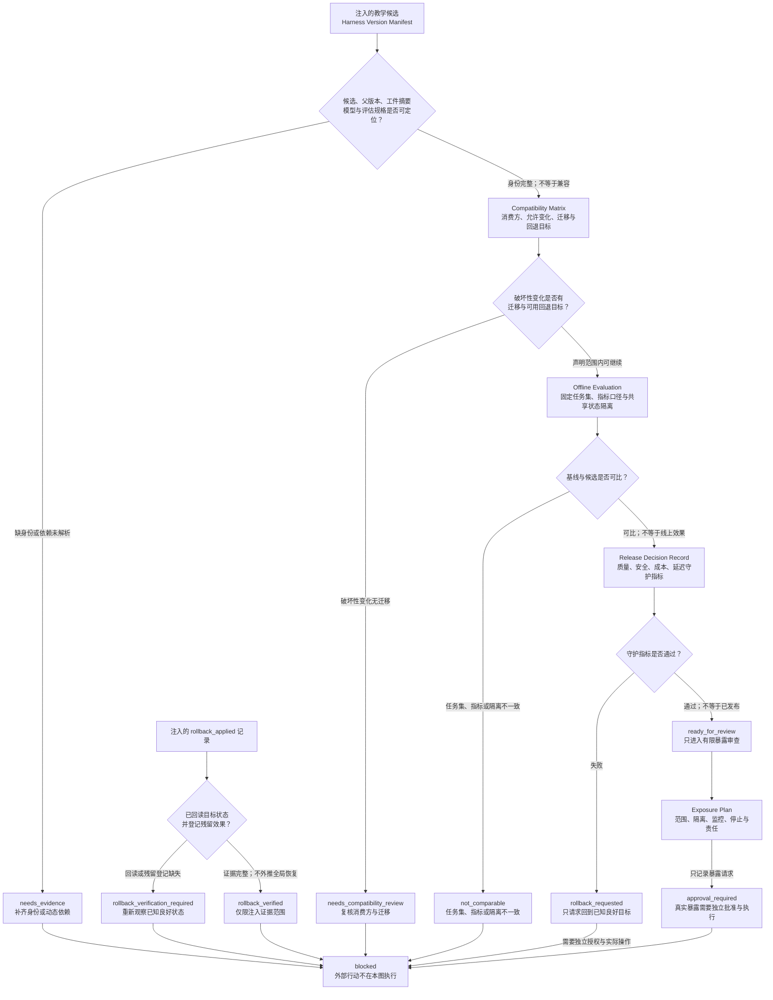

# 42. Harness 的版本化、回滚和 A/B 测试

> 版本号回答“这是什么”，评估回答“在什么范围内表现如何”，发布决定回答“谁允许扩大暴露”，回滚验证回答“目标状态是否真的恢复”。四者不能互相替代。

## 本章目标

- [ ] 为 Prompt、Skill、工作流、模型选择和评估规格建立不可变的版本身份。
- [ ] 用兼容性矩阵说明谁消费哪些契约，以及哪些变化需要迁移或停止。
- [ ] 区分固定任务集离线对照、有限灰度和线上 A/B 测试能够支持的结论。
- [ ] 为质量、安全、成本和延迟建立守护指标与可回放的发布决定。
- [ ] 用回滚 Runbook 区分回滚请求、实际应用、状态回读和恢复验证。

## 为什么要学

Harness 的一次“小改动”可能同时触及多个行为来源。系统提示增加一句规则，Skill 改变触发条件，工作流调整状态出口，模型别名指向新的快照，评估器又更新了评分标准。即使代码仓库只出现一个提交，运行行为也可能由五个不同速度变化的输入共同决定。

如果只保存“最新版本”，团队会遇到三个问题。第一，旧结果无法解释：不知道当时使用了哪一组输入。第二，新旧结果无法比较：任务集、模型或评估规格可能已经变化。第三，出现质量下降时无法安全回退：旧配置也许仍在，但其依赖、权限、外部记忆或数据已经不同。

因此，本章不把版本化理解为给文件加标签，也不把 A/B 测试理解为把两组分数放在一张表里。我们要建立一条可审查的发布实验（Release Experiment）：先冻结候选身份，再声明兼容范围，随后选择合适的比较层级，最后把放行、停止和回滚证据分开记录。

## 前置知识

- 第 17 章的评估规格（Evaluation Spec）和证据矩阵。
- 第 20 章的候选改进协议（Candidate Change Protocol）与变更门。
- 第 34 章的 Skill 契约、版本和弃用。
- 第 39 章的测试层次、评估套件和 Benchmark 边界。
- 第 40 章的成本、延迟和 Token 证据口径。
- 第 41 章的权限、安全决定和审计记录。

本章不要求真实模型账户、实验平台、流量路由、特征开关、监控系统或发布权限。案例只使用虚构的结构化对象；任何外部动作都保持未执行状态。

## 场景引入：两个压缩策略，究竟比较了什么

假设团队维护一个长任务 Harness。当前基线使用“连续摘要”压缩上下文，候选方案改为“按事实、约束、决定和下一步分栏的结构化摘要”。团队希望候选在不降低任务质量的前提下减少输入 Token 和恢复时间。

表面上，这是一场 A/B 比较；实际上至少有六个需要冻结的变量：

1. 基线与候选的 Prompt/Skill 内容；
2. 使用的模型及快照；
3. 固定任务集和输入版本；
4. 评估规格、评分器与通过条件；
5. Token、延迟和费率的记录口径；
6. 记忆、缓存、工具和外部状态是否隔离。

任何一个变量在比较期间漂移，分数差异都可能无法归因。此时最诚实的状态不是“候选胜出”，而是 `not_comparable`。

## 版本身份：Harness 版本清单

Harness 版本清单（Harness Version Manifest）是本书用于冻结一次候选身份的工程工件。它不是软件包管理规范，也不执行发布。

| 字段 | 回答的问题 | 缺失时的风险 |
| --- | --- | --- |
| `candidate_id` / `parent_id` | 候选是谁，从哪个基线派生？ | 无法建立变更谱系。 |
| `instruction_digest` | Prompt、规则和上下文模板是否可定位？ | “同名版本”可能包含不同内容。 |
| `skill_workflow_digest` | Skill 与工作流定义是否固定？ | 触发和状态出口可能同时漂移。 |
| `model_selection` | 使用哪个模型家族、版本或快照？ | 结果变化无法区分来自 Harness 还是模型。 |
| `tool_data_dependencies` | 工具、数据、检索源和权限依赖是什么？ | 旧版本可能无法在当前环境恢复。 |
| `evaluation_spec_id` | 结果按哪一套标准评价？ | 新旧分数可能不在同一尺度。 |
| `artifact_digest` | 已发布内容是否保持不可变？ | 历史证据可能被原地改写。 |
| `owner` / `created_at` | 谁对候选身份负责，何时生成？ | 出现漂移时没有责任入口。 |

OpenAI 的 API 文档指出，模型提示行为可能在快照间变化，并建议固定模型版本、为应用运行评估（REF-014）。这只支持一个受限结论：模型选择应进入 Manifest，且应用仍需自己的评估。它不保证固定快照会产生确定输出，也不保证快照永久可用。

### 不要让别名冒充版本

`latest`、`production`、`recommended` 或没有日期的模型名适合表达选择意图，却不适合单独充当历史证据。Manifest 可以同时记录人类可读别名与解析后的身份，但后续比较必须引用后者。

若依赖只能通过动态别名解析，应把候选标记为 `identity_incomplete`，而不是生成看似精确的版本字符串。版本化的价值来自可定位，不来自格式整齐。

### 案例：系统提示词是有版本语义的接口

Manifest 把 `instruction_digest` 列为必填字段，一个开源项目的经历可以说明这不是形式主义。pi 是 Mario Zechner 开发的开源极简编码代理 [REF-148](https://github.com/earendil-works/pi)。

作者批评 Claude Code 每个版本都会更换系统提示词（System Prompt）与工具描述，原话是 "breaks my workflows and changes model behavior. I hate that."；他为此建立了 cchistory 工具，逐版本追踪其提示词变化 [REF-149](https://mariozechner.at/posts/2025-11-30-pi-coding-agent/)。本书未独立复核该描述，此处以作者观察归属呈现。

这段批评指向一个容易被版本号掩盖的事实：只要有工作流依赖 harness 的行为，系统提示词与工具描述的每次改动就都是一次接口变更。消费者感知到的从来不是版本字符串，而是行为——升级说明里的“若干改进”，可能正是某个下游流程赖以工作的指令被改写。

这也是上一小节“别名冒充版本”问题的另一种形态：harness 的版本号固定了软件工件，却没有声明行为接口发生了什么变化。对提示词而言，版本号本身就是一个未解析的别名。

作为对照，pi 把“提示词稳定、行为可复现”列为设计目标：系统提示词全文可见、可整体替换（具体机制以访问日 2026-07-26 文档为准）[REF-149](https://mariozechner.at/posts/2025-11-30-pi-coding-agent/)。

在验证侧，作者用 Terminal-Bench 2.0 对 pi 做可复现评测——每个任务 5 次试验、公开 runner 与结果——为设计变更提供回归证据 [REF-149](https://mariozechner.at/posts/2025-11-30-pi-coding-agent/)。本书不引用其名次；这里的要点是方法而非分数：提示词改动先经过可复现评测，行为差异才有归因入口。

本书由此延伸出一个工程判断：系统提示词与工具定义是有版本语义的接口，应当整体纳入本章的工件链。下表是本书的工程模型，映射关系不归因于 pi：

| 提示词资产上的事件 | 对应本章工件 | 责任 |
| --- | --- | --- |
| 提示词或工具描述的任何文本改动 | `instruction_digest` 变化，派生新 `candidate_id` | 改动产生新候选，不原地覆盖历史身份。 |
| Harness 升级带来的提示词 diff | Compatibility Matrix 新增行 | 按依赖旧行为的消费方评估变化，diff 进入变更审查。 |
| 提示词改动引起的行为差异 | 固定任务集离线对照 | 用评测回归兜底，使差异可归因、可比较。 |
| 评估规格或任务集同时变化 | 新 `evaluation_spec_id` 与双口径重算 | 分数变化先归因口径，再归因提示词。 |
| 升级后行为劣化 | Rollback Runbook 的 `known_good_manifest` | 已知良好的提示词版本必须实际保留、可恢复。 |
| 提示词不可导出或不可定位 | `identity_incomplete` | 不生成看似精确的版本字符串，先补齐身份。 |

据此，提示词 diff 的变更审查至少要回答五个问题（本书延伸的最小清单）：

1. 本次升级的提示词与工具描述全文 diff 是否已获得并留存？
2. 每处变化属于措辞澄清、新增指令、删除或改写既有指令，还是工具描述语义变化？
3. 哪些消费方依赖被改动的行为？对应 Compatibility Matrix 的哪一行？
4. 行为敏感的变化是否在冻结任务集与评估规格上跑过回归？
5. 若升级后行为劣化，已知良好的提示词版本能否按 Rollback Runbook 恢复？

两点边界需要说明。第一，本案例不意味着“公开提示词全文”是所有 harness 的义务：当 harness 不把提示词当作公开接口维护时，消费者只能像 cchistory 那样事后追踪；而一个提示词全文可见、可整体替换的 harness，允许使用方自己冻结 `instruction_digest`、自己运行回归——差别在于上表各行责任由谁承担。第二，本节引用的 pi 机制细节与作者观察均以访问日（2026-07-26）来源为准；本书不引用任何评测名次，也不把作者立场升格为行业事实。

回到本章开头的压缩策略场景：需要冻结的第一个变量就是基线与候选的 Prompt/Skill 内容——也就是提示词接口的两个版本。把提示词当作有版本语义的接口，正是让那六个变量可冻结、可比较、可回退的前提。

## 兼容性：先声明消费方契约

Semantic Versioning 2.0.0 要求使用者先声明 public API，再以主、次、补丁版本表达不兼容变化、兼容新增和兼容修复；已发布版本不能原地修改（REF-109）。这套规范适用于有明确公共接口的软件。

Prompt、Skill 或模型行为通常没有同样清晰的公共 API。因此，本书只借用两个原则：

1. 在谈版本语义前，先声明消费方依赖的契约；
2. 已经用于证据和决定的发布身份不得原地改写。

上一节的系统提示词案例（pi 与 cchistory）正说明第一条原则为何不可省略：提示词文本没有正式的 public API，但依赖其行为的工作流是真实存在的消费方。

版本号本身不能证明自然语言行为兼容。真正的兼容判断来自兼容性矩阵（Compatibility Matrix）。

### 兼容性矩阵

| 契约面 | 消费者示例 | 兼容候选 | 破坏性候选 | 必要证据 |
| --- | --- | --- | --- | --- |
| 输入 | 调用方、任务生成器 | 新增有默认值的可选字段 | 删除必填字段或改变含义 | Schema/样例与消费方测试。 |
| 输出 | 后续 Agent、报告器 | 新增可忽略的说明字段 | 删除原因码或改变状态语义 | 输出契约与回归任务。 |
| 状态 | 工作流恢复器 | 增加不可达于旧流的内部状态 | 重命名持久化状态或改变终态 | 状态迁移与恢复验证。 |
| 工具 | 执行器、权限策略 | 新增默认不启用的只读候选 | 扩大写权限或改变副作用 | Tool Contract、安全审查和批准。 |
| 评估 | 发布门、报告 | 增加独立补充指标 | 改变主指标或通过条件 | 双口径重算与决定刷新。 |
| 模型 | Prompt/Skill | 固定快照内的受限复测 | 更换家族/快照且无回归证据 | Manifest 与 Eval Suite。 |

矩阵必须按消费者写。对一个只读取 `status` 的报告器，新增解释字段可能兼容；对一个枚举所有字段并签名的消费者，同一变化可能破坏契约。没有消费方和验证证据时，最合适的状态是 `compatibility_unknown`。

## 比较层级：离线 Benchmark、有限灰度与线上 A/B

三类比较都可能出现“基线”和“候选”，但它们观察的是不同环境，也支持不同强度的结论。

| 比较层级 | 主要输入 | 可以支持的有限结论 | 不能支持的结论 |
| --- | --- | --- | --- |
| 固定任务集离线对照 | 冻结任务、模型/快照、评估规格和资源口径。 | 候选在声明任务集和标准上的差异。 | 真实用户效果、生产安全或因果影响。 |
| 有限灰度 / canary | 受限环境或人群、候选/对照指标、停止和回退入口。 | 候选在实际环境子集中的观察差异。 | 对全部人群安全、无干扰或长期效果。 |
| 线上随机 A/B | 明确随机化单位、分配、指标、分析假设和干扰检查。 | 在假设成立且范围明确时的受限因果判断。 | 所有指标、所有群体、未来版本的普遍改进。 |

Google SRE 将 canary 描述为变更的部分、限时部署与评价，并指出实践需要将变更部署到子集、评价好坏、把评价接入发布流程（REF-009）。该资料还强调按候选和对照分开观察指标、关注隔离污染，以及在信号异常时暂停或回滚。

这些工程原则可以帮助我们设计 Harness 的有限暴露记录，但不能提供跨项目统一的流量比例、实验时长、指标或自动回滚阈值。本章不填写这类数字。

### 为什么前后比较不是可靠的 A/B

如果周一运行基线、周五运行候选，时间本身就可能改变输入、依赖、流量和系统负载。Google SRE 的 canary 资料也提醒，前后时间段比较容易被时间变化干扰（REF-009）。

对 Agent/Harness 而言，干扰还包括：

- 模型或检索索引更新；
- 缓存命中与预热状态不同；
- 长期记忆被前一条路线写入；
- 工具配额、权限或外部数据发生变化；
- 任务分配不独立，同一用户或会话跨越候选与对照。

如果无法控制这些因素，应记录 `not_comparable` 或缩小声明，而不是给差异附上因果语言。

### 随机化单位不是一个字段装饰

Microsoft Research 的在线 A/B 论文讨论了随机化单位和独立同分布假设；复杂的随机化机制可能使假设失效并产生不可信的分析（REF-116）。

在 Harness 实验中，随机化单位可能是任务、会话、项目、用户或团队。选择任务级分配，却让同一项目的共享记忆同时服务两组，会造成跨组影响。选择用户级分配，却让团队共享产物被两种策略交替修改，也会污染结果。

本书不提供统计方法或样本量公式。发布实验只要求把分配单位、共享状态、可能干扰和分析限制写出来；若这些问题无法回答，结果不能进入发布决定。

## 发布实验

发布实验是把“比较什么、怎样比较、何时停止”固定下来的本书工件。

```yaml
experiment_id: compression-strategy-teaching-case
baseline_manifest: baseline-summary-v1
candidate_manifest: candidate-structured-summary-v2
evaluation_spec: fixed-recovery-suite-v1
assignment_unit: injected-task
exposure: offline_only
primary_objective: quality_non_regression
guardrails:
  - safety_boundary_unchanged
  - resource_record_complete
stop_conditions:
  - manifest_mismatch
  - task_set_mismatch
  - quality_guardrail_failed
  - shared_state_contamination
execution_performed: false
```

这个对象没有真实任务、模型、结果或阈值。它只展示字段责任。`offline_only` 表示没有流量暴露；`execution_performed: false` 明确阻止读者把计划写成运行记录。

### 最小准入顺序

1. **身份准入：** 基线、候选、任务集、模型和评估规格都可定位。
2. **兼容准入：** 破坏性变化已有迁移、受影响消费者和回退目标。
3. **可比准入：** 输入、指标、资源口径和分配/隔离条件满足当前比较。
4. **质量准入：** 候选没有绕过质量与安全守护指标。
5. **决定准入：** 证据、未覆盖项、批准范围和刷新条件已写入决定记录。
6. **暴露准入：** 真实权限、路由、监控、停止和回退能力另行存在并被核验。

前五步都可以在纯内存教学对象上评估；第六步不能由本章示例自动满足。

## 不用单一分数决定发布

候选可能更快但质量更差，也可能任务质量更好却扩大权限或遗漏审计。一个总分会掩盖这种不可交换的约束。

发布决定记录（Release Decision Record）至少需要：

- 主要目标与适用任务；
- 基线/候选 Manifest 和证据版本；
- 质量、安全、成本、延迟守护指标；
- 不可比较和未覆盖项；
- 决定：补证、拒绝、有限暴露审查或暂停；
- 决定者、范围与刷新条件；
- 回滚目标和 Runbook 状态。

推荐状态不是 `winner`，而是更精确的：

- `candidate_better_on_declared_metric`
- `guardrail_failed`
- `not_comparable`
- `needs_evidence`
- `ready_for_limited_exposure_review`
- `rejected`

这些状态都不表示真实发布。

## 有限暴露：决定、执行和观察分开

一项候选通过离线评估后，最多进入有限暴露审查。暴露计划（Exposure Plan）应说明目标范围、隔离、预算、守护指标、停止条件、执行权限、监控入口和责任人。

必须保留三条断点：

1. `exposure_approved ≠ traffic_routed`
2. `traffic_routed ≠ outcome_observed`
3. `metric_green ≠ safe_for_all_populations`

如果团队没有真实路由权限、无法按版本观察指标、停止动作不可用或候选会污染对照，系统应保持 `blocked`。不能因为“canary 计划写好了”就声称风险已经降低。

## 回滚运行手册：回到已知目标并重新观察

回滚不是反向执行每个步骤，也不保证撤销所有外部效果。更准确的目标是：让声明范围内的关键行为重新由一个已知良好的版本提供，并验证实际状态。

### 回滚运行手册（Rollback Runbook）的最小字段

| 字段 | 目的 |
| --- | --- |
| `known_good_manifest` | 指定要恢复的不可变目标。 |
| `trigger_evidence` | 记录为何请求回退及证据版本。 |
| `scope_and_authority` | 限定可修改的对象与批准/执行责任。 |
| `pre_action_snapshot` | 保留操作前可观察状态。 |
| `planned_steps` | 描述候选操作，不冒充已执行。 |
| `readback_targets` | 定义执行后要重新观察什么。 |
| `residual_effects` | 登记无法随版本切换撤销的记忆、消息或外部写入。 |
| `escalation` | 回读失败或残留影响超界时交给谁。 |

### 回滚状态机

```text
rollback_requested
  → rollback_authorized
  → rollback_applied
  → rollback_verification_required
  → rollback_verified
```

本章纯内存示例最多返回 `rollback_requested` 或 `rollback_verification_required`，因为它不执行外部操作。

若只修改了配置指针，能支持的结论是“回退操作已请求/已应用”。只有重新读取实际路由、模型/策略身份、关键任务结果和残留副作用后，才能在声明范围内记录 `rollback_verified`。

## 完整案例：压缩策略离线对照

现在回到两种上下文压缩策略。

### 第一步：冻结身份

- 基线：`baseline-summary-v1`
- 候选：`candidate-structured-summary-v2`
- 模型：注入的固定教学标识
- 任务集：`fixed-recovery-suite-v1`
- 评估规格：质量非回归、约束保留和资源记录完整

任何标识缺失都让比较停在 `needs_version_evidence`。

### 第二步：检查兼容性

候选改变了摘要结构，因此要检查后续 Agent 是否只读自然语言，还是依赖旧字段顺序。如果消费方依赖未记录，状态为 `compatibility_unknown`，不能直接运行比较。

### 第三步：检查可比性

两组必须使用相同任务集、模型、评估规格和资源口径。若基线读取旧费率快照、候选读取新费率，成本结论不可比；若候选继承了基线写入的记忆，质量差异也可能被污染。

### 第四步：形成受限决定

即使候选在教学任务上保持质量并减少记录的输入量，也只能得到：

```text
candidate_better_on_declared_metric
next: ready_for_limited_exposure_review
executionPerformed: false
```

这不是线上改进、真实节省或发布证明。

### 第五步：处理下降与回退

若质量守护指标失败，纯内存路由器返回 `rollback_requested`。真实系统仍需批准、执行、回读和残留效果登记；案例不会修改任何配置。

## 纯内存示例：发布实验准入器

本章实现 `assessHarnessReleaseExperiment(input)`。函数只读取注入的：

- `manifest`
- `compatibility`
- `baseline`
- `candidate`
- `evaluation`
- `exposure`
- `guardrails`
- `rollback`

输出包括 `needs_evidence`、`not_comparable`、`ready_for_review`、`rollback_requested`、`rollback_verification_required` 和 `approval_required`。函数不调用模型、网络、文件、Git、实验平台、特征开关、监控、发布或回滚工具。

11 项 Node 内置测试覆盖：完整离线候选、Manifest 缺失、动态依赖漂移、破坏性变化无迁移、任务集不一致、指标规格不一致、共享状态污染、守护指标失败、有限暴露缺批准、回滚目标缺失和回读未完成。实现前的红灯为 `ERR_MODULE_NOT_FOUND`；实现后 11 项通过、0 项失败。

### 示例验证结果

| 检查 | 实际结果 | 支持的有限结论 |
| --- | --- | --- |
| 专用测试 | `node --test examples/agent/harness-release-experiment-assessment.test.mjs` 退出码 0；11 项通过、0 项失败。 | 纯函数按注入对象返回声明的保守路由。 |
| 演示 | `node examples/agent/harness-release-experiment-assessment.mjs` 输出 `ready_for_review`、`offline_candidate_ready`、`review_limited_exposure` 与 `executionPerformed: false`。 | 教学候选可进入有限暴露审查，不表示真实批准、发布或线上改进。 |

## 图示：从版本候选到停止或回滚验证



[查看 SVG](../../diagrams/exported/chapter-42-harness-release-experiment-flow.svg) · [查看 PNG](../../diagrams/exported/chapter-42-harness-release-experiment-flow.png)

**替代说明：** 图从注入的 Harness Version Manifest 开始。身份缺失、兼容迁移缺失和不可比较分别进入补证、兼容审查与 `not_comparable`。可比候选进入 Release Decision Record；守护指标通过只到 `ready_for_review` 和 Exposure Plan，再在 `approval_required` 处停止，失败则只形成 `rollback_requested`。右侧独立路线只评估注入的 `rollback_applied` 记录是否具有回读和残留效果证据；缺失时要求验证，完整时也只给出受限的 `rollback_verified`，所有外部动作仍在 `blocked` 前停止。

读图时要保留三条断点：候选接受不等于已经发布；A/B 差异不等于因果已经证明；回滚请求不等于状态已经恢复。图右侧的 `rollback_applied` 是注入记录，不表示本章执行了回滚。

图源、正文 Mermaid 块和导出物已经由 Diagram Review 核对；它们只表达本书教学责任链。

## 工程实践

- 让每次结果都能反向定位 Manifest、任务集和 Evaluation Spec。
- 让负向、不可比较和停止结果与正向结果享有相同的保留地位。
- 把模型、Prompt、Skill、工作流、工具、数据和评估规则分开版本化，再用 Release Experiment 绑定一次组合。
- 将资源改善放在质量和安全守护指标之后，避免用成本/延迟收益购买未知回归。
- 把回滚的残留效果写成一等字段；配置恢复并不自动撤销消息、记忆、付款、权限或外部写入。

## 最佳实践

- 从“谁消费这个契约”开始兼容性评估，而不是从版本号格式开始。
- 在看到结果前声明主要目标、守护指标、停止条件和不可比较条件。
- 只有在候选/对照可区分时才使用对照语言；否则缩小结论。
- 将批准记录与执行记录分开，将执行记录与效果观察分开。
- 把已知良好目标实际保留下来，并定期验证它仍能在当前依赖环境恢复。

## 常见错误

| 错误 | 表现 | 根因 | 修复方向 |
| --- | --- | --- | --- |
| 原地覆盖版本 | 历史 ID 指向新内容。 | 把版本当标签而非证据身份。 | 发布身份不可变，修改产生新候选。 |
| 只保存“最新”别名 | 无法重现旧结果。 | 未解析动态依赖。 | 同时保存别名、解析身份和摘要。 |
| 前后比较冒充 A/B | 时间变化被写成候选效果。 | 没有并行对照或干扰记录。 | 改为受限前后观察，或建立合适分配。 |
| 看到结果后换指标 | 候选总能在某个指标上胜出。 | 决定规则未预先声明。 | 在 Experiment 中冻结目标与守护指标。 |
| 单一总分决定发布 | 安全/质量下降被成本收益掩盖。 | 把不可交换约束压成加权分。 | 使用硬性守护指标和未覆盖项。 |
| 批准等于生效 | 记录里出现未发生的流量与效果。 | 决定、执行、观察未分层。 | 独立保存三类证据。 |
| 切换指针等于回滚成功 | 外部记忆或消息残留。 | 只验证配置，没有验证状态。 | 回读目标并登记残留效果。 |

## 安全与边界

- 权限边界：本章不授予模型、配置、文件、Git、CI、实验平台、特征开关、流量、监控、账户、凭证、审批、发布或回滚权限。
- 数据边界：案例没有真实任务、用户、Prompt、模型快照、成本、Token、延迟、日志或生产数据。
- 统计边界：不提供样本量、显著性、功效、多重比较或序贯检验算法；涉及这些结论时需要新增对应原始统计资料和专业审查。
- 效果边界：任何 `ready`、`candidate_better`、`rollback_requested` 都只描述教学对象的路由；没有执行后观察，不得写成外部效果。
- 组织边界：实际发布、审批、事件响应、隐私与合规责任由适用组织和制度决定，本章工件不能替代它们。

## 章节总结

安全演进 Harness 需要五类相互约束的工件：Version Manifest 冻结身份，Compatibility Matrix 说明消费方契约，Release Experiment 冻结比较问题，Release Decision Record 保存证据与范围，Rollback Runbook 规定怎样回到已知目标并重新观察。

离线 Benchmark、canary 和线上 A/B 并不是同一条成熟度直线。它们观察不同环境，依赖不同假设，只能支持不同范围的结论。版本存在不等于兼容，评估通过不等于发布，批准不等于生效，回滚请求不等于恢复完成。

第 43 章将把这些工件应用到技术书写作 Harness：研究、提纲、正文、审查与出版同样需要不可变身份、对照、质量门和回退路径。

## 练习

1. 为一次系统 Prompt 修改写出最小 Harness Version Manifest，并指出两个仍未解决的动态依赖。
2. 为删除一个输出原因码建立 Compatibility Matrix，列出受影响消费者、迁移和回退目标。
3. 找出“周一基线、周五候选”比较中的四个潜在混杂因素，并给出受限结论。
4. 为一个会发送外部消息的工作流补写 Rollback Runbook，区分配置回退与消息残留。
5. 解释候选在固定任务集上更省 Token 时，为什么仍不能直接进入真实流量。

## 延伸阅读

- REF-009：Google SRE 关于 canary 子集、评价、分版本观察、隔离和回滚的工程语境。
- REF-014：OpenAI API 关于模型快照行为变化、固定版本和应用 evals 的产品限定建议。
- REF-109：Semantic Versioning 2.0.0 关于 public API、版本语义和已发布版本不可变的规范。
- REF-116：Microsoft Research 关于在线 A/B 随机化单位与分析假设风险的论文背景。
- REF-148：pi 仓库 README，开源极简编码代理的项目背景与文档入口。
- REF-149：Mario Zechner 关于构建极简编码代理的博文，含提示词稳定立场、cchistory 与可复现评测方法。

## 参考资料

- [第 42 章参考资料](42-harness-versioning-rollback-and-ab-testing.references.md)
- [第 42 章 Research Brief](42-harness-versioning-rollback-and-ab-testing.research.md)
- [第 42 章详细 Outline](42-harness-versioning-rollback-and-ab-testing.outline.md)
- [全局引用登记](../../.ai/references.md)

## 章节完成检查表

- [x] Front matter、目标、前置知识和章节依赖完整。
- [x] 内容为原创表达，来源事实、本书工程模型和虚构教学输入已分开。
- [x] 只使用 REF-009、REF-014、REF-109、REF-116、REF-148、REF-149 的受限范围。
- [x] Mermaid 图源、SVG/PNG、图文一致性与视觉审查已完成。
- [x] 纯内存示例、十一项测试、演示和 npm/总校验入口已实现并实际运行。
- [x] Technical Review 已完成并记录。
- [x] Diagram Review 已完成并记录。
- [x] Fact Check、Language Editing 与 Final Review 已完成并记录。
- [ ] 本章状态同步后的共享 `npm run validate` 尚未运行。
