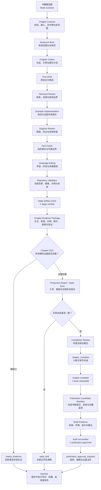

# 43. 用 Harness 写一本技术书

> 一本书不是 Markdown 文件的集合，而是一组长期演进的读者承诺。书籍 Harness（Book Harness）把这些承诺拆成契约、阶段、证据、状态和发布身份，使“写完了”能够被检查，也使“还不能发布”有明确理由。

## 本章目标

- [ ] 用书籍契约和章节契约定义读者价值、范围、交付物与非范围。
- [ ] 用阶段记录区分研究、初稿、审查、验证与完成，防止阶段互相冒充。
- [ ] 组成章节证据包和章节完成定义，用硬性门识别缺来源、缺示例、缺图示或状态漂移。
- [ ] 用生产看板（Production Board）、局部所有权和集中集成支持多人或多 Agent 接力。
- [ ] 用出版候选清单（Publication Candidate Manifest）固定待发布书稿的身份，同时把构建、批准和发布分开。

## 为什么要学

一个目录里可以有几十篇结构完整的 Markdown，却仍然没有人能回答“这本书还差什么”。有的章节只有提纲，有的示例从未运行，有的动态事实沿用了几个月前的页面，有的图已经改名但正文仍指向旧文件。进度表可能全绿，读者实际打开的内容却来自另一组工件。

问题不在文件数量，而在文件之间缺少责任接口。正文不知道它依赖哪次研究，示例不知道自己证明了哪项教学结论，图示不知道正文是否同步，状态表也不能反向定位完成证据。任何一处写下“完成”，都可能只是在重复上一位参与者的判断。

Write the Docs 将文档即代码（Docs as Code）描述为以问题跟踪、版本控制、纯文本标记、代码审查和自动化测试等软件开发工具处理文档的实践 [REF-131]。这为仓库化写作提供了社区工程背景，但版本控制本身不会核验技术事实，也不会替作者作出出版决定。本章进一步关心的是：怎样把一本长期维护的技术书变成可接力、可审查、可停止的工作系统。

## 前置知识

- 前置章节：第 3 章的仓库上下文，第 17 章的评估规格与证据矩阵，第 26 章的任务隔离，第 39 章的测试和基准测试（Benchmark）边界，以及第 42 章的版本身份与发布决定。
- 技术前提：能够阅读 Markdown、YAML 格式的前置元数据（front matter）、相对路径、测试输出和简单状态表。
- 不要求：真实出版平台、PDF／EPUB 构建链、模型账户、内容管理系统、销售渠道、版权审批或自动发布权限。

## 场景引入：文件都在，为什么仍不能说书已完成

**场景：** 一个技术书项目经过数月并行写作。研究、提纲、正文、示例、图示和审查记录分别存在于仓库中；参与者也维护了一张章节进度表。现在团队准备生成出版候选，但发现三类矛盾：正文状态与进度表不一致，示例文件存在却没有新鲜测试结果，历史全仓校验通过后又新增了文件。

**成功标准：** 团队能够从每章目标反查来源、示例、图示、审查和当前验证，区分应补证、应修复状态漂移、可进入章节终审和必须请求出版批准的情况。任何单一文件、字数、测试或看板单元格都不能独自把章节送入发布。

**边界：** 这是虚构的漂移场景，不描述本仓库当前状态。本章当前只验证专用示例、图示和定向文档检查；没有运行全仓 `npm run validate`，没有构建 PDF／EPUB，也没有执行签名、上传、销售、分发或出版批准。

## 核心概念

### 从文件集合到五类责任

技术书的生产至少同时管理五类对象。把它们压进一个 `status` 字段，会让“有内容”和“有证据”失去区别。

| 责任 | 要回答的问题 | 常见工件 | 不能由工件存在推出的结论 |
| --- | --- | --- | --- |
| 内容 | 读者将看到什么？ | 章节正文、代码、图示、练习 | 内容正确、原创或可理解 |
| 状态 | 当前处于哪个阶段？ | 前置元数据、进度表、当前状态（Current State） | 状态与实际工件一致 |
| 证据 | 哪项检查支持哪项结论？ | 来源映射、测试结果、审查记录 | 未覆盖项也已通过 |
| 责任 | 谁能修改、集成或批准？ | 任务契约、所有权、交接 | 权限已授予或决定已作出 |
| 发布身份 | 准备发布的是哪一组工件？ | 版本、目录快照、候选清单 | 构建可复现或出版已批准 |

Book Harness 不是把写作变成代码项目，也不是要求所有作者使用同一工具。它只要求这五类责任有可定位入口，并允许团队在证据不足时停下来。

### 书籍契约与章节契约：先定义承诺

本书把整书的读者、使命、范围、原创性、风格、版权边界和完成定义组成书籍契约（Book Contract）。它回答“这本书为何存在、对谁负责、哪些内容不能写”。仓库中的 `BOOK_RULES.md` 与 `STYLE_GUIDE.md` 是可检查的契约接口，但文件存在不证明每位参与者都已遵守。

章节契约（Chapter Contract）把整书承诺缩小到一个可验收工作项，至少包含：

- 读者完成后能够执行或判断什么；
- 哪些章节、来源和仓库状态是输入；
- 场景、正文、示例、图示和审查要交付什么；
- 哪些动态事实需要重读；
- 哪些系统、权限和结果明确不在本章范围内。

Diátaxis 区分教程、操作指南、参考和解释，强调它们服务不同的读者需求 [REF-132]。本章只借用“先确认读者需要什么”这一设计背景，不把四类文档变成本书固定目录。一个章节可以组合解释与操作，但必须说明每一部分服务的读者任务，不能把来源摘录、命令清单和概念叙述无差别地堆在一起。

### 阶段记录：让产物不能替代验收

阶段记录（Stage Record）保存某次研究、提纲、初稿或审查的输入版本、专属产物、实际验证、未覆盖项、更新时间和下一状态。它不自动推进工作流，只让后来者知道某个阶段为什么停在这里。

本仓库规定的章节流程依次为：

1. 研究简报（Research Brief）；
2. 章节提纲（Chapter Outline）；
3. 初稿（First Draft）；
4. 技术审查（Technical Review）；
5. 示例实现（Example Implementation）；
6. 图示审查（Diagram Review）；
7. 事实核验（Fact Check）；
8. 语言编辑（Language Editing）；
9. 仓库验证（Validation）；
10. 完成审查（Completion）。

顺序的价值在于保留断点，而不是增加表格：

- 研究存在，不等于章节论证成立；
- 提纲存在，不等于正文已经写成；
- 草稿完整，不等于技术职责和来源外推正确；
- 示例通过，不等于真实系统或外部依赖可用；
- 图可渲染，不等于箭头、术语和边界正确；
- 事实核验完成，不等于动态来源永久新鲜；
- 语言流畅，不等于全仓目录、链接和状态已经一致；
- `status: complete` 不等于证据包足以支持完成。

因此，阶段状态至少要能表达 `not_started`、`in_progress`、`blocked` 和 `complete`。`blocked` 必须附带缺少的输入、决定或责任入口；长期使用 `in_progress` 隐藏未知项，只会把问题推给下一位参与者。

### 术语、引用、图示和示例是共享接口

技术书的章节不是彼此独立的文章。一个术语改名可能影响全文，一个引用编号可能被多个章节复用，一张图可能同时有 Mermaid 源、导出图和正文代码块，一个示例还可能被 npm 脚本和验证入口消费。它们更接近共享接口，而不是可随意复制的素材。

本仓库在写作日存在以下可检查路径：

| 接口 | 仓库路径 | 当前可证明的事实 | 不能证明的事实 |
| --- | --- | --- | --- |
| 项目规则 | `AGENTS.md`、`AI_BOOTSTRAP.md`、`BOOK_RULES.md`、`STYLE_GUIDE.md` | 启动、写作和审查规则有仓库入口 | 规则已被全部执行 |
| 路线与目录 | `.ai/outline.md`、`.ai/roadmap.md`、`docs/SUMMARY.md` | 计划范围与阅读顺序可比较 | 所有章节均已完成 |
| 状态与下一步 | `.ai/progress.md`、`.context/CURRENT_STATE.md`、`.context/NEXT_TASK.md` | 存在章节状态和下一任务入口 | 三者当前完全一致 |
| 术语与来源 | `.ai/glossary.md`、`.ai/references.md`、章节 Research／Fact Check | 名称、引用和访问日期可追溯 | 来源仍在线或事实仍新鲜 |
| 模板与提示 | `CHAPTER_TEMPLATE.md`、`.ai/prompts/`、`templates/` | 多个阶段具有公共输入结构 | 填满模板就有读者价值 |
| 示例与图示 | `examples/`、`diagrams/` | 可运行代码和可编辑图源有约定位置 | 任一示例或图当前通过 |
| 验证与交接 | `scripts/validate.sh`、`.context/HANDOFF.md`、`.memory/` | 有质量门、交接和历史记录入口 | 当前全仓验证已通过 |

上表来自对当前路径的检查，不是外部来源结论，也不是仓库质量证明。引用内容仍需回到原始页面，示例仍需运行对应命令，图示仍需导出和目视检查，状态仍需与工件反向比对。

### 章节证据包：让每个结论找到依据

章节证据包（Chapter Evidence Package）不是压缩包格式，而是一组可定位关系。它将正文版本、来源映射、示例结果、图示检查、技术审查、事实核验、语言审阅、仓库验证和状态同步关联到同一章。

第 17 章已经说明评估规格、评分器和证据矩阵如何限定任务结论；第 39 章则将测试结果、硬性门和未覆盖项分开。本章消费这些机制，不重新定义评分算法。OpenAI 的动态评估指南建议围绕具体任务和真实分布建立评估，持续运行，并以人工反馈校准自动评分 [REF-117]。把这一点类比到书籍生产，只能得到一个有限建议：质量门应围绕真实读者任务设计，并且自动检查仍需技术、事实、语言和人工出版判断配合。

证据包中的每项记录都应回答四个问题：

1. 它对应哪一版章节和输入？
2. 它实际执行或检查了什么？
3. 它支持哪项有限结论？
4. 它没有覆盖什么？

例如，“8 项测试通过”只有在测试文件、命令、退出码和行为范围都可定位时才有意义。它不能自动证明来源准确、图示可读或读者能完成练习。

### Chapter DoD：完成定义不是平均分

章节完成定义（Chapter Definition of Done，Chapter DoD）把一章进入 Completion 前必须满足的硬性证据列出来。

| 检查面 | 最小证据 | 保守失败出口 |
| --- | --- | --- |
| 目标与结构 | 学习目标、场景、前置和章节依赖一致 | `needs_scope_review` |
| 原创与来源 | 可归因事实有来源，来源与本书扩展分开 | `needs_fact_evidence` |
| 示例 | 路径、环境、命令、真实结果和未运行范围明确 | `needs_example_evidence` |
| 图示 | Mermaid 源、导出物、正文一致性和视觉审查存在 | `needs_diagram_review` |
| 技术与语言 | Technical Review、Fact Check、Language Editing 有独立记录 | `needs_review` |
| 仓库质量门 | 当前版本实际运行 lint、链接、示例测试和状态检查 | `validation_failed` |
| 交接与状态 | 生产看板、当前状态（Current State）、下一任务（Next Task）和交接（Handoff）与工件一致 | `state_drift` |

Chapter DoD 不是加权评分。缺少来源、示例失败、图示不可读或状态漂移都不能被字数、流畅度或其他绿色检查抵消。团队可以为低风险草稿裁剪某些阶段，但必须在 Chapter Contract 中提前声明，不能在失败后临时降低门槛。

### 生产看板：状态必须能反查工件

生产看板（Production Board）记录每章阶段、阻塞、更新时间和下一任务。它的价值是导航，不是授权。表格中的 `complete` 必须能够反查正文、审查和新鲜验证；无法反查时，看板只是另一份可能漂移的文档。

状态漂移通常有三种形式：

| 漂移 | 表现 | 修复顺序 |
| --- | --- | --- |
| 工件领先 | 示例已经存在，看板仍写未开始 | 先验证示例，再更新共享状态 |
| 状态领先 | 看板写完成，Fact Check 或图示审查缺失 | 将状态退回缺失阶段并补证 |
| 证据过期 | 历史校验通过，之后又新增或修改工件 | 重跑当前质量门，再决定状态 |

修复时不应简单选择时间戳较新的文件。先检查实际工件与验证范围，再由唯一集成者同步 `.ai/progress.md`、`.context/CURRENT_STATE.md`、`.context/NEXT_TASK.md` 和 `.context/HANDOFF.md`。无法确定基线时，输出 `state_drift` 比继续写下一章更诚实。

### 出版候选清单：章节完成仍不是出版

出版候选清单（Publication Candidate Manifest）固定“准备交给出版决定的是哪一份书”。它至少记录书稿版本、章节集合、目录、术语与引用快照、构建输入、验证结果、未覆盖范围、责任人和批准状态。

第 42 章负责为 Harness 候选建立不可变版本身份，并把比较、发布决定、实际执行和回滚验证分开。本章只把已经确定的书稿身份与章节、目录、引用、构建输入和验证证据绑定成出版候选；不重新定义 A/B 测试、流量暴露、发布执行或回滚机制。

Reproducible Builds 将可复现构建定义为：给定相同来源、构建环境和构建指令，任何一方都能重建逐位一致的指定工件 [REF-133]。因此，一台机器成功生成 PDF 只支持“该次构建成功”，不能自动支持“构建可复现”。本章没有运行 PDF／EPUB 构建，也不声称本仓库具备逐位可复现的出版管线。

Semantic Versioning 要求先声明公共接口（public API），并规定已发布版本的内容不能原地修改 [REF-109]。自然语言书籍不是软件包，本章不为章节套用主、次、补丁语义；只借用两个原则：先声明读者可见契约，已经进入发布记录的身份不得被静默覆盖。

三条断点必须保持独立：

- `chapter_complete ≠ book_releasable`；
- `build_succeeded ≠ reproducible_build`；
- `reproducible_build ≠ publication_approved`。

出版候选清单不执行构建、签名、上传、销售或分发。它只把待决定的对象固定下来，让批准者知道自己在审查什么。

### 并行生产：局部所有权，集中集成

第 26 章把并行任务的所有者、专属路径、输入快照和集成责任写进任务契约。本章将同一原则用于写书：章节研究、正文、示例、图示和专属审查可以分别领取，但共享引用、术语、目录、npm 脚本和进度状态必须由唯一集成者协调。

局部交付包至少记录：

- 修改了哪些专属路径；
- 基于哪一版 Research、Outline 或正文；
- 实际运行了哪些命令，结果是什么；
- 哪些共享登记仍待集成；
- 哪些结论仍不能主张。

局部 Markdown lint 通过，不等于全仓通过；两个任务各自正确，也不等于合并后没有冲突。集中集成者必须重新检查共享入口和全仓质量门。这是本书的协作模型，不表示文件锁、事务、Git 合并或 Agent 调度已经实现。

本章只定义书籍工件、阶段证据和共享集成责任。下一章才计划细化研究（Research）、写作（Writing）、审查（Review）与事实核验（Fact Check）等角色契约、证据交接、队列失效和冲突回流；本章不把“存在多个阶段”外推为这些 Agent 或编排机制已经运行。

## 架构图：从路线图到出版候选

下图回答：路线图怎样形成 Chapter Contract，阶段工件怎样汇入 Chapter Evidence Package，Chapter DoD 怎样阻止硬缺口继续，以及章节完成怎样与整书可发布和出版批准保持分离。

[查看 SVG](../../diagrams/exported/chapter-43-book-harness-production-flow.svg) · [查看 PNG](../../diagrams/exported/chapter-43-book-harness-production-flow.png)

**替代说明：** 图从书籍路线图与 Book Contract 进入 Chapter Contract。主链依次经过 Research、Outline、Draft、Technical Review、Example、Diagram、Fact Check、Language Editing 和 Repository Validation。阶段工件先经过 `stage artifact exists ≠ stage verified` 断点，再组成 Chapter Evidence Package。

Chapter DoD 的硬缺口进入 `needs_evidence` 并停止。证据完整后，Production Board 与 State Sync 仍会反向核对工件；漂移进入 `state_drift`。只有同步后的 Completion Review 才能形成 `chapter_complete`，随后还要经过 `chapter complete ≠ book releasable` 和 `build succeeded ≠ publication approved` 两个断点。流程最终停在 `publication_approval_required`，图中没有真实构建、批准或发布动作。

读图时沿纵向主链识别章节阶段，再分别观察 Chapter DoD 和状态同步的失败出口。三个带 `≠` 的节点是结论边界，不是可自动越过的执行步骤。

Diagram Review 已使用 Mermaid 命令行界面（Command-Line Interface，CLI）11.16.0，以白色背景、2× 缩放导出 SVG 与 PNG。PNG 为 1514×7196，已实际检查节点、文字、箭头和三个责任断点；正文 Mermaid 块与 `.mmd` 源均为 2002 个字符且逐字一致。导出成功只证明图可生成和当前画面可读，不证明图中的章节阶段、构建或出版动作真实发生。

## 工作流程：让章节状态由证据推进

1. **读取路线与当前状态：** 确认章节目标、前置、上一阶段产物和共享状态是否一致；不一致时先记录 `state_drift`。
2. **建立章节契约：** 固定读者任务、来源要求、交付物、专属路径、成功标准和非范围。
3. **按阶段生产：** 每次只领取一个可验收阶段，输出 Stage Record，不把后续计划写成已完成。
4. **登记共享接口候选：** 新术语、引用、目录项和 npm 入口先形成集成清单，由唯一集成者处理。
5. **组成证据包：** 将正文、来源、示例、图示和审查记录与当前章节版本关联。
6. **执行 Chapter DoD：** 任何硬性缺口回到负责阶段；不使用总分覆盖失败。
7. **运行仓库质量门：** 在当前工件集合上执行 lint、链接、示例测试和状态检查，保存退出码和未覆盖项。
8. **同步状态与交接：** 由集成者更新生产看板、Current State、Next Task 和 Handoff，再反查实际工件。
9. **冻结出版候选：** 汇总已完成章节、目录、引用、术语、构建输入和验证结果，形成 Publication Candidate Manifest。
10. **等待出版决定：** 构建、版权、编辑批准、签名、上传和分发使用独立权限与验证流程；Book Harness 不自动执行。

## 最小示例：章节完成准入器

本章实现纯内存函数 `assessBookChapterCompletion(input)`。它只读取调用方注入的教学对象：

- `chapterContract`；
- `stageRecords`；
- `sourceEvidence`；
- `exampleEvidence`；
- `diagramEvidence`；
- `reviewEvidence`；
- `validationEvidence`；
- `stateSync`；
- `publicationRequest`。

函数返回 `needs_evidence`、`validation_failed`、`state_drift`、`ready_for_completion_review`、`chapter_complete` 或 `publication_approval_required`，并在所有路径固定 `executionPerformed: false`。

函数先检查 Chapter Contract、固定阶段顺序、Research 至 Validation 的完成记录和硬性证据，再检查 Validation 新鲜度与状态同步。只有注入的 Completion 记录为 `complete` 时，函数才返回 `chapter_complete`。已完成章节请求出版时，函数只返回 `publication_approval_required`，不会执行批准或发布。

实现位于 `examples/agent/book-chapter-completion-assessment.mjs`，测试位于同目录的 `.test.mjs` 文件。定向测试实际得到 19 项通过、0 项失败；演示输出 `ready_for_completion_review / chapter_evidence_ready / review_completion_record / executionPerformed:false`。函数不会读取真实仓库、运行 lint／链接／测试、修改 Markdown、调用模型、构建 PDF／EPUB，也不会发布或上传内容。

## 逐步增强

1. 从纯内存章节准入开始，只验证字段、阶段顺序和保守状态。
2. 需要检查真实仓库时，先增加只读路径白名单、输入快照和命令证据契约。
3. 需要生成出版工件时，锁定来源、依赖、构建环境和指令，并分别检查内容与可复现性。
4. 需要多人编辑决定时，增加角色、范围、拒绝出口、刷新条件和审计记录。
5. 需要上传或分发时，另建凭证、最小权限、预览、签名、回读和撤回流程。

每次增强只新增一种外部责任。纯内存准入器不能通过增加字段逐渐变成发布执行器；一旦需要输入／输出（Input/Output，I/O）、权限或不可逆效果，就必须更换契约和验证层级。

## 完整工程案例：第 43 章如何进入 Book Harness

下面只使用本章当前可检查工件说明责任，不把计划阶段写成现状。

**背景：** `.ai/outline.md` 和 `docs/SUMMARY.md` 已为第 43 章记录目标与主要小节；Research Brief、参考资料和 Chapter Outline 也已存在。它们说明本章有规划输入，不证明正文、示例、图示或审查已完成。

**约束：** First Draft 只创建正文；Technical Review 只修订正文并增加专属审查记录；Example Implementation 只新增本章计划、纯内存模块、测试和集成记录；Diagram Review 只创建图源、导出物和视觉审查记录；Fact Check 只复读来源、复验本章证据并修正事实时态。共享术语、引用、目录、脚本、进度和上下文由主线程集成。全仓校验和出版不在这些阶段执行。

**设计选择：** 正文将外部来源、本仓库路径、本书 Book Harness 模型和虚构漂移场景分开。仓库路径只支持“接口存在”；来源只支持受限背景；Chapter DoD、Publication Candidate Manifest 和状态代码属于本书模型。

**当前证据：** 写作日已读取 Research Brief、参考资料、Chapter Outline、模板和规则，并确认正文引用的仓库入口存在。First Draft 与 Technical Review 的定向 Markdown lint 均为 0 个错误。Example Implementation 先得到退出码 1 的 `ERR_MODULE_NOT_FOUND`，再以同一测试命令得到 19 项通过、0 项失败；Fact Check 复跑时仍为 19 项通过、0 项失败，演示退出码 0，并明确输出 `executionPerformed: false`。

Diagram Review 已用 Mermaid CLI 11.16.0 导出白底 2× SVG/PNG。Fact Check 重新确认 PNG 为 1514×7196，正文图块与源文件均为 2002 个字符且逐字一致。2026-07-17 已重读五项一手来源并保留原有外推禁区。这些定向结果都不能替代全仓 Validation。

Final Review 再次得到 19 项测试通过、0 项失败和无副作用演示结果，并用相同参数重新导出 SVG/PNG。实际视觉检查、正文与图源同源比较及跨工件核对均已完成。

**当前阶段：** Final Review 已复核正文、来源、示例、图示、阶段记录和未运行边界。全仓 Validation、共享状态同步和出版决定仍留给后续阶段。Technical Review、Example Implementation、Diagram Review、Fact Check、Language Editing 与 Final Review 的结论和未覆盖范围分别保存在独立审查记录中。

这个案例展示的是“当前阶段怎样诚实交付”，不是本仓库已完成一本书的证明。若后续状态文件与实际工件冲突，集成者仍需以新鲜验证为基础修正。

## 实现说明

| 决策 | 实际选择 | 原因 | 未实现边界 |
| --- | --- | --- | --- |
| 输入 | 单个纯内存章节证据对象 | 便于检查阶段、证据和状态关系 | 不遍历仓库或读取环境 |
| 输出 | 状态、原因码、下一步和 `executionPerformed: false` | 防止把准入写成执行 | 不修改文件或状态表 |
| 阶段顺序 | 显式阶段列表和前置关系 | 防止 Outline、Draft、Review 互相冒充 | 不调度真实 Agent |
| 硬性门 | 来源、示例、图示、审查、验证和状态分别检查 | 不让字数或单项绿色结果覆盖缺口 | 不计算统一质量分 |
| 出版请求 | 只返回 `publication_approval_required` | 章节完成不授予出版权限 | 不构建、签名、上传或分发 |

实现采用 Node.js 内置能力和普通对象，没有新增依赖或共享 npm 命令。测试对象中标为 `complete` 的 Diagram Review、Fact Check、Language Editing、Validation 与 Completion 均是虚构注入记录，不描述第 43 章的真实阶段证据。

## 测试与验证

| 层级 | 验证对象 | 命令或方法 | 成功标准 | 当前状态 |
| --- | --- | --- | --- | --- |
| First Draft | 第 43 章正文 | 定向 Markdown lint 与空白检查 | 文档结构符合规则，无空白错误 | 已运行，0 个错误 |
| Technical Review | 来源限定、仓库路径、工件职责、阶段状态、相邻章节与正文 | 规则对照、路径检查、定向 Markdown lint 与差异检查 | 必须修复项关闭，阶段与未验证范围保持准确 | 已运行，2 个文件、0 个 lint 错误；差异检查通过 |
| 仓库路径 | 正文列出的规则、状态、模板、示例、图示与验证入口 | 写作日逐项读取或检查路径 | 只确认路径存在，不推断内容正确 | 已检查路径存在 |
| 纯内存示例 | `assessBookChapterCompletion(input)` | `node --test examples/agent/book-chapter-completion-assessment.test.mjs` | 十个阶段边界、硬缺口、Validation、状态漂移与出版批准保守路由 | 已运行，19 项通过、0 项失败 |
| 示例演示 | 注入的完整前置阶段证据 | `node examples/agent/book-chapter-completion-assessment.mjs` | 只进入 Completion 前终审且无副作用 | 已运行，退出码 0；`executionPerformed: false` |
| 图示 | Book Harness 状态图 | Mermaid CLI 11.16.0 白底 2× 导出、PNG 视觉审查与同源比较 | 图源、正文和导出物一致，三个责任断点可读 | 已运行；PNG 1514×7196，正文与源均为 2002 字符且一致 |
| Fact Check | REF-131、REF-132、REF-117、REF-133、REF-109 与当前示例/图示证据 | 一手来源复读、专用测试/演示、路径与链接检查 | 来源直接支持正文限定，运行结果和未执行边界保持新鲜 | 已完成；5 项来源、19 项测试、演示、路径与链接检查通过 |
| Language Editing | 第 43 章正文 | 术语、主语、时态、长句、表格、替代说明、示例边界与章节衔接审阅 | 表达一致，阶段现状准确，不改变来源、接口、状态或图源 | 已完成；定向语言审阅与质量检查通过 |
| Final Review | 正文、来源、示例、图示与全部专属审查记录 | 复跑测试/演示、重新导出并目视检查图示、同源与跨工件核对 | 当前章节工件相互一致，未运行边界没有被覆盖 | 已完成；定向终审通过，不替代全仓 Validation |
| 全仓 | 目录、链接、章节状态和全部示例 | `npm run validate` | 当前工件集合全部通过 | 未运行；由主线程或后续 Validation 执行 |
| 出版 | PDF／EPUB、可复现性、版权、批准和分发 | 需要独立出版管线 | 构建、批准与发布分别有证据 | 未运行；不在本章范围 |

Example Implementation 与 Diagram Review 提供了纯内存示例和图示的当前定向结果，但不复用历史全仓校验。测试只证明函数对注入对象执行声明的保守路由；图示导出和视觉检查只证明当前图源可生成且可读，都不能证明真实章节状态、技术事实、读者效果或出版资格。

## 工程实践

- **让状态指向证据：** 每个 `complete` 都应能反查正文、审查和当前验证；无法反查时先记录漂移。
- **让来源带着允许用途：** URL 和访问日期不够，还要写清它支持哪项陈述、禁止外推什么。
- **让局部交付保持局部：** 专属文件由工作者完成，共享术语、引用、目录、脚本和状态由集成者统一写入。
- **让历史结果保持历史：** 工件变化后重新运行质量门，不把上一次绿色结果复制到新版本。
- **让出版身份不可混淆：** 候选清单固定章节、目录、引用、构建输入与未覆盖范围，不用“最新版”替代身份。

## 最佳实践

- 先把读者可观察目标写进 Chapter Contract，再分配研究或写作任务。
- 每个 Stage Record 同时写实际验证和未覆盖项，避免只交付“完成摘要”。
- 将 Chapter DoD 设计为少量硬性门，不用平均分掩盖来源、示例或状态失败。
- 共享工件只设一个集成入口；并行工作者以候选清单交接共享变更。
- 出版前重新核对动态来源、全仓验证和构建输入，不依赖章节完成日的历史记录。

## 常见错误

| 错误 | 表现 | 根因 | 修复方向 |
| --- | --- | --- | --- |
| 用文件数代表进度 | Markdown 越多，完成比例越高 | 没有阶段和验收语义 | 按 Stage Record 和 Chapter DoD 统计 |
| 用看板状态代表事实 | 单元格写完成就停止检查 | 状态不能反查工件 | 从正文、审查和验证反向核对 |
| 用 lint 代表内容正确 | 格式通过后跳过事实审查 | 把语法证据外推为技术证据 | 分开 Technical Review、Fact Check 与 Language Editing |
| 示例存在但无运行记录 | 链接到代码却没有命令和结果 | 把产物存在当作行为证据 | 保存环境、命令、退出码和未运行范围 |
| 图能渲染就算正确 | 箭头越过批准或与正文冲突 | 只做语法检查 | 比较图源与正文并目视检查 |
| 并行修改共享文件 | 引用、术语、目录和进度互相覆盖 | 没有集中集成责任 | 局部所有权、候选清单、唯一集成者 |
| 构建成功就宣布发布 | 单机 PDF 生成后直接分发 | 混淆构建、可复现与批准 | 分开构建证据、候选清单和出版决定 |

## 安全与边界

- 权限边界：Book Harness 的状态、质量门和候选清单不授予文件写入、构建、签名、上传、销售、分发或出版权限。
- 数据边界：来源、草稿、审查和读者反馈可能含受版权、隐私或保密约束的内容；进入仓库前必须有合法来源和明确用途。
- 版权边界：Docs as Code、Diátaxis、评估指南和开放规范只提供受限背景；正文不得逐段翻译或大段复刻。
- 凭证边界：真实发布系统的账户、密钥、证书和商店凭证不进入纯内存示例或书稿。
- 人工决定：技术审查、编辑决定、版权许可和出版批准不能由自动评分、章节状态或模型自评替代。
- 不适用范围：本章不实现写作 Agent 工厂、内容生成平台、可复现构建系统或商业出版流程；下一章继续讨论多角色 Book Factory。

## 章节总结

Book Harness 的核心不是增加更多模板，而是让内容、状态、证据、责任和发布身份互相可追溯。Book Contract 与 Chapter Contract 定义承诺，Stage Record 保留过程断点，Chapter Evidence Package 与 Chapter DoD 证明章节为什么能继续，Production Board 提供导航，Publication Candidate Manifest 则固定等待出版决定的对象。

本仓库提供了规则、路线、状态、术语、引用、示例、图示、验证和交接入口；这些路径使工作可检查，却不会自动保证内容正确。每次完成仍需新鲜证据，每次并行仍需所有权，每次发布仍需独立决定。下一章将在这一基础上进一步拆分 Research、Writing、Review 与 Fact Check 等角色，讨论 Book Factory 怎样传递证据而不是传递“看起来完成”的文本。

## 练习

1. 为一章你正在维护的文档写 Chapter Contract，列出三个可观察目标、两个非范围和一个动态来源刷新条件。
2. 给一份只有正文和字数统计的章节建立 Chapter Evidence Package，说明还缺哪些硬性证据。
3. 设计一个状态漂移案例：让 front matter、进度表和示例结果互相冲突，并写出修复顺序。
4. 为三名并行作者划分专属路径和共享候选清单，指出唯一集成者必须重跑哪些检查。
5. 比较 `chapter_complete`、`build_succeeded`、`reproducible_build` 与 `publication_approved`，为每个状态列出独立证据。

## 延伸阅读

- REF-131：Write the Docs 关于 Docs as Code 工具与协作实践的社区背景；不作为内容正确性保证。
- REF-132：Diátaxis 关于教程、操作指南、参考和解释服务不同读者需求的框架背景；不作为本书固定目录。
- REF-117：OpenAI 关于任务特定、真实分布、持续评估和人工校准的动态建议；自动评分不能替代出版责任。
- REF-133：Reproducible Builds 关于相同来源、环境和指令产生逐位一致工件的定义；不证明本仓库已实现。
- REF-109：Semantic Versioning 2.0.0 关于公共接口（public API）和已发布版本不可原地修改的规范；这里只作发布身份类比。

## 参考资料

- [第 43 章参考资料](43-writing-a-technical-book-with-harness.references.md)
- [第 43 章 Research Brief](43-writing-a-technical-book-with-harness.research.md)
- [第 43 章详细 Outline](43-writing-a-technical-book-with-harness.outline.md)
- [第 43 章事实核验](43-writing-a-technical-book-with-harness.fact-check.md)
- [全局引用登记](../../.ai/references.md)

## 章节完成检查表

- [x] Front matter、学习目标、前置知识和章节边界已建立。
- [x] First Draft 为原创表达，外部来源、仓库路径、本书模型和虚构场景已分开。
- [x] REF-131、REF-132、REF-117、REF-133、REF-109 的用途与外推禁区已限定。
- [x] Example Implementation 已按 TDD 完成，示例元数据、19 项测试与无副作用演示已核对。
- [x] Diagram Review 已完成；Mermaid 源、正文图块、SVG/PNG、元数据和视觉检查一致。
- [x] 定向 Markdown lint 与空白检查已通过，0 个错误。
- [x] Technical Review 已完成并有独立记录；必须修复项已关闭。
- [x] Fact Check 已完成；五项来源与当前示例、图示证据已复核。
- [x] Language Editing 已完成；术语、主语、时态、长句、表格、替代说明、示例边界与章节衔接已审阅。
- [x] Final Review 已完成；正文、来源、示例、图示、审查记录和未运行边界相互一致。
- [x] 全仓 `npm run validate` 与共享状态同步已完成；出版决定仍是独立、需授权的后续任务。
