# 44. AI Technical Book Factory：Research、Writing 与 Review Agent

> AI Technical Book Factory 不是让多个 Agent 轮流生成文字，而是让研究、写作、审阅、事实核验与人工决定之间拥有可检查的责任接口。它追踪的不是“谁看起来参与过”，而是哪份输入、哪条主张、哪次检查和哪项决定支持当前稿件继续流转。

## 本章目标

- [ ] 为 Research、Outline、Writing、Review、Fact Check 和 Human Author/Editor 定义可执行的角色契约（Role Contract）。
- [ ] 用内容证据包（Content Evidence Package）连接输入版本、输出工件、主张、执行证据、审查发现和人工决定。
- [ ] 区分固定工作流（workflow）、只读并行任务和需要动态调度的候选任务。
- [ ] 用审查门（Review Gate）、事实核验门（Fact Check Gate）、冲突路由器（Conflict Router）和有界回流（bounded reflow）阻止低证据内容静默前进。
- [ ] 解释哪些质量信号可用于诊断，以及为什么它们不能替代硬性门或人工最终责任。

## 为什么要学

把同一份提纲交给三个模型，再让第四个模型“综合”，很容易制造一种生产线已经成熟的错觉。它可能得到更多段落、更多评论和更长的日志，却没有增加一条独立来源，也没有确认任何评论针对的是最新稿件。若研究角色和写作角色共享同一个未经核验的前提，审阅角色又只检查行文流畅度，那么四个 Agent 只是把同一个错误扩写了四遍。

真正困难的是责任分离。Research 要回答来源能支持什么，Writing 要回答怎样在范围内组成论证，Review 要回答结构和读者任务是否成立，Fact Check 要回答可核验主张是否获得来源支持。具名人类作者或编辑还要决定哪些内容可以接受、哪些必须删减、哪些未知项可以披露、何时需要重新研究。角色名称相似，不代表它们拥有相同输入、权限和完成条件。

Anthropic 将预定义代码路径中的模型与工具调用称为 workflow，把模型动态决定过程和工具使用的系统称为 agent，并介绍了 prompt chaining、parallelization、orchestrator-workers 与 evaluator-optimizer 等模式 [REF-029]。这些模式提供了编排背景，却不证明任意多 Agent 流程更正确，也不规定本章的角色、状态或质量门。本章关心的是：在一本技术书中，怎样把这些模式限制在可审查的内容生产契约内。

## 前置知识

- 前置章节：第 13 章的知识来源，第 14 章的人工介入，第 17 章的评估证据，第 26 章的任务隔离，第 38 章的反思与批准模式，第 39 章的测试边界，以及第 43 章的 Book Harness。
- 技术前提：能够阅读 Markdown、YAML 前置元数据、版本标识、状态表和结构化审查记录。
- 不要求：已经部署多 Agent 平台、消息队列、内容管理系统、向量数据库、模型账户或自动出版管道。

## 场景引入：五个角色都完成了，为什么稿件仍要停下

**场景：** 一个虚构团队为一章技术书安排 Research、Outline、Writing、Review 与 Fact Check 五个角色。看板显示五项任务都已完成，但编辑发现：Writing 使用的是 Outline v1，Review 阅读的是 Draft v2，Fact Check 接收的却是 Draft v1；一条性能结论没有来源，Review 还把“语言清楚”误写成“事实正确”。

**成功标准：** 系统能够识别输入版本失效、职责越界、缺少来源和 Review/Fact Check 冲突；只重开受影响的工作，不让旧结果覆盖新稿；最终由人类记录接受、退回、延期或拒绝决定。

**边界：** 这是教学场景，不是本仓库的运行报告。截至本轮 Final Review，本章没有启动正文所述的多角色 Agent 生产线、消息队列、自动并行、返工循环或出版流程，也没有证明任何模型完成了独立审查。

## 核心概念

### 1. 多一个 Agent 为什么不等于多一份证据

Agent 数量是编排形态，证据数量是可追溯事实。两者不能互换：

```text
more_agents != independent_evidence
```

三个角色引用同一条未经核验的二手摘要，只形成三次复述，不形成三份来源。两个角色使用相同上下文和相同评价口径，也可能同时遗漏同一个问题。即使模型不同，只要输入主张、来源集合和判断标准没有分开，输出之间的一致也只能作为诊断信号，不能作为事实证明。

NISO CRediT 将 Investigation、Validation、Writing – original draft、Writing – review & editing、Supervision 等贡献责任区分开来，并说明 CRediT 描述贡献而不决定 authorship [REF-134]。本章只借用“贡献责任应分开描述”这一背景，不把 CRediT 的角色直接改写成 Agent 协议，也不要求技术书采用其全部角色。

判断一次多角色协作是否增加证据，应至少追问：

- 新角色是否访问了不同且合适的原始来源；
- 它是否使用了与前一角色不同的验收问题；
- 它的输入版本是否明确且仍然有效；
- 它是否留下可定位的审查发现（finding）、事实判定（verdict）或执行记录；
- 它能否拒绝继续，而不只是生成另一版文本。

若答案都是否定的，那么新增角色只增加吞吐、成本或文本变体。把“Agent 已运行”写进状态表，也不会自动增加内容证据。

### 2. 角色契约（Role Contract）：把角色名称变成责任接口

Role Contract 描述一个角色在一次任务中的职责边界。它不是一段人格提示词，而是能够被调度器、审查者和人工接手者共同检查的任务接口。

| 字段 | 要回答的问题 |
| --- | --- |
| `roleId` | 这是哪个稳定角色，而不是本次会话的昵称？ |
| `objective` | 本次只需要完成什么可验收目标？ |
| `inputVersion` | 角色依据的是哪组输入版本或摘要？ |
| `allowedInputs` | 可以读取哪些来源、稿件、规则和历史记录？ |
| `ownedOutputs` | 哪些输出由该角色负责写入或提议？ |
| `forbiddenActions` | 哪些决定、文件或状态不得修改？ |
| `acceptanceChecks` | 怎样证明角色交付物满足当前阶段？ |
| `stopConditions` | 遇到什么情况必须停止并上报？ |
| `handoffTarget` | 完成或阻塞后交给谁，以及附带哪些证据？ |

同一章的角色可以使用以下责任划分：

| 角色 | 主要输入 | 拥有的输出 | 明确禁止 | 典型停止条件 |
| --- | --- | --- | --- | --- |
| Research | 章节问题、研究策略、候选来源 | Research Brief、Source Card、Claim Candidate、来源边界与未知项 | 写成最终正文、替来源补结论 | 找不到一手来源、来源冲突或动态事实无法重读 |
| Outline | 已接受的研究、章节契约、术语表 | 论证顺序、案例槽位、交付物映射 | 发明新事实、宣称章节完成 | 关键章节问题没有证据入口 |
| Writing | 指定版本的研究与 Outline | First Draft、主张与账本的连接 | 扩大来源外推、批准自己的稿件 | 输入失效、关键主张缺证 |
| Review | Draft、Outline、风格和审查清单 | 结构、读者路径、工程边界与一致性 finding | 把语言评价写成事实 verdict | 稿件版本不明、finding 无法定位 |
| Fact Check | Draft、claim ledger、原始来源 | `supported`／`narrow`／`reject`／`unknown` verdict | 改写作者意图、决定出版 | 来源冲突、动态事实不可访问 |
| Human Author/Editor | 完整证据包、冲突和未决项 | 接受集成、退回、延期或拒绝决定 | 把未运行流程描述为已运行，或把 Agent 通过当作责任转移 | 关键未知项未处理、证据包不完整或风险超出授权范围 |

WAME 在学术出版语境中建议只有人类可作为作者，并要求作者透明说明生成式 AI 使用，对相关材料、准确性和来源归属负责 [REF-136]。这为“最终责任不能交给生成系统”提供受限背景，但它不是所有图书、组织或司法辖区的法律规则。本书的 Human Author/Editor 角色是工程责任接口，不是对作者身份、版权或披露格式的普遍裁定。

本仓库存在 Research、Writing、Review、Fact Check 与交接（handoff）的提示词入口。路径存在只说明契约可以落到仓库工件；它不证明相应 Agent 曾被调用，也不证明角色之间具有组织上或统计上的独立性。

角色契约也不替代第 26 章的任务契约（Task Contract）。前者定义某类内容角色在各次任务中持续有效的职责；后者把一次可领取工作绑定到责任人、输入快照、专属路径、验收和停止条件。同一角色可以领取多个 Task Contract，但每次输入版本、写入所有权和实际权限都要单独核验。跨 Codex、Claude Code 或人工工具接力时，第 45 章还要求读取共享项目契约（Shared Project Contract）与工具适配差异；角色名称不能传递会话能力或环境权限。

### 3. 固定工作流、并行任务与动态调度

内容工厂不应默认把每个任务都变成自治 Agent。稳定、可预期、可验收的步骤优先使用固定工作流；只有当任务分解依赖新发现、候选来源数量不定或冲突需要选择下一步时，才考虑受限的动态调度。

| 路由 | 适用条件 | 例子 | 必要保护 |
| --- | --- | --- | --- |
| `sequential_stage` | 后一阶段依赖前一阶段的确定版本 | Outline 等待 Research Brief | 输入版本锁、阶段门 |
| `parallel_read_only` | 子任务没有共享写入，结果可独立归并 | 不同来源的只读摘要 | 来源分片、只读权限、合并责任人 |
| `dynamic_candidate` | 下一步取决于新发现或冲突类型 | 为未知主张选择补充来源 | 预算、允许工具、停止条件、人工升级 |
| `blocked` | 缺输入、权限、来源或决定 | 动态页面不可访问 | 明确缺口，禁止伪造替代结果 |

并行成立需要同时满足四个条件：输入边界可切分，输出所有权不重叠，没有隐藏的顺序依赖，合并规则事先存在。例如，Research 可以把互不相干的来源分给只读工作者；Writing 和 Review 却不能在同一 Draft 文件上同时写，因为 Review 的输入会在读取过程中变化。

Anthropic 文章中的 parallelization、orchestrator-workers 和 evaluator-optimizer 说明了可用模式 [REF-029]。本书据此建立的是受限路由模型，不是“必须使用某种模型编排”的产品建议。尤其要避免把 evaluator-optimizer 变成无界自我改写：只有评价标准清楚、改进能够测量、循环次数或停止条件已注入时，反馈循环才有工程意义。

第 26 章的任务隔离仍然适用：并行角色应拥有互不重叠的专属写入目标，共享输入保持只读，并由协调者集中集成。会话隔离、文件所有权和版本标识缺一不可；仅给 Agent 起不同名字，不能形成隔离。

### 4. 内容证据包（Content Evidence Package）：让交接携带内容证据

Content Evidence Package 是一次内容交接的最小证据容器。它回答“这份输出由哪些输入派生、包含哪些可核验主张、经历了哪些检查、还缺什么决定”。它不要求把完整会话永久保存，也不把日志数量当作质量。

| 字段 | 内容 | 不能推出 |
| --- | --- | --- |
| `packageId` / `taskContractVersion` | 包身份与任务契约版本 | 契约本身正确 |
| `inputArtifacts` | 输入路径、版本、摘要或哈希 | 输入新鲜、来源真实 |
| `outputArtifacts` | 本次拥有的输出及其版本 | 输出达到出版质量 |
| `claimLedger` | 可核验主张、来源键、限定和未知项 | 每条主张都已支持 |
| `executionEvidence` | 实际运行命令、工具结果、时间、适用范围和 `notRun` | 输出语义正确 |
| `reviewFindings` | 可定位的 Review finding 与状态 | 事实已核验 |
| `factVerdicts` | 主张级 verdict、理由和来源版本 | 未核验内容也正确 |
| `conflictsAndUnknowns` | 冲突、失效输入、范围缺口和责任人 | 冲突已解决 |
| `humanDecision` | 尚未决定状态，或人工决定、理由、适用版本和遗留项 | 已获得出版许可 |

证据包随阶段生成新版本，而不是让后来角色原地覆盖早期记录。Research 或 Writing 交付时，`reviewFindings`、`factVerdicts` 或 `humanDecision` 可以明确为 `not_yet_recorded`；缺失值不能伪装成通过。Review、Fact Check 与 Human Author/Editor 只能追加或引用自己拥有的记录，旧 verdict 和冲突历史仍需保留适用版本。

W3C PROV-DM 提供 Entity、Activity、Agent 以及 generation、usage、derivation、attribution、association 等 provenance 概念 [REF-135]。Content Evidence Package 借用“输入、活动、输出和责任关系应可追溯”的思想，但本章没有实现或验证 PROV-DM 序列化，因此不能称其为 PROV 兼容实现。

Anthropic 的 evals 文章区分 task、trial、grader、transcript、outcome、evaluation harness 与 agent harness [REF-061]。本章据此强调过程、结果和评价要分开保存：角色完成了一次 trial，不代表 grader 已经评分，更不代表 outcome 满足成功标准；保存 transcript，也不代表主张正确。来源轨迹只说明内容怎样产生，不能证明来源本身可靠或内容忠实。

证据包应使用摘要和定位信息控制体积。例如，执行记录保留命令、退出状态和关键输出，而不是无差别复制完整终端；来源记录保留标题、链接、访问日和允许用途，而不是复制整篇文章。任何摘要都要能回到原始工件，否则它只是另一层不可审查叙述。

Content Evidence Package 是第 26 章交付包（Delivery Package）的内容生产专用载荷：它补充 claim、finding、verdict 和人工决定，但不取得共享集成权。若交接跨越工具，第 45 章的交接包（Handoff Package）还要记录能力差异、目标工具需要重查的内容和共享写入请求；Content Evidence Package 本身不能转移浏览器会话、模型能力或权限。

### 5. 版本化队列（Versioned Queue）：任务领取不等于输入永久有效

Versioned Queue 是本书为内容生产设计的队列模型。它不是本仓库已部署的服务。每个队列项（Queue Item）至少包含：

- `queueItemId`、`roleId` 与 `taskContractVersion`；
- `inputPackageId` 与每项输入的版本；
- `ownedOutputPaths` 和禁止修改的共享路径；
- `dependsOn`、`invalidationCondition`、`attempt`、优先级与可并行标签；
- `claimedBy`、领取时间和租约或失效条件；
- `integrationOwner`、当前状态、阻塞原因与下一交接目标。

状态不应只使用 `todo` 和 `done`：

| 状态 | 含义 | 后续动作 |
| --- | --- | --- |
| `queued` | 输入版本已登记，尚未领取 | 等待合适角色 |
| `in_progress` | 角色正在处理指定版本 | 保持所有权隔离 |
| `delivered` | 输出和证据包已交付，但尚未被质量门或集成者接受 | 进入相应质量门 |
| `stale_input` | 上游变化命中失效条件，或影响范围无法可靠判断 | 隔离旧结果，判断重开范围 |
| `needs_rework` | 质量门发现可修复问题 | 带返工信封（Rework Envelope）返回 |
| `needs_human_decision` | 冲突、风险或循环已超出自动边界 | 等待人类决定 |

关键规则是：Queue Item 绑定输入版本和失效条件，而不是只绑定文件路径。Research Brief v1 更新为 v2 后，引用 v1 的 Writing 任务必须先暂停并比较语义变化；命中 `invalidationCondition` 时才标记 `stale_input`。若只有格式变化，且派生摘要与允许用途未变，可以保留旧任务，但必须留下影响判断证据；无法可靠界定影响时采用 `stale_input` 的保守出口。

队列也不能替代工作树或文件所有权。两个任务即使拥有不同 ID，只要同时写同一正文，仍然会发生覆盖和审查漂移。Versioned Queue 负责“谁基于什么版本做什么”，第 26 章的所有权声明（Ownership Claim）和集成门（Integration Gate）负责“谁可以在哪里写、谁收口共享工件”。`integrationOwner` 是责任引用，不是锁、身份认证或权限令牌。

### 6. 审查门（Review Gate）与事实核验门（Fact Check Gate）：不要让一种通过冒充另一种

Review 和 Fact Check 可以读取同一稿件，但它们回答不同问题：

| 质量门 | 主要问题 | 典型输出 | 不能证明 |
| --- | --- | --- | --- |
| Review Gate | 论证是否完整、结构是否服务读者、术语和边界是否一致？ | `must_fix`、`should_fix`、`suggestion` finding | 外部事实正确 |
| Fact Check Gate | 可核验主张是否被指定来源支持，限定是否准确，动态事实是否新鲜？ | `supported`、`narrow`、`reject`、`unknown` verdict | 教学顺序有效或行文清晰 |

```text
review_passed != facts_verified
```

Review finding 必须定位到章节、段落或 claim ID，并说明违反了哪个读者目标或规则。`must_fix` 阻止继续集成，`should_fix` 必须在当前范围内处理，`suggestion` 可以由人工接受或记录不采纳理由。

Fact verdict 以主张为单位：

- `supported`：来源在当前限定内直接支持主张；
- `narrow`：来源只支持更窄表述，稿件必须缩小；
- `reject`：来源不支持或与主张冲突，应删除或替换；
- `unknown`：当前证据不足，不能用流畅措辞填补；对当前范围内的可核验主张，它阻止事实门通过，直到补证、删除、延期或由人类缩小范围。

同一个模型换一段提示词可以形成不同任务视角，但不能据此宣称独立核验。独立性需要另行定义，例如来源集合分离、上下文隔离、不同责任人或人工抽查。本章不设一个虚构的“独立性分数”，也不把模型一致率当作真值。

### 7. 冲突路由器（Conflict Router）与有界回流（bounded reflow）

当质量门不通过时，系统不应笼统地“退回重写”。Conflict Router 根据问题类型，把最小必要工作送回能够修复它的角色。

| 冲突类型 | 识别信号 | 默认路由 | 不允许的捷径 |
| --- | --- | --- | --- |
| `source_conflict` | 两个合适来源对同一主张不一致 | Research 补充时间、版本与适用范围，Fact Check 重判；仍冲突则交人工决定 | 随机选一个或合并成假共识 |
| `scope_overreach` | 正文超出来源允许用途 | Writing 缩窄或删除，Fact Check 复核 | 用语气词掩盖无来源结论 |
| `structure_conflict` | 论证顺序不满足章节目标 | Outline／Writing 局部调整，Review 复核 | 触发无关章节重写 |
| `stale_input` | 交付使用旧版 Research、Outline 或 Draft | 影响分析后局部或全量重开 | 让旧 finding 覆盖新稿 |
| `review_fact_disagreement` | 两门对同一范围边界或修复动作提出不兼容要求 | 保留两类标准与证据，交对应角色修复或人工裁决 | 用一扇门的通过覆盖另一扇门 |
| `cycle_exhausted` | 已达到任务注入的循环上限或无实质改进 | `needs_human_decision` | 静默增加循环次数 |

Review 通过而 Fact Check 拒绝，通常只是事实门失败，不自动构成 `review_fact_disagreement`；两扇门本来就回答不同问题。只有二者对同一范围边界或必要修复提出互不兼容的要求时，才进入该冲突类型。

每次返工都携带 Rework Envelope：未通过的质量门、受影响的主张或段落、允许修改的文件、必须保留的内容、所需新证据、再次验收条件和剩余循环预算。这样返工是一个新契约，而不是“请再优化一下”。

有界回流有三个边界：

1. **范围有界。** 只重开受冲突影响的任务和下游证据，不默认重跑整个工厂。
2. **次数有界。** `maxCycles` 由任务契约或人工决定注入；本章不发明固定次数。
3. **权限有界。** 角色不能为了通过门而修改门的规则、删除反对意见或自批输出。

若新一轮没有改变证据、主张或可观察结果，系统应停止。反复润色同一段话不构成实质改进；达到循环边界后必须交给人类，而不是偷偷扩展预算。

第 38 章负责 Evidence-first Retry、Separated Evaluation、Approval Gate 与 Escalate-and-Replay 等一般反馈和批准模式；本节只把这些原则专门化为内容 claim、finding、verdict 和版本回流。Conflict Router 不执行修改，Rework Envelope 不是重试许可，人工决定也不是外部授权令牌。

### 8. 质量信号（Quality Signals）与人工决定（Human Decision）

质量信号用于发现趋势和定位瓶颈，不用于把硬性失败平均掉。

| 信号 | 可以提示 | 不能证明 |
| --- | --- | --- |
| 主张覆盖率（Claim coverage） | 有多少可核验主张已连接 verdict | 来源质量、内容完整或事实全对 |
| 失效输入率（Stale-input rate） | 任务因输入版本变化而失效的频率 | 重开是浪费，或上游不应更新 |
| 重开率（Reopen rate） | 交付后被质量门重新打开的比例 | 某个角色能力差或返工不必要 |
| 拒绝／未知分布（Reject/unknown distribution） | 哪些主题证据最薄弱 | `unknown` 可以忽略或 `reject` 一定是作者错误 |
| 循环停留时间（Cycle dwell time） | 任务在返工循环中停留多久 | 更快一定更好或更慢一定更严谨 |
| 人工退回原因（Human return reasons） | 人工最常因什么退回 | 人工决定永远正确 |

任何一个未关闭的 `must_fix`、`reject`、当前范围内的 `unknown`、正在被消费的 `stale_input` 或未解决冲突，都不能被高平均分抵消。历史上已经隔离的旧 `stale_input` 可以保留作审计，但不能继续为新稿提供通过证据。硬性门先回答“是否允许继续”，指标再回答“系统在哪里需要改进”。先把所有信号压成一个总分，会隐藏最重要的失败原因。

人工决定记录（Human Decision Record）至少记录：适用的 package 与 Draft 版本、决定者、时间、已读证据、决定、理由、已知缺口、刷新条件、需要披露的 AI 使用，以及允许的下一动作。决定使用以下受限值：

- `accepted_for_integration`：可进入章节集成，不等于可出版；
- `returned_for_rework`：带明确范围退回；
- `deferred`：等待来源、权限、时间或外部决定；
- `rejected`：当前内容不再进入该章，保留理由和影响。

人工签字不是对所有事实的魔法保证。它的价值在于把风险接受、删减、披露和责任选择放回有授权的人，而不是让系统从“所有任务显示绿色”自动推导出版许可。章节集成、出版候选、实际出版仍是不同决定。

这些信号不是第 39 章的评估套件（Eval Suite）或基准（Benchmark），正文也没有实现 evaluation harness、固定阈值或统计结论。`accepted_for_integration` 只允许把当前包提交给第 26 章 Integration Gate，并继续满足第 43 章 Chapter DoD、全仓验证和状态同步；它不表示文件已经集成、章节已经完成、形成 Publication Candidate 或获得出版批准。

### 9. 三个案例：正常交接、过度外推与旧输入

#### CASE-44-A：从第 1 章工件演示正常交接

本仓库第 1 章存在 Research、References、Outline、正文和 Fact Check 等可读取工件。可把它们作为只读教学输入，投影出一个 Content Evidence Package：Research 文件进入 `inputArtifacts`，正文进入 `outputArtifacts`，引用映射进入 `claimLedger`，Fact Check 记录经人工显式映射后进入 `factVerdicts`。这是字段投影，不表示第 1 章原文件原生采用本章字段结构。

在纯内存案例中，还需显式注入两门无阻塞的教学判定，准入器才可以返回 `ready_for_human_review`。这只是对既有文件关系的模型化说明。本章没有重新运行第 1 章的 Research、Writing、Review 或 Fact Check Agent，也没有确认那些工件来自自动队列。正常交接成立的条件是版本能对应、主张能定位、门的输出彼此不冒充，而不是文件数量足够多。

#### CASE-44-B：把适用条件写成质量保证

虚构 Draft 写道：“多 Agent 审阅保证技术事实正确。”它引用 REF-029，但该来源只在文章自身语境中介绍 agent/workflow 模式，并指出 evaluator-optimizer 适合评价标准清楚且改进可测的任务；它没有提供事实正确保证。

Review Gate 产生 `must_fix`：绝对化结论破坏本章的证据边界。Fact Check Gate 对该 claim 给出 `reject`：来源不支持“保证正确”。Writing 只能删除该句，或缩窄为“在评价标准清楚、改进可测且证据边界明确时，受限反馈循环可以帮助迭代内容；它不保证事实正确”。Fact Check 再对缩窄后的表述复核。

这是专门构造的过度外推案例，不是本仓库已发现并修复的真实缺陷，也没有实际 Agent 执行记录。

#### CASE-44-C：Draft v1 的审查不能覆盖 Draft v2

虚构 Review 任务领取 Draft v1 后，Writing 根据新来源改变关键主张并生成 Draft v2。该语义变化命中审查任务的失效条件；Review 随后交付一份针对 v1 的“通过”记录。Versioned Queue 必须把该结果标记为 `stale_input`，而不是给 v2 贴上通过状态。若 v2 只有格式变化，则应先保存影响判断，而不是仅凭版本号判废。

Conflict Router 先比较 v1 与 v2 的影响范围：如果只修改一个有明确 claim ID 的段落，就重开该段的 Review 和 Fact Check；如果论证顺序、案例或关键结论已经变化，则重开完整 Review。若无法可靠判断影响范围，进入 `needs_human_decision`。这既避免全量重跑的惯性，也避免旧证据污染新版本。

| 案例 | 输入性质 | 路由结果 | 当前能够声称 | 仍缺少的真实证据 |
| --- | --- | --- | --- | --- |
| CASE-44-A | 仓库既有工件的只读投影 | `ready_for_human_review` 的教学候选 | 字段可以映射 | 实际 Agent、队列和本章重跑证据 |
| CASE-44-B | 虚构过度外推 | `needs_fact_resolution` → 局部返工 | 两扇质量门能分工处理 | 真实审查发现、事实判定和修改执行 |
| CASE-44-C | 虚构 v1/v2 漂移 | `stale_input` → 局部重开或人工决定 | 版本失效规则清楚 | 真实 diff、影响分析和队列记录 |

### 10. 最小示例、图示与渐进增强

本章实现纯内存判断函数 `assessContentProductionHandoff(input)`。它只读取调用方注入的六类 Role Contract、Versioned Queue Item、工件版本、Content Evidence Package、双门、冲突、Rework Envelope、循环状态和 Human Decision，返回一个显式状态：

- `not_applicable`；
- `needs_role_contract`；
- `needs_evidence`；
- `stale_input`；
- `needs_revision`；
- `needs_fact_resolution`；
- `needs_human_decision`；
- `ready_for_human_review`；
- `ready_for_chapter_integration`。

其中 `ready_for_chapter_integration` 只表示纯内存准入器没有发现本章模型中的阻塞项，可提交给真实 Integration Gate；它不执行文件集成，也不代表 Chapter DoD、全仓 Validation、Completion 或出版批准。

一个测试文件覆盖 17 项公开行为：任务不适用、六类角色契约、Queue Item 与 `integrationOwner`、claim 来源、格式变化不误判失效、`invalidationCondition`、Review／Fact Check 双硬门、`source_conflict`、Rework Envelope、循环耗尽、人工终审、人工退回、人工接受和输入不变。定向测试实际得到 17 项通过、0 项失败。

实现位于 `examples/agent/content-production-handoff-assessment.mjs`，测试位于同目录的 `.test.mjs`。CASE-44-A/B/C 演示分别输出 `ready_for_human_review`、`needs_fact_resolution` 和 `stale_input`，所有路线固定 `executionPerformed: false`。语法检查通过，针对文件、网络、子进程、环境变量和写入 API 的定向扫描无匹配。上述结果只证明纯内存函数对虚构注入对象执行声明的保守分类，不证明真实 Agent、队列、审查、返工、集成或人工决定发生。

Diagram Review 已建立 `diagrams/mermaid/chapter-44-ai-book-factory-flow.mmd`，展示 Role Contract、Versioned Queue、双质量门、Conflict Router、Content Evidence Package 和 Human Decision 的关系。图源已实际导出并目视检查；渲染成功只证明图语法有效且当前画面可读，不证明图中的 Agent、队列、返工、集成或发布动作发生。

| 层级 | 本章提供什么 | 明确不提供什么 |
| --- | --- | --- |
| 模型 | 字段、状态、门、冲突路由与停止规则 | 已部署平台或行业标准 |
| 模拟 | 三个案例和已运行的纯内存判断函数 | 模型调用、并发、持久化或真实权限 |
| 真实证据 | 当前稿件中的来源映射和边界陈述 | Agent 运行、队列吞吐、自动返工或出版效果 |

渐进增强应从最小可检查接口开始：先用仓库文件和人工记录实现 Role Contract、claim ledger 与两扇门；再在任务量确实需要时增加队列和并行；只有当冲突路由、版本失效、停止条件和人工升级都能工作时，才考虑动态 Agent。自动化级别可以增加，责任边界不能随之消失。

## 架构图：版本交接、双门与有界回流

下图回答：六类 Role Contract 怎样进入 Versioned Queue，Frozen Draft 怎样同时接受 Review 与 Fact Check，失败怎样通过 Conflict Router 和 Rework Envelope 有界回流，以及人工接受为何仍不能越过集成和出版断点。

```mermaid
%% 第 44 章：AI Technical Book Factory 的版本交接、双门、冲突回流与人工决定。
%% 本图只表达本书工程模型，不运行 Agent、队列、返工、集成、批准或发布动作。
flowchart TB
    Contract[Chapter Contract<br/>目标、来源、交付物与非范围]
    Roles[六类 Role Contract<br/>Research · Outline · Writing<br/>Review · Fact Check · Human]
    AgentBoundary[more agents<br/>≠ independent evidence]
    Queue[Versioned Queue Item<br/>输入版本 · invalidationCondition<br/>attempt · integrationOwner]
    Version{输入版本仍适用<br/>且影响范围已知？}
    Stale[stale_input<br/>旧结果隔离，不自动合并]
    Research[Research<br/>Source Card · Claim Candidate<br/>来源冲突与未知项]
    Outline[Outline<br/>论证顺序 · 来源路由<br/>示例与图示计划]
    Writing[Writing<br/>受限 claim 的原创 Draft]
    Frozen[Frozen Draft<br/>版本与 claim ledger 固定]
    Review[Review<br/>结构 · 读者路径 · 工程边界]
    Fact[Fact Check<br/>supported · narrow<br/>reject · unknown]
    ReviewGate{Review Gate<br/>阻塞 finding 已关闭？}
    FactGate{Fact Check Gate<br/>claim 判定可继续？}
    NeedsRevision[needs_revision<br/>must_fix／should_fix]
    NeedsFact[needs_fact_resolution<br/>reject／unknown]
    ReviewBoundary[review passed<br/>≠ facts verified]
    GatesClear[双硬门均无阻塞<br/>同一 Frozen Draft]
    FactBoundary[facts verified<br/>≠ publication approved]
    Package[Content Evidence Package<br/>输入／输出 · claim · evidence<br/>finding · verdict · conflict]
    OutputBoundary[role output exists<br/>≠ role output accepted]
    ReadyHuman[ready_for_human_review<br/>只请求具名人工决定]
    Router[Conflict Router<br/>source -> Research · structure -> Outline<br/>scope -> Writing · stale -> 版本准入]
    Envelope[Rework Envelope<br/>固定输入 · 允许范围 · 关闭证据<br/>剩余预算 · 升级对象]
    Cycle{bounded reflow<br/>范围、次数、权限<br/>仍在预算内？}
    Target{目标责任入口}
    NeedsHuman[needs_human_decision<br/>循环耗尽、影响不明或争议未解]
    Human{Human Decision<br/>接受集成 · 退回 · 延期 · 拒绝}
    ReadyIntegration[ready_for_chapter_integration<br/>只提交给 Integration Gate]
    AcceptedBoundary[accepted for integration<br/>≠ chapter integrated]
    Integration[第 26 章 Integration Gate<br/>实际集成需另行验证]
    PublishBoundary[chapter integration<br/>≠ publication approved]
    Approval[publication_approval_required<br/>继续满足第 43 章 DoD 与出版决定]
    Stop[blocked／external decision<br/>图外不执行 Agent、集成或发布]

    Contract --> Roles
    Roles --> AgentBoundary
    AgentBoundary --> Queue
    Queue --> Version
    Version -->|否| Stale
    Stale --> Router
    Version -->|是| Research
    Research --> Outline
    Outline --> Writing
    Writing --> Frozen
    Frozen --> Review
    Frozen --> Fact
    Review --> ReviewGate
    Fact --> FactGate
    ReviewGate -->|未关闭| NeedsRevision
    NeedsRevision --> Router
    FactGate -->|阻塞| NeedsFact
    NeedsFact --> Router
    ReviewGate -->|通过| ReviewBoundary
    ReviewBoundary --> GatesClear
    FactGate -->|通过| GatesClear
    GatesClear --> FactBoundary
    FactBoundary --> Package
    Package --> OutputBoundary
    OutputBoundary --> ReadyHuman
    ReadyHuman --> Human
    Router --> Envelope
    Envelope --> Cycle
    Cycle -->|是| Target
    Target -->|source_conflict| Research
    Target -->|structure_conflict| Outline
    Target -->|scope_overreach| Writing
    Target -->|stale_input| Version
    Cycle -->|否| NeedsHuman
    NeedsHuman --> Human
    Human -->|returned_for_rework| Router
    Human -->|deferred／rejected| Stop
    Human -->|accepted_for_integration| ReadyIntegration
    ReadyIntegration --> AcceptedBoundary
    AcceptedBoundary --> Integration
    Integration --> PublishBoundary
    PublishBoundary --> Approval
    Approval --> Stop
```



[查看 Mermaid 源](../../diagrams/mermaid/chapter-44-ai-book-factory-flow.mmd) · [查看 SVG](../../diagrams/exported/chapter-44-ai-book-factory-flow.svg) · [查看 PNG](../../diagrams/exported/chapter-44-ai-book-factory-flow.png)

**替代说明：** 主链从 Chapter Contract 与六类 Role Contract 进入 Versioned Queue。版本失效进入 `stale_input`；有效输入依次形成 Research、Outline、Writing 和 Frozen Draft。Frozen Draft 分别进入 Review Gate 与 Fact Check Gate，两门必须针对同一版本且都无阻塞，才能组成 Content Evidence Package 并请求 Human Decision。

任何开放 finding、`reject`／`unknown` 或 `stale_input` 都进入 Conflict Router。Rework Envelope 固定输入、修改范围、关闭证据和剩余预算；bounded reflow 仍有预算时才回到 Research、Outline、Writing 或版本准入，耗尽或影响不明时进入 `needs_human_decision`。人工退回仍走相同冲突入口，延期或拒绝则停止。

人工接受最多形成 `ready_for_chapter_integration`。图随后保留 `accepted for integration ≠ chapter integrated` 与 `chapter integration ≠ publication approved` 两个断点，并把后续工作交给第 26 章 Integration Gate 和第 43 章 Chapter DoD／出版决定。图中没有从任何 Agent、gate 或人工决定直接进入已发布状态的箭头。

Diagram Review 使用 Mermaid CLI 11.16.0，以白色背景、2× 缩放导出 SVG 与 PNG。PNG 为 1568×4866，已实际检查节点、文字、箭头、双门汇合、返工循环、Human Decision 和发布断点；正文 Mermaid 块与 `.mmd` 源逐字一致。导出和目视检查不证明图中系统已实现或运行。

## 工作流程

下面是一条可复用但尚未作为真实内容生产管道执行的流程：

1. **登记章节任务。** 固定章节目标、输入版本、非范围和 Human Author/Editor。
2. **签发 Role Contract。** 为当前阶段指定可读输入、拥有输出、禁止动作和停止条件。
3. **建立 Queue Item。** 绑定输入版本和写入所有权；只有共享输入只读、输出所有权不重叠且没有隐藏顺序依赖的任务可以并行。
4. **交付 Content Evidence Package。** 输出与 claim ledger、执行证据、未知项一起交付。
5. **运行 Review Gate。** 先处理结构、教学、术语和范围 finding。
6. **运行 Fact Check Gate。** 对可核验主张给出独立类别的 verdict。
7. **路由冲突。** 使用 Rework Envelope 进行局部且有界的返工；达到边界后升级给人类。
8. **记录人工决定。** 明确接受、退回、延期或拒绝，并限定它只适用于登记版本。

阶段顺序不是绝对串行。Review 与 Fact Check 在输入版本冻结且输出互不覆盖时可以并行，但二者都完成前不能进入 Human Decision。Research 的多个来源摘要可以并行，Research Brief 的范围结论则要集中集成。

若上述流程由另一种工具继续，第 45 章的 Context Read Protocol 仍要重新建立项目基线并核验能力差异。当前工具留下的 Content Evidence Package 可以成为交接输入，但不能代替目标工具的新鲜来源读取、命令执行或权限确认。

## 常见错误

| 错误 | 为什么危险 | 修正方式 |
| --- | --- | --- |
| 用角色名代替 Role Contract | 不知道角色能读什么、写什么、何时停 | 固定输入版本、输出所有权、禁止动作和验收 |
| 让所有 Agent 共享完整上下文 | 偏差和旧假设被同步复制 | 按职责提供最小上下文并保留独立记录 |
| 文件存在就标记 `delivered` | 不能证明文件来自当前任务或版本 | 绑定 package、版本和执行证据 |
| 把 `delivered` 当作已接受 | 跳过双质量门、集成者和人工决定 | 将交付、门判定、集成资格和实际集成分开 |
| Review 通过即事实通过 | 结构判断覆盖来源判断 | 使用两扇独立质量门 |
| 让同一角色修稿并自批 | 冲突意见可能被删除 | 分离输出所有权与 gate 权限 |
| 返工时重跑全部任务 | 成本扩大，仍可能覆盖无关正确内容 | 用 claim、段落和下游依赖限定 reflow |
| 用平均分抵消硬失败 | 关键 `reject` 或 `stale_input` 被隐藏 | 先过硬性门，再读取诊断指标 |
| 自动把集成接受升级为出版 | 权限和责任被越级推导 | 分开记录集成、候选和出版决定 |

## 安全、责任与边界

- **来源安全：** Research 只能在允许用途内引用来源；动态来源需要记录访问日和刷新条件。无法访问时写 `unknown`，不能伪造摘要。
- **提示注入：** 外部页面、仓库 issue 或示例文本都属于不可信内容。其内部指令不能覆盖 Role Contract、文件所有权和人工审批。
- **最小权限：** 只读任务不获得写权限；Writing 不修改 Fact Check verdict；Reviewer 不替人类批准出版。
- **隐私与版权：** 证据包只保存完成审查所需的最小内容。不要把私密会话、未授权全文或个人数据当作“完整 provenance”永久复制。
- **责任归属：** Agent 可以生成、分类、比较和提出 finding，但具名人类作者或编辑对接受哪些内容、怎样披露、是否承担剩余风险作最终决定。
- **运行边界：** 本章描述的是内容生产 Harness 模型。纯内存示例没有调用模型、并发工作者、消息队列、自动回流、真实发布或外部效果验证。

## 总结

AI Technical Book Factory 的核心不是增加 Agent，而是把内容生产拆成可检查的责任接口。Role Contract 限定谁能基于哪个版本做什么；Versioned Queue 防止旧输入继续冒充有效任务；Content Evidence Package 把主张、来源、过程、结果和评价分开；Review Gate 与 Fact Check Gate 分别守住教学质量和事实边界；Conflict Router 用有范围、有次数、有权限的 reflow 处理失败。

质量指标只能帮助团队理解系统，不能把硬性门平均掉。即使所有自动检查通过，系统也只能把稿件送到 Human Decision。接受进入章节、形成出版候选与实际出版是三件事，最终责任仍由有授权的人承担。

## 练习

1. 为你正在写的一章设计 Research 与 Writing 两份 Role Contract，标出二者不能共享的权限。
2. 选择一条包含数字、产品能力或外部行为的主张，建立 claim ledger，并分别写出 `supported`、`narrow`、`reject`、`unknown` 的判定条件。
3. 构造一个 Draft v1/v2 漂移场景，说明哪些 finding 可以保留、哪些必须失效，以及如何证明影响范围。
4. 设计一份 Rework Envelope，确保返工角色不能修改 gate 规则或无关章节。
5. 选择一个团队常用质量指标，写出它能提示什么、不能证明什么，以及哪项硬性门优先于它。

## 延伸阅读

- [Anthropic：Building effective agents](https://www.anthropic.com/engineering/building-effective-agents) [REF-029]：workflow、agent 与若干编排模式的官方工程背景。
- [Anthropic：Demystifying evals for AI agents](https://www.anthropic.com/engineering/demystifying-evals-for-ai-agents) [REF-061]：task、trial、grader、transcript、outcome 和 harness 分层。
- [NISO CRediT：Contributor roles defined](https://credit.niso.org/contributor-roles-defined/) [REF-134]：贡献角色区分及其非 authorship 边界。
- [W3C PROV-DM](https://www.w3.org/TR/prov-dm/) [REF-135]：provenance 的通用数据模型概念。
- WAME：Chatbots, Generative AI, and Scholarly Manuscripts [REF-136]：学术出版语境中的人类作者责任与 AI 使用透明度；来源链接与访问日见本章参考资料。
- [第 44 章 Research Brief](44-ai-technical-book-factory-research-writing-and-review-agent.research.md)：本章问题、来源边界和案例设计。
- [第 44 章 Outline](44-ai-technical-book-factory-research-writing-and-review-agent.outline.md)：十节论证顺序与后续交付物计划。
- [第 44 章参考资料](44-ai-technical-book-factory-research-writing-and-review-agent.references.md)：本地键到全局引用的映射。
- [第 44 章事实核验](44-ai-technical-book-factory-research-writing-and-review-agent.fact-check.md)：来源事实、本书模型、虚构案例和当前运行证据的分层记录。

## 本章完成检查

- [x] Front matter、本章目标、前置知识和场景已写入。
- [x] 十节核心论证、三类案例、Role Contract 和 Content Evidence Package 已形成 First Draft。
- [x] REF-029、REF-061、REF-134、REF-135 与 REF-136 均按限定用途引用。
- [x] 来源事实、本书工程模型、虚构案例和未运行边界已分开。
- [x] 示例函数与 17 项行为测试已经实现并获得新鲜定向运行证据。
- [x] Mermaid 图源已经创建、渲染并完成语义与视觉审查。
- [x] Technical Review 已完成，并有独立审查记录。
- [x] Fact Check 已完成，并有专属事实核验记录。
- [x] Language Editing 已完成，并有专属语言审阅记录。
- [x] Final Review 已完成，并有专属最终审阅记录。
- [x] 全仓 Validation 已完成。
- [x] 共享进度文件已经由拥有者更新，章节达到 Book Harness 的 Completion 定义。
