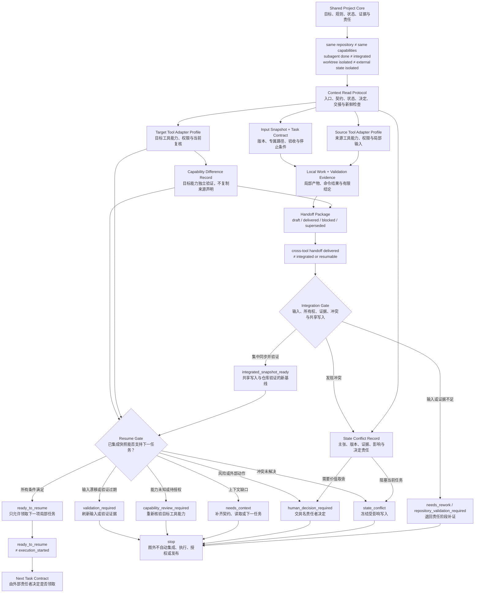

# 45. Codex、Claude Code 接力与长期项目上下文

> 跨工具接力不是把上一段聊天复制给下一位执行者，而是把目标、输入、证据、差异、冲突和下一步编译成可审查的项目工件。会话可以恢复，项目状态仍必须重新证明。

## 本章目标

- [ ] 将共享项目核心（Shared Project Core）与工具适配层（Tool Adapter Layer）分开，避免产品配置覆盖项目事实。
- [ ] 使用共享项目契约（Shared Project Contract）、上下文读取协议（Context Read Protocol）和任务契约（Task Contract），让新执行者从确定输入开始，而不是从聊天摘要猜测。
- [ ] 使用交接包（Handoff Package）、能力差异记录（Capability Difference Record）和状态冲突记录（State Conflict Record），保存局部结果、未知项与停止条件。
- [ ] 使用集成门（Integration Gate）与恢复准入（Resume Gate），检查会话恢复、输入漂移、局部验证和集中集成之间的证据断点。
- [ ] 为“Codex 研究、Claude Code 审查、人工集成”的教学案例设计可审查接力，同时不声称真实产品或外部系统已经运行。

## 为什么要学

长期项目很少只由一个会话完成。需求会变化，动态资料会过期，执行工具会更换，参与者也可能在几周后才回来。

若关键决定只存在于一段聊天中，下一位执行者即使打开同一个目录，也无法判断那段结论对应哪一版输入、哪些命令真实运行过，以及当时可用的权限和工具今天是否仍然存在。

同一仓库只能提供一部分共同基础。Codex 与 Claude Code 有各自的指令入口、会话机制、工具配置和权限语境。本地账户、浏览器会话、数据库连接、缓存与凭证也不会因为工作目录相同就自动一致。把这些差异隐藏起来，会让“继续工作”变成一次未经声明的环境迁移。

第 21 章已经建立跨产品项目 Harness，第 22 章已经说明仓库入口应负责导航而不是保存全部状态，第 26 章已经定义局部所有权与集中集成，第 43、44 章则分别定义 Book Harness 和内容生产角色。本章不重复这些机制，而是回答一个更窄的问题：**当执行者、产品和会话发生变化时，怎样证明下一步仍可安全开始？**

## 前置知识

- **前置章节：** 第 21 章的共享仓库契约与产品适配，第 22 章的规则入口，第 26 章的任务契约与集成门，第 43 章的章节证据包，以及第 44 章的角色与内容证据包。
- **技术前提：** 能阅读 Markdown、YAML 前置元数据（front matter）、相对路径、状态表和测试输出。
- **不要求：** 不要求安装 Codex 或 Claude Code，不要求恢复真实会话、创建 Git 工作树（worktree）、启动子代理（subagent）、配置模型上下文协议（Model Context Protocol，MCP）、授权浏览器或访问任何外部账户。

## 场景引入：同一个目录，三份不同的“现在”

设想一章技术书要经历三个动作：Codex 完成研究简报（Research Brief），Claude Code 对正文进行技术审查（Technical Review），人工编辑把局部结果集成进共享引用与进度。

研究者在聊天里说“来源已确认”，审查者看到正文前置元数据写着 `draft`，进度表却仍把初稿（Draft）标为未开始；与此同时，历史交接记录引用的是更早一版提纲（Outline）。

若团队把“最近一条消息”当作真相，研究阶段可能被重复执行；若把“最新修改时间”当作真相，又可能让一份没有验证的状态表覆盖真实正文。正确问题不是哪个工具更可信，而是：每份结论基于什么输入，证据是否仍新鲜，谁拥有局部写入，谁负责共享集成。

**成功标准：** 下一位执行者可以定位稳定目标、当前输入、专属路径、实际验证、未覆盖范围和下一项任务；发现能力未知、状态冲突或输入漂移时可以停止，而不是自动补全故事。

**边界：** 这是虚构教学场景。本章没有启动 Codex 或 Claude Code 会话，没有委派子代理，没有创建工作树，也没有修改真实权限、账户、浏览器、MCP、网络或外部系统。

## 共享项目核心与工具适配层

跨工具项目不需要把所有产品配置压成一份“通用提示（Prompt）”。它需要的是稳定核心与可过期适配的分层。

| 层 | 保存什么 | 谁负责更新 | 不能推出什么 |
| --- | --- | --- | --- |
| 共享项目核心 | 目标、范围、规则、决定、状态、下一任务、术语、引用、验收与交接 | 项目维护者和唯一集成者 | 任一工具已读取、理解或执行 |
| 工具适配层 | 产品入口、资料日期、配置来源、权限语境、可用能力、命令映射和未知项 | 对应工具使用者 | 两个工具能力等价或权限已授予 |
| 会话辅助层 | 当前聊天、恢复记录、自动记忆（auto memory）、子代理摘要 | 当前产品或使用者 | 项目事实永久、新鲜或跨产品同步 |
| 外部运行层 | 账户、浏览器、数据库、缓存、凭证和远端目标 | 环境与业务责任者 | 仓库路径隔离等于外部状态隔离 |

这四层的权威性不是从上到下简单递减。共享核心负责项目意图和可审查状态；外部运行层负责真实效果；适配层说明当前工具怎样接近它们；会话辅助层只帮助定位。一个外部系统的最新观察可能推翻旧状态，但一段新的聊天摘要不能无证据地覆盖共享项目核心。

### Codex 产品入口的有限事实

写作日当前 Codex Manual 将 `AGENTS.md` 描述为会进入 Codex 上下文的仓库指导入口。手册列出构建/测试命令、审查期望、仓库约定和目录特定指导等适合保存的内容，并说明更具体目录中的指导可以覆盖较上层指导 [REF-140](45-codex-claude-code-handoff-and-long-term-context.references.md)。

同一手册还说明 Codex 可以将独立工作交给子代理，由主线程收集结果并检查局部线程 [REF-141](45-codex-claude-code-handoff-and-long-term-context.references.md)。

这些陈述只描述 Codex 当前产品语境。它们不证明本章已经启动子代理，也不证明不同子代理拥有文件隔离。主线程收集的摘要是否通过集成验证，仍需单独检查。

### Claude Code 产品入口的有限事实

写作日当前 Claude Code 官方资料将 `CLAUDE.md` 与自动记忆描述为跨会话保存指令和学习记录的两种产品机制，并明确把它们作为上下文而不是强制配置 [REF-142](45-codex-claude-code-handoff-and-long-term-context.references.md)。

官方工作流还提供恢复既有会话、使用工作树运行并行会话和委派研究的入口 [REF-143](45-codex-claude-code-handoff-and-long-term-context.references.md)。

Claude Code 的子代理官方资料说明，非分叉子代理（non-fork subagent）从隔离上下文开始，自定义子代理（custom subagent）可以配置提示、工具和权限，并把结果返回主会话。分叉（fork）是明确例外，会继承父会话上下文 [REF-144](45-codex-claude-code-handoff-and-long-term-context.references.md)。这些能力仍属于 Claude Code 产品语境；不能据此推断 Codex 行为、跨会话团队状态或外部系统已经隔离。

本仓库写作日实际存在 `AGENTS.md` 与 `CLAUDE.md`。后者只把 Claude Code 引向共同的 `AI_BOOTSTRAP.md`、`BOOK_RULES.md` 和相关上下文，并说明使用相同完成定义。文件内容可以被人工检查，但其存在仍不证明任何 Claude Code 会话已读取或遵守。

## 共享项目契约（Shared Project Contract）：固定共同目标，不固定产品实现

共享项目契约（Shared Project Contract）是本书为跨工具接力定义的工程模型。它不是 Codex、Claude Code 或某个 Agent 软件开发工具包（Agent SDK）的协议。

| 字段 | 回答的问题 | 本仓库示例 | 不能替代 |
| --- | --- | --- | --- |
| `contractVersion` / `effectiveFrom` | 当前任务依据哪版契约，何时生效？ | 由输入快照引用的契约版本 | 当前文件仍未漂移的证明 |
| `objective` | 项目最终为谁解决什么问题？ | 发布可验证的中文 Harness Engineering 技术书 | 当前任务说明 |
| `scope` / `nonScope` | 哪些输出属于项目，哪些明确不做？ | 章节、示例、图示与审查；不自动发布 | 运行时权限 |
| `ruleEntrypoints` | 稳定规则从哪里读取？ | `AGENTS.md`、`CLAUDE.md`、`BOOK_RULES.md` | 产品已加载证明 |
| `sourcesOfTruth` | 状态、任务、术语、引用分别以什么为准？ | `.context/` 与 `.ai/` 中的对应工件 | 工件内容正确证明 |
| `definitionOfDone` | 哪些硬性证据缺一不可？ | 章节阶段、验证、状态同步 | 出版批准 |
| `forbiddenActions` | 哪些动作不能由局部执行者完成？ | 局部工作不改共享状态，不自动提交 | 技术拦截 |
| `decisionOwners` | 冲突、共享写入和批准由谁决定？ | 主线程或人工集成者 | 身份认证或授权令牌 |

共享契约的价值不是永不变化，而是变化有入口。目标或完成定义发生变化时，应由具名责任者更新契约并让受影响任务重新取得输入；不能让某个工具的私有设置静默扩大项目范围。

## 上下文读取协议（Context Read Protocol）：恢复项目，不只是恢复会话

上下文读取协议（Context Read Protocol）规定下一位执行者怎样建立输入基线。它同样是本书模型，不是产品内部加载顺序。

1. **读取工具入口。** 从当前产品的入口定位共享规则；不从入口文件推断权限。
2. **读取共享项目契约。** 确认目标、范围、禁止项、事实来源与决定责任。
3. **读取当前状态。** 比较当前状态（Current State）、下一任务（Next Task）与进度表，记录它们对应的更新时间和验证范围。
4. **读取决定与交接。** 查找影响当前任务的决定、交接包、未覆盖项和冲突记录。
5. **读取任务材料。** 只读取与当前可验收任务有关的研究、提纲、正文、示例或审查工件。
6. **建立输入快照。** 记录任务依赖的路径、版本标识、更新时间或内容摘要，以及动态资料的复核日期。
7. **声明适配差异。** 检查当前工具、权限、沙箱（Sandbox）、网络、子代理、浏览器、MCP 和命令是否为已验证、不可用、未知或待授权。
8. **运行新鲜检查。** 对任务必需的格式、链接、测试或外部观察执行当前验证；历史结果只保留其原有范围。

产品会话恢复只覆盖其中一部分。即使 Claude Code 能恢复本地会话，或某个产品记忆能找回旧偏好，工作树、来源页面、外部账户和验证结果仍可能已经变化。恢复会话后应重新执行上下文读取协议，而不是直接继续写入。

以下任一情况出现时，读取协议应停止：

- 共享契约、状态或任务入口缺失；
- 多个状态工件对当前阶段给出不同值；
- 交接包指向的输入已变化；
- 当前任务依赖未验证能力或未授权动作；
- 专属路径已经被其他 owner 领取；
- 历史验证不能覆盖当前文件或动态事实。

停止不是失败。它把“需要补证”与“可以继续”分开，防止接力者用模型推断填补项目缺口。

## 工具适配档案（Tool Adapter Profile）：把差异写成可过期声明

工具适配档案（Tool Adapter Profile）记录某个工具在当前环境中怎样接入共享项目。其字段必须有来源日期，且未知项必须保留为未知。

| 字段 | 记录内容 | 保守写法 |
| --- | --- | --- |
| `tool` | 产品与使用表面 | `Codex CLI`、`Claude Code CLI` 或 `human` |
| `profileVersion` / `inputSnapshot` | 档案对应哪次环境观察和任务输入？ | 目标工具开始接力时重新记录 |
| `officialEvidence` | 官方资料、访问日期与允许用途 | 只引用当前产品，不跨产品外推 |
| `instructionEntrypoint` | 入口及作用范围 | 路径存在不等于已加载 |
| `configurationSources` | 项目、用户或组织配置来源 | 未检查时写 `unknown` |
| `sandboxAndApproval` | 文件、命令、网络和批准边界 | 能看到工具不等于获准使用 |
| `capabilities` | 子代理、浏览器、MCP、会话恢复等 | 分别标记状态，不用一个总开关 |
| `commandMappings` | 项目命令在当前环境的实际入口 | 未执行命令不记录为通过 |
| `limitations` | 缺失能力、版本差异和替代路径 | 不静默降级到未验证方案 |
| `reviewedAt` | 动态事实复核日期 | 过期后重新读取官方资料 |

工具适配档案不能覆盖共享项目契约。若 Claude Code 的本地偏好要求使用另一种包管理器，而仓库事实明确规定当前项目使用既有锁文件和命令，适配档案应报告冲突，而不是修改共同目标。若一个 Codex 会话能够使用某个浏览器工具，也不能把该能力复制到 Claude Code 档案中。

## 能力差异记录（Capability Difference Record）：能力不等价时怎样路由

能力差异记录（Capability Difference Record）把“两个工具不一样”从口头印象变成任务输入。

| 字段 | 作用 |
| --- | --- |
| `capability` | 任务依赖的具体能力，如只读网页访问、子代理或仓库写入 |
| `sourceToolStatus` | 来源工具上的 `available_and_verified`、`unavailable`、`unknown` 或 `requires_authorization` |
| `targetToolStatus` | 目标工具上的同类状态，独立判断 |
| `evidence` | 当前会话实际可见能力、官方资料或验证记录 |
| `taskImpact` | 缺失能力影响哪项输入、动作或验收 |
| `alternative` | 受限替代路径及其新边界 |
| `owner` | 谁可以授权、重新分配或接受降级 |

一个典型差异是：来源工具通过已登录浏览器读取了动态页面，目标工具没有相同会话。交接包可以保存页面标题、访问日和允许结论，但不能把来源工具的浏览器权限传给目标工具。若技术审查必须重读页面，目标工具应取得自己的已验证访问路径，或返回 `capability_review_required`。

能力差异的保守出口包括：

- `available_and_verified`：当前任务可使用，但仍受 Task Contract 和权限边界约束；
- `unavailable`：选择不依赖该能力的可验收任务，或重新分配；
- `unknown`：先诊断，不从来源工具推断；
- `requires_authorization`：等待具名责任者批准；
- `alternative_required`：记录替代路径、损失的证据和新的验收条件。

## 任务所有权：会话、子代理与工作树各自隔离什么

第 26 章已经定义任务契约。本章只补充接力所需字段：来源工具、目标工具、输入快照、接力原因和适配档案版本。

| 隔离机制 | 可能隔离什么 | 不能自动隔离什么 |
| --- | --- | --- |
| 新会话 | 当前对话上下文 | 仓库文件、账户、浏览器、数据库和缓存 |
| 子代理 | 产品内的局部上下文与部分工具范围 | 共享文件语义、外部目标、最终集成责任 |
| Git 工作树 | Git 工作树和分支上的文件修改 | 非 Git 文件、共享服务、凭证、端口和远端状态 |
| 专属路径 | 约定中的局部写入所有权 | 操作系统级锁、权限或恶意越界 |
| 人工分工 | 决定和责任范围 | 技术控制或自动验证 |

因此，一个可领取的接力任务至少要声明 `owner`、`sourceTool`、`targetTool`、`inputSnapshot`、`exclusivePaths`、`requestedSharedWrites`、`acceptanceChecks` 和 `stopConditions`。没有输入快照的审查可能针对旧稿；没有专属路径的两位写作者可能同时覆盖正文；没有共享写入请求的局部执行者可能越权修改进度表，制造新的冲突。

## 交接包（Handoff Package）：交付证据，不交付“相信我”

交接包（Handoff Package）是本书为跨工具接力定义的主要接口。它不是完整聊天导出，也不是产品会话文件。

| 字段 | 必须回答的问题 | 不足时的风险 |
| --- | --- | --- |
| `status` | 交接包是 `draft`、`delivered`、`blocked` 还是 `superseded`？ | 未完成或失效的包被当成可集成输入 |
| `objective` / `taskRef` | 本次局部目标是什么？ | 下一位扩大或缩小任务 |
| `inputBaseline` | 依据哪一组规则、来源和稿件？ | 旧结果覆盖新输入 |
| `ownedArtifacts` | 本次实际修改或创建了什么？ | 摘要无法回到文件 |
| `commandsAndResults` | 哪些命令真实运行、退出码和关键结果是什么？ | “已验证”不可回放 |
| `limitedConclusions` | 证据只支持什么结论？ | 局部通过冒充全仓或外部成功 |
| `notRun` | 哪些工具、系统、权限和效果没有验证？ | 未知项被误写成成功 |
| `capabilityDifferences` | 目标工具需要重新确认什么？ | 从来源工具复制能力假设 |
| `stateConflicts` | 哪些状态仍不一致？ | 最后写入者静默覆盖 |
| `requestedSharedWrites` | 哪些共享更新交给集成者？ | 局部 worker 越权写共享真相 |
| `nextTask` | 下一项可验收任务及停止条件是什么？ | “继续处理”无法领取 |

`delivered` 只表示局部责任者已经交出工件和证据，不表示集成门已经接受。输入变化后，旧包应标为 `superseded`，而不是继续导航下一任务。

交接包中的命令结果必须保留时间和输入范围。例如，“定向 Markdown lint 通过”只支持指定文件满足当时规则；后续新增文件后，不能把它写成全仓验证（Validation）。子代理返回摘要也只能作为交接包的一项输入，主线程仍要核对产物和验证。

## 状态冲突记录（State Conflict Record）：不要让最后写入者决定真相

状态冲突记录（State Conflict Record）保存多个工件对同一事实给出不同值时的证据。它不自动选出胜者。

| 字段 | 示例问题 |
| --- | --- |
| `conflictKey` | 第 45 章 Draft 是否完成？ |
| `conflictType` | 这是范围、目标状态、完成证据、所有权还是价值取舍冲突？ |
| `claims` | 前置元数据、进度表、当前状态和交接包分别写了什么？ |
| `evidencePaths` | 每项主张能回到哪个文件或命令？ |
| `inputVersions` | 这些主张对应哪一版正文和规则？ |
| `freshness` | 最近一次相关验证发生在何时、覆盖什么？ |
| `authorityBasis` | 哪条适用契约、事实源或决定责任可以裁决该类冲突？ |
| `impact` | 冲突是否阻止当前任务或共享写入？ |
| `temporaryAction` | 冻结哪项写入、允许哪些只读调查？ |
| `decisionOwner` | 谁可以根据证据修正共享状态？ |
| `resolution` | `resolved_from_evidence`、`needs_refresh`、`human_decision_required` 或 `blocked` |

冲突不能用一条固定优先级处理。先按 `conflictType` 选择对应依据：

| 冲突类型 | 首要依据 | 仍需检查 | 不允许的替代 |
| --- | --- | --- | --- |
| 范围与允许动作 | 当前适用的用户目标、共享项目契约与更高层规则 | 版本、生效范围和决定责任 | 用工具偏好扩大任务或权限 |
| 目标状态 | 已声明事实源上的新鲜直接观察 | 观察时间、身份、环境和输入版本 | 只看摘要或文件修改时间 |
| 完成证据 | 当前完成定义（Definition of Done）与绑定输入的新鲜验证 | 未覆盖范围和硬性失败项 | 用文件存在或局部绿色结果抵消缺口 |
| 所有权与并发 | 任务契约、所有权声明（Ownership Claim）和输入快照 | 路径重叠、共享写入和外部目标 | 让最后写入者获胜 |
| 价值、风险或取舍 | 具名决定责任者的显式决定 | 适用版本、理由和遗留风险 | 用模型自信度自动裁决 |

聊天、auto memory 和旧摘要只作定位线索。实际工件可以证明内容存在，新鲜验证可以证明指定检查，但二者都必须放回对应契约和冲突类型中解释；这避免把“正文永远比进度表权威”误写成另一条机械规则。

以下策略都应拒绝：

- 选择修改时间最新的文件；
- 选择回答更长或语气更自信的工具；
- 默认 Codex、Claude Code 或人工记录具有固定优先级；
- 用局部测试通过覆盖状态冲突；
- 在没有决定责任者时自动合并两个结论。

## 完整案例：Codex 研究 → Claude Code 审查 → 人工集成

下面的流程是教学案例，没有真实启动任何产品。

### 阶段一：Codex 交付研究

集成者先签发任务契约：Codex 只拥有 `chapter.research.md` 与 `chapter.references.md`，输入是章节问题、研究政策和候选来源；共享 `.ai/references.md`、进度表和正文均为只读。Codex 的工具适配档案记录 `AGENTS.md` 入口、写作日官方资料和当前可用能力。

Codex 完成后交付交接包，其中列出来源标题、URL、访问日、允许陈述、不可外推范围、实际链接检查和未访问页面。若某个来源需要账户或浏览器能力但当前不可用，它进入能力差异记录，而不是被一段推测摘要替代。

### 阶段二：集成者冻结初稿输入

人工集成者审查研究交接，将已接受来源登记到共享引用表，并为初稿建立输入快照。这个动作不等于接受所有研究结论；它只确定下一阶段可以引用哪组来源和边界。

若研究文件已更新而正文仍引用旧版本，集成者建立状态冲突记录，标记旧审查不再覆盖新输入。共享状态只由集成者修改。

### 阶段三：Claude Code 进行技术审查

Claude Code 的任务只拥有技术审查记录；正文可以在修复明确问题时按任务契约修改，共享状态仍为只读。其工具适配档案指向实际 `CLAUDE.md`、官方资料复核日期和当前权限，而不是复制 Codex 档案。

审查者逐项核对正文主张、研究简报、引用映射、相邻章节边界和未运行范围。即使它能恢复旧 Claude Code 会话，仍必须先执行上下文读取协议；恢复记录不能替代最新初稿快照。若它发现引用冲突，则创建或补充状态冲突记录，不自行重编号共享引用。

### 阶段四：人工集成门

集成者接收两份交接包，核对输入版本、专属路径、实际命令、未覆盖范围和共享写入请求。只有局部证据可接受、冲突已解决、共享工件已同步且当前全仓质量门通过，才生成新的项目交接包。

这条流程保留五个断点：

```text
research_delivered != sources_integrated
session_resumed != project_state_fresh
review_completed != conflicts_resolved
local_validation_passed != repository_validated
handoff_delivered != integrated_snapshot_ready
```

案例没有运行 Codex、Claude Code、子代理、工作树、浏览器、MCP、模型、网络或外部权限。“Codex”和“Claude Code”只是任务角色的产品标签。真实实施还需要当前账户、环境、数据和批准边界。

## 集成门与恢复准入：一个集成，一个准入

第 26 章已经定义集成门负责局部交付进入共享真相前的集中检查。本章不重定义通用协作机制，只补充跨工具输入：来源/目标工具适配档案、能力差异记录、交接包状态和接力输入快照。

| Gate | 负责什么 | 可产生的本书状态 | 明确不负责 |
| --- | --- | --- | --- |
| Integration Gate | 核对 Task Contract、输入版本、专属路径、局部证据、冲突和共享写入请求；由唯一集成责任同步共享工件并触发全仓验证 | `needs_rework`、`state_conflict`、`repository_validation_required`、`integrated_snapshot_ready` | 不恢复目标工具会话，不授予权限，不批准发布 |
| Resume Gate | 基于已集成快照和目标工具档案，判断下一项局部任务能否领取 | `needs_context`、`capability_review_required`、`state_conflict`、`integration_required`、`validation_required`、`ready_to_resume`、`human_decision_required` | 不写共享状态，不运行命令，不自动开始任务 |

只有共享写入完成、冲突按责任解决且当前全仓验证达到契约要求后，集成门才能产生 `integrated_snapshot_ready`。这仍不表示书稿完成或已出版；它只给恢复准入一份可定位的新基线。

### 恢复准入：下一工具何时可以继续

恢复准入是本书的纯判断接口。它读取共享项目契约、工具适配档案、输入快照、任务契约、交接包、能力差异记录、状态冲突记录和验证证据（Validation Evidence），不恢复会话，也不运行命令。

| 检查 | 通过条件 | 失败出口 |
| --- | --- | --- |
| 契约 | 目标、范围、禁止项和责任者明确且匹配 | `needs_context` |
| 读取 | 必读工件存在，输入快照可定位 | `needs_context` |
| 集成 | Handoff Package 已绑定 `integrated_snapshot_ready` | `integration_required` |
| 新鲜度 | 任务依赖未漂移，动态资料满足刷新条件 | `validation_required` |
| 能力 | 所需能力已在目标工具验证并获当前任务授权 | `capability_review_required` |
| 所有权 | 专属路径不重叠，共享写入有唯一集成者 | `state_conflict` |
| 冲突 | 不存在影响当前任务的未解决冲突 | `state_conflict` |
| 决定 | 风险或取舍已有适用版本的显式决定 | `human_decision_required` |
| 验证 | 局部验收覆盖当前输入，结论范围明确 | `validation_required` |
| 下一任务 | 目标、输入、输出、验收与停止条件可判定 | `ready_to_resume` |

`ready_to_resume` 只表示当前注入记录允许领取下一项局部任务。它不表示项目完成、全仓通过、产品会话已恢复、权限已授予或外部状态已改变。若冲突需要业务取舍，Gate 返回 `human_decision_required`；它不能替人作决定。

## 最小示例：纯内存接力准入器

示例实现（Example Implementation）已提供 `assessCrossToolHandoff(input)`。它只接收调用方注入的普通对象：

- `sharedProjectContract`；
- `sourceToolProfile` 与 `targetToolProfile`；
- `inputSnapshot` 与 `taskContract`；
- `handoffPackage`；
- `capabilityDifferences`；
- `stateConflicts`；
- `validationEvidence`；
- `resumeRequest`。

输出为 `needs_context`、`capability_review_required`、`state_conflict`、`integration_required`、`validation_required`、`ready_to_resume` 或 `human_decision_required`，并固定携带 `executionPerformed: false`。

15 项测试覆盖共享契约缺失、读取协议缺口、适配档案缺失或过期、输入漂移、能力未知、路径重叠、局部交付尚未集成、验证过期、未解决冲突、完整接力和外部执行请求。

测试先以 `ERR_MODULE_NOT_FOUND` 获得红灯（RED），再由同一命令得到 15 项通过、0 项失败。教学演示输出 `ready_to_resume / cross_tool_handoff_ready / claim_next_task / executionPerformed:false`。

这些结果只证明注入对象上的确定性分类。函数没有读取仓库、恢复会话、启动 Codex 或 Claude Code、委派子代理、创建工作树、运行 Git、修改共享文件或发送外部消息。接口、测试矩阵与命令证据见[第 45 章示例计划](45-codex-claude-code-handoff-and-long-term-context.example-plan.md)。

## 架构图：从跨工具交接到恢复准入

下图回答三个问题：共享项目核心怎样通过上下文读取协议约束来源与目标工具适配档案；局部交接包为什么必须先经过集成门；哪些证据断点会阻止恢复准入把“收到交接”误写成“可以恢复并执行”。



图源见 [Mermaid 文件](../../diagrams/mermaid/chapter-45-cross-tool-handoff-resume-flow.mmd)，导出物见 [SVG](../../diagrams/exported/chapter-45-cross-tool-handoff-resume-flow.svg) 与 [PNG](../../diagrams/exported/chapter-45-cross-tool-handoff-resume-flow.png)。

文本替代说明：共享核心先建立读取基线和两侧适配档案。来源工具交付的局部证据只能形成交接包，必须经过唯一集成门才能得到已集成快照。能力未知、状态冲突、输入漂移、验证过期和外部动作分别离开主链。即使恢复准入返回 `ready_to_resume`，流程也只到下一项任务契约，不表示任务已经领取或执行。

## 逐步增强

1. **先人工维护工件。** 用 Markdown 保存共享契约、适配档案、交接、冲突和恢复判断，验证责任关系是否清晰。
2. **增加只读检查。** 校验必读路径、输入摘要、链接和命令证据，不自动修改共享状态。
3. **增加专属工作面。** 当任务量确实需要并行时，再引入路径所有权、worktree 或队列，并独立处理外部状态。
4. **增加受限消息协议。** 结构化传递 Handoff Package，不传递密钥、隐藏指令或未经审查的完整会话。
5. **增加自动 Resume Gate。** 只在输入、能力、冲突和验证可机器判定时自动放行；业务取舍保留人工出口。

每次增强只增加一种责任。把所有聊天保存下来不会自动得到可维护上下文；自动同步更多文件也不会解决冲突判定和权限问题。

## 测试与验证

| 层级 | 验证对象 | 命令或方法 | 成功标准 | 当前状态 |
| --- | --- | --- | --- | --- |
| 初稿格式 | 本章 Markdown | 定向 Markdown lint | 0 个错误 | 已执行，0 个错误 |
| 本地链接 | 本章引用、相邻章节与图示路径 | 定向链接与路径检查 | 所有目标可定位 | 已执行，当前正文 13 个链接通过 |
| 示例 | `assessCrossToolHandoff` | Node 内置测试与教学演示 | 保守状态符合契约 | 已执行，15 项通过、0 项失败；演示退出码 0 |
| 图示 | 接力责任图 | Mermaid CLI 导出与 PNG 视觉检查 | 图源、正文和导出一致 | 已执行，详见图示审查（Diagram Review） |
| 跨工具端到端 | 真实 Codex → Claude Code → 人工集成 | 需要独立环境与授权 | 工件、权限、状态和效果均可观察 | 未执行 |

定向 Markdown 检查只能证明稿件格式和链接，不证明产品能力、接力正确性或外部效果。纯内存示例通过也只能证明注入对象上的确定性分类。

## 常见错误

| 错误 | 表现 | 根因 | 修复方向 |
| --- | --- | --- | --- |
| 把聊天当 Handoff Package | 下一位只有一段“继续完成”的摘要 | 没有输入、路径和证据接口 | 编译为结构化交接并链接原始工件 |
| 把会话恢复当项目恢复 | 直接沿用旧结论和旧命令结果 | 忽略工作树与外部状态漂移 | 重新执行 Context Read Protocol |
| 复制适配档案 | Claude Code 继承 Codex 的工具/权限声明 | 把产品相似性当等价性 | 分别核验并记录 Capability Difference |
| 让最后写入者获胜 | 进度表覆盖正文或 review | 没有冲突记录和决定责任 | 保存各自证据，交具名 owner 决定 |
| 子代理完成即集成 | 主线程转述摘要后更新共享状态 | 局部结果未核对 | 检查产物、输入和验证，再进集成门 |
| 工作树等于完全隔离 | 两个任务仍争用浏览器或数据库 | 只隔离了 Git 工作树 | 分别声明外部目标、身份和资源 |
| 局部 lint 等于全仓通过 | 新增文件后沿用历史 Validation | 验证范围和时间未记录 | 记录有限结论并重跑当前全仓门 |
| 恢复准入自动执行 | 准入通过后直接修改或发布 | 把判断与动作合并 | 保持 `ready_to_resume` 与执行授权分离 |

## 安全、隐私与责任边界

- **最小上下文：** 交接包保存完成接力所需的摘要和定位，不复制隐藏系统提示、私密聊天、令牌、个人数据或未授权全文。
- **不可信输入：** 外部网页、问题单（issue）、日志和上一工具输出都是证据候选，不能覆盖共享项目契约或指令层级。
- **最小权限：** 读取任务不因接力获得写权限；局部责任者不因创建交接包获得共享状态或发布权限。
- **秘密与账户：** 不把凭证写进工具适配档案；只记录引用、范围、状态和具名授权入口。
- **动态事实：** 产品页面、命令、配置和能力会变化，适配档案必须记录复核日期；过期后返回补证而不是继续外推。
- **人工责任：** 状态冲突、范围变化、权限升级和发布决定由有责任的人处理。Agent 可以分类和建议，不能自授决定权。

本章没有验证 Codex 与 Claude Code 的跨工具通信、会话迁移、共享记忆、子代理团队、权限、工作树、浏览器、MCP、网络或外部系统。官方产品资料只支持各自页面中的有限陈述；共享项目契约、工具适配档案、上下文读取协议、交接包、能力差异记录、状态冲突记录和恢复准入均为本书原创工程模型。

## 章节总结

跨工具接力的稳定核心不是某个产品的聊天历史，而是仓库中可定位的目标、状态、输入、证据和责任。共享项目契约固定共同边界，工具适配档案与能力差异记录保留产品差异，上下文读取协议重新建立输入基线，交接包交付有限结论，状态冲突记录阻止无证据覆盖，恢复准入决定下一项局部任务是否可以领取。

这套模型不追求让 Codex 与 Claude Code 看起来相同。任何工具都不能借用另一工具的能力声明，也不能把会话恢复、子代理完成、局部测试或工作树隔离写成项目已经集成。第 46 章将在这套可追溯内容基础上讨论如何把书籍扩展为课程、博客和知识库；媒介可以变化，输入身份和证据边界仍需保留。

## 练习

1. 为一个需要在 Codex 与 Claude Code 间接力的仓库写一份 Shared Project Contract，明确三类事实来源和两项禁止动作。
2. 选择一个产品特有能力，分别为来源工具和目标工具填写 Capability Difference Record；说明在 `unknown` 时为什么不能继续。
3. 构造一个“正文为 draft、进度表为 complete、历史测试覆盖旧版本”的冲突，写出 State Conflict Record 和决定责任者。
4. 将一段“已完成，请继续”的聊天摘要改写成 Handoff Package，补齐输入基线、实际命令、未覆盖范围和共享写入请求。
5. 为一次会话恢复设计 Resume Gate，列出至少三个必须重新验证的项目状态。

## 延伸阅读

- [Codex：Custom instructions with AGENTS.md](https://learn.chatgpt.com/docs/agent-configuration/agents-md.md) [REF-140]：Codex 仓库指导入口与层级语境，访问日期 2026-07-17。
- [Codex：Subagents](https://learn.chatgpt.com/docs/agent-configuration/subagents.md) [REF-141]：Codex subagent 与主线程收集结果的当前产品背景，访问日期 2026-07-17。
- [Claude Code：How Claude remembers your project](https://code.claude.com/docs/en/memory) [REF-142]：`CLAUDE.md`、规则与 auto memory 的产品边界，访问日期 2026-07-17。
- [Claude Code：Common workflows](https://code.claude.com/docs/en/common-workflows) [REF-143]：会话恢复、worktree 和委派研究的工作流入口，访问日期 2026-07-17。
- [Claude Code：Create custom subagents](https://code.claude.com/docs/en/sub-agents) [REF-144]：独立上下文、工具与权限限制的产品背景，访问日期 2026-07-17。
- [第 45 章 Research Brief](45-codex-claude-code-handoff-and-long-term-context.research.md)：研究问题、来源边界与计划工件。
- [第 45 章 Outline](45-codex-claude-code-handoff-and-long-term-context.outline.md)：逐节蓝图、案例与后续阶段契约。
- [第 45 章参考资料](45-codex-claude-code-handoff-and-long-term-context.references.md)：局部键与 REF-140 至 REF-144 的映射。
- [第 45 章事实核验](45-codex-claude-code-handoff-and-long-term-context.fact-check.md)：动态产品事实、工程模型、虚构输入与当前运行证据的分层复核。

## 参考资料

- [REF-140](45-codex-claude-code-handoff-and-long-term-context.references.md)：只支持 Codex `AGENTS.md` 的当前产品入口与层级语境。
- [REF-141](45-codex-claude-code-handoff-and-long-term-context.references.md)：只支持 Codex subagent 的当前产品背景。
- [REF-142](45-codex-claude-code-handoff-and-long-term-context.references.md)：只支持 Claude Code `CLAUDE.md`、规则和 auto memory 的当前产品背景。
- [REF-143](45-codex-claude-code-handoff-and-long-term-context.references.md)：只支持 Claude Code 会话恢复、worktree 和委派研究的当前产品背景。
- [REF-144](45-codex-claude-code-handoff-and-long-term-context.references.md)：只支持 Claude Code subagent 的独立上下文、工具与权限语境。

## 本章完成检查

- [x] Front matter、本章目标、前置知识、场景和相邻章节边界已写入。
- [x] 共享项目契约、工具适配档案、上下文读取协议、交接包、能力差异记录、状态冲突记录和恢复准入已形成初稿（First Draft）。
- [x] Codex 与 Claude Code 产品事实分别归因 REF-140 至 REF-144，没有虚构共同产品协议。
- [x] Codex 研究、Claude Code 审查、人工集成案例明确为未运行教学案例。
- [x] 来源事实、本书工程模型、本仓库路径事实、虚构案例和未运行范围已分开。
- [x] `assessCrossToolHandoff`、15 项测试与无副作用演示已经实现并获得新鲜证据。
- [x] Mermaid 图源、SVG/PNG 导出、正文逐字同步与视觉审查已经完成。
- [x] 技术审查已复核产品事实、工件责任、冲突优先级、相邻章节边界和阶段时态。
- [x] 事实核验（Fact Check）已重读五项官方资料并复跑示例、演示和图源一致性检查。
- [x] 语言编辑（Language Editing）已统一术语首现、中英文、产品事实主语、长句和阶段时态。
- [x] 终审（Final Review）已核对 Research、References、Outline、正文、Example、Diagram、Fact、Language 与 Technical Review 的来源、状态、路径和未运行边界；章节专属工件可进入最终全仓 Validation。
- [x] 最终全仓 Validation、共享状态同步与章节完成判定已执行并通过。
