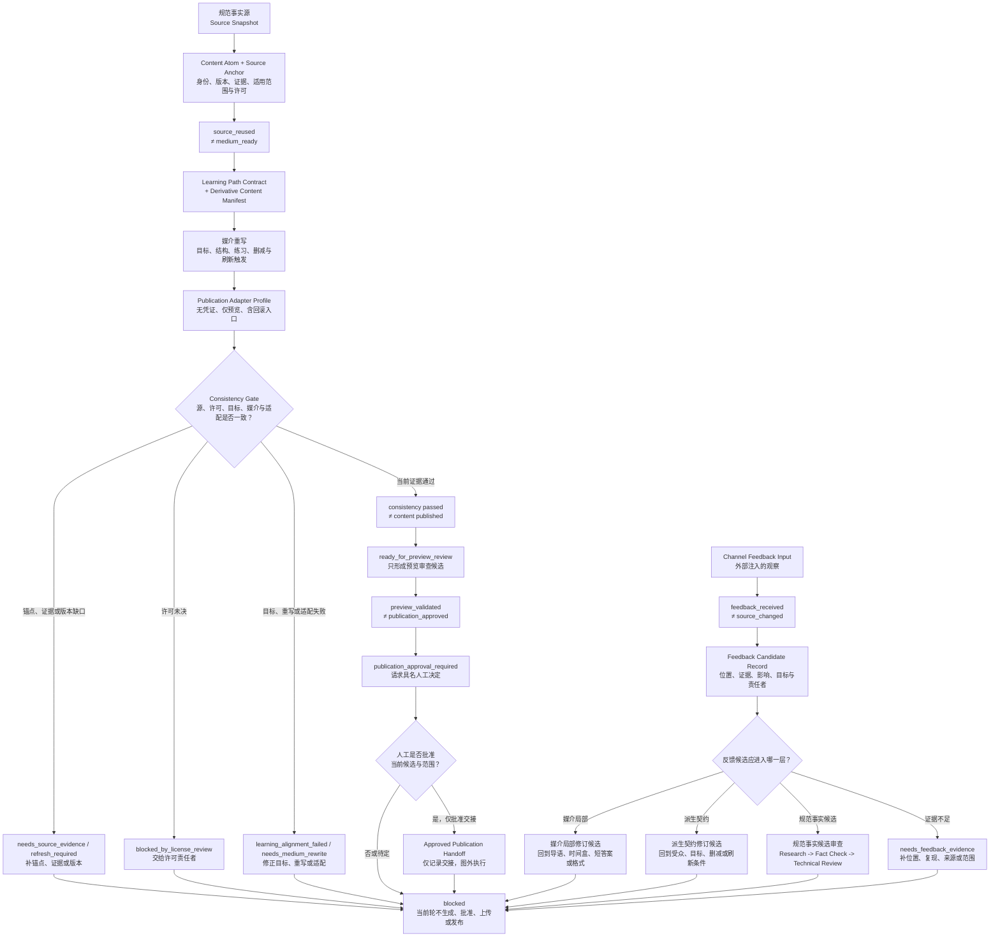

# 46. 从书籍扩展到课程、博客和知识库

> 可持续的内容复用不是把一章复制五遍，而是让事实、示例、图示和术语拥有可追溯身份，再为每种媒介重新承担读者任务、学习目标和发布责任。

## 本章目标

- [ ] 解释为什么“书稿是规范事实源”不等于“所有渠道使用同一段文字”。
- [ ] 用内容原子（Content Atom）与来源锚点（Source Anchor）标识可复用资产，同时保留版本、来源、适用范围和许可边界。
- [ ] 用学习路径契约（Learning Path Contract）对齐受众、前置、目标、练习、反馈和评估。
- [ ] 为教程、工作坊、博客、常见问题（FAQ）与知识库条目判断可复用内容和必须重写的部分。
- [ ] 用派生内容清单（Derivative Content Manifest）、发布适配档案（Publication Adapter Profile）和一致性门（Consistency Gate）检测漂移，而不自动发布。
- [ ] 把渠道反馈路由为反馈候选记录（Feedback Candidate Record），而不是直接覆盖规范书稿。

## 为什么要学

一本技术书写完后，内容团队常听到同一个要求：“顺便做成课程、博客和知识库。”文件已经存在，看起来只需要切片、缩写和换格式。第一次复制通常很快；真正的成本出现在第二次更新之后。

源章节把一个接口从 `draft` 改成 `ready`，博客仍引用旧字段；课程写着“学员能诊断准入失败”，练习却只要求背诵五个名词；常见问题为了简短删掉权限前提；知识库片段被索引后脱离产品版本；读者在工作坊指出示例问题，维护者直接修改书稿，却没有来源复核。此时团队拥有的不是五种内容产品，而是五份互相竞争的真相。

Diátaxis 区分教程、操作指南、参考和解释，强调它们服务不同的用户需要 [REF-132]。这提醒我们先问“读者要完成什么”，但它不规定本章必须生产哪些渠道，也不保证分类后的内容正确。OASIS DITA 1.3 则提供面向主题、按信息类型组织、复用和单一来源（single-source）的标准背景 [REF-145]；本章不会把 Markdown 工件称为 DITA 实现，也不要求引入 XML 工具链。

本章的目标更小：为书稿与派生物之间建立可检查的供应链。书稿继续承担规范事实源；派生内容说明自己使用了哪一版、为谁重写、删去了什么、怎样验证、何时必须刷新。自动化可以检测缺口和生成预览候选，最终发布仍由具名责任者决定。

## 前置知识

- 第 13 章：知识库、索引、候选片段和证据不是同一对象。
- 第 28 章：最小 Harness 的任务合同、停止条件、工具请求（Tool Request）、证据计划与准入状态。
- 第 43 章：Book Harness 的章节契约、阶段记录、证据包与完成定义。
- 第 44 章：Research、Writing、Review、Fact Check 与人工决定的角色边界。
- 不要求：真实 LMS、CMS、网站、搜索服务、课程平台、分析系统、发布凭证或版权法律知识。

## 场景引入：同一章如何变成三种不同产品

**规范输入：** 第 28 章“从零搭建最小 Harness”已经有正文、研究、来源、纯内存准入示例和图示。正文中的 `assessMinimalHarnessAdmission` 只检查调用者注入的对象，返回 `ready` 或带原因码的 `stopped`，并固定保留 `executionPerformed: false`。

**派生请求：** 团队希望得到三项内容：帮助新手完成第一次装配的教程（Tutorial）；让学员练习三个准入场景的工作坊（Workshop）；回答“最小 Harness 是否只是提示词（Prompt）加工具调用”的常见问题。

**成功标准：** 三项派生物都能回链到第 28 章的当前版本、来源、示例和术语；同时分别拥有适合媒介的目标、结构、练习或短答案。任一派生物不能因为复用了经过测试的代码，就声称真实工具、权限、模型或外部系统已经运行。

**当前边界：** 本章只设计派生契约，并实现一个纯内存判断器。当前没有生成课程、博客、常见问题或知识库，没有打开 LMS/CMS，没有上传内容，也没有收集读者数据。

## 核心概念

### 单一事实源不是单一文本副本

“单一来源”至少包含三层责任：

| 层 | 回答的问题 | 可以变化的部分 | 不可被下层覆盖的部分 |
| --- | --- | --- | --- |
| 规范事实源 | 当前技术事实、接口、引用与术语是什么？ | 经 Research、Technical Review、Fact Check 和版本流程批准的修订。 | 渠道为了篇幅或转化率不能改变事实范围。 |
| 派生契约 | 这份派生物为何存在，使用哪一版输入？ | 受众、目标、所选原子、删减边界、刷新触发。 | 不能伪造源版本、许可或责任者。 |
| 媒介实现 | 读者实际看到和操作什么？ | 导语、顺序、篇幅、练习、标题、互动与平台格式。 | 不能把预览、点击或测验结果倒写成源事实。 |

这三层允许“事实身份稳定、表达针对媒介变化”。例如“准入成功不等于已经执行”是规范边界；教程可以用逐步观察解释，工作坊可以把它变成判断题，常见问题可以用两句话回答，但三者都不能删去 `executionPerformed: false` 的含义。

如果源章节变化，派生物不会神奇地同步。可靠系统只能检测版本差异、标记 `refresh_required`，再由责任者判断重写范围。自动覆盖反而会抹去媒介特有的结构和人工编辑。

### 内容原子：可复用资产需要身份和边界

本书把可复用的最小审查单元称为**内容原子（Content Atom）**。它不是按字数切出的段落，也不是任意 Markdown 标题。一个候选原子至少回答：

- `atomId`：跨派生物保持稳定的身份；
- `kind`：事实、接口、示例输入、图示、术语、警告或其他类型；
- `sourceAnchor`：规范路径、小节或资源位置；
- `sourceVersion`：它基于哪次可定位版本；
- `evidenceRefs`：支持事实的来源键或运行证据；
- `applicability`：产品、版本、环境和读者范围；
- `reviewedAt`：最近复核日期；
- `license`：允许使用和署名的当前依据；
- `status`：候选、当前、需刷新、阻塞或退役。

OASIS DITA 将 topic-oriented 与 information-typed 内容放在标准的 XML 架构中 [REF-145]。本章借用“复用前先明确类型和边界”的思想，但 Content Atom 是本书针对 Markdown 仓库的工程模型。它没有 DITA specialization、XML 验证或工具兼容含义。

以下对象通常适合作为候选原子：

- 一个带来源与适用范围的事实；
- 一个稳定接口及其状态语义；
- 一组不依赖真实环境的示例输入；
- 一张有独立图源和替代描述的图；
- 一个在全局词表中登记的术语；
- 一个不能被媒介删去的安全或证据警告。

相反，一段同时包含故事导语、五步操作、事实结论和营销行动召唤的文字，不是稳定原子。直接复用会把原媒介的叙事责任带到新媒介。

### 来源锚点：让派生物能返回规范输入

**来源锚点（Source Anchor）**至少保存仓库路径、章节或小节 ID、版本、引用键和适用范围。它承担“找到原件”的责任，不承担“原件永远正确”的责任。

锚点通过以下检查才可进入派生清单：

1. 当前仓库中能够定位；
2. 指向的版本与派生物声明一致；
3. 外部事实有引用键和复核日期；
4. 示例或图示有对应运行/审查记录；
5. 许可与署名边界能够说明；
6. 选取片段没有脱离必要上下文。

文件存在只能通过第一项。它不能证明事实新鲜、示例当前通过、图片可再授权或片段适合另一受众。

### 与相邻工件的边界

第 46 章复用了全书已有的“契约、证据、清单、适配与反馈”语言，但这些对象不能静默互换。

| 本章工件 | 相邻工件 | 关键差异 |
| --- | --- | --- |
| 内容原子（Content Atom） | 第 13 章证据单元（Evidence Unit） | 内容原子是等待派生的内容资产身份；证据单元是为当前事实主张准备的受限证据。内容原子仍需引用证据，不会因为可复用就成为事实。 |
| 来源锚点（Source Anchor） | 第 7 章记忆记录（Memory Record） | 来源锚点定位规范输入；记忆记录保存可能跨任务复用的经验或决定。锚点不负责记忆写入、读取或生命周期裁决。 |
| 学习路径契约（Learning Path Contract） | 第 43 章章节契约（Chapter Contract） | 前者组织受众能力、练习与评估；后者定义书籍章节的读者目标和完成证据。课程可复用章节目标，但必须重新对齐教学活动。 |
| 派生内容清单（Derivative Content Manifest） | 第 43 章出版候选清单（Publication Candidate Manifest） | 前者固定单个派生物的媒介、来源、删减和刷新；后者固定整本待出版书稿的身份。派生清单不能批准出版。 |
| 发布适配档案（Publication Adapter Profile） | 第 45 章工具适配档案（Tool Adapter Profile） | 前者描述内容到目标平台的格式、链接、资源和预览边界；后者描述一个 AI 工具读取和回写共享项目核心的产品能力差异。 |
| 一致性门（Consistency Gate） | 第 43 章章节完成定义（Chapter DoD） | 前者检查一个派生物的源、媒介、目标和适配一致性；后者检查书籍章节九阶段硬证据。两者都不能替代 Fact Check 或人工发布决定。 |
| 反馈候选记录（Feedback Candidate Record） | 第 16/38 章反思/反馈工件（Reflection/Feedback） | 本章记录特定派生渠道的反馈位置与候选目标；是否进入规范书稿仍需对应 Research、Fact Check 或 Technical Review。 |

这张边界表防止因为字段相似就复用错误状态。例如，课程设计通过一致性门，不表示源章节完成；书稿的章节完成定义（Chapter DoD）通过，也不表示工作坊的目标和评估已经对齐。

## 课程从学习路径契约开始

把章节变成幻灯片，仍然只是换了容器。课程需要读者在结束时能够做出某种可观察行为，并在过程中练习它。

Carnegie Mellon Eberly Center 将课程目标、评估和教学策略的对齐视为课程内部一致性的关键，并建议用学生能够做什么来表达可测目标 [REF-146]。这支持本章从目标和证据出发；它不证明本章案例已经产生学习效果。

### 学习路径契约的字段

本书的**学习路径契约（Learning Path Contract）**包含：

| 字段 | 要回答的问题 | 第 28 章工作坊候选 |
| --- | --- | --- |
| `audience` | 谁来学习？ | 能阅读 JavaScript 对象，但未构建过 Harness 的工程师。 |
| `prerequisites` | 开始前必须会什么？ | 区分任务、状态和结构化输入。 |
| `objectives` | 结束时能做什么？ | 为三种候选任务写准入判断并解释停止原因。 |
| `sequence` | 能力按什么顺序形成？ | 任务合同 → 能力范围 → 副作用 → 证据计划 → 决定。 |
| `practice` | 在哪里练习？ | 修改三个纯内存输入，预测 `ready` 或 `stopped`。 |
| `assessment` | 如何观察目标是否达到？ | 对未知输入独立给出状态、原因码和边界解释。 |
| `feedback` | 错误怎样被纠正？ | 指向缺失字段或越权假设，不代替学员重做。 |
| `completionEvidence` | 什么算完成学习活动？ | 提交可检查判断与解释；不等同生产授权。 |

目标“理解最小 Harness”太模糊。目标“为给定候选任务判断能否准入，并解释停止原因”可以对应练习和评估。如果课程要求诊断，测验却只问术语定义，一致性门应返回 `learning_alignment_failed`。

### 对齐仍不是学习证明

Learning Path Contract 能证明设计者把目标、练习与评估显式连起来。它不能证明：

- 学员确实完成活动；
- 评估题具有充分效度；
- 通过者能在生产环境安全工作；
- 课程适合不同能力、语言或无障碍需求；
- 某项证书具有组织或法律效力。

这些结论需要真实教学实施、独立评价和具体责任，而不是本章的纯内存对象。

## 派生内容清单：固定这份内容的来源与意图

**派生内容清单（Derivative Content Manifest）**是每个派生物的身份记录。最小字段包括：

- `derivativeId` 与 `medium`；
- `audience` 与读者任务；
- `sourceChapter`、`sourceVersion` 和使用的 `atomIds`；
- `rewrites`：针对媒介新增或重写的部分；
- `omissions`：明确删去什么及为何不改变事实范围；
- `learningPathId`：课程型内容使用；
- `owner` 与审查责任；
- `validationEvidence` 与未覆盖项；
- `refreshTriggers`；
- `publicationState`。

Schema.org 的 LearningResource 类型提供 `teaches`、`assesses`、`competencyRequired`、`educationalLevel` 与 `learningResourceType` 等属性 [REF-147]。它们可以帮助设计候选元数据，但该页面明确位于开发版的 new area。本章不把这些字段声明为强制 Schema，也不声称目标 LMS、搜索引擎或 CMS 支持它们。

W3C PROV-DM 用 Entity、Activity、Agent 以及使用、生成、派生和归属等关系表达 provenance [REF-135]。本章借此说明清单应保存“哪个转换使用了哪个输入、生成了哪个派生物、由谁承担责任”。当前字段没有经过 PROV 兼容性验证，保存派生链也不能证明事实正确或授权充分。

## 五种媒介需要五种完成定义

### 教程：第一次完成可观察结果

教程服务“跟着做一次”的读者。它可以复用已核验前置、示例输入和关键图，但必须新增：

- 连续且可执行的步骤；
- 每一步应看到的观察；
- 输入错误或环境不符时的恢复；
- 结束状态与下一步；
- 对示例边界的重复提醒。

第 28 章教程候选可以指导读者构造纯内存对象并观察 `ready` 或 `stopped`。它不能因为示例测试曾通过，就声称读者机器、真实工具或模型已经运行。

### 工作坊：时间盒中的练习与反馈

工作坊服务“在有限时间练习能力”。它可以复用案例、状态语义和诊断卡，但必须新增：

- 时间盒和活动顺序；
- 讲师提示与不应提前泄露的答案；
- 个人或分组练习数据；
- 与目标独立对应的评分规则（rubric）；
- 反馈、重做和复盘路径。

完成工作坊只表示活动记录满足课程完成条件；它不是生产权限、职业认证或 Agent Engineering 能力保证。

### 博客：一个观点、一段上下文、一个下一步

博客可以复用单一论点、短案例、图示和来源回链。它通常需要重写标题、导语、篇幅、上下文与行动入口。为了简短而删除产品版本、安全边界或证据限制，会使复用失效。

一篇“为什么提示词不等于 Harness”的博客可以引用第 28 章，但不能把书中的教学模型写成供应商标准，也不能把 `ready` 改写成任务成功。

### 常见问题：短答案也要有适用范围

常见问题解决一个可定位问题。最小结构是：问题、短答案、限制、相关章节、更新时间和升级入口。

问题“最小 Harness 是否等于一个提示词加工具调用？”的答案必须保留：最小 Harness 还需要任务合同、能力范围、停止条件、证据计划与状态分层；本章示例只做准入判断。若短答案无法保留这条核心边界，就不应发布为独立常见问题。

### 知识库条目：可检索不等于可直接相信

知识库条目服务工作中的快速定位。它可以复用参考字段、命令、状态和锚点，但必须新增产品、版本、权限范围、失效条件与维护者。

第 13 章已经说明，知识库、索引、候选片段、证据和答案不同。一个条目进入索引，不表示它适用于当前请求；检索到高分片段也不表示可以跳过来源、新鲜度和权限判断。

## 贯穿案例：三条派生路径

### CASE-46-A：新手教程

**目标：** 读者能准备完整候选输入，运行纯内存准入器，解释 `ready / minimal_harness_ready` 或一个 `stopped` 原因码。

**复用：** 第 28 章接口、状态语义、有效输入、流程图和 `executionPerformed: false` 警告。

**必须重写：** 安装前置、逐步构造对象、每步观察、常见错误和恢复。正文中的概念顺序不能直接冒充操作步骤。

**完成证据：** 一个新手能在隔离示例中得到预期输出并说明它没有执行工具。该证据仍不证明真实环境可用。

### CASE-46-B：三场景工作坊

**目标：** 学员对“任务合同缺失”“副作用不允许”“完整只读候选”三个输入分别给出准入结论、原因码和补证建议。

**复用：** 测试输入模式、状态、停止原因和章节诊断表。

**必须新增：** 时间盒、练习卡、讲师评分规则、未知输入和复盘问题。预期答案必须独立写明，不能用实现函数重新计算自己。

**完成证据：** 目标、练习与评估逐项相连，试讲中的歧义被记录。没有真实试讲时只能写 `workshop_design_ready`，不能写“课程有效”。

### CASE-46-C：边界常见问题

**问题：** 最小 Harness 是否只是一个提示词加工具调用？

**短答案候选：** 不是。提示词只是输入的一部分；本书的最小 Harness 还显式检查任务合同、停止条件、能力与副作用范围、证据计划，并把“可以开始”“已经执行”“已经验证”分开。第 28 章示例甚至不会调用真实工具。

**刷新触发：** 第 28 章接口、状态语义或示例边界变化；相关术语重命名；来源和完成证据失效。

**升级入口：** 需要完整工作流、权限或真实工具时，回到第 10 至 12、28 至 31 章，而不是在常见问题中扩展实现。

## 版本、许可与刷新

### 三类版本不能混为一个

| 版本 | 标识什么 | 变化示例 | 主要影响 |
| --- | --- | --- | --- |
| 源章节版本 | 规范事实、接口和证据快照。 | 状态名或示例接口变化。 | 所有使用相关 Atom 的派生物。 |
| 派生物版本 | 某媒介的目标、结构和表达。 | 工作坊增加一项练习。 | 该派生物及其发布记录。 |
| 适配档案版本 | 目标平台格式和约束。 | 链接或资源路径规则变化。 | 使用该适配档案的发布候选。 |

版本差异是刷新信号，不是事实裁决。系统可以发现 `sourceVersion` 落后，却不能自动判断整篇博客应怎样重写。

### 许可必须随资产流动

派生清单应记录当前仓库许可、第三方资产许可和署名要求。仓库根目录存在 `LICENSE` 只能证明当前文件包含一份许可声明；它不自动覆盖：

- 外部图片、截图、字体或视频；
- 超出合理引用范围的长段来源文字；
- 商标和品牌素材；
- 课程平台或 CMS 的服务条款；
- 未来加入但未核验来源的素材。

遇到不确定项应返回 `blocked_by_license_review` 并交给适当责任者。本章不提供法律意见。

### 刷新触发要可检测

常见触发包括：

- 来源锚点无法定位；
- 源版本或引用复核日期落后；
- 术语 ID、示例接口或图示改变；
- 课程目标与练习/评估不再对应；
- 许可或署名证据缺失；
- 平台格式、链接或资源规则变化。

触发出现时，状态进入 `refresh_required`。自动生成补丁和自动发布是另外的、风险更高的动作，需要自己的权限、预览、回滚和人工批准。

## 发布适配档案与一致性门

### 发布适配档案

**发布适配档案（Publication Adapter Profile）**记录目标平台、输入/输出格式、链接规则、资源约束、可访问性检查、预览入口和回滚入口。它是平台边界说明，不包含真实凭证，也不证明平台当前可用。

一个适配档案可以说明“内部相对链接需要改写”，却不能判断改写后的页面对读者是否有意义；可以描述预览入口，却不能决定内容是否应公开。

### 一致性门

**一致性门（Consistency Gate）**在预览候选前检查：

1. 源版本与锚点可定位；
2. 引用、术语和示例身份一致；
3. 许可与署名证据没有硬缺口；
4. 学习目标、练习和评估对齐；
5. 媒介需要的重写项已经完成；
6. 链接、资源与渲染检查通过；
7. 责任者和未覆盖项明确；
8. 发布请求具有独立人工决定入口。

一致性门通过只产生 `ready_for_preview_review` 或 `publication_approval_required`。它不能证明事实永久正确、学习效果、无障碍合规、平台兼容或内容已经发布。

## 反馈回流：先分类，再决定改哪里

渠道反馈至少有四种：

| 类型 | 例子 | 应进入哪里 | 不能直接做什么 |
| --- | --- | --- | --- |
| 媒介局部问题 | 博客导语不清楚，工作坊时间不足。 | 对应派生物。 | 改写规范事实。 |
| 派生契约问题 | 受众、前置或删减边界错误。 | 派生内容清单或学习路径审查。 | 覆盖源章节版本。 |
| 规范事实候选 | 接口、示例或来源可能过期。 | 补证后进入书稿 Research、Fact Check 或 Technical Review。 | 仅凭反馈直接修正文。 |
| 证据不足 | 单个评论、点击率波动、模型摘要。 | 保持 `needs_feedback_evidence`。 | 宣称读者需求、事实错误或学习效果。 |

W3C PROV-DM 的派生和责任关系可以帮助描述反馈从哪个派生物、哪次活动产生 [REF-135]。本章的 Feedback Candidate Record 仍是自定义工件，不保证记录完整或判断正确。

### Feedback Candidate Record

最小字段包括派生物 ID、位置、反馈原文或摘要、观察时间、证据、影响范围、候选目标、责任者和裁决状态。若反馈涉及隐私、客户数据或受限内容，还必须由第 41 章的权限和审计边界处理，不能直接进入公共书稿。

## 架构图：内容供应链与不可跳过的断点

下图回答：一份规范书稿怎样形成可审查的派生内容预览，版本、许可、学习对齐和反馈缺口又应在哪一层停止或回流。

[查看 SVG](../../diagrams/exported/chapter-46-content-derivation-supply-chain.svg) · [查看 PNG](../../diagrams/exported/chapter-46-content-derivation-supply-chain.png)

**替代说明：** 主链从规范事实源进入内容原子与来源锚点，经过 `source_reused ≠ medium_ready` 断点后，才进入学习路径契约、派生内容清单、媒介重写和发布适配档案。一致性门分别检查锚点/版本、许可、学习目标、媒介重写和适配证据；缺口进入 `needs_source_evidence`、`refresh_required`、`blocked_by_license_review`、`learning_alignment_failed` 或 `needs_medium_rewrite`，并停止当前轮。

一致性门通过仍要经过 `consistency passed ≠ content published`，只形成 `ready_for_preview_review`。预览之后还有 `preview_validated ≠ publication_approved` 和 `publication_approval_required`；人工批准最多形成图外交接，不在本图执行发布。独立反馈入口先经过 `feedback_received ≠ source_changed`，再形成反馈候选记录。媒介问题、派生契约问题和规范事实问题分别路由为对应修订或审查候选，并在当前轮停止；证据不足则进入 `needs_feedback_evidence`。

读图时先沿纵向主链观察派生内容为何只能到预览和人工批准，再从一致性门的三个失败出口与右侧反馈回路判断缺口应由哪一层承担。图中任何箭头都不表示真实课程、平台预览、人工批准、上传或发布已经发生。

图示审查（Diagram Review）已使用 Mermaid CLI 11.16.0，以白色背景、2× 缩放重新导出 SVG 与 PNG。PNG 为 1568×1470 RGB；实际检查确认规范源主链、一致性门、三个失败出口、预览/批准断点、反馈分类和最终 `blocked` 均可读，无明显文字、节点或箭头裁切。正文 Mermaid 块与 `.mmd` 图源均为 2354 个字符且逐字一致。导出与视觉检查只证明当前图源可生成且可读，不证明任何派生、预览、批准或发布动作已经发生。

## 最小示例：纯内存派生包评估器

本章实现 `assessDerivedContentPackage(input)`。它只读取调用者注入的：

- `sourceSnapshot`
- `contentAtoms`
- `learningPath`
- `derivativeManifest`
- `adapterProfile`
- `consistencyEvidence`
- `feedbackCandidates`
- `publicationRequest`

函数按来源、许可、版本、媒介重写、学习对齐、适配档案、一致性门、反馈候选和发布请求的顺序保守判定。它返回 `needs_source_evidence`、`blocked_by_license_review`、`refresh_required`、`needs_medium_rewrite`、`learning_alignment_failed`、`needs_feedback_evidence`、`ready_for_preview_review` 或 `publication_approval_required`，每条路径都固定 `executionPerformed: false`。

测试覆盖内容原子与来源锚点缝隙、源版本漂移、许可未决、派生内容清单重写缺失、学习路径目标错位、适配档案过期或越过权限、一致性门失败、反馈候选记录不完整或试图直改规范源、完整预览候选，以及请求发布但缺少独立人工决定。

| 阶段 | 命令 | 实际结果 |
| --- | --- | --- |
| RED | `node --test examples/agent/derived-content-package-assessment.test.mjs` | 退出码 1；`ERR_MODULE_NOT_FOUND` 指向当时尚不存在的实现模块。 |
| GREEN | 同一测试命令 | 退出码 0；17 项通过、0 项失败。 |
| EXECUTE | `node examples/agent/derived-content-package-assessment.mjs` | 退出码 0；返回 `ready_for_preview_review`，且 `executionPerformed: false`。 |

实现位于 `examples/agent/derived-content-package-assessment.mjs`，测试位于同目录的 `.test.mjs` 文件。演示中的版本、平台和责任者均为虚构教学输入。示例不会读取真实仓库，不生成课程、博客、常见问题或知识库，不访问模型、LMS、CMS、搜索索引或分析系统，不修改书稿，也不上传、批准或发布内容。

## 渐进增强

| 等级 | 增加的能力 | 何时足够 | 仍未解决 |
| --- | --- | --- | --- |
| Level 1 | 单个常见问题保存源锚点和复核日期。 | 少量手工维护、单一责任者。 | 多媒介版本和目标对齐。 |
| Level 2 | 为一种媒介建立派生内容清单与刷新触发。 | 能检测源版本漂移。 | 课程练习和平台适配。 |
| Level 3 | 增加 Learning Path Contract。 | 课程目标、练习、评估可检查。 | 真实教学效果。 |
| Level 4 | 多渠道适配档案、一致性门与反馈候选队列。 | 团队能审查多个预览候选。 | 自动发布安全、平台保证。 |
| Level 5 | 具备权限、预览、回滚和人工批准后接入真实平台。 | 外部系统有明确所有者与运行证据。 | 本章不实现。 |

第一层能解决问题时，不需要先建内容中台。复杂度应由真实渠道、维护规模和漂移风险推动。

## 工程实践

### 实践一：让所有派生物先回答“哪一版”

没有 `sourceVersion` 的内容只是一份副本。版本可以是仓库已有的稳定身份；本章不虚构新的 commit、发布号或平台 ID。

### 实践二：把删减写入清单

删减不是中性动作。博客和常见问题必须记录删除了哪些前置、例外或证明，以及为什么核心结论仍成立。无法解释时返回 `needs_medium_rewrite`。

### 实践三：评估预期值独立于实现

工作坊的评分规则和示例测试预期必须来自章节契约或人工推导，不能调用同一个函数计算“正确答案”。否则测试只会证明实现与自己一致。

### 实践四：刷新任务与发布动作分开

检测到漂移、生成候选修订、通过媒介审查、创建预览、人工批准和公开发布是不同状态。把它们压成一个按钮，会同时放大事实、权限和回滚风险。

### 实践五：反馈进入书稿前重走事实门

渠道反馈可以指出值得调查的问题，但不能替代一手来源、可复现输入或技术审查。规范事实修改后，还要反向查找所有使用相关 Atom 的派生物。

## 常见错误

| 错误 | 直接后果 | 结构性原因 | 修正 |
| --- | --- | --- | --- |
| 将章节段落逐字复制到所有渠道。 | 叙事不适配，更新后漂移。 | 把单一事实源误解为单一文本副本。 | 分开规范事实源、派生内容清单和媒介实现。 |
| 用标题层级自动生成 Content Atom。 | 原子包含多个责任，无法安全复用。 | 以格式边界代替语义边界。 | 要求类型、适用范围、证据与许可。 |
| 课程目标写“理解”。 | 练习与评估无法对齐。 | 目标没有可观察动作。 | 用装配、判断、解释、诊断等动作。 |
| 把 Schema.org 字段当平台保证。 | 集成依赖不存在的支持。 | 候选词汇被写成已实现契约。 | 标记开发版与适配档案实测边界。 |
| 预览通过后自动发布。 | 错误内容或权限动作外发。 | 混淆格式验证与出版批准。 | 返回 `publication_approval_required`。 |
| 用点击率直接改书稿事实。 | 热度污染规范源。 | 混淆行为信号与事实证据。 | 创建 Feedback Candidate，重新核验。 |

## 安全、隐私与版权边界

- 派生物不得因目标平台可访问就读取或公开原仓库中的受限内容。
- 学员作业、评论、搜索日志和分析事件可能包含个人或客户数据；本章不收集这些数据。
- 发布适配档案不保存真实凭证；权限和秘密生命周期由第 41 章负责。
- 外部图片、长引用、商标和平台条款必须独立核验；根目录许可不能被无条件外推。
- 模型生成的改写仍需来源、原创性、准确性和责任审查；模型输出量不是贡献或作者身份。
- 任何真实上传、发布、通知或读者数据处理都需要显式授权、预览、回滚与审计记录。

## 章节总结

从书籍扩展到课程、博客和知识库，真正可复用的是有身份、有来源、有版本和有边界的内容资产，而不是一段看起来通顺的文字。规范事实源保持唯一；派生契约说明选择与删减；媒介实现重新承担读者任务。

内容原子与来源锚点让派生物可以回到原件，学习路径契约让课程目标、练习与评估可检查，派生内容清单和发布适配档案固定派生身份与平台边界，一致性门阻止可检测漂移，反馈候选记录防止渠道信号未经核验覆盖书稿。

这些工件不会自动生成优质内容，更不会自动产生学习效果或出版批准。它们的价值是让“可以复用”“已适配媒介”“已通过预览”“已批准发布”和“反馈已进入规范源”不再由同一个模糊状态代替。

## 练习

1. 从第 28 章选择一个事实、一个示例输入和一张图，为它们分别写内容原子与来源锚点；指出哪些上下文不能省略。
2. 为 CASE-46-B 写三个可观察学习目标，并为每个目标设计一个不依赖实现函数计算预期值的评估。
3. 为“最小 Harness”常见问题写派生内容清单，明确删减边界、刷新触发和升级入口。
4. 比较博客与知识库条目对同一接口事实的元数据和完成证据，解释为什么不能共用同一个完成状态。
5. 将“评论说步骤太复杂”“测验通过率下降”“官方接口已改名”分别路由到媒介、派生契约、规范事实候选或证据不足。

## 延伸阅读

- [第 13 章：Knowledge Base 与检索](../part-02-components/13-knowledge-base-and-retrieval.md)
- [第 28 章：从零搭建最小 Harness](../part-05-case-studies/28-minimal-harness-from-scratch.md)
- [第 43 章：用 Harness 写一本技术书](43-writing-a-technical-book-with-harness.md)
- [第 44 章：AI Technical Book Factory](44-ai-technical-book-factory-research-writing-and-review-agent.md)
- [本章 Research Brief](46-books-to-courses-blogs-and-knowledge-bases.research.md)
- [本章参考资料](46-books-to-courses-blogs-and-knowledge-bases.references.md)
- [本章事实核验](46-books-to-courses-blogs-and-knowledge-bases.fact-check.md)

## 参考资料

- [REF-132] Diátaxis documentation framework：四类用户需求与内容目的的限定背景。
- [REF-145] OASIS DITA 1.3 Introduction：topic-oriented、information-typed、复用与 single-source 的 DITA 语境。
- [REF-146] Carnegie Mellon Eberly Center Learning Objectives：目标、评估与教学策略对齐的课程设计背景。
- [REF-147] Schema.org LearningResource：教学、评估、前置和资源类型的开发版候选元数据。
- [REF-135] W3C PROV-DM：实体、活动、Agent 与派生关系的通用 provenance 背景。

## 章节完成检查表

- [x] Front matter、学习目标、前置章节、章节依赖与非范围已写明。
- [x] 五项来源、本书模型、仓库案例和未运行范围保持分层。
- [x] 单一事实源、派生契约和媒介实现没有互相冒充。
- [x] 教程、工作坊、博客、常见问题与知识库条目有不同责任和完成证据。
- [x] 第 28 章接口使用当前 `ready` / `stopped` 状态和 `executionPerformed: false` 边界。
- [x] 版本、许可、学习目标、平台适配和反馈有保守失败出口。
- [x] Technical Review 已完成；相邻工件职责、状态语义、来源范围与第 28 章接口已复核。
- [x] Example Implementation 已按 TDD 完成；17 项测试与无副作用演示均已运行。
- [x] Diagram Review 已完成；Mermaid 图源、正文块、SVG/PNG、替代说明和视觉检查一致。
- [x] Fact Check 已完成；五项来源、本书模型、虚构输入与当前示例/图示证据已分层复核。
- [x] Language Editing 已完成；术语首现、词汇表一致性、来源主语、阶段时态与长句均已复核。
- [x] Final Review 已完成；章节专属工件、来源、术语、示例、图示、路径与未运行边界一致。
- [x] 最终全仓 Validation、共享状态同步与 Completion 已完成。
