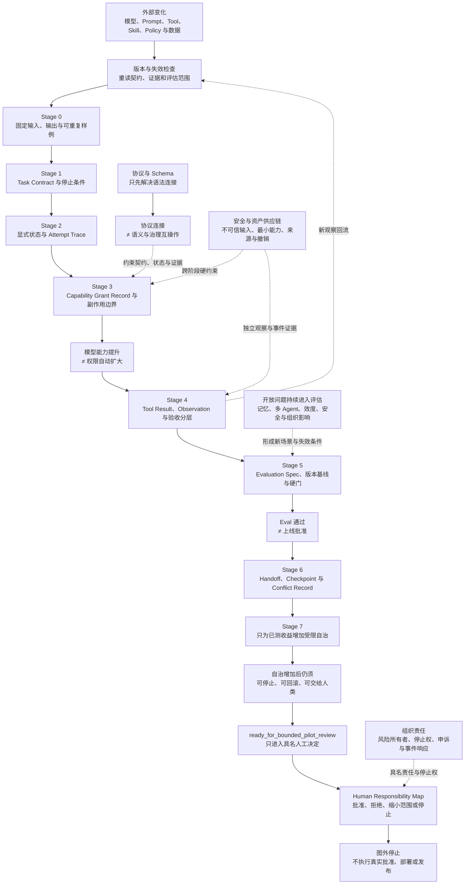

# 47. Agent Engineering 的未来与结语

> 模型会变，工具会变，协议会变；目标、边界、状态、证据和责任不会因为能力增强而自动消失。Agent Engineering 的成熟，不是让系统看起来更自主，而是让它更诚实地说明自己能做什么、做过什么、还不知道什么，以及谁为下一步负责。

## 本章目标

- [ ] 区分动态产品实现与相对稳定的工程责任，不把当前能力写成未来保证。
- [ ] 用任务、上下文、能力、状态、证据、评估与人类责任七个问题审查 Agent 系统。
- [ ] 将模型、长时程状态、多 Agent、评估、安全、供应链和组织影响保留为可调查的开放问题。
- [ ] 用五层标准化阶梯区分语法连接、契约、状态、证据和治理互操作。
- [ ] 把一次性脚本沿最小阶段升级为可停止、可验证、可接力的受限 Harness。
- [ ] 为自己的下一项低风险任务写出实践路线、失败出口和完成证据。

## 为什么要学

Agent 领域变化很快。更长的上下文、新的工具接口、更强的模型、更方便的 Agent SDK 和更多协议不断出现。面对这种速度，团队容易产生两种看似相反、实际相同的反应。

第一种反应是追逐演示。只要模型能完成一次复杂任务，就立即扩大工具、权限和自治范围；失败时再增加 Prompt、Agent 或审查层。第二种反应是放弃长期结构：既然模型下个月还会变化，今天就只写一个脚本，等“技术稳定”后再补状态、测试和治理。

两种反应都把变化当作免除工程责任的理由。前者让能力领先于边界，后者让临时方案没有可升级接口。真正耐久的做法不是预测具体模型，而是把变化纳入设计：为模型、Prompt、Tool、Skill、策略和评估保存版本；在执行前限制能力；在执行后保存独立观察；在发布前比较回归；在交接时写清未知；在外部效果前保留人类决定。

OpenAI 当前 API Overview 明确提示，模型的 Prompt 行为可能在快照间变化，并建议固定模型版本、运行 evals [REF-014]。这是一个产品特定例子，不代表所有供应商行为，也不意味着固定版本会产生确定输出。它支持的更一般教训是：模型行为不是无需验证的稳定接口。

本章不会回答“未来最强模型是谁”或“完全自治何时到来”。它回收全书 46 章，给出一套能在变化中继续使用的责任框架、开放问题清单和实践路线。

## 前置知识

- 第 1 至 4 章：从 Prompt 到 Harness，以及可靠系统的任务、状态和证据边界。
- 第 5 至 14 章：Instructions、Context、Memory、Skill、Workflow、Tool、权限、检索和人在回路（Human-in-the-loop）。
- 第 15 至 20 章：Observation、Reflection、Evaluation、Recovery、Compaction 与自改进边界。
- 第 21 至 35 章：项目规则、自动化、浏览器、多 Agent、Git、交付、测试、故障、记忆和企业架构。
- 第 36 至 42 章：设计模式、评估、成本、安全和版本化。
- 第 43 至 46 章：Book Harness、内容工厂、跨工具接力和多媒介派生。
- 不要求：预测模型路线、运行真实 Agent、拥有生产权限或采用特定框架。

## 场景引入：一个仍然“能跑”的脚本

**场景：** 团队有一个脚本：读取用户输入，调用模型选择工具，再把结果返回。过去一个月它在演示数据上工作正常。模型快照、Tool Schema 和一项 Skill 最近更新，脚本仍能输出内容，于是团队准备给它生产写权限。

**缺口：** 没有任务契约（Task Contract），不知道输入变化是否仍在范围内；没有能力授予记录（Capability Grant Record），不知道模型选择的目标和副作用是否允许；没有状态机，超时后不知道能否重试；只有工具结果（Tool Result），没有独立观察；评估集没有版本；没有交接包（Handoff Package）；上线批准写成一个来源不明的布尔值。

**成功标准：** 团队不从“脚本还能输出”推导“仍然兼容”或“可以上线”，而是沿契约、状态、能力、观察、评估、交接和责任逐层补齐最小证据。最终状态最多是 `ready_for_bounded_pilot_review`。

**边界：** 这是虚构教学案例。本章不调用模型或工具，不更改权限，不启动 Pilot，不部署、发布或访问生产数据。

## 七项相对稳定的工程责任

产品 API、文件名和框架可以改变；系统仍要回答以下七类问题。

### 任务契约：系统为何行动

Task Contract 至少包含目标、非范围、输入/输出契约、完成定义、停止条件和责任者。缺少它时，系统无法区分“用户希望得到什么”和“模型恰好能做什么”。

任务契约不是长 Prompt。Prompt 可以承载部分指令，但任务的验收、权限和外部责任必须能被其他组件和审查者读取。无范围时，正确状态是 `needs_scope`，不是让模型自行扩展目标。

### 上下文边界：系统凭什么判断

上下文包（Context Packet）、证据卡（Evidence Card）、记忆记录（Memory Record）和知识库条目（Knowledge Base Entry）分别回答当前输入、事实证据、跨任务候选和可检索材料。它们必须保存来源、作用范围、版本、新鲜度、可见主体和撤销条件。

更多上下文不等于更可靠。旧事实、错误权限、被注入的网页和无来源摘要也可以填满窗口。上下文不明时返回 `needs_context_evidence`，而不是用语言流畅度掩盖未知。

### 能力边界：系统被允许改变什么

工具契约（Tool Contract）描述能力接口，能力授予记录描述本次任务对哪个目标、哪类副作用、在何预算和批准下可调用。工具“可见”不等于任务“获准使用”。

边界应在调用前检查，结果不能倒推授权。一个删除动作最终失败，也不表示候选调用合理；一个只读调用成功，也不自动允许后续写入。授权不足时必须 `not_authorized`。

### 状态与恢复：系统现在在哪里

计划、运行、等待批准、停止、失败、恢复和完成需要不同状态及转换证据。检查点（Checkpoint）保存可恢复输入，尝试轨迹（Attempt Trace）保存一次尝试，交接包支持换执行者；三者不能被一个“历史摘要”替代。

恢复还要回答幂等性、外部效果和输入漂移。无法判断上次动作是否生效时，不能盲目重试，应进入 `state_unknown` 或 `effect_unknown`。

### 观察与证据：系统实际发生了什么

工具结果是工具报告，观察（Observation）是独立读取到的环境状态，验收将观察与输出契约比较。调用返回 200、命令退出 0、文件存在和业务目标达成都可能是不同结论。

证据还需要版本、时间、命令、范围和未覆盖项。没有新鲜观察时，系统最多说明“请求已发送”或“工具报告成功”，不能写“外部效果已完成”。

### 评估与变更：变化是否仍可接受

评估规格（Evaluation Spec）定义任务、输入分布、预期行为、评分方法、硬性门和责任者；回归矩阵（Regression Matrix）比较 Harness、模型、工具、数据和评分器版本。关键身份不同且没有桥接证据时，结论是 `not_comparable`。

OpenAI 当前评估指南强调生成式系统的可变性，以及任务特定、典型/边缘/对抗样例、持续评估和人工校准 [REF-117]。该页面同时包含具体产品平台的停用信息；本章只使用平台无关的设计背景，不依赖产品操作或固定阈值。

### 人类责任：谁有权说“继续”

人类责任不是在流程图末尾画一个人形图标。决定记录（Decision Record）至少要保存主体、角色、输入版本、决定范围、理由、有效期、例外和撤销条件。

NIST AI RMF 1.0 将 AI 风险管理组织为 GOVERN、MAP、MEASURE、MANAGE，并定位为自愿、非行业特定、跨生命周期框架 [REF-063]。它为治理贯穿系统生命周期提供背景，不为本项目指定角色、门禁或法规义务。具体责任仍由组织和受影响场景决定。

### 七项责任速查

| 责任 | 最小工件 | 最小问题 | 缺口状态 |
| --- | --- | --- | --- |
| 任务 | Task Contract | 目标、非范围、完成和停止是什么？ | `needs_scope` |
| 上下文 | Context Packet / Evidence Card | 输入来自哪里、谁可见、何时失效？ | `needs_context_evidence` |
| 能力 | Tool Contract / Capability Grant Record | 可对哪个目标产生何种副作用？ | `not_authorized` |
| 状态 | Workflow State / Checkpoint / Handoff | 当前阶段、重试和接力依据是什么？ | `state_unknown` |
| 证据 | Attempt Trace / Observation | 实际发生什么，能证明到哪？ | `effect_unknown` |
| 评估 | Evaluation Spec / Regression Matrix | 哪些版本和硬门可比较？ | `not_comparable` |
| 责任 | Decision Record / Responsibility Map | 谁批准、停止、申诉和响应事件？ | `approval_required` |

这些工件名是本书工程模型，不是行业标准。真正稳定的是它们回答的问题。

## 必须保持开放的七类问题

### 模型能力与行为边界

未来模型可能改变推理、工具使用、长上下文和多模态能力。开放问题不是把每次发布转成排行榜，而是：

- 哪些 Task Contract 仍然有效？
- Prompt、Tool Schema 与评分器是否需要新版本？
- 旧回归集能否代表新失败模式？
- 能力改善是否伴随拒绝、安全或成本回归？
- 何时必须回到人工处理？

CH47-REF-01 只能支持当前 OpenAI 产品中的变化提醒；任何其他模型都需要自己的新鲜证据。

### 长时程状态与记忆

会话历史、长上下文、压缩摘要、长期 Memory、知识库和工作流状态各有不同责任。仍待解决的问题包括：

- 压缩后如何证明关键约束没有丢失；
- 旧记录何时过期、冲突或被撤销；
- 跨工具接力如何保留身份而不复制隐藏状态；
- 隐私、删除和审计如何与长期可用性平衡；
- 系统怎样知道自己缺少什么，而不是编造连续性。

“无限记忆”即使技术上可存储，也不能替代来源、作用范围和读取授权。

### 多 Agent 协调

更多 Agent 可以并行研究或从不同角度审查，也会增加共享写入、输入漂移、重复工作、冲突和集成成本。关键开放问题是：

- 子任务是否真的独立；
- 输出所有权是否重叠；
- 子 Agent 是否看到同一输入版本；
- 冲突候选按什么证据比较；
- 递归委派在哪里停止；
- 协调成本何时超过并行收益。

“多个模型一致”不等于结论为真；它们可能共享同一盲点、Prompt 或来源。

### 评估效度

更多测试不自动带来更有效的评估。系统仍需面对：

- 离线数据是否代表真实任务分布；
- 稀有安全失败如何进入套件；
- 模型评分器与人工 rubric 如何校准；
- 隐私限制下如何使用生产观察；
- 长任务和外部效果怎样延迟验收；
- 成本、延迟、正确、安全和用户价值如何避免被一个总分掩盖。

评估的目标是支持具体决定，不是制造一个看起来客观的数字。

### 安全工具生态

工具更多、输入更多时，攻击面随之扩大。OWASP 的动态指南讨论直接和间接提示注入（Prompt Injection），以及它们对数据、工具、记忆和行为的影响 [REF-125]。该指南提醒团队采用纵深防御，但不提供万能过滤器。

未来安全设计仍需组合：不可信内容隔离、最小能力、目标约束、参数验证、敏感数据最小化、高风险批准、结果观察、审计和事件响应。任何一层都不能单独证明风险已消除。

### Agent 资产供应链

Prompt、Skill、Tool Schema、MCP Server、模型、依赖、评估集和策略都会影响有效行为。团队需要知道它们来自哪里、谁审查、怎样构建/分发、哪些版本生效、如何撤销，以及变化会使哪些证据失效。

SLSA v1.2 展示软件供应链从生产者、源码、构建、发布、分发、包选择到依赖的完整性威胁，并明确不覆盖列出的全部威胁 [REF-129]。本章只做受限类比：Agent 资产登记（Agent Asset Register）需要供应链视角，但 Agent 风险不等同软件包风险，来源证明（provenance）也不等于安全。

### 组织与专业责任

目标、数据、权限、部署范围、申诉、事件响应和停用由组织决定。开放问题包括：

- 哪些任务根本不应自动化；
- 谁代表受影响者参与设计；
- 谁能停止高风险系统；
- 独立审查如何避免利益冲突；
- 失败和申诉怎样进入改进而不伤害个体；
- 能力、成本和工作重组怎样影响团队职责。

人在回路不是答案；具名角色、权限、输入版本和决定记录才是可审查接口。

## 标准化的五层阶梯

Agent 互操作常从协议和 Schema 开始，但“消息能传递”只解决最外层问题。

### 第一层：语法

字段可解析，版本可识别，编码和传输成功。这一层能发现格式错误，不能解释字段含义。

### 第二层：契约

输入、输出、错误、副作用、目标、幂等和超时语义明确。两个 Tool 都有 `delete` 方法，不表示目标范围、软删除或恢复策略相同。

### 第三层：状态

计划、候选、已调用、工具报告、独立观察、验证、停止和完成不会互相冒充。

例如两个系统都返回 `success`：系统 A 表示请求被 API 接收；系统 B 表示业务效果已独立观察。语法和字段名相同，状态语义仍不兼容。

### 第四层：证据

来源、调用、观察、版本、时间、未覆盖项和责任可追溯。证据层还要说明哪些结论不能从当前记录推出。

### 第五层：治理

权限、隐私、审计、例外、撤销、事件响应和人类决定能够执行。治理兼容不可能由一个共享 JSON Schema 自动产生。

### 怎样判断标准价值

一个标准或协议值得采用，不只因为生态大、字段多或 Demo 快，而要看：

- 是否保留失败与效果未知；
- 是否支持版本和能力发现；
- 是否能限制目标和副作用；
- 是否可关联独立观察；
- 是否能表达未覆盖项和责任；
- 是否允许撤销、升级和人工接管。

这不是要求一个协议解决所有层，而是要求团队知道它解决到哪里。

## 演进案例：从一次性脚本到受限 Harness

Anthropic 的工程文章建议从最简单可行方案开始，只在需要时增加复杂度，并区分预定义工作流（workflow）与动态智能体（agent）[REF-029]。本章据此采用“第一层能承受风险就停止”的方向；以下阶段、状态和工件是全书综合，不来自该文章。

### Stage 0：固定一个可重复样例

一次性脚本先明确输入、输出和一个可重复样例。此时只能证明给定环境的一次运行，不谈自治、长期记忆或生产权限。

### Stage 1：写 Task Contract

加入目标、非范围、输出契约、停止条件和责任者。无效输入必须在调用模型或 Tool 前停止。

### Stage 2：显式状态与 Attempt Trace

用 `planned`、`running`、`stopped`、`failed`、`succeeded` 等受限状态记录转换与原因。Attempt Trace 关联任务版本、输入摘要、决定和未覆盖项。

### Stage 3：能力与副作用边界

加入 Tool Contract、目标范围、允许副作用、预算和批准。系统只获得当前任务需要的最小能力，不能根据模型建议自动扩权。

### Stage 4：Result、Observation 与验收分层

工具结果与环境观察分别保存。调用成功但效果不明时返回 `effect_unknown`，等待读取或人工检查，而不是重试写入。

### Stage 5：版本化评估与回归门

建立正常、拒绝、边界和故障场景；记录 Harness、模型、Tool、数据与评分器版本。单一平均分不能覆盖权限和安全硬门。

### Stage 6：交接、恢复与冲突

用 Context/Handoff Package、Checkpoint 和 Conflict Record 让另一人或工具在不依赖原聊天的情况下恢复。接手者重新验证输入和状态，不盲信摘要。

### Stage 7：只为已测收益增加受限自治

只有任务分解确实依赖新发现、动态决策收益可测、权限/预算/停止/回滚有效时，才增加 agent 驱动的路由或规划。终点是 `ready_for_bounded_pilot_review`，仍需具名人类决定。

### 阶段总表

| 阶段 | 新增责任 | 当前能证明 | 仍不能证明 |
| --- | --- | --- | --- |
| 0 | 输入、输出、固定样例 | 一次可重复运行 | 范围、权限、稳定性 |
| 1 | Task Contract | 无效任务可停止 | Tool 安全、效果完成 |
| 2 | 状态与 Trace | 转换和原因可追溯 | 外部效果、可恢复性 |
| 3 | Capability Boundary | 越权候选调用前停止 | Tool 正确、结果真实 |
| 4 | Observation / Acceptance | Result 与效果分开 | 多次运行稳定 |
| 5 | Eval / Regression | 指定版本可比较 | 线上分布、组织批准 |
| 6 | Handoff / Checkpoint | 可从工件接力 | 冲突自动正确解决 |
| 7 | Bounded Autonomy | 可进入有界 Pilot Review | 已上线、可长期自治 |

## 读者的下一步实践路线

### 选择低风险、可回滚的真实任务

第一个 Harness 任务应有可检查输入、可回滚输出和具名责任者。只读文档核对、生成候选报告或验证结构化配置，通常比删除、付款、发布和生产写入更适合作为起点。

### 先写失败出口

在正常流程前写出：缺输入、缺权限、Tool 失败、效果未知、评估不可比和需要人工批准时返回什么。无法解释停止原因的系统不应扩大权限。

### 保留一条最小 Attempt Trace

记录任务版本、输入摘要、候选计划、能力请求、工具结果、独立观察、验收、未覆盖和下一步。日志只收集必要字段，不复制秘密或受限内容。

### 建立最小回归集

至少覆盖正常、拒绝、边界和故障场景。预期值来自 Task Contract 和独立推导，而不是调用被测实现计算答案。

### 让另一个执行者接手

把目标、规则、状态、证据、未知和下一任务写进仓库，让另一人或工具在不读原聊天的情况下恢复。接力失败会揭示隐式依赖。

### 只为真实失败增加复杂度

当任务规模、协调或恢复问题实际出现，再加入并行、长期 Memory、动态路由或多 Agent。每次增加只有一个主要假设、一个基线、一组不可降级项和一个回退路径。

## 演进地图：能力变化下仍保留责任断点

> 图示替代描述：外部的模型、Prompt、Tool、Skill、Policy 与数据变化先进入版本和失效检查，再从固定样例沿 Task Contract、状态与 Attempt Trace、Capability Grant Record、Result/Observation/验收、Evaluation Spec、交接/检查点/冲突记录和受限自治逐级演进。模型能力提升与权限扩大之间、协议连接与语义/治理互操作之间、Eval 通过与上线批准之间各有显式断点。受限自治之后仍必须保留停止、回滚和人工接力，最多进入 `ready_for_bounded_pilot_review` 与具名 Human Responsibility Map；图外不执行真实批准、部署或发布。安全/资产供应链、组织责任与开放问题作为跨阶段约束和新评估输入。

图源：[Mermaid](../../diagrams/mermaid/chapter-47-agent-engineering-evolution-map.mmd)；导出：[SVG](../../diagrams/exported/chapter-47-agent-engineering-evolution-map.svg) / [PNG](../../diagrams/exported/chapter-47-agent-engineering-evolution-map.png)。

这张图只说明复杂度如何在证据和责任之后增加。Mermaid 可渲染、节点可读或评估记录存在，都不能证明真实权限、安全、组织批准、部署或长期自治已经成立。

## 最小示例：Agent Engineering 准备度审查

本章的 [`assessAgentEngineeringReadiness`](../../examples/agent/agent-engineering-readiness-assessment.mjs) 只读取调用者注入的：

- `taskContract`
- `contextBoundary`
- `capabilityBoundary`
- `stateModel`
- `observationEvidence`
- `evaluationEvidence`
- `handoffEvidence`
- `riskOwnership`
- `autonomyRequest`

候选返回包括 `needs_contract`、`needs_context_evidence`、`needs_capability_boundary`、`state_not_ready`、`needs_effect_evidence`、`evaluation_not_comparable`、`handoff_not_ready`、`human_accountability_required`、`autonomy_not_justified` 和 `ready_for_bounded_pilot_review`。

[`示例计划与运行记录`](47-agent-engineering-future-and-conclusion.example-plan.md) 保存严格 TDD 证据：测试先因实现模块不存在而以 `ERR_MODULE_NOT_FOUND` 失败；最小实现完成后，11 项测试全部通过。演示返回 `ready_for_bounded_pilot_review / bounded_pilot_evidence_ready / request_named_human_decision`，并固定 `executionPerformed: false`。

这些结果只证明纯内存教学函数对虚构对象的确定性判断。示例不调用模型或 Tool，不读取系统，不修改权限，不部署、发布或启动 Agent，也不证明任何组织已具备对应角色或治理能力。

## 工程实践

### 为所有可变输入保存版本

不仅模型需要版本。Prompt、Tool Schema、Skill、Policy、知识库快照、评估集、评分器和 Adapter 都会改变行为。版本缺失时，比较结论必须降级。

### 让硬门独立于总分

权限越界、敏感数据泄露、结果状态错误和不可回滚副作用不能被其他任务高分抵消。硬门失败应直接停止候选。

### 将“未知”保留为正式状态

`effect_unknown`、`not_comparable`、`needs_evidence` 和 `approval_required` 不是体验问题，而是阻止叙述超越证据的安全接口。

### 把复杂度写成可撤销假设

增加多 Agent、Memory 或动态路由时，记录基线、预期收益、风险、验证方法、停止和回退。如果收益未出现，应能删除复杂度。

### 同时审查系统和组织

技术上正确的 Tool 调用仍可能服务错误目标；低错误率系统仍可能缺少申诉、停用和责任。评估报告应同时保留技术证据和组织决定边界。

## 常见错误

| 错误 | 后果 | 根因 | 修正 |
| --- | --- | --- | --- |
| 用当前 Demo 写未来路线。 | 动态产品事实被固化为承诺。 | 把能力展示当稳定接口。 | 记录版本、日期、评估与不可外推。 |
| 模型更强就开放更多 Tool。 | 能力变化直接变成权限变化。 | 没有 Capability Grant Record。 | 权限由任务与风险决定。 |
| 多 Agent 投票替代证据。 | 共享盲点被包装成共识。 | 把重复输出当独立观察。 | 回链来源、环境和验收。 |
| 协议连通就宣称互操作。 | 状态和效果语义冲突。 | 只检查语法层。 | 逐层核对契约、状态、证据和治理。 |
| Eval 总分覆盖安全失败。 | 高危回归进入候选。 | 没有硬性门。 | 分组指标与硬门独立。 |
| “有人审查”没有具名记录。 | 决定无法追责或撤销。 | 人在回路被当成布尔值。 | 保存主体、版本、范围、理由、有效期。 |

## 安全与组织边界

- 模型输出、网页、文档、日志、Issue 和 Tool Result 都可能是不可信内容；进入指令、记忆或外部动作前需要分类和约束。
- Tool 可用性与任务授权分开；高风险副作用需要独立批准和效果观察。
- 长期记录、评估数据和 Trace 可能包含个人、客户或秘密信息；只保存必要字段并定义保留、删除和访问责任。
- Skill、MCP Server、依赖和模型属于有效供应链的一部分；来源、版本和撤销不明时不得默认启用。
- 组织应明确停止权、事件响应、申诉和受影响者，而不是把它们留给模型判断。
- 本章未执行威胁建模、安全测试、权限检查或供应链验证，不能作为系统安全证明。

## 结语：从更好的 Prompt，到更可负责的系统

本书从一个看似简单的问题开始：为什么 Prompt 写得越来越长，系统仍然不可靠？答案不是 Prompt 不重要，而是 Prompt 只承担输入的一部分。任务目标、上下文来源、长期状态、工具能力、执行证据、评估、失败恢复、变更控制和人类责任，都需要 Prompt 之外的工程接口。

Harness 把这些责任显式化。它不保证模型永远正确，也不会消除不确定性。它做的是把不确定性放在可见位置：缺来源就停止，缺权限就拒绝，效果未知就继续观察，版本不同就拒绝比较，风险无人承担就要求人类决定。

未来模型可能完成今天难以想象的任务。能力越强，这些边界越不是负担。一个能够改变更多外部状态的系统，更需要知道目标来自谁、依据是什么、权限到哪里、结果如何观察、失败如何恢复、变化怎样评估，以及谁能让它停下。

Agent Engineering 因此不是“让 Agent 更像人”，而是让由模型参与的系统具备软件工程、知识工程、安全工程和组织治理共同要求的可审查性。成熟度也不由自治级别衡量，而由四件事衡量：外部效果是否可控，失败是否可见，证据是否可追溯，责任是否可承担。

这份 First Draft 写成时，第 43 至 47 章仍在后续审查流程中，全仓最终校验尚未运行。因此这里不能声称全书已经完成、可出版或已交付。最终完成结论必须由 47 章阶段状态、共享上下文、目录、示例、图示和新鲜全仓验证共同证明。

读完本书后，最有价值的下一步不是再收藏一个框架，而是选择一个低风险真实任务，为它写第一份 Task Contract、第一条保守停止、第一份独立 Observation 和第一组回归场景。让另一个人能从工件接手，让一次失败能成为可复现证据，让任何外部效果都有具名责任者。那一刻，Prompt 才真正进入 Harness。

## 练习

1. 选一个当前脚本，用七项稳定责任表标记已具备、缺失和证据不足的部分。
2. 为一次模型快照或 Tool Schema 变化写失效矩阵，列出必须重跑的评估和不能比较的结论。
3. 用五层标准化阶梯审查一个 Tool/MCP/Agent 集成，指出它实际解决到哪一层。
4. 把一个高风险自动化请求改写成 Stage 0 至 Stage 4 的受限路线，每阶段写完成证据和停止条件。
5. 为你的系统列出风险所有者、批准者、停止者、申诉入口和事件响应者；不要用“人工”作为角色名。
6. 从一次真实失败建立一个新的回归场景，说明其来源、版本、预期值和硬门。

## 延伸阅读

- [第 1 章：从 Prompt Engineering 到 Harness Engineering](../part-01-foundations/01-prompt-to-harness.md)
- [第 17 章：Evaluation 与可验证结果](../part-03-intelligence-loop/17-evaluation-and-verifiable-results.md)
- [第 35 章：企业级 Harness 架构](../part-05-case-studies/35-enterprise-harness-architecture.md)
- [第 41 章：安全、权限与审计](../part-06-design-and-evaluation/41-security-permissions-and-audit.md)
- [第 43 章：用 Harness 写一本技术书](43-writing-a-technical-book-with-harness.md)
- [第 46 章：从书籍扩展到课程、博客和知识库](46-books-to-courses-blogs-and-knowledge-bases.md)
- [附录入口](../appendices/README.md)
- [本章 Research Brief](47-agent-engineering-future-and-conclusion.research.md)
- [本章参考资料](47-agent-engineering-future-and-conclusion.references.md)

## 参考资料

- [REF-014] OpenAI API Overview：模型 Prompt 行为跨快照变化与固定版本/evals 的当前产品建议。
- [REF-029] Anthropic Building effective agents：从简单方案开始及 workflow/agent 的文章内区分。
- [REF-117] OpenAI Evaluation best practices：可变系统的任务特定、持续和人工校准评估背景。
- [REF-063] NIST AI RMF 1.0：自愿、跨生命周期的 GOVERN、MAP、MEASURE、MANAGE 风险框架背景。
- [REF-125] OWASP Prompt Injection Prevention：直接/间接注入和纵深防御背景。
- [REF-129] SLSA v1.2 Supply chain threats：软件供应链完整性威胁与覆盖边界。

## 章节完成检查表

- [x] Front matter、学习目标、前置知识、章节依赖与非范围已写明。
- [x] 六项来源、本书综合、虚构案例和未运行范围保持分层。
- [x] 七项稳定责任有工件、问题和保守失败状态。
- [x] 七类开放问题没有变成未来预测或统一答案。
- [x] 五层标准化不把语法连接写成治理互操作。
- [x] 一次性脚本演进路线停在 `ready_for_bounded_pilot_review`。
- [x] 读者实践路线有低风险任务、失败出口、Trace、回归和接力。
- [x] Technical Review 已完成；既有 Evaluation Spec 与 Capability Grant Record 术语已恢复，七项责任、开放问题、标准化阶梯和未运行边界已复核。
- [x] 纯内存示例已按 TDD 实现；11 项测试与无副作用演示已实际运行。
- [x] Mermaid 演进地图已创建、导出并完成视觉审查；正文图块与图源逐字一致。
- [x] Fact Check 已完成；六项来源、本书模型、示例、图示和当前未运行范围已逐项复核。
- [x] Language Editing 已完成；术语首现、来源主语、长句、阶段时态和中英文间距已复核。
- [x] Final Review 已完成；章节专属正文、来源、示例、图示、审查记录与未运行边界一致，可进入最终全仓 Validation。
- [x] 最终全仓 Validation、共享状态同步与章节完成判定已执行并通过。
